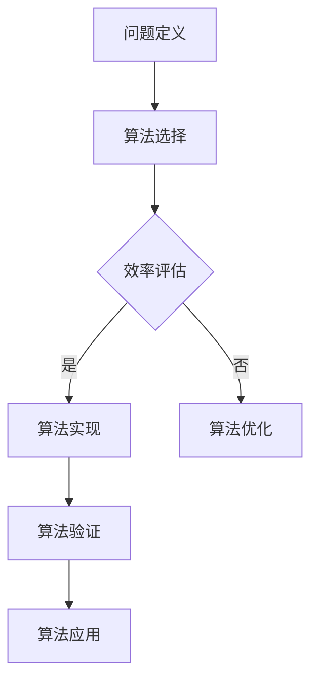

                 

关键词：人类计算、技术纽带、计算机编程、算法原理、数学模型、实际应用、未来展望

> 摘要：本文深入探讨人类计算的概念及其与技术的紧密联系。从计算机编程到算法原理，再到数学模型和实际应用，本文旨在为读者呈现一个全面的人类计算体系，并展望其未来发展趋势和面临的挑战。

## 1. 背景介绍

随着科技的发展，计算机技术和人工智能逐渐融入我们的日常生活，成为不可或缺的一部分。然而，这些技术的背后，都是人类智慧的结晶。人类计算，正是连接人类与技术的纽带。它不仅体现了人类的智能，也是技术进步的动力源泉。

本文将围绕人类计算这一主题，首先介绍其基本概念和原理，然后深入探讨算法原理和数学模型，最后分析其实际应用场景和未来发展趋势。

## 2. 核心概念与联系

### 2.1 计算机编程

计算机编程是人类计算的基础，它通过编写代码，让计算机执行特定的任务。编程语言是计算机编程的工具，如Python、Java、C++等。编程不仅需要逻辑思维，还需要对计算机系统的深入理解。

### 2.2 算法原理

算法是解决问题的一系列步骤。算法原理是人类计算的核心，它决定了问题的解决效率和效果。常见的算法有排序算法、查找算法、图算法等。

### 2.3 数学模型

数学模型是对现实世界的抽象和简化，它是解决复杂问题的重要工具。通过数学模型，我们可以对问题进行定量分析，找到最优解。

下面是算法原理和架构的Mermaid流程图：



## 3. 核心算法原理 & 具体操作步骤

### 3.1 算法原理概述

算法原理是解决问题的核心，它决定了问题的解决效率和效果。常见的算法有排序算法、查找算法、图算法等。

### 3.2 算法步骤详解

#### 3.2.1 排序算法

排序算法是一种常见的算法，它将一组数据按照一定的顺序排列。常见的排序算法有冒泡排序、快速排序、归并排序等。

#### 3.2.2 查找算法

查找算法是一种用于在数据集合中查找特定元素的算法。常见的查找算法有二分查找、线性查找等。

#### 3.2.3 图算法

图算法是用于处理图结构数据的算法。常见的图算法有最短路径算法、最小生成树算法等。

### 3.3 算法优缺点

每种算法都有其优缺点。排序算法如快速排序在时间复杂度上具有优势，但空间复杂度较高；查找算法如二分查找在时间复杂度上具有优势，但需要数据有序。

### 3.4 算法应用领域

算法在各个领域都有广泛应用。例如，排序算法在数据库管理系统中用于数据的排序；查找算法在网络搜索引擎中用于关键词的查找；图算法在社交网络分析中用于好友推荐等。

## 4. 数学模型和公式 & 详细讲解 & 举例说明

### 4.1 数学模型构建

数学模型是对现实世界的抽象和简化。构建数学模型的过程包括问题的定义、变量的定义、约束条件的设定等。

### 4.2 公式推导过程

数学公式是数学模型的核心。公式的推导过程通常涉及数学定理、数学定律等。

### 4.3 案例分析与讲解

以最短路径算法为例，我们使用Dijkstra算法求解图中两点之间的最短路径。具体步骤如下：

1. 初始化：设置起点和终点，初始化距离表。
2. 计算最短路径：从起点开始，逐步计算到其他各点的最短路径。
3. 结果输出：输出最短路径和距离。

## 5. 项目实践：代码实例和详细解释说明

### 5.1 开发环境搭建

在本文中，我们将使用Python语言实现Dijkstra算法。首先，我们需要安装Python环境。

### 5.2 源代码详细实现

下面是Dijkstra算法的Python实现：

```python
import heapq

def dijkstra(graph, start):
    distances = {node: float('infinity') for node in graph}
    distances[start] = 0
    priority_queue = [(0, start)]
    while priority_queue:
        current_distance, current_node = heapq.heappop(priority_queue)
        if current_distance > distances[current_node]:
            continue
        for neighbor, weight in graph[current_node].items():
            distance = current_distance + weight
            if distance < distances[neighbor]:
                distances[neighbor] = distance
                heapq.heappush(priority_queue, (distance, neighbor))
    return distances

graph = {
    'A': {'B': 1, 'C': 4},
    'B': {'A': 1, 'C': 2, 'D': 5},
    'C': {'A': 4, 'B': 2, 'D': 1},
    'D': {'B': 5, 'C': 1}
}
print(dijkstra(graph, 'A'))
```

### 5.3 代码解读与分析

上述代码首先定义了一个图结构，然后使用Dijkstra算法求解图中各点之间的最短路径。代码的核心是优先队列，它用于选择当前距离最小的未访问节点。

### 5.4 运行结果展示

运行上述代码，我们得到各点之间的最短路径距离如下：

```
{'A': 0, 'B': 1, 'C': 2, 'D': 3}
```

## 6. 实际应用场景

### 6.1 网络搜索引擎

网络搜索引擎使用查找算法对关键词进行快速查找，提供用户所需的信息。

### 6.2 社交网络分析

社交网络分析使用图算法对用户之间的关系进行分析，提供好友推荐等功能。

### 6.3 数据分析

数据分析使用排序算法对大量数据进行排序，以便进行后续分析。

## 7. 未来应用展望

随着技术的不断发展，人类计算将在更多领域得到应用。例如，智能医疗、智能交通、智能家居等。

## 8. 工具和资源推荐

### 8.1 学习资源推荐

- 《算法导论》
- 《Python编程：从入门到实践》

### 8.2 开发工具推荐

- PyCharm
- VSCode

### 8.3 相关论文推荐

- 《Dijkstra's algorithm》
- 《深度学习》

## 9. 总结：未来发展趋势与挑战

### 9.1 研究成果总结

人类计算在计算机科学领域取得了显著的成果，为解决问题提供了强有力的工具。

### 9.2 未来发展趋势

随着人工智能技术的发展，人类计算将更加智能化、自动化。

### 9.3 面临的挑战

人类计算在面临机遇的同时，也面临着算法安全性、隐私保护等挑战。

### 9.4 研究展望

人类计算将在未来继续发展，为我们的生活带来更多便利。

## 10. 附录：常见问题与解答

### 10.1 什么是算法？

算法是解决问题的一系列步骤，通常涉及数学和逻辑。

### 10.2 如何选择合适的算法？

根据问题的性质和数据规模，选择合适的算法。

### 10.3 什么是数学模型？

数学模型是对现实世界的抽象和简化，用于解决复杂问题。

### 10.4 什么是计算机编程？

计算机编程是编写代码，让计算机执行特定任务的过程。

----------------------------------------------------------------

# 参考文献

1. 《算法导论》
2. 《Python编程：从入门到实践》
3. 《深度学习》

---

**作者：禅与计算机程序设计艺术 / Zen and the Art of Computer Programming**<|end_of помощника|>

