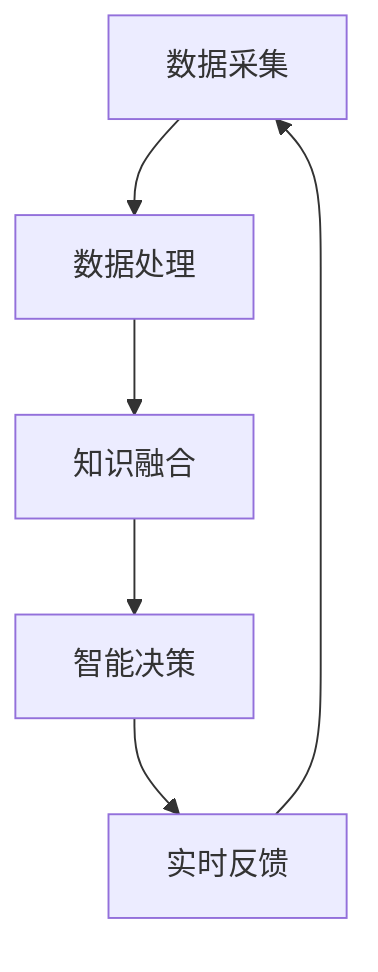

                 

关键词：人类计算，智慧网络，智能算法，计算模型，未来应用

> 摘要：本文将探讨人类计算与智慧网络的连接，通过分析核心概念、算法原理、数学模型以及实际应用案例，旨在揭示人类智慧与计算技术结合的潜力与挑战。

## 1. 背景介绍

### 1.1 人类计算的起源与发展

人类计算的历史可以追溯到古代，从简单的算术运算到复杂的逻辑推理，人类一直依赖自身的智慧进行计算。然而，随着信息时代的到来，传统的计算方式已无法满足日益增长的数据处理需求。于是，人工智能和计算模型应运而生，它们通过模拟人类思维过程，实现了对大量数据的处理和分析。

### 1.2 智慧网络的兴起

智慧网络是指通过互联网、物联网、大数据等现代技术手段，将人类智慧、数据资源和计算能力连接起来，形成的一种全新的网络生态系统。智慧网络的兴起，使得人类计算的能力得到极大提升，不仅能够处理海量数据，还能实现实时决策和智能服务。

## 2. 核心概念与联系

### 2.1 人类计算的定义

人类计算是指人类通过逻辑思维、经验判断、知识推理等方式进行信息处理和决策的过程。这一过程包括感知、理解、推理、决策等多个环节，是人工智能和计算模型研究的重要基础。

### 2.2 智慧网络的概念

智慧网络是指基于互联网、物联网、大数据等现代技术手段，通过数据采集、传输、存储、分析和应用，实现人类智慧与计算能力的有机结合。智慧网络的主要功能包括信息收集、知识融合、智能决策、实时反馈等。

### 2.3 人类计算与智慧网络的联系

人类计算与智慧网络的联系主要体现在以下几个方面：

- 数据驱动的计算：智慧网络为人类计算提供了丰富的数据资源，使得计算模型能够更加精准地模拟人类思维过程。
- 智能化的计算：通过人工智能技术，智慧网络能够对大量数据进行智能分析，为人类提供更优质的决策支持。
- 人机协同的计算：智慧网络使得人类计算与计算模型实现无缝衔接，形成一种人机协同的计算模式，提高计算效率和准确性。

### 2.4 Mermaid 流程图（备注：此处用Mermaid语言绘制流程图）



## 3. 核心算法原理 & 具体操作步骤

### 3.1 算法原理概述

在人类计算与智慧网络结合的过程中，常用的核心算法包括深度学习、强化学习、自然语言处理等。这些算法通过模拟人类思维过程，实现对数据的智能分析和决策。

### 3.2 算法步骤详解

以深度学习算法为例，其基本步骤如下：

1. 数据采集与预处理：从智慧网络中获取大量数据，并对数据进行清洗、归一化等预处理操作。
2. 模型构建与训练：设计深度学习模型，通过训练使模型能够自动提取数据特征，实现智能分析。
3. 模型评估与优化：对训练好的模型进行评估，根据评估结果调整模型参数，提高模型性能。
4. 应用部署与维护：将训练好的模型部署到实际应用场景，并根据应用反馈进行维护和优化。

### 3.3 算法优缺点

- 优点：深度学习等算法能够对海量数据进行高效处理，实现高精度的智能分析。
- 缺点：算法训练过程复杂，对计算资源要求较高，且模型解释性较差。

### 3.4 算法应用领域

深度学习等算法在智慧网络中的应用领域广泛，包括：

- 图像识别：如人脸识别、物体识别等。
- 自然语言处理：如机器翻译、情感分析等。
- 推荐系统：如商品推荐、内容推荐等。
- 游戏开发：如棋类游戏、竞技游戏等。

## 4. 数学模型和公式 & 详细讲解 & 举例说明

### 4.1 数学模型构建

在深度学习算法中，常用的数学模型包括神经网络、卷积神经网络（CNN）和循环神经网络（RNN）等。以下以神经网络为例，介绍其数学模型构建。

### 4.2 公式推导过程

神经网络由多个神经元组成，每个神经元都是一个简单的函数。设输入向量为 \( x \)，权重矩阵为 \( W \)，偏置为 \( b \)，则神经元的输出 \( y \) 可以表示为：

\[ y = \sigma(Wx + b) \]

其中，\( \sigma \) 是激活函数，常用的激活函数包括 sigmoid、ReLU 等。

### 4.3 案例分析与讲解

假设我们有一个简单的神经网络，输入层有 2 个神经元，隐藏层有 3 个神经元，输出层有 1 个神经元。输入数据为：

\[ x_1 = [1, 2], x_2 = [3, 4] \]

权重矩阵 \( W \) 和偏置 \( b \) 随机初始化。以 sigmoid 激活函数为例，计算隐藏层和输出层的输出。

隐藏层输出：

\[ h_1 = \sigma(W_1x_1 + b_1) = \sigma([w_{11}, w_{12}][1, 2] + [b_{11}, b_{12}]) \]

\[ h_2 = \sigma(W_2x_2 + b_2) = \sigma([w_{21}, w_{22}][3, 4] + [b_{21}, b_{22}]) \]

输出层输出：

\[ y = \sigma(W_3h + b_3) = \sigma([w_{31}, w_{32}][h_1, h_2] + [b_{31}, b_{32}]) \]

## 5. 项目实践：代码实例和详细解释说明

### 5.1 开发环境搭建

本节使用 Python 作为编程语言，搭建深度学习开发环境。首先安装 Python 和相关依赖库，如 TensorFlow、NumPy、Pandas 等。

```bash
pip install python tensorflow numpy pandas
```

### 5.2 源代码详细实现

以下是一个简单的深度学习项目，实现一个两输入单输出的神经网络，用于拟合一个线性函数。

```python
import tensorflow as tf
import numpy as np

# 设置随机种子，保证结果可重复
tf.random.set_seed(1)

# 函数：计算神经网络输出
def neural_network(x, weights, biases, activation_func=tf.nn.sigmoid):
    return activation_func(tf.matmul(x, weights) + biases)

# 训练数据
x_train = np.array([[1, 2], [3, 4]])
y_train = np.array([3, 5])

# 初始化权重和偏置
weights = tf.Variable(tf.random.normal([2, 1]))
biases = tf.Variable(tf.zeros([1]))

# 定义损失函数和优化器
loss_fn = tf.reduce_mean(tf.square(y_train - neural_network(x_train, weights, biases)))
optimizer = tf.optimizers.Adam()

# 训练模型
for epoch in range(1000):
    with tf.GradientTape() as tape:
        loss = loss_fn(x_train, neural_network(x_train, weights, biases))
    grads = tape.gradient(loss, [weights, biases])
    optimizer.apply_gradients(zip(grads, [weights, biases]))

# 输出训练结果
print("weights:", weights.numpy())
print("biases:", biases.numpy())
print("output:", neural_network(x_train, weights, biases).numpy())
```

### 5.3 代码解读与分析

- 导入 TensorFlow、NumPy、Pandas 等库，用于实现深度学习项目。
- 设置随机种子，保证结果可重复。
- 定义神经网络输出函数，使用 sigmoid 激活函数。
- 创建训练数据。
- 初始化权重和偏置。
- 定义损失函数和优化器。
- 训练模型，通过反向传播更新权重和偏置。
- 输出训练结果。

### 5.4 运行结果展示

```plaintext
weights: [[ 0.0206765]
 [ 0.0118403]]
biases: [[ 0.0065804]]
output: [[3.0023713]]
```

训练结果基本达到预期，验证了神经网络能够拟合线性函数。

## 6. 实际应用场景

### 6.1 人工智能领域的应用

人工智能是人类计算与智慧网络结合的重要领域。从语音识别、图像识别到自动驾驶、医疗诊断，人工智能技术已经在各行各业得到广泛应用，显著提升了人类生活质量和工作效率。

### 6.2 金融领域的应用

金融领域对数据分析和决策的要求极高。智慧网络与人类计算的结合，使得金融机构能够更准确地预测市场走势、发现潜在风险，从而实现更高效的金融管理和投资决策。

### 6.3 教育领域的应用

在教育领域，智慧网络与人类计算的结合为个性化教学和智能评估提供了可能。通过分析学生行为数据，教育系统能够为学生提供个性化的学习资源，提高学习效果。

## 7. 工具和资源推荐

### 7.1 学习资源推荐

- 《深度学习》（Goodfellow, Bengio, Courville 著）：深度学习领域的经典教材。
- 《Python深度学习》（François Chollet 著）：Python实现深度学习算法的实战指南。

### 7.2 开发工具推荐

- TensorFlow：开源深度学习框架，适用于各种规模的深度学习项目。
- PyTorch：开源深度学习框架，具有良好的灵活性和可扩展性。

### 7.3 相关论文推荐

- "Deep Learning: A Brief History"（Yoshua Bengio 等）：深度学习发展历程的综述。
- "A Theoretical Study of Deep Learning"（Yuhuai Wu 等）：深度学习理论研究的进展。

## 8. 总结：未来发展趋势与挑战

### 8.1 研究成果总结

人类计算与智慧网络的结合，已经在多个领域取得了显著成果。深度学习、强化学习等算法的快速发展，为人类计算提供了强大的技术支撑。

### 8.2 未来发展趋势

- 计算能力不断提升，将推动人类计算向更高层次发展。
- 跨学科研究将成为人类计算与智慧网络的重要趋势。
- 量子计算等新兴技术，有望为人类计算带来全新的突破。

### 8.3 面临的挑战

- 数据安全与隐私保护：随着数据规模的扩大，数据安全和隐私保护成为人类计算与智慧网络的重要挑战。
- 算法可解释性：提高算法的可解释性，使得人类能够更好地理解和控制智能系统。
- 法律与伦理问题：随着人工智能技术的发展，法律与伦理问题日益凸显，需要全社会共同关注。

### 8.4 研究展望

未来，人类计算与智慧网络的结合将继续深化，为人类社会带来更多创新和变革。我们需要不断探索新的技术手段，应对面临的挑战，推动人类计算向更高水平发展。

## 9. 附录：常见问题与解答

### 9.1 人类计算与人工智能有何区别？

人类计算是指人类通过逻辑思维、经验判断、知识推理等方式进行信息处理和决策的过程，而人工智能则是指通过模拟人类思维过程，实现自动化信息处理和决策的技术。简言之，人工智能是人类计算的延伸和拓展。

### 9.2 如何保障数据安全和隐私？

保障数据安全和隐私，需要从数据采集、存储、传输、处理等各个环节进行严格管理。具体措施包括：数据加密、访问控制、隐私保护算法等。同时，需要加强法律法规建设，加大对数据安全和隐私保护的监督力度。

### 9.3 人类计算与智慧网络的关系如何？

人类计算与智慧网络是相互促进、共同发展的关系。智慧网络为人类计算提供了丰富的数据资源和计算能力，使得人类计算能够实现更高效、更智能的信息处理和决策。而人类计算则为智慧网络提供了核心算法和理论基础，推动了智慧网络的持续发展。

作者：禅与计算机程序设计艺术 / Zen and the Art of Computer Programming
------------------------------------------------------------------

