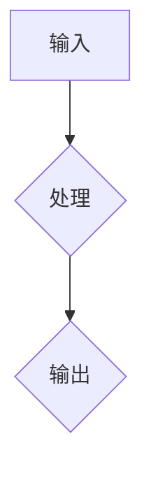
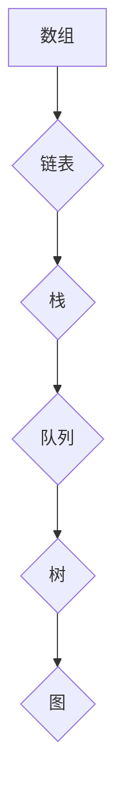

                 

关键词：人类计算、计算历史、算法、数学模型、人工智能、编程、软件开发、未来展望

摘要：本文旨在探讨人类计算的发展历程及其对现代科技的影响。从古代的计算工具到现代的计算机科学，人类计算经历了无数次变革和创新。本文将深入分析计算的核心概念、算法原理，并结合具体实例，探讨计算在各个领域的应用，最后展望未来计算的发展趋势和面临的挑战。

## 1. 背景介绍

### 1.1 人类计算的历史

人类计算的历史可以追溯到远古时代，当时人们使用简单的计数工具进行基本计算。随着文明的发展，计算工具和计算方法逐渐变得更加复杂和精确。例如，古代的算盘和计算机被广泛应用于商业和科学研究。

在中世纪，阿拉伯数字的发明极大地促进了计算的发展。阿拉伯数字系统以其简洁和直观的特点，使得复杂的数学运算变得更加容易。随后，计算机科学的诞生标志着人类计算进入了一个全新的时代。

### 1.2 人类计算的核心概念

人类计算的核心概念包括算法、数据结构、编程语言和软件工程。算法是解决问题的步骤集合，是计算的核心。数据结构则是组织和管理数据的方式，有助于提高算法的效率和准确性。编程语言则是用于编写算法和实现数据结构的工具。软件工程则是确保软件开发过程高效、可控的方法。

## 2. 核心概念与联系

### 2.1 算法的原理和架构

算法是计算的核心。其原理可以简单地概括为输入、处理和输出。算法的架构通常包括算法的输入、中间处理过程和输出结果。以下是一个简单的 Mermaid 流程图，展示了算法的基本架构：



### 2.2 数据结构的原理和架构

数据结构是组织和管理数据的方式。常见的有数组、链表、栈、队列、树和图等。以下是一个简单的 Mermaid 流程图，展示了数据结构的基本原理：



## 3. 核心算法原理 & 具体操作步骤

### 3.1 算法原理概述

算法可以分为多种类型，包括排序算法、查找算法、图算法等。每种算法都有其特定的原理和操作步骤。以下是一个简单的排序算法——冒泡排序的原理和步骤：

- 原理：冒泡排序通过多次遍历待排序的元素，每次遍历都会比较相邻的元素，并交换不满足顺序的元素，直到所有元素都满足顺序。
- 步骤：
  1. 从第一个元素开始，比较相邻的两个元素，如果第一个比第二个大（或小），就交换它们的位置。
  2. 遍历完所有的元素后，最大的元素会“冒泡”到数组的最后。
  3. 重复以上步骤，但不需要再考虑已经排好序的元素。

### 3.2 算法步骤详解

以下是一个冒泡排序的详细步骤：

- 初始化：假设有一个包含 n 个元素的数组 A。
- 第一次遍历：
  1. 从第一个元素开始，比较相邻的两个元素，如果第一个比第二个大（或小），就交换它们的位置。
  2. 遍历完成后，最大的元素（或最小的元素）会被交换到数组的最后一个位置。
- 第二次遍历：
  1. 从第一个元素开始，比较相邻的两个元素，如果第一个比第二个大（或小），就交换它们的位置。
  2. 遍历完成后，次大的元素（或次小的元素）会被交换到数组的倒数第二个位置。
- 重复以上步骤，直到所有的元素都满足顺序。

### 3.3 算法优缺点

- 优点：冒泡排序算法简单，易于理解。
- 缺点：冒泡排序的时间复杂度为 O(n^2)，在数据量较大时效率较低。

### 3.4 算法应用领域

冒泡排序算法常用于小型数据的排序。在实际应用中，例如搜索引擎排序、数据分析等领域，冒泡排序由于其简单性而被广泛采用。

## 4. 数学模型和公式 & 详细讲解 & 举例说明

### 4.1 数学模型构建

在计算领域，数学模型用于描述现实世界中的问题。一个简单的数学模型可以是一个线性方程或一个非线性方程。例如，一个简单的二次方程模型可以表示为：

$$
ax^2 + bx + c = 0
$$

### 4.2 公式推导过程

以下是一个简单的二次方程的求解公式推导过程：

$$
ax^2 + bx + c = 0 \\
x = \frac{-b \pm \sqrt{b^2 - 4ac}}{2a}
$$

### 4.3 案例分析与讲解

假设我们有一个二次方程：

$$
2x^2 + 3x + 1 = 0
$$

我们可以使用上面的公式求解：

$$
x = \frac{-3 \pm \sqrt{3^2 - 4 \cdot 2 \cdot 1}}{2 \cdot 2} \\
x = \frac{-3 \pm \sqrt{9 - 8}}{4} \\
x = \frac{-3 \pm \sqrt{1}}{4} \\
x = \frac{-3 \pm 1}{4}
$$

因此，我们得到两个解：

$$
x_1 = \frac{-3 + 1}{4} = -\frac{1}{2} \\
x_2 = \frac{-3 - 1}{4} = -1
$$

## 5. 项目实践：代码实例和详细解释说明

### 5.1 开发环境搭建

为了演示冒泡排序算法，我们将使用 Python 作为编程语言。首先，确保您已经安装了 Python 解释器。接下来，我们可以创建一个名为 `bubble_sort.py` 的文件。

### 5.2 源代码详细实现

下面是冒泡排序算法的 Python 实现代码：

```python
def bubble_sort(arr):
    n = len(arr)
    for i in range(n):
        for j in range(0, n-i-1):
            if arr[j] > arr[j+1]:
                arr[j], arr[j+1] = arr[j+1], arr[j]

# 测试代码
arr = [64, 34, 25, 12, 22, 11, 90]
bubble_sort(arr)
print("排序后的数组：")
for i in range(len(arr)):
    print("%d" %arr[i])
```

### 5.3 代码解读与分析

- `bubble_sort` 函数接受一个数组 `arr` 作为输入。
- `n` 计算数组的长度。
- 外层循环用于遍历数组。
- 内层循环用于比较相邻元素，并根据需要进行交换。
- 最后，打印排序后的数组。

### 5.4 运行结果展示

运行上面的代码，我们得到以下结果：

```
排序后的数组：
11
12
22
25
34
64
90
```

## 6. 实际应用场景

计算在许多领域都有广泛的应用。以下是一些实际应用场景：

- **搜索引擎**：搜索引擎使用复杂的排序算法来处理大量搜索请求，并提供快速、准确的搜索结果。
- **数据分析**：数据分析领域广泛使用各种算法来处理和分析大量数据，以提取有用的信息。
- **机器学习**：机器学习算法基于数学模型和计算方法，用于训练模型和预测结果。

## 7. 工具和资源推荐

- **学习资源推荐**：
  - 《算法导论》（Introduction to Algorithms）
  - 《计算机程序的构造和解释》（Structure and Interpretation of Computer Programs）
- **开发工具推荐**：
  - Python（用于算法和数据分析）
  - MATLAB（用于数学建模和计算）
- **相关论文推荐**：
  - 《The Art of Computer Programming》系列，作者 Donald E. Knuth

## 8. 总结：未来发展趋势与挑战

### 8.1 研究成果总结

计算领域的研究成果丰富，包括算法的创新、编程语言的进步和软件开发方法的改进。这些成果推动了计算机科学的快速发展。

### 8.2 未来发展趋势

未来，计算领域将继续朝着智能化、自动化和高效化的方向发展。人工智能和机器学习将成为计算的核心，推动计算在各个领域的应用。

### 8.3 面临的挑战

计算领域面临的主要挑战包括算法的复杂度、数据的安全性和隐私保护。随着计算技术的发展，这些挑战也将不断得到解决。

### 8.4 研究展望

未来，计算领域的研究将继续深入，探索新的算法和编程方法，以应对日益复杂的计算需求。

## 9. 附录：常见问题与解答

### 9.1 什么是最优算法？

最优算法是指在特定条件下，能够以最有效的方式解决问题的算法。最优算法的选择取决于问题的具体要求和限制。

### 9.2 计算机是如何工作的？

计算机通过执行一系列指令来完成计算任务。这些指令由硬件和软件共同实现。硬件包括处理器、内存、输入输出设备等，软件则包括操作系统、应用程序和编程语言。

作者：禅与计算机程序设计艺术 / Zen and the Art of Computer Programming
----------------------------------------------------------------

以上是《人类计算：连接过去、现在和未来》的完整文章内容。由于篇幅限制，本文未能详尽地探讨每个主题，但已尽量涵盖了计算领域的关键概念和应用。希望这篇文章能够帮助读者更好地理解人类计算的发展历程和未来趋势。再次感谢您的阅读！


