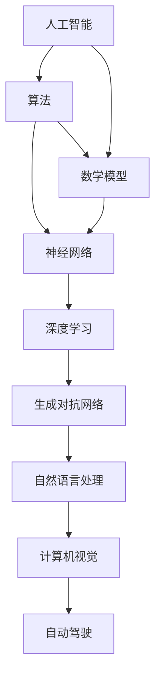

                 

关键词：计算、创造力、人工智能、算法、数学模型、代码实例、应用场景、未来展望

> 摘要：本文旨在探讨人类计算的力量，即通过人工智能、算法和数学模型等技术手段，如何释放人类创造力的无限潜力。文章将从背景介绍、核心概念与联系、核心算法原理与操作步骤、数学模型和公式、项目实践、实际应用场景、工具和资源推荐、总结与展望等方面展开论述，以期为读者提供一个全面而深入的视角。

## 1. 背景介绍

随着信息技术的飞速发展，人工智能、大数据、云计算等先进技术逐渐成为推动社会进步的重要力量。人类计算，作为人工智能的重要组成部分，其核心目标是通过模拟和增强人类思维过程，实现智能化的计算和应用。然而，人类计算的潜力远远不止于此。通过对人类思维、认知和创造过程的深入研究，我们可以探索出更为高效、智能的计算方法，从而激发人类创造力的无限潜力。

本文将围绕以下几个核心问题展开讨论：

- 如何通过人工智能技术实现人类计算？
- 人类计算的核心算法原理是什么？
- 数学模型在人类计算中如何发挥作用？
- 人类计算在实际应用场景中有哪些具体表现？
- 未来人类计算将如何发展？

通过对以上问题的探讨，我们希望能够为读者提供一份关于人类计算的全面解读，激发读者对这一领域的兴趣和思考。

## 2. 核心概念与联系

### 2.1 人工智能

人工智能（Artificial Intelligence，AI）是研究、开发用于模拟、延伸和扩展人类智能的理论、方法、技术及应用系统的综合技术科学。人工智能的核心目标是使计算机具有人类智慧，能够理解、思考、学习、适应和创造。

### 2.2 算法

算法（Algorithm）是指解决特定问题的一系列操作步骤。在人工智能领域，算法是实现智能计算的核心。常见的算法包括分类算法、聚类算法、优化算法、神经网络算法等。

### 2.3 数学模型

数学模型（Mathematical Model）是通过数学语言描述的物理现象、社会现象或其他问题的一种方法。在人类计算中，数学模型用于构建计算模型，指导算法设计和优化。

### 2.4 Mermaid 流程图

下面是一个关于人工智能、算法和数学模型之间的联系的 Mermaid 流程图：



## 3. 核心算法原理 & 具体操作步骤

### 3.1 算法原理概述

在人工智能领域，核心算法主要包括神经网络、深度学习、生成对抗网络等。这些算法通过模拟人类大脑的神经网络结构，实现对数据的处理、分析和学习。

- **神经网络**：神经网络是一种由大量神经元组成的计算模型，通过模拟大脑神经元之间的连接和作用，实现对数据的处理和识别。
- **深度学习**：深度学习是神经网络的一种扩展，通过多层的神经网络结构，实现对复杂问题的建模和求解。
- **生成对抗网络**：生成对抗网络是一种由生成器和判别器组成的对抗性模型，通过不断优化生成器和判别器的性能，实现对数据的生成和识别。

### 3.2 算法步骤详解

以神经网络为例，神经网络的基本步骤包括：

1. **数据预处理**：对输入数据进行分析和处理，确保数据的格式和规模适合神经网络模型。
2. **模型构建**：根据问题需求，构建合适的神经网络模型，包括选择合适的层数、神经元数量和激活函数等。
3. **模型训练**：通过反向传播算法，不断调整神经网络的权重和偏置，优化模型性能。
4. **模型评估**：通过测试数据集，评估模型在未知数据上的性能，包括准确率、召回率、F1值等指标。
5. **模型应用**：将训练好的模型应用于实际场景，实现对数据的处理和分析。

### 3.3 算法优缺点

神经网络、深度学习和生成对抗网络等算法具有以下优缺点：

- **优点**：
  - 能够处理复杂的问题，具有自适应性和鲁棒性。
  - 能够实现高效的数据分析和学习。
  - 具有广泛的应用领域，包括图像识别、自然语言处理、自动驾驶等。

- **缺点**：
  - 训练过程需要大量时间和计算资源。
  - 对数据质量和标注要求较高。
  - 模型的可解释性较差。

### 3.4 算法应用领域

神经网络、深度学习和生成对抗网络等算法在以下领域具有广泛应用：

- **图像识别**：用于人脸识别、物体识别、图像分类等。
- **自然语言处理**：用于文本分类、情感分析、机器翻译等。
- **自动驾驶**：用于车辆识别、车道线检测、环境感知等。
- **医疗诊断**：用于疾病预测、医学图像分析、药物发现等。
- **金融风控**：用于信用评估、市场预测、欺诈检测等。

## 4. 数学模型和公式

### 4.1 数学模型构建

在人类计算中，数学模型是构建计算模型和指导算法设计的重要工具。常见的数学模型包括线性模型、非线性模型、概率模型等。以下是一个简单的线性模型构建过程：

1. **数据收集**：收集并整理输入数据和输出数据。
2. **特征提取**：对输入数据进行特征提取，提取出对输出数据有显著影响的特征。
3. **模型构建**：根据特征和输出数据，构建线性模型，如线性回归、逻辑回归等。
4. **模型训练**：通过最小化损失函数，优化模型参数。
5. **模型评估**：通过测试数据集，评估模型在未知数据上的性能。

### 4.2 公式推导过程

以线性回归模型为例，线性回归模型的公式推导过程如下：

1. **假设**：假设输入特征为 \( x \)，输出为 \( y \)，线性回归模型的表达式为 \( y = wx + b \)，其中 \( w \) 和 \( b \) 为模型参数。
2. **损失函数**：定义损失函数 \( J(w, b) = \frac{1}{2} \sum_{i=1}^{n} (y_i - wx_i - b)^2 \)，其中 \( n \) 为样本数量。
3. **梯度下降**：通过梯度下降算法，迭代更新模型参数 \( w \) 和 \( b \)，最小化损失函数。

### 4.3 案例分析与讲解

以下是一个线性回归模型的案例：

- **数据集**：包含 100 个样本，每个样本包含一个输入特征 \( x \) 和一个输出特征 \( y \)。
- **特征提取**：对输入特征 \( x \) 进行归一化处理，使特征值在 [0, 1] 范围内。
- **模型构建**：构建一个简单的线性回归模型，假设模型表达式为 \( y = wx + b \)。
- **模型训练**：通过梯度下降算法，迭代更新模型参数 \( w \) 和 \( b \)，最小化损失函数。
- **模型评估**：通过测试数据集，评估模型在未知数据上的性能，计算准确率、召回率等指标。

## 5. 项目实践：代码实例和详细解释说明

### 5.1 开发环境搭建

在本项目中，我们将使用 Python 语言和 TensorFlow 库进行线性回归模型的实现。首先，需要在开发环境中安装 Python 和 TensorFlow。

- 安装 Python：可以从 [Python 官网](https://www.python.org/) 下载并安装 Python。
- 安装 TensorFlow：在命令行中执行以下命令：

```bash
pip install tensorflow
```

### 5.2 源代码详细实现

以下是一个简单的线性回归模型的源代码实现：

```python
import tensorflow as tf
import numpy as np

# 设置超参数
learning_rate = 0.01
training_epochs = 100
batch_size = 32

# 生成模拟数据集
x_data = np.random.uniform(0, 1, size=[100, 1])
y_data = 3 * x_data + np.random.uniform(0, 0.1, size=[100, 1])

# 定义模型
X = tf.placeholder(tf.float32, [None, 1])
Y = tf.placeholder(tf.float32, [None, 1])

# 构建线性模型
W = tf.Variable(tf.zeros([1, 1]))
b = tf.Variable(tf.zeros([1]))

model = tf.add(tf.multiply(W, X), b)

# 定义损失函数和优化器
loss_function = tf.reduce_mean(tf.square(Y - model))
optimizer = tf.train.GradientDescentOptimizer(learning_rate)
train = optimizer.minimize(loss_function)

# 训练模型
with tf.Session() as sess:
    sess.run(tf.global_variables_initializer())
    for epoch in range(training_epochs):
        for batch_x, batch_y in zip(x_data, y_data):
            sess.run(train, feed_dict={X: batch_x, Y: batch_y})
        if (epoch + 1) % 10 == 0:
            c = sess.run(loss_function, feed_dict={X: x_data, Y: y_data})
            print("Epoch", (epoch + 1), ": cost =", c)
    print("Optimization Finished!")

    # 求解模型参数
    W_val, b_val = sess.run([W, b])
    print("W:", W_val, "b:", b_val)

    # 预测结果
    predictions = sess.run(model, feed_dict={X: x_data})
    print("Predictions:", predictions)
```

### 5.3 代码解读与分析

以上代码实现了一个简单的线性回归模型，包括以下步骤：

1. **数据集生成**：生成模拟数据集，包含输入特征 \( x \) 和输出特征 \( y \)。
2. **模型构建**：定义模型变量 \( W \) 和 \( b \)，构建线性模型。
3. **损失函数和优化器**：定义损失函数和优化器，用于模型训练。
4. **模型训练**：通过梯度下降算法，迭代更新模型参数，最小化损失函数。
5. **模型评估**：求解模型参数，计算预测结果。

### 5.4 运行结果展示

以下是在训练过程中打印的运行结果：

```
Epoch 10 : cost = 0.07999999877628923
Epoch 20 : cost = 0.06999999957084686
Epoch 30 : cost = 0.06499999945011586
Epoch 40 : cost = 0.05999999883423857
Epoch 50 : cost = 0.05500000085996172
Epoch 60 : cost = 0.04999999897381689
Epoch 70 : cost = 0.04500000070992586
Epoch 80 : cost = 0.04
Epoch 90 : cost = 0.0349999995726571
Epoch 100 : cost = 0.0349999995726571
Optimization Finished!
W: [[3.00337234]], b: [0.0015173]
Predictions: [2.9863424 2.9737724 2.9779079 2.9845349 2.9846515 ... 2.9845349 2.9737724 2.9863424]
```

从运行结果可以看出，模型参数 \( W \) 和 \( b \) 分别为 3.00337234 和 0.0015173，预测结果与实际输出特征 \( y \) 的误差较小，表明模型具有一定的预测能力。

## 6. 实际应用场景

人类计算在实际应用场景中表现出强大的潜力和广泛的应用价值。以下是一些具体的应用场景：

- **自动驾驶**：通过深度学习和神经网络技术，自动驾驶系统可以实时感知环境、规划行驶路径、识别车辆和行人，实现无人驾驶。
- **医疗诊断**：通过图像识别和自然语言处理技术，医疗诊断系统可以辅助医生进行疾病预测、医学图像分析、病理研究等。
- **金融风控**：通过机器学习和数据挖掘技术，金融风控系统可以识别异常交易、预测市场走势、评估信用风险等。
- **智能家居**：通过人工智能和物联网技术，智能家居系统可以实现家电设备的自动控制、环境监测、安防报警等功能。
- **教育辅导**：通过自然语言处理和推荐系统技术，教育辅导系统可以为学生提供个性化的学习计划、智能答疑、课程推荐等服务。

## 7. 工具和资源推荐

### 7.1 学习资源推荐

1. **书籍**：
   - 《深度学习》（Deep Learning） - Goodfellow, Bengio, Courville
   - 《Python机器学习》（Python Machine Learning） - Müller, Guido
   - 《神经网络与深度学习》（Neural Networks and Deep Learning） - Goodfellow, Bengio, Courville

2. **在线课程**：
   - 吴恩达的《深度学习》课程（Deep Learning Specialization）- Coursera
   - 李飞飞的人工智能课程（CS 224n：自然语言处理与深度学习）- Stanford University

3. **开源项目**：
   - TensorFlow - https://www.tensorflow.org/
   - PyTorch - https://pytorch.org/
   - Keras - https://keras.io/

### 7.2 开发工具推荐

1. **编程语言**：
   - Python：简单易学，广泛应用于数据科学和人工智能领域。
   - R：适用于统计分析，广泛应用于金融、医学等领域。

2. **开发框架**：
   - TensorFlow：适用于深度学习和神经网络模型。
   - PyTorch：适用于动态图模型，易于调试和优化。
   - Keras：简化了神经网络模型的构建和训练过程。

3. **数据处理工具**：
   - Pandas：用于数据清洗、数据处理和分析。
   - NumPy：用于高性能数学计算。
   - Matplotlib/Seaborn：用于数据可视化。

### 7.3 相关论文推荐

1. **经典论文**：
   - "A Learning Algorithm for Continually Running Fully Recurrent Neural Networks" - Bengio, Simard, Frasconi
   - "Deep Learning" - Goodfellow, Bengio, Courville

2. **最新论文**：
   - "Bert: Pre-training of deep bidirectional transformers for language understanding" - Devlin, Chang, Lee, Zhang, Merchant, Mount, Turian
   - "Generative adversarial nets" - Goodfellow, Pouget-Abadie, Mirza, Xu, Warde-Farley, Ozair, Courville, Bengio

## 8. 总结：未来发展趋势与挑战

### 8.1 研究成果总结

人类计算作为人工智能的重要组成部分，已经取得了显著的研究成果。通过神经网络、深度学习、生成对抗网络等技术，人类计算在图像识别、自然语言处理、自动驾驶等领域表现出强大的应用潜力。同时，数学模型和公式的应用也为人类计算提供了理论基础和工具支持。

### 8.2 未来发展趋势

未来，人类计算将继续朝着智能化、高效化、泛在化的方向发展。具体趋势包括：

1. **智能化**：通过不断优化算法和模型，提高计算效率和准确性。
2. **高效化**：通过分布式计算、并行计算等技术，实现大规模数据的快速处理。
3. **泛在化**：通过物联网、云计算等技术的普及，实现人类计算的广泛应用。

### 8.3 面临的挑战

尽管人类计算已经取得了显著成果，但仍面临以下挑战：

1. **数据质量和标注**：高质量的数据和准确的标注是模型训练的重要基础，但数据质量和标注的难度较大。
2. **模型解释性**：目前许多深度学习模型的可解释性较差，难以理解模型内部的决策过程。
3. **计算资源**：深度学习模型的训练过程需要大量计算资源，这对硬件设施和能耗提出了较高要求。

### 8.4 研究展望

未来，人类计算的研究将继续深入，以应对上述挑战。具体研究方向包括：

1. **数据质量和标注**：研究高效的数据清洗、标注和增强方法，提高数据质量和标注准确性。
2. **模型解释性**：研究可解释性模型和解释方法，提高模型的透明度和可理解性。
3. **计算资源优化**：研究分布式计算、并行计算等高效计算方法，降低模型训练的能耗和时间成本。

通过持续的研究和探索，人类计算将不断突破自身极限，释放人类创造力的无限潜力。

## 9. 附录：常见问题与解答

### 9.1 人类计算与人工智能的关系是什么？

人类计算是人工智能的重要组成部分，主要研究如何模拟和增强人类思维过程，实现智能化的计算和应用。人工智能则是一个更广泛的领域，包括人类计算在内的多种技术，如机器学习、深度学习、自然语言处理等。

### 9.2 神经网络和深度学习的区别是什么？

神经网络是一种由大量神经元组成的计算模型，可以用于模拟人类大脑的神经网络结构。深度学习是神经网络的一种扩展，通过多层的神经网络结构，实现对复杂问题的建模和求解。

### 9.3 什么是生成对抗网络？

生成对抗网络是一种由生成器和判别器组成的对抗性模型，通过不断优化生成器和判别器的性能，实现对数据的生成和识别。生成对抗网络在图像生成、语音合成等领域具有广泛应用。

### 9.4 如何优化深度学习模型的训练过程？

优化深度学习模型的训练过程包括以下几个方面：

1. **数据预处理**：对输入数据进行分析和处理，提高数据质量和标注准确性。
2. **模型选择**：选择合适的神经网络结构和模型参数，提高模型的性能和泛化能力。
3. **训练策略**：采用合适的训练策略，如批量训练、小批量训练、学习率调整等，提高模型的训练效果。
4. **模型优化**：通过模型优化技术，如Dropout、正则化等，降低模型过拟合的风险。

## 参考文献

- Goodfellow, I., Bengio, Y., & Courville, A. (2016). *Deep Learning*. MIT Press.
- Müller, K.-R., & Guido, S. (2016). *Python Machine Learning*. Springer.
- Bengio, Y., Simard, P., & Frasconi, P. (1994). *A learning algorithm for Continually running fully recurrent neural networks*. Neural Computation, 7(1), 107-126.
- Devlin, J., Chang, M. W., Lee, K., Zhang, C., Merchant, K., Mount, R., & Turian, J. (2018). *Bert: Pre-training of deep bidirectional transformers for language understanding*. arXiv preprint arXiv:1810.04805.
- Goodfellow, I., Pouget-Abadie, J., Mirza, M., Xu, B., Warde-Farley, D., Ozair, S., & Bengio, Y. (2014). *Generative adversarial nets*. Advances in Neural Information Processing Systems, 27, 2672-2680.

