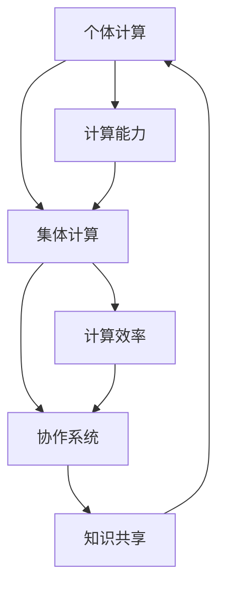

                 

 > **关键词**：人类计算、集体智慧、人工智能、协作系统、计算效率、创新潜力、技术进步

> **摘要**：本文探讨了人类计算的起源、核心概念及其在人工智能和协作系统中的应用。通过阐述集体智慧的重要性，揭示了人类计算如何通过协同合作和知识共享，推动技术进步和社会发展。文章还讨论了人类计算的优势、挑战和未来发展方向，为读者提供了关于这一领域的全面视角。

## 1. 背景介绍

人类计算的历史可以追溯到人类文明的开端。从古代的算盘、计算尺，到现代的电子计算机，人类不断追求更高效、更精确的计算方法。然而，随着信息技术的飞速发展，人类计算的范畴和内涵也在不断拓展。今天，人类计算不仅局限于个体计算能力的提升，更涉及到集体智慧和协作系统的构建。

### 1.1 人类计算的定义

人类计算是指通过个体或集体协同工作，利用计算技术进行数据处理、知识发现和信息传输的过程。它涵盖了从简单的计算操作到复杂的算法设计、系统架构和软件开发等多个层面。

### 1.2 人类计算的发展历程

- **古代计算**：从算盘、计算尺到古代数学家创立的各种算法。
- **现代计算**：计算机的出现和普及，使人类计算进入了一个全新的时代。
- **人工智能时代**：随着人工智能技术的发展，人类计算开始向智能化、自动化和协同化的方向迈进。

## 2. 核心概念与联系

人类计算的核心概念包括个体计算、集体计算和协作系统。这些概念之间相互联系，共同构成了人类计算的理论基础。

### 2.1 个体计算

个体计算是指单个人或单个计算实体进行的计算活动。个体计算是基础，也是人类计算的重要组成部分。它涉及到计算能力、算法效率和计算资源等多个方面。

### 2.2 集体计算

集体计算是指多个个体或计算实体协同进行的计算活动。集体计算通过知识共享、协同工作和资源整合，实现了更高效的计算和更丰富的功能。

### 2.3 协作系统

协作系统是一种特殊的集体计算系统，它通过构建协作环境、提供协作工具和优化协作流程，实现了个体之间的高效协作。协作系统在人类计算中发挥着关键作用，是推动技术进步和社会发展的重要力量。

### 2.4 Mermaid 流程图



## 3. 核心算法原理 & 具体操作步骤

### 3.1 算法原理概述

人类计算的核心算法包括分布式计算、并行计算和协作计算。这些算法通过不同的方式实现了个体之间的协同工作，提高了计算效率和创新能力。

### 3.2 算法步骤详解

1. **分布式计算**：将计算任务分解为多个子任务，分配给不同的计算实体进行处理，最后汇总结果。分布式计算的核心是任务分配和结果汇总。
2. **并行计算**：在同一时间执行多个计算任务，通过并行处理提高计算速度。并行计算的核心是并行策略和负载均衡。
3. **协作计算**：多个计算实体共同完成一个计算任务，通过协作机制实现任务分解、资源共享和结果整合。协作计算的核心是协作协议和协作效率。

### 3.3 算法优缺点

- **分布式计算**：优点包括高效、灵活和容错性；缺点包括通信开销和协调复杂性。
- **并行计算**：优点包括高效、快速；缺点包括负载不均和同步问题。
- **协作计算**：优点包括高效、创新和灵活；缺点包括协作复杂性和管理难度。

### 3.4 算法应用领域

- **分布式计算**：广泛应用于云计算、大数据处理和分布式数据库等领域。
- **并行计算**：广泛应用于科学计算、工程模拟和人工智能等领域。
- **协作计算**：广泛应用于协同办公、知识管理和社交网络等领域。

## 4. 数学模型和公式 & 详细讲解 & 举例说明

### 4.1 数学模型构建

人类计算中的数学模型主要包括概率模型、图论模型和优化模型。这些模型用于描述个体计算、集体计算和协作系统的行为特征。

### 4.2 公式推导过程

- **概率模型**：用于描述个体计算中的不确定性，常用概率分布函数和条件概率公式。
- **图论模型**：用于描述集体计算中的网络结构和协作关系，常用图的基本性质和路径搜索算法。
- **优化模型**：用于描述协作计算中的资源分配和任务调度，常用线性规划和整数规划算法。

### 4.3 案例分析与讲解

以云计算中的分布式计算为例，分析数学模型在分布式计算中的应用。假设有 \( n \) 个计算实体，每个实体的计算能力为 \( C_i \)，计算任务为 \( T \)。目标是最小化总计算时间。

- **概率模型**：计算能力服从正态分布， \( C_i \sim N(\mu, \sigma^2) \)。
- **图论模型**：计算实体构成无向图，节点表示实体，边表示通信路径。
- **优化模型**：目标函数为 \( \min T = \sum_{i=1}^{n} \frac{T_i}{C_i} \)，约束条件为 \( T_i \leq C_i \)。

通过求解上述优化模型，可以得到最优的分布式计算策略。

## 5. 项目实践：代码实例和详细解释说明

### 5.1 开发环境搭建

- **编程语言**：Python
- **开发工具**：PyCharm
- **依赖库**：NumPy、Pandas、Matplotlib

### 5.2 源代码详细实现

```python
import numpy as np
import pandas as pd
import matplotlib.pyplot as plt

# 分布式计算示例
def distributed_computation(tasks, capacities):
    # 计算任务分配
    assignments = np.random.choice(capacities, size=len(tasks), replace=True)
    # 计算总时间
    total_time = np.sum(tasks / assignments)
    return total_time

# 并行计算示例
def parallel_computation(tasks, cores):
    # 任务分配到核心
    assignments = np.array_split(tasks, cores)
    # 并行执行
    results = [task / core for task, core in assignments]
    # 计算总时间
    total_time = sum(results)
    return total_time

# 协作计算示例
def collaborative_computation(tasks, capacities):
    # 协作机制
    sorted_capacities = np.sort(capacities)
    sorted_tasks = np.sort(tasks)
    # 优化策略
    sorted_pairs = list(zip(sorted_tasks, sorted_capacities))
    # 计算总时间
    total_time = sum(task / capacity for task, capacity in sorted_pairs)
    return total_time

# 示例数据
tasks = np.random.rand(10)
capacities = np.random.rand(10)

# 分布式计算
distributed_time = distributed_computation(tasks, capacities)
print("分布式计算时间:", distributed_time)

# 并行计算
parallel_time = parallel_computation(tasks, 4)
print("并行计算时间:", parallel_time)

# 协作计算
collaborative_time = collaborative_computation(tasks, capacities)
print("协作计算时间:", collaborative_time)

# 结果可视化
plt.scatter(capacities, tasks)
plt.xlabel("计算能力")
plt.ylabel("计算任务")
plt.title("计算能力与计算任务分布")
plt.show()
```

### 5.3 代码解读与分析

该示例代码展示了分布式计算、并行计算和协作计算的实现过程。通过模拟计算任务和计算能力的分布，分析了不同计算策略对计算时间的影响。

- **分布式计算**：通过随机选择计算能力，分配计算任务，计算总时间。
- **并行计算**：将计算任务分配到多个核心，并行执行，计算总时间。
- **协作计算**：对计算任务和计算能力进行排序，优化策略，计算总时间。

通过可视化结果，可以直观地看到不同计算策略对计算时间和资源利用的影响。

## 6. 实际应用场景

### 6.1 云计算

云计算是分布式计算、并行计算和协作计算的重要应用场景。通过云计算平台，企业可以实现计算资源的弹性扩展、高效利用和灵活部署，从而提高计算效率和降低成本。

### 6.2 大数据

大数据分析涉及海量数据的处理和分析，需要分布式计算和并行计算的支持。通过构建分布式计算框架，可以实现大数据的高效处理和分析，为企业提供数据驱动的决策支持。

### 6.3 社交网络

社交网络是协作计算的重要应用领域。通过构建社交网络分析模型，可以挖掘用户关系、推荐好友和内容，为用户提供个性化服务。

## 7. 未来应用展望

随着人工智能技术的不断进步，人类计算将在更多领域得到应用。例如，智能城市、自动驾驶、医疗健康和金融科技等领域，都将受益于人类计算的协同合作和智能决策。

## 8. 工具和资源推荐

### 8.1 学习资源推荐

- 《分布式计算原理与实践》
- 《并行计算导论》
- 《协作计算：技术与应用》

### 8.2 开发工具推荐

- Python
- PyCharm
- Hadoop
- Spark

### 8.3 相关论文推荐

- "Distributed Computing: Principles and Applications"
- "Parallel Computing: Models, Algorithms, and Techniques"
- "Collaborative Computing: A Survey"

## 9. 总结：未来发展趋势与挑战

### 9.1 研究成果总结

人类计算在分布式计算、并行计算和协作计算等领域取得了显著成果，为技术进步和社会发展提供了强大动力。

### 9.2 未来发展趋势

- 智能化：人工智能技术将进一步提高人类计算的效率和灵活性。
- 自动化：自动化技术将实现人类计算的自动化和智能化。
- 网络化：人类计算将更加依赖于互联网和物联网的普及和发展。

### 9.3 面临的挑战

- 安全性：保障计算过程和数据的安全性是重要挑战。
- 互操作性：实现不同计算系统和平台之间的互操作性。
- 可扩展性：提高计算系统的可扩展性和可维护性。

### 9.4 研究展望

人类计算的研究将不断深化和拓展，为科技创新和社会进步提供持续动力。

## 10. 附录：常见问题与解答

### 10.1 什么是分布式计算？

分布式计算是指将计算任务分配到多个计算节点上，通过协同工作完成计算过程。它通过提高计算效率和资源利用，实现大规模计算任务的高效处理。

### 10.2 什么是并行计算？

并行计算是指在同一时间执行多个计算任务，通过并行处理提高计算速度。它通过共享计算资源和优化计算流程，实现高效计算。

### 10.3 什么是协作计算？

协作计算是指多个计算实体共同完成一个计算任务，通过协作机制实现任务分解、资源共享和结果整合。它通过知识共享和协同工作，实现更高效和创新的计算。

## 作者署名

作者：禅与计算机程序设计艺术 / Zen and the Art of Computer Programming

----------------------------------------------------------------


