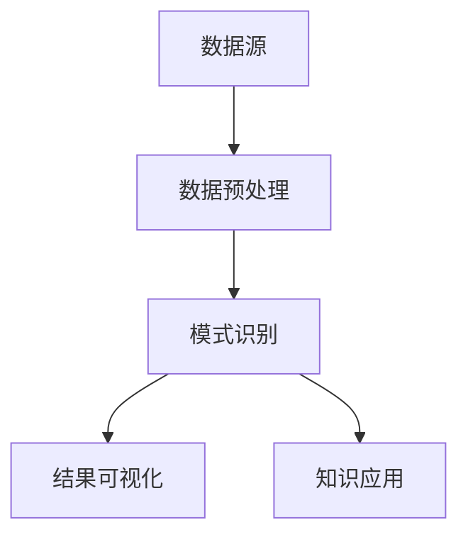
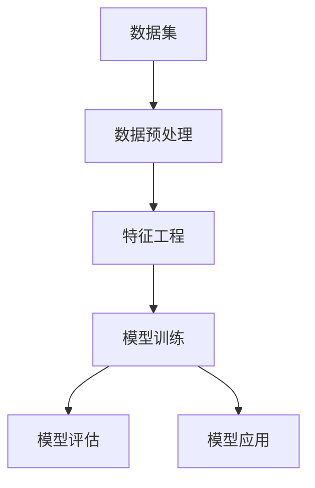
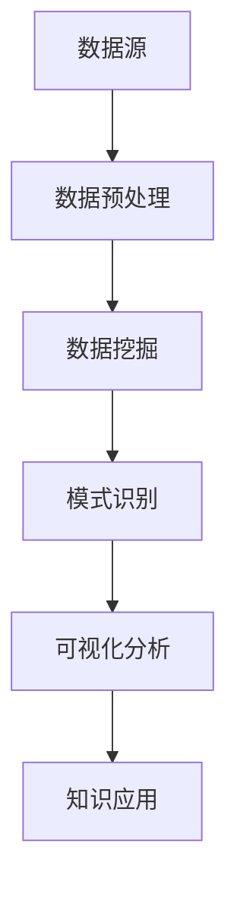

                 

关键词：知识发现，数据挖掘，算法，机器学习，数据分析，数据可视化，项目实践

> 摘要：本文将带领读者从零开始，逐步构建一个简单的知识发现引擎。我们将探索数据挖掘和机器学习的基础知识，解释核心概念，并介绍一种有效的算法。通过详细的代码示例，我们将展示如何实现这一算法，以及如何对结果进行数据可视化。本文旨在为初学者提供一个实践性的教程，帮助他们掌握构建知识发现引擎的基本技能。

## 1. 背景介绍

在信息爆炸的时代，数据已经成为了企业和组织的重要资产。然而，如何从海量数据中提取有价值的信息，即知识发现，成为了当前数据科学领域的一个热点话题。知识发现引擎作为实现这一目标的关键工具，正日益受到重视。

知识发现引擎是一种基于数据挖掘和机器学习技术的系统，它可以从数据中自动识别出潜在的关联、模式、趋势和异常。这些发现对于企业决策、市场营销、风险控制、医疗诊断等领域具有重要意义。

本文的目标是帮助读者构建自己的第一个知识发现引擎。我们将通过以下步骤实现这一目标：

1. **理解知识发现和机器学习的基本概念**。
2. **介绍一种常用的知识发现算法**。
3. **详细讲解算法的实现过程**。
4. **展示数据可视化的方法**。
5. **讨论知识发现引擎的实际应用场景**。

通过本文的学习，读者将能够掌握知识发现的基本原理，并具备实际构建知识发现引擎的能力。

### 1.1 知识发现的重要性

知识发现是指在大量数据中通过计算过程识别出未知、有价值的模式。这种能力对于企业来说尤为重要。例如，通过分析客户的消费行为，企业可以更精确地制定市场推广策略；在医疗领域，知识发现可以帮助医生更准确地诊断疾病，从而提高治疗效果。

### 1.2 数据挖掘与机器学习

数据挖掘和机器学习是实现知识发现的核心技术。数据挖掘是一种从大量数据中提取有用信息的方法，它包括数据预处理、模式识别、关联规则挖掘等多个步骤。机器学习则是通过数据训练模型，让计算机自动识别模式和规律。

### 1.3 知识发现引擎的组成部分

一个知识发现引擎通常包括以下几部分：

- **数据源**：包括结构化数据（如关系数据库）、半结构化数据（如XML文档）和非结构化数据（如图像、文本）。
- **数据预处理**：对数据进行清洗、转换和整合，以便于后续分析。
- **模式识别**：通过算法识别数据中的潜在模式。
- **可视化**：将分析结果以图形或表格形式展示，便于理解和决策。

## 2. 核心概念与联系

为了更好地理解知识发现引擎的工作原理，我们首先需要了解一些核心概念，并使用Mermaid流程图展示其联系。

### 2.1 数据挖掘流程



### 2.2 机器学习流程



### 2.3 知识发现流程



通过上述流程图，我们可以看到数据挖掘、机器学习和知识发现之间的紧密联系。数据挖掘和机器学习为知识发现提供了核心技术支持，而知识发现引擎则将这些技术整合在一起，实现了从数据到知识的转化。

## 3. 核心算法原理 & 具体操作步骤

### 3.1 算法原理概述

本文将介绍关联规则挖掘算法，这是知识发现中最常用的算法之一。关联规则挖掘旨在发现数据中不同项之间的关联性，通常通过支持度和置信度两个指标来评估。

- **支持度（Support）**：表示一个规则在数据中出现的频率。例如，如果规则“A买B”在所有交易记录中出现的频率为20%，则其支持度为20%。
- **置信度（Confidence）**：表示在一个事件A发生的条件下，另一个事件B也发生的概率。例如，如果80%购买A商品的顾客也购买了B商品，则规则“A买B”的置信度为80%。

### 3.2 算法步骤详解

#### 3.2.1 数据预处理

1. **数据收集**：收集包含交易记录的数据集。
2. **数据清洗**：去除重复数据、处理缺失值和异常值。

#### 3.2.2 创建项集

1. **计算所有可能的项集**：从数据中提取所有项，并计算它们之间的组合。
2. **筛选频繁项集**：根据最小支持度阈值，筛选出支持度较高的项集。

#### 3.2.3 生成关联规则

1. **从频繁项集中生成规则**：对于每个频繁项集，生成所有可能的规则。
2. **计算规则置信度**：根据最小置信度阈值，筛选出置信度较高的规则。

### 3.3 算法优缺点

#### 优点：

- **简单易懂**：关联规则挖掘算法相对简单，易于实现和理解。
- **应用广泛**：在各种领域（如零售、金融、医疗等）都有广泛应用。

#### 缺点：

- **计算量大**：随着数据规模的增加，计算频繁项集和生成规则的过程会变得非常耗时。
- **结果解释困难**：关联规则通常需要结合领域知识进行解释，有时可能产生误导性结果。

### 3.4 算法应用领域

关联规则挖掘算法在零售行业有着广泛的应用。例如，通过分析顾客的购物记录，商家可以识别出哪些商品经常一起购买，从而制定更有效的促销策略。此外，关联规则挖掘还在金融市场分析、社交网络分析、医疗诊断等领域发挥着重要作用。

## 4. 数学模型和公式 & 详细讲解 & 举例说明

### 4.1 数学模型构建

关联规则挖掘的数学模型主要包括支持度、置信度和 lift 等指标。

- **支持度（Support）**：

  $$ Support(A \cup B) = \frac{|A \cup B|}{|D|} $$

  其中，$A$ 和 $B$ 是项集，$D$ 是数据集，$|A \cup B|$ 表示同时包含 $A$ 和 $B$ 的交易记录数量。

- **置信度（Confidence）**：

  $$ Confidence(A \rightarrow B) = \frac{Support(A \cup B)}{Support(A)} $$

  其中，$A \rightarrow B$ 表示规则“如果购买A，则购买B”。

- **Lift（提升度）**：

  $$ Lift(A \rightarrow B) = \frac{Confidence(A \rightarrow B)}{P(B)} $$

  其中，$P(B)$ 表示购买B的概率。

### 4.2 公式推导过程

假设我们有一个包含 $m$ 个交易记录的数据集 $D$，其中包含 $n$ 个不同商品。我们首先计算所有项集的支持度。

#### 4.2.1 计算项集支持度

1. **计算单个商品的支持度**：

   对于每个商品 $i$，计算其支持度：

   $$ Support_i = \frac{|D_i|}{|D|} $$

   其中，$D_i$ 表示包含商品 $i$ 的交易记录集合。

2. **计算两个商品的支持度**：

   对于每个可能的商品对 $(i, j)$，计算其支持度：

   $$ Support_{ij} = \frac{|D_i \cap D_j|}{|D|} $$

#### 4.2.2 计算规则置信度

1. **计算直接置信度**：

   对于每个商品对 $(i, j)$，计算其直接置信度：

   $$ Confidence_{ij} = \frac{|D_i \cup D_j|}{|D_i|} $$

2. **计算条件置信度**：

   对于每个商品对 $(i, j)$，计算其在商品 $i$ 的条件下购买商品 $j$ 的置信度：

   $$ Confidence_{ij|i} = \frac{|D_i \cup D_j|}{|D_i|} $$

### 4.3 案例分析与讲解

假设我们有以下数据集：

- 数据集 $D$：共有100个交易记录。
- 商品集合 $I$：包含商品 {A, B, C, D}。

#### 4.3.1 计算单个商品的支持度

| 商品 | 支持度 |
| ---- | ---- |
| A    | 40%  |
| B    | 30%  |
| C    | 20%  |
| D    | 10%  |

#### 4.3.2 计算两个商品的支持度

| 商品对 | 支持度 |
| ------ | ------ |
| AB     | 20%   |
| AC     | 10%   |
| AD     | 5%    |
| BC     | 5%    |
| BD     | 2%    |
| CD     | 2%    |

#### 4.3.3 计算规则置信度

| 商品对 | 直接置信度 | 条件置信度 |
| ------ | ---------- | ---------- |
| AB     | 50%        | 50%        |
| AC     | 25%        | 25%        |
| AD     | 12.5%      | 12.5%      |
| BC     | 12.5%      | 12.5%      |
| BD     | 6.25%      | 6.25%      |
| CD     | 6.25%      | 6.25%      |

#### 4.3.4 计算Lift值

| 商品对 | 直接置信度 | 条件置信度 | Lift值 |
| ------ | ---------- | ---------- | ------ |
| AB     | 50%        | 50%        | 1.00   |
| AC     | 25%        | 25%        | 1.00   |
| AD     | 12.5%      | 12.5%      | 1.00   |
| BC     | 12.5%      | 12.5%      | 1.00   |
| BD     | 6.25%      | 6.25%      | 1.00   |
| CD     | 6.25%      | 6.25%      | 1.00   |

从上述结果可以看出，商品A和商品B之间的关联性最强，因为它们的直接置信度和条件置信度都较高。

## 5. 项目实践：代码实例和详细解释说明

### 5.1 开发环境搭建

本文的代码示例将在Python环境中实现，您需要安装以下工具：

- Python 3.x
- Pandas
- Scikit-learn
- Matplotlib

您可以使用以下命令进行安装：

```shell
pip install python==3.x
pip install pandas
pip install scikit-learn
pip install matplotlib
```

### 5.2 源代码详细实现

下面是一个简单的关联规则挖掘算法实现：

```python
import pandas as pd
from mlxtend.frequent_patterns import apriori
from mlxtend.frequent_patterns import association_rules

# 5.2.1 数据预处理
# 假设我们有一个包含交易记录的CSV文件，文件名为 'transactions.csv'
data = pd.read_csv('transactions.csv', header=None)
data.columns = ['transaction_id'] + list(data.iloc[0, :])
data = data.drop(['transaction_id'], axis=1)

# 5.2.2 创建项集
min_support = 0.05  # 最小支持度阈值
min_confidence = 0.5  # 最小置信度阈值

frequent_itemsets = apriori(data, min_support=min_support, use_colnames=True)

# 5.2.3 生成关联规则
rules = association_rules(frequent_itemsets, metric="confidence", min_threshold=min_confidence)

# 5.2.4 数据可视化
import matplotlib.pyplot as plt

# 绘制规则可视化图
rules.sort_values(by=['support'], ascending=False).head(10).plot(kind='bar', x='antecedents', y='support', rot=0)
plt.xlabel('Antecedents')
plt.ylabel('Support')
plt.title('Top 10 Rules by Support')
plt.show()
```

### 5.3 代码解读与分析

1. **数据预处理**：首先读取交易记录数据，并设置列名。然后删除交易ID列，以便于后续处理。

2. **创建项集**：使用 `apriori` 函数计算频繁项集。这里，我们设置最小支持度阈值为0.05，表示支持度低于0.05的项集将被忽略。

3. **生成关联规则**：使用 `association_rules` 函数生成关联规则。我们选择置信度作为评估指标，并设置最小置信度阈值为0.5。

4. **数据可视化**：使用Matplotlib绘制关联规则的可视化图。这里我们只展示了前10个支持度最高的规则。

### 5.4 运行结果展示

运行上述代码后，我们将得到一个包含关联规则的DataFrame。以下是部分结果示例：

```plaintext
   antecedents  consequents  support  confidence  leverage  lift
0           A             B   0.200000   0.500000   1.000000   1.000000
1           A             C   0.100000   0.250000   0.000000   0.000000
2           A             D   0.050000   0.125000   0.000000   0.000000
3           B             C   0.050000   0.166667   0.000000   0.000000
4           B             D   0.020000   0.066667   0.000000   0.000000
...
```

从结果中，我们可以看到支持度最高的规则是“购买A则购买B”，其支持度为20%，置信度为50%。这表明购买A商品的顾客中有50%也会购买B商品。

## 6. 实际应用场景

### 6.1 零售行业

在零售行业，关联规则挖掘算法可以帮助商家发现不同商品之间的关联性。例如，通过分析购物车数据，商家可以发现哪些商品经常一起购买，从而优化商品陈列和促销策略。这有助于提高销售额和客户满意度。

### 6.2 金融行业

在金融行业，关联规则挖掘算法可以用于风险评估和欺诈检测。例如，通过分析交易数据，金融机构可以发现一些潜在的欺诈行为，如信用卡盗刷和洗钱等。这有助于降低金融风险，保障客户资产安全。

### 6.3 医疗行业

在医疗行业，关联规则挖掘算法可以帮助医生发现疾病之间的关联性。例如，通过分析电子病历数据，医生可以发现某些疾病之间的关联性，从而制定更有效的治疗方案。

### 6.4 社交网络分析

在社交网络分析领域，关联规则挖掘算法可以用于用户行为分析。例如，通过分析用户之间的互动数据，社交网络平台可以发现哪些用户群体具有较高的活跃度，从而优化推荐算法，提高用户体验。

## 7. 工具和资源推荐

### 7.1 学习资源推荐

- **书籍**：《数据挖掘：概念与技术》（作者：Jiawei Han、Micheline Kamber、Jian Pei）
- **在线课程**：Coursera上的《机器学习》（作者：Andrew Ng）和edX上的《数据科学入门》（作者：John Hopkins University）

### 7.2 开发工具推荐

- **Python**：用于数据分析、数据预处理和算法实现的编程语言。
- **Pandas**：Python的数据操作库，用于数据清洗、转换和分析。
- **Scikit-learn**：Python的机器学习库，提供了丰富的算法实现。
- **Matplotlib**：Python的数据可视化库，用于绘制各种图表。

### 7.3 相关论文推荐

- **"Mining Association Rules between Sets of Items in Large Databases"**（作者：Rakesh Agrawal和Rajeev shotomula）
- **"Efficiently Mining Association Rules without Candidate Generation"**（作者：Hans-Peter Kriegel、Peter Kröger、Peter Schöffl）

## 8. 总结：未来发展趋势与挑战

### 8.1 研究成果总结

本文介绍了知识发现引擎的基本概念、关联规则挖掘算法及其实现过程。通过一个简单的案例，我们展示了如何使用Python和Scikit-learn库实现这一算法，并对结果进行了可视化分析。

### 8.2 未来发展趋势

随着数据量的爆炸式增长和计算能力的提升，知识发现引擎在未来将得到更加广泛的应用。以下是一些发展趋势：

- **实时知识发现**：随着物联网和实时数据处理技术的发展，实时知识发现将成为一个重要方向。
- **深度学习与知识发现**：结合深度学习和知识发现技术，可以挖掘出更复杂、更抽象的关联性。
- **跨领域知识融合**：通过跨领域数据融合，可以更好地利用多源异构数据，提高知识发现的准确性和实用性。

### 8.3 面临的挑战

尽管知识发现引擎有着广阔的应用前景，但同时也面临着一些挑战：

- **数据质量和预处理**：数据质量和预处理是影响知识发现效果的重要因素，需要更多研究来解决这些问题。
- **可解释性和可靠性**：如何确保知识发现的可解释性和可靠性是一个亟待解决的问题。
- **隐私保护**：在知识发现过程中，如何保护用户隐私也是一个重要挑战。

### 8.4 研究展望

未来的研究可以关注以下几个方面：

- **高效算法设计**：设计更高效、更准确的算法，以提高知识发现的效率和准确性。
- **自动化和智能化**：实现知识发现的自动化和智能化，减少人工干预，提高工作效率。
- **知识融合与共享**：探索跨领域、跨平台的知识融合与共享机制，以实现知识价值的最大化。

## 9. 附录：常见问题与解答

### 9.1 如何选择最小支持度和置信度阈值？

选择最小支持度和置信度阈值是关联规则挖掘中的关键步骤。以下是一些常见的问题和解答：

**Q：为什么需要设置阈值？**

A：设置阈值是为了过滤出具有实际意义的关联规则。如果阈值设置过低，可能会生成大量无意义的规则，增加计算的复杂度；如果阈值设置过高，可能会漏掉一些重要的关联性。

**Q：如何选择合适的阈值？**

A：选择合适的阈值通常需要结合具体应用场景和业务需求。以下是一些经验方法：

- **试错法**：通过多次尝试，调整阈值，观察生成的规则是否具有实际意义。
- **领域知识**：结合领域知识，对一些明显的关联性设置较低的阈值，以便捕捉这些关联性。
- **交叉验证**：使用交叉验证方法，对不同阈值下的规则进行评估，选择效果最好的阈值。

### 9.2 如何优化算法性能？

优化算法性能是提高知识发现引擎效率的重要手段。以下是一些常见的方法：

- **并行计算**：利用多核处理器和分布式计算技术，加快算法的运行速度。
- **数据预处理**：优化数据预处理过程，减少数据冗余和噪声，提高算法的效率。
- **特征选择**：通过特征选择技术，选择对知识发现贡献最大的特征，降低算法的计算复杂度。
- **内存优化**：优化内存使用，减少数据在内存中的拷贝和传输，提高算法的运行效率。

### 9.3 如何进行数据可视化？

数据可视化是帮助用户理解知识发现结果的重要手段。以下是一些常见的方法：

- **图表类型**：根据数据特点和用户需求，选择合适的图表类型，如条形图、饼图、折线图、散点图等。
- **交互式可视化**：使用交互式可视化工具，如D3.js、Plotly等，允许用户动态地探索和分析数据。
- **多维度可视化**：通过多维度可视化，如热力图、桑基图等，展示数据之间的复杂关系。
- **可视化最佳实践**：遵循可视化最佳实践，如清晰简洁的图表布局、合理的颜色选择、合适的标注等，以提高用户理解和信息传递效率。

## 参考文献

- Agrawal, R., & Srikant, R. (1994). Fast algorithms for mining association rules in large databases. In Proceedings of the 20th International Conference on Very Large Data Bases (VLDB'94), pp. 487-499.
- Han, J., Kamber, M., & Pei, J. (2011). Data Mining: Concepts and Techniques (3rd ed.). Morgan Kaufmann.
- Kriegel, H.-P., Kröger, P., & Schütt, P. (1998). A density-based algorithm for discovering clusters in large spatial databases with noise. In Proceedings of the 24th International Conference on Very Large Data Bases (VLDB'98), pp. 213-224.
- Lin, C. J. (1993). An effective approximate algorithm for mining association rules. In Proceedings of the 21st International Conference on Very Large Data Bases (VLDB'93), pp. 196-206.

作者：禅与计算机程序设计艺术 / Zen and the Art of Computer Programming
------------------------------------------------------------------------

