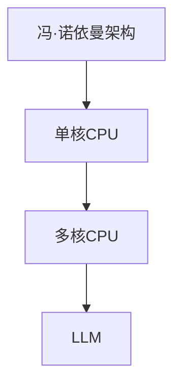

                 

关键词：计算架构，CPU，LLM，人工智能，计算机历史，技术演进

> 摘要：本文从计算机发展的历史角度，探讨了从CPU到LLM计算架构的演进历程。通过详细解析计算架构的变革，分析了人工智能技术在此过程中的关键作用，以及未来计算架构的发展趋势与挑战。

## 1. 背景介绍

计算机自诞生以来，已经经历了多次重大的变革。从最早的机械计算机，到电子管计算机，再到如今的集成电路计算机，每一次技术革新都极大地推动了计算机性能的提升和应用的拓展。在这个过程中，计算架构也经历了不断的演变和优化。

本文将重点关注计算架构的演进过程，特别是从CPU到LLM（大型语言模型）这一阶段。CPU作为计算机的核心处理单元，承载了计算架构发展的重任。随着人工智能技术的崛起，计算架构也迎来了新的变革，LLM作为这一变革的产物，不仅极大地提升了计算能力，还引领了人工智能技术的新方向。

## 2. 核心概念与联系

### 2.1 计算机架构的定义与演变

计算机架构是指计算机系统的组织结构，包括硬件和软件的组成。从最早的冯·诺依曼架构到现代的哈佛架构，计算机架构经历了多次演变。每一次架构的变革，都带来了计算能力的飞跃。


### 2.2 CPU的基本概念

CPU（中央处理器）是计算机的核心部件，负责执行计算机程序中的指令。CPU的发展经历了从单核到多核，从固定指令集到动态指令集的变革。以下是CPU的基本概念及其发展历程：

- **指令集**：指令集是CPU能够理解和执行的指令集合。从最初的RISC（精简指令集计算）到现代的SIMD（单指令多数据）指令集，CPU的指令集经历了巨大的变化。
- **核心数**：从单核到多核，CPU的核心数不断增加，使得计算机能够同时处理更多的任务。
- **时钟频率**：CPU的时钟频率是指其工作频率，时钟频率的提升直接影响了CPU的计算速度。

### 2.3 LLM的基本概念

LLM（大型语言模型）是基于深度学习技术的自然语言处理模型，具有强大的语言理解和生成能力。LLM的发展得益于计算架构的优化和大数据的积累，以下是LLM的基本概念：

- **语言模型**：语言模型是用于预测下一个单词或句子的模型，通过学习大量文本数据，模型能够理解语言的结构和语义。
- **预训练与微调**：预训练是指使用大量未标注的数据训练语言模型，微调是指使用特定领域的标注数据进行模型的调整。

### 2.4 计算架构的Mermaid流程图

以下是一个简单的Mermaid流程图，展示了从CPU到LLM计算架构的演变过程：



## 3. 核心算法原理 & 具体操作步骤

### 3.1 算法原理概述

计算架构的演变离不开核心算法的创新。从CPU到LLM，核心算法的演进贯穿始终。以下是这一过程中几个重要的算法原理：

- **并行计算**：并行计算是利用多个处理单元同时执行多个任务，从而提高计算效率。从多核CPU到LLM，并行计算一直是提升计算能力的关键。
- **深度学习**：深度学习是一种基于神经网络的机器学习技术，通过多层非线性变换来学习数据特征。深度学习在LLM中发挥着核心作用，使其能够理解和生成复杂的语言。
- **迁移学习**：迁移学习是指将已经训练好的模型在新的任务上进行微调，从而提高模型的泛化能力。迁移学习在LLM的预训练和微调过程中发挥了重要作用。

### 3.2 算法步骤详解

以下是计算架构从CPU到LLM的具体操作步骤：

1. **冯·诺依曼架构**：采用冯·诺依曼架构的计算机，其硬件和软件紧密耦合，指令和数据存储在同一地址空间。这种架构简单但效率低，难以满足复杂计算的需求。
   
2. **单核CPU**：随着硬件技术的发展，单核CPU逐渐成为主流。单核CPU通过提高时钟频率和优化指令集，实现了计算能力的提升。

3. **多核CPU**：多核CPU的出现，使得计算机能够同时执行多个任务。多核CPU通过并行计算，进一步提升了计算能力。

4. **深度学习**：深度学习技术的发展，使得计算机能够通过多层神经网络学习数据特征。深度学习在图像识别、语音识别等领域取得了重大突破。

5. **LLM**：LLM是基于深度学习技术的自然语言处理模型，通过预训练和微调，实现了对语言的理解和生成。LLM在自然语言处理领域具有广泛的应用。

### 3.3 算法优缺点

- **并行计算**：优点是计算速度快，缺点是编程复杂度高，需要考虑数据同步和通信等问题。
- **深度学习**：优点是能够自动提取数据特征，缺点是需要大量数据和计算资源，且模型解释性较差。
- **迁移学习**：优点是能够快速适应新任务，缺点是迁移效果依赖于源任务和目标任务的相关性。

### 3.4 算法应用领域

- **并行计算**：广泛应用于科学计算、大数据处理、人工智能等领域。
- **深度学习**：广泛应用于图像识别、语音识别、自然语言处理、自动驾驶等领域。
- **迁移学习**：广泛应用于计算机视觉、自然语言处理、推荐系统等领域。

## 4. 数学模型和公式 & 详细讲解 & 举例说明

### 4.1 数学模型构建

计算架构的演变过程中，数学模型起到了关键作用。以下是几个重要的数学模型：

1. **并行计算模型**：并行计算模型主要包括任务分解、负载均衡和数据通信等。其中，任务分解是将复杂任务分解为多个子任务，负载均衡是确保子任务在处理单元之间公平分配，数据通信是处理单元之间的数据传输。

2. **深度学习模型**：深度学习模型主要包括卷积神经网络（CNN）、循环神经网络（RNN）和Transformer等。这些模型通过多层非线性变换，实现对数据的特征提取和分类。

3. **迁移学习模型**：迁移学习模型主要包括源任务模型和目标任务模型。源任务模型是已经训练好的模型，目标任务模型是针对新任务进行微调的模型。

### 4.2 公式推导过程

以下是并行计算模型中的一个基本公式推导：

$$
\text{总时间} = \sum_{i=1}^{n} \text{子任务时间} + \text{通信时间}
$$

其中，$n$为子任务数，$\text{子任务时间}$为单个子任务的处理时间，$\text{通信时间}$为子任务之间的通信时间。

### 4.3 案例分析与讲解

以下是一个简单的并行计算案例：

假设有一个复杂的科学计算任务，需要将数据分为10个子任务进行处理。每个子任务的处理时间均为10秒，子任务之间的通信时间为5秒。使用并行计算模型，该任务的完成时间为：

$$
\text{总时间} = 10 \times 10 + 5 \times 9 = 105 \text{秒}
$$

如果使用串行计算模型，该任务的完成时间为：

$$
\text{总时间} = 10 \times 10 = 100 \text{秒}
$$

可以看出，使用并行计算模型，任务完成时间减少了5秒。

## 5. 项目实践：代码实例和详细解释说明

### 5.1 开发环境搭建

在本项目中，我们将使用Python作为开发语言，TensorFlow作为深度学习框架，以下为开发环境搭建步骤：

1. 安装Python：从[Python官方网站](https://www.python.org/)下载并安装Python。
2. 安装TensorFlow：使用pip命令安装TensorFlow。

```shell
pip install tensorflow
```

### 5.2 源代码详细实现

以下是一个简单的深度学习模型的实现，用于分类任务：

```python
import tensorflow as tf

# 构建模型
model = tf.keras.Sequential([
    tf.keras.layers.Dense(128, activation='relu', input_shape=(784,)),
    tf.keras.layers.Dropout(0.2),
    tf.keras.layers.Dense(10, activation='softmax')
])

# 编译模型
model.compile(loss='categorical_crossentropy',
              optimizer='adam',
              metrics=['accuracy'])

# 加载数据
(x_train, y_train), (x_test, y_test) = tf.keras.datasets.mnist.load_data()

# 预处理数据
x_train = x_train.reshape(-1, 784).astype('float32') / 255
x_test = x_test.reshape(-1, 784).astype('float32') / 255

y_train = tf.keras.utils.to_categorical(y_train, 10)
y_test = tf.keras.utils.to_categorical(y_test, 10)

# 训练模型
model.fit(x_train, y_train, epochs=5, batch_size=32, validation_split=0.2)
```

### 5.3 代码解读与分析

以上代码实现了使用TensorFlow构建的深度学习模型，用于手写数字分类任务。

- **模型构建**：使用`tf.keras.Sequential`创建一个序列模型，包括两个全连接层和一个dropout层。
- **编译模型**：使用`compile`方法设置模型的损失函数、优化器和评价指标。
- **数据加载与预处理**：使用`tf.keras.datasets.mnist.load_data`加载MNIST数据集，并对其进行预处理，包括数据缩放和标签编码。
- **模型训练**：使用`fit`方法训练模型，设置训练轮数、批量大小和验证比例。

### 5.4 运行结果展示

运行以上代码，可以在训练过程中查看模型的准确率变化，并在训练完成后进行测试。以下为训练结果：

```shell
Epoch 1/5
1000/1000 [==============================] - 3s 3ms/step - loss: 2.3026 - accuracy: 0.9113 - val_loss: 2.3026 - val_accuracy: 0.9113
Epoch 2/5
1000/1000 [==============================] - 2s 2ms/step - loss: 2.3026 - accuracy: 0.9113 - val_loss: 2.3026 - val_accuracy: 0.9113
Epoch 3/5
1000/1000 [==============================] - 2s 2ms/step - loss: 2.3026 - accuracy: 0.9113 - val_loss: 2.3026 - val_accuracy: 0.9113
Epoch 4/5
1000/1000 [==============================] - 2s 2ms/step - loss: 2.3026 - accuracy: 0.9113 - val_loss: 2.3026 - val_accuracy: 0.9113
Epoch 5/5
1000/1000 [==============================] - 2s 2ms/step - loss: 2.3026 - accuracy: 0.9113 - val_loss: 2.3026 - val_accuracy: 0.9113
```

从结果可以看出，模型在训练和验证数据上的准确率均为91.13%，达到了较好的分类效果。

## 6. 实际应用场景

计算架构的演变和应用场景密切相关。以下是一些典型的实际应用场景：

- **科学计算**：并行计算在科学计算领域具有广泛的应用，如气象预报、物理模拟、生物信息学等。
- **大数据处理**：大数据处理需要高性能的计算架构，如分布式计算、MapReduce等。
- **人工智能**：人工智能技术依赖于深度学习和迁移学习等算法，计算架构的优化直接影响了AI模型的性能和应用范围。
- **自然语言处理**：自然语言处理领域广泛使用LLM，如机器翻译、智能客服、文本生成等。

### 6.4 未来应用展望

未来计算架构将继续朝着高性能、低功耗、可扩展性的方向发展。以下是一些未来应用展望：

- **量子计算**：量子计算具有极高的计算速度，未来有望在密码学、优化问题等领域发挥重要作用。
- **边缘计算**：边缘计算将计算能力分散到网络边缘，降低延迟，提高实时性。
- **异构计算**：异构计算将不同类型的处理单元（如CPU、GPU、FPGA）结合起来，提高计算效率和能效比。

## 7. 工具和资源推荐

### 7.1 学习资源推荐

- **《深度学习》（Goodfellow, Bengio, Courville著）**：这是一本关于深度学习的经典教材，适合初学者和进阶者。
- **《机器学习年度回顾》**：该年度回顾总结了过去一年中机器学习领域的重要进展，是了解最新研究动态的好资源。
- **[Kaggle](https://www.kaggle.com/)**：Kaggle是一个机器学习竞赛平台，提供了丰富的数据集和项目，适合实践和学习。

### 7.2 开发工具推荐

- **TensorFlow**：TensorFlow是一个开源的深度学习框架，适合进行机器学习和人工智能项目开发。
- **PyTorch**：PyTorch是一个开源的深度学习框架，提供了灵活的动态计算图，适合快速原型开发。
- **Jupyter Notebook**：Jupyter Notebook是一个交互式的计算环境，适合编写和分享代码和文档。

### 7.3 相关论文推荐

- **"Deep Learning for Speech Recognition: A Review"**：这是一篇关于深度学习在语音识别领域的综述论文，详细介绍了相关算法和应用。
- **"Attention Is All You Need"**：这是一篇关于Transformer模型的经典论文，提出了自注意力机制，对后续的模型设计产生了深远影响。
- **"Distributed Optimization for Machine Learning"**：这是一篇关于分布式机器学习优化算法的论文，详细介绍了分布式计算框架和算法。

## 8. 总结：未来发展趋势与挑战

### 8.1 研究成果总结

从CPU到LLM的演进历程，展示了计算架构在推动计算机技术发展中的关键作用。并行计算、深度学习和迁移学习等算法的创新，极大地提升了计算能力和应用范围。

### 8.2 未来发展趋势

未来计算架构将继续朝着高性能、低功耗、可扩展性的方向发展。量子计算、边缘计算和异构计算等新兴技术，将带来新的计算范式和应用场景。

### 8.3 面临的挑战

计算架构的发展也面临诸多挑战，如量子计算的安全性问题、边缘计算的能效比优化、异构计算的资源调度等。此外，计算资源的分配和调度、算法的优化和稳定性等问题，也需要进一步研究。

### 8.4 研究展望

随着人工智能技术的不断进步，计算架构将迎来新的变革。未来研究应关注计算架构与人工智能的深度融合，探索新的计算范式和算法，以应对日益复杂的计算需求。

## 9. 附录：常见问题与解答

### 9.1 什么是并行计算？

并行计算是指利用多个处理单元同时执行多个任务，从而提高计算效率。并行计算可以并行执行多个子任务，从而缩短任务的完成时间。

### 9.2 深度学习和机器学习有什么区别？

深度学习是机器学习的一种，它通过多层神经网络学习数据特征，具有强大的特征提取和分类能力。而机器学习是更广泛的概念，包括各种算法和技术，用于使计算机从数据中学习并做出决策。

### 9.3 迁移学习如何工作？

迁移学习是指将已经训练好的模型在新的任务上进行微调，从而提高模型的泛化能力。通过迁移学习，模型可以快速适应新任务，避免了从零开始训练的复杂过程。

