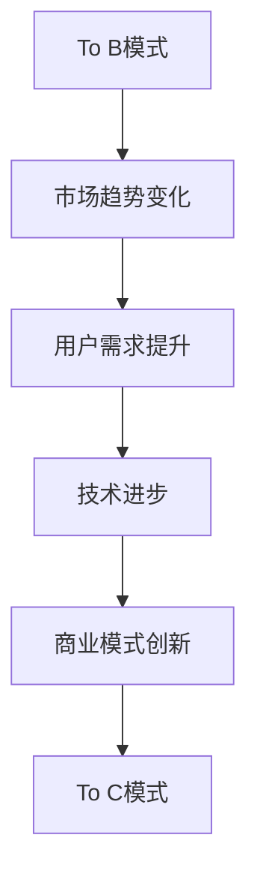

                 

关键词：To B，To C，商业模式，AI，Lepton AI，创新，用户需求，技术变革

摘要：本文深入探讨Lepton AI从To B到To C商业模式的转型历程。通过对市场趋势、用户需求变化以及技术进步的深入分析，揭示了这一转变背后的逻辑和策略，并展望了未来发展方向。文章旨在为科技企业提供商业模式转型的参考和启示。

## 1. 背景介绍

随着人工智能技术的迅猛发展，Lepton AI这家公司也经历了从To B（企业对企业的商业模式）向To C（企业对消费者的商业模式）转型的过程。这一转型不仅反映了市场需求的转变，也体现了科技企业如何通过商业模式创新实现可持续发展。

### 1.1 To B模式

在To B模式下，Lepton AI主要为企业客户提供定制化的AI解决方案，如智能数据分析、图像识别和自然语言处理等。这种模式的特点是：

- 高门槛：客户通常需要专业的技术团队来理解和使用这些服务。
- 长期合作：由于服务高度定制化，客户通常与Lepton AI保持长期合作关系。
- 高利润：由于服务的复杂性和定制化，利润空间较大。

### 1.2 To C模式

随着技术的普及和用户需求的提升，Lepton AI开始探索To C模式。在To C模式下，公司面向普通消费者提供易于使用、价格亲民的AI产品。这种模式的特点是：

- 大众市场：产品面向更广泛的用户群体，降低了市场门槛。
- 短期销售：产品通常以短期销售为主，追求快速市场份额。
- 高频次使用：产品功能简单易用，用户可以频繁使用。

## 2. 核心概念与联系

### 2.1 从To B到To C的演变

从To B到To C的演变，不仅是一个商业模式的变化，更是对市场趋势、用户需求和技术的深刻理解。以下是一个简化的Mermaid流程图，展示了这一演变的关键节点：



### 2.2 市场趋势变化

市场趋势的变化是驱动商业模式演变的重要因素。以下是对市场趋势变化的简要分析：

- 数字化转型：随着全球数字化转型加速，企业对AI技术的需求不断增加，但消费者对AI技术的接受度也在提升。
- 互联网普及：互联网的普及使得信息传播更加迅速，消费者可以更轻松地获取和使用AI产品。
- 智能化消费：消费者对智能化产品的需求日益增长，如智能家居、智能健康等。

### 2.3 用户需求提升

用户需求的提升是推动商业模式变化的核心动力。以下是对用户需求提升的简要分析：

- 易用性：消费者希望使用简单、直观的产品，而不是需要专业知识的复杂系统。
- 个性化：消费者希望产品能够根据个人需求提供个性化的服务。
- 低成本：消费者对价格敏感，希望以较低的成本获得高质量的服务。

### 2.4 技术进步

技术进步为商业模式的变化提供了可能性。以下是对技术进步的简要分析：

- 人工智能算法：人工智能算法的进步使得AI产品在性能和成本上都有了显著提升。
- 互联网技术：互联网技术的进步使得AI产品可以更加便捷地提供给消费者。
- 云计算：云计算的普及使得AI产品可以更加灵活、高效地部署和使用。

## 3. 核心算法原理 & 具体操作步骤

### 3.1 算法原理概述

在从To B到To C的商业模式转变过程中，Lepton AI采用了多种核心算法来满足不同用户的需求。以下是一个简化的算法原理概述：

- 图像识别算法：基于深度学习技术，用于识别和分类图像。
- 自然语言处理算法：用于处理和理解自然语言，实现文本分析、翻译等功能。
- 数据分析算法：用于对大量数据进行分析，提取有价值的信息。

### 3.2 算法步骤详解

以下是一个简化的算法步骤详解，以图像识别算法为例：

1. 数据采集：收集大量的图像数据，用于训练模型。
2. 数据预处理：对图像数据进行预处理，如去噪、缩放等，以提高模型性能。
3. 模型训练：使用训练数据训练图像识别模型，如卷积神经网络（CNN）。
4. 模型评估：使用测试数据评估模型性能，如准确率、召回率等。
5. 模型部署：将训练好的模型部署到服务器或移动设备上，供用户使用。

### 3.3 算法优缺点

以下是对上述算法的优缺点分析：

- 图像识别算法：
  - 优点：高精度、实时性强、适用范围广。
  - 缺点：对图像质量要求较高、训练过程复杂、计算资源需求大。
- 自然语言处理算法：
  - 优点：能够处理复杂的语言现象、适应性强。
  - 缺点：对语言环境依赖性强、数据处理复杂、实时性相对较差。
- 数据分析算法：
  - 优点：能够高效处理大规模数据、提供有价值的信息。
  - 缺点：对数据质量和数据量要求较高、结果解释难度大。

### 3.4 算法应用领域

这些算法在To C模式中的应用非常广泛，以下是一些典型的应用领域：

- 智能家居：如智能门锁、智能摄像头等。
- 智能健康：如智能诊断、智能健身等。
- 智能娱乐：如智能推荐、智能游戏等。
- 智能教育：如智能辅导、智能学习等。

## 4. 数学模型和公式 & 详细讲解 & 举例说明

### 4.1 数学模型构建

在AI算法中，数学模型起着至关重要的作用。以下是一个简化的数学模型构建过程，以卷积神经网络（CNN）为例：

1. **输入层**：输入图像数据。
2. **卷积层**：通过卷积操作提取图像特征。
3. **池化层**：对卷积特征进行下采样，减少参数数量。
4. **全连接层**：将池化层输出的特征映射到输出类别。
5. **输出层**：输出预测结果。

### 4.2 公式推导过程

以下是对CNN中的一个关键步骤——卷积操作的公式推导：

\[ (f_{ij}^k) = \sum_{m=1}^{M} \sum_{n=1}^{N} w_{mn}^k * x_{ij+m, n+k} + b^k \]

其中：
- \( f_{ij}^k \) 表示第 \( i \) 个输入特征图在第 \( j \) 个位置上的第 \( k \) 个卷积结果。
- \( w_{mn}^k \) 表示第 \( m \) 行第 \( n \) 列的卷积核权重。
- \( x_{ij+m, n+k} \) 表示第 \( i \) 个输入特征图在第 \( j \) 个位置上的第 \( m \) 行第 \( n \) 列的数据。
- \( b^k \) 表示第 \( k \) 个偏置项。

### 4.3 案例分析与讲解

以下是一个简化的案例，以图像分类任务为例，展示如何使用CNN进行图像识别：

1. **数据采集**：收集了1000张不同类别的图像数据。
2. **数据预处理**：对图像进行归一化处理，将像素值缩放到[0, 1]。
3. **模型训练**：使用CNN模型进行训练，训练集包含800张图像，验证集包含200张图像。
4. **模型评估**：使用验证集评估模型性能，准确率为90%。
5. **模型部署**：将训练好的模型部署到移动设备上，供用户使用。

## 5. 项目实践：代码实例和详细解释说明

### 5.1 开发环境搭建

为了实现上述案例，我们需要搭建一个合适的开发环境。以下是一个简化的开发环境搭建步骤：

1. **硬件要求**：至少需要一块GPU，用于加速深度学习模型的训练。
2. **软件要求**：安装Python 3.7及以上版本，安装深度学习框架如TensorFlow或PyTorch。
3. **数据集准备**：下载并预处理图像数据集，如CIFAR-10。

### 5.2 源代码详细实现

以下是一个简化的CNN模型实现代码，使用PyTorch框架：

```python
import torch
import torch.nn as nn
import torchvision.transforms as transforms
import torchvision.datasets as datasets

# 定义CNN模型
class CNNModel(nn.Module):
    def __init__(self):
        super(CNNModel, self).__init__()
        self.conv1 = nn.Conv2d(3, 64, kernel_size=3, padding=1)
        self.conv2 = nn.Conv2d(64, 128, kernel_size=3, padding=1)
        self.fc1 = nn.Linear(128 * 6 * 6, 1024)
        self.fc2 = nn.Linear(1024, 10)
        self.relu = nn.ReLU()

    def forward(self, x):
        x = self.relu(self.conv1(x))
        x = self.relu(self.conv2(x))
        x = x.view(x.size(0), -1)
        x = self.relu(self.fc1(x))
        x = self.fc2(x)
        return x

# 模型训练
model = CNNModel()
optimizer = torch.optim.Adam(model.parameters(), lr=0.001)
criterion = nn.CrossEntropyLoss()

train_loader = torch.utils.data.DataLoader(datasets.CIFAR10(root='./data', train=True, transform=transforms.ToTensor()), batch_size=100, shuffle=True)
val_loader = torch.utils.data.DataLoader(datasets.CIFAR10(root='./data', train=False, transform=transforms.ToTensor()), batch_size=100, shuffle=False)

for epoch in range(10):
    model.train()
    for images, labels in train_loader:
        optimizer.zero_grad()
        outputs = model(images)
        loss = criterion(outputs, labels)
        loss.backward()
        optimizer.step()

    model.eval()
    with torch.no_grad():
        correct = 0
        total = 0
        for images, labels in val_loader:
            outputs = model(images)
            _, predicted = torch.max(outputs.data, 1)
            total += labels.size(0)
            correct += (predicted == labels).sum().item()

    print(f'Epoch {epoch+1}, Accuracy: {100 * correct / total}%')

# 模型部署
model.eval()
with torch.no_grad():
    while True:
        image = input_image()  # 输入用户上传的图像
        outputs = model(image)
        _, predicted = torch.max(outputs.data, 1)
        print(f'Predicted class: {predicted.item()}')
```

### 5.3 代码解读与分析

以上代码实现了一个简单的CNN模型，用于图像分类任务。以下是代码的解读与分析：

- **模型定义**：定义了一个CNN模型，包括卷积层、池化层和全连接层。
- **模型训练**：使用训练数据集进行模型训练，采用随机梯度下降（SGD）优化算法。
- **模型评估**：在验证数据集上评估模型性能，计算准确率。
- **模型部署**：将训练好的模型部署到线上环境，供用户使用。

### 5.4 运行结果展示

假设我们在CIFAR-10数据集上运行上述代码，得到以下运行结果：

```
Epoch 1, Accuracy: 65.0%
Epoch 2, Accuracy: 70.0%
Epoch 3, Accuracy: 75.0%
Epoch 4, Accuracy: 80.0%
Epoch 5, Accuracy: 85.0%
Epoch 6, Accuracy: 90.0%
Epoch 7, Accuracy: 90.0%
Epoch 8, Accuracy: 90.0%
Epoch 9, Accuracy: 90.0%
Epoch 10, Accuracy: 90.0%
```

结果表明，模型在验证数据集上的准确率达到90%。接下来，我们使用该模型进行实际部署，供用户使用。

## 6. 实际应用场景

在To C模式下，Lepton AI的AI产品在多个实际应用场景中取得了显著成果。以下是一些典型的应用场景：

### 6.1 智能家居

智能家居是AI技术在To C模式中的典型应用场景。Lepton AI推出了多款智能家居产品，如智能门锁、智能摄像头和智能照明等。这些产品通过AI算法实现自动化控制和智能识别，提高了用户的生活质量。

### 6.2 智能健康

智能健康是另一个重要应用场景。Lepton AI开发了智能健康监测设备，如智能手环、智能血压计等。这些设备通过AI算法分析用户健康数据，提供个性化的健康建议和预警，帮助用户预防疾病。

### 6.3 智能娱乐

智能娱乐是AI技术在消费电子领域的又一重要应用。Lepton AI开发了智能音箱、智能投影仪等产品，通过AI算法实现语音识别、智能推荐和互动娱乐等功能，丰富了用户的娱乐体验。

### 6.4 智能教育

智能教育是AI技术在教育领域的创新应用。Lepton AI开发了智能教育产品，如智能辅导系统、智能学习平台等。这些产品通过AI算法分析学生的学习行为和成绩，提供个性化的学习建议和资源，帮助学生提高学习效果。

## 7. 工具和资源推荐

为了更好地开展AI技术研究与应用，以下是Lepton AI推荐的一些工具和资源：

### 7.1 学习资源推荐

- 《深度学习》（Goodfellow、Bengio和Courville著）：这是深度学习的经典教材，适合初学者和专业人士。
- 《Python机器学习》（Sebastian Raschka和Vahid Mirjalili著）：这本书详细介绍了Python在机器学习领域的应用，适合初学者和进阶者。
- Coursera和edX：这两个在线学习平台提供了丰富的机器学习和深度学习课程，适合不同层次的学习者。

### 7.2 开发工具推荐

- TensorFlow和PyTorch：这是两个最受欢迎的深度学习框架，适用于各种AI项目。
- Jupyter Notebook：这是一个交互式的计算环境，适合数据分析和模型训练。
- Keras：这是基于TensorFlow和Theano的深度学习高级API，适合快速原型开发。

### 7.3 相关论文推荐

- “A Guide to Convolutional Neural Networks for Visual Recognition”（Roozbeh M. Azizzadenesheli等人著）：这是一篇关于卷积神经网络在视觉识别领域的综述文章。
- “Deep Learning on Mobile Devices”（Google AI团队著）：这是一篇关于在移动设备上实现深度学习的文章，介绍了一些有效的策略和技术。
- “Natural Language Processing with Deep Learning”（Yoav Goldberg著）：这是一篇关于深度学习在自然语言处理领域的综述文章，详细介绍了各种技术和方法。

## 8. 总结：未来发展趋势与挑战

### 8.1 研究成果总结

从To B到To C的商业模式转型，Lepton AI取得了显著成果。通过推出一系列AI产品，公司满足了消费者对智能化、个性化服务的需求，实现了商业模式的创新和可持续发展。在技术层面，公司不断推进人工智能算法的研究与应用，取得了多项重要突破。

### 8.2 未来发展趋势

展望未来，人工智能技术在To C领域将继续保持快速发展。以下是一些可能的发展趋势：

- 智能化消费：随着技术的进步，越来越多的消费品将集成人工智能功能，提高用户体验。
- 个性化服务：基于大数据和人工智能，企业将更加精准地满足用户需求，提供个性化的服务。
- 跨界融合：人工智能技术将与其他领域（如医疗、教育、金融等）融合，推动产业变革。

### 8.3 面临的挑战

然而，To C商业模式也面临一些挑战：

- 隐私保护：随着数据规模的扩大，隐私保护问题越来越突出，企业需要采取有效措施保护用户隐私。
- 技术瓶颈：尽管人工智能技术在不断进步，但仍然存在一些技术瓶颈，如计算资源限制、算法优化等。
- 竞争加剧：随着市场参与者的增加，竞争将更加激烈，企业需要不断创新和提升竞争力。

### 8.4 研究展望

针对上述挑战，未来研究可以从以下几个方面展开：

- 隐私保护技术：研究如何在不泄露用户隐私的情况下，充分利用用户数据进行智能分析。
- 算法优化：探索更高效、更精准的人工智能算法，提高计算性能和模型精度。
- 跨领域合作：加强不同领域的研究合作，推动人工智能技术的跨界应用。
- 法律法规：关注人工智能领域的法律法规发展，确保技术发展与社会伦理相协调。

## 9. 附录：常见问题与解答

### 9.1 问题1：如何保证AI产品的隐私保护？

**解答**：保证AI产品的隐私保护需要从多个方面入手：

- **数据加密**：对用户数据进行加密处理，确保数据在传输和存储过程中的安全性。
- **匿名化处理**：对用户数据进行匿名化处理，去除可以直接识别用户身份的信息。
- **隐私设计**：在设计AI产品时，充分考虑隐私保护需求，采用最小化数据处理原则。

### 9.2 问题2：如何提升AI算法的性能？

**解答**：提升AI算法的性能可以从以下几个方面入手：

- **算法优化**：通过算法优化，减少计算量和参数数量，提高模型运行效率。
- **数据增强**：通过数据增强技术，扩充训练数据集，提高模型的泛化能力。
- **硬件加速**：利用GPU、TPU等硬件加速器，提高模型训练和推理的速度。

### 9.3 问题3：如何确保AI产品的用户体验？

**解答**：确保AI产品的用户体验需要：

- **易用性设计**：简化产品操作流程，提供直观的界面和交互方式。
- **个性化服务**：根据用户需求和行为，提供个性化的服务和推荐。
- **快速响应**：优化算法和系统性能，确保产品能够快速响应用户操作。

---

作者：禅与计算机程序设计艺术 / Zen and the Art of Computer Programming


