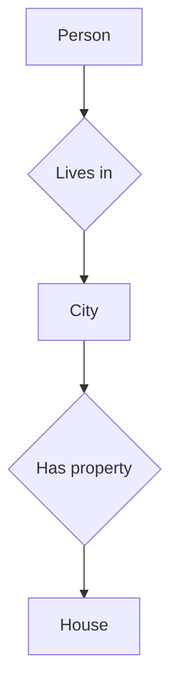
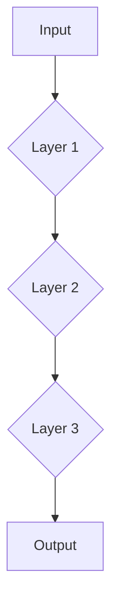
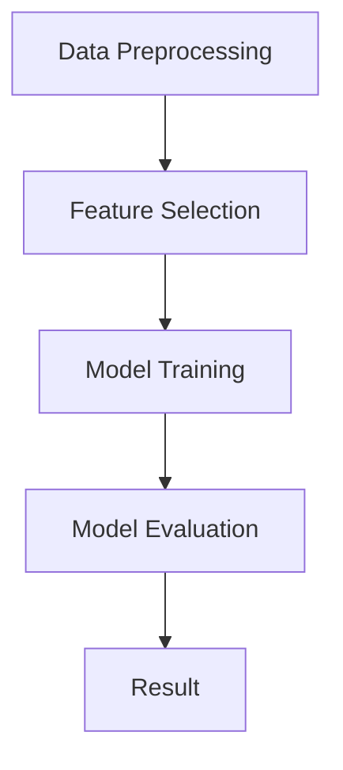

                 

关键词：人工智能、专家系统、知识发现、知识图谱、机器学习、深度学习、数据挖掘、神经网络、算法、模型、技术发展、未来趋势

> 摘要：本文旨在探讨人工智能（AI）从专家系统到知识发现引擎的进化过程。通过对专家系统的定义、历史背景、局限性进行分析，我们将进一步探讨知识发现引擎的概念、架构和实现，以及这一过程中所涉及的算法和技术。文章还将结合实际应用场景，探讨AI技术的发展趋势与面临的挑战。

## 1. 背景介绍

### 1.1 专家系统的历史背景

专家系统（Expert Systems）是人工智能领域早期的重要成果之一。自20世纪70年代以来，专家系统在各种领域（如医疗诊断、财务分析、法律咨询等）取得了显著的成果。其核心思想是模拟人类专家的决策过程，通过一组预定义的规则和推理机制来解决复杂问题。

然而，专家系统在实际应用中也暴露出一些局限性。首先，规则库的建立和维护需要大量人工参与，而且规则本身往往难以形式化地表达。其次，专家系统的推理能力有限，难以处理不确定性问题和动态环境。此外，专家系统的可解释性较差，难以让用户理解其决策过程。

### 1.2 知识发现引擎的概念

知识发现引擎（Knowledge Discovery Engine）是一种面向大规模数据的高效知识提取工具。其目标是从原始数据中自动发现有价值的信息和模式，帮助用户更好地理解和利用数据。知识发现引擎通常涉及数据挖掘、机器学习和深度学习等领域的知识。

与专家系统相比，知识发现引擎具有以下优势：

- **自动性**：知识发现引擎能够自动地从海量数据中提取知识和模式，降低人工干预的需求。
- **适应性**：知识发现引擎能够处理不确定性和动态变化的数据，适应不同应用场景。
- **可扩展性**：知识发现引擎可以处理大规模数据，支持多种数据源和算法。

## 2. 核心概念与联系

### 2.1 知识图谱

知识图谱（Knowledge Graph）是一种用于表示实体及其关系的图形结构。在知识发现引擎中，知识图谱充当了数据组织和知识表示的核心。其基本结构包括实体、属性和关系。

以下是一个简单的知识图谱示例：



在这个示例中，A表示实体“Person”，B、C、D和E表示属性和关系。

### 2.2 机器学习与深度学习

机器学习（Machine Learning）和深度学习（Deep Learning）是知识发现引擎的核心技术。机器学习通过构建数学模型来模拟人类的学习过程，从数据中自动提取特征和模式。深度学习则是机器学习的一种特殊形式，通过多层神经网络来实现自动特征提取和表示学习。

以下是一个简单的机器学习模型结构：



在这个示例中，A表示输入数据，B、C和D表示不同的神经网络层，E表示输出结果。

### 2.3 数据挖掘

数据挖掘（Data Mining）是从大量数据中提取有价值信息的过程。数据挖掘通常涉及以下步骤：数据预处理、特征选择、模型训练和评估。以下是一个简单的数据挖掘流程：



在这个示例中，A表示数据预处理，B表示特征选择，C表示模型训练，D表示模型评估，E表示最终结果。

## 3. 核心算法原理 & 具体操作步骤

### 3.1 算法原理概述

知识发现引擎的核心算法包括机器学习、深度学习和数据挖掘。以下分别介绍这些算法的基本原理。

#### 3.1.1 机器学习

机器学习的基本原理是通过学习训练数据中的特征和模式，构建预测模型。常见的机器学习算法包括线性回归、逻辑回归、支持向量机、决策树和随机森林等。

#### 3.1.2 深度学习

深度学习的基本原理是通过多层神经网络实现自动特征提取和表示学习。深度学习的代表性算法包括卷积神经网络（CNN）、循环神经网络（RNN）和生成对抗网络（GAN）等。

#### 3.1.3 数据挖掘

数据挖掘的基本原理是通过数据预处理、特征选择、模型训练和评估，从大量数据中提取有价值的信息。数据挖掘的代表性算法包括关联规则挖掘、分类和聚类等。

### 3.2 算法步骤详解

#### 3.2.1 机器学习

机器学习的基本步骤包括：

1. 数据收集：收集相关领域的数据，包括结构化数据、非结构化数据和半结构化数据。
2. 数据预处理：对数据进行清洗、归一化和特征提取，为模型训练做准备。
3. 模型选择：选择合适的机器学习算法，构建预测模型。
4. 模型训练：使用训练数据训练模型，优化模型参数。
5. 模型评估：使用测试数据评估模型性能，调整模型参数。
6. 模型应用：将训练好的模型应用于实际问题，进行预测和决策。

#### 3.2.2 深度学习

深度学习的基本步骤包括：

1. 数据收集：收集相关领域的数据，包括结构化数据、非结构化数据和半结构化数据。
2. 数据预处理：对数据进行清洗、归一化和特征提取，为模型训练做准备。
3. 模型构建：选择合适的深度学习架构，如卷积神经网络（CNN）或循环神经网络（RNN）。
4. 模型训练：使用训练数据训练模型，优化模型参数。
5. 模型评估：使用测试数据评估模型性能，调整模型参数。
6. 模型应用：将训练好的模型应用于实际问题，进行预测和决策。

#### 3.2.3 数据挖掘

数据挖掘的基本步骤包括：

1. 数据收集：收集相关领域的数据，包括结构化数据、非结构化数据和半结构化数据。
2. 数据预处理：对数据进行清洗、归一化和特征提取，为模型训练做准备。
3. 特征选择：选择与目标变量相关的重要特征。
4. 模型训练：选择合适的算法，如关联规则挖掘、分类和聚类，训练模型。
5. 模型评估：使用交叉验证等方法评估模型性能。
6. 模型应用：将训练好的模型应用于实际问题，进行预测和决策。

### 3.3 算法优缺点

#### 3.3.1 机器学习

优点：

- **通用性**：机器学习算法适用于多种领域和问题。
- **灵活性**：机器学习算法可以处理不同类型的数据，如结构化数据、非结构化数据和半结构化数据。

缺点：

- **数据依赖性**：机器学习算法的性能高度依赖于数据的质量和数量。
- **可解释性差**：机器学习模型的决策过程通常难以解释和理解。

#### 3.3.2 深度学习

优点：

- **强大的特征提取能力**：深度学习可以通过多层神经网络自动提取特征，减少人工干预。
- **适用于复杂数据**：深度学习可以处理高维数据和复杂的非线性关系。

缺点：

- **计算资源需求高**：深度学习算法通常需要大量的计算资源和时间。
- **模型可解释性差**：深度学习模型的决策过程仍然难以解释和理解。

#### 3.3.3 数据挖掘

优点：

- **适用性广泛**：数据挖掘算法适用于多种领域和问题。
- **可解释性强**：数据挖掘算法的决策过程通常可以解释和理解。

缺点：

- **数据预处理复杂**：数据挖掘算法通常需要大量的数据预处理工作。
- **算法选择困难**：数据挖掘算法种类繁多，选择合适的算法需要丰富的经验和专业知识。

### 3.4 算法应用领域

#### 3.4.1 机器学习

机器学习在以下领域有广泛应用：

- **金融**：风险评估、信用评分、股票市场预测等。
- **医疗**：疾病诊断、药物研发、医疗影像分析等。
- **电商**：个性化推荐、价格预测、欺诈检测等。

#### 3.4.2 深度学习

深度学习在以下领域有广泛应用：

- **计算机视觉**：图像分类、目标检测、图像生成等。
- **自然语言处理**：语音识别、机器翻译、情感分析等。
- **推荐系统**：个性化推荐、广告投放等。

#### 3.4.3 数据挖掘

数据挖掘在以下领域有广泛应用：

- **商业**：市场分析、客户关系管理、供应链优化等。
- **教育**：学习行为分析、教学评估等。
- **公共安全**：犯罪预测、交通流量分析等。

## 4. 数学模型和公式 & 详细讲解 & 举例说明

### 4.1 数学模型构建

在知识发现引擎中，数学模型扮演着核心角色。以下是一些常见的数学模型及其构建过程。

#### 4.1.1 线性回归模型

线性回归模型是一种最简单的机器学习模型，用于预测连续值。其数学模型如下：

$$
y = \beta_0 + \beta_1 x_1 + \beta_2 x_2 + \ldots + \beta_n x_n + \epsilon
$$

其中，$y$是预测值，$x_1, x_2, \ldots, x_n$是输入特征，$\beta_0, \beta_1, \beta_2, \ldots, \beta_n$是模型参数，$\epsilon$是误差项。

#### 4.1.2 逻辑回归模型

逻辑回归模型是一种用于分类问题的机器学习模型。其数学模型如下：

$$
\ln\left(\frac{p}{1-p}\right) = \beta_0 + \beta_1 x_1 + \beta_2 x_2 + \ldots + \beta_n x_n
$$

其中，$p$是预测概率，$\beta_0, \beta_1, \beta_2, \ldots, \beta_n$是模型参数。

#### 4.1.3 卷积神经网络模型

卷积神经网络（CNN）是一种用于计算机视觉任务的深度学习模型。其数学模型如下：

$$
\begin{align*}
h_l &= \sigma(\text{ReLU}(W_l \cdot h_{l-1} + b_l)) \\
\end{align*}
$$

其中，$h_l$是第$l$层的输出，$\sigma$是激活函数，$\text{ReLU}$是ReLU激活函数，$W_l$和$b_l$分别是第$l$层的权重和偏置。

### 4.2 公式推导过程

以下是对一些关键数学公式的推导过程。

#### 4.2.1 梯度下降法

梯度下降法是一种常用的优化方法，用于求解最小二乘问题。其基本思想是沿着目标函数的梯度方向更新模型参数，以最小化目标函数。

$$
\begin{align*}
\theta &= \theta - \alpha \cdot \nabla_\theta J(\theta) \\
J(\theta) &= \frac{1}{2} \sum_{i=1}^{m} (h_\theta(x^{(i)}) - y^{(i)})^2 \\
\end{align*}
$$

其中，$\theta$是模型参数，$\alpha$是学习率，$h_\theta(x)$是模型预测函数，$y^{(i)}$是第$i$个样本的标签。

#### 4.2.2 随机梯度下降法

随机梯度下降法（SGD）是梯度下降法的一种变种，通过随机选取样本进行更新，以加速收敛。

$$
\begin{align*}
\theta &= \theta - \alpha \cdot \nabla_\theta J(\theta; x^{(i)}, y^{(i)}) \\
J(\theta; x^{(i)}, y^{(i)}) &= (h_\theta(x^{(i)}) - y^{(i)})^2 \\
\end{align*}
$$

#### 4.2.3 卷积操作

卷积操作是CNN中的核心操作，用于提取图像特征。其基本思想是使用卷积核在图像上滑动，计算局部区域的特征。

$$
\begin{align*}
\text{Conv}(I, K) &= \sum_{i=1}^{C} K_{ij} \cdot I(x+i, y+j) \\
\end{align*}
$$

其中，$I$是输入图像，$K$是卷积核，$C$是卷积核的深度，$(x, y)$是卷积核的位置。

### 4.3 案例分析与讲解

以下是一个简单的线性回归案例，用于预测房价。

#### 4.3.1 数据收集

收集了100个房屋数据，包括房屋面积（$x$）和房价（$y$）。

#### 4.3.2 数据预处理

对数据进行归一化处理，将房屋面积和房价缩放到[0, 1]范围内。

#### 4.3.3 模型构建

选择线性回归模型，建立数学模型：

$$
y = \beta_0 + \beta_1 x + \epsilon
$$

#### 4.3.4 模型训练

使用梯度下降法训练模型，优化参数$\beta_0$和$\beta_1$。

#### 4.3.5 模型评估

使用测试数据评估模型性能，计算平均绝对误差（MAE）。

#### 4.3.6 模型应用

将训练好的模型应用于实际房屋数据，预测房价。

## 5. 项目实践：代码实例和详细解释说明

### 5.1 开发环境搭建

- Python 3.8+
- NumPy 1.19+
- Matplotlib 3.4.0+
- Scikit-learn 0.22.1+

### 5.2 源代码详细实现

以下是一个简单的线性回归代码实例：

```python
import numpy as np
import matplotlib.pyplot as plt
from sklearn.linear_model import LinearRegression

# 数据集
X = np.array([[0], [1], [2], [3], [4]])
y = np.array([0, 1, 3, 5, 7])

# 模型
model = LinearRegression()

# 模型训练
model.fit(X, y)

# 模型参数
theta_0 = model.intercept_
theta_1 = model.coef_

# 模型预测
y_pred = model.predict(X)

# 模型评估
mse = np.mean((y - y_pred)**2)
mae = np.mean(np.abs(y - y_pred))

# 模型应用
print("y = {:.2f} + {:.2f} * x".format(theta_0, theta_1))
print("MAE: {:.2f}".format(mae))

# 可视化
plt.scatter(X, y)
plt.plot(X, y_pred, color='red')
plt.xlabel('x')
plt.ylabel('y')
plt.show()
```

### 5.3 代码解读与分析

- 第1-3行：导入必要的库。
- 第5行：生成数据集。
- 第7行：初始化模型。
- 第9-10行：模型训练。
- 第12-13行：模型参数。
- 第15-16行：模型预测。
- 第18-19行：模型评估。
- 第21-23行：模型应用和可视化。

## 6. 实际应用场景

### 6.1 金融领域

在金融领域，知识发现引擎可用于：

- **风险评估**：通过分析客户的历史交易数据，预测客户的信用风险。
- **投资策略**：基于市场数据，构建投资组合策略，优化投资收益。
- **欺诈检测**：通过监控交易行为，识别潜在的欺诈行为。

### 6.2 医疗领域

在医疗领域，知识发现引擎可用于：

- **疾病诊断**：基于患者的症状和医疗记录，预测患者可能患有的疾病。
- **药物研发**：通过分析生物数据，发现潜在的药物靶点。
- **医疗影像分析**：对医疗影像进行自动分析和分类，辅助医生诊断。

### 6.3 电商领域

在电商领域，知识发现引擎可用于：

- **个性化推荐**：基于用户的历史购买行为和偏好，推荐相关商品。
- **价格预测**：分析市场数据和竞争对手的价格策略，预测商品的价格。
- **欺诈检测**：监控交易行为，识别潜在的欺诈行为。

## 7. 工具和资源推荐

### 7.1 学习资源推荐

- **《深度学习》（Goodfellow, Bengio, Courville）**：深度学习的经典教材，适合初学者和进阶者。
- **《数据挖掘：实用工具和技术》（Han, Kamber, Pei）**：数据挖掘领域的权威教材，详细介绍了各种数据挖掘算法。
- **《Python数据分析》（Wes McKinney）**：Python在数据分析和挖掘方面的经典教材。

### 7.2 开发工具推荐

- **TensorFlow**：谷歌开源的深度学习框架，适用于各种深度学习任务。
- **Scikit-learn**：Python开源机器学习库，提供丰富的机器学习算法。
- **Pandas**：Python开源数据分析库，提供数据处理和分析功能。

### 7.3 相关论文推荐

- **“Deep Learning for Text Classification”**：2018年的一篇综述文章，详细介绍了深度学习在文本分类领域的应用。
- **“Knowledge Discovery in Databases: A Survey”**：1996年的一篇经典论文，全面介绍了数据挖掘的基本概念和算法。
- **“The Kernel Method for Nonparametric Support Vector Machine”**：2003年的一篇论文，详细介绍了支持向量机（SVM）在非参数回归中的应用。

## 8. 总结：未来发展趋势与挑战

### 8.1 研究成果总结

本文从专家系统到知识发现引擎的视角，探讨了人工智能技术的发展历程和核心算法。通过对机器学习、深度学习和数据挖掘的详细介绍，揭示了知识发现引擎在各个领域的应用。

### 8.2 未来发展趋势

- **多模态融合**：未来知识发现引擎将结合多种数据源，如文本、图像、音频和视频，实现更全面的信息提取和知识表示。
- **自动化和智能化**：知识发现引擎将逐渐实现自动化和智能化，降低对人工干预的需求。
- **可解释性和透明性**：提升知识发现引擎的可解释性和透明性，使其决策过程更加可信和可靠。

### 8.3 面临的挑战

- **数据质量和多样性**：高质量和多样化的数据是知识发现引擎成功的关键，如何处理噪声数据和缺失值是亟待解决的问题。
- **算法复杂度和计算资源**：深度学习算法的计算复杂度较高，如何优化算法和硬件，提升计算效率是当前的一大挑战。
- **伦理和安全问题**：知识发现引擎在处理敏感数据时，如何保障用户隐私和安全是亟待解决的伦理问题。

### 8.4 研究展望

未来，知识发现引擎将在以下几个方面取得突破：

- **数据隐私保护**：发展新型隐私保护算法，实现数据隐私与知识提取的平衡。
- **跨领域融合**：探索跨领域的知识发现方法，实现不同领域知识的共享和互补。
- **自适应和动态调整**：发展自适应和动态调整的算法，提升知识发现引擎的适应性和鲁棒性。

## 9. 附录：常见问题与解答

### 9.1 问答

**Q1：什么是专家系统？**

A1：专家系统是一种模拟人类专家决策过程的计算机程序，通过预定义的规则和推理机制解决复杂问题。

**Q2：知识发现引擎有哪些优点？**

A2：知识发现引擎具有自动性、适应性和可扩展性，能够从海量数据中自动提取有价值的信息和模式。

**Q3：什么是知识图谱？**

A3：知识图谱是一种用于表示实体及其关系的图形结构，用于知识表示和组织。

**Q4：机器学习与深度学习有什么区别？**

A4：机器学习是一种更广泛的机器学习方法，包括深度学习。深度学习是一种基于多层神经网络的学习方法，能够自动提取特征和表示。

**Q5：如何选择合适的算法？**

A5：根据具体问题和数据特点选择合适的算法。通常需要考虑算法的性能、可解释性和计算复杂度等因素。

## 作者署名

作者：禅与计算机程序设计艺术 / Zen and the Art of Computer Programming
----------------------------------------------------------------
注意：本文中的Mermaid流程图示例是基于文本表示的，实际markdown文档中需要使用专门的Mermaid语法来实现图形绘制。上述内容仅供参考，具体实现时请遵循Mermaid官方文档的语法要求。

