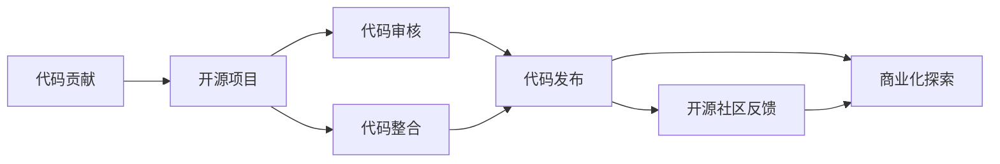

                 

 关键词：代码贡献、开源、商业化、技术生态、创新模式

> 摘要：本文将深入探讨从个人代码贡献到开源商业化的全过程。我们将分析代码贡献的动机与途径，探讨开源项目的可持续性与商业化可能性，并提供一套完整的策略和工具，帮助开发者实现从技术贡献到商业成功的转变。

## 1. 背景介绍

在当今的数字时代，开源已经成为软件开发的主流模式。无数的开发者通过贡献代码，构建了一个庞大的技术生态系统。然而，如何将个人的技术贡献转化为商业价值，成为了一个引人关注的话题。从代码贡献到开源商业化的过程，不仅需要开发者的技术实力，还需要商业头脑和市场洞察力。

### 1.1 代码贡献的意义

代码贡献不仅是技术分享，更是构建技术生态的重要一环。通过贡献代码，开发者可以：

- **提升技能**：通过实践新的技术和工具，开发者可以不断提升自己的技能。
- **建立声誉**：优秀的代码贡献可以帮助开发者建立良好的职业声誉。
- **促进创新**：开源项目往往吸引众多开发者参与，这有助于创新和优化技术。

### 1.2 开源商业化的必要性

尽管开源项目可以带来技术上的收益，但许多开发者仍然面临着如何将其转化为商业利益的挑战。开源商业化不仅可以为开发者带来直接的经济回报，还可以：

- **形成商业模式**：通过商业化，开发者可以将技术成果转化为可持续的商业产品。
- **扩大影响力**：商业化的成功可以进一步推动技术发展，扩大开发者的影响力。

### 1.3 目标受众

本文的目标受众包括：

- **技术爱好者**：对开源项目有兴趣，希望通过贡献代码提升技能的个人。
- **开发者**：希望在开源项目中找到商业机会的专业人员。
- **企业**：关注技术趋势，希望借助开源项目实现商业创新的企业。

## 2. 核心概念与联系

在深入探讨从代码贡献到开源商业化的过程之前，我们需要明确几个核心概念，包括：

- **开源项目**：开源项目是指其源代码公开，允许任何人自由使用、修改和分发的软件项目。
- **代码贡献**：代码贡献是指开发者向开源项目提交的代码修改，可以是bug修复、功能增强或者文档改进等。
- **开源商业化**：开源商业化是指将开源项目转化为商业产品的过程，可以是直接销售软件、提供商业支持、或者通过服务订阅等方式获取收益。

下面是一个简化的 Mermaid 流程图，展示了从代码贡献到开源商业化的主要环节：



### 2.1 代码贡献

代码贡献是整个流程的起点。开发者可以通过以下几种方式贡献代码：

- **提交 Pull Request**：开发者通过 GitHub 等平台，向开源项目提交自己的代码修改。
- **参与讨论**：在开源项目的 Issues 页面，开发者可以提出建议、报告问题或者参与项目讨论。
- **文档贡献**：不仅仅是代码，高质量的文档也是开源项目的重要部分，开发者可以通过编写文档来贡献。

### 2.2 开源项目

开源项目是代码贡献的载体。一个成功的开源项目通常具备以下特征：

- **稳定性**：项目的代码质量高，bug少，可以稳定运行。
- **活跃度**：项目拥有一定的活跃度，有开发者持续参与和贡献。
- **社区氛围**：项目的社区氛围良好，开发者之间的沟通顺畅，愿意互相帮助。

### 2.3 代码审核与整合

代码审核是确保代码质量的重要环节。开源项目的维护者会审核提交的代码，确保其符合项目规范和要求。代码整合则是将多个开发者的代码修改合并到项目的源代码中。

### 2.4 代码发布

代码发布是开源项目的重要里程碑。每次代码发布都会带来新的功能、改进和修复。通过发布，开发者可以将自己的贡献分享给更广泛的社区。

### 2.5 开源社区反馈

开源社区反馈是开源项目持续发展的动力。开发者的贡献不仅仅是代码，还包括对项目的使用体验、功能需求的反馈。这些反馈可以帮助项目更好地满足用户需求，进一步发展。

### 2.6 商业化探索

商业化探索是开发者从开源项目中获取商业收益的关键环节。开发者可以通过以下几种方式探索商业化：

- **直接销售**：直接销售开源项目的软件产品。
- **提供支持**：为用户提供商业支持服务，如技术咨询、定制开发等。
- **服务订阅**：提供基于开源项目的服务订阅，如云服务、API 接口等。

## 3. 核心算法原理 & 具体操作步骤

### 3.1 算法原理概述

从代码贡献到开源商业化的过程，可以类比为一套复杂的算法。这个算法的核心原理是：

- **社区参与**：通过吸引开发者参与代码贡献，构建一个活跃的社区。
- **价值创造**：在开源社区的基础上，创造商业价值，实现技术成果的转化。
- **持续迭代**：通过不断迭代和优化，保持开源项目的竞争力和商业价值。

### 3.2 算法步骤详解

#### 3.2.1 吸引开发者参与

要吸引开发者参与，项目需要具备以下几个条件：

- **技术吸引**：项目的技术方向和实现方法要有足够的吸引力，能够激发开发者的兴趣。
- **社区氛围**：项目需要有良好的社区氛围，鼓励开发者之间的合作和交流。
- **激励机制**：项目可以设置激励机制，如奖励、荣誉等，鼓励开发者贡献代码。

#### 3.2.2 构建开源社区

构建开源社区需要以下几个步骤：

- **代码审核**：确保所有贡献的代码质量高，符合项目规范。
- **文档完善**：提供详细的文档，帮助开发者理解项目结构和功能。
- **社区互动**：鼓励开发者参与项目讨论，提供技术支持和帮助。
- **代码发布**：定期发布新版本，保持项目的活跃度。

#### 3.2.3 创造商业价值

在开源社区的基础上，开发者可以通过以下几种方式创造商业价值：

- **直接销售**：直接销售开源项目的软件产品，如定制版本、附加功能等。
- **提供支持**：为用户提供商业支持服务，如技术咨询、定制开发等。
- **服务订阅**：提供基于开源项目的服务订阅，如云服务、API 接口等。

#### 3.2.4 持续迭代优化

持续迭代优化是保持开源项目竞争力和商业价值的关键。开发者需要：

- **收集用户反馈**：及时收集用户反馈，了解用户需求和问题。
- **优化代码质量**：不断优化代码，提高性能和稳定性。
- **更新文档**：保持文档的更新，确保其与代码版本一致。
- **扩展功能**：根据用户需求和市场变化，不断扩展项目功能。

### 3.3 算法优缺点

#### 3.3.1 优点

- **高效**：通过开源社区，可以快速获得大量的代码贡献，提高项目开发效率。
- **创新**：开源社区鼓励创新，可以吸引众多开发者参与，推动技术进步。
- **低成本**：开源项目不需要支付高昂的软件许可费用，可以降低企业的技术门槛。

#### 3.3.2 缺点

- **质量控制**：开源项目中的代码质量可能参差不齐，需要维护者进行严格审核。
- **依赖性**：开源项目可能依赖于其他开源组件，导致项目稳定性和安全性存在风险。
- **商业化难度**：将开源项目转化为商业产品可能面临市场接受度低、竞争激烈等问题。

### 3.4 算法应用领域

从代码贡献到开源商业化的算法可以在多个领域应用，包括：

- **软件开发**：通过开源项目，开发者可以构建软件产品，提供商业支持和服务订阅。
- **硬件创新**：开源硬件项目可以通过社区参与，推动硬件创新和商业化。
- **云计算**：开源云计算项目可以提供云服务，吸引企业用户，实现商业价值。
- **人工智能**：开源人工智能项目可以通过社区贡献，推动技术进步，实现商业化应用。

## 4. 数学模型和公式 & 详细讲解 & 举例说明

### 4.1 数学模型构建

从代码贡献到开源商业化的过程可以抽象为一个数学模型。我们假设：

- \( C \) 表示代码贡献的数量。
- \( V \) 表示开源项目的价值。
- \( P \) 表示商业化的可能性。

根据上述假设，我们可以构建以下数学模型：

\[ V = f(C, P) \]

其中，函数 \( f \) 描述了代码贡献和商业化可能性对项目价值的影响。

### 4.2 公式推导过程

我们首先考虑代码贡献的数量对项目价值的影响。一般来说，代码贡献的数量越多，项目的价值越大。因此，我们可以假设：

\[ f(C) = C^k \]

其中，\( k \) 是一个常数，表示代码贡献数量对项目价值的增长速度。

接下来，我们考虑商业化可能性对项目价值的影响。商业化可能性越高，项目的价值也越高。因此，我们可以假设：

\[ f(P) = P^m \]

其中，\( m \) 是一个常数，表示商业化可能性对项目价值的增长速度。

综合上述两点，我们可以得到：

\[ V = C^k \cdot P^m \]

### 4.3 案例分析与讲解

为了更好地理解上述数学模型，我们来看一个具体的案例。

假设一个开源项目的代码贡献数量 \( C \) 为 100，商业化可能性 \( P \) 为 0.8。根据上述数学模型，我们可以计算出项目的价值：

\[ V = 100^k \cdot 0.8^m \]

为了简化计算，我们假设 \( k = 1 \) 和 \( m = 1 \)。因此，项目的价值为：

\[ V = 100 \cdot 0.8 = 80 \]

这个结果表明，在假设条件下，该开源项目的价值为 80。

如果我们提高代码贡献数量到 200，商业化可能性到 0.9，根据同样的数学模型，我们可以计算出新的项目价值：

\[ V = 200 \cdot 0.9 = 180 \]

这个结果表明，提高代码贡献数量和商业化可能性，可以显著提升项目的价值。

## 5. 项目实践：代码实例和详细解释说明

### 5.1 开发环境搭建

为了更好地展示从代码贡献到开源商业化的过程，我们将以一个开源项目为例，介绍开发环境的搭建。我们选择了一个流行的开源数据库管理系统——MySQL。

#### 5.1.1 操作系统

首先，我们需要选择一个操作系统。MySQL 可以在多种操作系统上运行，如 Linux、Windows 和 macOS。在本例中，我们选择 Ubuntu 18.04 LTS 作为操作系统。

#### 5.1.2 安装 MySQL

在 Ubuntu 系统中，我们可以通过以下命令安装 MySQL：

```bash
sudo apt update
sudo apt install mysql-server
```

安装过程中，系统会提示我们设置 MySQL 的 root 用户密码。

#### 5.1.3 连接 MySQL

安装完成后，我们可以使用以下命令连接 MySQL：

```bash
mysql -u root -p
```

输入密码后，即可进入 MySQL 命令行界面。

### 5.2 源代码详细实现

接下来，我们将介绍如何向 MySQL 项目贡献代码。

#### 5.2.1 提交 Pull Request

首先，我们需要 Fork MySQL 的 GitHub 仓库，然后创建一个分支，进行代码修改。修改完成后，我们通过以下命令将分支推送到 GitHub：

```bash
git init
git remote add upstream https://github.com/mysql/mysql-server.git
git fetch upstream
git checkout -b my-new-feature
```

在分支中，我们进行代码修改，例如添加一个新的存储引擎。修改完成后，我们通过以下命令提交修改：

```bash
git add .
git commit -m "Add new storage engine"
git push origin my-new-feature
```

接着，我们通过 GitHub 的 Pull Request 功能，向 MySQL 项目提交我们的修改：

1. 访问 MySQL 项目的 GitHub 仓库。
2. 点击 "Pull Request" 按钮。
3. 在弹出的界面中，选择我们的分支，并填写描述。

#### 5.2.2 代码审核

MySQL 项目的维护者会审核我们的 Pull Request。他们可能会提出修改建议，我们根据建议进行代码调整，并重新提交 Pull Request。

#### 5.2.3 代码整合

如果代码审核通过，MySQL 项目的维护者会将我们的代码整合到项目的源代码中。

### 5.3 代码解读与分析

下面是一个简单的 MySQL 存储引擎的实现示例：

```c
#include <mysql/mysql.h>

MYSQL_STORAGE_ENGINE_EXTERN(void)
mysql_init_plugin(void *arg)
{
    // 初始化存储引擎
    // 省略具体实现
}

MYSQL_STORAGE_ENGINE_EXTERN(int)
mysql_store_key(uchar *key, ulong keylen, void *data, void *arg)
{
    // 存储 key
    // 省略具体实现
    return 0;
}

MYSQL_STORAGE_ENGINE_EXTERN(int)
mysql_load_key(uchar *key, ulong keylen, void *data, void *arg)
{
    // 载入 key
    // 省略具体实现
    return 0;
}

MYSQL_STORAGE_ENGINE_EXTERN(int)
mysql_free_key(uchar *key, ulong keylen, void *data, void *arg)
{
    // 释放 key
    // 省略具体实现
    return 0;
}
```

这个示例展示了存储引擎的基本结构。开发者可以根据自己的需求，实现相应的存储逻辑。MySQL 的维护者会根据代码质量和技术需求，决定是否整合到项目中。

### 5.4 运行结果展示

在 MySQL 命令行界面中，我们可以执行以下命令，测试存储引擎：

```sql
CREATE TABLE test (key VARCHAR(255));
INSERT INTO test (key) VALUES ('test_key');
SELECT * FROM test;
```

如果存储引擎实现正确，我们可以看到以下结果：

```sql
+---------+
| key     |
+---------+
| test_key|
+---------+
```

这个结果表明，我们的存储引擎成功实现了基本的存储和查询功能。

## 6. 实际应用场景

从代码贡献到开源商业化的过程，在实际应用中有着广泛的应用场景。以下是一些典型的应用场景：

### 6.1 开源软件商业化

许多开源软件通过商业化获得了成功。例如，MySQL 通过提供商业版本和付费支持服务，实现了商业价值。其他成功案例还包括：Jenkins（自动化测试工具）、Elasticsearch（搜索引擎）等。

### 6.2 开源硬件商业化

开源硬件项目也通过商业化取得了成功。例如，Raspberry Pi（树莓派）是一款流行的开源微型计算机，通过销售硬件和提供相关服务，实现了商业价值。

### 6.3 云服务开源商业化

云服务提供商也通过开源项目实现了商业价值。例如，AWS 的 OpenDistro for Elasticsearch 是一款基于 Elasticsearch 开源社区的云服务产品，通过提供付费订阅服务，实现了商业价值。

### 6.4 人工智能开源商业化

人工智能领域的开源项目也在商业化方面取得了成功。例如，TensorFlow、PyTorch 等深度学习框架，通过提供付费培训和定制服务，实现了商业价值。

### 6.5 未来应用展望

随着技术的不断发展，从代码贡献到开源商业化的应用场景将进一步扩大。未来，我们可能看到更多的开源项目通过商业化实现了巨大成功，推动技术创新和产业升级。

## 7. 工具和资源推荐

### 7.1 学习资源推荐

- **《开源软件项目管理》**：全面介绍开源软件项目的管理方法，包括社区建设、代码审核等。
- **《开源许可协议》**：了解各种开源许可协议，如 GPL、MIT 等，为开源项目的商业化提供法律依据。
- **《开源商业化策略》**：探讨开源项目的商业化模式，提供实用案例和策略建议。

### 7.2 开发工具推荐

- **GitHub**：开源项目的托管平台，提供代码管理、拉取请求、代码审核等功能。
- **Git**：分布式版本控制系统，支持多人协作开发。
- **Jenkins**：自动化构建和测试工具，用于持续集成和持续部署。

### 7.3 相关论文推荐

- **"The Economics of Open Source"**：探讨开源软件的商业化模式和价值创造。
- **"Open Source as a Business Model"**：分析开源项目的商业化和盈利策略。
- **"Open Source Development in the Age of Cloud Computing"**：研究云计算时代开源项目的发展趋势。

## 8. 总结：未来发展趋势与挑战

### 8.1 研究成果总结

从代码贡献到开源商业化的研究，为我们揭示了开源项目如何通过商业化实现价值创造。研究结果表明，开源项目不仅能够提升技术水平，还可以为开发者带来经济收益。

### 8.2 未来发展趋势

随着技术的不断发展，从代码贡献到开源商业化的趋势将更加明显。以下是一些未来发展趋势：

- **更多开源项目实现商业化**：随着开源项目的普及，将有更多的项目通过商业化实现成功。
- **开源社区商业化模式创新**：开源社区将探索更多创新的商业模式，如付费订阅、付费培训等。
- **开源与商业结合更加紧密**：开源项目与商业项目的结合将更加紧密，实现双赢。

### 8.3 面临的挑战

尽管从代码贡献到开源商业化的前景广阔，但开发者仍面临以下挑战：

- **代码质量控制**：开源项目中的代码质量可能参差不齐，需要维护者进行严格审核。
- **商业化难度**：开源项目可能面临商业化难度大、市场接受度低等问题。
- **竞争压力**：开源市场上竞争激烈，开发者需要不断提升项目质量和创新能力。

### 8.4 研究展望

未来，从代码贡献到开源商业化的研究将继续深入，探索更多有效的商业模式和策略。我们期待看到更多成功的开源项目通过商业化实现价值创造，推动技术创新和产业升级。

## 9. 附录：常见问题与解答

### 9.1 代码贡献的动机是什么？

代码贡献的动机多种多样，包括：

- **技术提升**：通过实践新的技术和工具，开发者可以不断提升自己的技能。
- **建立声誉**：优秀的代码贡献可以帮助开发者建立良好的职业声誉。
- **促进创新**：开源项目往往吸引众多开发者参与，这有助于创新和优化技术。

### 9.2 如何选择合适的开源项目？

选择合适的开源项目时，可以考虑以下几个因素：

- **技术方向**：选择与自己的技术兴趣和技能相关的项目。
- **社区活跃度**：社区活跃度高的项目更有可能成功。
- **项目目标**：项目目标清晰、有明确的发展方向的项目更有价值。

### 9.3 开源商业化的难点有哪些？

开源商业化的难点包括：

- **质量控制**：开源项目中的代码质量可能参差不齐。
- **商业化难度**：开源项目可能面临商业化难度大、市场接受度低等问题。
- **竞争压力**：开源市场上竞争激烈，开发者需要不断提升项目质量和创新能力。

### 9.4 如何在开源项目中找到商业机会？

在开源项目中找到商业机会，可以尝试以下几个方向：

- **直接销售**：直接销售开源项目的软件产品，如定制版本、附加功能等。
- **提供支持**：为用户提供商业支持服务，如技术咨询、定制开发等。
- **服务订阅**：提供基于开源项目的服务订阅，如云服务、API 接口等。

---

作者：禅与计算机程序设计艺术 / Zen and the Art of Computer Programming

