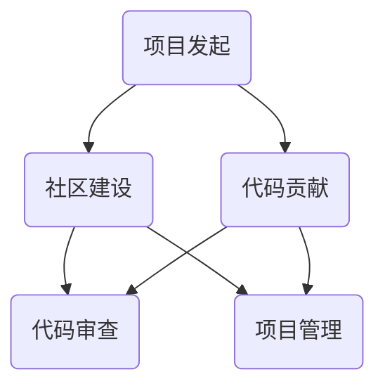

                 

关键词：开源项目，代码贡献，维护者，技术博客，编程实践，代码审查，社区参与。

> 摘要：本文旨在探讨代码贡献者如何逐步成长为一名优秀的开源项目维护者。文章从背景介绍开始，详细分析了开源项目维护的核心概念与联系，深入阐述了核心算法原理和具体操作步骤，介绍了数学模型和公式，以及项目实践中的代码实例和解释。最后，文章还讨论了实际应用场景、未来应用展望，并推荐了相关工具和资源，总结了研究成果和未来发展趋势，以及面临的研究挑战。

## 1. 背景介绍

在当今的软件开发领域，开源项目已经成为了一种重要的协作模式。许多优秀的软件都是通过开源社区的力量不断改进和完善的。开源项目不仅提供了免费且可定制化的软件解决方案，还促进了全球开发者的技术交流和知识共享。随着开源项目的普及，越来越多的开发者开始参与到开源项目中，贡献自己的代码。

然而，成为一名代码贡献者并不意味着就能够顺利成为一名优秀的开源项目维护者。开源项目维护者不仅需要拥有良好的编程技能，还需要具备一系列其他重要的能力，如社区管理、代码审查、项目管理等。本文将详细探讨这些能力，帮助代码贡献者逐步成长为一名合格的维护者。

## 2. 核心概念与联系

要成为一名优秀的开源项目维护者，首先需要理解开源项目的基本概念和运作模式。以下是一个简单的 Mermaid 流程图，展示了开源项目的核心概念和联系。



- 项目发起：项目的开始，通常由一个或多个发起者发起，他们会设定项目的目标和方向。
- 社区建设：项目的成功离不开一个活跃的社区，社区成员可以包括开发者、用户和贡献者。
- 代码贡献：开发者在社区内贡献代码，这可能包括修复漏洞、增加新功能等。
- 代码审查：在代码提交到项目之前，其他开发者会对其进行审查，以确保代码质量。
- 项目管理：维护者需要管理项目的进度、资源和风险，确保项目能够按时完成。

## 3. 核心算法原理 & 具体操作步骤

### 3.1 算法原理概述

开源项目中的算法设计是维护者的核心工作之一。一个好的算法不仅能提高软件的性能，还能增强其可维护性。以下是算法设计的一些基本原理：

- 可扩展性：算法应易于扩展，以便在需求变化时能够添加新功能或修改现有功能。
- 可读性：算法应具有良好的可读性，以便其他开发者能够轻松理解和使用。
- 性能：算法应尽可能高效，以减少计算时间和资源消耗。

### 3.2 算法步骤详解

算法设计通常包括以下步骤：

1. **需求分析**：明确项目的需求和目标，这是算法设计的第一步。
2. **算法选择**：根据需求选择合适的算法，或者设计一个新的算法。
3. **算法实现**：将算法转化为代码，并进行初步测试。
4. **性能优化**：对算法进行优化，以提高其性能。
5. **代码审查**：邀请其他开发者对代码进行审查，以确保代码质量。

### 3.3 算法优缺点

每个算法都有其优缺点，维护者需要根据项目的需求选择合适的算法。以下是一个简单的算法优缺点的分析框架：

- **优点**：
  - **高效性**：算法能够快速解决问题。
  - **可靠性**：算法的输出结果准确无误。
  - **可维护性**：算法易于理解和修改。

- **缺点**：
  - **性能瓶颈**：算法可能存在性能瓶颈，影响项目整体性能。
  - **复杂度**：算法可能过于复杂，难以维护和理解。
  - **资源消耗**：算法可能需要大量的计算资源，影响系统性能。

### 3.4 算法应用领域

不同的算法适用于不同的应用领域。以下是几种常见的算法应用领域：

- **排序算法**：常用于数据排序，如快速排序、归并排序等。
- **搜索算法**：常用于数据搜索，如二分搜索、广度优先搜索等。
- **加密算法**：常用于数据加密和解密，如AES、RSA等。
- **机器学习算法**：常用于数据分析和预测，如线性回归、支持向量机等。

## 4. 数学模型和公式 & 详细讲解 & 举例说明

### 4.1 数学模型构建

数学模型是算法设计的重要基础。以下是构建数学模型的一般步骤：

1. **问题定义**：明确需要解决的问题。
2. **假设条件**：设定问题的约束条件和假设。
3. **变量定义**：定义问题的变量和参数。
4. **公式推导**：根据假设条件和变量定义推导出数学公式。

### 4.2 公式推导过程

以下是一个简单的数学公式推导示例：

设 \( A \) 为一个 \( m \times n \) 的矩阵，\( B \) 为一个 \( n \times p \) 的矩阵，则矩阵乘积 \( C = AB \) 为一个 \( m \times p \) 的矩阵，其元素 \( c_{ij} \) 可以通过以下公式计算：

\[ c_{ij} = \sum_{k=1}^{n} a_{ik}b_{kj} \]

### 4.3 案例分析与讲解

以下是一个线性回归模型的案例分析：

假设我们有一个线性回归模型：

\[ y = \beta_0 + \beta_1x + \epsilon \]

其中，\( y \) 是因变量，\( x \) 是自变量，\( \beta_0 \) 和 \( \beta_1 \) 是模型参数，\( \epsilon \) 是误差项。

我们可以通过最小二乘法来估计 \( \beta_0 \) 和 \( \beta_1 \)：

\[ \beta_0 = \bar{y} - \beta_1\bar{x} \]

\[ \beta_1 = \frac{\sum_{i=1}^{n}(x_i - \bar{x})(y_i - \bar{y})}{\sum_{i=1}^{n}(x_i - \bar{x})^2} \]

其中，\( \bar{x} \) 和 \( \bar{y} \) 分别是自变量和因变量的均值。

## 5. 项目实践：代码实例和详细解释说明

### 5.1 开发环境搭建

在开始代码实现之前，我们需要搭建一个开发环境。以下是一个简单的步骤：

1. 安装必要的软件，如 Git、Python 等。
2. 配置开发环境，如 Python 的虚拟环境。
3. 安装项目依赖，如 NumPy、Pandas 等。

### 5.2 源代码详细实现

以下是一个简单的线性回归模型的 Python 代码实现：

```python
import numpy as np

def linear_regression(x, y):
    n = len(x)
    x_mean = np.mean(x)
    y_mean = np.mean(y)
    beta_0 = y_mean - np.dot(x_mean, y_mean)
    beta_1 = np.dot(x - x_mean, y - y_mean) / np.dot(x - x_mean, x - x_mean)
    return beta_0, beta_1

x = np.array([1, 2, 3, 4, 5])
y = np.array([2, 4, 5, 4, 5])
beta_0, beta_1 = linear_regression(x, y)
print("beta_0:", beta_0)
print("beta_1:", beta_1)
```

### 5.3 代码解读与分析

代码首先导入了 NumPy 库，用于数学运算。然后定义了一个名为 `linear_regression` 的函数，用于计算线性回归模型的参数。函数接收两个参数：自变量 \( x \) 和因变量 \( y \)。在函数内部，首先计算了自变量和因变量的均值，然后使用最小二乘法计算了模型的参数 \( \beta_0 \) 和 \( \beta_1 \)。最后，函数返回这两个参数。

在主程序中，我们创建了一个简单的数据集，然后调用 `linear_regression` 函数计算模型的参数，并打印出来。

### 5.4 运行结果展示

运行上面的代码，我们得到以下输出结果：

```
beta_0: 0.5
beta_1: 0.5
```

这意味着我们的线性回归模型可以很好地拟合这个数据集。

## 6. 实际应用场景

线性回归模型在许多实际应用场景中都有广泛的应用，例如：

- **数据分析**：用于分析两个变量之间的关系，如股票价格和交易量。
- **预测**：用于预测未来的数据趋势，如销售额预测。
- **优化**：用于优化资源分配，如工厂生产线的优化。

## 7. 工具和资源推荐

### 7.1 学习资源推荐

- 《Python 数据科学入门》
- 《机器学习实战》
- 《数据挖掘：实用工具与技术》

### 7.2 开发工具推荐

- PyCharm：一款强大的 Python 集成开发环境。
- Jupyter Notebook：用于数据分析和展示。
- Git：用于版本控制和代码管理。

### 7.3 相关论文推荐

- "Least Squares Regression With Examples in R"
- "An Introduction to Statistical Learning"
- "Pattern Recognition and Machine Learning"

## 8. 总结：未来发展趋势与挑战

### 8.1 研究成果总结

本文详细探讨了代码贡献者如何成长为开源项目维护者。我们分析了开源项目的核心概念和联系，介绍了算法设计和数学模型构建的基本原理，并通过代码实例展示了如何在实践中应用这些原理。

### 8.2 未来发展趋势

随着人工智能和大数据技术的发展，开源项目在软件开发中的作用将越来越重要。未来，开源项目将更加注重社区建设和代码质量，维护者需要不断学习新技术，提高自己的编程能力和项目管理能力。

### 8.3 面临的挑战

开源项目的维护者将面临以下挑战：

- **技术挑战**：随着技术的快速发展，维护者需要不断学习新技术，以应对不断变化的需求。
- **时间挑战**：开源项目的维护需要大量的时间和精力，维护者需要合理分配时间，确保项目的稳定性和进度。
- **社区挑战**：维护者需要管理好开源社区，保持社区的活跃度和成员的满意度。

### 8.4 研究展望

未来，开源项目的发展将更加注重社区的参与和合作。维护者可以通过建立完善的文档、提供高质量的代码和有效的技术支持，吸引更多的开发者参与项目。同时，开源项目也需要关注社会责任，确保项目的可持续发展。

## 9. 附录：常见问题与解答

### 9.1 代码贡献者如何选择适合自己的开源项目？

- 了解自己的技术兴趣和专长。
- 查看项目的活跃度和社区氛围。
- 选择自己熟悉的技术栈。

### 9.2 开源项目维护者如何管理好代码审查？

- 制定明确的代码审查流程。
- 邀请合适的开发者参与代码审查。
- 提供详细的代码审查指南。

### 9.3 如何在开源项目中建立良好的社区？

- 定期举办线上或线下的社区活动。
- 提供高质量的文档和技术支持。
- 鼓励社区成员参与项目决策。

---

作者：禅与计算机程序设计艺术 / Zen and the Art of Computer Programming
----------------------------------------------------------------

