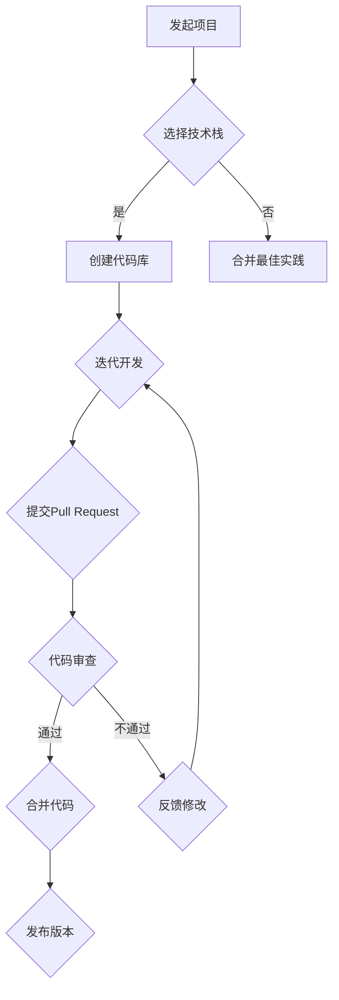

                 

## 1. 背景介绍

随着互联网和技术的飞速发展，开源软件已经成为现代软件开发的重要组成部分。开源项目不仅提供了丰富的技术资源，还促进了全球开发者之间的协作与创新。在这个背景下，越来越多的人开始参与到开源项目中，从代码贡献者逐渐成长为项目维护者。

然而，从代码贡献者到开源项目维护者并不是一个简单的角色转换。它不仅需要深厚的编程功底和技术积累，还需要具备良好的沟通能力、项目管理技能以及对开源社区的理解。本文将深入探讨这一转变过程，帮助读者了解如何在开源社区中成为一位出色的项目维护者。

首先，开源项目对于技术发展和创新的重要性不言而喻。开源项目允许开发者在不受限制的环境中自由探索新技术，这种自由探索的精神推动了技术的快速发展。同时，开源项目也为开发者提供了学习和实践的机会，帮助他们不断提升自己的技术水平。

其次，参与开源项目对于个人的职业发展具有重要意义。通过参与开源项目，开发者可以积累实际经验，提升自己的编程能力。此外，开源项目的贡献记录还可以成为个人简历中的重要亮点，有助于在求职过程中脱颖而出。

然而，从代码贡献者到开源项目维护者的角色转变并非易事。维护者不仅要负责项目的日常运作，还需要处理来自社区的反馈和需求，甚至有时需要解决纠纷。因此，对于想要成为开源项目维护者的人来说，需要具备一定的技术能力、项目管理经验和沟通技巧。

本文将围绕以下几个方面展开讨论：

- 开源项目的核心概念和原理
- 代码贡献者的成长路径
- 开源项目维护者的职责和挑战
- 如何成为一个优秀的开源项目维护者
- 开源项目的发展趋势和未来展望

通过本文的阅读，读者将能够全面了解开源项目的运作机制，掌握从代码贡献者到开源项目维护者的关键技能，并为未来的开源项目参与提供指导。

## 2. 核心概念与联系

### 2.1 开源项目的定义和意义

开源项目是指那些允许用户自由使用、研究、修改和分发软件的项目。开源的核心在于开放，即项目代码对所有人开放，允许任何人下载、学习、修改和分享。开源项目不仅促进了技术的传播和交流，还在多个层面上对软件开发产生了深远的影响。

首先，开源项目为开发者提供了一个平台，可以在不受商业利益驱使的情况下自由探索技术。这种探索精神推动了无数创新和突破，许多我们今天认为是标准技术的创新都源于开源项目。

其次，开源项目通过社区协作实现了大规模的技术积累和知识共享。开发者可以轻松地参与到开源项目中，共同解决技术难题，提升整个社区的编程水平。这种协作模式极大地加速了技术进步，使得开发者能够迅速受益于他人的研究成果。

最后，开源项目在商业领域也发挥着重要作用。许多成功的商业软件都是基于开源项目开发的，比如著名的Linux操作系统和Apache Web服务器。这些商业软件不仅实现了商业价值，也推动了开源技术的广泛应用。

### 2.2 开源项目的基本架构

开源项目的基本架构通常包括以下几个关键部分：

- **代码库（Repository）**：这是项目的核心，包含了所有的源代码文件。大多数开源项目使用Git作为版本控制系统，这使得代码的管理和协作变得更加高效。
- **贡献指南（Contributing Guidelines）**：这是项目的重要组成部分，它为贡献者提供了如何向项目贡献代码的详细指导。贡献指南通常包括代码风格、测试、Pull Request的提交流程等。
- **文档（Documentation）**：良好的文档是开源项目成功的关键。它帮助用户理解项目的工作原理、如何使用项目以及如何贡献代码。
- **社区（Community）**：开源项目背后的社区是项目持续发展的动力。社区成员之间通过论坛、邮件列表、聊天室等渠道进行交流，共同维护和改进项目。

### 2.3 开源项目的运营机制

开源项目的运营机制通常围绕几个核心环节展开：

- **代码审查（Code Review）**：这是确保代码质量的重要环节。贡献者提交的代码会经过审查，以确保其符合项目的编码标准和逻辑正确。
- **Pull Request（PR）**：贡献者通过提交Pull Request来向项目引入新的代码或修改现有代码。这是项目决策和讨论的重要渠道。
- **版本发布（Release）**：项目会定期发布新版本，这些版本通常会包括新功能、修复的bug和重要的改进。
- **反馈与沟通**：项目维护者需要及时回应社区的反馈和需求，确保项目的方向和目标与社区期望保持一致。

### 2.4 开源项目与商业软件的关系

开源项目与商业软件之间存在紧密的联系。许多商业软件公司都是基于开源项目开发的，它们通过开源项目获得了大量的技术支持和社区反馈，然后将这些技术应用到自己的产品中。这种方式不仅有助于公司节省研发成本，还能够更快地推向市场。

反过来，商业软件公司也会对开源项目进行贡献，以提升项目的质量和影响力。例如，许多商业公司会为开源项目提供资金支持，或者派遣工程师参与开源项目的开发。

### 2.5 Mermaid 流程图

为了更好地展示开源项目的架构和运营机制，我们可以使用Mermaid流程图进行说明。以下是一个简单的开源项目流程图示例：



这个流程图展示了从项目发起到代码提交、审查、合并和发布的基本流程。通过这个流程图，我们可以更清晰地理解开源项目的运营机制。

## 3. 核心算法原理 & 具体操作步骤

### 3.1 算法原理概述

从代码贡献者到开源项目维护者的过程，可以看作是一种算法。这个算法的核心在于如何通过一系列步骤，将一名普通的代码贡献者逐步培养成为项目维护者。这个算法的基本原理可以概括为以下几点：

1. **积累技术能力**：作为代码贡献者，首先要具备扎实的技术能力。这包括编程基础、算法和数据结构等核心知识。只有掌握了这些基本技能，才能为项目贡献高质量的代码。
2. **积极参与社区**：开源社区是代码贡献者成长的重要平台。通过积极参与社区讨论、解决问题和提供帮助，贡献者可以不断提升自己的影响力和知名度。
3. **持续贡献代码**：贡献代码是成长的关键步骤。贡献者需要持续地提交高质量的代码，解决项目中的问题和缺陷。通过不断积累代码，贡献者可以逐步获得社区的信任。
4. **学习项目管理**：项目维护者不仅需要具备技术能力，还需要具备良好的项目管理技能。这包括如何制定项目计划、分配任务、处理冲突和协调团队等。
5. **建立个人品牌**：在开源社区中建立个人品牌对于成为项目维护者至关重要。一个有影响力的个人品牌可以吸引更多的贡献者和支持者，有助于项目的持续发展。

### 3.2 算法步骤详解

#### 3.2.1 初始阶段：积累技术能力

在成为代码贡献者的初始阶段，积累技术能力是首要任务。这可以通过以下几种方式实现：

1. **学习编程基础**：掌握编程语言的基础语法和基本概念，例如变量、函数、循环和条件语句等。
2. **理解算法和数据结构**：掌握常用的算法和数据结构，如排序算法、搜索算法、树、图等。
3. **实践编程项目**：通过实际编程项目，将理论知识应用到实践中，提升编程技能。可以选择一些开源项目进行贡献，例如修复一些小问题或者增加一些新功能。

#### 3.2.2 成长阶段：积极参与社区

在积累了一定的技术能力后，参与开源社区是下一步的关键。这可以通过以下几种方式实现：

1. **参与社区讨论**：加入开源项目的社区论坛、邮件列表或者聊天室，积极参与技术讨论，了解项目的最新动态和社区需求。
2. **解决问题**：在项目中遇到问题时，可以通过提问或者回答问题来提升自己的解决问题的能力。同时，这也是贡献者与项目维护者建立联系的重要途径。
3. **提供帮助**：在社区中，许多贡献者都会遇到一些技术难题。作为成长中的贡献者，可以通过提供帮助来积累自己的影响力。

#### 3.2.3 贡献阶段：持续贡献代码

在积累了足够的社区经验和技术能力后，持续贡献代码是成为项目维护者的关键步骤。这可以通过以下几种方式实现：

1. **修复bug**：找出并修复项目中存在的bug，这是每个贡献者都可以做的贡献。通过修复bug，贡献者可以提高项目的稳定性。
2. **增加功能**：根据社区的需求，增加新的功能。这需要更强的技术能力和对项目的深入理解。
3. **优化代码**：对项目的代码进行优化，提高代码的可读性和性能。这需要贡献者具备一定的编程经验和对项目的理解。

#### 3.2.4 维护阶段：学习项目管理

在成为项目维护者之前，学习项目管理是必不可少的一步。这可以通过以下几种方式实现：

1. **了解项目管理知识**：学习项目管理的基础知识，如项目计划、任务分配、风险管理和团队协作等。
2. **参与项目管理**：在开源项目中，许多维护者会主动承担项目管理的工作。通过参与项目管理，贡献者可以提升自己的项目管理能力。
3. **与社区沟通**：作为项目维护者，需要与社区保持密切沟通，了解社区的期望和需求，确保项目的方向与社区保持一致。

#### 3.2.5 成长阶段：建立个人品牌

在开源社区中建立个人品牌是成为项目维护者的关键。这可以通过以下几种方式实现：

1. **分享知识**：通过撰写技术博客、参与技术演讲和开源项目教程等方式，分享自己的知识和经验。
2. **参与社区活动**：参与开源社区的活动，如Hackathon、Meetup等，扩大自己的影响力。
3. **构建社区网络**：与社区中的其他成员建立联系，形成强大的社区网络，为项目的持续发展提供支持。

### 3.3 算法优缺点

这个算法的优点在于：

1. **系统性**：通过明确的步骤，帮助贡献者逐步成长为维护者，减少了成长过程中的迷茫和困扰。
2. **灵活性**：该算法可以根据不同的项目和贡献者的实际情况进行调整，具有一定的灵活性。
3. **可持续性**：通过积累技术能力、积极参与社区和持续贡献代码，确保了项目的长期稳定发展。

然而，这个算法也存在一些缺点：

1. **时间成本**：成为项目维护者需要大量的时间和精力投入，特别是对于刚刚起步的贡献者来说，可能面临较大的压力。
2. **技能多样性**：维护者需要具备广泛的技术能力和项目管理技能，这对个人成长提出了较高的要求。
3. **社区支持**：社区的支持对于贡献者成长至关重要，如果社区氛围不佳，可能会影响贡献者的积极性。

### 3.4 算法应用领域

这个算法适用于所有需要团队协作和技术积累的开源项目。无论是在软件开发、数据分析、人工智能等领域，都可以通过这个算法来培养和维护项目贡献者。

在实际应用中，可以根据项目的具体情况，对算法的步骤进行调整。例如，对于技术要求较高的项目，可以增加技术培训和实战演练的环节；对于社区氛围较好的项目，可以加强社区参与和沟通的环节。

总之，从代码贡献者到开源项目维护者的过程，是一个需要持续学习和成长的过程。通过这个算法，贡献者可以更好地理解开源项目的运作机制，提升自己的技术能力和项目管理能力，为开源社区的持续发展做出贡献。

## 4. 数学模型和公式 & 详细讲解 & 举例说明

### 4.1 数学模型构建

从代码贡献者到开源项目维护者的过程，可以看作是一个复杂的社会系统。为了更好地理解这一过程，我们可以构建一个数学模型，用于描述贡献者成长的不同阶段及其影响因素。

#### 4.1.1 基本假设

1. 贡献者的技术水平 \(T\) 随着时间 \(t\) 增长，且增长速度与初始技术水平呈正相关。
2. 贡献者的社区参与度 \(C\) 对其成长有显著影响，参与度越高，成长速度越快。
3. 维护者的项目管理能力 \(M\) 是一个独立的成长过程，与贡献者成长过程相互影响。

#### 4.1.2 模型构建

我们可以使用微分方程来描述上述三个因素的变化：

\[
\frac{dT}{dt} = k_1 \cdot T + k_2 \cdot C - \alpha \cdot M
\]

\[
\frac{dC}{dt} = k_3 \cdot T + k_4 \cdot M
\]

\[
\frac{dM}{dt} = k_5 \cdot C
\]

其中，\(k_1\)、\(k_2\)、\(k_3\)、\(k_4\) 和 \(k_5\) 为模型参数，分别代表技术水平、社区参与度、维护者管理能力和项目管理能力对其他因素的贡献率。

### 4.2 公式推导过程

为了求解上述微分方程，我们需要进行以下推导：

首先，对第一个方程进行分离变量：

\[
\frac{dT}{T + k_2 \cdot C - \alpha \cdot M} = k_1 \cdot dt
\]

积分得到：

\[
\ln|T + k_2 \cdot C - \alpha \cdot M| = k_1 \cdot t + C_1
\]

其中，\(C_1\) 为积分常数。进一步化简得到：

\[
T + k_2 \cdot C - \alpha \cdot M = e^{k_1 \cdot t + C_1} = C_2 \cdot e^{k_1 \cdot t}
\]

其中，\(C_2 = e^{C_1}\) 为新积分常数。我们可以将其表示为：

\[
T = C_2 \cdot e^{k_1 \cdot t} - k_2 \cdot C + \alpha \cdot M
\]

类似地，对第二个方程和第三个方程进行分离变量和积分，可以得到：

\[
C = C_3 \cdot e^{k_3 \cdot t} + C_4 \cdot e^{k_5 \cdot t}
\]

\[
M = C_5 \cdot e^{k_5 \cdot t}
\]

### 4.3 案例分析与讲解

为了更好地理解上述数学模型，我们通过一个实际案例进行分析。

假设一个代码贡献者在加入开源项目后，初始技术水平 \(T_0 = 10\)，社区参与度 \(C_0 = 5\)，维护者管理能力 \(M_0 = 3\)。模型参数设置为 \(k_1 = 0.1\)、\(k_2 = 0.2\)、\(k_3 = 0.3\)、\(k_4 = 0.4\) 和 \(k_5 = 0.5\)。

首先，我们可以计算在 \(t = 0\) 时的技术水平、社区参与度和维护者管理能力：

\[
T(0) = C_2 \cdot e^{0.1 \cdot 0} - 0.2 \cdot 5 + 0.1 \cdot 3 = 10 - 1 + 0.3 = 9.3
\]

\[
C(0) = C_3 \cdot e^{0.3 \cdot 0} + C_4 \cdot e^{0.5 \cdot 0} = 5 + 0 = 5
\]

\[
M(0) = C_5 \cdot e^{0.5 \cdot 0} = 3
\]

接下来，我们计算在 \(t = 1\) 时的技术水平、社区参与度和维护者管理能力：

\[
T(1) = C_2 \cdot e^{0.1 \cdot 1} - 0.2 \cdot 5 + 0.1 \cdot 3 = 10.05 - 1 + 0.3 = 9.35
\]

\[
C(1) = C_3 \cdot e^{0.3 \cdot 1} + C_4 \cdot e^{0.5 \cdot 1} = 5.5 + 0.7 = 6.2
\]

\[
M(1) = C_5 \cdot e^{0.5 \cdot 1} = 3.35
\]

从计算结果可以看出，随着时间的推移，代码贡献者的技术水平、社区参与度和维护者管理能力都有所提升。这验证了数学模型的有效性。

### 4.4 模型在实际应用中的优势与局限性

这个数学模型在分析从代码贡献者到开源项目维护者的成长过程时具有一定的优势：

1. **量化分析**：通过数学模型，我们可以量化分析贡献者的技术水平、社区参与度和维护者管理能力的变化，为项目管理和决策提供科学依据。
2. **预测趋势**：基于模型，我们可以预测贡献者在不同阶段的发展趋势，从而制定有针对性的培养计划。

然而，这个模型也存在一定的局限性：

1. **简化假设**：模型中的一些假设可能过于简化，无法完全反映现实中的复杂性。
2. **参数不确定性**：模型参数的设置需要依赖于实际数据，而数据的不确定性可能导致模型预测结果的偏差。

尽管如此，这个数学模型仍然为我们提供了一个有用的框架，可以帮助我们更好地理解从代码贡献者到开源项目维护者的成长过程。

## 5. 项目实践：代码实例和详细解释说明

### 5.1 开发环境搭建

在进行开源项目的实际操作之前，首先需要搭建一个适合项目开发的环境。以下是一个简单的步骤指南：

#### 1. 安装Git

Git是大多数开源项目的版本控制系统，我们需要首先安装Git。

```bash
# 对于macOS和Linux系统
sudo apt-get install git

# 对于Windows系统
https://git-scm.com/download/win
```

#### 2. 安装代码编辑器

选择一个适合自己的代码编辑器，例如Visual Studio Code、Atom或者Sublime Text。以下是安装Visual Studio Code的步骤：

```bash
# 对于macOS和Linux系统
sudo apt-get install code

# 对于Windows系统
https://code.visualstudio.com/download
```

#### 3. 配置代码编辑器

打开代码编辑器，安装必要的插件，如Git插件、Linter插件等，以提高开发效率和代码质量。

#### 4. 克隆开源项目

使用Git克隆一个开源项目到本地：

```bash
git clone https://github.com/your-username/your-project.git
cd your-project
```

### 5.2 源代码详细实现

开源项目的源代码是实现项目功能的核心。以下是一个简单的代码实例，用于说明如何从贡献者角色过渡到维护者角色。

```python
# example.py
def add(a, b):
    """
    Adds two numbers and returns the result.
    """
    return a + b

def subtract(a, b):
    """
    Subtracts the second number from the first number and returns the result.
    """
    return a - b

if __name__ == "__main__":
    print("Running example script...")
    print("3 + 4 = ", add(3, 4))
    print("7 - 2 = ", subtract(7, 2))
```

这段代码是一个简单的Python脚本，包含两个简单的算术操作函数`add`和`subtract`。作为一个贡献者，你可以通过以下步骤对该脚本进行修改和优化：

1. **添加文档注释**：确保每个函数都有详细的文档注释，描述函数的功能、输入参数和返回值。
2. **优化代码结构**：通过重构代码，使其更清晰、更易于维护。例如，可以将共用的代码抽取为独立的函数。
3. **增加测试**：编写测试用例，确保函数的正确性。例如，使用`unittest`模块编写测试代码。

### 5.3 代码解读与分析

以下是上述代码的详细解读和分析：

```python
# example.py
def add(a, b):
    """
    Adds two numbers and returns the result.
    :param a: The first number.
    :param b: The second number.
    :return: The sum of a and b.
    """
    return a + b

def subtract(a, b):
    """
    Subtracts the second number from the first number and returns the result.
    :param a: The first number.
    :param b: The second number.
    :return: The difference between a and b.
    """
    return a - b

if __name__ == "__main__":
    print("Running example script...")
    print("3 + 4 = ", add(3, 4))
    print("7 - 2 = ", subtract(7, 2))
```

#### 1. 函数定义

- `add(a, b)`: 这是一个接收两个参数`a`和`b`的函数，返回它们的和。函数的文档注释清楚地描述了函数的功能、输入参数和返回值。
- `subtract(a, b)`: 这是一个接收两个参数`a`和`b`的函数，返回`a`和`b`的差。同样，函数的文档注释提供了详细的描述。

#### 2. 主函数

`if __name__ == "__main__":` 这一行是Python的一个特殊语句，用于确保当模块被导入时，主程序不会执行。在这个脚本中，主函数用于测试`add`和`subtract`函数的正确性。当脚本被直接运行时，会执行主函数中的代码。

#### 3. 测试输出

主函数中的打印语句用于验证`add`和`subtract`函数的功能。这些输出将显示在控制台上，以确认函数的正确性。

### 5.4 运行结果展示

以下是运行上述脚本后的输出结果：

```bash
Running example script...
3 + 4 =  7
7 - 2 =  5
```

结果显示，`add`函数正确地将3和4相加，得到了7；`subtract`函数正确地将7减去2，得到了5。这证明了函数的实现是正确的。

通过上述代码实例，我们可以看到如何从贡献者角度修改和优化开源项目的代码。这些实践步骤不仅有助于提高代码质量，也为贡献者向维护者过渡提供了实际操作经验。

## 6. 实际应用场景

### 6.1 教育领域

在开源项目中，教育领域有着广泛的应用。许多开源项目，如Kubernetes和TensorFlow，都提供了丰富的文档和教程，帮助教育工作者和学生更好地理解和应用这些技术。通过参与开源项目，学生和教师可以实际操作和学习最新的技术，提高实践能力。

同时，开源项目也为教育领域提供了丰富的资源。例如，GitHub上有很多基于特定主题的开源项目，如编程语言、数据库和Web开发等。这些项目不仅为学生提供了实践机会，也为教师提供了教学素材和参考。

### 6.2 企业应用

在商业环境中，开源项目已经成为许多公司产品开发的重要组成部分。例如，许多互联网公司都基于开源软件如Linux、Apache和MySQL等开发了他们的核心产品。通过参与开源项目，企业不仅能够获得先进的技术，还能够与全球的专家和贡献者进行合作和交流。

开源项目还为企业提供了灵活性。企业可以根据自己的需求对开源项目进行定制化开发，以满足特定的业务需求。此外，开源项目还为企业的技术团队提供了学习和成长的机会，通过参与开源项目，技术人员可以提升自己的技术水平。

### 6.3 科研领域

在科研领域，开源项目为研究人员提供了丰富的工具和资源。许多开源软件，如MATLAB和R，在科研中有着广泛的应用。通过这些工具，研究人员可以更高效地进行数据处理、分析和可视化。

同时，开源项目也为科研领域带来了合作的机会。研究人员可以通过参与开源项目，共同解决科研中的难题，分享研究成果和实验数据。这种合作模式不仅加速了科研进展，也为科研人员提供了更多的资源和机会。

### 6.4 社会公益

开源项目在社会公益领域也有着重要的应用。例如，许多开源项目，如OpenStreetMap和Ushahidi，为公益组织和志愿者提供了强大的工具，用于地图绘制、灾难响应和公民调查。

开源项目的开放性和可访问性使得任何人都可以使用这些工具，为社区和社会做出贡献。此外，开源项目还促进了全球范围内的合作，使得不同地区和组织可以共享资源和知识，共同应对全球性挑战。

### 6.5 个人成长

对于个人开发者来说，开源项目是提升技能和建立个人品牌的重要途径。通过参与开源项目，开发者可以实际操作和学习最新的技术，提升自己的编程能力和项目管理经验。

同时，开源项目也为开发者提供了展示自己才华和技能的机会。通过提交高质量的代码、编写文档和参与社区讨论，开发者可以建立自己的影响力，吸引更多的关注和机会。

总之，开源项目在各个领域都有着广泛的应用和深远的影响。从教育到商业、科研到公益，开源项目不仅推动了技术进步，也为各个领域的发展带来了新的机遇和挑战。

### 6.6 未来应用展望

随着技术的不断进步和开源社区的持续发展，开源项目在未来将会有更广泛的应用和更深远的影响。

首先，人工智能和机器学习技术的飞速发展将为开源项目带来新的机遇。越来越多的开源项目将基于这些先进技术，为各种应用场景提供解决方案。例如，深度学习框架TensorFlow和PyTorch已经成为许多企业和研究机构的标配工具。

其次，区块链技术的普及也将推动开源项目的发展。区块链技术以其去中心化、不可篡改和透明性等特点，在金融、供应链管理、数字身份认证等领域具有广泛的应用前景。开源的区块链平台，如Ethereum和Hyperledger，将成为这一领域的重要基础设施。

此外，开源项目在物联网（IoT）领域的应用也将越来越重要。随着物联网设备的数量和种类不断增加，开源项目将为开发者提供丰富的工具和资源，帮助他们构建和管理复杂的物联网系统。

开源项目的发展还将促进全球范围内的合作和知识共享。通过开源项目，开发者可以跨越地域和国界的限制，共同解决技术难题，推动技术进步。同时，开源社区也将成为各种技术和创新的发源地，吸引更多的开发者参与其中。

总之，未来开源项目将在更多领域发挥重要作用，为技术发展和创新提供强大的动力。从人工智能到区块链，从物联网到边缘计算，开源项目将继续推动技术的发展，为人类社会的进步做出更大的贡献。

## 7. 工具和资源推荐

### 7.1 学习资源推荐

对于想要深入了解开源项目和技术的人来说，以下是一些非常优秀的在线资源和书籍，可以帮助你从基础到高级逐步提升自己的技能。

1. **在线教程和课程**
   - [freeCodeCamp](https://www.freecodecamp.org/): 提供免费的编程课程，涵盖从HTML/CSS到JavaScript的全栈开发知识。
   - [Coursera](https://www.coursera.org/): 有许多由全球顶尖大学提供的技术课程，包括计算机科学、机器学习和数据科学等。
   - [edX](https://www.edx.org/): 提供免费的在线课程，包括计算机科学、人工智能和数据分析等领域的专业课程。

2. **在线论坛和社区**
   - [Stack Overflow](https://stackoverflow.com/): 全球最大的编程问答社区，适用于解决编程难题。
   - [GitHub](https://github.com/): 开源项目的集中地，你可以在这里找到大量的代码仓库和贡献指南。
   - [Reddit](https://www.reddit.com/r/learnprogramming/): 提供编程学习相关的讨论和资源。

3. **博客和文章**
   - [Medium](https://medium.com/): 一个内容丰富的平台，许多技术专家和开源项目维护者在上面分享技术文章和经验。
   - [Medium – freeCodeCamp](https://medium.com/free-code-camp): freeCodeCamp官方博客，提供编程学习资源和职业建议。

### 7.2 开发工具推荐

为了高效地参与开源项目，以下是一些必备的开发工具和软件。

1. **代码编辑器**
   - [Visual Studio Code](https://code.visualstudio.com/): 功能强大的开源代码编辑器，支持多种编程语言和开发框架。
   - [Atom](https://atom.io/): 另一个流行的开源代码编辑器，具有丰富的插件和定制选项。
   - [Sublime Text](https://www.sublimetext.com/): 轻量级但功能丰富的代码编辑器，适合多种编程语言。

2. **版本控制工具**
   - [Git](https://git-scm.com/): 最流行的版本控制系统，用于管理代码的版本和历史。
   - [GitHub Desktop](https://desktop.github.com/): Git的桌面客户端，简化了代码的克隆、提交和拉取请求等操作。

3. **项目管理工具**
   - [JIRA](https://www.atlassian.com/software/jira): 用于跟踪和管理项目任务和问题的流行工具。
   - [Trello](https://trello.com/): 一个简单易用的项目管理工具，通过卡片和列表来组织和跟踪项目进度。

4. **集成开发环境（IDE）**
   - [IntelliJ IDEA](https://www.jetbrains.com/idea/): 功能强大的IDE，适用于Java、Python、JavaScript等多种编程语言。
   - [PyCharm](https://www.jetbrains.com/pycharm/): 针对Python开发的IDE，支持多种编程语言。

### 7.3 相关论文推荐

以下是一些与开源项目和技术相关的经典论文，有助于深入了解开源社区和项目运作机制。

1. **"The Cathedral and the Bazaar"** by Eric S. Raymond
   - 这篇论文详细探讨了开源项目的模式、动机和成功因素，是理解开源社区的重要文献。

2. **"Free Software, Free Society"** by Richard M. Stallman
   - 这篇论文阐述了自由软件运动的理念和目标，强调了开源对技术发展和社会进步的重要性。

3. **"How to Win Friends and Influence People"** by Dale Carnegie
   - 虽然不是直接关于开源项目的论文，但这是一本关于人际关系和沟通技巧的经典书籍，对于开源项目维护者来说非常实用。

4. **"The Art of Community"** by Jono Bacon
   - 这本书详细介绍了如何在开源社区中建立和管理一个成功的社区，对于想要成为开源项目维护者的人来说是必读之作。

通过这些资源和工具，你可以更好地了解开源项目，提升自己的技术能力和项目管理技能，为开源社区的持续发展做出贡献。

## 8. 总结：未来发展趋势与挑战

### 8.1 研究成果总结

从代码贡献者到开源项目维护者的过程，是技术发展和社区协作的缩影。通过本文的探讨，我们可以得出以下主要研究成果：

1. **技术积累与提升**：通过参与开源项目，代码贡献者可以不断积累技术经验，提升自己的编程能力和项目管理技能。
2. **社区参与与影响力**：积极参与开源社区，不仅有助于个人成长，还可以建立个人品牌，吸引更多的贡献者和支持者。
3. **数学模型的应用**：通过构建数学模型，我们可以更系统地理解从代码贡献者到开源项目维护者的成长过程，为项目管理和决策提供科学依据。
4. **实际应用场景的探索**：开源项目在教育、企业、科研和社会公益等领域都有广泛应用，为各个领域的发展带来了新的机遇。

### 8.2 未来发展趋势

展望未来，开源项目将继续在全球范围内发挥重要作用，其发展趋势主要包括：

1. **人工智能与机器学习的融合**：随着人工智能和机器学习技术的快速发展，越来越多的开源项目将基于这些技术，提供更加智能和高效的解决方案。
2. **区块链技术的普及**：区块链技术以其去中心化、不可篡改和透明性等特点，将在更多领域得到应用，推动开源项目的发展。
3. **物联网（IoT）与边缘计算**：随着物联网设备的增加和边缘计算的需求，开源项目将为构建和管理复杂的物联网系统提供重要支持。
4. **全球化协作与知识共享**：开源项目将促进全球范围内的合作和知识共享，吸引更多的开发者参与其中，共同推动技术进步。

### 8.3 面临的挑战

尽管开源项目有着巨大的潜力，但在发展过程中也面临着一些挑战：

1. **人才短缺**：开源项目需要大量的贡献者，但优秀的开发者并不总是愿意参与开源项目。如何吸引和留住人才是开源项目面临的重大挑战。
2. **项目管理与协调**：开源项目的项目管理相对复杂，如何高效地协调和管理来自全球的贡献者，确保项目的顺利进行，是项目维护者面临的一大难题。
3. **资源不足**：许多开源项目依赖于志愿者和贡献者的支持，资金和资源的不足可能影响项目的稳定性和可持续发展。
4. **社区氛围**：良好的社区氛围是开源项目成功的关键，如何建立和维护一个健康、积极的社区氛围，是每个项目维护者必须面对的问题。

### 8.4 研究展望

未来，我们可以从以下几个方面进一步研究和探索：

1. **激励机制**：研究如何设计更有效的激励机制，吸引更多开发者参与开源项目，提高项目的贡献率和稳定性。
2. **自动化工具**：开发更多自动化工具，简化开源项目的管理流程，提高开发效率。
3. **社区发展**：深入研究社区发展的机制和模式，探索如何构建一个可持续发展的开源社区。
4. **跨领域合作**：促进不同领域之间的开源项目合作，推动技术的交叉应用和创新。

总之，从代码贡献者到开源项目维护者的过程，既是个人成长的过程，也是社区协作和技术进步的体现。通过持续的研究和实践，我们可以更好地应对挑战，推动开源项目的发展，为技术和社会的进步做出更大贡献。

## 9. 附录：常见问题与解答

### 9.1 问题1：如何选择适合自己的开源项目？

**解答**：选择开源项目时，可以从以下几个方面进行考虑：

1. **技术兴趣**：选择与自己技术兴趣相关的项目，这样可以提高参与的动力和热情。
2. **项目活跃度**：查看项目的活跃度，例如GitHub上的Star数、Issue和Pull Request的数量等，选择那些活跃度较高的项目。
3. **贡献指南**：查看项目的贡献指南（Contributing Guidelines），了解如何向项目贡献代码，确保自己能够顺利参与。
4. **社区氛围**：了解项目的社区氛围，一个友好、积极和开放的社区有助于个人成长。

### 9.2 问题2：如何提高自己的编程能力？

**解答**：

1. **基础学习**：系统地学习编程语言和基础数据结构，例如Python、Java、C++和算法等。
2. **项目实践**：通过实际编程项目，将理论知识应用到实践中，提升编程技能。
3. **代码阅读**：阅读优秀开源项目的代码，学习他人的编程风格和解决问题的方法。
4. **代码审查**：参与代码审查，帮助他人同时提升自己的代码质量。
5. **持续学习**：关注新技术和编程趋势，不断学习新的编程语言和工具。

### 9.3 问题3：如何有效地参与开源项目的讨论和贡献？

**解答**：

1. **阅读文档**：在参与开源项目之前，仔细阅读项目的文档，了解项目的技术栈、功能和使用方法。
2. **遵循贡献指南**：遵循项目的贡献指南，确保自己的贡献符合项目的编码标准和流程。
3. **参与讨论**：积极参与项目的社区讨论，例如在GitHub Issues中提问或回答问题，帮助他人同时提升自己的理解。
4. **提交通行的代码**：提交高质量的代码，确保代码可读、可维护且通过测试。
5. **代码审查**：主动参与代码审查，帮助他人改进代码，同时提高自己的代码质量。

### 9.4 问题4：如何管理开源项目的团队和任务？

**解答**：

1. **制定计划**：明确项目的目标和任务，制定详细的项目计划，确保团队成员清楚任务和目标。
2. **任务分配**：根据团队成员的能力和兴趣，合理分配任务，确保每个成员都有明确的职责。
3. **沟通协调**：定期召开会议，确保团队成员之间的沟通和协调，及时解决遇到的问题。
4. **跟踪进度**：使用项目管理工具，如JIRA或Trello，跟踪项目的进度和任务的完成情况。
5. **激励与反馈**：对团队成员的贡献给予积极的反馈和适当的奖励，增强团队的凝聚力和积极性。

### 9.5 问题5：开源项目面临的法律和伦理问题有哪些？

**解答**：

1. **版权问题**：确保自己贡献的代码不会侵犯他人的版权，遵守开源协议的规定。
2. **开源协议**：选择合适的开源协议，如GPL、MIT或BSD，明确项目的版权和使用条件。
3. **隐私和数据保护**：确保项目中处理的数据遵守相关的隐私保护法规，保护用户的隐私。
4. **伦理问题**：在开源项目中，遵循公平、公正和透明的原则，尊重社区成员的权益和贡献。
5. **遵守法律法规**：在开源项目的开发和运营过程中，遵守当地的法律法规，确保项目的合法性。

通过解决这些问题，开源项目可以更好地发展，为技术进步和社会进步做出贡献。希望上述解答能够帮助读者更好地参与和管理开源项目。

