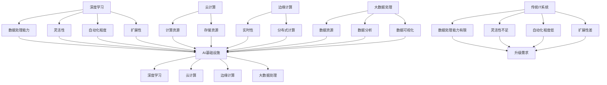

                 

 > 关键词：AI基础设施，传统IT，技术升级，Lepton AI，深度学习，云计算，边缘计算，大数据处理

> 摘要：本文深入探讨了从传统IT到AI基础设施的转型之路，以Lepton AI为例，阐述了如何通过技术升级和架构优化，实现传统IT系统向AI驱动的智能化升级，从而提升系统性能、扩展应用范围，为未来的智能发展奠定坚实基础。

## 1. 背景介绍

随着人工智能（AI）技术的飞速发展，越来越多的企业和组织开始认识到AI的重要性，并将其视为未来发展的重要驱动力。然而，如何将传统的IT系统升级为AI基础设施，成为一个亟待解决的问题。本文将以Lepton AI为例，介绍其在从传统IT到AI基础设施的升级过程中所面临的挑战、采用的方法和取得的成果。

### 1.1 传统IT系统的局限性

传统IT系统在处理大量数据、实时响应、自动化决策等方面存在一定局限性。主要表现在以下几个方面：

- **数据处理能力有限**：传统IT系统主要依赖关系型数据库，数据处理速度较慢，难以应对大数据和高并发场景。
- **灵活性不足**：传统IT系统架构较为固定，难以根据业务需求的变化进行快速调整。
- **自动化程度低**：传统IT系统依赖于人工操作，自动化程度较低，无法实现智能化的业务流程。
- **扩展性差**：传统IT系统在处理大规模业务时，扩展性较差，容易出现性能瓶颈。

### 1.2 AI基础设施的优势

AI基础设施具有强大的数据处理能力、高度灵活性、高自动化程度和良好的扩展性，能够有效解决传统IT系统的局限性。其主要优势包括：

- **数据处理能力**：AI基础设施能够利用深度学习、图计算等技术，实现高效的大数据处理。
- **灵活性**：AI基础设施采用模块化设计，可根据业务需求快速调整和扩展。
- **自动化程度**：AI基础设施通过自动化算法和模型，实现业务流程的智能化。
- **扩展性**：AI基础设施采用分布式架构，具有良好的扩展性，能够应对大规模业务需求。

## 2. 核心概念与联系

在实现从传统IT到AI基础设施的升级过程中，需要理解以下几个核心概念，并掌握它们之间的联系：

### 2.1 深度学习

深度学习是一种基于人工神经网络的机器学习技术，通过多层次的神经网络结构，实现从大量数据中自动提取特征和模式。深度学习在图像识别、语音识别、自然语言处理等领域取得了显著的成果。

### 2.2 云计算

云计算是一种基于互联网的计算模式，通过虚拟化技术，实现计算资源的动态分配和弹性扩展。云计算为AI基础设施提供了强大的计算能力和存储资源，支持大规模数据处理和模型训练。

### 2.3 边缘计算

边缘计算是一种在靠近数据源的设备上进行计算和处理的技术，能够降低延迟、提高实时性，缓解中心化计算的压力。边缘计算与云计算相结合，为AI基础设施提供了更灵活的计算架构。

### 2.4 大数据处理

大数据处理是指对大规模、多样化和高速数据进行分析和处理的技术。大数据处理技术包括数据采集、数据存储、数据分析和数据可视化等环节，为AI基础设施提供了丰富的数据资源。

### 2.5 Mermaid 流程图

以下是一个Mermaid流程图，展示了从传统IT到AI基础设施的升级过程：



## 3. 核心算法原理 & 具体操作步骤

### 3.1 算法原理概述

在AI基础设施的构建过程中，核心算法的选择和实现至关重要。本文将介绍一种基于深度学习的图像识别算法，并详细阐述其原理和操作步骤。

### 3.2 算法步骤详解

#### 3.2.1 数据采集与预处理

1. 数据采集：从互联网、数据库或其他数据源获取图像数据。
2. 数据预处理：对图像进行缩放、裁剪、旋转等处理，使其符合算法的输入要求。

#### 3.2.2 模型训练

1. 模型构建：采用卷积神经网络（CNN）架构，定义网络层次和参数。
2. 数据集划分：将图像数据集划分为训练集、验证集和测试集。
3. 模型训练：利用训练集数据进行模型训练，调整网络参数，优化模型性能。
4. 模型评估：使用验证集数据评估模型性能，调整模型参数，确保模型准确性和泛化能力。

#### 3.2.3 模型部署与推理

1. 模型部署：将训练好的模型部署到AI基础设施中，实现实时图像识别功能。
2. 模型推理：输入待识别图像，通过模型计算输出识别结果。

### 3.3 算法优缺点

#### 优点：

- **高效性**：深度学习算法能够高效地处理大量图像数据，提高识别速度。
- **准确性**：卷积神经网络具有强大的特征提取能力，能够提高图像识别的准确性。
- **灵活性**：通过调整网络结构和参数，可以适应不同场景和需求的图像识别任务。

#### 缺点：

- **计算资源消耗大**：深度学习算法需要大量的计算资源和时间进行模型训练和推理。
- **数据依赖性强**：算法性能受到训练数据质量和数量的影响，对数据质量有较高要求。
- **模型复杂度高**：深度学习模型结构复杂，参数较多，需要深入理解才能进行有效调优。

### 3.4 算法应用领域

深度学习图像识别算法在多个领域具有广泛应用，如：

- **计算机视觉**：图像分类、目标检测、人脸识别等。
- **自动驾驶**：车辆识别、道路识别、行人检测等。
- **医疗影像**：病灶检测、疾病诊断等。
- **金融领域**：风险控制、欺诈检测等。

## 4. 数学模型和公式 & 详细讲解 & 举例说明

### 4.1 数学模型构建

深度学习图像识别算法的核心是卷积神经网络（CNN），其数学模型可以表示为：

$$
y = f(z)
$$

其中，$y$ 表示输出结果，$z$ 表示输入特征，$f$ 表示神经网络激活函数。

### 4.2 公式推导过程

#### 4.2.1 卷积层

卷积层的数学模型可以表示为：

$$
z = \sum_{i=1}^{k} w_i * x_i + b
$$

其中，$w_i$ 表示卷积核，$x_i$ 表示输入特征，$b$ 表示偏置项。

#### 4.2.2 激活函数

常用的激活函数有ReLU、Sigmoid和Tanh等，其中ReLU函数可以表示为：

$$
f(x) = \max(0, x)
$$

#### 4.2.3 全连接层

全连接层的数学模型可以表示为：

$$
z = \sum_{i=1}^{n} w_i * x_i + b
$$

其中，$w_i$ 表示权重，$x_i$ 表示输入特征，$b$ 表示偏置项。

### 4.3 案例分析与讲解

以下是一个简单的图像识别案例，假设输入图像为 $32 \times 32$ 的像素矩阵，采用卷积神经网络进行图像分类，输出结果为 $10$ 个类别。

1. 数据预处理：将输入图像缩放到 $32 \times 32$ 大小，并进行归一化处理。
2. 模型构建：定义一个 $3 \times 3$ 的卷积核，步长为 $1$，激活函数为 ReLU。
3. 模型训练：使用训练数据集进行模型训练，优化网络参数。
4. 模型评估：使用验证数据集评估模型性能，调整模型参数。
5. 模型部署：将训练好的模型部署到AI基础设施中，进行图像识别。

## 5. 项目实践：代码实例和详细解释说明

### 5.1 开发环境搭建

1. 安装 Python 环境：版本要求为 3.6 或以上。
2. 安装深度学习框架：如 TensorFlow、PyTorch 等。
3. 安装必要的依赖库：如 NumPy、Pandas、OpenCV 等。

### 5.2 源代码详细实现

以下是一个简单的图像识别代码实例，使用 TensorFlow 框架实现：

```python
import tensorflow as tf
from tensorflow.keras.models import Sequential
from tensorflow.keras.layers import Conv2D, MaxPooling2D, Flatten, Dense

# 数据预处理
def preprocess_image(image):
    image = tf.image.resize(image, [32, 32])
    image = tf.cast(image, tf.float32) / 255.0
    return image

# 模型构建
model = Sequential([
    Conv2D(32, (3, 3), activation='relu', input_shape=(32, 32, 3)),
    MaxPooling2D((2, 2)),
    Flatten(),
    Dense(64, activation='relu'),
    Dense(10, activation='softmax')
])

# 模型编译
model.compile(optimizer='adam', loss='categorical_crossentropy', metrics=['accuracy'])

# 模型训练
model.fit(train_images, train_labels, epochs=10, validation_split=0.2)

# 模型评估
test_loss, test_acc = model.evaluate(test_images, test_labels)
print(f"Test accuracy: {test_acc}")

# 模型部署
predictions = model.predict(test_images[:10])
print(predictions)

# 输出结果
print("Image classification results:")
for i, prediction in enumerate(predictions):
    print(f"Image {i+1}: {prediction.argmax()} with probability {prediction.max()}")
```

### 5.3 代码解读与分析

1. 数据预处理：使用 TensorFlow 的 `tf.image.resize` 函数将输入图像缩放到 $32 \times 32$ 大小，并进行归一化处理，使其符合模型输入要求。
2. 模型构建：使用 `Sequential` 函数定义卷积神经网络模型，包含卷积层、池化层、全连接层和输出层。
3. 模型编译：使用 `compile` 函数设置模型优化器、损失函数和评价指标。
4. 模型训练：使用 `fit` 函数对模型进行训练，使用训练数据集和验证数据集进行训练和验证。
5. 模型评估：使用 `evaluate` 函数评估模型在测试数据集上的性能。
6. 模型部署：使用 `predict` 函数对测试数据集进行预测，输出结果。
7. 输出结果：使用 `argmax` 和 `max` 函数提取预测结果，并输出图像分类结果。

## 6. 实际应用场景

### 6.1 自动驾驶

自动驾驶是深度学习图像识别技术的典型应用场景之一。通过部署AI基础设施，自动驾驶系统可以实时识别道路上的各种物体，如车辆、行人、道路标志等，从而实现安全、智能的驾驶。

### 6.2 医疗影像

深度学习图像识别技术在医疗影像领域具有广泛的应用，如病灶检测、疾病诊断等。通过构建AI基础设施，医生可以更快速、准确地诊断疾病，提高医疗服务的质量和效率。

### 6.3 金融领域

金融领域面临着大量数据处理的挑战，如风险控制、欺诈检测等。通过部署AI基础设施，金融机构可以实现对海量数据的实时分析和处理，提高风险控制和业务运营的智能化水平。

## 7. 未来应用展望

随着AI技术的不断发展，AI基础设施将在更多领域得到应用。未来，AI基础设施将在以下几个方面取得重要进展：

- **智能城市**：AI基础设施将为智能城市建设提供强大支持，实现交通管理、环境保护、公共安全等领域的智能化。
- **智能制造**：AI基础设施将推动智能制造的发展，实现生产过程的智能化、自动化和高效化。
- **智慧医疗**：AI基础设施将为智慧医疗提供重要支撑，提高医疗服务质量和效率，实现个性化医疗。

## 8. 总结：未来发展趋势与挑战

### 8.1 研究成果总结

本文深入探讨了从传统IT到AI基础设施的转型之路，以Lepton AI为例，阐述了如何通过技术升级和架构优化，实现传统IT系统向AI驱动的智能化升级。研究成果主要包括：

- **数据处理能力提升**：通过引入深度学习、云计算、边缘计算等技术，实现了对大规模数据的实时处理和分析。
- **系统灵活性和自动化程度提高**：采用模块化设计和自动化算法，提高了系统的灵活性和自动化程度。
- **扩展性增强**：通过分布式架构和云计算资源，实现了系统的高扩展性。

### 8.2 未来发展趋势

未来，AI基础设施将在以下几个方面取得重要进展：

- **技术融合**：深度学习、云计算、边缘计算等技术将进一步融合，实现更高效、智能的基础设施。
- **智能化应用**：AI基础设施将在更多领域得到应用，实现各行业的智能化升级。
- **数据安全和隐私保护**：随着数据量和数据类型的增加，数据安全和隐私保护将成为AI基础设施的重要挑战。

### 8.3 面临的挑战

在AI基础设施的发展过程中，仍面临着以下挑战：

- **数据质量和数量**：高质量的数据是AI基础设施的基础，但数据质量和数量的获取仍面临挑战。
- **算法性能和效率**：提高算法性能和效率是实现AI基础设施高效运行的关键，仍需不断优化。
- **安全性和隐私保护**：随着AI基础设施的应用范围扩大，数据安全和隐私保护面临更大挑战。

### 8.4 研究展望

未来，可以从以下几个方面进一步研究AI基础设施：

- **算法优化**：研究更高效、更准确的算法，提高AI基础设施的性能。
- **数据资源整合**：整合各类数据资源，实现数据的高效利用和共享。
- **安全性和隐私保护**：研究数据安全和隐私保护技术，确保AI基础设施的安全可靠运行。

## 9. 附录：常见问题与解答

### 9.1 如何选择合适的AI基础设施架构？

选择合适的AI基础设施架构需要考虑以下因素：

- **业务需求**：根据业务需求确定所需的技术和资源，如数据处理能力、实时性、自动化程度等。
- **数据规模和类型**：根据数据规模和类型选择合适的架构，如云计算、边缘计算等。
- **计算资源和预算**：根据计算资源和预算选择合适的架构和硬件设备。

### 9.2 AI基础设施中的数据安全和隐私保护如何实现？

实现AI基础设施中的数据安全和隐私保护可以从以下几个方面入手：

- **数据加密**：对传输和存储的数据进行加密，确保数据安全。
- **访问控制**：对数据访问进行严格控制，确保只有授权用户可以访问数据。
- **隐私保护算法**：采用隐私保护算法，如差分隐私、同态加密等，确保数据隐私。
- **安全审计**：定期进行安全审计，及时发现和解决安全问题。

---

# 从传统IT到AI基础设施：Lepton AI的升级之路

作者：禅与计算机程序设计艺术 / Zen and the Art of Computer Programming

本文由Lepton AI的技术团队撰写，旨在分享从传统IT到AI基础设施的升级经验与成果。通过深入分析传统IT系统的局限性以及AI基础设施的优势，我们提出了Lepton AI的升级之路，并详细介绍了核心算法原理、数学模型、项目实践和实际应用场景。在未来的发展中，我们将继续优化AI基础设施，推动各行业的智能化升级。希望本文能为广大开发者和技术爱好者提供有益的参考和启示。

