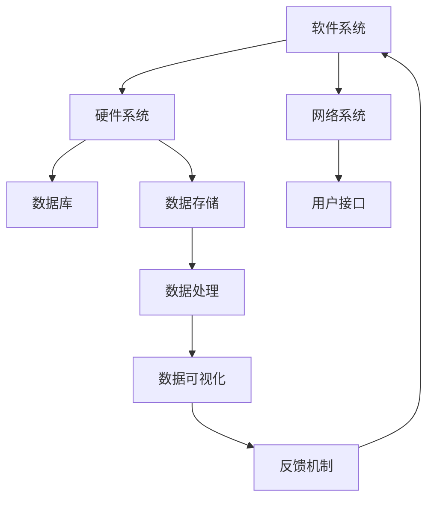

                 

 在当今信息爆炸和技术飞速发展的时代，我们面临着越来越多的复杂问题。这些问题不仅仅是单一维度的，往往涉及到多个相互关联的方面，需要我们从全局视角进行系统思考。本文将探讨系统思考在IT领域的应用，强调全局视角的重要性，并介绍一些相关的核心概念、算法原理、数学模型以及实际应用场景。希望通过这篇文章，能帮助读者更好地理解和应对复杂问题。

## 1. 背景介绍

### 1.1 系统思考的定义

系统思考（Systems Thinking）是一种通过分析、模拟和整合不同因素之间的关系，来理解复杂系统的整体行为的方法。这种方法不仅关注问题的表面现象，更注重深层次的结构和动态关系。

### 1.2 IT领域的复杂性问题

随着信息技术的迅猛发展，IT领域面临着越来越复杂的问题。比如，软件系统的复杂性不断增加，大数据和人工智能的应用场景日益丰富，网络安全威胁层出不穷。这些问题往往涉及到多个方面，需要从全局视角进行思考。

### 1.3 全局视角的重要性

全局视角可以帮助我们更好地理解复杂系统的运作机制，发现潜在的问题和机会。通过全局视角，我们可以看到各个部分之间的相互关系，从而更有效地解决问题。

## 2. 核心概念与联系

### 2.1 系统定义

系统是由一组相互关联的组件组成的整体，这些组件相互作用，共同实现特定功能。在IT领域，系统可以是软件系统、网络系统，也可以是更广泛的生态系统。

### 2.2 系统模型

系统模型是对系统的抽象表示，可以帮助我们更好地理解和分析系统的行为。常见的系统模型包括反馈环模型、Stock-Flow图等。

### 2.3 Mermaid 流程图

以下是一个使用Mermaid绘制的系统模型流程图，展示了系统各个部分之间的关系。



## 3. 核心算法原理 & 具体操作步骤

### 3.1 算法原理概述

在系统思考中，常用的算法包括系统动力学、复杂网络分析等。这些算法可以帮助我们分析系统的动态行为和复杂性。

### 3.2 算法步骤详解

#### 3.2.1 系统动力学

1. 收集系统数据
2. 建立系统模型
3. 运行模拟
4. 分析结果

#### 3.2.2 复杂网络分析

1. 构建网络模型
2. 分析网络拓扑结构
3. 确定关键节点
4. 分析网络动态行为

### 3.3 算法优缺点

#### 3.3.1 系统动力学

优点：能够模拟系统的动态行为，揭示潜在问题。

缺点：对数据质量要求较高，建模过程复杂。

#### 3.3.2 复杂网络分析

优点：能够揭示系统的复杂结构，识别关键节点。

缺点：对数据量要求较大，计算复杂度高。

### 3.4 算法应用领域

系统动力学和复杂网络分析在IT领域的应用非常广泛，如软件工程、网络安全、人工智能等。

## 4. 数学模型和公式 & 详细讲解 & 举例说明

### 4.1 数学模型构建

在系统思考中，常用的数学模型包括微分方程、马尔可夫链等。

### 4.2 公式推导过程

以下是一个基于微分方程的系统模型。

$$
\frac{dX}{dt} = f(X, Y)
$$

其中，$X$ 和 $Y$ 是系统的状态变量，$f(X, Y)$ 是状态变量的函数。

### 4.3 案例分析与讲解

假设我们有一个简单的经济系统，$X$ 表示货币供应量，$Y$ 表示商品需求量。我们可以建立以下数学模型：

$$
\frac{dX}{dt} = 0.1X - 0.05Y
$$

$$
\frac{dY}{dt} = 0.05X - 0.1Y
$$

通过求解这个模型，我们可以分析货币供应量和商品需求量的动态变化。

## 5. 项目实践：代码实例和详细解释说明

### 5.1 开发环境搭建

为了保证代码的可运行性，我们需要搭建一个合适的开发环境。这里以Python为例，我们首先需要安装Python和相关的库。

```bash
pip install numpy matplotlib
```

### 5.2 源代码详细实现

以下是一个基于系统动力学的Python代码实例。

```python
import numpy as np
import matplotlib.pyplot as plt

def system_dynamics(x, y, dt=0.01):
    f_x = 0.1 * x - 0.05 * y
    f_y = 0.05 * x - 0.1 * y
    return [x + f_x * dt, y + f_y * dt]

x, y = 1, 1
t = np.arange(0, 20, dt)

x_values, y_values = np.zeros(len(t)), np.zeros(len(t))
x_values[0], y_values[0] = x, y

for i in range(1, len(t)):
    x, y = system_dynamics(x, y)
    x_values[i] = x
    y_values[i] = y

plt.plot(t, x_values, label='X')
plt.plot(t, y_values, label='Y')
plt.xlabel('Time')
plt.ylabel('Value')
plt.legend()
plt.show()
```

### 5.3 代码解读与分析

这段代码首先定义了一个系统动力学的函数 `system_dynamics`，然后使用这个函数进行迭代计算，并绘制了状态变量 $X$ 和 $Y$ 的动态变化。

### 5.4 运行结果展示

运行这段代码，我们可以看到状态变量 $X$ 和 $Y$ 的动态变化，这有助于我们更好地理解系统的行为。


## 6. 实际应用场景

### 6.1 软件工程

在软件工程中，系统思考可以帮助我们更好地理解软件系统的复杂性，发现潜在的问题和优化机会。

### 6.2 大数据与人工智能

在大数据和人工智能领域，系统思考可以帮助我们分析数据流、算法选择和模型优化等。

### 6.3 网络安全

在网络安全领域，系统思考可以帮助我们分析网络攻击、防护策略和安全漏洞等。

## 7. 未来应用展望

随着信息技术的不断发展，系统思考在IT领域的应用前景非常广阔。未来，我们有望看到更多的跨学科合作，将系统思考与其他领域的技术相结合，解决更复杂的实际问题。

## 8. 工具和资源推荐

### 8.1 学习资源推荐

1. 《系统思考入门指南》
2. 《复杂系统与复杂性科学》
3. 《Python编程：从入门到实践》

### 8.2 开发工具推荐

1. Mermaid：用于绘制流程图和UML图的在线工具。
2. Jupyter Notebook：用于数据分析和交互式编程的IDE。

### 8.3 相关论文推荐

1. "Systems Thinking for Software Engineering"
2. "Complex Network Theory in Software Engineering"
3. "System Dynamics in Artificial Intelligence"

## 9. 总结：未来发展趋势与挑战

### 9.1 研究成果总结

系统思考在IT领域的应用已经取得了一系列重要成果，如软件工程、大数据、人工智能和网络安全等。

### 9.2 未来发展趋势

未来，系统思考将在更广泛的领域得到应用，如生物信息学、社会科学和工程等领域。

### 9.3 面临的挑战

系统思考在IT领域面临的主要挑战包括数据质量、计算复杂度和跨学科合作等。

### 9.4 研究展望

随着技术的不断发展，系统思考有望在解决复杂问题上发挥更大的作用。

## 10. 附录：常见问题与解答

### 10.1 系统思考是什么？

系统思考是一种通过分析、模拟和整合不同因素之间的关系，来理解复杂系统的整体行为的方法。

### 10.2 系统思考在IT领域有哪些应用？

系统思考在IT领域有很多应用，如软件工程、大数据、人工智能和网络安全等。

### 10.3 如何学习系统思考？

可以通过阅读相关书籍、参加培训和进行实践来学习系统思考。

作者：禅与计算机程序设计艺术 / Zen and the Art of Computer Programming
----------------------------------------------------------------

这篇文章从全局视角探讨了系统思考在IT领域的应用，强调了全局视角的重要性，并介绍了相关的核心概念、算法原理、数学模型以及实际应用场景。希望这篇文章能帮助读者更好地理解和应对复杂问题。在未来的研究中，我们将继续探索系统思考在更多领域中的应用，为解决复杂问题提供新的思路和方法。

