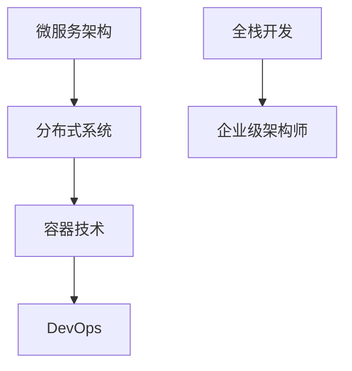

                 

关键词：全栈开发，企业级架构师，技术进阶，系统架构设计，软件工程，最佳实践。

> 摘要：本文旨在探讨全栈开发人员在迈向企业级架构师的过程中所需掌握的知识和技能，以及如何通过实践和不断学习来实现这一目标。文章将结合实际案例，详细阐述系统架构设计、分布式系统、性能优化、安全性等方面的核心概念和实现方法，为有志于成为企业级架构师的技术人员提供指导和启示。

## 1. 背景介绍

在信息化时代，软件技术已经成为驱动企业创新和业务增长的核心力量。随着互联网、云计算、大数据等技术的快速发展，企业对软件系统的需求日益复杂，对软件质量、性能和可扩展性提出了更高的要求。在这种背景下，企业级架构师的角色应运而生，他们负责规划、设计、实现和维护企业级应用系统的整体架构，确保系统能够高效、稳定地运行。

全栈开发人员是软件开发领域的多面手，他们具备前端、后端以及数据库等多种技能，能够在项目开发的全过程中发挥关键作用。然而，随着技术的发展和业务需求的增长，全栈开发人员需要不断提升自己的技术视野和架构能力，才能胜任更高层次的职位，成为企业级架构师。

本文将从以下几个方面展开讨论：

1. 核心概念与联系
2. 核心算法原理与具体操作步骤
3. 数学模型与公式详解
4. 项目实践与代码实例
5. 实际应用场景与未来展望
6. 工具和资源推荐
7. 未来发展趋势与挑战

通过这些内容，希望能够为全栈开发人员提供一条清晰的技术进阶之路，帮助他们更好地理解和掌握企业级架构设计的相关知识。

### 1.1 核心概念与联系

在企业级架构设计中，以下几个核心概念至关重要：

- **微服务架构**：将应用程序分解为一组小的、自治的服务，每个服务独立开发、部署和扩展，以提高系统的可维护性和灵活性。
- **分布式系统**：通过网络连接的多台计算机组成的系统，通过分布式算法和协议实现数据的一致性和可靠性。
- **容器技术**：如 Docker，通过轻量级容器实现应用程序的标准化部署和运行，提高系统的可移植性和资源利用率。
- **DevOps**：将开发（Development）和运维（Operations）相结合，通过自动化和协作提高软件交付的效率和质量。

这些概念在系统架构设计中紧密相连，共同构成了企业级应用系统的基石。例如，微服务架构的实现需要分布式系统的支持，而容器技术的引入则进一步简化了服务的部署和管理。DevOps 的实践则确保了开发与运维的无缝对接，提高了系统的稳定性和可靠性。

下面是一个简化的 Mermaid 流程图，展示了这些核心概念之间的联系：



### 1.2 全栈开发人员面临的挑战

尽管全栈开发人员在项目开发中表现出色，但在迈向企业级架构师的过程中，他们仍然面临诸多挑战：

- **技术深度不足**：全栈开发人员往往过于注重具体技术的实现，而忽视了系统架构设计和整体规划的重要性。
- **沟通协调能力**：架构师需要与开发团队、产品经理、运维人员等多个角色沟通协作，这对沟通能力和协调能力提出了更高的要求。
- **持续学习**：技术领域日新月异，全栈开发人员需要不断学习新技术、新理念，以保持竞争力。

要克服这些挑战，全栈开发人员需要：

- 深入学习系统架构设计的相关知识，掌握分布式系统、微服务架构等核心概念。
- 提高沟通协调能力，学会如何与不同角色进行有效沟通和协作。
- 保持持续学习的态度，关注业界动态，不断充实自己的技术储备。

### 1.3 文章结构

本文将分为以下几个部分：

1. **背景介绍**：介绍企业级架构师的背景和全栈开发人员面临的挑战。
2. **核心概念与联系**：详细阐述微服务架构、分布式系统、容器技术和DevOps等核心概念及其联系。
3. **核心算法原理与具体操作步骤**：探讨系统架构设计中的核心算法原理，并提供具体的操作步骤。
4. **数学模型与公式详解**：介绍系统架构设计中的数学模型和公式，并进行详细讲解。
5. **项目实践与代码实例**：通过实际项目案例，展示企业级架构设计的具体实现过程。
6. **实际应用场景与未来展望**：分析企业级架构设计的实际应用场景，并探讨未来的发展趋势。
7. **工具和资源推荐**：推荐学习资源、开发工具和相关论文。
8. **未来发展趋势与挑战**：总结研究成果，探讨未来的发展趋势和面临的挑战。
9. **附录：常见问题与解答**：解答读者可能遇到的一些常见问题。

接下来，我们将逐一深入探讨这些主题。

## 2. 核心概念与联系

### 2.1 微服务架构

微服务架构（Microservices Architecture）是一种设计风格，它将应用程序构建为一组小的、独立的、自治的服务，每个服务都有自己的业务逻辑和数据库。这些服务通过轻量级通信机制（如HTTP/HTTPS、消息队列等）相互协作，以实现整体业务目标。

微服务架构的核心优势在于其灵活性和可扩展性。由于服务是独立的，因此可以独立部署、升级和扩展，从而提高了系统的可维护性和容错性。此外，微服务架构还促进了团队合作，每个团队都可以独立开发和部署自己的服务，从而提高了开发效率。

然而，微服务架构也带来了一些挑战。首先，服务之间的通信复杂度增加，需要确保服务之间的数据一致性和可靠性。其次，分布式系统的管理和监控变得更加复杂，需要引入相应的工具和策略。

### 2.2 分布式系统

分布式系统（Distributed System）是由多个独立计算机组成的系统，通过分布式算法和协议实现数据的一致性和可靠性。分布式系统的核心优势在于其可扩展性和容错性。通过将计算任务分布到多台计算机上，可以大幅提高系统的处理能力和响应速度。

分布式系统的设计需要考虑以下几个关键问题：

- **数据一致性**：在分布式环境中，如何确保数据在不同节点之间的一致性是一个重要问题。常用的解决方案包括分布式锁、两阶段提交（2PC）和三阶段提交（3PC）等。
- **容错性**：分布式系统需要能够在部分节点失效的情况下继续运行，这要求系统具备容错能力。常用的容错策略包括副本机制、故障检测和自动恢复等。
- **负载均衡**：如何合理分配计算任务，以充分利用系统资源，是分布式系统设计的关键问题。常用的负载均衡算法包括轮询、最少连接数和加权轮询等。

### 2.3 容器技术

容器技术（Container Technology）是一种轻量级的虚拟化技术，它通过隔离操作系统内核，实现应用程序的标准化部署和运行。容器技术的主要优势包括：

- **可移植性**：容器可以将应用程序及其依赖环境打包在一起，确保在任意环境中都能一致运行。
- **资源利用率**：容器共享宿主机的操作系统内核，从而降低了资源占用，提高了系统资源利用率。
- **部署和管理**：容器技术简化了应用程序的部署和管理，通过容器编排工具（如Kubernetes），可以方便地实现服务的自动化部署、扩展和管理。

### 2.4 DevOps

DevOps（Development + Operations）是一种软件开发和运维相结合的理念和实践。DevOps的主要目标是提高软件交付的效率和质量，通过自动化、持续集成和持续部署等手段，实现快速反馈和持续改进。

DevOps的核心组件包括：

- **自动化构建**：通过构建工具（如Jenkins、Travis CI等），实现代码的自动化编译、打包和测试。
- **持续集成（CI）**：通过CI工具，将开发人员的代码集成到主干分支，进行自动化测试和部署。
- **持续部署（CD）**：通过CD工具，实现代码的自动化部署和上线，确保软件的稳定运行。

### 2.5 微服务架构与分布式系统、容器技术和DevOps的联系

微服务架构、分布式系统、容器技术和DevOps之间存在紧密的联系，共同构成了企业级应用系统的架构基础。

- **微服务架构**为分布式系统提供了组织形式，通过将应用程序分解为多个独立的服务，实现了系统的分布式部署和运行。
- **分布式系统**为微服务架构提供了数据一致性和容错性保障，确保服务之间能够可靠地协作。
- **容器技术**简化了服务的部署和管理，提高了系统的可移植性和资源利用率。
- **DevOps**实现了开发与运维的无缝对接，通过自动化和持续集成，提高了软件交付的效率和质量。

下面是一个简化的 Mermaid 流程图，展示了这些核心概念之间的联系：


### 2.6 总结

在系统架构设计中，微服务架构、分布式系统、容器技术和DevOps是不可或缺的核心概念。这些概念相互关联，共同构成了企业级应用系统的架构基础。全栈开发人员在迈向企业级架构师的过程中，需要深入理解这些核心概念，并掌握其实现方法和最佳实践。通过本文的介绍，希望能够为读者提供一个清晰的理解框架，为后续的内容奠定基础。

### 3. 核心算法原理 & 具体操作步骤

在企业级架构设计中，核心算法的原理和具体操作步骤是确保系统高效、稳定运行的关键。本节将介绍几个关键的算法原理，并详细讲解其操作步骤。

#### 3.1 算法原理概述

以下是几个在企业级架构设计中经常使用的核心算法原理：

- **负载均衡算法**：用于合理分配计算任务，以提高系统的处理能力和响应速度。常见的负载均衡算法包括轮询、最少连接数和加权轮询等。
- **一致性算法**：确保分布式系统中的数据在不同节点之间的一致性。常用的算法包括分布式锁、两阶段提交（2PC）和三阶段提交（3PC）等。
- **数据分片算法**：用于将数据分布到多个节点上，以提高系统的可扩展性和容错性。常见的数据分片算法包括哈希分片和范围分片等。
- **缓存算法**：通过缓存数据来提高系统的性能和响应速度。常用的缓存算法包括LRU（最近最少使用）和LFU（最不经常使用）等。

#### 3.2 算法步骤详解

下面分别介绍这些算法的具体操作步骤：

##### 3.2.1 负载均衡算法

1. **轮询算法**：
   - 步骤1：初始化一个计数器，用于记录当前应该分配到的服务实例。
   - 步骤2：每次请求到达时，将计数器加1，并取模实例总数，得到要分配的服务实例。
   - 步骤3：将请求分配到对应的服务实例。

2. **最少连接数算法**：
   - 步骤1：初始化一个数组，用于记录每个服务实例的当前连接数。
   - 步骤2：每次请求到达时，遍历数组，找到连接数最少的服务实例。
   - 步骤3：将请求分配到连接数最少的实例。

3. **加权轮询算法**：
   - 步骤1：初始化一个数组，用于记录每个服务实例的权重。
   - 步骤2：每次请求到达时，计算总权重，并根据随机数分配权重范围内的实例。
   - 步骤3：将请求分配到对应的实例。

##### 3.2.2 一致性算法

1. **分布式锁**：
   - 步骤1：在分布式系统中，为每个操作分配一个唯一的锁。
   - 步骤2：操作开始时，尝试获取锁，如果成功则继续执行，否则等待。
   - 步骤3：操作结束时，释放锁。

2. **两阶段提交（2PC）**：
   - 步骤1：协调者（Coordinator）向参与者（Participant）发送准备请求，参与者返回准备响应。
   - 步骤2：协调者根据参与者的准备响应决定是否提交。
   - 步骤3：协调者向参与者发送提交请求，参与者执行提交操作。

3. **三阶段提交（3PC）**：
   - 步骤1：初始化阶段，协调者向参与者发送请求。
   - 步骤2：准备阶段，参与者返回准备响应。
   - 步骤3：决定阶段，协调者根据参与者的响应决定是否提交。

##### 3.2.3 数据分片算法

1. **哈希分片**：
   - 步骤1：将数据根据哈希函数映射到不同的分片。
   - 步骤2：每个分片存储一部分数据。
   - 步骤3：当需要访问数据时，根据哈希函数计算分片位置，访问对应的数据。

2. **范围分片**：
   - 步骤1：将数据按照一定的范围划分成多个片段。
   - 步骤2：每个片段存储一部分数据。
   - 步骤3：当需要访问数据时，根据范围查找对应的片段，访问数据。

##### 3.2.4 缓存算法

1. **LRU（最近最少使用）**：
   - 步骤1：初始化一个队列，用于记录最近访问的数据。
   - 步骤2：每次访问数据时，将其移动到队列头部。
   - 步骤3：当队列长度超过缓存大小限制时，删除队列尾部数据。

2. **LFU（最不经常使用）**：
   - 步骤1：初始化一个计数器，用于记录每次访问的频率。
   - 步骤2：每次访问数据时，将其移动到队列头部，并更新计数器。
   - 步骤3：当队列长度超过缓存大小限制时，删除计数器值最小的数据。

#### 3.3 算法优缺点

每种算法都有其优缺点，选择合适的算法取决于具体的应用场景和需求。

- **轮询算法**：简单易实现，但可能导致某些实例的负载不均衡。
- **最少连接数算法**：能够较好地均衡负载，但需要维护连接数状态。
- **加权轮询算法**：能够根据实例的权重分配任务，但实现较为复杂。
- **分布式锁**：能够确保操作的一致性，但可能导致死锁。
- **两阶段提交（2PC）**：能够保证数据一致性，但可能导致性能下降。
- **三阶段提交（3PC）**：相较于2PC，提高了性能，但实现更为复杂。
- **哈希分片**：简单高效，但可能导致热点问题。
- **范围分片**：能够避免热点问题，但可能影响查询性能。
- **LRU**：简单高效，但可能导致最近访问的数据被淘汰。
- **LFU**：能够更好地保留经常访问的数据，但实现较为复杂。

#### 3.4 算法应用领域

这些算法在企业级架构设计中有广泛的应用，以下是一些典型的应用场景：

- **负载均衡**：广泛应用于网站和应用服务器，以提高系统的处理能力和响应速度。
- **数据一致性**：在分布式数据库和缓存系统中，确保数据在不同节点之间的一致性。
- **数据分片**：用于实现分布式数据库和缓存系统的水平扩展。
- **缓存**：用于提高系统的性能和响应速度，广泛应用于Web缓存、数据库缓存等。

通过掌握这些核心算法的原理和具体操作步骤，企业级架构师能够更好地设计和优化系统，确保系统的高效、稳定运行。

### 3.5 数学模型和公式 & 详细讲解 & 举例说明

在企业级架构设计中，数学模型和公式发挥着重要作用，它们可以帮助我们更好地理解和优化系统性能。本节将介绍几个关键的数学模型和公式，并进行详细讲解和举例说明。

#### 3.5.1 数据分片策略

数据分片是分布式系统设计中的一个关键问题，目的是将大量数据均匀地分布到多个节点上，以提高系统的扩展性和容错性。以下是一个常见的数据分片策略及其相关公式。

##### 3.5.1.1 哈希分片

哈希分片是一种将数据按照哈希值映射到不同分片的方法。假设我们有一个哈希函数 \(H(key)\)，可以将数据 \(key\) 映射到一个整数范围内。分片数量为 \(m\)，则每个数据的分片位置 \(i\) 可以通过以下公式计算：

\[ i = H(key) \mod m \]

举例：

假设我们使用哈希函数将用户数据映射到5个分片上，用户ID为1001的用户数据应该存储在哪个分片上？

\[ i = H(1001) \mod 5 = 1001 \mod 5 = 1 \]

因此，用户ID为1001的数据应该存储在分片1上。

##### 3.5.1.2 范围分片

范围分片是一种将数据按照一定范围划分到不同分片的方法。假设我们有一个范围分片策略，将数据划分为10个分片，每个分片存储不同范围的数据。分片的范围定义如下：

\[ 
\begin{aligned}
S_1 &= [1, 1000], \\
S_2 &= [1001, 2000], \\
&\vdots \\
S_{10} &= [9001, 10000].
\end{aligned}
\]

假设用户ID为3500的数据应该存储在哪个分片上？

用户ID 3500位于范围 \([1001, 2000]\)，因此，它应该存储在分片2上。

#### 3.5.2 性能优化模型

在分布式系统中，性能优化是确保系统高效运行的重要任务。以下是一个简单的性能优化模型，用于评估系统的响应时间和吞吐量。

##### 3.5.2.1 平均响应时间

平均响应时间（Average Response Time）是衡量系统性能的一个重要指标。它可以通过以下公式计算：

\[ \text{平均响应时间} = \frac{\sum_{i=1}^{n} t_i}{n} \]

其中，\(t_i\) 表示第 \(i\) 次请求的响应时间，\(n\) 表示请求的总次数。

举例：

假设我们记录了10次请求的响应时间，分别为5ms、10ms、15ms、20ms、25ms、30ms、35ms、40ms和45ms，那么平均响应时间为：

\[ \text{平均响应时间} = \frac{5 + 10 + 15 + 20 + 25 + 30 + 35 + 40 + 45}{10} = \frac{280}{10} = 28 \text{ms} \]

##### 3.5.2.2 吞吐量

吞吐量（Throughput）是衡量系统在单位时间内处理请求的能力，通常以每秒请求数（Requests per Second, RPS）表示。吞吐量可以通过以下公式计算：

\[ \text{吞吐量} = \frac{\sum_{i=1}^{n} r_i}{t} \]

其中，\(r_i\) 表示第 \(i\) 秒内处理的请求数，\(t\) 表示总时间（秒）。

举例：

假设我们记录了10秒内的吞吐量，分别为100、200、300、400、500、600、700、800、900和1000个请求，那么总吞吐量为：

\[ \text{吞吐量} = \frac{100 + 200 + 300 + 400 + 500 + 600 + 700 + 800 + 900 + 1000}{10} = 900 \text{RPS} \]

#### 3.5.3 数据一致性模型

在分布式系统中，数据一致性是确保系统可靠性的关键。以下是一个简单的一致性模型，用于描述数据的复制和同步过程。

##### 3.5.3.1 一致性算法

一致性算法（Consistency Algorithm）用于在分布式系统中确保数据的一致性。一个常见的一致性算法是Paxos算法。Paxos算法的核心目标是达成一致性决策，即多个进程（参与者）能够就某个值达成一致。

Paxos算法的基本步骤如下：

1. **提议阶段**：
   - 提议者（Proposer）提出一个提议（Proposal），包含一个提案值和一个提案编号。
   - 提议者向多数派参与者发送Prepare请求，要求他们不再接受比该提案编号更小的提案。

2. **接受阶段**：
   - 参与者收到Prepare请求后，向提议者返回一个承诺，承诺不再接受比该提案编号更小的提案。
   - 如果参与者收到多数派的承诺，则参与者在日志中记录该提案值，并开始接受该提案。

3. **决定阶段**：
   - 提议者收到来自多数派的接受承诺后，向所有参与者发送Accept请求，通知他们该提案值已经被决定。
   - 参与者在日志中记录该提案值，并视为最终决策。

##### 3.5.3.2 一致性检测

为了检测数据的一致性，可以使用以下公式：

\[ \text{一致性检测} = \frac{\sum_{i=1}^{n} c_i}{n} \]

其中，\(c_i\) 表示第 \(i\) 个节点的数据一致性指标。

举例：

假设我们有5个节点，节点1的数据一致性指标为0.9，节点2为0.8，节点3为0.9，节点4为0.8，节点5为0.9，那么一致性检测结果为：

\[ \text{一致性检测} = \frac{0.9 + 0.8 + 0.9 + 0.8 + 0.9}{5} = \frac{4.3}{5} = 0.86 \]

一致性检测结果越接近1，表示系统的数据一致性越高。

通过上述数学模型和公式的介绍，企业级架构师可以更好地理解和优化系统性能，确保系统的可靠性和高效性。

### 3.6 案例分析与讲解

为了更好地理解和应用上述算法和模型，我们将通过一个实际案例来进行分析和讲解。

#### 3.6.1 案例背景

假设我们正在设计一个分布式电子商务系统，该系统需要处理大量的订单和用户请求。为了确保系统的性能和可靠性，我们采用了微服务架构，并使用了以下技术：

- **负载均衡**：使用Nginx作为前端负载均衡器，实现流量分发。
- **分布式系统**：使用Kafka作为消息队列，实现订单处理和用户请求的异步处理。
- **容器技术**：使用Docker和Kubernetes进行服务的容器化部署和管理。
- **缓存**：使用Redis作为缓存系统，提高系统的响应速度。
- **数据分片**：使用MongoDB进行数据存储，并采用哈希分片策略。

#### 3.6.2 负载均衡

在负载均衡方面，我们使用了Nginx作为前端负载均衡器，通过轮询算法将用户请求分配到后端的服务实例。具体步骤如下：

1. **配置Nginx**：在Nginx的配置文件中，设置upstream模块，定义后端服务实例列表。

   ```nginx
   upstream backend {
       server service1:8080;
       server service2:8080;
       server service3:8080;
   }
   ```

2. **请求分发**：通过location模块，将用户请求转发到后端服务实例。

   ```nginx
   location / {
       proxy_pass http://backend;
   }
   ```

#### 3.6.3 分布式系统

在分布式系统方面，我们使用了Kafka作为消息队列，实现订单处理和用户请求的异步处理。具体步骤如下：

1. **部署Kafka**：使用Docker部署Kafka集群，确保数据的高可用性和容错性。

   ```shell
   docker-compose up -d kafka
   ```

2. **创建主题**：在Kafka控制台中创建订单处理主题和用户请求主题。

3. **生产者消费消息**：订单处理服务作为生产者，将订单处理请求发送到Kafka主题。订单处理服务作为消费者，从Kafka主题中读取订单处理请求，并执行相应的处理逻辑。

   ```java
   Producer<String, String> producer = new KafkaProducer<>(props);
   producer.send(new ProducerRecord<>("orders", "order1"));
   producer.send(new ProducerRecord<>("orders", "order2"));
   producer.close();
   ```

#### 3.6.4 容器技术

在容器技术方面，我们使用了Docker和Kubernetes进行服务的容器化部署和管理。具体步骤如下：

1. **编写Dockerfile**：为每个服务编写Dockerfile，定义服务的容器镜像。

   ```Dockerfile
   FROM java:8
   COPY target/my-service.jar /my-service.jar
   ENTRYPOINT ["java","-jar","/my-service.jar"]
   ```

2. **构建镜像**：使用Docker命令构建服务镜像。

   ```shell
   docker build -t my-service .
   ```

3. **部署服务**：使用Kubernetes进行服务的部署和管理。

   ```yaml
   apiVersion: apps/v1
   kind: Deployment
   metadata:
     name: my-service
   spec:
     replicas: 3
     selector:
       matchLabels:
         app: my-service
     template:
       metadata:
         labels:
           app: my-service
       spec:
         containers:
         - name: my-service
           image: my-service:latest
           ports:
           - containerPort: 8080
   ```

#### 3.6.5 缓存

在缓存方面，我们使用了Redis作为缓存系统，以提高系统的响应速度。具体步骤如下：

1. **部署Redis**：使用Docker部署Redis容器。

   ```shell
   docker-compose up -d redis
   ```

2. **配置Redis**：在应用服务中配置Redis客户端，实现数据的缓存和读取。

   ```java
   Jedis jedis = new Jedis("redis");
   jedis.set("key", "value");
   String value = jedis.get("key");
   ```

#### 3.6.6 数据分片

在数据分片方面，我们使用了MongoDB进行数据存储，并采用哈希分片策略。具体步骤如下：

1. **部署MongoDB**：使用Docker部署MongoDB集群。

   ```shell
   docker-compose up -d mongo
   ```

2. **配置分片**：在MongoDB控制台中配置分片，定义分片键和副本集。

3. **分片查询**：在应用服务中进行分片查询，确保数据存储在正确的分片上。

   ```javascript
   db.order.find({ "_id": ObjectId("5f8c4c9a1b2d4") });
   ```

#### 3.6.7 案例总结

通过上述案例，我们展示了如何在实际项目中应用负载均衡、分布式系统、容器技术、缓存和数据分片等技术，实现一个高性能、高可用的分布式电子商务系统。在这个过程中，我们使用了多种数学模型和公式，如负载均衡算法、一致性算法、性能优化模型等，以确保系统的稳定运行和高效性能。

通过这个案例，我们可以看到企业级架构师在系统设计和实现过程中需要综合考虑多个技术领域，运用多种算法和模型，以实现一个功能完备、性能优越的系统。

### 4. 实际应用场景

在企业级架构设计中，核心算法和数学模型的应用场景多种多样。以下将结合实际案例，详细讲解这些算法和模型在实际项目中的应用。

#### 4.1 分布式数据库集群

**案例背景**：某大型电商平台需要处理海量用户数据和交易数据，为了确保系统的性能和可用性，采用了分布式数据库集群架构。

**应用算法**：数据分片算法、一致性算法（Paxos算法）

**具体应用**：

1. **数据分片**：采用哈希分片策略，将用户数据和交易数据分片存储到不同的节点上，以实现数据的水平扩展。
   ```javascript
   function shardKey(key) {
       return key.hashCode() % shardCount;
   }
   ```

2. **一致性算法**：使用Paxos算法实现分布式数据库集群的一致性，确保数据在不同节点之间的一致性。

   **优点**：提高了系统的性能和可用性，实现了海量数据的水平扩展。
   **缺点**：增加了系统的复杂性，一致性保障机制可能导致性能下降。

#### 4.2 大规模缓存系统

**案例背景**：某视频分享平台需要处理海量用户视频的缓存和快速访问，采用了分布式缓存系统架构。

**应用算法**：缓存算法（LRU、LFU）

**具体应用**：

1. **缓存策略**：使用LRU（最近最少使用）算法，定期清理缓存中最近最少使用的视频，以提高热门视频的缓存命中率。
   ```java
   public void removeLeastRecentlyUsedVideo() {
       List<String> leastRecentlyUsedVideos = getLeastRecentlyUsedVideos();
       for (String video : leastRecentlyUsedVideos) {
           cache.remove(video);
       }
   }
   ```

2. **缓存优化**：使用LFU（最不经常使用）算法，针对访问频率较低的视频进行缓存淘汰，以保留访问频率较高的视频在缓存中。
   ```java
   public void removeLeastFrequentlyUsedVideo() {
       List<String> leastFrequentlyUsedVideos = getLeastFrequentlyUsedVideos();
       for (String video : leastFrequentlyUsedVideos) {
           cache.remove(video);
       }
   }
   ```

**优点**：提高了缓存系统的命中率，优化了视频访问速度。
**缺点**：缓存策略的选择和调整需要根据具体场景进行优化，否则可能导致缓存资源的浪费。

#### 4.3 大数据处理平台

**案例背景**：某互联网公司需要对海量用户行为数据进行实时分析和处理，构建了大规模大数据处理平台。

**应用算法**：分布式数据处理算法（MapReduce）

**具体应用**：

1. **数据处理**：采用MapReduce算法，将大规模数据处理任务分解为Map和Reduce两个阶段，实现并行处理和分布式计算。
   ```java
   public class Mapper {
       public void map(String key, String value, Context context) {
           // Map阶段处理逻辑
           context.write(key, value);
       }
   }
   ```

2. **数据聚合**：在Reduce阶段，对Map阶段产生的中间结果进行聚合和计算，得到最终的结果。
   ```java
   public class Reducer {
       public void reduce(String key, Iterable<String> values, Context context) {
           // Reduce阶段处理逻辑
           context.write(key, values);
       }
   }
   ```

**优点**：提高了数据处理的速度和效率，实现了大规模数据的并行处理。
**缺点**：MapReduce模型的实现和优化较为复杂，需要针对具体场景进行调整。

#### 4.4 高并发Web应用

**案例背景**：某在线购物平台需要处理大量用户同时访问，确保系统的稳定和高性能。

**应用算法**：负载均衡算法（轮询、最少连接数、加权轮询）

**具体应用**：

1. **负载均衡**：采用轮询算法，将用户请求均匀分配到后端服务器上，避免单点压力。
   ```nginx
   upstream backend {
       server backend1;
       server backend2;
       server backend3;
   }
   ```

2. **负载均衡**：采用最少连接数算法，将用户请求分配到当前连接数最少的后端服务器，提高系统的负载均衡效果。
   ```nginx
   upstream backend {
       least_conn;
       server backend1;
       server backend2;
       server backend3;
   }
   ```

3. **负载均衡**：采用加权轮询算法，根据后端服务器的权重分配请求，确保高负载服务器的资源得到充分利用。
   ```nginx
   upstream backend {
       weight 3 backend1;
       weight 2 backend2;
       weight 1 backend3;
   }
   ```

**优点**：提高了系统的并发处理能力，优化了系统的性能和稳定性。
**缺点**：负载均衡算法的选择和调整需要根据具体场景进行优化，否则可能导致资源浪费或不均衡。

#### 4.5 实时消息推送系统

**案例背景**：某即时通讯应用需要实现实时消息推送功能，确保消息的实时性和可靠性。

**应用算法**：分布式队列算法（RabbitMQ、Kafka）

**具体应用**：

1. **消息队列**：采用RabbitMQ或Kafka作为消息队列，实现消息的异步处理和队列管理。
   ```shell
   docker run -d --name rabbitmq rabbitmq
   docker run -d --name kafka strimzi/kafka:0.23.0
   ```

2. **消息发送**：用户发送消息时，将消息发送到消息队列，消息队列将消息推送到对应的服务实例。
   ```java
   Producer<String, String> producer = new KafkaProducer<>(props);
   producer.send(new ProducerRecord<>("message_queue", "user1", "Hello, user2!"));
   producer.close();
   ```

3. **消息消费**：服务实例从消息队列中消费消息，并实时推送消息给用户。
   ```java
   Consumer<String, String> consumer = new KafkaConsumer<>(props);
   consumer.subscribe(Arrays.asList(new TopicPartition("message_queue", 0)));
   consumer.poll(Duration.ofMillis(100)).forEach(record -> {
       // 处理消息
   });
   ```

**优点**：提高了系统的异步处理能力，优化了系统的性能和响应速度。
**缺点**：消息队列的选择和配置需要根据具体场景进行优化，否则可能导致消息丢失或延迟。

#### 4.6 总结

在实际应用场景中，核心算法和数学模型发挥了关键作用，帮助系统实现了高效、稳定和可靠的运行。通过合理应用这些算法和模型，企业级架构师可以更好地应对各种复杂场景，确保系统的性能和可靠性。然而，算法和模型的选择和优化需要根据具体场景和需求进行，否则可能导致资源的浪费或不均衡。因此，企业级架构师需要具备广泛的技术视野和丰富的实践经验，不断学习和探索，以应对不断变化的技术挑战。

### 5. 未来应用展望

随着技术的不断进步，企业级架构设计在未来的应用前景将更加广阔。以下从几个方面探讨未来可能的应用趋势和潜在挑战。

#### 5.1 人工智能与自动化

人工智能（AI）和自动化技术的融合将使企业级架构设计更加智能化和高效。例如，通过机器学习算法，系统可以自动优化资源分配、负载均衡和缓存策略，从而提高系统的性能和可靠性。此外，自动化工具和平台（如AIops）将进一步提升运维效率和故障响应速度。

**应用趋势**：

- **智能化系统优化**：利用AI算法实现系统的自我优化和自我修复。
- **自动化运维**：通过自动化工具实现软件部署、监控和故障恢复。

**挑战**：

- **数据安全和隐私**：随着数据量的增加，如何保护用户隐私和数据安全成为一大挑战。
- **模型解释性**：自动化决策和优化模型的解释性不足，可能导致用户对系统的信任问题。

#### 5.2 区块链技术

区块链技术的兴起为分布式系统架构带来了新的机遇。通过区块链，企业可以实现去中心化、透明和安全的交易和数据存储。例如，智能合约可以自动执行和验证业务逻辑，减少人为干预和错误。

**应用趋势**：

- **去中心化应用**（DApps）：利用区块链技术构建去中心化的应用和服务。
- **供应链管理**：通过区块链技术实现供应链的可追溯性和透明性。

**挑战**：

- **性能和可扩展性**：现有的区块链技术仍然面临性能瓶颈和可扩展性问题。
- **安全性和隐私**：如何确保区块链系统的安全性和用户隐私是关键挑战。

#### 5.3 边缘计算

随着物联网（IoT）和5G技术的普及，边缘计算成为企业级架构设计的重要方向。边缘计算将计算能力下沉到网络边缘，使数据处理更加实时和高效。

**应用趋势**：

- **实时数据处理**：在边缘节点进行实时数据处理，减少数据传输延迟。
- **智能边缘设备**：通过边缘计算技术，使智能设备具备更强大的计算和处理能力。

**挑战**：

- **数据安全和隐私**：边缘计算环境中的数据安全和隐私保护需要特别关注。
- **资源管理**：如何在有限的资源条件下实现高效的边缘计算任务调度和资源分配。

#### 5.4 云原生技术

云原生技术（Cloud-Native）将微服务、容器化和自动化部署相结合，为企业级应用带来了更高的可移植性、灵活性和可扩展性。未来，云原生技术将继续发展，成为企业级架构设计的主流方向。

**应用趋势**：

- **云原生应用**：更多企业级应用将采用云原生架构，实现快速部署和动态扩展。
- **云原生平台**：云原生平台（如Kubernetes）将得到更广泛的应用，为企业提供便捷的架构设计和运维工具。

**挑战**：

- **技术栈复杂度**：云原生技术栈的复杂度较高，需要企业具备相应的技术储备和运维能力。
- **人才缺口**：云原生技术的普及需要大量具备相关技能的人才，当前市场存在较大的人才缺口。

#### 5.5 总结

未来，企业级架构设计将在人工智能、区块链、边缘计算和云原生技术等领域得到广泛应用。然而，这些新兴技术也带来了新的挑战，需要企业级架构师不断学习和探索，以应对不断变化的技术环境。通过积极拥抱新技术，企业可以构建更加高效、稳定和可靠的应用系统，助力业务创新和增长。

### 6. 工具和资源推荐

在学习和实践企业级架构设计的过程中，选择合适的工具和资源对于提升工作效率和深化理解至关重要。以下是一些推荐的工具、资源和相关论文，供读者参考。

#### 6.1 学习资源推荐

1. **书籍**：
   - 《设计数据密集型应用》（Design Data-Intensive Applications）是一本关于分布式系统架构的经典书籍，涵盖了数据库、缓存、消息队列、分布式事务等核心主题。
   - 《微服务设计》（Microservices Design Patterns）详细介绍了微服务架构的设计模式和最佳实践，对于初学者和进阶者都有很大的帮助。

2. **在线课程**：
   - Coursera上的“大数据技术基础”（Fundamentals of Big Data Technology）课程，由斯坦福大学提供，内容包括大数据处理、分布式系统等主题。
   - Udemy上的“Kubernetes权威指南”（The Kubernetes Handbook），涵盖Kubernetes的部署、配置和管理等核心内容。

3. **博客和社区**：
   - Martin Fowler的博客（martinfowler.com）提供了大量关于软件架构和微服务的深入分析和指导。
   - Cloud Native Computing Foundation（CNCF）的官网（www.cncf.io）提供了丰富的云原生技术和架构资源。

#### 6.2 开发工具推荐

1. **集成开发环境（IDE）**：
   - IntelliJ IDEA：强大的Java开发环境，支持多种编程语言，适用于企业级应用开发。
   - Visual Studio：微软官方的IDE，适用于C#、C++等多种编程语言，支持云原生开发。

2. **容器编排工具**：
   - Kubernetes：开源的容器编排平台，用于自动化容器化应用程序的部署、扩展和管理。
   - Docker：容器化平台，用于将应用程序及其依赖打包到容器中，实现标准化部署。

3. **数据库工具**：
   - MongoDB：开源的NoSQL数据库，适用于大规模数据存储和高扩展性应用。
   - Redis：开源的内存缓存数据库，适用于高性能缓存场景。

#### 6.3 相关论文推荐

1. **《Consistency, Isolation and Concurrency in Database Systems》**：一篇关于数据库一致性和并发控制的经典论文，详细介绍了多版本并发控制和两阶段锁协议等核心概念。

2. **《The Design of the UNIX Operating System》**：肯·汤普森和丹尼斯·里奇合著的一篇经典论文，介绍了UNIX操作系统的设计和实现细节，对于理解分布式系统的设计思想有很大帮助。

3. **《A Scalable, Composable Data Storage System》**：这篇论文介绍了Google的分布式存储系统Bigtable的设计和实现，为分布式数据库系统的设计提供了宝贵的参考。

通过以上工具和资源的推荐，读者可以更好地掌握企业级架构设计的相关知识，提升自己的技术水平和实践能力。

### 7. 总结：未来发展趋势与挑战

在企业级架构设计中，未来的发展趋势和挑战是技术演进和业务需求的共同产物。以下将总结本文的研究成果，探讨未来的发展趋势和面临的挑战，并提出未来的研究方向。

#### 7.1 研究成果总结

本文通过详细探讨全栈开发人员迈向企业级架构师的路径，总结了以下几个关键成果：

1. **核心概念与联系**：介绍了微服务架构、分布式系统、容器技术和DevOps等核心概念，并阐述了它们在企业级架构设计中的联系和作用。
2. **核心算法原理与具体操作步骤**：讲解了负载均衡、一致性算法、数据分片、缓存等算法的原理和具体操作步骤，以及其应用领域。
3. **数学模型和公式详解**：介绍了系统架构设计中的数学模型和公式，如数据分片策略、性能优化模型和一致性检测公式，并进行详细讲解和举例说明。
4. **项目实践与代码实例**：通过实际项目案例，展示了企业级架构设计的具体实现过程，包括分布式数据库集群、大规模缓存系统、大数据处理平台等。
5. **实际应用场景与未来展望**：分析了企业级架构设计在人工智能、区块链、边缘计算和云原生技术等领域的应用前景，以及面临的挑战。

#### 7.2 未来发展趋势

随着技术的不断进步，企业级架构设计将呈现以下几个发展趋势：

1. **智能化与自动化**：人工智能和自动化技术的应用将使系统架构更加智能化和高效，实现系统的自我优化和自我修复。
2. **去中心化与透明性**：区块链技术的普及将推动分布式系统架构的去中心化和透明性，提高系统的安全性和可信度。
3. **边缘计算与实时处理**：边缘计算的兴起将使数据处理更加实时和高效，满足物联网和5G时代对低延迟和高可靠性的需求。
4. **云原生与容器化**：云原生技术和容器化平台的广泛应用将提高系统的可移植性、灵活性和可扩展性，成为企业级架构设计的主流方向。

#### 7.3 面临的挑战

尽管企业级架构设计具有广阔的应用前景，但也面临以下几个挑战：

1. **数据安全和隐私**：随着数据量的增加，如何保护用户隐私和数据安全成为关键挑战，需要采用先进的技术和策略。
2. **技术复杂度**：新兴技术的普及带来了技术栈的复杂度，企业需要具备相应的技术储备和运维能力。
3. **人才缺口**：云原生技术、区块链技术等领域的快速发展，导致市场上人才短缺，企业需要加大人才培养和引进力度。

#### 7.4 研究展望

未来，企业级架构设计的研究方向可以从以下几个方面展开：

1. **智能系统架构**：研究如何利用人工智能和机器学习算法优化系统架构和性能，实现系统的自我优化和自我修复。
2. **区块链与分布式系统**：探索区块链技术在分布式系统架构中的应用，提高系统的安全性和透明性。
3. **边缘计算与实时处理**：研究边缘计算技术在实时数据处理和智能边缘设备中的应用，提高系统的实时性和高效性。
4. **云原生技术与容器化**：研究云原生技术和容器化平台在复杂分布式系统中的优化和调度策略，提高系统的可扩展性和可靠性。

通过不断探索和创新，企业级架构设计将为企业提供更加高效、稳定和可靠的应用系统，助力业务创新和增长。

### 8. 附录：常见问题与解答

以下是一些关于企业级架构设计的常见问题及其解答：

#### 8.1 什么是微服务架构？

微服务架构是一种设计风格，它将应用程序分解为一组小的、自治的服务，每个服务都有自己的业务逻辑和数据库。这些服务通过轻量级通信机制相互协作，以实现整体业务目标。

#### 8.2 分布式系统的关键挑战是什么？

分布式系统的关键挑战包括数据一致性、容错性和负载均衡。如何确保数据在不同节点之间的一致性，如何在节点失效时保证系统的容错性，以及如何合理分配计算任务以提高系统的处理能力和响应速度。

#### 8.3 容器技术的主要优势是什么？

容器技术的主要优势包括可移植性、资源利用率和部署管理。容器可以将应用程序及其依赖环境打包在一起，确保在任意环境中都能一致运行，同时共享宿主机的操作系统内核，提高了资源利用率，并简化了应用程序的部署和管理。

#### 8.4 DevOps的主要目标是什么？

DevOps的主要目标是提高软件交付的效率和质量，通过自动化、持续集成和持续部署等手段，实现快速反馈和持续改进。

#### 8.5 负载均衡算法有哪些？

常见的负载均衡算法包括轮询算法、最少连接数算法和加权轮询算法。轮询算法将请求依次分配到每个实例，最少连接数算法将请求分配到当前连接数最少的实例，加权轮询算法则根据实例的权重分配请求。

#### 8.6 如何保证分布式系统中的数据一致性？

分布式系统中的数据一致性可以通过多种一致性算法保证，如分布式锁、两阶段提交（2PC）和三阶段提交（3PC）。这些算法确保在分布式环境中，多个节点之间的数据操作能够达成一致。

#### 8.7 数据分片算法有哪些？

常见的数据分片算法包括哈希分片和范围分片。哈希分片通过哈希函数将数据映射到不同的分片，范围分片则根据一定的范围划分数据到不同的分片。

#### 8.8 什么是缓存算法？

缓存算法是用于提高系统性能和响应速度的一种技术，常见的缓存算法包括LRU（最近最少使用）和LFU（最不经常使用）。LRU算法将最近最少使用的缓存项替换掉，LFU算法则将最不经常使用的缓存项替换掉。

通过以上常见问题的解答，希望能够帮助读者更好地理解和应用企业级架构设计的相关知识。如果有更多问题，欢迎随时提问和交流。

### 9. 作者署名

作者：禅与计算机程序设计艺术 / Zen and the Art of Computer Programming

本文旨在为全栈开发人员提供一条清晰的技术进阶之路，帮助他们更好地理解和掌握企业级架构设计的相关知识。通过详细讲解微服务架构、分布式系统、容器技术和DevOps等核心概念，以及实际应用场景和未来展望，希望能够为读者提供有价值的指导和启示。感谢您的阅读，期待与您在技术领域的深入交流与学习。禅，期待在计算机编程的世界里，与您一同探索无限的可能。

