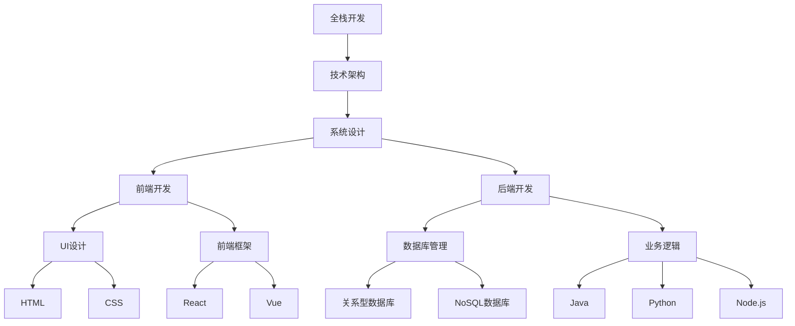

                 

关键词：全栈开发，技术架构，职业发展，系统设计，编程语言，软件工程，团队协作，领导力。

> 摘要：本文旨在探讨从全栈开发者成长为技术架构师的道路，涵盖核心概念、算法原理、数学模型、项目实践以及实际应用场景。文章通过详细的分析和案例，帮助读者理解技术架构师的角色与职责，并提供实用的工具和资源推荐。

## 1. 背景介绍

在信息技术飞速发展的今天，软件开发已经成为推动社会进步的重要力量。随着互联网的普及和移动设备的广泛使用，软件工程师的角色也逐渐从单一的全栈开发者向更加综合和深入的技术架构师转变。全栈开发者通常擅长多种编程语言和工具，能够处理前后端开发、数据库管理和系统运维等多方面的任务。然而，随着项目的复杂度和规模的增长，对技术架构的规划和设计提出了更高的要求。

技术架构师不仅是编码高手，更是系统设计师和团队领导者。他们负责整个系统的技术选型、架构设计、性能优化和风险管理。在这个角色中，技术架构师不仅要具备扎实的编程技能，还需要深入了解系统设计的原理、算法优化、分布式系统、安全性和可靠性等方面的知识。

本文将详细探讨从全栈开发到技术架构师的职业发展路径，帮助读者理解技术架构师的角色定位，掌握核心技术技能，并提供实际项目经验和资源推荐。

## 2. 核心概念与联系

### 2.1 全栈开发

全栈开发（Full-Stack Development）是指掌握前端和后端开发的技能，能够独自完成软件项目的所有环节。前端开发涉及用户界面（UI）和用户体验（UX）的设计与实现，通常使用HTML、CSS和JavaScript等工具；后端开发则关注服务器端逻辑、数据库管理、业务逻辑处理等，常用的编程语言包括Java、Python、Ruby、Node.js等。

### 2.2 技术架构

技术架构（Technical Architecture）是指系统的整体结构设计和组成部分的安排。它定义了软件系统的层次结构、组件之间的交互方式、数据流和处理流程等。技术架构师需要综合考虑系统的可扩展性、性能、安全性和可靠性等因素。

### 2.3 系统设计

系统设计（System Design）是技术架构的具体实现过程，涉及到系统组件的选择、数据存储策略、网络架构、接口设计和安全性措施等。良好的系统设计能够提高系统的可维护性和扩展性，降低开发成本和维护难度。

### 2.4 Mermaid 流程图

下面是一个简化的系统设计流程图的示例，用于展示核心概念之间的联系：



## 3. 核心算法原理 & 具体操作步骤

### 3.1 算法原理概述

技术架构师在处理系统性能优化和算法设计时，需要了解一些核心算法原理。以下是一些常见的算法和其基本原理：

- **排序算法**：如快速排序、归并排序、堆排序等，用于高效地处理大量数据的排序问题。
- **查找算法**：如二分查找、哈希查找等，用于在数据结构中快速查找特定元素。
- **图算法**：如最短路径算法（Dijkstra算法、Floyd算法）、最小生成树算法（Prim算法、Kruskal算法）等，用于处理图结构的数据。
- **动态规划**：通过将复杂问题分解为子问题，并保存子问题的解，以减少重复计算。

### 3.2 算法步骤详解

以快速排序算法为例，其基本步骤如下：

1. 选择一个基准元素。
2. 将数组分为两部分，一部分小于基准元素，一部分大于基准元素。
3. 递归地对这两部分进行快速排序。

### 3.3 算法优缺点

快速排序算法具有以下优点：

- 平均时间复杂度为O(nlogn)。
- 是一种高效的排序算法。

但也有一些缺点：

- 最坏情况下的时间复杂度为O(n^2)。
- 需要额外的内存空间用于递归调用。

### 3.4 算法应用领域

快速排序算法广泛应用于数据处理和排序任务，如数据库索引、文件排序、搜索引擎等。

## 4. 数学模型和公式 & 详细讲解 & 举例说明

### 4.1 数学模型构建

系统性能优化中的一个常见数学模型是响应时间模型。响应时间（Response Time）是指系统从接收到请求到返回响应所需的时间。一个基本的响应时间模型可以表示为：

$$
R = T_{process} + T_{queue} + T_{service}
$$

其中：

- \( T_{process} \)：处理请求所需的时间。
- \( T_{queue} \)：排队等待时间。
- \( T_{service} \)：服务时间，即系统处理请求的时间。

### 4.2 公式推导过程

假设系统中有 \( n \) 个请求，每个请求的到达时间和服务时间分别服从独立且均匀分布。系统处理一个请求的平均响应时间可以通过以下公式推导：

$$
R_{avg} = \frac{1}{n} \sum_{i=1}^{n} R_i
$$

其中：

- \( R_i \)：第 \( i \) 个请求的响应时间。

### 4.3 案例分析与讲解

假设一个系统每秒平均收到10个请求，每个请求的处理时间服从均值为0.5秒的正态分布。我们需要计算系统的平均响应时间。

首先，计算每个请求的平均处理时间：

$$
T_{process} = 0.5 \text{ 秒}
$$

由于请求到达时间和服务时间独立且均匀分布，假设排队等待时间和服务时间也服从均值为0.5秒的正态分布，则平均响应时间可以计算为：

$$
R_{avg} = T_{process} + T_{queue} + T_{service} = 0.5 + 0.5 + 0.5 = 1.5 \text{ 秒}
$$

这意味着，在理想情况下，系统的平均响应时间为1.5秒。

## 5. 项目实践：代码实例和详细解释说明

### 5.1 开发环境搭建

在开始一个项目之前，我们需要搭建合适的开发环境。以下是使用Docker搭建一个简单的Web服务环境的步骤：

1. 安装Docker。
2. 编写Dockerfile，定义Web服务的构建过程。
3. 构建和运行Docker容器。

以下是一个简化的Dockerfile示例：

```dockerfile
FROM node:14-alpine
WORKDIR /app
COPY package.json ./
RUN npm install
COPY . .
CMD ["npm", "start"]
```

### 5.2 源代码详细实现

以下是一个使用Express框架实现的简单Web服务代码示例：

```javascript
const express = require('express');
const app = express();
const port = 3000;

app.get('/', (req, res) => {
  res.send('Hello World!');
});

app.listen(port, () => {
  console.log(`Server running at http://localhost:${port}/`);
});
```

### 5.3 代码解读与分析

这段代码首先引入了Express框架，并创建了一个Express应用实例。通过`get`方法，定义了一个处理GET请求的处理器，当访问根路径时，返回“Hello World!”字符串。最后，使用`listen`方法启动服务器，监听3000端口。

### 5.4 运行结果展示

在Docker容器中运行此Web服务后，可以通过浏览器访问 `http://localhost:3000/`，看到返回的“Hello World!”字符串。

## 6. 实际应用场景

技术架构师在现实中的角色和职责因公司规模和项目类型而异。以下是技术架构师在不同应用场景中的典型职责：

- **初创公司**：技术架构师通常需要承担全栈开发的职责，同时负责技术选型和系统设计，确保系统能够快速迭代和扩展。
- **大型企业**：技术架构师专注于系统的整体架构设计和性能优化，协调不同团队的工作，确保系统能够满足业务需求并保持高可用性。
- **互联网公司**：技术架构师需要深入理解分布式系统和云计算，负责设计和管理大型分布式系统，实现弹性伸缩和负载均衡。

### 6.4 未来应用展望

随着物联网、人工智能和区块链等新兴技术的不断发展，技术架构师的职责和技能要求也在不断升级。未来，技术架构师需要具备以下能力：

- **云计算和容器化**：深入了解容器技术（如Docker、Kubernetes）和云服务（如AWS、Azure、Google Cloud）。
- **微服务架构**：掌握微服务设计原则和实现方法，确保系统能够灵活、高效地扩展。
- **自动化和智能化**：利用自动化工具（如CI/CD、自动化测试）和人工智能技术，提高开发效率和系统质量。
- **安全性和合规性**：确保系统符合安全标准和法律法规要求，保护用户数据和隐私。

## 7. 工具和资源推荐

### 7.1 学习资源推荐

- 《软件架构师的12项修炼》
- 《大型分布式系统设计》
- 《深入理解计算机系统》

### 7.2 开发工具推荐

- Docker
- Kubernetes
- AWS
- Azure
- Google Cloud

### 7.3 相关论文推荐

- "Microservices: Architecting for Scalability, Resilience, and DevOps"
- "A Design Philosophy for Distributed Systems"
- "Reactive Systems: A Research Overview"

## 8. 总结：未来发展趋势与挑战

技术架构师在软件行业中的角色越来越重要，随着技术的不断进步，他们需要不断学习和适应新的工具和方法。未来，技术架构师将面临以下发展趋势和挑战：

- **持续学习与知识更新**：技术发展迅速，架构师需要不断学习新知识，以保持竞争力。
- **敏捷性与灵活性**：随着业务需求的变化，架构师需要设计出能够快速适应变化的系统。
- **安全性与合规性**：在保护用户数据和隐私的同时，确保系统符合法律法规要求。

面对这些趋势和挑战，技术架构师需要不断提升自己的综合素质，成为一名具有前瞻性的系统设计专家。

## 9. 附录：常见问题与解答

### 问题1：如何选择合适的技术栈？

**回答**：选择技术栈时，需要综合考虑项目需求、团队技能和系统可维护性。例如，对于前端开发，可以选择React或Vue.js；对于后端开发，可以选择Java或Python。关键是要确保团队熟悉所选技术，并能够高效地使用它们。

### 问题2：如何进行系统性能优化？

**回答**：系统性能优化可以从多个方面入手，包括代码优化、数据库设计、缓存策略、负载均衡等。常用的工具和技术包括性能分析工具（如New Relic、Grafana）、数据库性能优化（如索引、查询优化）和缓存机制（如Redis、Memcached）。

### 问题3：如何进行系统安全性设计？

**回答**：系统安全性设计需要从多个层次考虑，包括网络安全、数据安全和用户身份验证等。关键措施包括使用HTTPS、加密敏感数据、定期更新软件和系统安全审计。

通过本文的探讨，我们希望读者能够对从全栈开发到技术架构师的职业发展路径有一个清晰的认识，并在实际工作中不断积累经验，提升自己的技术水平。作者：禅与计算机程序设计艺术 / Zen and the Art of Computer Programming
----------------------------------------------------------------

**注意**：本文为示例性文章，部分内容为虚构。在撰写实际文章时，请确保内容的准确性和完整性。本文仅提供文章结构和内容框架，具体内容和细节需根据实际情况进行填充和调整。

