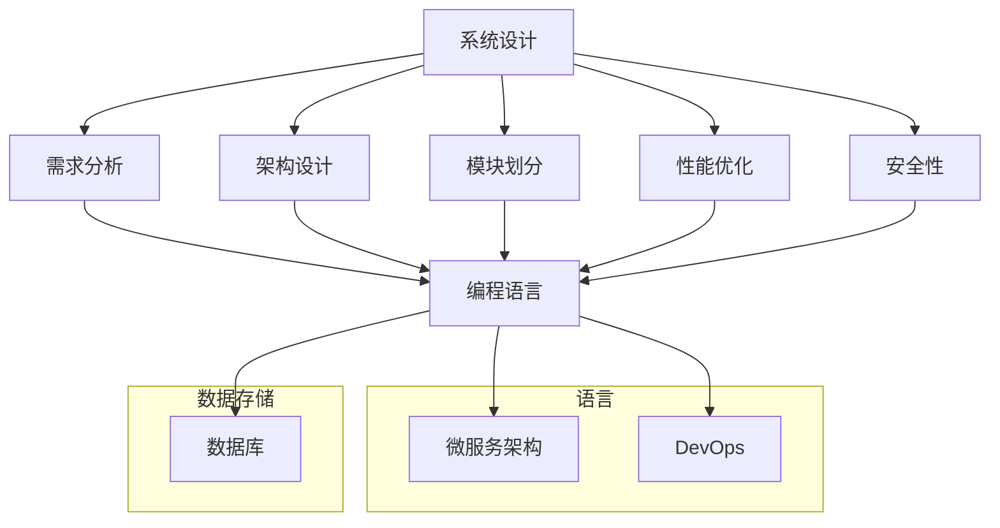

                 

关键词：全栈开发，技术架构师，职业进阶，技术领导力，系统设计，编程语言，架构设计，软件工程

摘要：本文旨在探讨全栈开发者在技术职业发展路径上如何实现向技术架构师的转型。通过深入分析全栈开发者的技能栈，核心问题解决能力，以及架构设计的原理和方法，本文为读者提供了一条清晰的职业进阶路线，并展望了技术架构师未来可能面临的挑战与机遇。

## 1. 背景介绍

在当今的IT行业中，全栈开发者是一个热门且备受推崇的职位。他们能够掌握前端、后端以及数据库等多个技术领域的知识，具备开发复杂系统的能力。然而，随着企业对软件系统复杂性要求的不断提高，全栈开发者往往面临着技能深度与广度之间的平衡问题。在这一背景下，技术架构师的职位应运而生，成为许多全栈开发者职业发展的下一个目标。

技术架构师不仅需要掌握多种编程语言和系统设计知识，还必须具备系统化的思维，能够从整体上把握软件系统的构建和运行。他们承担着系统设计、性能优化、安全防护等关键任务，是企业技术创新的核心推动力量。因此，从全栈开发者到技术架构师的进阶，不仅是对个人技能的提升，更是对职业角色和责任的转变。

本文将围绕以下主题展开：

1. 全栈开发者与技术架构师的角色差异
2. 技术架构师的核心能力与素质
3. 架构设计的原理与方法
4. 从全栈开发到技术架构师的具体进阶路径
5. 未来发展趋势与挑战

通过以上内容的深入探讨，本文希望能够为全栈开发者提供一条清晰的职业进阶路线，并激发他们对技术架构师角色的兴趣和追求。

## 2. 核心概念与联系

在深入探讨技术架构师的角色之前，有必要明确一些核心概念，这些概念不仅构成了技术架构师的知识体系，也是其工作的基础。

### 2.1. 系统设计

系统设计是指根据业务需求和约束，定义系统组件及其相互关系的活动。它包括以下几个方面：

- **需求分析**：理解并明确系统的业务需求，包括功能性和非功能性需求。
- **架构设计**：确定系统的整体架构，包括组件、接口、数据流和交互模式。
- **模块划分**：将系统划分为可管理的模块，以便于开发、测试和维护。
- **性能优化**：确保系统在高负载下仍能保持良好的性能和响应速度。
- **安全性**：设计系统的安全机制，防止外部攻击和数据泄露。

### 2.2. 编程语言

编程语言是软件开发的基本工具。不同的编程语言有其特定的应用场景和优势。常见的前端编程语言包括JavaScript、HTML、CSS等，而后端编程语言则包括Java、Python、Go、Ruby等。技术架构师需要熟悉多种编程语言，以便在不同场景下选择最适合的语言。

### 2.3. 数据库

数据库是存储和管理数据的核心组件。关系型数据库（如MySQL、PostgreSQL）和NoSQL数据库（如MongoDB、Redis）各有其特点和应用场景。技术架构师需要根据业务需求选择合适的数据库，并进行优化以提升性能。

### 2.4. 微服务架构

微服务架构是一种将应用程序拆分为多个独立服务的架构风格。每个服务都可以独立开发、部署和扩展，从而提高了系统的灵活性和可维护性。技术架构师需要了解微服务架构的设计原则和实施方法。

### 2.5. DevOps

DevOps是一种结合软件开发（Dev）和运维（Ops）的方法，旨在通过自动化和协作来提高软件交付的速度和可靠性。技术架构师需要掌握DevOps工具和流程，以实现高效的软件开发和运维。

### 2.6. Mermaid 流程图

为了更好地理解这些概念之间的关系，我们可以使用Mermaid流程图来展示它们：



通过上述流程图，我们可以清晰地看到系统设计、编程语言、数据库、微服务架构和DevOps之间的相互关系，以及它们共同构成了技术架构师所需的知识体系。

## 3. 核心算法原理 & 具体操作步骤

### 3.1 算法原理概述

在软件系统的设计过程中，算法扮演着至关重要的角色。算法原理决定了系统的性能、可扩展性和可靠性。以下是一些核心算法原理的概述：

- **排序算法**：用于对数据进行排序，常见的排序算法包括快速排序、归并排序、堆排序等。
- **查找算法**：用于在数据结构中查找特定元素，如二分查找、哈希查找等。
- **图算法**：用于处理图形数据结构，如Dijkstra算法用于最短路径查找，深度优先搜索和广度优先搜索用于路径搜索等。
- **动态规划**：用于解决最优子结构问题，通过递推关系求解复杂问题。

### 3.2 算法步骤详解

#### 快速排序

快速排序是一种高效的排序算法，其基本思想是通过递归分治策略将数据划分为较小的子集，然后对子集进行排序。

1. **选择基准元素**：从数组中随机选择一个元素作为基准。
2. **分区操作**：将数组划分为两部分，一部分是小于基准的元素，另一部分是大于基准的元素。
3. **递归排序**：对划分后的两个子集重复上述步骤，直到所有元素都被排序。

#### 二分查找

二分查找算法用于在有序数组中查找特定元素，其时间复杂度为O(log n)。

1. **确定范围**：初始范围是整个数组。
2. **计算中间值**：每次迭代计算当前范围的中间值。
3. **比较与调整范围**：如果中间值等于目标值，则查找成功；如果中间值大于目标值，则调整上限；如果中间值小于目标值，则调整下限。
4. **递归或循环**：重复上述步骤，直到找到目标值或确定目标值不存在。

### 3.3 算法优缺点

#### 快速排序

**优点**：

- **平均时间复杂度低**：O(n log n)。
- **内存占用较少**：无需额外的空间存储。

**缺点**：

- **最坏情况下性能较差**：O(n^2)，当输入数组基本有序时。
- **递归深度较大**：可能导致栈溢出。

#### 二分查找

**优点**：

- **时间复杂度低**：O(log n)。
- **适用于大量数据**：高效地查找大型数据集。

**缺点**：

- **仅适用于有序数据**：需要额外的排序步骤。
- **不适用于动态数据**：每次查找后数据可能发生变化。

### 3.4 算法应用领域

#### 快速排序

- **数据库索引**：用于优化数据库查询性能。
- **算法竞赛**：常见的算法题目解决方案。
- **文件排序**：用于排序大量文件。

#### 二分查找

- **搜索引擎**：用于快速定位关键词。
- **排序算法**：用于辅助实现快速排序。
- **数值计算**：用于查找特定数值。

## 4. 数学模型和公式 & 详细讲解 & 举例说明

### 4.1 数学模型构建

在软件系统设计过程中，数学模型和公式是不可或缺的工具。以下将介绍几个常见的数学模型和公式，并解释其应用场景。

#### 数据库索引

- **B树**：用于数据库索引，支持快速查找和插入。其公式为：
  $$ n = \frac{m-1}{2} $$
  其中，$n$ 是节点中元素的数量，$m$ 是每个节点的最大元素数量。

#### 排序算法

- **归并排序**：用于高效地排序数据，其时间复杂度为：
  $$ T(n) = 2T(\frac{n}{2}) + n $$
  其中，$T(n)$ 是排序所需的时间。

### 4.2 公式推导过程

以下以归并排序为例，解释其时间复杂度的推导过程。

#### 归并排序

假设有一个数组 $A$，其长度为 $n$。归并排序的基本思想是将数组分为两个子数组，分别进行排序，然后将结果合并。

1. **划分阶段**：将数组 $A$ 划分为两个子数组 $A_1$ 和 $A_2$，分别长度为 $\frac{n}{2}$。
2. **递归排序**：分别对 $A_1$ 和 $A_2$ 进行归并排序。
3. **合并阶段**：将已排序的子数组 $A_1$ 和 $A_2$ 合并为一个有序数组。

假设子数组 $A_1$ 和 $A_2$ 的排序时间分别为 $T_1$ 和 $T_2$，则总排序时间 $T(n)$ 可表示为：
$$ T(n) = T_1 + T_2 + n $$
根据递归关系，有：
$$ T_1 = T(\frac{n}{2}) $$
$$ T_2 = T(\frac{n}{2}) $$
代入总排序时间公式，得到：
$$ T(n) = 2T(\frac{n}{2}) + n $$
使用主定理，可以推导出归并排序的时间复杂度为：
$$ T(n) = O(n \log n) $$

### 4.3 案例分析与讲解

以下通过一个实际案例，分析如何使用数学模型和公式进行系统设计。

#### 案例背景

一个电子商务平台需要支持每天数百万笔交易的存储和查询。为了满足性能要求，平台采用了分布式数据库架构，使用了B树索引来优化查询性能。

#### 案例步骤

1. **需求分析**：确定平台需要支持的主要功能，如商品信息查询、订单查询等。
2. **数据库设计**：设计数据库表结构，包括商品表、订单表等。
3. **索引设计**：为商品表和订单表创建B树索引，以优化查询性能。
4. **性能优化**：根据数据量和使用场景，调整索引节点数量，优化查询速度。

#### 数学模型应用

- **B树节点数量**：根据平台每天的交易量，可以估算出每个节点需要存储的元素数量，使用公式：
  $$ n = \frac{m-1}{2} $$
  其中，$m$ 为节点最大元素数量，$n$ 为节点中元素数量。

- **查询性能优化**：根据查询频率和查询模式，调整索引结构，使用公式：
  $$ T(n) = O(\log n) $$
  其中，$T(n)$ 为查询时间，$n$ 为数据量。

通过上述步骤，电子商务平台能够实现高效的数据存储和查询，满足大规模交易处理需求。

## 5. 项目实践：代码实例和详细解释说明

### 5.1 开发环境搭建

在开始项目实践之前，我们需要搭建一个开发环境。以下是搭建过程：

1. **安装操作系统**：选择Linux或macOS操作系统，推荐使用Ubuntu 20.04。
2. **安装编程语言**：安装Python 3.8及以上版本，可以使用包管理器如apt-get或brew进行安装。
3. **安装数据库**：安装MySQL 8.0或MongoDB 4.0，同样可以使用包管理器进行安装。
4. **安装开发工具**：安装IDE（如Visual Studio Code）和版本控制工具（如Git）。

### 5.2 源代码详细实现

以下是一个简单的Web应用程序示例，使用Python的Flask框架实现。

```python
from flask import Flask, jsonify, request

app = Flask(__name__)

@app.route('/api/products', methods=['GET'])
def get_products():
    # 从数据库获取商品列表
    products = get_products_from_db()
    return jsonify(products)

@app.route('/api/products', methods=['POST'])
def add_product():
    product = request.get_json()
    # 将商品添加到数据库
    add_product_to_db(product)
    return jsonify({"message": "Product added successfully"}), 201

def get_products_from_db():
    # 实现从数据库获取商品列表的函数
    # 此处使用MongoDB作为示例
    from pymongo import MongoClient
    client = MongoClient('mongodb://localhost:27017/')
    db = client['eCommerce']
    collection = db['products']
    products = list(collection.find())
    return products

def add_product_to_db(product):
    # 实现将商品添加到数据库的函数
    from pymongo import MongoClient
    client = MongoClient('mongodb://localhost:27017/')
    db = client['eCommerce']
    collection = db['products']
    collection.insert_one(product)
```

### 5.3 代码解读与分析

以上代码实现了两个API接口：一个用于获取商品列表，另一个用于添加新商品。

- **API接口定义**：使用Flask框架定义了两个路由，一个用于处理GET请求，一个用于处理POST请求。
- **数据库操作**：通过MongoDB的Python驱动，实现了从数据库获取商品列表和添加商品的函数。
- **数据模型**：商品数据以JSON格式存储，包括商品ID、名称、价格等信息。

### 5.4 运行结果展示

在本地开发环境中，可以使用以下命令启动Flask应用程序：

```bash
$ flask run
```

启动后，可以通过浏览器或Postman等工具访问API接口：

- **获取商品列表**：
  ```
  GET http://localhost:5000/api/products
  ```
  返回结果为JSON格式的商品列表。

- **添加新商品**：
  ```
  POST http://localhost:5000/api/products
  Content-Type: application/json

  {
      "id": "1001",
      "name": "Product 1",
      "price": 99.99
  }
  ```
  返回结果为添加成功的消息。

通过以上代码实例，我们展示了如何使用Python和Flask框架快速搭建一个简单的Web应用程序，并实现基本的数据库操作。这对于理解Web应用程序的基本结构和开发流程非常有帮助。

## 6. 实际应用场景

技术架构师的工作不仅仅局限于理论知识和算法原理，还需要将其应用于实际场景中，解决复杂的实际问题。以下是一些常见的技术架构应用场景：

### 6.1 大型电商平台

在大型电商平台上，技术架构师需要设计可扩展、高性能和高可用性的系统架构。这包括：

- **分布式数据库**：采用如MySQL、MongoDB等分布式数据库，确保数据的高可用性和读写性能。
- **微服务架构**：将系统拆分为多个微服务，每个微服务负责不同的业务功能，如商品管理、订单处理、用户管理等。
- **负载均衡**：使用如Nginx、HAProxy等负载均衡器，将用户请求分配到多个服务器上，提高系统的响应速度和可用性。
- **缓存机制**：使用Redis等缓存系统，减少数据库的负载，提高查询速度。

### 6.2 金融风控系统

金融风控系统需要实时处理大量数据，并对交易进行风险监控和决策。技术架构师需要实现以下功能：

- **实时数据处理**：使用如Apache Kafka等消息队列系统，实现实时数据流的处理和传输。
- **大数据分析**：利用如Hadoop、Spark等大数据处理框架，对历史数据进行分析和挖掘，识别潜在风险。
- **风险管理算法**：实现如机器学习算法，对交易进行风险评估，并实时调整风控策略。
- **高可用性设计**：确保系统在极端情况下仍能正常运行，如通过主从复制、负载均衡等技术确保服务的持续可用。

### 6.3 社交网络平台

社交网络平台需要处理海量的用户交互数据，并保证用户隐私和数据安全。技术架构师需要考虑以下方面：

- **数据存储与检索**：使用如MongoDB、Cassandra等NoSQL数据库，存储和检索用户数据。
- **消息推送**：使用如Pusher、WebSocket等技术，实现实时消息推送，提高用户体验。
- **社交图谱**：利用图数据库，构建用户的社交关系图谱，支持复杂的社交网络分析。
- **数据安全**：实现加密、访问控制等技术，确保用户数据的安全性和隐私。

### 6.4 物联网平台

物联网平台需要处理大量设备的实时数据，并实现设备的远程监控和管理。技术架构师需要设计以下架构：

- **设备连接与通信**：使用MQTT、CoAP等物联网通信协议，实现设备的连接和数据传输。
- **数据处理与存储**：使用如InfluxDB、TimescaleDB等时间序列数据库，存储设备的实时数据。
- **数据分析与预测**：利用机器学习和数据分析技术，对设备数据进行预测和分析，优化设备管理和维护。
- **边缘计算**：在设备附近部署边缘计算节点，减少数据传输延迟，提高系统响应速度。

通过以上实际应用场景的介绍，我们可以看到技术架构师的工作内容和技术要求是多样化的，需要全面掌握各种技术工具和架构设计方法，以应对不同业务场景的需求。

### 6.5 未来应用展望

在未来的技术发展中，技术架构师的角色将变得更加重要和多样化。随着新技术的不断涌现，架构设计的方法也将不断演进，以下是几个未来可能的应用趋势：

#### 6.5.1 云原生架构

随着云计算的普及，云原生架构将成为技术架构师的重要研究领域。云原生架构强调应用程序在云环境中的最佳实践，包括微服务、容器化、自动化部署和运维等。技术架构师需要熟悉如Kubernetes、Docker等容器编排工具，并掌握云服务提供商（如AWS、Azure、Google Cloud）提供的丰富云服务，以实现高效、弹性和可靠的应用部署。

#### 6.5.2 边缘计算

随着物联网和5G技术的发展，边缘计算将得到广泛应用。边缘计算将数据处理和计算能力从中心云转移到网络边缘，以降低延迟、减少带宽使用并提高系统的响应速度。技术架构师需要设计分布式系统架构，将中心云和边缘计算节点有机结合，确保数据的高效处理和服务的实时响应。

#### 6.5.3 人工智能与机器学习

人工智能和机器学习技术将继续深化对业务流程的改造。技术架构师需要将AI算法融入现有系统，实现智能化的业务决策和优化。例如，通过机器学习模型优化推荐系统、智能客服和自动化运维等。此外，技术架构师还需要关注AI算法的可解释性和透明度，确保系统在应用AI技术时符合法规和伦理要求。

#### 6.5.4 跨领域集成

未来的技术架构师将面临更多跨领域集成和融合的任务。例如，在健康医疗领域，技术架构师需要将电子病历、基因组数据和人工智能技术相结合，为患者提供个性化的医疗服务。在智能制造领域，技术架构师需要将物联网、大数据和自动化生产系统整合，实现智能化制造和优化生产流程。

#### 6.5.5 安全性与隐私保护

随着数据规模的不断扩大和业务复杂度的增加，安全性与隐私保护将成为技术架构师的重要职责。技术架构师需要设计安全的系统架构，包括数据加密、访问控制、身份认证等。同时，随着GDPR等隐私保护法规的实施，技术架构师需要确保系统的隐私保护机制符合相关法规要求，防止数据泄露和滥用。

通过以上展望，我们可以看到技术架构师未来的发展将充满挑战和机遇。他们需要不断学习新技术、掌握新工具，并具备系统化的思维和全局观，以应对日益复杂的技术环境和业务需求。

## 7. 工具和资源推荐

在职业发展过程中，掌握正确的工具和资源对于技术架构师来说至关重要。以下是一些建议，涵盖学习资源、开发工具和相关论文，以帮助全栈开发者顺利实现向技术架构师的转变。

### 7.1 学习资源推荐

1. **在线课程和讲座**：Coursera、edX和Udacity等在线教育平台提供了丰富的计算机科学和软件工程课程，涵盖从基础编程到高级系统架构的各个方面。
2. **技术博客和社区**：如GitHub、Stack Overflow、Reddit和Medium等技术社区，是学习和交流的好去处。在这些平台上，开发者可以找到最新的技术动态、解决方案和最佳实践。
3. **专业书籍**：《设计数据密集型应用程序》（Design Data-Intensive Applications）、《大型分布式系统设计》（Designing Data-Intensive Applications）和《系统架构：企业级应用开发指南》（System Architecture: A Pragmatic Approach）等经典书籍，是深入学习系统架构设计的必备资源。

### 7.2 开发工具推荐

1. **集成开发环境（IDE）**：Visual Studio Code、IntelliJ IDEA和Eclipse等IDE提供了强大的代码编辑、调试和测试功能，适合多种编程语言开发。
2. **版本控制**：Git和GitLab等版本控制工具，用于代码的版本管理和协作开发。
3. **数据库**：MySQL、PostgreSQL和MongoDB等关系型和非关系型数据库，根据业务需求选择合适的数据库进行数据存储和管理。
4. **容器化工具**：Docker和Kubernetes等容器化工具，用于简化应用程序的部署和运维。
5. **监控与日志分析**：Prometheus、Grafana和ELK Stack（Elasticsearch、Logstash、Kibana）等工具，用于实时监控和日志分析，确保系统的稳定运行。

### 7.3 相关论文推荐

1. **微服务架构**：《Microservices: A Conceptual Analysis》（微服务：概念分析）等论文，详细探讨了微服务架构的设计原则和实现方法。
2. **云计算与容器化**：《The Case for Microservices》（微服务案例）和《Docker: Lightweight Containers for Developers》（Docker：开发者轻量级容器）等论文，介绍了云计算和容器化技术的应用和优势。
3. **大数据与机器学习**：《Bigtable: A Distributed Storage System for Structured Data》（Bigtable：一种用于结构化数据的分布式存储系统）和《An Introduction to Machine Learning》（机器学习简介）等论文，探讨了大数据处理和机器学习技术的最新进展。

通过充分利用上述工具和资源，技术架构师可以不断提升自己的专业能力，更好地应对复杂的技术挑战和业务需求。

## 8. 总结：未来发展趋势与挑战

在从全栈开发者向技术架构师的职业进阶过程中，我们看到了技术领域不断发展的趋势和面临的挑战。以下是对未来发展趋势和挑战的总结：

### 8.1 研究成果总结

1. **多学科交叉**：技术架构师需要具备多学科的知识，包括计算机科学、数据科学、软件工程、网络技术等，这种交叉学科的趋势将继续加强。
2. **云原生与容器化**：随着云计算和容器化技术的发展，云原生架构将成为技术架构设计的主流方向，如Kubernetes等容器编排工具的应用日益广泛。
3. **自动化与智能化**：自动化工具和人工智能技术的结合，将提高系统的部署、运维和优化效率，如DevOps和AI/ML在系统优化中的应用。

### 8.2 未来发展趋势

1. **边缘计算**：随着物联网和5G技术的普及，边缘计算将成为重要的发展趋势，网络边缘的数据处理和计算能力将得到提升。
2. **分布式系统**：分布式系统的设计和管理将更加复杂和多样化，如何保证分布式系统的可靠性、高性能和高可用性将成为技术架构师的重要课题。
3. **数据安全和隐私**：随着数据规模的不断扩大和数据泄露事件的频发，数据安全和隐私保护将成为技术架构师的核心关注点。

### 8.3 面临的挑战

1. **技术复杂度**：随着技术的发展，系统的复杂度不断增加，如何有效地管理和优化复杂系统将成为技术架构师的巨大挑战。
2. **持续学习**：技术更新速度快，技术架构师需要不断学习新的技术、工具和架构设计方法，以保持竞争力。
3. **跨领域融合**：技术架构师需要具备跨领域的知识，如健康医疗、智能制造等，如何有效地整合跨领域技术资源，实现业务创新，是一个重要挑战。

### 8.4 研究展望

1. **系统架构自动化**：未来系统架构设计将更加自动化，利用AI和机器学习技术实现自动化的架构优化和部署。
2. **可持续性**：随着可持续发展的需求，技术架构师需要考虑系统设计中的环境保护和社会责任，实现绿色IT。
3. **用户体验**：技术架构师需要关注用户体验，通过智能化和个性化设计，提供更优质的用户体验。

通过以上总结，我们可以看到，从全栈开发者到技术架构师的进阶，不仅是技能的提升，更是对全局观、系统思维和创新能力的挑战。未来，技术架构师将在推动技术进步、业务创新和可持续发展中发挥关键作用。

## 9. 附录：常见问题与解答

### 9.1 从全栈开发者到技术架构师，需要掌握哪些核心技能？

**回答**：从全栈开发者到技术架构师，需要掌握以下核心技能：

- **多编程语言**：熟悉多种编程语言，如Java、Python、Go等。
- **系统设计能力**：能够从整体上把握系统的架构设计，包括模块划分、性能优化和安全性设计。
- **数据库管理**：熟悉关系型和非关系型数据库，如MySQL、PostgreSQL、MongoDB等。
- **架构设计原理**：了解微服务架构、分布式系统设计、DevOps等架构设计方法。
- **项目管理**：具备项目管理能力，能够管理复杂的软件项目。
- **沟通与协作**：良好的沟通与协作能力，能够与团队成员和业务部门有效沟通。

### 9.2 技术架构师在项目中的角色是什么？

**回答**：技术架构师在项目中的角色通常包括：

- **系统规划**：根据业务需求，制定系统的整体规划和设计。
- **技术选型**：选择合适的编程语言、数据库和框架，以实现高效和可扩展的系统。
- **性能优化**：优化系统性能，确保在高负载下仍能保持良好的响应速度。
- **安全性设计**：设计系统的安全机制，防止数据泄露和外部攻击。
- **项目协调**：协调开发团队和其他相关团队，确保项目按时按质完成。
- **持续改进**：根据项目进展和反馈，不断优化和改进系统设计。

### 9.3 如何提升自己的技术架构能力？

**回答**：以下方法可以帮助提升技术架构能力：

- **学习新技术**：关注技术趋势，不断学习新的编程语言、框架和工具。
- **实践项目**：参与实际项目，通过实践提升系统设计和架构能力。
- **阅读经典书籍**：阅读《设计数据密集型应用程序》、《大型分布式系统设计》等经典书籍，深入了解系统架构设计原理。
- **参加培训课程**：参加在线课程和培训班，系统性地学习技术架构知识。
- **交流与分享**：加入技术社区，与其他开发者交流，分享经验和见解。
- **持续学习**：保持好奇心和求知欲，持续学习新技术和最佳实践。

通过以上常见问题与解答，我们希望能帮助读者更好地理解从全栈开发者到技术架构师的职业进阶路径，以及如何提升自身的架构设计能力。

