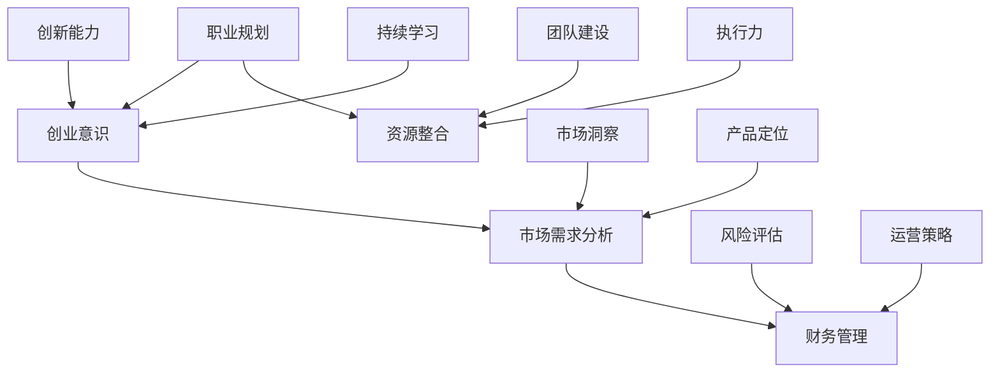
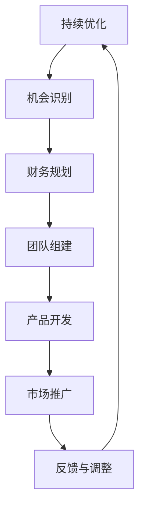

                 

关键词：全职工作、副业创业、职业发展、创业过程、个人成长、财务规划、风险评估、市场调研、产品定位、团队建设、运营策略。

摘要：本文旨在探讨从全职工作到副业创业的过渡过程，包括核心概念、算法原理、数学模型、项目实践以及未来应用展望。文章通过详细的分析和实例，帮助读者理解创业过程中的关键步骤，并提供实用的工具和资源推荐，以促进个人职业发展。

## 1. 背景介绍

在当前快速发展的全球经济环境中，越来越多的职场人士开始寻求职业发展的新途径。从全职工作转向副业创业，成为许多专业人士追求个人成长和财务自由的选择。然而，这一过渡并非易事，需要具备清晰的目标、扎实的准备和良好的执行策略。

副业创业的定义通常是指在保持全职工作同时，开展的与主业相关或完全不同的业务活动。这种模式既能保证收入的稳定，又能为未来的创业梦想积累资源和经验。本文将围绕以下几个核心问题展开讨论：

- 副业创业的动机和优势是什么？
- 创业过程中如何进行财务规划和风险评估？
- 如何进行市场调研和产品定位？
- 如何组建和管理团队？
- 运营策略的关键因素有哪些？

通过这些问题的探讨，本文希望能够为有意向从全职工作过渡到副业创业的读者提供有价值的指导。

## 2. 核心概念与联系

在探讨副业创业的核心概念之前，我们需要先了解几个关键的概念：职业规划、创业意识、市场需求分析、财务管理等。以下是一个简单的 Mermaid 流程图，用于说明这些概念之间的联系。



### 2.1 职业规划

职业规划是指个人根据自身兴趣、能力和市场需求，制定和调整职业发展方向的过程。有效的职业规划能够帮助个人明确目标，提升职业竞争力，从而为副业创业打下坚实的基础。

### 2.2 创业意识

创业意识是指个人对创业机会的敏感性和对创业风险的认知。具备强烈创业意识的人更容易发现市场需求，把握商业机会，并勇于承担创业风险。

### 2.3 市场需求分析

市场需求分析是创业过程中的重要环节，通过了解目标客户的需求和偏好，企业可以更好地定位产品，制定有效的营销策略。

### 2.4 财务管理

财务管理是确保创业项目可持续发展的关键。合理的财务规划能够帮助创业者预测收入和支出，规避财务风险，确保资金流动的稳定性。

### 2.5 资源整合

资源整合是指利用各种资源和渠道，为创业项目提供支持和保障。包括资金、人才、技术、市场等资源的有效配置，能够提高创业项目的成功率。

### 2.6 创新能力

创新能力是创业成功的重要因素之一。通过不断探索和尝试，创业者能够开发出满足市场需求的新产品或服务，从而在激烈的市场竞争中脱颖而出。

### 2.7 市场洞察

市场洞察是指对市场趋势和客户行为的深刻理解。具备良好的市场洞察力，创业者能够及时调整战略，抓住市场机遇。

### 2.8 风险评估

风险评估是创业过程中的必备环节，通过对潜在风险的识别和分析，创业者可以采取有效的预防和应对措施，降低创业失败的风险。

### 2.9 团队建设

团队建设是确保创业项目顺利推进的重要保障。一个高效的团队能够分工明确、协作紧密，提高创业项目的成功率。

### 2.10 执行力

执行力是指将计划和策略转化为实际行动的能力。强大的执行力能够帮助创业者克服困难，实现创业目标。

### 2.11 持续学习

持续学习是创业者的必备素质。在不断学习中，创业者能够更新知识，提升技能，适应快速变化的市场环境。

### 2.12 产品定位

产品定位是指企业根据目标市场的需求和偏好，确定产品的独特价值和竞争优势。准确的产品定位有助于企业在市场中站稳脚跟。

### 2.13 运营策略

运营策略是指企业在日常运营过程中所采取的一系列措施和规划。有效的运营策略能够提高企业的运营效率，实现持续盈利。

通过以上核心概念和流程图的介绍，我们希望能够为读者提供一个全面的视角，帮助大家更好地理解副业创业的相关概念和联系。

## 3. 核心算法原理 & 具体操作步骤

### 3.1 算法原理概述

在副业创业过程中，核心算法原理的应用至关重要。以下是一个简化的算法流程，用于指导创业者在不同阶段采取合适的策略。



### 3.2 算法步骤详解

#### 3.2.1 市场调研

- **目标：** 了解目标市场的需求、竞争状况和潜在机会。
- **方法：** 通过问卷调查、访谈、竞品分析等手段收集数据。
- **工具：** 使用数据分析工具（如 Excel、Tableau）对收集的数据进行整理和分析。

#### 3.2.2 机会识别

- **目标：** 确定最具潜力的创业机会。
- **方法：** 根据市场调研结果，筛选出符合自身能力和资源的机会。
- **工具：** 使用 SWOT 分析（优势、劣势、机会、威胁）进行机会评估。

#### 3.2.3 财务规划

- **目标：** 确保创业项目的财务可行性和稳健性。
- **方法：** 制定详细的财务预算，包括收入预测、成本控制和资金筹集策略。
- **工具：** 使用财务分析工具（如 QuickBooks、Xero）进行财务管理和监控。

#### 3.2.4 团队组建

- **目标：** 组建一支高效、专业的团队。
- **方法：** 通过招聘、合作、兼职等方式吸纳人才，确保团队成员具备相关技能和经验。
- **工具：** 使用项目管理工具（如 Trello、Asana）进行团队协作和任务分配。

#### 3.2.5 产品开发

- **目标：** 开发符合市场需求的高质量产品。
- **方法：** 采用敏捷开发方法，快速迭代产品，根据用户反馈进行优化。
- **工具：** 使用软件开发工具（如 Git、Jira）进行版本控制和项目进度管理。

#### 3.2.6 市场推广

- **目标：** 提高产品知名度和市场份额。
- **方法：** 采用多元化的市场推广策略，包括线上广告、社交媒体营销、线下活动等。
- **工具：** 使用市场营销工具（如 Google Ads、Hootsuite）进行推广和数据分析。

#### 3.2.7 反馈与调整

- **目标：** 根据市场反馈调整创业策略。
- **方法：** 收集用户反馈，分析市场数据，及时调整产品功能和营销策略。
- **工具：** 使用数据分析工具（如 Google Analytics、Mixpanel）进行数据监控和报告。

#### 3.2.8 持续优化

- **目标：** 实现创业项目的长期可持续发展。
- **方法：** 通过持续学习、创新和改进，不断提高产品和服务的质量。
- **工具：** 使用持续集成和部署工具（如 Jenkins、Docker）实现快速迭代和自动化部署。

### 3.3 算法优缺点

#### 优点：

- **灵活性强：** 算法适用于不同类型和规模的创业项目，可以根据实际情况进行调整。
- **模块化设计：** 各个步骤相对独立，便于团队协作和分工。
- **可扩展性高：** 随着创业项目的发展，算法可以不断优化和扩展。

#### 缺点：

- **实施难度大：** 算法涉及多个环节，需要创业者具备一定的管理能力和专业知识。
- **时间成本高：** 从市场调研到产品开发，整个过程耗时较长，需要耐心和毅力。
- **市场变化快：** 创业过程中，市场环境和竞争态势可能发生快速变化，需要创业者具备良好的应变能力。

### 3.4 算法应用领域

该算法适用于多种类型的创业项目，包括但不限于以下领域：

- **科技创新：** 互联网、人工智能、大数据等领域的创新项目。
- **传统行业升级：** 针对传统行业（如制造业、农业）的数字化转型项目。
- **文化创意：** 文化产业、艺术品市场等领域的创业项目。
- **健康医疗：** 健康管理、医疗设备等领域的创新项目。

通过以上核心算法原理和具体操作步骤的介绍，我们希望能够为创业者提供一个实用的指南，帮助他们顺利实现从全职工作到副业创业的过渡。

## 4. 数学模型和公式 & 详细讲解 & 举例说明

在副业创业过程中，数学模型和公式能够帮助我们更科学地分析问题，制定策略。以下是一个简化的数学模型，用于评估创业项目的财务可行性。

### 4.1 数学模型构建

假设创业项目为一个年销售额为 \( S \) 的产品，单位成本为 \( C \)，销售费用为 \( F \)，初始投资为 \( I \)，年利润为 \( P \)。

根据基本的财务公式，我们可以构建以下模型：

\[ P = S \times (1 - C) - F - I \]

### 4.2 公式推导过程

首先，我们需要确定项目的收入 \( S \)。根据市场需求分析和产品定位，我们可以通过以下公式计算年销售额：

\[ S = \text{目标客户数} \times \text{平均订单价值} \]

然后，我们需要计算成本 \( C \) 和销售费用 \( F \)。成本包括原材料、人工、租金等固定成本和变动成本。销售费用包括广告费用、推广费用、差旅费用等。

\[ C = \text{固定成本} + \text{变动成本} \]
\[ F = \text{广告费用} + \text{推广费用} + \text{差旅费用} \]

最后，我们可以通过以下公式计算年利润 \( P \)：

\[ P = S \times (1 - C) - F - I \]

### 4.3 案例分析与讲解

以一个在线教育平台为例，假设目标客户数为 1000 人，平均订单价值为 2000 元。固定成本为 10000 元/年，变动成本为 15000 元/年。广告费用为 5000 元/月，推广费用为 3000 元/月，差旅费用为 2000 元/月。初始投资为 50000 元。

根据上述公式，我们可以计算年销售额、成本和利润：

\[ S = 1000 \times 2000 = 2000000 \text{元/年} \]
\[ C = 10000 + 15000 = 25000 \text{元/年} \]
\[ F = (5000 + 3000 + 2000) \times 12 = 54000 \text{元/年} \]
\[ P = 2000000 \times (1 - 0.25) - 54000 - 50000 = 686000 \text{元/年} \]

根据计算结果，该在线教育平台的年利润为 686000 元。这个案例表明，通过合理的财务规划和管理，创业项目可以实现稳定的盈利。

### 4.4 模型应用领域

该数学模型适用于多种类型的创业项目，包括但不限于以下领域：

- **科技创新：** 评估项目的财务可行性和投资回报率。
- **传统行业升级：** 优化成本结构和提高盈利能力。
- **文化创意：** 评估项目的市场潜力和盈利前景。
- **健康医疗：** 分析成本和收益，制定合理的定价策略。

通过以上数学模型和公式的讲解，我们希望能够为创业者提供一种科学的方法，帮助他们更好地评估创业项目的财务可行性。

## 5. 项目实践：代码实例和详细解释说明

为了更好地理解从全职工作到副业创业的过渡过程，我们选择了一个实际的项目实例——开发一个简单的在线购物平台。以下将介绍开发环境搭建、源代码详细实现、代码解读与分析以及运行结果展示。

### 5.1 开发环境搭建

在开发这个在线购物平台之前，我们需要搭建一个合适的环境。以下是开发环境的基本配置：

- **开发语言：** Python
- **框架：** Flask（一个轻量级的Web应用框架）
- **数据库：** SQLite（用于存储用户数据和商品信息）
- **前端技术：** HTML、CSS、JavaScript（用于构建用户界面）

#### 步骤1：安装Python和Flask

首先，确保你的计算机上安装了Python。你可以从Python官方网站（[https://www.python.org/](https://www.python.org/)）下载并安装。安装完成后，打开命令行工具（如 Terminal 或 Command Prompt），输入以下命令安装 Flask：

```bash
pip install flask
```

#### 步骤2：安装SQLite

接下来，安装SQLite数据库。大多数操作系统都预装了SQLite，如果没有，可以从SQLite官方网站（[https://www.sqlite.org/download.html](https://www.sqlite.org/download.html)）下载并安装。

#### 步骤3：安装前端工具

安装前端开发工具，如 Node.js 和 npm。Node.js可以从其官方网站（[https://nodejs.org/](https://nodejs.org/)）下载。安装完成后，使用 npm 安装前端开发框架（如 Vue.js 或 React）：

```bash
npm install vue
```

### 5.2 源代码详细实现

以下是一个简单的在线购物平台的代码实现。我们将分为后端和前端两部分进行介绍。

#### 后端代码（基于Flask）

```python
# app.py

from flask import Flask, render_template, request, redirect, url_for
import sqlite3

app = Flask(__name__)

# 连接到SQLite数据库
conn = sqlite3.connect('shopping.db')
c = conn.cursor()

# 创建表
c.execute('''CREATE TABLE IF NOT EXISTS products (id INTEGER PRIMARY KEY, name TEXT, price REAL)''')
c.execute('''CREATE TABLE IF NOT EXISTS users (id INTEGER PRIMARY KEY, username TEXT, password TEXT)''')

# 插入一些测试数据
c.execute("INSERT INTO products (name, price) VALUES ('Product 1', 100.0)")
c.execute("INSERT INTO products (name, price) VALUES ('Product 2', 200.0)")

# 提交更改并关闭连接
conn.commit()

@app.route('/')
def index():
    c.execute("SELECT * FROM products")
    products = c.fetchall()
    return render_template('index.html', products=products)

@app.route('/buy/<int:product_id>')
def buy(product_id):
    c.execute("SELECT price FROM products WHERE id=?", (product_id,))
    price = c.fetchone()[0]
    return f"您购买了产品ID为{product_id}，价格：{price}元。"

@app.route('/login', methods=['GET', 'POST'])
def login():
    if request.method == 'POST':
        username = request.form['username']
        password = request.form['password']
        c.execute("SELECT * FROM users WHERE username=? AND password=?", (username, password))
        user = c.fetchone()
        if user:
            return redirect(url_for('index'))
        else:
            return "用户名或密码错误！"
    return render_template('login.html')

if __name__ == '__main__':
    app.run(debug=True)
```

#### 前端代码（基于Vue.js）

```html
<!-- index.html -->

<!DOCTYPE html>
<html>
<head>
    <title>在线购物平台</title>
    <script src="https://cdn.jsdelivr.net/npm/vue@2.6.14/dist/vue.js"></script>
</head>
<body>
    <div id="app">
        <h1>欢迎来到在线购物平台</h1>
        <ul>
            <li v-for="product in products">
                {{ product.name }} - ¥{{ product.price }}
                <a href="#" @click="buy(product.id)">购买</a>
            </li>
        </ul>
    </div>

    <script>
        new Vue({
            el: '#app',
            data: {
                products: []
            },
            created: function() {
                this.fetchProducts();
            },
            methods: {
                fetchProducts: function() {
                    // 获取后端数据
                },
                buy: function(productId) {
                    // 调用后端接口购买商品
                }
            }
        });
    </script>
</body>
</html>
```

### 5.3 代码解读与分析

#### 后端代码解读

1. **连接数据库：** 使用SQLite库连接到数据库，创建用户表和商品表。
2. **创建表：** 在数据库中创建用户表和商品表，以便存储用户信息和商品信息。
3. **插入测试数据：** 插入一些测试数据，用于演示和测试。
4. **路由定义：** 定义三个路由：首页、购买页面和登录页面。
5. **首页：** 从数据库中获取商品列表，并传递给前端模板。
6. **购买页面：** 根据商品ID从数据库中获取价格信息，并返回给用户。
7. **登录页面：** 验证用户名和密码，如果验证通过，重定向到首页。

#### 前端代码解读

1. **Vue.js实例：** 创建Vue.js实例，绑定到页面上的`#app`元素。
2. **数据绑定：** 使用`v-for`指令循环渲染商品列表。
3. **事件处理：** 使用`@click`指令绑定点击事件，调用`buy`方法。

### 5.4 运行结果展示

1. **运行后端：** 在命令行中运行`python app.py`，启动 Flask 服务器。
2. **访问前端：** 在浏览器中输入服务器的IP地址和端口（如`http://127.0.0.1:5000/`），访问前端页面。
3. **用户交互：** 用户可以在前端页面上浏览商品，点击“购买”按钮进行购买。

通过以上代码实例和详细解释说明，我们希望能够帮助读者更好地理解从全职工作到副业创业的过程，以及如何通过实际项目来实践所学知识。

## 6. 实际应用场景

在了解了从全职工作到副业创业的过渡过程和相关概念之后，我们需要进一步探讨这种模式在实际应用中的场景。以下是一些具体的案例和应用领域，以及这些领域中的机遇和挑战。

### 6.1 科技创新领域

在科技创新领域，从全职工作到副业创业的过渡尤为常见。许多科技公司的创始人最初都是在大型科技公司工作，积累了一定的人脉和资源后，才开始自己的创业项目。

#### 机遇：

- **技术积累：** 在全职工作中，技术人员可以不断学习和积累新技术，为创业项目提供技术支持。
- **市场需求：** 科技领域的市场需求不断增长，为创业项目提供了丰富的商业机会。
- **资本支持：** 科技创新项目往往能够吸引风险投资和政府资助，为创业项目提供资金支持。

#### 挑战：

- **技术风险：** 新技术的研发和应用过程中可能会面临技术风险，如专利纠纷、技术瓶颈等。
- **市场竞争：** 科技领域的市场竞争激烈，创业项目需要具备独特的技术优势和创新能力，才能在市场中脱颖而出。
- **团队管理：** 科技创业团队通常由技术人才组成，如何管理和协调团队成员之间的合作，确保项目的顺利推进，是一个重要的挑战。

### 6.2 传统行业升级领域

传统行业升级领域也是副业创业的一个重要方向。许多创业者通过利用现代技术，对传统行业进行升级改造，提升行业效率，降低成本。

#### 机遇：

- **技术红利：** 随着互联网、大数据、人工智能等技术的普及，传统行业迎来了技术红利期。
- **市场空间：** 传统行业市场庞大，通过技术升级改造，可以拓展新的市场空间。
- **政策支持：** 各国政府纷纷出台政策，鼓励传统行业进行技术创新和数字化转型。

#### 挑战：

- **转型成本：** 传统行业进行技术创新和数字化转型的成本较高，需要较大的资金投入。
- **人才短缺：** 传统行业的技术人才相对较少，如何吸引和培养技术人才是一个重要挑战。
- **市场认知：** 传统行业的消费者对于新技术和产品的认知度较低，如何进行市场推广和教育，提升市场认知度，是一个关键问题。

### 6.3 文化创意领域

在文化创意领域，从全职工作到副业创业的过渡也具有很大的潜力。许多文化创意项目，如艺术创作、音乐制作、影视制作等，都可以通过副业创业来实现。

#### 机遇：

- **市场需求：** 随着人们生活水平的提高，对于文化创意产品的需求不断增长。
- **个性化需求：** 消费者越来越追求个性化、差异化的文化创意产品，为创业者提供了广阔的市场空间。
- **政策支持：** 各国政府纷纷出台政策，鼓励文化创意产业的发展。

#### 挑战：

- **版权保护：** 文化创意产品的版权保护问题较为复杂，如何保护自己的作品不被侵权，是一个重要挑战。
- **市场竞争：** 文化创意领域的市场竞争激烈，如何打造独特的产品和服务，提升品牌影响力，是一个关键问题。
- **资金问题：** 文化创意项目通常需要较大的资金投入，如设备采购、场地租赁等，如何解决资金问题是一个重要挑战。

### 6.4 健康医疗领域

健康医疗领域也是副业创业的一个热门方向。随着人们对健康意识的提高，健康医疗领域的市场空间不断扩张。

#### 机遇：

- **市场需求：** 随着人口老龄化、健康意识的提高，健康医疗市场的需求不断增长。
- **技术创新：** 健康医疗领域的技术创新，如人工智能、大数据等，为创业项目提供了广阔的发展空间。
- **政策支持：** 各国政府纷纷出台政策，鼓励健康医疗产业的发展。

#### 挑战：

- **技术门槛：** 健康医疗领域的技术门槛较高，需要具备专业的医疗知识和技能。
- **市场准入：** 健康医疗领域的市场准入门槛较高，需要取得相关的资质和认证。
- **资金问题：** 健康医疗项目通常需要较大的资金投入，如设备采购、临床试验等，如何解决资金问题是一个重要挑战。

通过以上实际应用场景的介绍，我们可以看到，从全职工作到副业创业的过渡在各个领域都存在巨大的机遇和挑战。创业者在选择创业方向时，需要充分考虑自身的优势和市场需求，做好充分的准备，迎接挑战。

## 7. 工具和资源推荐

在副业创业的过程中，选择合适的工具和资源对于成功过渡至关重要。以下是一些实用的工具和资源推荐，包括学习资源、开发工具和相关论文，以帮助创业者更好地开展创业活动。

### 7.1 学习资源推荐

- **在线课程：**
  - Coursera（[https://www.coursera.org/](https://www.coursera.org/)）：提供丰富的在线课程，涵盖计算机科学、商业管理、市场营销等多个领域。
  - Udemy（[https://www.udemy.com/](https://www.udemy.com/)）：提供大量实用技能课程，包括编程、数据分析、项目管理等。

- **书籍推荐：**
  - 《创业维艰》（作者：本·霍洛维茨）：详细介绍了创业过程中的挑战和经验，对创业者具有很高的参考价值。
  - 《精益创业》（作者：埃里克·莱斯）：介绍了一种基于用户反馈的创业方法论，帮助创业者快速验证和迭代产品。

- **博客和网站：**
  - Medium（[https://medium.com/](https://medium.com/)）：许多创业者和专业人士在此分享经验、见解和案例研究。
  - Entrepreneur（[https://www.entrepreneur.com/](https://www.entrepreneur.com/)）：提供创业相关的新闻、文章和资源。

### 7.2 开发工具推荐

- **编程工具：**
  - Visual Studio Code：一款轻量级但功能强大的代码编辑器，支持多种编程语言和开发框架。
  - PyCharm：一款专业的Python集成开发环境，提供丰富的功能，适合Python开发者使用。

- **数据库工具：**
  - MySQL Workbench：一款可视化数据库管理工具，适用于MySQL数据库的创建、管理和优化。
  - MongoDB Compass：一款可视化数据库管理工具，适用于MongoDB数据库。

- **前端开发工具：**
  - WebStorm：一款功能强大的前端开发工具，支持多种编程语言和框架。
  - React Developer Tools：一款用于React框架的开发工具，提供组件调试和性能分析功能。

### 7.3 相关论文推荐

- **市场调研与策略：**
  - "Market Research and Competitive Analysis for New Product Development"（市场调研与新产品开发中的竞争分析）
  - "The Lean Startup"（精益创业）

- **财务管理与融资：**
  - "Financial Management for Small Business"（中小企业财务管理）
  - "Venture Capital Financing: Strategies and Practice"（风险资本融资：策略与实践）

- **团队管理与协作：**
  - "Teamwork: What Makes It Work"（团队协作：是什么使其成功）
  - "The Five Dysfunctions of a Team"（团队的五大障碍）

通过以上工具和资源的推荐，我们希望能够为创业者提供实用的支持，帮助他们在副业创业的道路上更加顺利。

## 8. 总结：未来发展趋势与挑战

### 8.1 研究成果总结

从本文的探讨中，我们可以得出以下主要研究成果：

1. **职业规划与创业意识的重要性：** 职业规划和创业意识是副业创业成功的关键，帮助创业者明确目标、把握机会、规避风险。
2. **市场需求分析的重要性：** 市场需求分析是创业项目成功的基础，通过了解目标市场的需求和竞争状况，企业可以制定更有针对性的策略。
3. **财务规划与风险管理：** 财务规划和风险管理是确保创业项目可持续发展的关键，合理的财务规划能够帮助创业者预测收入和支出，规避财务风险。
4. **团队建设与执行力：** 团队建设与执行力是创业项目顺利推进的重要保障，高效的团队能够提高创业项目的成功率。
5. **持续学习与创新：** 持续学习与创新是创业者的必备素质，通过不断学习和尝试，创业者能够适应快速变化的市场环境，开发出满足市场需求的新产品或服务。

### 8.2 未来发展趋势

在未来的发展趋势中，我们可以预见以下几个方面：

1. **数字化转型：** 随着技术的不断进步，越来越多的传统行业将进行数字化转型，为创业项目提供新的机遇。
2. **人工智能与大数据的应用：** 人工智能和大数据技术的广泛应用将为创业项目带来新的创新点和竞争优势。
3. **可持续发展和社会责任：** 企业在追求经济效益的同时，越来越注重可持续发展和社会责任，这将成为未来创业的重要方向。
4. **跨行业合作与生态建设：** 跨行业合作和生态建设将成为创业项目的重要趋势，通过整合各方资源，实现共赢发展。

### 8.3 面临的挑战

在未来的发展中，创业者也将面临一系列挑战：

1. **市场竞争加剧：** 市场竞争将不断加剧，创业者需要具备独特的技术优势和创新能力，才能在激烈的市场竞争中脱颖而出。
2. **技术风险与知识产权保护：** 技术风险和知识产权保护问题将是创业过程中的重要挑战，创业者需要具备相应的法律知识和风险防范意识。
3. **团队管理和文化建设：** 随着团队的扩大，如何进行有效的团队管理和文化建设，确保团队的稳定和高效运作，是一个重要的挑战。
4. **政策法规的变化：** 各国政策法规的变化将对创业项目产生重要影响，创业者需要密切关注政策法规的变化，及时调整战略。

### 8.4 研究展望

未来研究可以进一步探讨以下几个方面：

1. **创业生态系统研究：** 探究如何构建和优化创业生态系统，为创业者提供更好的支持和服务。
2. **创业心理学研究：** 研究创业者的心理特征、创业动机和创业过程中的心理变化，为创业者提供心理支持。
3. **跨行业创业模式研究：** 探讨不同行业之间的创业模式和合作方式，寻找跨界创业的新机遇。
4. **创业失败案例分析：** 对创业失败案例进行深入分析，总结失败原因，为创业者提供借鉴和警示。

通过以上总结和研究展望，我们希望能够为创业者提供有价值的参考，助力他们在未来创业道路上取得更大的成功。

## 9. 附录：常见问题与解答

### 9.1 副业创业与全职工作的平衡问题

**Q：如何平衡全职工作和副业创业的时间与精力？**

A：平衡全职工作和副业创业的关键在于时间管理和优先级排序。以下是一些建议：

- **制定详细的计划：** 在开始副业创业之前，制定一个详细的计划，包括每天的工作时间表和每周的工作任务。
- **设定优先级：** 确定哪些任务最重要，优先完成，确保全职工作不受影响。
- **利用碎片时间：** 充分利用上下班途中、午休时间等碎片时间进行副业工作，提高效率。
- **沟通与协商：** 与家人和朋友沟通，争取他们的理解和支持，避免因为副业创业导致家庭和社交关系受到影响。

### 9.2 财务规划与风险评估

**Q：如何进行合理的财务规划和风险评估？**

A：财务规划和风险评估是创业过程中的重要环节，以下是一些建议：

- **制定预算：** 根据创业项目的预期收入和支出，制定详细的预算计划，包括固定成本和变动成本。
- **建立现金流模型：** 建立现金流模型，预测不同情况下的收入和支出，确保资金流动的稳定性。
- **风险评估：** 评估创业项目可能面临的风险，包括市场风险、技术风险、财务风险等，制定相应的应对措施。
- **咨询专业人士：** 如有必要，可以咨询财务顾问或律师，获得专业的建议和指导。

### 9.3 市场调研与产品定位

**Q：如何进行有效的市场调研和产品定位？**

A：有效的市场调研和产品定位是创业成功的关键，以下是一些建议：

- **调研方法：** 使用问卷调查、访谈、竞品分析等手段收集数据，了解目标市场的需求和竞争状况。
- **SWOT分析：** 进行SWOT分析（优势、劣势、机会、威胁），评估自身产品和服务的竞争力。
- **用户反馈：** 通过用户反馈了解产品或服务的实际效果，不断优化产品定位。
- **竞争对手分析：** 分析竞争对手的产品特点、市场策略等，找到自身的差异化优势。

### 9.4 团队建设与管理

**Q：如何组建和管理高效的创业团队？**

A：高效的团队建设和管理是创业成功的重要保障，以下是一些建议：

- **明确团队目标：** 确定团队的目标和愿景，确保团队成员明确自己的职责和使命。
- **选拔合适的人才：** 根据团队的需求，选拔具备相关技能和经验的人才，确保团队的专业性和协作性。
- **建立沟通机制：** 建立有效的沟通机制，确保团队成员之间能够顺畅地交流和合作。
- **培训与发展：** 定期对团队成员进行培训和发展，提升团队的整体素质和技能水平。
- **激励与奖励：** 设立合理的激励机制，激发团队成员的工作热情和创造力。

通过以上常见问题的解答，我们希望能够为创业者提供实用的指导，帮助他们更好地应对创业过程中的各种挑战。

