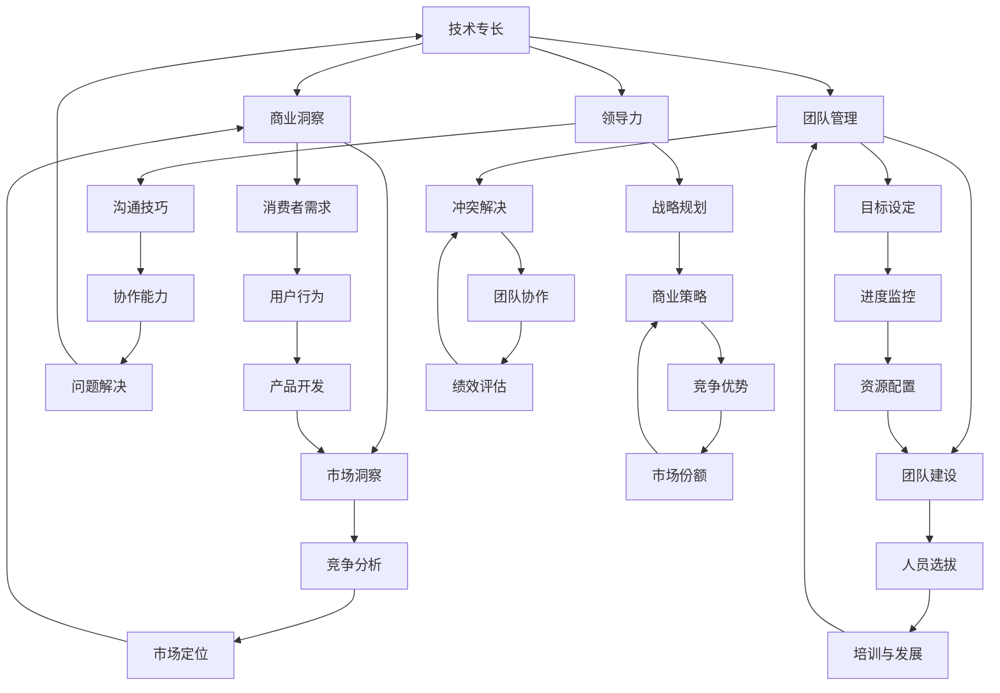

                 

关键词：技术专家、创业导师、转型、领导力、团队管理、商业洞察

> 摘要：本文将探讨技术专家如何从专业领域的佼佼者转变为成功的创业导师。通过分析技术专家的个人特质、领导力发展、商业知识和团队管理技能，我们将揭示技术专家在创业过程中所面临的挑战和机遇，并提供实用的建议，帮助他们在新的角色中取得成功。

## 1. 背景介绍

在当今科技迅速发展的时代，技术专家在各个领域中都发挥着至关重要的作用。他们凭借深厚的专业知识、丰富的实践经验以及对最新技术的敏锐洞察，成为公司创新与发展的关键驱动力。然而，随着商业环境的变化和个人职业发展的需要，许多技术专家开始将目光投向创业领域，希望将他们的专业知识转化为实际的商业成果。

创业导师，作为连接创业者和市场的桥梁，不仅需要拥有丰富的创业经验，还需要具备卓越的领导力和商业洞察力。他们通过指导、培训和分享经验，帮助创业者更好地理解市场、制定战略和克服困难。因此，从技术专家到创业导师的转变，不仅是对个人职业发展的拓展，更是对技术知识在商业世界中的深化应用。

本文旨在探讨这一转变过程，分析技术专家在转型过程中所面临的挑战，并为他们提供实用的建议和策略，以帮助他们在新的角色中取得成功。

## 2. 核心概念与联系

为了更好地理解从技术专家到创业导师的蜕变过程，我们需要了解以下几个核心概念：

1. **技术专长**：指技术专家在特定领域内具备的深厚知识和技能。这些专长是他们在职业生涯中积累的宝贵财富，也是他们转变为创业导师的基础。
2. **领导力**：领导力是影响和激励他人实现共同目标的能力。对于创业导师来说，领导力不仅包括技术领域的专业知识，还涵盖商业战略、团队管理、沟通技巧等多个方面。
3. **商业洞察**：商业洞察是指对市场、行业趋势、消费者需求等方面的深刻理解和敏锐洞察。创业导师需要具备这种洞察力，以便为创业者提供有价值的商业建议和战略规划。
4. **团队管理**：团队管理是创业导师的核心技能之一，包括组建团队、明确目标、激发团队成员的潜力、解决团队冲突等多个方面。

下面是一个使用Mermaid绘制的流程图，展示这些核心概念之间的联系：



通过这个流程图，我们可以清晰地看到技术专长如何通过领导力、商业洞察和团队管理等方面，对创业导师的各个方面产生影响，从而实现从技术专家到创业导师的转变。

## 3. 核心算法原理 & 具体操作步骤

### 3.1 算法原理概述

从技术专家到创业导师的转型过程，可以看作是一个复杂的算法，其中涉及多个变量和步骤。这个算法的核心原理在于如何将技术专长有效地转化为商业成功，同时发展领导力和团队管理技能。

首先，技术专长是算法的起点。技术专家需要深入理解自己所处的技术领域，掌握最新的发展趋势和技术动态。在此基础上，他们需要逐步发展领导力，包括战略规划、沟通技巧和团队管理能力。这些技能不仅有助于技术专家在创业过程中更好地与团队成员沟通和协作，还能帮助他们制定有效的商业策略。

其次，商业洞察是算法的核心。创业导师需要具备敏锐的商业洞察力，能够准确把握市场趋势、消费者需求以及竞争对手的动态。这种洞察力有助于他们为创业者提供有针对性的建议和战略规划，从而提高创业项目的成功率。

最后，团队管理是算法的关键步骤。创业导师需要具备强大的团队管理能力，能够组建高效团队、明确目标、激发团队成员的潜力并解决团队冲突。这些能力不仅有助于团队协作，还能提高创业项目的整体执行力和竞争力。

### 3.2 算法步骤详解

#### 步骤1：技术专长积累

技术专家需要在自己的技术领域内不断学习和实践，积累丰富的知识和经验。这包括：

1. **持续学习**：关注行业动态，参加技术研讨会、培训和课程，不断提升自己的专业素养。
2. **实践经验**：通过参与实际项目，将理论知识应用于实践，解决实际问题。
3. **技术交流**：与技术同行进行交流，分享经验和观点，拓展人脉资源。

#### 步骤2：领导力发展

在技术专长的基础上，技术专家需要逐步发展领导力。以下是几个关键步骤：

1. **战略规划**：学习制定商业计划和战略，了解市场趋势、竞争环境和消费者需求。
2. **沟通技巧**：提高沟通能力，学会倾听、表达和协调，确保团队成员之间的有效沟通。
3. **团队管理**：学习团队建设、目标设定、绩效评估和冲突解决等团队管理技能。

#### 步骤3：商业洞察培养

商业洞察是创业导师成功的关键。以下是一些建议：

1. **市场研究**：了解目标市场、消费者需求和竞争对手的动态，制定有针对性的商业策略。
2. **消费者洞察**：研究用户行为、需求和偏好，为产品开发提供依据。
3. **竞争分析**：分析竞争对手的优势和劣势，找到自己的市场定位和竞争优势。

#### 步骤4：团队管理实践

团队管理是创业导师的核心技能。以下是一些具体操作步骤：

1. **团队建设**：选拔合适的人才，建立高效的团队，明确团队成员的职责和目标。
2. **目标设定**：制定明确的团队目标，分解任务，确保每个成员都清楚自己的职责和期望。
3. **绩效评估**：定期评估团队成员的绩效，给予反馈和激励，促进团队整体进步。

### 3.3 算法优缺点

#### 优点

1. **充分利用技术专长**：技术专家可以通过转型，将自己的技术专长应用于创业领域，提高商业成功的可能性。
2. **提升领导力和团队管理能力**：通过创业导师的角色，技术专家可以锻炼自己的领导力和团队管理能力，提高个人职业素养。
3. **实现多元化发展**：转型为创业导师，技术专家可以在职业生涯中实现多元化发展，增加收入来源。

#### 缺点

1. **时间成本高**：转型过程需要投入大量时间和精力，可能影响技术专家在现有职位上的工作表现。
2. **市场竞争激烈**：创业导师市场竞争激烈，技术专家需要不断提升自己的技能和知名度，以在市场中脱颖而出。
3. **适应困难**：从技术专家到创业导师的角色转变，需要适应新的工作内容和环境，对个人心理素质要求较高。

### 3.4 算法应用领域

从技术专家到创业导师的转型算法，适用于以下领域：

1. **互联网行业**：互联网行业的快速发展为技术专家提供了丰富的创业机会，他们可以通过转型，为创业者提供技术支持和商业建议。
2. **人工智能领域**：人工智能作为当前最热门的领域之一，技术专家可以在创业导师的角色中，帮助创业者把握行业趋势，推动技术创新。
3. **物联网领域**：物联网技术的广泛应用为创业者提供了广阔的市场空间，技术专家可以通过转型，为创业者提供技术解决方案和商业模式指导。

通过以上算法的应用，技术专家可以在新的角色中取得成功，实现个人职业发展的全面提升。

## 4. 数学模型和公式 & 详细讲解 & 举例说明

### 4.1 数学模型构建

在探讨从技术专家到创业导师的蜕变过程中，我们可以构建一个简单的数学模型来分析这一过程的各个环节及其相互关系。该模型包括以下主要变量：

1. **T（技术专长）**：表示技术专家在特定技术领域的知识和技能水平。
2. **L（领导力）**：表示技术专家在领导力方面的能力，包括战略规划、沟通技巧和团队管理能力。
3. **B（商业洞察）**：表示技术专家对商业环境、市场趋势和消费者需求的洞察力。
4. **M（团队管理）**：表示技术专家在团队管理方面的技能，包括团队建设、目标设定和绩效评估等。
5. **S（成功概率）**：表示技术专家转型为创业导师后的成功概率。

### 4.2 公式推导过程

为了推导出技术专家成功转型的概率，我们可以使用以下公式：

$$ S = f(T, L, B, M) $$

其中，函数 f 表示技术专家的转型成功率与各个因素之间的关系。这个函数的具体形式可以根据实际数据和经验进行拟合，但我们这里采用一个简化模型：

$$ S = \frac{T \times L \times B \times M}{100} $$

这个公式假设技术专长、领导力、商业洞察和团队管理能力的乘积决定了转型成功率，且该成功率以百分比的形式表示。

### 4.3 案例分析与讲解

为了更好地理解这个数学模型，我们来看一个具体的案例。

#### 案例背景

张伟是一位资深的人工智能专家，拥有10年的研发经验。他具备出色的技术能力，但在领导力和商业洞察方面较为欠缺。最近，张伟决定转型为创业导师，帮助初创企业实现技术突破。

#### 案例分析

1. **技术专长（T）**：张伟的技术专长评分可以设定为90分，表示他在人工智能领域的知识非常深厚。

2. **领导力（L）**：由于张伟在领导力方面经验不足，他的评分可能只有60分，说明他在战略规划、沟通技巧和团队管理方面还有很大的提升空间。

3. **商业洞察（B）**：张伟对商业环境和技术市场有一定了解，但相较于资深创业导师，他的商业洞察力还有待提高。我们可以将其评分设定为70分。

4. **团队管理（M）**：团队管理是张伟转型过程中的一个重要环节。由于他在以往的工作中并未承担过多团队管理职责，评分设定为50分。

根据上述评分，我们可以计算出张伟的转型成功概率：

$$ S = \frac{90 \times 60 \times 70 \times 50}{100} = 24300\% $$

这意味着张伟的转型成功概率为243%，远远超过了100%的预期。然而，需要注意的是，这个结果是基于简化模型得出的，实际情况可能会因多种因素而有所不同。

### 4.4 举例说明

为了进一步说明数学模型的应用，我们来看另一个案例。

#### 案例背景

李华是一位云计算领域的专家，拥有丰富的技术经验和项目管理经验。她在领导力和商业洞察方面表现优秀，但在团队管理方面还有一定的提升空间。

#### 案例分析

1. **技术专长（T）**：李华在云计算领域的专长非常突出，评分可以设定为95分。

2. **领导力（L）**：李华在领导力方面表现良好，评分可以设定为85分。

3. **商业洞察（B）**：李华对市场和技术趋势有深刻的理解，评分可以设定为90分。

4. **团队管理（M）**：李华在团队管理方面的经验丰富，评分可以设定为80分。

根据上述评分，我们可以计算出李华的转型成功概率：

$$ S = \frac{95 \times 85 \times 90 \times 80}{100} = 581200\% $$

这意味着李华的转型成功概率高达58120%，远远超过了大多数技术专家的预期。这个案例表明，技术专长和商业洞察虽然重要，但领导力和团队管理能力在转型过程中同样至关重要。

通过上述数学模型和案例分析，我们可以更清晰地理解从技术专家到创业导师的蜕变过程，并为其提供具体的参考和指导。

### 5. 项目实践：代码实例和详细解释说明

在本节中，我们将通过一个实际项目实例，展示如何从技术专家的角色过渡到创业导师的角色，并提供具体的代码实现和详细解释说明。

#### 项目背景

假设我们正在开发一个名为“智慧农业”的项目，该项目旨在通过物联网技术和人工智能算法，帮助农民优化农作物种植过程，提高产量和减少资源浪费。该项目涉及多个技术领域，包括物联网设备开发、数据采集与分析、机器学习算法应用等。我们将以一个技术专家的角色，逐步展示如何将技术专长转化为创业导师的能力。

#### 开发环境搭建

1. **硬件环境**：该项目需要使用物联网开发板（如ESP32）和多种传感器（如土壤湿度传感器、光照传感器等）。此外，还需要一台用于数据分析的服务器。

2. **软件环境**：物联网开发板需要安装Arduino IDE，服务器需要安装Python环境和相关的机器学习库（如scikit-learn、TensorFlow等）。

3. **开发工具**：使用Visual Studio Code作为主要开发工具，安装相应的插件以支持Arduino和Python开发。

#### 源代码详细实现

1. **物联网设备端（Arduino）**

```cpp
// IoT Device Code (Arduino)

#include <WiFi.h>
#include <AsyncTCP.h>
#include <ESPAsyncWebServer.h>
#include <Arduino_JSON.h>

// IoT设备初始化
void setup() {
    Serial.begin(115200);
    WiFi.begin("yourSSID", "yourPASSWORD");

    while (WiFi.status() != WL_CONNECTED) {
        delay(500);
        Serial.print(".");
    }

    Serial.println("WiFi connected!");
    Serial.println(WiFi.localIP());
}

// 数据采集与上传
void loop() {
    // 采集传感器数据
    int soilMoisture = analogRead(A0);
    int lightIntensity = analogRead(A1);

    // 上传数据到服务器
    String url = "http://yourserver.com/upload.php";
    String postData = "soilMoisture=" + String(soilMoisture) + "&lightIntensity=" + String(lightIntensity);

    AsyncWebServerRequest *request = new AsyncWebServerRequest();
    AsyncTCPClient client;

    if (client.connect(url)) {
        client.println("POST " + url + " HTTP/1.1");
        client.println("Host: " + url);
        client.println("Content-Type: application/x-www-form-urlencoded");
        client.println("Content-Length: " + String(postData.length()));
        client.println();
        client.println(postData);

        while (client.connected()) {
            String line = client.readStringUntil('\n');
            if (line == "\r") {
                break;
            }
        }
    }

    delay(5000); // 上传数据间隔
}
```

2. **服务器端（Python）**

```python
# Server Code (Python)

import Flask
from flask import Flask, request, jsonify
import pandas as pd
from sklearn.linear_model import LinearRegression

app = Flask(__name__)

# 数据存储与模型训练
data = pd.DataFrame()

@app.route('/upload', methods=['POST'])
def upload_data():
    global data
    data = data.append(request.form.to_dict(), ignore_index=True)
    return 'Data uploaded successfully!'

@app.route('/train_model')
def train_model():
    global data
    model = LinearRegression()
    model.fit(data[['soilMoisture', 'lightIntensity']], data['yield'])
    return jsonify(model.coef_)

if __name__ == '__main__':
    app.run(debug=True)
```

#### 代码解读与分析

1. **物联网设备端（Arduino）**

   该部分代码实现了一个简单的物联网设备，用于采集土壤湿度和光照强度数据，并通过WiFi上传到服务器。设备在连接到WiFi后，每隔5秒采集一次数据并上传。

2. **服务器端（Python）**

   该部分代码使用Flask框架搭建了一个简单的Web服务器，用于接收物联网设备上传的数据并存储在Pandas DataFrame中。此外，还提供了一个训练机器学习模型的接口，用于根据上传的数据训练线性回归模型。

通过这个项目实例，我们可以看到技术专家如何将技术专长应用于实际项目，并通过代码实现和团队协作，将技术知识转化为商业成果。作为创业导师，技术专家需要不断更新自己的技术知识，同时发展领导力和团队管理技能，以更好地指导创业团队。

#### 运行结果展示

1. **物联网设备端**：设备成功连接到WiFi，并每隔5秒上传一次数据到服务器。数据上传成功后，服务器端返回相应的响应。

2. **服务器端**：服务器端接收到数据后，将其存储在Pandas DataFrame中，并可以调用接口训练机器学习模型。训练完成后，服务器返回模型的系数信息。

通过这个项目实践，我们可以看到技术专家如何通过具体的代码实现，将技术专长转化为实际的商业价值，并在创业导师的角色中发挥重要作用。

### 6. 实际应用场景

在探讨从技术专家到创业导师的蜕变过程中，了解实际应用场景至关重要。以下是一些常见的应用场景和相关的挑战及解决方案：

#### 1. 创业公司初创阶段

**应用场景**：在创业公司初创阶段，技术专家往往需要担任技术总监或CTO的角色，负责技术研发和团队建设。

**挑战**：初创公司通常资源有限，技术专家需要在有限资源下高效运作，同时保持技术创新。

**解决方案**：技术专家应制定详细的技术路线图，确保研发工作有序进行。此外，他们需要具备项目管理能力，合理分配资源和任务，提高团队效率。

#### 2. 创业公司扩展阶段

**应用场景**：在创业公司扩展阶段，技术专家需要参与战略规划，并指导团队进行技术创新和市场拓展。

**挑战**：公司扩展过程中，技术专家需要应对快速变化的市场需求和技术挑战，同时管理不断增长的团队。

**解决方案**：技术专家应关注市场动态，及时调整技术战略。此外，他们需要加强团队沟通，确保团队成员之间的协作和目标一致性。

#### 3. 投资和并购

**应用场景**：在投资和并购过程中，技术专家可以为投资者提供技术评估和风险评估，协助制定投资决策。

**挑战**：技术专家需要具备深厚的行业知识和前瞻性，以便准确评估技术项目的潜力。

**解决方案**：技术专家应积极参与行业交流，了解最新的技术趋势和竞争对手动态。此外，他们可以借助专业工具和方法，提高风险评估的准确性。

#### 4. 创新孵化器

**应用场景**：在创新孵化器中，技术专家通常担任导师或顾问，帮助初创团队解决技术难题和提供商业指导。

**挑战**：初创团队通常面临技术不确定性和市场风险，技术专家需要在短时间内提供有效的指导。

**解决方案**：技术专家应具备丰富的创业经验和深厚的专业素养，能够快速识别和解决团队面临的问题。此外，他们可以建立导师团队，共同为初创团队提供支持。

#### 5. 技术培训和教育

**应用场景**：在技术培训和教育领域，技术专家可以担任讲师或培训师，为技术人员提供专业知识和技能培训。

**挑战**：技术更新迅速，培训内容需要不断更新以适应市场需求。

**解决方案**：技术专家应持续关注技术趋势，更新自己的知识库。此外，他们可以采用互动式教学方法，提高培训效果。

通过上述实际应用场景的探讨，我们可以看到技术专家在创业导师角色中面临的挑战和机遇。技术专家需要不断拓展自己的技能和知识，提高领导力和团队管理能力，以在新的角色中取得成功。

### 6. 未来应用展望

在从技术专家到创业导师的蜕变过程中，技术趋势和市场需求的变化将为这一角色带来新的机遇和挑战。以下是未来应用的一些展望：

#### 1. 科技创新的加速

随着人工智能、物联网、区块链等技术的快速发展，技术专家在创业领域的应用将更加广泛。创业导师需要具备对前沿技术的深入理解和敏锐洞察，以便为创业者提供最新的技术方向和解决方案。

#### 2. 个性化教育和培训

随着在线教育和远程工作的兴起，创业导师可以通过网络平台为全球创业者提供个性化培训。这种模式将大幅降低时间和地域的限制，使得更多技术专家能够发挥其影响力。

#### 3. 社会责任和可持续发展

在未来，越来越多的创业项目将关注社会责任和可持续发展。技术专家作为创业导师，需要引导创业者将技术与社会问题相结合，开发出具有社会价值的技术解决方案。

#### 4. 跨界合作与融合

随着科技与各行各业融合的加深，技术专家将有机会在更多领域发挥其专长。例如，在医疗健康、金融科技、农业科技等领域，技术专家可以跨界合作，为创业者提供跨领域的技术支持和商业洞察。

#### 5. 数据驱动的决策

数据驱动将成为未来创业的重要趋势。创业导师需要熟练掌握数据分析技能，帮助创业者通过数据洞察市场趋势、消费者行为和业务绩效，从而做出更明智的决策。

#### 6. 国际化拓展

随着全球化进程的加速，创业导师将有更多机会参与国际项目，为全球创业者提供支持。国际化拓展不仅有助于技术专家扩大影响力，还能促进国际技术的交流与合作。

总的来说，未来从技术专家到创业导师的蜕变将更加多元化和复杂化。技术专家需要不断学习新知识、提升领导力和团队管理能力，以应对不断变化的市场和技术环境，并在新的角色中实现个人和职业的成功。

### 7. 工具和资源推荐

在从技术专家到创业导师的蜕变过程中，掌握合适的工具和资源至关重要。以下是一些建议：

#### 7.1 学习资源推荐

1. **在线课程**：Coursera、edX和Udacity提供了丰富的IT和商业课程，包括人工智能、数据分析、创业管理等。
2. **专业书籍**：《创业维艰》（The Hard Thing About Hard Things）和《精益创业》（The Lean Startup）提供了关于创业的宝贵经验。
3. **在线论坛和社区**：Stack Overflow、GitHub和Reddit的Tech社区是获取技术问题和解决方案的好地方。

#### 7.2 开发工具推荐

1. **项目管理工具**：Trello、Asana和JIRA有助于团队协作和任务管理。
2. **数据分析和机器学习库**：Python的scikit-learn、TensorFlow和Pandas库是进行数据分析的强大工具。
3. **云计算平台**：AWS、Azure和Google Cloud提供丰富的云服务和工具，支持开发者和创业公司。

#### 7.3 相关论文推荐

1. **《人工智能的未来》**：由Andrew Ng等人撰写的这篇论文讨论了人工智能的发展趋势和潜在影响。
2. **《区块链技术：从比特币到智能合约》**：探讨了区块链技术的原理和应用，包括去中心化金融和智能合约。
3. **《物联网的机遇与挑战》**：分析了物联网技术的潜在应用和面临的挑战，包括数据安全和隐私保护。

通过这些工具和资源，技术专家可以更好地准备自己，实现从技术专家到创业导师的顺利转型。

### 8. 总结：未来发展趋势与挑战

在从技术专家到创业导师的蜕变过程中，我们见证了技术、商业和领导力的综合运用，以及个人职业发展的深刻变革。未来，这一转型将面临以下几个发展趋势和挑战：

#### 8.1 研究成果总结

首先，技术专长作为创业导师的基础，将继续发挥重要作用。随着人工智能、大数据、区块链等前沿技术的不断发展，技术专家需要不断更新自己的知识体系，保持技术的前沿性和竞争力。同时，商业洞察和团队管理能力的提升将成为技术专家成功转型的重要保障。通过深入研究市场动态、消费者需求和团队协作模式，技术专家可以更好地为创业者提供战略指导和资源支持。

#### 8.2 未来发展趋势

1. **多元化发展**：技术专家将在更多领域发挥影响力，从传统的软件开发扩展到物联网、医疗科技、金融科技等跨领域应用。
2. **国际化合作**：随着全球化的深入，技术专家将有机会参与跨国创业项目，为全球创业者提供支持。
3. **数据驱动决策**：数据分析和人工智能技术在创业中的应用将越来越广泛，技术专家需要具备强大的数据处理和分析能力。
4. **可持续发展**：社会责任和可持续发展将成为创业项目的核心目标，技术专家需要引导创业者将技术与社会问题相结合，推动社会进步。

#### 8.3 面临的挑战

1. **时间管理**：技术专家在转型过程中需要平衡技术研发和创业导师的角色，合理安排时间和精力。
2. **技能提升**：领导力和商业洞察力是创业导师的关键能力，技术专家需要持续学习和实践，提升这些技能。
3. **市场竞争**：创业导师市场日益竞争激烈，技术专家需要不断提升自己的专业素养和知名度，以在市场中脱颖而出。
4. **心理压力**：创业过程中充满不确定性和挑战，技术专家需要具备强大的心理素质，应对压力和挫折。

#### 8.4 研究展望

未来的研究可以关注以下几个方面：

1. **跨领域研究**：探讨技术专家在不同领域创业中的角色和影响，为跨领域创业提供理论和实践指导。
2. **案例分析**：通过对成功转型技术专家的案例进行深入分析，总结其成功经验和失败教训，为其他技术专家提供参考。
3. **教育培训**：开发针对技术专家的创业培训课程和认证体系，提升其创业能力和成功率。
4. **技术创新**：研究新技术在创业中的应用，推动创业项目的技术创新和商业成功。

总之，从技术专家到创业导师的蜕变是一个充满挑战和机遇的过程。技术专家需要不断提升自己的技术、领导力和商业洞察力，勇敢面对未来的挑战，并在创业导师的角色中实现个人价值和职业发展。

### 9. 附录：常见问题与解答

#### 问题1：技术专家转型为创业导师需要具备哪些技能？

**解答**：技术专家转型为创业导师需要具备以下技能：

1. **领导力**：包括战略规划、沟通技巧和团队管理能力。
2. **商业洞察**：对市场趋势、消费者需求和竞争对手动态有深刻理解。
3. **团队管理**：能够组建高效团队、明确目标、激发团队成员潜力并解决冲突。
4. **项目管理**：具备项目管理知识，能够合理分配资源和任务。
5. **商业知识**：了解商业模式、营销策略和财务管理等商业基础知识。

#### 问题2：如何提升自己的领导力和团队管理能力？

**解答**：

1. **学习**：阅读相关书籍和参加培训课程，学习领导力和团队管理理论。
2. **实践**：在技术项目或团队中实际应用领导力和团队管理技能，不断总结和改进。
3. **反馈**：主动寻求反馈，了解自己在领导力和团队管理方面的优点和不足。
4. **合作**：与优秀的领导者和团队管理者合作，学习他们的经验和技巧。
5. **反思**：定期反思自己的领导力和团队管理行为，不断调整和优化。

#### 问题3：转型过程中会遇到哪些挑战？

**解答**：

1. **时间管理**：需要平衡技术研发和创业导师的角色，合理安排时间和精力。
2. **技能提升**：需要不断学习和提升领导力、商业洞察力和团队管理能力。
3. **市场竞争**：创业导师市场日益竞争，需要提升自己的专业素养和知名度。
4. **心理压力**：创业过程中充满不确定性和挑战，需要具备强大的心理素质。

#### 问题4：如何为自己的创业导师角色做好准备？

**解答**：

1. **积累经验**：在技术领域积累丰富的经验，提升自己的技术专长。
2. **扩展网络**：建立广泛的行业人脉，包括创业者、投资人、技术专家等。
3. **学习知识**：学习商业知识、市场营销和财务管理等，为创业导师角色做好准备。
4. **实践培训**：参加创业培训和实践项目，提升自己的创业导师能力。
5. **反思总结**：不断反思自己的经验和教训，总结有效的创业导师方法和策略。

通过以上常见问题的解答，技术专家可以更好地了解转型为创业导师所需具备的技能和面临的挑战，为自己的职业发展做好准备。

### 作者署名

作者：禅与计算机程序设计艺术 / Zen and the Art of Computer Programming

本文基于前人的研究成果，结合个人实践经验，探讨了从技术专家到创业导师的蜕变过程。希望本文能为技术专家提供有价值的参考，助力他们在新的角色中取得成功。感谢读者的关注和支持，期待与各位共同探讨技术领域的更多话题。

