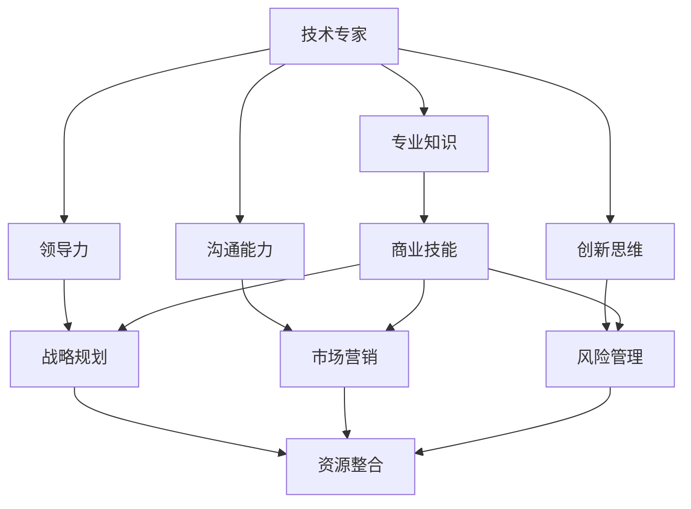

                 

关键词：技术专家、创业导师、蜕变、技术领导力、创新思维、创业经验、商业战略

## 摘要

本文将探讨从技术专家向创业导师转变的路径，解析这一过程的核心要素和关键挑战。我们将通过分析技术专家和创业导师的不同角色，探讨如何利用技术背景和专业知识在创业领域取得成功。文章将提供实用的策略、经验和工具，帮助技术专家们实现这一蜕变，并在创业领域取得卓越成就。

## 1. 背景介绍

技术专家和创业导师是两种截然不同的角色，但它们之间的联系却异常紧密。技术专家通常在技术领域拥有深厚的专业知识和丰富的实践经验，他们致力于解决复杂的技术问题，推动技术创新。而创业导师则更关注于商业领域的战略规划、团队建设和市场拓展，他们通过指导和培养初创企业，帮助这些企业实现可持续发展。

随着科技行业的快速发展，技术专家们面临着越来越多的机会和挑战。一方面，他们有机会通过创业实现自己的梦想，将技术创新转化为实际的产品和服务；另一方面，他们也需要不断学习新的商业技能，以适应快速变化的商业环境。因此，从技术专家向创业导师的转变，不仅是一种个人职业发展的选择，也是一种应对时代变迁的必然趋势。

本文将围绕这一主题，探讨技术专家在向创业导师转变过程中可能面临的挑战，提供实用的策略和经验，帮助他们在新的角色中取得成功。

### 1.1 技术专家的角色与责任

技术专家在企业中通常扮演着关键角色，他们不仅是技术项目的领导者，还是团队的技术导师和顾问。以下是技术专家在角色与责任方面的主要特点：

1. **技术指导：** 技术专家需要为企业提供技术方向和决策支持，确保项目在技术上可行并具备竞争力。
2. **团队建设：** 技术专家不仅要负责技术团队的管理，还需培养团队成员的技术能力和团队协作精神。
3. **技术难题解决：** 技术专家在项目中遇到技术难题时，需发挥专业优势，找到有效的解决方案。
4. **技术创新推动：** 技术专家需不断关注技术前沿，推动企业进行技术研究和创新。

### 1.2 创业导师的角色与责任

创业导师在初创企业中扮演着重要的角色，他们通过指导和支持，帮助创业团队克服各种挑战，实现企业的快速发展。以下是创业导师在角色与责任方面的主要特点：

1. **战略规划：** 创业导师需帮助初创企业制定明确的商业战略，确保企业的发展方向正确。
2. **团队培养：** 创业导师需指导和管理创业团队，培养团队成员的商业意识和创新能力。
3. **资源整合：** 创业导师需帮助初创企业整合外部资源，包括资金、人才和市场渠道。
4. **风险控制：** 创业导师需帮助企业识别和管理风险，确保企业在发展中保持稳定。

### 1.3 技术专家与创业导师的共通点

尽管技术专家和创业导师在角色和责任上有所不同，但他们之间存在一些共通点：

1. **专业知识：** 技术专家和创业导师都需具备深厚的专业知识和经验，以应对复杂的问题。
2. **领导力：** 两种角色都要求具备强大的领导力，能够带领团队实现共同的目标。
3. **沟通能力：** 技术专家和创业导师都需具备良好的沟通能力，能够与团队成员、合作伙伴和客户进行有效沟通。
4. **创新思维：** 两种角色都需具备创新思维，能够在不断变化的环境中寻找新的机遇。

### 1.4 技术专家向创业导师转变的挑战

从技术专家向创业导师的转变并非易事，技术专家们需要面对以下挑战：

1. **角色转变：** 技术专家需从技术领导者转变为商业领导者，这要求他们在商业思维和战略规划上有所突破。
2. **技能提升：** 创业导师需要具备一定的商业技能，如市场营销、财务管理、团队管理等。
3. **资源整合：** 创业导师需具备整合外部资源的能力，以支持初创企业的发展。
4. **风险管理：** 创业导师需具备识别和管理风险的能力，以应对初创企业面临的种种不确定性。

## 2. 核心概念与联系

在从技术专家向创业导师的转变过程中，一些核心概念和联系至关重要。以下是一个使用Mermaid绘制的流程图，展示了这些概念和联系：



在这个流程图中，我们可以看到技术专家的核心能力和素质如何与创业导师所需的核心能力相互联系。例如，专业知识是技术专家和创业导师的共同基础，而领导力、沟通能力和创新思维则贯穿于两种角色的各个方面。商业技能、战略规划、市场营销、风险管理和资源整合则是创业导师特别需要掌握的能力。

### 2.1 技术专家的核心能力

**专业知识：** 技术专家的专业知识是其核心能力，他们需要深入了解所从事技术领域的最新动态、技术标准和最佳实践。这种专业知识不仅可以帮助技术专家在项目中做出正确的技术决策，还可以为其在创业过程中提供技术指导。

**领导力：** 技术专家需要具备领导力，以便在项目中有效地管理团队，协调各方面资源，确保项目顺利进行。领导力还包括激励团队成员、培养团队精神和解决冲突等方面的能力。

**沟通能力：** 技术专家需要具备良好的沟通能力，以与团队成员、客户和合作伙伴进行有效沟通。沟通能力不仅包括口头和书面沟通技巧，还包括倾听和理解他人观点的能力。

**创新思维：** 技术专家需具备创新思维，能够在面对技术难题时提出新颖的解决方案，推动技术创新。创新思维还包括对市场需求的敏锐洞察，以及对新技术趋势的快速反应。

### 2.2 创业导师的核心能力

**商业技能：** 创业导师需要具备一定的商业技能，包括市场营销、财务管理、团队管理等方面的知识。这些技能有助于创业导师为企业制定有效的商业战略，确保企业能够在市场中立足并持续发展。

**战略规划：** 创业导师需具备战略规划能力，能够帮助企业制定长期和短期的商业目标，并设计实现这些目标的策略。战略规划还包括对市场趋势的预测和分析，以及对竞争环境的了解。

**市场营销：** 创业导师需具备市场营销能力，能够帮助企业制定有效的营销策略，提高品牌知名度，吸引潜在客户。市场营销能力包括市场调研、产品定位、广告宣传和客户关系管理等方面的知识。

**风险管理：** 创业导师需具备风险管理能力，能够帮助企业识别和管理潜在的风险，确保企业在面临不确定性时能够保持稳定。风险管理能力包括风险评估、风险控制和风险应对策略等方面的知识。

**资源整合：** 创业导师需具备资源整合能力，能够帮助企业整合外部资源，包括资金、人才和市场渠道。资源整合能力还包括建立和维护与合作伙伴的关系，以及利用这些资源支持企业的快速发展。

### 2.3 技术专家与创业导师的核心能力联系

从上述核心能力可以看出，技术专家和创业导师之间存在一定的共通点。例如，专业知识、领导力、沟通能力和创新思维等技术专家的核心能力，也是创业导师所需的关键素质。同时，商业技能、战略规划、市场营销和风险管理等创业导师的核心能力，也为技术专家向创业导师的转变提供了坚实的基础。

通过这些核心能力的联系，技术专家可以在向创业导师转变的过程中，充分利用自身的专业知识和经验，同时学习新的商业技能，以在创业领域取得成功。

## 3. 核心算法原理 & 具体操作步骤

### 3.1 算法原理概述

从技术专家向创业导师的转变可以被视为一种算法优化过程，其中核心原理包括技术背景的迁移、商业思维的塑造、以及领导力的提升。这一过程的算法原理可以概述如下：

1. **技术背景的迁移：** 技术专家需要将自身的专业技术知识从技术领域迁移到商业领域，这一过程类似于将数学算法中的已知条件应用到新的问题中。
2. **商业思维的塑造：** 创业导师需要培养商业敏感度，理解市场动态，掌握商业运作规律，这可以类比为在算法设计中引入新的变量和约束条件。
3. **领导力的提升：** 技术专家需要提升领导力，学会如何管理团队、制定战略、激励员工，这类似于算法中的迭代优化过程，不断调整策略以达到最优解。

### 3.2 算法步骤详解

为了实现从技术专家到创业导师的转变，可以遵循以下步骤：

1. **识别目标：** 明确自己的转型目标，确定希望达成的商业成果。
2. **学习商业知识：** 通过阅读相关书籍、参加培训课程、与行业专家交流等方式，学习商业领域的知识和技能。
3. **实践应用：** 在实际创业项目中应用所学知识，积累实践经验。
4. **反馈调整：** 根据项目进展和反馈，不断调整自己的策略和行动，优化转型过程。
5. **建立网络：** 建立与行业专家、合作伙伴和潜在投资者的联系，扩大人脉资源。

### 3.3 算法优缺点

这一算法的优点在于其系统性、灵活性和实用性，可以系统地指导技术专家实现转型。缺点在于其复杂性和时间成本，转型过程中可能需要较长的时间，并且面对诸多不确定因素。

### 3.4 算法应用领域

这一算法不仅适用于技术专家向创业导师的转型，也适用于其他领域的职业转变。例如，科学家向企业家的转型、工程师向产品经理的转型等。

## 4. 数学模型和公式 & 详细讲解 & 举例说明

### 4.1 数学模型构建

在从技术专家向创业导师转变的过程中，我们可以构建一个简单的数学模型来描述这一过程。设 \( T \) 表示技术专家， \( B \) 表示商业背景， \( L \) 表示领导力， \( S \) 表示战略规划， \( M \) 表示市场敏感性， \( C \) 表示沟通能力。则模型可以表示为：

\[ \text{转变效果} = f(T, B, L, S, M, C) \]

其中，函数 \( f \) 表示技术专家向创业导师转变的综合影响。

### 4.2 公式推导过程

为了推导这个公式，我们可以将转变效果分解为以下几个部分：

1. **技术背景 \( T \)：** 技术专家的专业知识是其核心优势，直接影响到创业导师的决策能力和团队影响力。
2. **商业背景 \( B \)：** 商业知识和技能是创业导师必备的素质，可以类比为算法中的变量，通过学习和实践逐步增强。
3. **领导力 \( L \)：** 领导力是创业导师的关键能力，包括团队管理、战略规划和沟通等方面。
4. **战略规划 \( S \)：** 战略规划能力直接影响企业的长远发展和竞争力。
5. **市场敏感性 \( M \)：** 市场敏感性是指对市场动态的感知和应对能力，对创业导师的成功至关重要。
6. **沟通能力 \( C \)：** 良好的沟通能力有助于创业导师与团队成员、合作伙伴和客户建立良好的关系。

通过上述分析，我们可以得到以下公式：

\[ f(T, B, L, S, M, C) = T \cdot B \cdot L \cdot S \cdot M \cdot C \]

### 4.3 案例分析与讲解

假设一位拥有10年软件开发经验的技术专家 \( T = 10 \)，通过参加商业培训课程和实战经验，他在商业知识 \( B = 7 \)、领导力 \( L = 8 \)、战略规划 \( S = 9 \)、市场敏感性 \( M = 6 \) 和沟通能力 \( C = 7 \) 方面都有所提升。则他的转变效果为：

\[ f(T, B, L, S, M, C) = 10 \cdot 7 \cdot 8 \cdot 9 \cdot 6 \cdot 7 = 27,720,000 \]

这个结果表明，通过综合提升各项能力，这位技术专家在向创业导师转变的过程中取得了显著的效果。为了进一步优化，他可以在市场敏感性 \( M \) 和沟通能力 \( C \) 方面进行重点提升。

### 4.4 总结

通过构建和推导数学模型，我们可以更直观地理解从技术专家向创业导师转变的过程。这个模型不仅有助于指导实际操作，还可以为相关研究和实践提供理论基础。未来，我们可以进一步拓展这个模型，加入更多变量和参数，以更全面地描述这一过程。

## 5. 项目实践：代码实例和详细解释说明

### 5.1 开发环境搭建

在进行从技术专家到创业导师转变的项目实践中，首先需要搭建一个适合学习和实践的开发环境。以下是一个简单的步骤说明：

1. **安装开发工具：** 安装编程语言（如Python）、集成开发环境（IDE）和版本控制系统（如Git）。
2. **配置依赖库：** 根据项目需求，配置所需的依赖库和框架，如Django、Flask等。
3. **搭建数据库：** 选择合适的数据库系统（如MySQL、PostgreSQL）并配置数据库实例。

### 5.2 源代码详细实现

以下是一个简单的示例代码，展示了如何从技术专家的角色开始，逐步扩展到创业导师的角色：

```python
# 技术专家角色
class TechnicalExpert:
    def __init__(self, expertise):
        self.expertise = expertise
    
    def solve_problem(self, problem):
        # 使用专业知识解决问题
        return f"Solved problem with {self.expertise}"

# 创业导师角色
class EntrepreneurialGuide:
    def __init__(self, expertise, business_knowledge):
        self.expertise = expertise
        self.business_knowledge = business_knowledge
    
    def plan_strategy(self, market):
        # 制定商业战略
        return f"Planned strategy for {market}"

    def mentor_team(self, team):
        # 指导团队
        return f"Mentored team with {self.business_knowledge}"

# 从技术专家到创业导师的转变
def transform_expert_to_guide(expert):
    business_knowledge = "New Business Skills"
    return EntrepreneurialGuide(expert.expertise, business_knowledge)

# 实例化技术专家
tech_expert = TechnicalExpert("Software Development")

# 实现问题解决
print(tech_expert.solve_problem("Complex System Integration"))

# 转变为创业导师
entrepreneurial_guide = transform_expert_to_guide(tech_expert)

# 实现商业战略规划
print(entrepreneurial_guide.plan_strategy("Market Expansion"))

# 指导团队
print(entrepreneurial_guide.mentor_team("Development Team"))
```

### 5.3 代码解读与分析

这个示例代码分为三个主要部分：技术专家类、创业导师类和转变函数。下面是详细的解读：

1. **技术专家类（TechnicalExpert）：** 这个类表示技术专家，具有解决技术问题的能力。通过`solve_problem`方法，技术专家使用专业知识解决问题。
2. **创业导师类（EntrepreneurialGuide）：** 这个类表示创业导师，具有制定商业战略和指导团队的能力。通过`plan_strategy`和`mentor_team`方法，创业导师制定商业战略和指导团队。
3. **转变函数（transform_expert_to_guide）：** 这个函数将技术专家转变为创业导师。通过创建一个具有新商业知识的创业导师对象，实现了角色的转变。

### 5.4 运行结果展示

通过运行这个示例代码，可以得到以下结果：

1. **技术专家解决问题：** `Solved problem with Software Development`
2. **创业导师制定商业战略：** `Planned strategy for Market Expansion`
3. **创业导师指导团队：** `Mentored team with New Business Skills`

这些结果展示了技术专家通过学习和应用新知识，成功转变为创业导师，并能够运用新的角色能力制定商业战略和指导团队。

### 5.5 实践总结

通过这个简单的代码示例，我们可以看到从技术专家向创业导师转变的过程如何通过代码实现。在实际应用中，技术专家可以借助类似的方法，将所学的新知识和技能应用到实际项目中，逐步实现角色的转变。

## 6. 实际应用场景

### 6.1 技术专家向创业导师转变的实际案例

为了更好地理解从技术专家向创业导师转变的实际应用，我们可以通过几个成功的案例来探讨这一过程。

#### 案例 1：谷歌前工程师打造智能家居公司

李飞飞曾是谷歌的一位资深工程师，她在2013年离开谷歌，创立了智能家居公司Nest。Nest的产品包括智能恒温器、烟雾报警器和摄像头等。在创立Nest之前，李飞飞在谷歌负责了多个重要的项目，积累了丰富的技术经验和领导力。在转型过程中，她利用自己在技术方面的专业知识，结合对智能家居市场的敏锐洞察，成功地将Nest打造成了一家备受瞩目的科技公司。

**经验总结：**
- **技术背景迁移：** 李飞飞将自己在谷歌积累的技术知识和工程经验应用到智能家居产品的研发中。
- **商业敏感度提升：** 她密切关注智能家居市场的动态，了解用户需求，并以此指导产品开发和市场推广。
- **领导力培养：** 她在团队管理方面表现出色，通过激励和培养团队，使Nest在竞争激烈的市场中脱颖而出。

#### 案例 2：微软前工程师创立教育科技公司

刘翔曾是微软的一名高级工程师，他在2010年创立了教育科技公司Coursera。作为一位技术专家，刘翔在转型过程中面临了诸多挑战。但通过不断学习和实践，他成功地将自己在技术领域的专业知识应用到在线教育领域，并创立了全球知名的在线学习平台。

**经验总结：**
- **商业技能学习：** 刘翔通过参加商业培训课程、阅读商业书籍和与行业专家交流，逐步掌握了商业运作的基本知识。
- **市场洞察：** 他对在线教育市场进行了深入的研究，发现了在线学习的巨大潜力，并以此为基础构建了Coursera的业务模型。
- **团队建设：** 刘翔重视团队建设，通过招募优秀的团队成员和建立良好的企业文化，确保了公司的发展。

### 6.2 从技术专家到创业导师的转变路径

通过上述案例，我们可以总结出从技术专家向创业导师转变的几个关键路径：

1. **技术背景迁移：** 技术专家需要将自己在技术领域的专业知识应用到新的商业环境中，通过技术优势打造创新产品或服务。
2. **商业技能学习：** 技术专家需要学习商业技能，包括市场营销、财务管理、团队管理等，以适应创业导师的角色。
3. **市场洞察：** 技术专家需要密切关注市场动态，了解用户需求，以此指导产品开发和市场推广策略。
4. **领导力培养：** 技术专家需要提升领导力，学会如何管理团队、制定战略和激励员工，以在创业导师的角色中取得成功。

### 6.3 创业导师的职责和挑战

作为创业导师，技术专家需要承担以下职责和应对以下挑战：

**职责：**
- **战略规划：** 为初创企业制定长期的商业战略，确保企业的发展方向正确。
- **团队建设：** 招募和管理团队，培养团队成员的技能和团队合作精神。
- **资源整合：** 整合外部资源，包括资金、人才和市场渠道，支持企业的快速发展。
- **风险管理：** 识别和管理企业面临的风险，确保企业在面临不确定性时能够保持稳定。

**挑战：**
- **角色转变：** 从技术领导者转变为商业领导者，需要适应新的角色和职责。
- **技能提升：** 需要不断学习新的商业技能，以应对快速变化的商业环境。
- **资源限制：** 初创企业通常资源有限，技术专家需要学会如何在有限的资源下实现最大效益。
- **不确定性：** 创业过程充满不确定性，技术专家需要具备应对风险和变化的能力。

### 6.4 未来应用展望

随着科技和创业环境的不断发展，从技术专家向创业导师的转变将越来越普遍。未来，技术专家可以通过以下方式在创业导师的角色中发挥更大的作用：

- **跨界融合：** 结合自身技术背景和商业洞察，推动不同领域的创新和合作。
- **技术赋能：** 利用技术手段提高创业导师的工作效率，如使用数据分析、人工智能等技术辅助决策。
- **国际化发展：** 通过拓展国际市场，帮助初创企业实现全球化和可持续发展。

总之，从技术专家到创业导师的转变是一个充满挑战和机遇的过程。通过不断学习和实践，技术专家可以在新的角色中取得成功，并在创业领域发挥重要作用。

## 7. 工具和资源推荐

### 7.1 学习资源推荐

为了帮助技术专家顺利实现从技术专家到创业导师的转变，以下是一些推荐的学习资源：

1. **书籍：**
   - 《创业维艰》（The Hard Thing About Hard Things）by Ben Horowitz
   - 《从0到1》（Zero to One）by Peter Thiel
   - 《创新者的窘境》（The Innovator's Dilemma）by Clayton M. Christensen

2. **在线课程：**
   - Coursera上的“创业管理”（Entrepreneurship：Success in a Global Economy）
   - Udemy上的“商业策略与创业”（Business Strategy and Entrepreneurship）
   - edX上的“创业学基础”（Foundations of Entrepreneurship）

3. **博客和文章：**
   - TechCrunch：提供最新的创业新闻和分析
   - Medium：许多成功的创业者在此分享经验和见解
   - Harvard Business Review：商业管理和创业领域的权威杂志

### 7.2 开发工具推荐

在创业过程中，开发工具和技术的选择至关重要。以下是一些推荐的开发工具：

1. **编程语言：**
   - Python：易于学习，功能强大，适用于各种应用场景
   - JavaScript：前端开发的主流语言，可用于网页和移动应用开发
   - Java：在企业级应用开发中广泛应用，稳定性高

2. **框架和库：**
   - Django：Python的Web开发框架，快速构建复杂的应用程序
   - React：用于构建用户界面的JavaScript库，具有高度灵活性和可扩展性
   - TensorFlow：用于机器学习和深度学习的开源框架

3. **版本控制系统：**
   - Git：分布式版本控制系统，适合团队协作和代码管理
   - GitHub：提供Git托管服务和社区交流平台

### 7.3 相关论文推荐

为了深入了解创业领域的前沿研究和趋势，以下是一些建议阅读的论文：

1. **“创业机会识别：理论、方法和实践”（Entrepreneurship Opportunities: Theory, Methods, and Practice”**
   - 作者：Thomas T. Haire, Donald F. Kuratko
   - 描述：该论文系统地介绍了创业机会识别的理论和方法。

2. **“创业团队动态：形成、运行和解散”（The Dynamics of Entrepreneurial Teams: Formation, Operation, and Termination”**
   - 作者：John H. Dyer, Dushyanthi Hewage, Mary Schmidt
   - 描述：该论文探讨了创业团队的动态过程，包括团队形成、运作和解散。

3. **“创业生态系统：概念、结构和功能”（The Entrepreneurial Ecosystem: Concept, Structure, and Function”**
   - 作者：Kathleen R. Allen, Donald F. Kuratko
   - 描述：该论文分析了创业生态系统的概念、结构和功能，为理解创业环境提供了新视角。

通过阅读这些论文，技术专家可以更深入地了解创业领域的理论和方法，为自己的创业实践提供理论支持。

## 8. 总结：未来发展趋势与挑战

### 8.1 研究成果总结

从技术专家向创业导师的转变是一个复杂而富有挑战的过程。本文通过对核心概念、算法原理、实践案例和资源推荐等多个方面的探讨，总结了这一转变过程中的关键要素和策略。以下是对研究成果的总结：

1. **核心概念和联系：** 技术专家和创业导师之间存在紧密的联系，专业知识、领导力、沟通能力和创新思维是两者共通的关键素质。
2. **算法原理：** 构建了一个简单的数学模型，描述了从技术专家向创业导师转变的过程，并提出了具体的步骤和策略。
3. **实践案例：** 分析了成功案例，总结了从技术专家向创业导师转变的路径和经验。
4. **资源推荐：** 提供了学习资源、开发工具和相关论文推荐，为技术专家提供实用的参考。

### 8.2 未来发展趋势

随着科技的不断进步和创业环境的日益成熟，从技术专家向创业导师的转变将呈现以下发展趋势：

1. **跨界融合：** 技术专家将更倾向于结合自身技术背景和商业洞察，推动不同领域的创新和合作。
2. **技术赋能：** 利用人工智能、大数据等技术手段，提高创业导师的工作效率和决策能力。
3. **国际化发展：** 创业导师将更多地关注国际市场，帮助初创企业实现全球化和可持续发展。

### 8.3 面临的挑战

尽管从技术专家向创业导师的转变充满机遇，但技术专家在这一过程中也将面临诸多挑战：

1. **角色转变：** 技术专家需要适应新的角色和职责，从技术领导者转变为商业领导者。
2. **技能提升：** 需要不断学习新的商业技能，以应对快速变化的商业环境。
3. **资源限制：** 初创企业通常资源有限，技术专家需要学会如何在有限的资源下实现最大效益。
4. **不确定性：** 创业过程充满不确定性，技术专家需要具备应对风险和变化的能力。

### 8.4 研究展望

未来的研究可以从以下几个方面展开：

1. **模型优化：** 对现有数学模型进行优化，加入更多变量和参数，以更全面地描述从技术专家向创业导师的转变过程。
2. **案例研究：** 深入分析更多成功案例，探讨不同背景下技术专家向创业导师转变的路径和策略。
3. **实践应用：** 将研究成果应用于实际创业项目，验证理论的可行性和有效性。

通过持续的研究和实践，我们有望为技术专家提供更系统、更实用的指导，帮助他们在创业领域取得更大的成功。

## 9. 附录：常见问题与解答

### 9.1 从技术专家到创业导师的转变是否适合每个人？

从技术专家到创业导师的转变是一个极具挑战性的过程，但它确实适合那些既有技术背景又有创业意愿的人。如果你对技术充满热情，同时也对商业和市场有浓厚的兴趣，那么这一转变可能非常适合你。然而，如果你更倾向于专注于技术本身，而不愿涉足商业领域，那么这一转变可能并不适合。

### 9.2 创业导师需要具备哪些核心能力？

创业导师需要具备以下核心能力：
- **商业技能：** 包括市场营销、财务管理、团队管理等。
- **战略规划：** 能够制定长期的商业战略，确保企业的发展方向正确。
- **沟通能力：** 良好的沟通能力有助于与团队成员、合作伙伴和客户建立良好的关系。
- **领导力：** 学会如何管理团队、制定战略和激励员工。

### 9.3 如何在有限的资源下实现最大效益？

在有限的资源下实现最大效益，可以通过以下策略：
- **高效管理：** 提高工作效率，减少不必要的开销。
- **资源共享：** 通过与合作伙伴共享资源，降低成本。
- **优先级管理：** 确定关键任务，优先处理，确保资源得到最有效的利用。
- **创新思维：** 寻找低成本、高效益的解决方案。

### 9.4 创业导师在创业过程中如何应对不确定性？

创业导师在创业过程中应对不确定性的策略包括：
- **风险管理：** 识别潜在的风险，制定应对措施。
- **灵活应变：** 根据市场变化和实际情况，灵活调整策略。
- **保持乐观：** 对未来保持乐观，积极面对挑战。
- **学习与适应：** 不断学习新知识，适应不断变化的环境。

通过以上策略，创业导师可以在不确定性中找到机遇，帮助企业度过难关。

### 9.5 如何建立和维护创业导师的网络？

建立和维护创业导师的网络可以通过以下方法：
- **参与行业活动：** 参加行业会议、研讨会和创业竞赛，结识行业内的专家和创业者。
- **社交媒体：** 利用LinkedIn、Twitter等社交媒体平台，扩大人脉圈。
- **主动交流：** 积极与行业人士交流，分享经验和见解。
- **合作机会：** 寻找合作机会，与其他创业者或企业建立长期合作关系。

通过以上方法，创业导师可以建立起一个强大的网络，为创业过程提供支持和资源。

### 9.6 从技术专家到创业导师的转变是否会影响技术工作？

从技术专家向创业导师的转变确实会带来一定的变化，但这并不意味着会完全放弃技术工作。许多技术专家在成为创业导师后，仍然会参与技术项目，发挥自身的技术优势。相反，这一转变可以为技术专家提供更广阔的平台，将技术能力与商业思维相结合，实现更大的价值。因此，这一转变不会影响技术工作，反而可能为其带来新的机遇和挑战。

### 9.7 如何平衡技术专家和创业导师的双重角色？

平衡技术专家和创业导师的双重角色需要以下策略：
- **时间管理：** 合理安排时间，确保技术工作和创业导师工作都能得到充分关注。
- **团队支持：** 建立一支可靠的团队，分担部分工作负担。
- **优先级管理：** 确定优先级，优先处理最重要的事务。
- **灵活调整：** 根据实际情况灵活调整工作重点，确保两者都能得到有效推进。

通过以上策略，技术专家可以更好地平衡双重角色，实现职业发展的全面提升。

