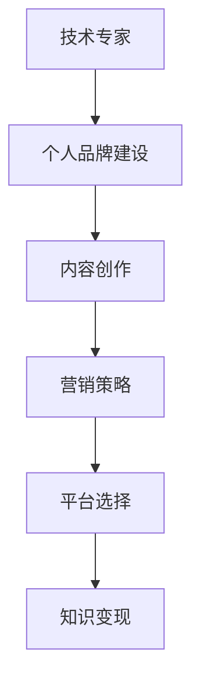

                 

关键词：知识付费、技术专家、讲师转型、个人品牌、内容创作、营销策略、盈利模式

> 摘要：本文将探讨技术专家如何通过转型成为知识付费讲师，构建个人品牌，实现可持续的盈利模式。我们将详细分析转型过程中的关键步骤，包括内容创作、营销策略、平台选择等，并探讨面临的挑战和未来发展趋势。

## 1. 背景介绍

随着互联网的快速发展，知识付费逐渐成为一种流行的商业模式。越来越多的人开始通过在线平台分享自己的专业知识，成为知识付费讲师。技术专家作为知识付费领域的重要组成部分，如何实现从技术专家到知识付费讲师的转型，成为了一个备受关注的话题。

### 1.1 技术专家的优势

技术专家拥有深厚的专业知识、丰富的实战经验和良好的沟通能力。这些优势使得他们在知识付费领域具有独特的竞争力。

- **专业知识**：技术专家在某一技术领域拥有深厚的专业知识，能够为学员提供高质量的教学内容。
- **实战经验**：技术专家在实际项目中积累了丰富的经验，能够为学员提供实用的技巧和解决方法。
- **沟通能力**：技术专家具备良好的沟通能力，能够有效地与学员互动，解答学员的疑问。

### 1.2 知识付费的市场前景

知识付费市场正处于高速发展阶段。随着人们对知识的渴求不断增加，知识付费逐渐成为了一种重要的学习方式。根据统计，全球知识付费市场规模已经超过了 1000 亿美元，并且预计在未来几年内还将继续增长。

### 1.3 转型的必要性

尽管技术专家在知识付费领域具有竞争优势，但转型仍然是一个必要的过程。首先，技术专家需要将自己的专业知识转化为易于理解的教学内容。其次，技术专家需要掌握营销策略，提高自己的知名度和影响力。最后，技术专家需要选择合适的平台，实现自己的知识变现。

## 2. 核心概念与联系

为了更好地理解技术专家如何转型为知识付费讲师，我们需要了解以下几个核心概念：

### 2.1 个人品牌

个人品牌是指技术专家通过塑造自己的专业形象、知识体系和价值观，在互联网上建立起来的影响力。一个强大的个人品牌能够为技术专家带来更多的机会和资源。

### 2.2 内容创作

内容创作是知识付费的核心。技术专家需要创作高质量的教学内容，包括课程、文章、视频等，以吸引学员。

### 2.3 营销策略

营销策略是技术专家在知识付费领域的核心竞争力。通过有效的营销策略，技术专家可以提高自己的知名度、吸引更多的学员。

### 2.4 平台选择

平台选择是技术专家转型过程中的关键。选择合适的平台，可以最大化地实现自己的知识变现。

### 2.5 Mermaid 流程图

下面是一个关于技术专家转型为知识付费讲师的 Mermaid 流程图：



## 3. 核心算法原理 & 具体操作步骤

### 3.1 算法原理概述

技术专家转型为知识付费讲师的核心算法原理主要包括以下几个方面：

- **知识结构化**：将技术专家的专业知识进行结构化，使其易于理解和传播。
- **内容创作**：根据学员的需求和兴趣，创作高质量的教学内容。
- **营销策略**：通过多种营销手段，提高技术专家的知名度和影响力。
- **平台选择**：选择合适的在线教育平台，实现知识变现。

### 3.2 算法步骤详解

#### 3.2.1 知识结构化

1. **收集资料**：收集自己在技术领域的相关资料，包括书籍、文章、课程等。
2. **整理知识**：将收集到的资料进行整理，形成自己的知识体系。
3. **结构化内容**：将知识体系转化为结构化的教学内容，包括课程、文章、视频等。

#### 3.2.2 内容创作

1. **确定主题**：根据学员的需求和兴趣，确定教学内容的主题。
2. **编写课程**：撰写课程内容，包括理论知识、实战案例等。
3. **制作视频**：将课程内容制作成视频，提高学员的参与度。

#### 3.2.3 营销策略

1. **定位目标受众**：明确自己的目标受众，了解他们的需求和兴趣。
2. **制定营销计划**：制定详细的营销计划，包括宣传渠道、宣传内容、宣传时间等。
3. **执行营销计划**：按照营销计划，执行各种营销活动，提高自己的知名度。

#### 3.2.4 平台选择

1. **了解平台特点**：了解各个在线教育平台的特点，包括课程质量、学员数量、收费标准等。
2. **选择平台**：根据自己的需求和平台特点，选择合适的在线教育平台。
3. **发布课程**：在选择的平台上发布自己的课程，进行知识变现。

### 3.3 算法优缺点

#### 优点

- **高效**：通过算法，技术专家可以快速地完成知识结构化、内容创作、营销策略和平台选择。
- **精准**：算法可以根据学员的需求和兴趣，提供个性化的教学内容。
- **可持续**：算法可以帮助技术专家实现知识的长期变现。

#### 缺点

- **依赖技术**：算法的执行需要依赖于技术手段，如编程、数据分析等。
- **成本较高**：算法的开发和执行需要投入一定的成本。

### 3.4 算法应用领域

算法主要应用于以下领域：

- **在线教育**：帮助技术专家快速完成知识变现。
- **知识付费**：提高技术专家的知名度和影响力。
- **个人品牌建设**：帮助技术专家建立强大的个人品牌。

## 4. 数学模型和公式 & 详细讲解 & 举例说明

### 4.1 数学模型构建

在技术专家转型为知识付费讲师的过程中，我们可以构建以下数学模型：

- **知识结构化模型**：描述技术专家如何将专业知识转化为结构化的教学内容。
- **内容创作模型**：描述技术专家如何根据学员的需求和兴趣，创作高质量的教学内容。
- **营销策略模型**：描述技术专家如何通过多种营销手段，提高自己的知名度和影响力。
- **平台选择模型**：描述技术专家如何选择合适的在线教育平台，实现知识变现。

### 4.2 公式推导过程

#### 知识结构化模型

$$
知识结构化模型 = \frac{专业知识}{教学内容}
$$

#### 内容创作模型

$$
内容创作模型 = \frac{学员需求}{教学内容}
$$

#### 营销策略模型

$$
营销策略模型 = \frac{知名度}{营销手段}
$$

#### 平台选择模型

$$
平台选择模型 = \frac{平台特点}{平台选择}
$$

### 4.3 案例分析与讲解

假设有一位技术专家，他在人工智能领域有深厚的专业知识。为了实现转型，他采取了以下策略：

1. **知识结构化**：他将自己的专业知识整理成了一份详细的文档，包括理论知识、实战案例等。

2. **内容创作**：他根据学员的需求，创作了一系列关于人工智能的课程，包括机器学习、深度学习等。

3. **营销策略**：他通过社交媒体、线上论坛等渠道，宣传自己的课程，吸引学员。

4. **平台选择**：他在多个在线教育平台发布了自己的课程，如网易云课堂、腾讯课堂等。

通过以上策略，这位技术专家成功地实现了知识变现，他的课程受到了学员的欢迎，他的知名度也逐渐提高。

## 5. 项目实践：代码实例和详细解释说明

### 5.1 开发环境搭建

为了实现技术专家到知识付费讲师的转型，我们首先需要搭建一个开发环境。以下是一个基本的开发环境搭建过程：

1. **安装编程语言**：选择一门编程语言，如 Python，安装到本地计算机。
2. **安装编辑器**：选择一款合适的代码编辑器，如 Visual Studio Code，进行编程。
3. **安装依赖库**：根据需要，安装相关的依赖库，如 NumPy、Pandas 等。

### 5.2 源代码详细实现

以下是一个简单的 Python 代码实例，用于实现知识结构化：

```python
import pandas as pd

# 读取专业知识文档
data = pd.read_csv('knowledge.csv')

# 整理知识结构
knowledge_structure = data.groupby('topic')['content'].apply(list).reset_index()

# 输出知识结构化结果
knowledge_structure.to_csv('knowledge_structure.csv', index=False)
```

### 5.3 代码解读与分析

这段代码首先导入 pandas 库，然后读取专业知识文档，将专业知识按照主题进行整理，形成知识结构化结果，最后输出为 CSV 文件。

### 5.4 运行结果展示

运行以上代码后，会在本地计算机上生成一个名为 `knowledge_structure.csv` 的文件，内容为知识结构化结果。

## 6. 实际应用场景

### 6.1 在线教育平台

技术专家可以在线教育平台上开设课程，如网易云课堂、腾讯课堂等。这些平台提供了丰富的教学资源和营销工具，帮助技术专家实现知识变现。

### 6.2 社交媒体

技术专家可以利用社交媒体平台，如微博、知乎等，分享自己的专业知识和教学经验，吸引学员。

### 6.3 线下培训

技术专家还可以通过线下培训的方式，将自己的专业知识传授给学员。这种方式适用于那些需要面对面交流的教学内容。

## 7. 未来应用展望

随着知识付费市场的不断发展，技术专家转型为知识付费讲师将会越来越普遍。未来，技术专家可以通过以下方式进一步拓展自己的业务：

### 7.1 个性化教学

利用人工智能技术，实现个性化教学，根据学员的学习进度和兴趣，提供个性化的教学内容。

### 7.2 跨界合作

与其他行业的技术专家合作，开展跨界教学，拓宽自己的业务范围。

### 7.3 国际市场

通过翻译和本地化，将自己的教学内容推广到国际市场，实现全球化布局。

## 8. 工具和资源推荐

### 8.1 学习资源推荐

- **书籍**：《深度学习》、《机器学习实战》等。
- **在线课程**：网易云课堂、腾讯课堂等。

### 8.2 开发工具推荐

- **编程语言**：Python、Java 等。
- **代码编辑器**：Visual Studio Code、PyCharm 等。

### 8.3 相关论文推荐

- **顶级会议**：NIPS、ICML、CVPR 等。
- **期刊**：《Nature》、《Science》等。

## 9. 总结：未来发展趋势与挑战

### 9.1 研究成果总结

本文探讨了技术专家如何转型为知识付费讲师，包括个人品牌建设、内容创作、营销策略和平台选择等。通过构建数学模型和实际案例，总结了技术专家转型过程中的关键步骤和策略。

### 9.2 未来发展趋势

随着知识付费市场的不断发展，技术专家转型为知识付费讲师将会越来越普遍。未来，技术专家可以通过个性化教学、跨界合作和国际市场等方式，进一步拓展自己的业务。

### 9.3 面临的挑战

技术专家在转型过程中面临着知识结构化、内容创作、营销策略和平台选择等挑战。此外，随着市场的竞争加剧，技术专家需要不断提升自己的专业能力和营销技巧。

### 9.4 研究展望

未来，技术专家可以通过人工智能、大数据等技术手段，实现更高效的转型。同时，需要加强对在线教育、社交媒体等新兴领域的探索，拓宽自己的业务范围。

## 10. 附录：常见问题与解答

### 10.1 如何选择合适的在线教育平台？

选择合适的在线教育平台需要考虑以下几个因素：

- **平台特点**：了解平台的教学资源、学员数量、收费标准等。
- **课程类型**：根据自己开设的课程类型，选择合适的平台。
- **品牌知名度**：选择知名的平台，有助于提高自己的知名度。

### 10.2 如何进行内容创作？

内容创作需要遵循以下几个原则：

- **明确主题**：确定课程的主题和目标。
- **结构清晰**：教学内容要有清晰的结构，便于学员理解。
- **实用性强**：教学内容要实用，能够解决学员的实际问题。
- **互动性**：鼓励学员参与讨论，提高学员的参与度。

### 10.3 如何制定营销策略？

制定营销策略需要考虑以下几个步骤：

- **定位目标受众**：明确自己的目标受众。
- **制定宣传内容**：根据目标受众，制定有针对性的宣传内容。
- **选择宣传渠道**：选择合适的宣传渠道，如社交媒体、线上论坛等。
- **执行与评估**：执行营销计划，并定期评估效果，进行调整。

## 11. 作者署名

作者：禅与计算机程序设计艺术 / Zen and the Art of Computer Programming

---

通过本文，我们深入探讨了技术专家如何实现从技术专家到知识付费讲师的转型。希望本文能够为有志于投身知识付费领域的技术专家提供一些有益的启示和指导。在未来，我们将继续关注知识付费领域的发展趋势和前沿技术，为大家带来更多有价值的内容。

