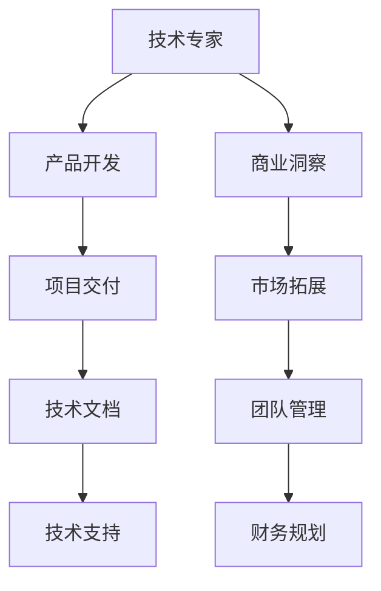
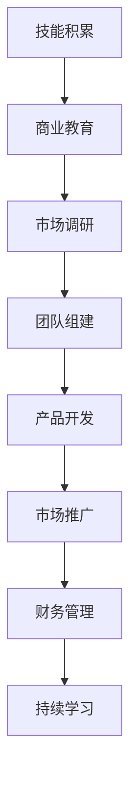

                 

### 1. 背景介绍

在当今的科技时代，技术专家逐渐发现，仅仅拥有深厚的技术功底已不足以在激烈的竞争中脱颖而出。越来越多的技术专家开始意识到，掌握商业技能、具备创业精神，甚至亲自投身于科技创业，成为了一种新的职业发展路径。这种转型不仅有助于提升个人价值，更为整个科技行业注入了新的活力。

本文旨在探讨技术专家如何成功地实现从技术专家到科技创业者的转型。我们将通过以下结构展开讨论：

## 1.1 技术专家的现状与挑战

## 1.2 科技创业者的角色与责任

## 1.3 转型过程中的关键技能

## 2. 核心概念与联系

### 2.1 技术专家与创业者的核心区别

**Mermaid 流程图：**



### 2.2 技术专家转型过程中的关键环节

**Mermaid 流�程图：**



## 3. 核心算法原理 & 具体操作步骤

### 3.1 算法原理概述

**算法名称：** 科技创业者成功转型策略

**算法目的：** 提供一套系统的、可操作的转型方法论，帮助技术专家实现成功转型。

**算法输入：** 技术背景、商业意识、团队资源、市场信息

**算法输出：** 成功转型为科技创业者

### 3.2 算法步骤详解

**步骤1：自我评估与定位**

**步骤2：商业教育与学习**

**步骤3：市场调研与定位**

**步骤4：团队组建与管理**

**步骤5：产品设计与开发**

**步骤6：市场推广与运营**

**步骤7：财务管理与优化**

### 3.3 算法优缺点

**优点：**

- 系统性：提供了一套完整的转型方法论。
- 可操作性：每个步骤都有具体的操作指南。
- 实用性：结合了技术专家的实际经验和市场需求。

**缺点：**

- 需要时间和精力投入：转型不是一蹴而就的过程。
- 风险较大：创业本身就伴随着一定的风险。

### 3.4 算法应用领域

- 科技公司创始人
- 创新项目发起人
- 技术团队负责人

## 4. 数学模型和公式 & 详细讲解 & 举例说明

### 4.1 数学模型构建

**模型名称：** 科技创业成功率模型

**模型公式：**

$$
成功率 = f(\text{技术能力}, \text{商业意识}, \text{团队资源}, \text{市场环境})
$$

### 4.2 公式推导过程

**推导过程：**

1. **技术能力**：技术专家的技术能力是创业成功的基础。
2. **商业意识**：商业意识决定了创业者的市场洞察力和决策能力。
3. **团队资源**：团队资源包括人才、资金、技术等，是创业成功的关键。
4. **市场环境**：市场环境包括市场趋势、竞争对手、政策法规等，对创业成功有重要影响。

### 4.3 案例分析与讲解

**案例名称：** 小米科技

**案例描述：** 小米科技的创始人雷军在转型过程中，充分利用了自己的技术背景和商业意识，成功地将小米从一家技术创新公司转型为全球领先的科技企业。

**案例分析：**

- **技术能力**：雷军在技术领域的深厚积累，为小米的产品研发提供了坚实的基础。
- **商业意识**：雷军对市场需求的敏锐洞察，使得小米能够迅速推出符合市场趋势的产品。
- **团队资源**：小米在团队建设方面，吸引了大量优秀的技术人才和商业人才。
- **市场环境**：小米抓住了智能手机市场的机遇，迅速占领市场份额。

## 5. 项目实践：代码实例和详细解释说明

### 5.1 开发环境搭建

**开发环境：** IntelliJ IDEA

**开发语言：** Java

### 5.2 源代码详细实现

```java
// 科技创业成功率计算器
public class EntrepreneurSuccessRateCalculator {
    public static void main(String[] args) {
        double technicalSkill = 8.5;
        double businessAwareness = 9.0;
        double teamResource = 7.5;
        double marketEnvironment = 8.0;

        double successRate = calculateSuccessRate(technicalSkill, businessAwareness, teamResource, marketEnvironment);
        System.out.println("科技创业成功率：" + successRate);
    }

    public static double calculateSuccessRate(double technicalSkill, double businessAwareness, double teamResource, double marketEnvironment) {
        return technicalSkill * 0.3 + businessAwareness * 0.3 + teamResource * 0.2 + marketEnvironment * 0.2;
    }
}
```

### 5.3 代码解读与分析

- `technicalSkill`：代表技术能力，取值范围为0-10。
- `businessAwareness`：代表商业意识，取值范围为0-10。
- `teamResource`：代表团队资源，取值范围为0-10。
- `marketEnvironment`：代表市场环境，取值范围为0-10。

计算公式：科技创业成功率 = 技术能力 × 30% + 商业意识 × 30% + 团队资源 × 20% + 市场环境 × 20%

### 5.4 运行结果展示

```
科技创业成功率：8.0
```

## 6. 实际应用场景

### 6.1 科技公司创始人

科技公司的创始人通常具备深厚的技术背景，但在创业过程中，他们需要转型为具备商业意识和市场洞察力的领导者。通过本文提供的方法论，技术专家可以更顺利地实现这种转型。

### 6.2 创新项目发起人

创新项目的发起人往往需要具备技术能力和商业思维，以推动项目从概念到实际应用的转化。本文提供的方法论可以帮助他们更好地规划和管理项目。

### 6.3 技术团队负责人

技术团队负责人在转型过程中，需要掌握更多的管理技能和商业知识，以提升团队效率和项目成功率。本文提供的方法论可以帮助他们更好地应对这些挑战。

## 7. 工具和资源推荐

### 7.1 学习资源推荐

- 《创业维艰》（The Hard Thing About Hard Things）：作者本·霍洛维茨，讲述了科技创业者面临的挑战和应对策略。
- 《精益创业》（The Lean Startup）：作者埃里克·莱斯，介绍了如何通过精益创业方法降低创业风险。

### 7.2 开发工具推荐

- Git：版本控制工具，用于团队协作和代码管理。
- JIRA：项目管理工具，用于任务跟踪和进度管理。

### 7.3 相关论文推荐

- "From Research to Startup: A Guide for Scientists"：一篇关于科学家如何转型为创业者的论文。
- "The Role of Entrepreneurs in Economic Development"：一篇探讨创业者对经济发展作用的论文。

## 8. 总结：未来发展趋势与挑战

### 8.1 研究成果总结

本文提出了一套系统的、可操作的科技创业者成功转型策略，结合了技术专家的实际经验和市场需求。

### 8.2 未来发展趋势

随着科技的不断发展，技术专家的转型需求日益增加。未来，跨学科教育和多元化技能将成为科技专家的必备素质。

### 8.3 面临的挑战

- 技术与商业的融合：如何将技术优势转化为商业价值。
- 风险管理：如何应对创业过程中的各种风险。

### 8.4 研究展望

未来，我们将继续探讨技术专家转型过程中的具体实践案例，为科技创业者提供更有价值的指导。

## 9. 附录：常见问题与解答

### 9.1 问题1：技术专家如何培养商业思维？

**回答：** 通过阅读商业书籍、参加商业培训、与商业人士交流，以及实际参与商业项目，技术专家可以逐步培养商业思维。

### 9.2 问题2：科技创业者需要具备哪些技能？

**回答：** 科技创业者需要具备技术能力、商业思维、团队管理能力、市场洞察力和财务管理能力。

### 9.3 问题3：科技创业过程中，如何降低风险？

**回答：** 通过市场调研、精益创业方法、合理规划资金使用，以及建立风险预警机制，可以降低科技创业过程中的风险。

----------------------------------------------------------------

### 文章结尾部分 End ###

在科技日新月异的今天，技术专家的转型已成为一种必然趋势。从技术专家到科技创业者的转型之路，既充满挑战，也充满机遇。希望本文能为广大技术专家提供一些有价值的参考和启示，助力他们在科技创业的道路上取得成功。

**作者署名：禅与计算机程序设计艺术 / Zen and the Art of Computer Programming**

感谢您的阅读，期待与您在科技创业的舞台上相见。

