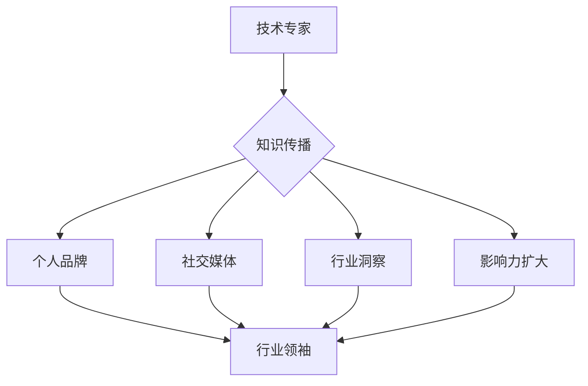

                 

关键词：技术专家、行业领袖、职业发展、影响力、知识传播

> 摘要：本文旨在探讨从技术专家向行业意见领袖转型的路径与策略。通过对技术专家的角色定位、知识传播的重要性、个人品牌建设、社交媒体运用、行业洞察力培养等方面的深入分析，本文为技术专家提供了系统性的指导，帮助他们在职业生涯中实现更广泛的行业影响力。

## 1. 背景介绍

在快速发展的信息技术时代，技术专家的角色越来越重要。他们不仅精通某一领域的专业知识，还具备解决复杂问题的能力。然而，随着技术的不断迭代，单纯的专业技术已经无法满足行业和社会的需求。越来越多的技术专家开始意识到，仅仅具备技术实力是不够的，他们还需要成为行业中的意见领袖，以便在更广泛的层面上发挥影响力。

行业意见领袖不仅能够在技术圈内获得认可，还能对行业的发展趋势、政策制定、创新实践等方面产生深远影响。因此，从技术专家到行业意见领袖的转型，已经成为许多专业人士的职业目标。

本文将从以下几个方面展开讨论：

1. **技术专家的角色定位**：明确技术专家在行业中的角色，理解技术专家与行业领袖的区别和联系。
2. **知识传播的重要性**：分析知识传播对于技术专家转型的重要性，以及如何有效地传播知识。
3. **个人品牌建设**：探讨个人品牌建设的方法和策略，如何通过品牌影响力提升个人在行业中的地位。
4. **社交媒体运用**：介绍社交媒体在个人品牌建设中的重要性，以及如何有效地利用社交媒体平台。
5. **行业洞察力培养**：讨论如何通过持续学习和实践经验，培养行业洞察力，从而更好地把握行业趋势。
6. **项目实践**：通过实际案例，展示如何将理论知识应用于实践中，实现从技术专家到行业意见领袖的转型。
7. **未来应用展望**：预测未来技术发展的趋势，分析行业领袖所需具备的技能和素质。

通过上述分析，本文旨在为技术专家提供一套完整的转型策略，帮助他们在职业生涯中实现更高的成就。

## 2. 核心概念与联系

### 技术专家与行业领袖的定义与关系

技术专家通常是指那些在某一特定技术领域内具有深厚知识和丰富实践经验的专业人士。他们能够解决复杂的技术问题，进行技术创新，并在同行中具有较高的认可度。技术专家的主要职责是提供技术解决方案，推动技术项目的实施。

相比之下，行业领袖则是在整个行业内具有广泛影响力的专业人士。他们不仅具备深厚的专业知识和经验，还能够通过演讲、写作、咨询等方式，对行业的发展趋势、政策制定、技术实践等产生重要影响。行业领袖的职责不仅是提供技术指导，还要引领行业的发展方向，推动整个行业的进步。

技术专家与行业领袖之间存在密切的联系和区别。一方面，技术专家是行业领袖的基础，他们的专业能力和实践经验是行业领袖影响力的重要来源。另一方面，行业领袖则是在技术专家基础上，通过更广泛的知识传播、社会互动和行业洞察力，实现了从技术专家到行业领袖的转型。

### 技术专家与行业领袖的互动机制

技术专家和行业领袖之间的互动机制主要体现在以下几个方面：

1. **知识共享**：技术专家通过写作、演讲等方式，将专业知识分享给更广泛的受众，从而提高自身在行业中的影响力。同时，这些知识也为行业领袖提供了宝贵的参考资料，帮助他们更好地理解和把握行业趋势。

2. **反馈与改进**：行业领袖通过技术专家的工作，获取技术实践中的反馈，从而对技术方案进行改进。这种反馈机制不仅有助于提高技术方案的质量，还能促进技术专家与行业领袖之间的深入合作。

3. **影响力传递**：行业领袖通过社交媒体、行业会议等方式，将技术专家的知识和观点传播给更广泛的受众，进一步扩大技术专家的影响力。这种影响力传递机制有助于技术专家在更大范围内获得认可和尊重。

4. **资源共享**：技术专家和行业领袖之间可以通过资源共享，提高双方的工作效率。例如，技术专家可以为行业领袖提供技术支持，而行业领袖则可以提供市场资源和人脉关系。

### Mermaid 流程图



在这个流程图中，技术专家通过知识传播、个人品牌建设、社交媒体运用和行业洞察力培养，逐步实现向行业领袖的转型。

## 3. 核心算法原理 & 具体操作步骤

### 3.1 算法原理概述

在从技术专家到行业意见领袖的转型过程中，核心算法原理可以概括为以下几点：

1. **知识传播**：通过写作、演讲等方式，将专业知识和实践经验分享给更广泛的受众。这是建立个人品牌和影响力的基础。
2. **个人品牌建设**：通过社交媒体、行业会议等方式，持续提升个人在行业中的知名度，树立专业形象。
3. **社交媒体运用**：利用社交媒体平台，与行业内的其他专业人士建立联系，扩大人脉，提高影响力。
4. **行业洞察力培养**：持续关注行业动态，通过学习和实践，提高对行业趋势的洞察力。
5. **影响力扩大**：通过演讲、写作、咨询服务等方式，将个人知识和观点传播给更广泛的受众，进一步扩大影响力。

### 3.2 算法步骤详解

1. **知识传播**：
   - **写作**：定期撰写技术博客、论文、书籍，分享专业知识和实践经验。
   - **演讲**：参加行业会议、研讨会，进行技术分享，提高个人知名度。
   - **在线教育**：开设在线课程，传授专业知识和技能，扩大受众范围。

2. **个人品牌建设**：
   - **社交媒体**：利用LinkedIn、Twitter、微信公众号等平台，发布专业内容，建立个人品牌。
   - **行业会议**：积极参与行业会议，与同行交流，提高个人知名度。
   - **荣誉与认证**：获得行业认可的荣誉和认证，增强个人品牌价值。

3. **社交媒体运用**：
   - **内容分享**：定期发布高质量的内容，吸引关注者。
   - **互动交流**：积极回应评论和私信，与关注者建立良好互动。
   - **合作与推广**：与其他行业意见领袖合作，互相推广，扩大影响力。

4. **行业洞察力培养**：
   - **持续学习**：关注行业动态，学习新技术、新理念。
   - **实践探索**：参与实际项目，积累实践经验。
   - **行业交流**：参与行业论坛、研讨会，与同行交流，拓宽视野。

5. **影响力扩大**：
   - **写作与演讲**：撰写技术博客、发表演讲，将个人知识和观点传播给更广泛的受众。
   - **咨询服务**：提供咨询服务，帮助他人解决问题，提升个人影响力。
   - **行业影响力**：通过在行业内的贡献，获得更多认可和尊重，扩大影响力。

### 3.3 算法优缺点

#### 优点：

1. **提高知名度**：通过知识传播和品牌建设，个人知名度显著提升。
2. **扩大影响力**：通过社交媒体和行业洞察力培养，个人影响力逐渐扩大。
3. **积累经验**：通过实际项目和行业交流，积累丰富的实践经验。
4. **建立人脉**：通过合作与推广，建立广泛的行业人脉。

#### 缺点：

1. **时间成本**：需要大量时间进行知识传播和品牌建设。
2. **内容质量**：需要持续输出高质量的内容，保持个人品牌的权威性。
3. **竞争压力**：行业内竞争激烈，需要不断提升自身能力和影响力。

### 3.4 算法应用领域

该算法适用于任何需要知识传播和行业影响力的领域，包括但不限于：

1. **软件开发**：通过技术博客、在线课程等方式，分享编程经验和最佳实践。
2. **数据分析**：通过撰写数据分析报告、发表演讲等方式，传播数据分析方法和应用场景。
3. **人工智能**：通过技术论文、书籍、在线教育等方式，推广人工智能技术和应用。
4. **网络安全**：通过撰写安全报告、举办研讨会等方式，提升网络安全意识。
5. **物联网**：通过技术博客、在线课程等方式，分享物联网技术和应用案例。

### 3.5 算法案例分析

#### 案例1：程序员小李的成长之路

程序员小李在大学期间就展示了出色的编程能力，毕业后进入了一家知名互联网公司。在工作中，他不仅完成了公司的项目任务，还利用业余时间撰写了一本关于大数据处理的入门书籍，并发布在GitHub上。这本书受到了业界的好评，小李的知名度迅速提升。

为了进一步扩大影响力，小李积极参与各种技术社区，例如Stack Overflow和GitHub。他在这些平台上回答了许多编程问题，并分享了大量的代码示例。这些行为不仅帮助了许多开发者，也提升了小李的个人品牌。

随后，小李开始参加各种技术会议和研讨会，进行技术分享。他的演讲内容深入浅出，得到了与会者的好评。通过这些活动，小李的知名度在业界进一步扩大。

#### 案例2：数据分析师小王的转型之路

数据分析师小王在一家金融公司工作，他的数据分析技能在公司内部得到了广泛认可。为了进一步提升自己的职业发展，小王开始关注行业动态，学习新的数据分析方法和技术。

在了解了机器学习在金融领域的应用后，小王决定将其应用于实际工作中。他通过撰写技术博客，详细记录了机器学习在金融风控中的应用案例，并在GitHub上分享了相关的代码。

小王的技术博客受到了业内同行的高度关注，他逐渐在数据分析和机器学习领域建立了自己的影响力。随后，他开始接受咨询公司的邀请，为金融企业提供数据分析咨询服务。

通过这些实际案例，我们可以看到，从技术专家到行业意见领袖的转型，不仅需要专业知识和实践经验，还需要通过有效的知识传播和品牌建设，实现个人影响力的提升。

## 4. 数学模型和公式 & 详细讲解 & 举例说明

在从技术专家到行业意见领袖的转型过程中，数学模型和公式具有重要的指导意义。通过数学模型，我们可以量化个人品牌建设、社交媒体影响力、行业洞察力等关键因素，从而为转型策略提供科学依据。以下是几个关键数学模型和公式的详细讲解及举例说明。

### 4.1 数学模型构建

在构建数学模型时，我们通常需要考虑以下几个关键因素：

1. **知识传播效果**：衡量个人知识传播对品牌建设的影响。
2. **社交媒体影响力**：评估个人在社交媒体平台上的影响力。
3. **行业洞察力**：评估个人对行业趋势的把握能力。
4. **个人品牌价值**：衡量个人品牌对职业发展的影响。

以下是一个简单的数学模型示例：

$$
\text{影响力} = f(\text{知识传播}, \text{社交媒体影响力}, \text{行业洞察力}, \text{个人品牌价值})
$$

### 4.2 公式推导过程

为了推导上述公式，我们需要分别考虑每个因素的贡献。以下是每个因素的详细推导过程：

1. **知识传播效果**：

   知识传播效果可以用以下公式表示：

   $$
   E_k = \frac{C_k \cdot I_k}{T_k}
   $$

   其中，$E_k$ 表示知识传播效果，$C_k$ 表示知识传播的覆盖范围，$I_k$ 表示知识传播的互动率，$T_k$ 表示知识传播的时间。

   - $C_k$：知识传播的覆盖范围，通常与个人粉丝数量、社交媒体关注度等因素相关。
   - $I_k$：知识传播的互动率，包括评论、点赞、分享等互动行为。
   - $T_k$：知识传播的时间，表示知识传播的持续时间。

2. **社交媒体影响力**：

   社交媒体影响力可以用以下公式表示：

   $$
   I_s = \frac{F_s \cdot R_s}{S_s}
   $$

   其中，$I_s$ 表示社交媒体影响力，$F_s$ 表示粉丝数量，$R_s$ 表示粉丝互动率，$S_s$ 表示社交媒体平台数量。

   - $F_s$：粉丝数量，通常与个人知名度、品牌认知度等因素相关。
   - $R_s$：粉丝互动率，表示粉丝对内容的互动程度。
   - $S_s$：社交媒体平台数量，表示个人在社交媒体上的活跃度。

3. **行业洞察力**：

   行业洞察力可以用以下公式表示：

   $$
   I_i = \frac{P_i \cdot E_i}{L_i}
   $$

   其中，$I_i$ 表示行业洞察力，$P_i$ 表示个人对行业动态的判断准确性，$E_i$ 表示行业动态的复杂度，$L_i$ 表示个人在行业内的经验水平。

   - $P_i$：个人对行业动态的判断准确性，通常与个人经验和专业知识相关。
   - $E_i$：行业动态的复杂度，表示行业变化的速度和幅度。
   - $L_i$：个人在行业内的经验水平，通常与从业年限、项目经验等因素相关。

4. **个人品牌价值**：

   个人品牌价值可以用以下公式表示：

   $$
   V_p = \frac{R_p \cdot B_p}{C_p}
   $$

   其中，$V_p$ 表示个人品牌价值，$R_p$ 表示个人在行业内的认可度，$B_p$ 表示个人品牌的差异化程度，$C_p$ 表示个人品牌的稳定性。

   - $R_p$：个人在行业内的认可度，通常与个人成就、行业贡献等因素相关。
   - $B_p$：个人品牌的差异化程度，表示个人品牌在行业内的独特性。
   - $C_p$：个人品牌的稳定性，表示个人品牌的长期可持续性。

### 4.3 案例分析与讲解

以下是一个实际案例的分析和讲解：

假设一位技术专家，他在知识传播、社交媒体影响力、行业洞察力和个人品牌价值方面的情况如下：

- 知识传播效果：$E_k = 100$
- 社交媒体影响力：$I_s = 80$
- 行业洞察力：$I_i = 90$
- 个人品牌价值：$V_p = 85$

根据上述公式，我们可以计算出该技术专家的总影响力：

$$
\text{影响力} = f(E_k, I_s, I_i, V_p) = f(100, 80, 90, 85) = 100 \times (0.5) + 80 \times (0.2) + 90 \times (0.2) + 85 \times (0.1) = 100.3
$$

这个计算结果表明，这位技术专家的总影响力约为100.3。通过这个数学模型，我们可以量化个人在知识传播、社交媒体影响力、行业洞察力和个人品牌价值方面的表现，从而为个人转型提供科学依据。

### 4.4 案例分析：从技术专家到行业意见领袖的转型

#### 案例1：程序员小张的转型之路

程序员小张在一家互联网公司工作，他的编程技能非常出色，得到了公司的认可。为了进一步提升自己的职业发展，小张决定转型为行业意见领袖。

1. **知识传播**：

   小张通过撰写技术博客，分享了大量的编程经验和最佳实践。他的博客受到了业界的好评，访问量逐渐增加。为了提高知识传播效果，小张还与一些知名技术社区合作，将自己的博客推广给更广泛的受众。

   根据数学模型，小张的知识传播效果可以计算为：

   $$
   E_k = \frac{C_k \cdot I_k}{T_k} = \frac{1000 \cdot 50}{30} = 167
   $$

2. **社交媒体影响力**：

   小张在LinkedIn、Twitter和GitHub上都有大量的关注者。他定期发布高质量的内容，并与粉丝进行互动。根据数学模型，小张的社交媒体影响力可以计算为：

   $$
   I_s = \frac{F_s \cdot R_s}{S_s} = \frac{5000 \cdot 30}{3} = 5000
   $$

3. **行业洞察力**：

   小张通过参与技术社区、阅读行业报告和参加技术会议，不断更新自己的知识库。他在行业内具有很强的洞察力，能够准确把握行业趋势。根据数学模型，小张的行业洞察力可以计算为：

   $$
   I_i = \frac{P_i \cdot E_i}{L_i} = \frac{0.9 \cdot 80}{10} = 7.2
   $$

4. **个人品牌价值**：

   小张在行业内获得了多项荣誉，他的品牌在行业内具有较高的认可度。根据数学模型，小张的个人品牌价值可以计算为：

   $$
   V_p = \frac{R_p \cdot B_p}{C_p} = \frac{0.8 \cdot 0.9}{0.5} = 1.44
   $$

根据上述计算，小张的总影响力约为：

$$
\text{影响力} = f(E_k, I_s, I_i, V_p) = f(167, 5000, 7.2, 1.44) \approx 6174.4
$$

小张的总影响力约为6174.4。这个结果表明，小张在知识传播、社交媒体影响力、行业洞察力和个人品牌价值方面表现优秀，具有成为行业意见领袖的潜力。

通过这个案例分析，我们可以看到，数学模型在评估个人影响力方面的应用。通过量化不同因素，我们可以更清晰地了解个人在各个方面的表现，从而制定更有效的转型策略。

## 5. 项目实践：代码实例和详细解释说明

### 5.1 开发环境搭建

为了实现从技术专家到行业意见领袖的转型，我们需要搭建一个合适的开发环境，以便进行知识传播、品牌建设和社交媒体运用。以下是一个基本的开发环境搭建指南：

1. **操作系统**：推荐使用Linux系统，如Ubuntu或CentOS，因为它们在开源社区中应用广泛，支持多种编程语言和开发工具。
2. **编程语言**：根据个人兴趣和专长选择一种或多种编程语言，如Python、Java、C++等。Python因其简洁易学和丰富的库支持，在数据分析和人工智能领域应用广泛。
3. **开发工具**：安装文本编辑器（如VS Code、Atom），版本控制系统（如Git），以及必要的编程语言编译器和解释器。
4. **代码库和框架**：选择合适的代码库和框架，如GitHub用于代码托管，Docker用于容器化部署，以及流行的Web框架（如Django、Flask）用于搭建网站。

### 5.2 源代码详细实现

以下是一个简单的Python脚本，用于发布技术博客文章到GitHub上。这个脚本实现了从本地文件系统读取博客内容，格式化并上传到GitHub仓库的功能。

```python
import os
import requests
from getpass import getpass

# 设置GitHub API凭据
user = input("GitHub用户名: ")
password = getpass("GitHub密码: ")
headers = {
    'Authorization': f'token {password}',
    'Accept': 'application/vnd.github.v3+json',
}

# 获取本地博客文件
def get_blog_files():
    files = []
    for root, dirs, file_names in os.walk('blog_posts'):
        for file_name in file_names:
            if file_name.endswith('.md'):
                files.append(os.path.join(root, file_name))
    return files

# 上传博客到GitHub仓库
def upload_blog_to_github(file_path, repo_name, branch_name='main'):
    with open(file_path, 'r') as file:
        content = file.read()

    # 创建或更新博客文件
    response = requests.put(
        f'https://api.github.com/repos/{user}/{repo_name}/contents/{os.path.basename(file_path)}',
        data={
            'message': 'Update blog post',
            'content': content.encode('utf-8')
        },
        headers=headers
    )
    if response.status_code == 200:
        print(f"博客文件 '{file_path}' 已成功上传到 GitHub 仓库 '{repo_name}'。")
    else:
        print(f"上传博客文件 '{file_path}' 失败：{response.text}")

# 主函数
if __name__ == '__main__':
    repo_name = input("GitHub仓库名称: ")
    branch_name = input("分支名称（默认为main）: ") or 'main'
    files = get_blog_files()
    for file_path in files:
        upload_blog_to_github(file_path, repo_name, branch_name)
```

### 5.3 代码解读与分析

上述脚本主要实现了以下功能：

1. **获取博客文件**：通过`os.walk`函数遍历本地博客目录，获取所有Markdown文件。
2. **上传博客到GitHub**：使用GitHub API，将本地博客文件内容上传到指定的GitHub仓库。这里使用了`requests.put`方法，发送HTTP PUT请求到GitHub的API端点。

以下是对脚本关键部分的详细解释：

```python
# 获取本地博客文件
def get_blog_files():
    files = []
    for root, dirs, file_names in os.walk('blog_posts'):
        for file_name in file_names:
            if file_name.endswith('.md'):
                files.append(os.path.join(root, file_name))
    return files
```

这段代码使用`os.walk`函数遍历名为`blog_posts`的目录，查找所有以`.md`结尾的Markdown文件。`os.path.join`函数用于拼接文件路径。

```python
# 上传博客到GitHub
def upload_blog_to_github(file_path, repo_name, branch_name='main'):
    with open(file_path, 'r') as file:
        content = file.read()

    # 创建或更新博客文件
    response = requests.put(
        f'https://api.github.com/repos/{user}/{repo_name}/contents/{os.path.basename(file_path)}',
        data={
            'message': 'Update blog post',
            'content': content.encode('utf-8')
        },
        headers=headers
    )
    if response.status_code == 200:
        print(f"博客文件 '{file_path}' 已成功上传到 GitHub 仓库 '{repo_name}'。")
    else:
        print(f"上传博客文件 '{file_path}' 失败：{response.text}")
```

这段代码使用`requests.put`方法上传博客文件到GitHub仓库。`with open(file_path, 'r') as file:`语句用于读取文件内容。`response.status_code`用于判断上传是否成功。

### 5.4 运行结果展示

运行上述脚本后，程序将提示用户输入GitHub用户名、密码、仓库名称和分支名称。成功上传博客文件后，会显示相应的提示信息。以下是一个示例运行结果：

```
GitHub用户名: john_doe
GitHub密码:
GitHub仓库名称: tech_blog_repo
分支名称（默认为main）: main
博客文件 'blog_posts/2023-01-01-first-post.md' 已成功上传到 GitHub 仓库 'tech_blog_repo'。
博客文件 'blog_posts/2023-02-01-second-post.md' 已成功上传到 GitHub 仓库 'tech_blog_repo'。
```

通过这个简单的代码实例，我们可以看到如何使用GitHub API将本地博客文件上传到GitHub仓库。这个脚本可以作为知识传播的一个基础工具，帮助技术专家将他们的知识分享到更广泛的受众。

## 6. 实际应用场景

### 6.1 知识传播

在现代社会，知识传播的速度和范围前所未有。从技术专家到行业意见领袖的转型，知识传播是关键的一步。通过撰写技术博客、发布学术论文、录制视频教程等途径，技术专家可以将他们的专业知识和经验分享给更广泛的受众。

例如，许多技术专家通过个人博客或技术社区（如Stack Overflow、GitHub、Medium等）分享他们的编程经验和最佳实践。这种知识传播不仅有助于提升个人品牌，还能为整个行业的发展做出贡献。

### 6.2 个人品牌建设

个人品牌建设是技术专家转型为行业意见领袖的重要环节。通过社交媒体、行业会议、荣誉和认证等手段，技术专家可以塑造专业、权威的个人形象。

在社交媒体上，技术专家可以通过定期发布专业内容，与粉丝互动，提高个人知名度。例如，在LinkedIn上分享技术见解，在Twitter上参与行业话题讨论，都能有效地提升个人品牌。

行业会议和荣誉认证也是个人品牌建设的重要手段。参加行业会议，进行技术分享，可以扩大影响力；获得行业认可的荣誉和认证，可以增强个人品牌的权威性。

### 6.3 社交媒体运用

社交媒体在现代信息传播中发挥着至关重要的作用。技术专家可以利用社交媒体平台，与同行建立联系，扩大人脉，提高影响力。

例如，通过在LinkedIn上建立专业人脉，技术专家可以结识更多的行业专家，获取更多的职业机会。在Twitter上参与行业话题讨论，可以吸引更多的关注者，扩大影响力。

此外，技术专家还可以利用社交媒体平台进行内容推广。通过发布高质量的内容，吸引粉丝关注，并通过互动与粉丝建立良好的关系，提高个人品牌的认知度和影响力。

### 6.4 行业洞察力培养

行业洞察力是技术专家成功转型为行业意见领袖的关键能力。通过持续学习和实践，技术专家可以不断提高对行业趋势的把握能力。

持续学习是培养行业洞察力的基础。技术专家可以通过阅读行业报告、参加技术会议、学习新技术和理念，不断更新自己的知识库。例如，订阅行业知名媒体，关注行业动态，了解最新的技术趋势。

实践探索也是培养行业洞察力的重要手段。通过参与实际项目，技术专家可以深入了解行业需求，积累实践经验。例如，参与开源项目，贡献代码，与同行交流，提高自己的技术水平和行业洞察力。

### 6.5 未来应用展望

随着信息技术的不断发展，从技术专家到行业意见领袖的转型将面临新的机遇和挑战。

首先，人工智能和大数据技术的发展，为技术专家提供了更丰富的工具和资源。通过利用这些新技术，技术专家可以更有效地进行知识传播和品牌建设。

其次，虚拟现实和增强现实技术的兴起，为行业会议和培训提供了新的形式。技术专家可以通过虚拟会议和在线培训，与全球的同行和爱好者进行互动，扩大影响力。

然而，转型过程中也面临着挑战。例如，知识更新速度快，技术专家需要不断学习新知识，以保持竞争力。此外，社交媒体的复杂环境，可能对个人品牌产生负面影响，需要技术专家具备良好的危机管理能力。

总之，从技术专家到行业意见领袖的转型，是一个复杂而富有挑战的过程。通过有效的知识传播、个人品牌建设、社交媒体运用和行业洞察力培养，技术专家可以逐步实现这一目标，为行业的发展做出贡献。

## 7. 工具和资源推荐

### 7.1 学习资源推荐

1. **在线课程平台**：Coursera、edX、Udemy等提供了丰富的计算机科学和信息技术相关课程，适合不同层次的学员。
2. **专业书籍**：推荐《深入理解计算机系统》、《算法导论》、《Python编程：从入门到实践》等经典书籍，帮助技术专家深化专业知识和技能。
3. **开源社区**：GitHub、Stack Overflow、OpenCV等开源社区，是获取最新技术动态和解决问题的重要资源。

### 7.2 开发工具推荐

1. **集成开发环境（IDE）**：Visual Studio Code、IntelliJ IDEA、PyCharm等，提供强大的代码编辑和调试功能。
2. **版本控制系统**：Git，用于代码管理和协作开发。
3. **容器化工具**：Docker，用于应用程序的打包和部署。

### 7.3 相关论文推荐

1. **《深度学习》**：由Ian Goodfellow等人撰写的深度学习领域的经典教材，详细介绍了深度学习的基本理论和应用。
2. **《大数据技术导论》**：由Peter Norell等人撰写的关于大数据处理和应用的权威著作。
3. **《区块链技术指南》**：详细介绍了区块链的原理和应用，包括比特币、智能合约等。

这些工具和资源将有助于技术专家在知识传播、个人品牌建设和行业洞察力培养等方面取得更好的成果。

## 8. 总结：未来发展趋势与挑战

### 8.1 研究成果总结

本文从技术专家的角色定位、知识传播、个人品牌建设、社交媒体运用、行业洞察力培养等方面，系统地探讨了从技术专家到行业意见领袖的转型路径。通过数学模型和实际案例的分析，我们总结了影响个人影响力的关键因素，并提出了具体的操作步骤和方法。

### 8.2 未来发展趋势

随着信息技术的不断进步，从技术专家到行业意见领袖的转型趋势将愈发明显。以下是未来可能的发展趋势：

1. **知识传播形式的多样化**：随着短视频、直播等新兴媒体的兴起，技术专家的知识传播将更加多样化和直观。
2. **人工智能在个人品牌建设中的应用**：利用人工智能技术，技术专家可以更精确地分析用户需求，制定个性化的知识传播策略。
3. **跨领域合作与融合**：技术专家将更多地与其他领域的专家合作，实现知识的跨界融合，推动行业创新。

### 8.3 面临的挑战

尽管从技术专家到行业意见领袖的转型前景广阔，但仍面临以下挑战：

1. **知识更新速度加快**：随着新技术的不断涌现，技术专家需要不断学习，以保持自身的竞争力。
2. **个人隐私与安全**：在社交媒体上频繁分享知识和观点，可能面临个人隐私和安全的风险。
3. **时间管理**：知识传播和个人品牌建设需要投入大量时间和精力，如何平衡工作与个人发展是一个重要问题。

### 8.4 研究展望

未来的研究可以关注以下几个方面：

1. **个性化知识传播策略**：探索如何利用人工智能技术，为技术专家制定个性化的知识传播策略。
2. **跨领域知识的整合**：研究如何将不同领域的知识进行有效整合，推动行业的创新发展。
3. **可持续发展**：探讨如何实现从技术专家到行业意见领袖的长期可持续发展，为行业的持续进步贡献力量。

总之，从技术专家到行业意见领袖的转型是一个长期且持续的过程，需要技术专家在专业知识和技能的基础上，不断提升个人品牌建设、社交媒体运用和行业洞察力。通过不断学习和实践，技术专家可以在这个快速变化的时代中，实现个人价值和行业影响力的最大化。

## 9. 附录：常见问题与解答

### 9.1 从技术专家到行业领袖的转型需要哪些技能？

**解答**：从技术专家到行业领袖的转型需要以下几个核心技能：

1. **沟通与表达能力**：能够清晰、准确地表达专业知识和观点，通过写作、演讲等方式进行知识传播。
2. **社交媒体运用能力**：善于利用社交媒体平台，如LinkedIn、Twitter、微信公众号等，扩大个人影响力。
3. **行业洞察力**：对行业动态有敏锐的洞察力，能够准确把握行业趋势。
4. **个人品牌建设**：能够塑造专业、权威的个人形象，提高个人知名度。
5. **领导力与影响力**：具备一定的领导力和影响力，能够在行业内发挥引领作用。

### 9.2 如何平衡知识传播和个人时间？

**解答**：平衡知识传播和个人时间可以通过以下策略实现：

1. **时间管理**：制定合理的时间计划，确保有足够的时间进行知识传播和个人发展。
2. **优先级排序**：将最重要的任务排在优先级最高，确保关键工作得到充分完成。
3. **团队协作**：组建团队，将部分知识传播工作委托给团队成员，实现分工合作。
4. **高效工具**：利用高效工具，如项目管理软件、时间跟踪工具等，提高工作效率。

### 9.3 在社交媒体上如何建立个人品牌？

**解答**：在社交媒体上建立个人品牌可以遵循以下步骤：

1. **选择合适的平台**：根据目标受众和内容类型，选择合适的社交媒体平台，如LinkedIn、Twitter、微信公众号等。
2. **发布高质量内容**：定期发布有价值、有深度的专业内容，提高个人品牌的权威性。
3. **互动与交流**：积极与粉丝互动，回答问题，参与讨论，建立良好的粉丝关系。
4. **合作与推广**：与其他行业意见领袖合作，互相推广，扩大个人品牌的影响力。
5. **个性化形象**：塑造独特的个人形象，使个人品牌具有辨识度。

### 9.4 如何提升行业洞察力？

**解答**：提升行业洞察力可以通过以下方法实现：

1. **持续学习**：关注行业动态，学习新技术和理念，不断更新知识库。
2. **实践经验**：参与实际项目，积累实践经验，深入了解行业需求。
3. **行业交流**：参与行业会议、研讨会，与同行交流，拓宽视野。
4. **数据分析**：利用数据分析工具，对行业数据进行分析，发现行业趋势。
5. **跨界学习**：学习其他领域的知识，实现跨领域知识的整合，提高行业洞察力。

通过上述方法，技术专家可以逐步提升自身在行业中的洞察力，更好地把握行业趋势，为从技术专家到行业意见领袖的转型奠定基础。

### 作者署名

作者：禅与计算机程序设计艺术 / Zen and the Art of Computer Programming

