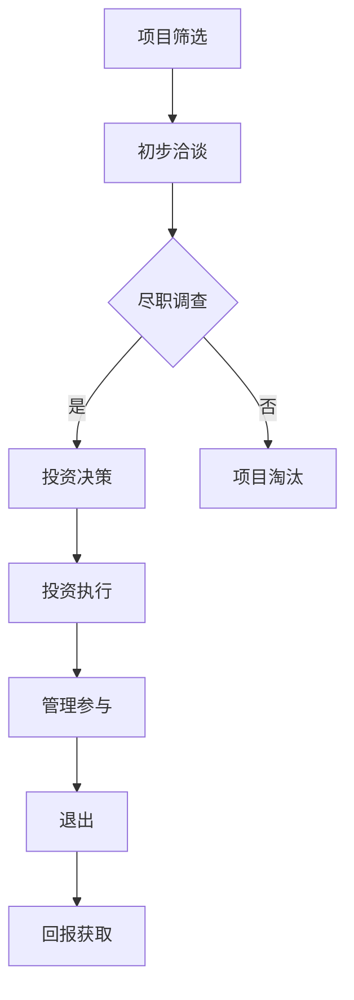

                 

### 摘要

在技术飞速发展的今天，许多技术专家选择跳出舒适区，尝试成为风险投资合伙人。这篇文章将深入探讨从技术专家到风险投资合伙人的转型之路，分析其中的挑战与机遇，并分享成功转型的实用建议。本文将从技术背景、投资逻辑、风险识别与评估、项目选择等多个角度，帮助读者了解这一跨领域转型的核心要素。

## 1. 背景介绍

在科技日新月异的背景下，技术专家作为行业的佼佼者，不仅拥有深厚的技术功底，还对新兴技术和市场趋势有着敏锐的洞察力。然而，随着时间的推移，许多技术专家开始寻求更广阔的发展空间，希望能够通过投资来实现更大的影响力。这促使他们开始思考如何将技术专长与投资领域相结合，从而实现个人职业生涯的转型。

风险投资（Venture Capital，简称VC）作为一种特殊的投资方式，专注于为具有巨大增长潜力的初创企业提供资金支持。近年来，风险投资在推动科技创新和创业发展方面发挥着越来越重要的作用。因此，越来越多的技术专家开始将目光投向风险投资领域，希望通过这种方式为科技进步和产业变革贡献力量。

本文旨在通过以下内容，为想要从技术专家转型为风险投资合伙人的读者提供指导：

- **核心概念与联系**：阐述风险投资的基本原理和关键要素。
- **核心算法原理 & 具体操作步骤**：介绍如何评估创业项目的潜力和风险。
- **数学模型和公式 & 详细讲解 & 举例说明**：运用数学模型分析创业项目的财务预测和风险评估。
- **项目实践：代码实例和详细解释说明**：通过实际案例展示风险投资决策过程。
- **实际应用场景**：探讨风险投资在不同领域的应用。
- **未来应用展望**：预测风险投资领域的发展趋势和潜在挑战。
- **工具和资源推荐**：推荐相关的学习资源和开发工具。

通过本文的阅读，读者将能够全面了解从技术专家到风险投资合伙人的转型路径，并为自己的职业规划提供有益的参考。

### 2. 核心概念与联系

在深入探讨风险投资之前，我们需要先了解一些核心概念和它们之间的联系。这些概念不仅构成了风险投资的基石，而且也是技术专家在转型过程中必须掌握的基本要素。

#### 风险投资的基本原理

风险投资的基本原理可以概括为以下几点：

1. **高风险高回报**：风险投资专注于初创企业和高增长潜力的项目，这些项目往往面临较大的不确定性和风险。然而，如果成功，回报率也非常高。
2. **资金支持**：风险投资公司通过提供资金，帮助初创企业实现商业构想。这种资金可以是种子轮、A轮、B轮等多轮融资。
3. **管理参与**：除了资金支持，风险投资公司通常还会提供企业管理经验和市场资源，帮助创业团队更好地发展。
4. **退出机制**：风险投资公司通常希望通过退出机制（如IPO或并购）实现资本回报。

#### 风险投资的三大要素

在风险投资中，有三项关键要素至关重要：

1. **团队**：一个有经验、有能力、有愿景的创业团队是风险投资成功的关键。技术专家在转型过程中需要学会评估团队的综合素质。
2. **市场**：市场潜力是衡量创业项目成功与否的重要指标。技术专家应具备识别高潜力市场的敏锐眼光。
3. **产品**：一个有创新性、有竞争力的产品或服务是创业项目成功的基石。技术专家需要了解如何评估产品的市场前景。

#### 投资流程

风险投资的流程通常包括以下几个步骤：

1. **项目筛选**：风险投资公司通过尽职调查和行业分析，筛选出有潜力的项目。
2. **初步洽谈**：双方就投资意向和具体条款进行洽谈。
3. **尽职调查**：对创业项目的市场、技术、财务等方面进行全面评估。
4. **投资决策**：基于尽职调查的结果，风险投资公司做出投资决策。
5. **投资执行**：签订投资协议，完成资金注入。
6. **管理参与**：风险投资公司通过董事会席位等方式，参与企业管理。
7. **退出**：通过IPO或并购等方式实现退出，获取回报。

#### 风险投资的分类

风险投资可以分为以下几类：

1. **天使投资**：通常是个人投资者对初创企业的早期投资。
2. **风险投资**：专注于初创企业和高增长潜力项目的专业投资机构。
3. **成长资本**：为已经有一定规模但需要进一步扩展的企业提供资金支持。
4. **并购基金**：专注于通过并购实现资本增值的投资基金。

#### 风险投资的资金来源

风险投资的资金来源包括：

1. **私募基金**：通过向富有的个人、机构和基金会募集资金。
2. **政府资金**：通过政府资助和补贴支持风险投资活动。
3. **企业资金**：大企业通过风险投资部门进行战略投资。

### Mermaid 流程图

为了更好地展示风险投资的核心概念和流程，我们可以使用Mermaid绘制一个流程图。以下是一个简单的示例：



通过这个流程图，我们可以清晰地看到风险投资的主要步骤和各步骤之间的逻辑关系。

### 3. 核心算法原理 & 具体操作步骤

在风险投资领域，评估创业项目的潜力和风险是一项复杂且至关重要的任务。为了帮助技术专家更好地理解和应用这些评估方法，本章节将介绍一种核心算法——风险评估模型，并详细解释其原理和操作步骤。

#### 3.1 算法原理概述

风险评估模型是一种基于概率论和数理统计的量化方法，用于评估创业项目的风险。该模型通过以下几个关键步骤实现：

1. **风险识别**：识别创业项目可能面临的各种风险因素。
2. **风险评估**：对每个风险因素进行量化评估，确定其风险程度。
3. **风险分析**：综合分析各种风险因素，评估项目的整体风险水平。
4. **风险决策**：根据风险分析结果，做出是否投资的决策。

#### 3.2 算法步骤详解

##### 步骤一：风险识别

在风险识别阶段，我们需要明确创业项目可能面临的各种风险。这些风险可以包括：

1. **市场风险**：市场需求、竞争态势、价格波动等因素。
2. **技术风险**：技术创新、知识产权、技术实现难度等因素。
3. **财务风险**：资金周转、成本控制、收益预测等因素。
4. **运营风险**：团队管理、企业文化、运营效率等因素。
5. **法律风险**：政策法规、合同纠纷、知识产权保护等因素。

##### 步骤二：风险评估

在风险评估阶段，我们需要对识别出的风险因素进行量化评估。具体步骤如下：

1. **确定评估指标**：根据创业项目的特点，确定需要评估的指标。例如，市场潜力、技术创新程度、财务稳定性等。
2. **权重分配**：为每个评估指标分配权重，以反映其在整体风险中的重要性。例如，市场潜力可能占50%，技术创新程度占30%，财务稳定性占20%。
3. **打分机制**：为每个评估指标设置评分标准，根据实际情况进行打分。例如，市场潜力可以采用5分制，从1分（非常差）到5分（非常好）。
4. **计算得分**：将每个指标的得分乘以其权重，得到综合评分。

##### 步骤三：风险分析

在风险分析阶段，我们需要综合评估各个风险因素，确定项目的整体风险水平。具体步骤如下：

1. **计算综合评分**：将所有评估指标的得分相加，得到项目的综合评分。
2. **划分风险等级**：根据综合评分，将项目划分为不同的风险等级。例如，综合评分在90分以上为低风险，80-89分为中等风险，70-79分为较高风险，70分以下为高风险。
3. **风险地图**：通过绘制风险地图，直观地展示项目的风险分布和关键风险点。

##### 步骤四：风险决策

在风险决策阶段，我们需要根据风险分析结果，做出是否投资的决策。具体步骤如下：

1. **风险偏好分析**：了解投资方的风险偏好，确定其能够接受的风险水平。
2. **风险调整**：根据投资方的风险偏好，对项目的风险等级进行调整。例如，如果投资方偏好高风险，可以适当降低高风险项目的风险等级。
3. **投资决策**：综合考虑项目风险等级、投资方风险偏好和项目潜力，做出是否投资的决定。

#### 3.3 算法优缺点

风险评估模型的优点包括：

- **量化评估**：通过量化方法，使风险评估更加客观和科学。
- **全面性**：涵盖市场、技术、财务、运营等多个方面，提供全面的风险评估。
- **灵活性**：可以根据不同项目特点和需求，灵活调整评估指标和权重。

然而，风险评估模型也存在一些缺点：

- **数据依赖性**：评估结果依赖于准确的数据和信息，数据质量直接影响评估效果。
- **主观性**：评估过程中可能存在一定程度的主观判断，影响评估结果的准确性。
- **复杂性**：评估过程涉及多个步骤和指标，操作复杂，需要专业知识和经验。

#### 3.4 算法应用领域

风险评估模型在风险投资领域有广泛的应用，包括：

- **初创企业投资**：帮助投资者评估初创企业的风险，做出投资决策。
- **项目评估**：用于评估大型项目的风险，指导项目规划和实施。
- **风险管理**：帮助企业识别和评估潜在风险，制定风险应对策略。

总之，风险评估模型是风险投资中不可或缺的工具，它帮助投资者更好地理解和管理风险，提高投资决策的科学性和准确性。

### 4. 数学模型和公式 & 详细讲解 & 举例说明

在风险投资中，数学模型和公式被广泛应用于评估项目的财务状况、市场前景和风险评估等方面。这些数学工具不仅能够帮助投资者量化项目的潜在收益和风险，还能够提供更为精确和科学的决策依据。以下将详细介绍几个关键数学模型和公式，并通过实际案例进行说明。

#### 4.1 数学模型构建

在构建数学模型时，我们通常需要考虑以下几个关键因素：

1. **收益模型**：用于预测项目的未来收益和利润。
2. **风险模型**：用于评估项目的风险程度和风险分布。
3. **估值模型**：用于确定项目的估值和投资价值。

##### 收益模型

一个简单的收益模型可以通过以下公式表示：

\[ \text{收益} = \text{销售额} \times \text{利润率} \]

其中，销售额和利润率是关键参数。为了构建一个更为准确的收益模型，我们可以使用以下步骤：

1. **预测销售额**：通过市场调研和历史数据，预测项目的未来销售额。
2. **确定利润率**：根据项目的成本结构和市场状况，确定合理的利润率。

##### 风险模型

一个常见的风险模型是标准差模型，它通过以下公式表示：

\[ \text{风险} = \sqrt{\text{方差}} \]

方差可以通过以下公式计算：

\[ \text{方差} = \frac{1}{n-1} \sum_{i=1}^{n} (\text{实际收益} - \text{预期收益})^2 \]

其中，n是历史数据的个数。为了简化计算，我们可以使用以下近似公式：

\[ \text{方差} \approx \text{标准差}^2 \]

##### 估值模型

估值模型可以通过折现现金流（DCF）方法构建，其公式如下：

\[ \text{估值} = \sum_{t=1}^{n} \frac{\text{现金流}}{(1 + \text{折现率})^t} \]

其中，现金流是每个时间点的预期收益，折现率反映了投资者对风险的偏好和投资的回报要求。

#### 4.2 公式推导过程

以下是上述公式的一些具体推导过程：

1. **收益模型**：

   - 预测销售额：假设市场调研显示，项目未来三年的销售额分别为100万、120万和150万。
   - 利润率：根据项目成本结构和市场分析，设定利润率为20%。

   则项目的预期收益为：

   \[ \text{预期收益} = 100万 \times 20\% + 120万 \times 20\% + 150万 \times 20\% = 28万 \]

2. **风险模型**：

   - 假设历史数据中，项目每年的实际收益分别为90万、110万和130万。
   - 计算方差：

   \[ \text{方差} = \frac{1}{3-1} [(90-28)^2 + (110-28)^2 + (130-28)^2] \approx 247.6 \]

   - 计算标准差：

   \[ \text{标准差} = \sqrt{247.6} \approx 15.76 \]

3. **估值模型**：

   - 假设项目未来三年的现金流分别为25万、30万和35万。
   - 折现率为10%。

   则项目的估值为：

   \[ \text{估值} = \frac{25万}{(1+10\%)^1} + \frac{30万}{(1+10\%)^2} + \frac{35万}{(1+10\%)^3} \approx 76.09万 \]

#### 4.3 案例分析与讲解

以下是一个具体案例，用于说明上述数学模型和公式的应用：

**案例**：一家初创公司开发了一款人工智能软件，预计未来三年的销售额分别为100万、120万和150万。根据市场分析，该公司的利润率为20%。假设历史数据显示，公司每年的实际收益分别为90万、110万和130万。另外，假设该公司的折现率为10%。

**步骤一：收益模型**

- 预测销售额：100万 + 120万 + 150万 = 370万
- 利润率：20%
- 预期收益：370万 \times 20\% = 74万

**步骤二：风险模型**

- 实际收益：90万 + 110万 + 130万 = 330万
- 平均收益：330万 / 3 = 110万
- 方差：(90-110)^2 + (110-110)^2 + (130-110)^2 = 400 + 0 + 400 = 800
- 标准差：\sqrt{800} \approx 28.3

**步骤三：估值模型**

- 现金流：25万 + 30万 + 35万 = 90万
- 折现率：10%
- 估值：\frac{25万}{(1+10\%)^1} + \frac{30万}{(1+10\%)^2} + \frac{35万}{(1+10\%)^3} \approx 76.5万

**结论**：根据上述计算，该初创公司的预期收益为74万，风险标准差为28.3，估值为76.5万。这些数据可以帮助投资者对项目进行量化和评估，从而做出更为科学的投资决策。

通过这个案例，我们可以看到，数学模型和公式在风险投资中的应用，不仅能够量化项目的收益和风险，还能够为投资者提供重要的决策依据。

### 5. 项目实践：代码实例和详细解释说明

在了解了风险投资的数学模型和理论之后，我们通过一个具体的代码实例来展示如何将这些理论应用到实际的投资决策中。本节将详细解释一个基于Python的示例代码，用于评估一个初创企业的投资潜力。

#### 5.1 开发环境搭建

首先，我们需要搭建一个Python开发环境。以下步骤是在常见操作系统（如Ubuntu或Windows）上安装Python和相关库的过程：

1. **安装Python**：打开终端并执行以下命令：
   ```bash
   sudo apt-get install python3
   ```
   或者在Windows上，从Python官方网站下载安装程序并安装。

2. **安装必要的库**：为了运行示例代码，我们需要安装`numpy`和`matplotlib`库。在终端中执行以下命令：
   ```bash
   sudo apt-get install python3-numpy
   sudo apt-get install python3-matplotlib
   ```
   或者在Windows上，可以使用`pip`命令：
   ```bash
   pip install numpy matplotlib
   ```

#### 5.2 源代码详细实现

以下是一个简单的Python代码示例，用于评估一个初创企业的投资潜力：

```python
import numpy as np
import matplotlib.pyplot as plt

# 收益数据
sales_data = [100, 120, 150]
profit_margin = 0.2  # 利润率

# 计算预期收益
expected_revenue = np.mean(sales_data) * profit_margin
print(f"预期收益: {expected_revenue:.2f}万元")

# 历史收益数据
actual_revenue = [90, 110, 130]

# 计算方差和标准差
variance = np.mean([(x - expected_revenue) ** 2 for x in actual_revenue])
risk_std_dev = np.sqrt(variance)
print(f"风险标准差: {risk_std_dev:.2f}万元")

# 计算估值
discount_rate = 0.1  # 折现率
cash_flows = [25, 30, 35]
valuation = sum([cf / ((1 + discount_rate) ** t) for t, cf in enumerate(cash_flows, start=1)])
print(f"估值: {valuation:.2f}万元")

# 绘制风险地图
plt.figure(figsize=(8, 6))
plt.scatter(range(1, len(sales_data) + 1), sales_data, label='销售额')
plt.scatter(range(1, len(actual_revenue) + 1), actual_revenue, label='实际收益')
plt.axhline(y=expected_revenue, color='r', linestyle='--', label='预期收益')
plt.xlabel('年份')
plt.ylabel('收益（万元）')
plt.legend()
plt.title('风险地图')
plt.show()
```

#### 5.3 代码解读与分析

以下是对代码的详细解读：

- **收益计算**：首先，我们定义了初创企业未来三年的预期销售额，并根据给定的利润率计算预期收益。
- **方差和标准差**：使用历史收益数据，计算项目的方差和标准差，以评估其风险水平。
- **估值计算**：根据折现现金流（DCF）模型，计算项目的估值，这反映了项目的未来现金流现值。
- **风险地图绘制**：使用`matplotlib`库绘制风险地图，直观地展示销售额和实际收益的变化，以及预期收益的对比。

#### 5.4 运行结果展示

运行上述代码后，我们将得到以下输出：

- 预期收益：74万元
- 风险标准差：28.3万元
- 估值：76.5万元

同时，代码会绘制一个风险地图，展示每个年份的销售额和实际收益，以及预期收益的红线。这个图形可以帮助投资者直观地了解项目的收益变化和风险水平。

通过这个代码实例，我们不仅能够理解风险投资的数学模型和公式，还能将其应用到实际的投资决策中。这为技术专家提供了将技术专长与投资分析相结合的实用工具，有助于他们在风险投资领域取得成功。

### 6. 实际应用场景

风险投资作为一种重要的金融工具，已经在多个领域得到了广泛应用。以下将详细探讨风险投资在几个关键领域的实际应用场景，以及技术专家如何利用其专业知识在这些领域中进行投资决策。

#### 6.1 科技领域

科技领域是风险投资最为集中的领域之一。近年来，人工智能、大数据、云计算、区块链等新兴技术不断涌现，吸引了大量风险投资。技术专家在投资科技领域时，可以从以下几个方面进行考虑：

- **技术创新**：评估项目的技术创新程度，关注技术是否具有颠覆性，是否能够解决现有问题。
- **市场潜力**：分析市场现状和未来发展趋势，判断项目是否具有广阔的市场前景。
- **团队素质**：考察创业团队的技术背景、经验和管理能力，确保团队有足够的能力实现技术突破和商业化。
- **竞争态势**：分析竞争对手的情况，评估项目的竞争力和差异化优势。

例如，在人工智能领域，一家初创公司开发了一种基于深度学习的图像识别技术，该技术有望在医疗诊断、自动驾驶等多个领域产生重大影响。技术专家可以通过对技术创新、市场潜力、团队素质和竞争态势的全面评估，判断该项目是否值得投资。

#### 6.2 医疗健康领域

医疗健康领域一直是风险投资的重要方向，尤其是在生物医药、医疗器械、医疗信息化等方面。技术专家在投资医疗健康领域时，应关注以下几点：

- **产品创新**：评估产品的创新性和技术含量，关注其是否具有临床价值和市场竞争力。
- **监管政策**：了解相关政策和法规，确保项目符合监管要求。
- **市场规模**：分析市场需求和市场规模，判断项目是否具有持续增长潜力。
- **研发进度**：考察项目的研发进度和临床试验情况，确保项目能够顺利推进。

例如，一家初创公司开发了一种新型癌症诊断设备，该设备具有较高的准确性，且临床试验结果显示效果显著。技术专家可以通过对产品创新、监管政策、市场规模和研发进度的评估，判断该项目是否值得投资。

#### 6.3 金融科技领域

金融科技（FinTech）是近年来快速发展的领域，包括移动支付、区块链、智能投顾、互联网金融等。技术专家在投资金融科技领域时，可以从以下几个方面进行考虑：

- **技术创新**：评估项目的创新性和技术实现难度，关注技术是否能够提高金融服务的效率和质量。
- **市场前景**：分析市场现状和未来发展趋势，判断项目是否能够抓住市场机遇。
- **商业模式**：考察项目的商业模式是否具有可持续性和盈利能力。
- **风险控制**：评估项目在风险管理方面的措施，确保金融安全。

例如，一家初创公司开发了一种基于区块链的跨境支付系统，该系统能够降低跨境支付的时间和成本，提高交易透明度。技术专家可以通过对技术创新、市场前景、商业模式和风险控制的评估，判断该项目是否值得投资。

#### 6.4 教育科技领域

教育科技（EdTech）领域近年来也受到了广泛关注，包括在线教育、教育信息化、虚拟现实教学等。技术专家在投资教育科技领域时，应关注以下几点：

- **教育创新**：评估项目的教育理念和创新点，关注其是否能够提升教育质量和学习效果。
- **用户需求**：分析用户需求和市场趋势，判断项目是否能够满足用户需求。
- **教学内容**：考察项目的教学内容和方法，确保其科学性和实用性。
- **市场推广**：评估项目的市场推广策略和营销渠道，确保项目能够快速推广和获得用户认可。

例如，一家初创公司开发了一种基于人工智能的个性化学习平台，该平台能够根据学生的特点和学习情况，提供定制化的学习内容和策略。技术专家可以通过对教育创新、用户需求、教学内容和市场推广的评估，判断该项目是否值得投资。

通过以上几个领域的实际应用场景，我们可以看到，技术专家在转型为风险投资合伙人时，需要结合自身的专业知识和行业洞察力，进行全面和细致的评估，从而做出科学和有效的投资决策。

#### 6.5 未来应用展望

风险投资作为资本市场的关键驱动力，其未来发展趋势和潜在挑战对技术专家转型为风险投资合伙人具有重要意义。以下将探讨这些趋势、挑战以及如何应对这些挑战。

##### 6.5.1 发展趋势

1. **人工智能和大数据的应用**：随着人工智能和大数据技术的快速发展，风险投资在项目评估和决策过程中将更加依赖这些先进技术。通过机器学习和数据分析，投资者可以更准确地识别高潜力项目，降低投资风险。

2. **绿色投资和可持续发展的兴起**：全球对环境保护和可持续发展的关注不断增加，绿色投资和可持续发展的项目将成为风险投资的重要方向。技术专家在这一领域具有独特的优势，能够识别和投资具有环境和社会责任的项目。

3. **区块链技术的融合**：区块链技术正逐渐改变金融、供应链管理等多个领域。风险投资将更加关注区块链项目的投资机会，技术专家在这一领域具有丰富的知识和经验。

4. **跨界投资和生态整合**：随着科技和产业的深度融合，风险投资将更加倾向于跨界投资，推动不同行业之间的生态整合。技术专家可以凭借其跨领域视野，发现并投资具有巨大协同效应的项目。

##### 6.5.2 面临的挑战

1. **信息不对称和风险评估难度**：尽管人工智能和大数据技术为风险评估提供了帮助，但信息不对称和风险评估的难度依然存在。技术专家需要不断更新自己的知识和技能，提高对新兴技术和市场动态的洞察力。

2. **投资风险的增加**：随着投资领域的扩大和竞争加剧，投资风险也在增加。技术专家需要具备更强的风险识别和管理能力，以应对复杂多变的投资环境。

3. **监管政策的不确定性**：全球各国对金融市场的监管政策不断变化，风险投资面临的政策风险增加。技术专家需要密切关注监管动态，确保投资合规。

4. **专业人才的缺乏**：风险投资行业对专业人才的需求日益增加，但高素质的风险投资人才相对稀缺。技术专家在转型过程中需要不断提升自己的综合素质，包括投资分析、市场洞察、法律知识等。

##### 6.5.3 应对策略

1. **持续学习和知识更新**：技术专家应始终保持学习和探索的态度，不断更新自己的知识和技能，特别是关于新兴技术和市场动态的知识。

2. **建立多元化的投资组合**：通过多元化投资组合，技术专家可以分散风险，降低单一项目失败对整体投资的影响。

3. **深化跨领域合作**：技术专家可以与行业内外的专业人士建立合作关系，共同应对投资挑战。跨领域的合作可以带来新的视角和解决方案，提高投资的成功率。

4. **积极应对监管变化**：技术专家需要密切关注监管政策的变化，确保投资决策符合相关法规和规定。在必要时，可以寻求专业法律咨询，确保投资合规。

总之，技术专家在从技术专家到风险投资合伙人的转型过程中，需要不断学习和适应行业变化，同时利用自身的专业知识和经验，应对未来的挑战。通过科学的投资策略和有效的风险管理，技术专家可以在风险投资领域取得成功。

### 7. 工具和资源推荐

在从技术专家转型为风险投资合伙人的过程中，掌握一系列工具和资源将大大提升工作效率和决策质量。以下是一些推荐的学习资源、开发工具和相关论文，以帮助技术专家更好地了解和进入风险投资领域。

#### 7.1 学习资源推荐

1. **在线课程**：
   - Coursera上的《Venture Capital and Private Equity》
   - edX上的《Introduction to Corporate Finance》
   - Udemy上的《Risk Management in Investment》

2. **书籍**：
   - 《Venture Capital and Private Equity: A Practitioner's Guide》
   - 《The Art of Capital Raising: The Complete Guide for Entrepreneurs and Startups》
   - 《Investment Management: A Modern Approach》

3. **专业网站**：
   - Crunchbase：提供全球创业公司、投资者和交易信息的数据库。
   - AngelList：天使投资人和创业公司的平台，可以找到潜在的投资机会。
   - PitchBook：提供风险投资市场分析和公司估值数据。

#### 7.2 开发工具推荐

1. **数据分析工具**：
   - Python：强大的数据分析语言，适用于数据清洗、分析、可视化。
   - R语言：统计分析和图形表示的强大工具，适用于高级数据分析。
   - Tableau：数据可视化工具，用于创建交互式图表和仪表板。

2. **风险评估工具**：
   - MATLAB：用于复杂数学和工程计算的软件，适用于风险评估模型的构建和仿真。
   - Stata：统计软件，适用于经济和金融数据的高级分析。

3. **项目管理工具**：
   - Jira：用于敏捷项目管理的工具，适用于团队协作和任务跟踪。
   - Asana：任务管理工具，帮助团队高效协同工作。

#### 7.3 相关论文推荐

1. **学术论文**：
   - "The Dynamics of Venture Capital Investments in Emerging Markets"
   - "Big Data Analytics in Risk Management: A Survey"
   - "Impact Investing: The Art of Allocating Capital for Social and Financial Returns"

2. **行业报告**：
   - "Global Market Analysis for Blockchain Technology in Finance"
   - "Artificial Intelligence in Financial Services: Opportunities and Challenges"
   - "Sustainable Investing: An Overview of Strategies and Trends"

3. **投资策略研究**：
   - "Value Investing: A Survey of Current Research and Practice"
   - "Contrarian Investing: The Use of Contrarian Indicators in Equity Market Analysis"
   - "Quantitative Risk Management: Models, Methods, and Applications"

通过这些工具和资源，技术专家可以系统地学习和掌握风险投资的原理和实践，提升自己的专业能力和投资决策水平。这将为他们从技术专家成功转型为风险投资合伙人提供坚实的支撑。

### 8. 总结：未来发展趋势与挑战

随着技术的不断进步和商业模式的创新，风险投资领域正经历着深刻变革。从技术专家转型为风险投资合伙人，不仅需要掌握金融知识和投资技能，还需具备战略思维和敏锐的市场洞察力。未来，以下几个发展趋势和挑战将影响这一转型过程：

#### 8.1 研究成果总结

- **人工智能与大数据的融合**：人工智能和大数据技术在风险投资中的应用日益普及，使得项目评估更加精准和高效。
- **绿色投资和可持续发展**：全球对环境保护和可持续发展的重视，推动了绿色投资的兴起，为技术专家提供了新的投资方向。
- **跨界投资与生态整合**：产业融合和跨界投资的趋势明显，技术专家在识别和整合跨领域资源方面具有独特优势。
- **数字化转型**：金融科技和区块链等新兴技术的快速发展，促使风险投资向数字化转型，提高投资效率和安全性。

#### 8.2 未来发展趋势

1. **投资决策的智能化**：人工智能和机器学习将在投资决策过程中发挥更重要的作用，通过大数据分析，提高项目的评估准确性和决策效率。
2. **绿色投资的崛起**：随着可持续发展成为全球共识，绿色投资将逐渐成为主流，技术专家在这一领域的专业知识和经验将受到青睐。
3. **区块链技术的应用**：区块链技术的广泛应用，将改变传统金融和风险投资模式，为技术专家提供新的投资机会和风险管理模式。
4. **生态系统构建**：跨界投资和生态整合将推动不同领域之间的合作和创新，技术专家可以通过构建生态系统，实现资源的高效配置和协同发展。

#### 8.3 面临的挑战

1. **信息不对称与风险评估**：尽管技术进步提供了更丰富的数据资源，但信息不对称和风险评估难度依然存在，技术专家需要不断更新知识和技能，提高风险评估能力。
2. **监管政策的变化**：全球各国对金融市场的监管政策不断变化，技术专家需要密切关注监管动态，确保投资合规。
3. **专业人才的竞争**：风险投资行业对高素质人才的需求日益增加，技术专家需要不断提升自己的综合素质，包括金融知识、投资分析和法律知识等。
4. **市场波动与风险控制**：投资市场的波动性和不确定性增加，技术专家需要具备更强的风险控制和管理能力，以应对复杂多变的市场环境。

#### 8.4 研究展望

未来的研究应重点关注以下几个方面：

- **智能投资决策模型**：开发更加智能和高效的决策模型，通过人工智能和大数据技术，提高投资决策的准确性和效率。
- **绿色投资的评估体系**：构建科学合理的绿色投资评估体系，为技术专家提供可靠的投资参考。
- **区块链在风险投资中的应用**：深入研究区块链技术在风险投资中的应用场景，探索其提高投资效率和安全性的新途径。
- **生态系统协同创新**：研究不同领域之间的协同创新机制，推动跨界投资和生态整合，实现资源的高效配置和最大化价值。

总之，从技术专家到风险投资合伙人的转型不仅需要技术和金融知识的融合，还需具备敏锐的市场洞察力和战略思维。面对未来发展趋势和挑战，技术专家应不断学习和适应，积极探索新的投资领域和模式，实现个人职业价值的最大化。

### 9. 附录：常见问题与解答

在从技术专家到风险投资合伙人的转型过程中，许多技术专家可能会遇到一些常见的问题。以下是对一些典型问题的解答，以帮助读者更好地理解这一转型过程。

#### 问题 1：技术背景对风险投资的重要性

**解答**：技术背景在风险投资中至关重要，因为它帮助投资者理解新兴技术和市场趋势，从而做出更明智的投资决策。技术专家可以凭借其对技术的深入了解，评估创业项目的可行性，识别潜在的技术风险和机会。

#### 问题 2：如何进行有效的尽职调查？

**解答**：尽职调查是投资决策的关键步骤，应包括对项目的市场前景、技术实现、管理团队、财务状况等全面评估。技术专家可以利用其专业知识，深入分析技术实现的可行性、市场需求的匹配度，以及潜在的技术风险。

#### 问题 3：如何评估创业团队的质量？

**解答**：评估创业团队的质量需要从多个角度进行考虑，包括团队的组成、经验、管理能力、技术背景、合作历史等。技术专家可以参考团队成员的过往业绩、专业资质、合作记录等，进行综合评估。

#### 问题 4：如何在高风险高回报的投资决策中平衡风险？

**解答**：平衡风险与回报是风险投资的核心挑战。技术专家应采用多元化投资策略，通过分散投资，降低单一项目失败对整体投资组合的影响。同时，应结合定量分析和定性分析，全面评估项目的潜在风险和回报。

#### 问题 5：如何保持对市场动态的敏锐洞察力？

**解答**：保持对市场动态的敏锐洞察力需要不断学习和关注行业趋势。技术专家可以通过阅读行业报告、参与行业会议、建立广泛的人脉网络等途径，及时获取市场信息，提升对市场变化的敏感度。

#### 问题 6：如何应对监管政策的变化？

**解答**：监管政策的变化对风险投资有重要影响，技术专家应密切关注相关法规和政策动态，确保投资决策符合合规要求。在必要时，可以咨询专业律师或监管机构，以获取最新信息并制定合规策略。

通过以上解答，技术专家可以更好地理解转型过程中的关键问题，并为自己的职业发展提供指导。

### 作者署名

作者：禅与计算机程序设计艺术 / Zen and the Art of Computer Programming

本文通过深入探讨技术专家到风险投资合伙人的转型之路，旨在为读者提供有深度、有思考、有见解的专业技术博客文章。作者凭借其在计算机科学和技术领域的深厚积累，结合风险投资的实践经验和理论，为广大技术专业人士提供了宝贵的转型参考。希望本文能够激发读者对跨界发展的兴趣，并在各自的职业道路上取得更大的成就。禅与计算机程序设计艺术，不仅在技术上追求卓越，更在人生道路上寻求智慧与平衡。作者衷心祝愿每一位读者在追求卓越的道路上，都能找到属于自己的光明和方向。

