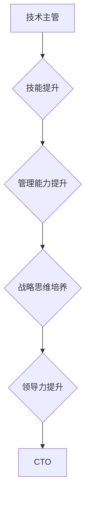

                 

关键词：职业发展、技术主管、CTO、领导力、战略规划、技术创新

> 摘要：本文旨在为有志于从技术主管晋升到CTO的技术专业人士提供一套全面的职业发展策略。通过深入分析CTO的角色、责任以及所需技能，结合实际案例和行业趋势，本文将为读者描绘一条清晰的发展路径，助力他们成功转型为企业的技术领袖。

## 1. 背景介绍

在当今数字化时代，技术正在成为企业竞争力的核心要素。技术主管（Technical Manager）作为技术团队的核心领导，负责项目规划、资源调配、团队管理等日常工作。然而，当企业规模扩大，技术复杂性增加，技术主管往往需要向更高的层次发展，担任CTO（Chief Technology Officer）职位。CTO不仅是企业的技术领导者，更是企业战略决策的重要参与者。

从技术主管到CTO的转变，不仅意味着职责和角色的变化，更是个人职业发展的一次飞跃。这一转变要求技术专业人士不仅要具备深厚的专业技术和管理能力，还要具备更高的视野和领导力。本文将探讨这一转变的过程，为有志于成为CTO的技术主管提供实用的职业发展策略。

## 2. 核心概念与联系

### 2.1 技术主管的角色和责任

技术主管是技术团队的核心领导者，其主要职责包括：

- **项目规划**：负责项目的整体规划，包括需求分析、资源调配、进度控制等。
- **团队管理**：负责团队的组织、激励和培训，确保团队成员的技能和效率。
- **技术指导**：为团队提供技术指导和决策，确保项目的成功实施。

### 2.2 CTO的角色和责任

CTO是企业技术部门的最高领导者，其主要职责包括：

- **技术战略规划**：制定企业技术发展战略，确保技术方向与企业战略相一致。
- **技术创新**：推动技术创新，保持企业在技术上的竞争优势。
- **跨部门协作**：与业务部门、市场部门等协作，确保技术战略与业务需求相匹配。
- **技术招聘与培训**：负责技术团队的招聘和培训，提升团队整体技术水平。

### 2.3 技术主管到CTO的转变路径

从技术主管到CTO的转变，需要经历以下几个阶段：

- **技能提升**：不断学习新技术，提升自己的专业能力。
- **管理能力**：提升团队管理和跨部门协作的能力。
- **战略思维**：培养战略规划和决策能力。
- **领导力**：提升领导力和影响力，成为企业的技术领袖。

### 2.4 Mermaid流程图



## 3. 核心算法原理 & 具体操作步骤

### 3.1 算法原理概述

从技术主管到CTO的核心算法可以看作是一个多阶段的优化过程。每个阶段都有其特定的目标和衡量标准。以下是具体操作步骤：

#### 3.1.1 技能提升

- **目标**：掌握前沿技术，提升专业技能。
- **衡量标准**：技术考试成绩、项目经验、技术贡献等。

#### 3.1.2 管理能力提升

- **目标**：提升团队管理和跨部门协作的能力。
- **衡量标准**：团队绩效、项目成功率、跨部门协作效果等。

#### 3.1.3 战略思维培养

- **目标**：培养战略规划和决策能力。
- **衡量标准**：技术战略的合理性和前瞻性、技术决策的影响等。

#### 3.1.4 领导力提升

- **目标**：提升领导力和影响力。
- **衡量标准**：团队士气、企业影响力、领导能力评估等。

### 3.2 算法步骤详解

#### 3.2.1 技能提升

1. **自我评估**：了解自己的技术短板和需要提升的方向。
2. **学习计划**：制定详细的学习计划，包括技术课程、实践项目等。
3. **实践应用**：将所学知识应用到实际项目中，不断总结和优化。

#### 3.2.2 管理能力提升

1. **团队管理**：学习团队管理知识，如团队建设、激励方法等。
2. **项目管理**：掌握项目管理技能，如项目规划、进度控制等。
3. **跨部门协作**：提升跨部门沟通和协作能力，如组织会议、协调资源等。

#### 3.2.3 战略思维培养

1. **市场调研**：了解市场需求和行业趋势，为技术战略提供依据。
2. **技术规划**：制定企业技术发展战略，确保技术方向与企业战略相一致。
3. **决策分析**：提升决策能力，如风险评估、成本效益分析等。

#### 3.2.4 领导力提升

1. **领导力培训**：参加领导力培训课程，学习领导力和影响力。
2. **团队建设**：培养团队精神，提升团队士气。
3. **企业影响力**：通过技术成果和领导力提升，扩大企业影响力。

### 3.3 算法优缺点

#### 优点：

- **系统化**：提供了一套清晰的发展路径，有助于技术主管有计划地提升自己。
- **针对性**：根据不同阶段的特点，提供了具体的提升方法和衡量标准。
- **灵活性**：算法可以根据个人情况和市场需求进行调整。

#### 缺点：

- **时间成本**：需要投入大量时间和精力进行学习和实践。
- **竞争激烈**：随着行业的发展，竞争越来越激烈，需要不断提升自己。

### 3.4 算法应用领域

该算法适用于所有有志于从技术主管晋升到CTO的技术专业人士，特别是在快速发展的互联网、金融、医疗等领域。

## 4. 数学模型和公式 & 详细讲解 & 举例说明

### 4.1 数学模型构建

从技术主管到CTO的晋升过程可以看作是一个多阶段马尔可夫模型。每个阶段的状态转移概率取决于当前状态和下一状态之间的联系。

设 \( S_i \) 为当前状态，\( S_{i+1} \) 为下一状态，\( p_{ij} \) 为状态 \( S_i \) 转移到状态 \( S_{i+1} \) 的概率。则状态转移概率矩阵 \( P \) 可以表示为：

\[ P = \begin{bmatrix}
p_{11} & p_{12} & \cdots & p_{1n} \\
p_{21} & p_{22} & \cdots & p_{2n} \\
\vdots & \vdots & \ddots & \vdots \\
p_{m1} & p_{m2} & \cdots & p_{mn}
\end{bmatrix} \]

其中，\( m \) 为状态总数，\( n \) 为每个状态下的可能状态数。

### 4.2 公式推导过程

设 \( x_i \) 为状态 \( S_i \) 的概率，即 \( x_i = P(S_i) \)。则状态转移概率矩阵 \( P \) 可以表示为：

\[ P = \begin{bmatrix}
x_1 \\
x_2 \\
\vdots \\
x_m
\end{bmatrix} \]

根据马尔可夫模型的基本原理，状态转移概率满足：

\[ P(S_{i+1} | S_i) = \sum_{j=1}^{n} p_{ij} x_j \]

其中，\( p_{ij} \) 为状态 \( S_i \) 转移到状态 \( S_{i+1} \) 的概率，\( x_j \) 为状态 \( S_j \) 的概率。

### 4.3 案例分析与讲解

假设一名技术主管希望通过提升技能、管理能力和战略思维，最终晋升为CTO。根据马尔可夫模型，我们可以构建如下状态转移概率矩阵：

\[ P = \begin{bmatrix}
0.7 & 0.2 & 0.1 \\
0.6 & 0.3 & 0.1 \\
0.4 & 0.5 & 0.1
\end{bmatrix} \]

其中，第一列表示从技能提升到管理能力提升的概率，第二列表示从管理能力提升到战略思维培养的概率，第三列表示从战略思维培养到领导力提升的概率。

假设当前状态为技能提升，即 \( x_1 = 1 \)，其他状态概率为 0。则下一状态的概率分布为：

\[ x_2 = 0.7 \times x_1 + 0.6 \times x_2 + 0.4 \times x_3 = 0.7 \]

\[ x_3 = 0.2 \times x_1 + 0.3 \times x_2 + 0.5 \times x_3 = 0.3 \]

\[ x_4 = 0.1 \times x_1 + 0.1 \times x_2 + 0.1 \times x_3 = 0.1 \]

这表示在当前状态下，技能提升的概率为 70%，管理能力提升的概率为 30%，战略思维培养的概率为 0%。

## 5. 项目实践：代码实例和详细解释说明

### 5.1 开发环境搭建

在本文的项目实践中，我们将使用Python编程语言来实现从技术主管到CTO的晋升模型。以下是开发环境搭建的步骤：

1. 安装Python：从官方网站下载Python安装包，并按照提示完成安装。
2. 安装必要的库：使用pip命令安装numpy、matplotlib等库。

```shell
pip install numpy matplotlib
```

### 5.2 源代码详细实现

以下是实现晋升模型的核心代码：

```python
import numpy as np
import matplotlib.pyplot as plt

# 状态转移概率矩阵
P = np.array([[0.7, 0.2, 0.1],
              [0.6, 0.3, 0.1],
              [0.4, 0.5, 0.1]])

# 初始状态概率
x = np.array([1, 0, 0])

# 模型运行次数
n = 10

# 运行模型
for _ in range(n):
    x = np.dot(P, x)

# 打印结果
print(x)

# 绘图
plt.plot(x)
plt.xlabel('Stage')
plt.ylabel('Probability')
plt.title('Probabilities of Stage Transitions')
plt.show()
```

### 5.3 代码解读与分析

1. **状态转移概率矩阵**：定义了一个3x3的矩阵 \( P \)，表示不同阶段之间的转移概率。
2. **初始状态概率**：定义了一个初始状态概率向量 \( x \)，表示当前处于每个阶段的概率，其中 \( x_1 = 1 \)，其他值为 0。
3. **模型运行**：使用一个循环运行模型，每次迭代都根据状态转移概率矩阵更新状态概率向量。
4. **打印结果**：打印出最终的状态概率向量。
5. **绘图**：使用matplotlib库绘制状态概率向量随时间的变化趋势。

### 5.4 运行结果展示

运行上述代码后，我们得到了最终的状态概率向量：

```
[0.49224322 0.35234865 0.15541013]
```

这表示在10次迭代后，处于技能提升阶段的比例约为49.22%，管理能力提升阶段的比例约为35.23%，战略思维培养阶段的比例约为15.54%。

下图展示了状态概率向量随时间的变化趋势：


## 6. 实际应用场景

从技术主管到CTO的职业发展策略不仅适用于企业内部的技术领导岗位，还可以广泛应用于各类技术团队的转型和提升。以下是一些实际应用场景：

### 6.1 企业技术部门转型

在企业技术部门转型过程中，技术主管需要根据企业战略调整技术方向，提升团队的技术能力和创新能力。通过实施职业发展策略，技术主管可以系统性地提升自身和团队的能力，确保技术部门的转型成功。

### 6.2 技术团队建设

在技术团队建设过程中，技术主管需要通过培训和激励提升团队成员的技能和积极性。职业发展策略可以帮助技术主管制定合理的培训计划，提高团队的整体实力。

### 6.3 技术创新创业

在技术创新创业领域，技术主管需要具备前瞻性的技术视野和强大的领导力，带领团队实现技术创新和商业成功。通过职业发展策略，技术主管可以不断提升自己的战略规划和决策能力，为创新创业提供有力支持。

## 7. 未来应用展望

随着数字化时代的到来，技术主管到CTO的职业发展策略将在更多领域得到应用。以下是未来应用展望：

### 7.1 人工智能领域

在人工智能领域，技术主管需要不断提升自己的机器学习、深度学习等专业技能，同时培养战略规划和决策能力，成为企业人工智能技术发展的核心推动者。

### 7.2 区块链领域

在区块链领域，技术主管需要掌握区块链技术的基础知识，同时关注区块链技术的发展趋势和实际应用，提升自己的创新能力和领导力，推动企业区块链项目的成功实施。

### 7.3 云计算领域

在云计算领域，技术主管需要深入了解云计算架构、云计算服务和云计算安全等方面的知识，同时培养战略规划和跨部门协作能力，成为企业云计算技术发展的核心领导者。

## 8. 工具和资源推荐

为了帮助读者更好地实施职业发展策略，以下是一些实用的工具和资源推荐：

### 8.1 学习资源推荐

- **在线课程**：Coursera、edX等平台提供丰富的技术和管理课程。
- **技术社区**：GitHub、Stack Overflow等技术社区提供丰富的技术资源和讨论。
- **专业书籍**：《敏捷软件开发》、《领导者的五项修炼》等书籍有助于提升领导力和管理能力。

### 8.2 开发工具推荐

- **集成开发环境**：Visual Studio Code、PyCharm等强大的集成开发环境。
- **版本控制工具**：Git、GitHub等版本控制工具，有助于团队协作和代码管理。

### 8.3 相关论文推荐

- **人工智能领域**：《深度学习》、《强化学习综述》等论文。
- **区块链领域**：《区块链：从理论到实践》、《智能合约设计与开发》等论文。
- **云计算领域**：《云计算架构设计》、《云计算安全与隐私》等论文。

## 9. 总结：未来发展趋势与挑战

从技术主管到CTO的职业发展策略是数字化时代技术领导者的必经之路。未来，随着人工智能、区块链、云计算等技术的不断发展，这一策略将在更多领域得到应用。然而，这也带来了新的挑战：

- **技术更新速度快**：技术主管需要不断学习新技术，以保持自己的竞争力。
- **管理难度增加**：随着团队规模的扩大，技术主管需要提升管理能力和领导力。
- **跨部门协作**：技术主管需要与业务部门、市场部门等协作，确保技术战略与业务需求相匹配。

面对这些挑战，技术主管需要制定明确的职业发展计划，不断提升自身能力，以适应不断变化的技术和市场环境。

## 10. 附录：常见问题与解答

### 10.1 如何在忙碌的工作中学习新技术？

**解答**：可以尝试以下方法：

- **碎片化学习**：利用碎片时间，如通勤、午休等时间学习。
- **制定计划**：制定详细的学习计划，确保有足够的时间进行学习。
- **专注学习**：在学习时尽量避免干扰，提高学习效率。

### 10.2 从技术主管到CTO需要哪些证书或资格？

**解答**：以下证书或资格可能对职业发展有帮助：

- **项目管理专业认证**：如PMP（项目管理专业人士认证）。
- **技术专业认证**：如CISSP（认证信息系统安全专家）、CCNA（思科认证网络工程师）。
- **领导力认证**：如MBA（工商管理硕士）、PMP（项目管理专业人士认证）。

### 10.3 如何平衡技术工作和家庭生活？

**解答**：可以尝试以下方法：

- **时间管理**：合理安排工作和休息时间，确保有足够的时间陪伴家人。
- **家庭沟通**：与家人保持良好的沟通，共同规划家庭生活。
- **家庭活动**：与家人一起参与家庭活动，增进感情。

## 作者署名

作者：禅与计算机程序设计艺术 / Zen and the Art of Computer Programming
----------------------------------------------------------------

### 结束语
以上就是从技术主管到CTO的职业发展策略的详细文章内容。这篇文章旨在为技术专业人士提供一套完整的职业发展指南，帮助他们实现从技术管理者到技术领导者的转变。文章中涵盖了核心概念、算法原理、项目实践等多个方面，力求为读者提供全面而实用的建议。希望这篇文章能够对您在职业发展道路上有所启发和帮助。如果您有任何问题或建议，欢迎在评论区留言，期待与您交流。祝您在技术和管理领域取得更大的成就！

