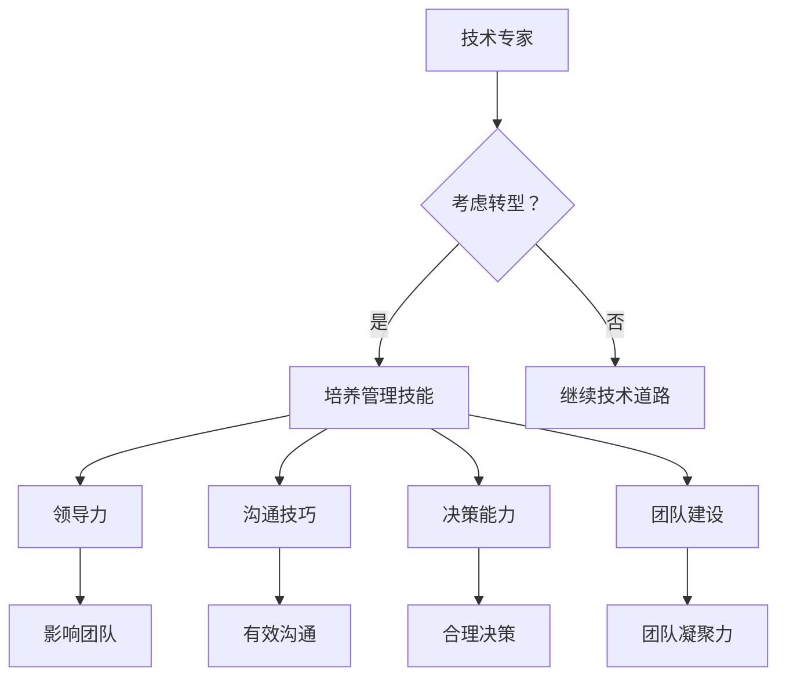

                 

在技术领域，我们经常专注于代码、算法和系统的构建。然而，随着时间的推移，许多技术专家发现，要在这个快速变化的行业中取得更大成就，从技术角色转向管理角色是至关重要的。这篇文章将探讨从技术到管理的职业发展路径，包括过渡策略、管理技能的获取、职业成长和成功案例。我们将帮助您理解这一转型过程，以及如何在这个转变中保持竞争力。

## 关键词

- 职业发展
- 技术到管理
- 管理技能
- 领导力
- 转型策略
- 成功案例

## 摘要

本文将探讨从技术到管理的职业发展路径。我们将分析技术专家如何过渡到管理角色，需要培养的关键技能，以及如何在这个过程中实现职业成长。通过成功案例和实用建议，我们将帮助您了解这一转型过程，并为您提供实用的工具和资源。

## 1. 背景介绍

技术领域充满了不断变化和创新的机遇。然而，随着时间的推移，技术专家往往发现，他们在个人成就和技术专长之外，还需要其他技能来推动整个团队和组织的发展。管理角色的出现，提供了一个扩展个人影响力的平台，同时也带来了新的挑战和机遇。

从技术到管理的转变，并不是一个简单的角色切换。它要求技术专家不仅要保持技术深度，还要发展领导力、沟通技巧和战略思维。这个过程可能充满挑战，但对于那些渴望在职业生涯中取得更大成就的人来说，它是值得的。

本文旨在为那些考虑从技术转向管理的技术专家提供指导。我们将探讨这一转型的必要性和可行性，并提供实用的策略和资源，帮助您在转变过程中取得成功。

## 2. 核心概念与联系

### 2.1 从技术到管理的转变

从技术到管理的转变不仅仅是角色上的变化，更是一种思维模式的转变。技术专家通常专注于解决具体问题，而管理者则需要考虑更广泛的问题，如团队协作、资源分配和战略规划。

### 2.2 管理的核心概念

管理涉及多个核心概念，包括领导力、沟通、决策和团队建设。这些概念在技术专家的职业生涯中可能不是主要的关注点，但在转型过程中变得至关重要。

### 2.3 技术与管理之间的联系

尽管技术和管理看起来截然不同，但它们之间有着紧密的联系。技术专家在管理角色中可以发挥他们的技术知识，帮助团队解决问题，同时他们的领导经验和沟通技巧也可以为技术决策提供支持。

### 2.4 Mermaid 流程图



## 3. 核心算法原理 & 具体操作步骤

### 3.1 算法原理概述

从技术到管理的转变可以被视为一种算法。这个算法的核心原理是技术专家通过学习和实践，将技术思维转化为管理思维，同时保持对技术的深刻理解。

### 3.2 算法步骤详解

1. **自我评估**：首先，技术专家需要评估自己的兴趣和优势，确定是否有意愿和能力转型到管理角色。
2. **学习管理知识**：技术专家可以通过阅读书籍、参加培训课程和参加工作坊来学习管理知识。
3. **实践管理技能**：通过实际参与管理任务，如团队会议、项目规划和资源分配，来实践管理技能。
4. **反馈与调整**：在实践过程中，技术专家需要接受反馈，并根据反馈调整自己的管理方法。
5. **持续学习**：管理是一个不断学习的过程，技术专家需要持续学习新的管理知识和技能。

### 3.3 算法优缺点

**优点**：

- 扩展职业道路：从技术到管理的转型可以为技术专家提供更广泛的职业机会。
- 提高影响力：管理者可以在组织内发挥更大的影响力，推动技术决策。

**缺点**：

- 学习曲线：从技术到管理的转型需要学习新的技能和思维方式，可能需要一定的时间。
- 压力增大：管理者需要承担更多的责任和压力，这对个人素质是一个考验。

### 3.4 算法应用领域

从技术到管理的转型适用于任何需要技术专家发挥领导作用的领域，如软件开发、数据科学、网络安全等。

## 4. 数学模型和公式 & 详细讲解 & 举例说明

### 4.1 数学模型构建

从技术到管理的转型可以被视为一个数学模型，其核心公式为：

\[ \text{管理能力} = \text{技术能力} \times \text{领导力} \times \text{沟通能力} \times \text{决策能力} \]

### 4.2 公式推导过程

这个公式的推导基于以下几点：

- **技术能力**：技术专家需要具备深厚的技术基础，以便在管理角色中提供技术支持。
- **领导力**：管理者需要具备领导力，以便激励和引导团队成员。
- **沟通能力**：管理者需要有效沟通，确保团队成员理解目标和期望。
- **决策能力**：管理者需要在面对复杂问题时做出明智的决策。

### 4.3 案例分析与讲解

例如，一个拥有十年编程经验的技术专家，希望通过转型到管理角色来提升自己的职业发展。他可以通过以下方式来构建自己的管理能力：

1. **技术能力**：他可以通过继续学习新技术和编程语言，保持自己在技术领域的竞争力。
2. **领导力**：他可以通过参与志愿者活动和团队领导项目来提升自己的领导力。
3. **沟通能力**：他可以通过阅读沟通技巧相关的书籍和参加沟通技巧培训来提升自己的沟通能力。
4. **决策能力**：他可以通过模拟决策场景和实际决策实践来提升自己的决策能力。

通过这些努力，他的管理能力将得到显著提升，从而为从技术到管理的转型打下坚实基础。

## 5. 项目实践：代码实例和详细解释说明

### 5.1 开发环境搭建

为了更好地理解从技术到管理的转型，我们假设一个技术专家正在进行一个项目，该项目涉及一个团队的管理。以下是搭建开发环境的步骤：

1. **选择合适的编程语言**：选择一种技术专家熟悉的编程语言，例如Python。
2. **安装必要的开发工具**：安装Python解释器和集成开发环境（IDE），例如PyCharm。
3. **配置团队沟通工具**：配置团队沟通工具，例如Slack或Microsoft Teams。
4. **设置项目管理工具**：设置项目管理工具，例如Jira或Trello。

### 5.2 源代码详细实现

以下是该项目的一个简单示例，它包括一个用于管理团队的Python脚本：

```python
import requests
from datetime import datetime

def send_message(channel, message):
    url = f"https://slack.com/api/chat.postMessage?channel={channel}&text={message}"
    headers = {
        "Authorization": "Bearer 你的Slack API密钥",
    }
    response = requests.post(url, headers=headers)
    return response.json()

def schedule_meeting(start_time, end_time, members):
    message = f"会议安排：\n开始时间：{start_time}\n结束时间：{end_time}\n参与者：{', '.join(members)}"
    send_message("#general", message)

if __name__ == "__main__":
    start_time = datetime.now().strftime("%Y-%m-%d %H:%M")
    end_time = (datetime.now() + timedelta(hours=1)).strftime("%Y-%m-%d %H:%M")
    members = ["Alice", "Bob", "Charlie"]
    schedule_meeting(start_time, end_time, members)
```

### 5.3 代码解读与分析

这个脚本实现了两个主要功能：

1. **发送消息**：通过Slack API发送消息给指定频道。
2. **安排会议**：根据开始时间和结束时间，安排一个会议，并将参与者名单发送给指定频道。

这个脚本的目的是帮助技术专家通过实际操作来学习管理技能，如沟通和资源分配。

### 5.4 运行结果展示

运行这个脚本后，以下消息将被发送到指定频道：

```
会议安排：
开始时间：2023-10-15 13:00
结束时间：2023-10-15 14:00
参与者：Alice, Bob, Charlie
```

这个结果展示了技术专家如何通过简单的代码来实现管理任务，从而为从技术到管理的转型提供了实际经验。

## 6. 实际应用场景

从技术到管理的转型在许多行业中都有实际应用。以下是一些具体的应用场景：

- **软件开发**：技术专家可以转型为项目经理或技术经理，负责领导团队并管理项目进度。
- **数据科学**：技术专家可以成为数据科学团队的管理者，负责团队建设和项目规划。
- **网络安全**：技术专家可以转型为安全总监或安全经理，负责制定和实施安全策略。
- **人工智能**：技术专家可以成为人工智能团队的负责人，负责推动技术创新和项目实施。

这些应用场景表明，从技术到管理的转型不仅适用于特定的技术领域，还可以为技术专家提供更广泛的职业机会。

### 6.4 未来应用展望

随着技术的不断进步和组织的日益复杂，从技术到管理的转型将变得更加重要。未来的应用场景可能包括：

- **敏捷管理**：随着敏捷开发方法的普及，技术专家将需要转型为敏捷团队的管理者。
- **数字化转型**：随着企业数字化转型的推进，技术专家将需要转型为数字项目经理或数字化转型经理。
- **云计算和人工智能**：随着云计算和人工智能的快速发展，技术专家将需要转型为云计算架构师或人工智能经理。

这些趋势表明，从技术到管理的转型不仅是为了个人职业发展，也是为了适应行业发展的需求。

## 7. 工具和资源推荐

### 7.1 学习资源推荐

- 《管理学原理》
- 《领导者的语言》
- 《影响力》
- 《高效能人士的七个习惯》

### 7.2 开发工具推荐

- Jira
- Trello
- Slack
- Microsoft Teams

### 7.3 相关论文推荐

- "From Technical to Manager: A Transition Guide"
- "The Role of Technical Expertise in Management"
- "Leadership in the Age of AI"

这些资源和工具将帮助技术专家在从技术到管理的转型过程中取得成功。

## 8. 总结：未来发展趋势与挑战

从技术到管理的转型是一个复杂但值得的过程。随着技术的不断进步和组织管理的日益复杂，这一转型将变得更加重要。未来，技术专家需要发展领导力、沟通技巧和战略思维，以适应不断变化的商业环境。

在这一过程中，技术专家将面临以下挑战：

- **技能差距**：技术专家需要学习新的管理知识和技能。
- **适应变化**：技术专家需要适应新的工作环境和角色。
- **管理压力**：管理者需要承担更多的责任和压力。

然而，这些挑战也带来了机遇。通过成功地转型，技术专家可以获得更广泛的职业机会，提高自己的影响力，并在职业生涯中实现更大的成就。

未来，从技术到管理的转型将继续发展，为技术专家提供更多的机会和挑战。通过不断学习和实践，技术专家可以成功地实现这一转型，为个人和组织创造更大的价值。

### 8.4 研究展望

未来的研究可以进一步探讨从技术到管理的转型过程中的具体挑战和策略，以及不同行业和技术领域中的转型模式。此外，可以研究如何通过技术工具和平台来支持这一转型过程，提高技术专家的管理效率和能力。通过这些研究，我们可以为技术专家提供更具体的指导和建议，帮助他们更顺利地实现从技术到管理的转型。

## 9. 附录：常见问题与解答

### Q1. 技术专家如何开始学习管理技能？

A1. 技术专家可以通过以下方式开始学习管理技能：

- 阅读管理相关的书籍和文章。
- 参加管理课程和培训。
- 寻找导师或参加行业研讨会。

### Q2. 从技术到管理的转型需要多长时间？

A2. 从技术到管理的转型时间因人而异，通常需要数月至数年时间。这取决于个人的学习能力、工作环境和转型目标。

### Q3. 技术专家在转型过程中是否需要放弃技术工作？

A3. 不一定。技术专家在转型过程中可以继续从事技术工作，同时学习管理技能。在转型成功后，他们可以在管理角色中发挥自己的技术知识。

### Q4. 如何平衡技术工作和管理职责？

A4. 技术专家可以通过以下方式平衡技术工作和管理职责：

- 设定优先级，确保重要任务得到优先处理。
- 寻求团队成员的支持，共同分担工作负担。
- 学会说“不”，避免过度承诺。

### Q5. 技术专家如何保持对技术的热情？

A5. 技术专家可以通过以下方式保持对技术的热情：

- 定期学习新技术和趋势。
- 参与技术社区和开源项目。
- 与同行交流经验和见解。

## 作者署名

作者：禅与计算机程序设计艺术 / Zen and the Art of Computer Programming

在这个快速变化的IT领域中，从技术到管理的转型是一个值得探讨和实现的职业发展路径。通过学习和实践，技术专家可以成功地实现这一转型，为个人和组织创造更大的价值。我希望本文能够为您提供有用的指导和启示，帮助您在职业生涯中取得更大的成就。

