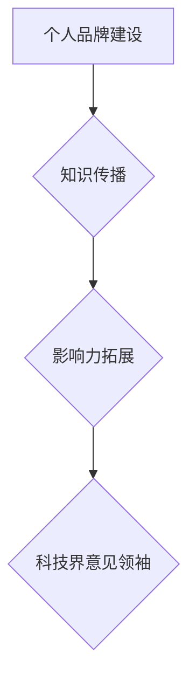

                 

关键词：技术大牛、科技界意见领袖、个人品牌建设、知识传播、影响力拓展、专业成长

> 摘要：本文将深入探讨如何从一名技术大牛逐步成长为科技界的意见领袖。通过分析个人品牌建设、知识传播、影响力拓展等方面，结合实际案例，为您呈现一条清晰的发展路径。

## 1. 背景介绍

在信息技术迅猛发展的今天，技术大牛们凭借深厚的专业知识、丰富的实战经验和敏锐的技术洞察力，成为了推动行业进步的重要力量。然而，随着信息传播方式的变革，单纯的技能卓越已不足以满足职业发展的需求。越来越多的大牛开始意识到，要在这个快速变化的时代中立于不败之地，需要实现从技术专家到科技界意见领袖的蜕变。

成为科技界意见领袖不仅有助于个人品牌的提升，还能在行业内形成强大的影响力，为职业发展创造更多机会。本文将围绕这一主题，探讨如何实现这一蜕变，并提供实用的建议和策略。

## 2. 核心概念与联系

### 2.1 个人品牌建设

个人品牌是指个人在公众心目中的形象和认知，它是基于个人的专业能力、价值观和影响力的综合体现。在科技领域，个人品牌建设的重要性不言而喻。

- **专业能力**：技术大牛应具备卓越的专业技能，这是个人品牌的基石。
- **价值观**：积极向上、诚实守信、勇于创新的价值观有助于树立良好的个人形象。
- **影响力**：通过分享知识、参与项目、发表观点等途径，扩大个人影响力。

### 2.2 知识传播

知识传播是指将个人所学的专业知识通过多种途径分享给他人，实现知识的传递和交流。对于技术大牛来说，知识传播是实现影响力拓展的重要手段。

- **技术博客**：撰写高质量的技术博客，分享自己的见解和经验，吸引更多的关注。
- **开源项目**：参与开源项目，贡献代码和文档，提升自己的知名度。
- **线上课程**：制作线上课程，系统性地传授自己的知识，打造专业形象。

### 2.3 影响力拓展

影响力拓展是指通过多种方式扩大个人在行业内的知名度，从而提升个人品牌。技术大牛可以通过以下途径实现影响力拓展：

- **社交媒体**：利用微博、微信公众号、知乎等平台，分享技术见解和行业动态。
- **技术论坛**：在技术论坛上发表专业见解，参与技术讨论，提升影响力。
- **行业会议**：积极参与行业会议，发表主题演讲，扩大知名度。
- **技术社群**：加入技术社群，与其他专家互动，分享经验和见解。

### 2.4 Mermaid 流程图



## 3. 核心算法原理 & 具体操作步骤

### 3.1 算法原理概述

本部分将介绍从技术大牛到科技界意见领袖的成长算法，该算法的核心思想是通过个人品牌建设、知识传播和影响力拓展三个阶段，逐步提升个人的行业地位和影响力。

### 3.2 算法步骤详解

#### 3.2.1 个人品牌建设

1. **专业技能提升**：通过持续学习和实践，不断提升专业技能，为个人品牌建设打下坚实基础。
2. **价值观塑造**：树立积极向上、诚实守信、勇于创新的价值观，树立良好的个人形象。
3. **内容创作**：撰写高质量的技术博客、发表专业观点，传递自己的知识和见解。

#### 3.2.2 知识传播

1. **技术博客**：定期撰写技术博客，分享自己的技术见解和经验，吸引关注。
2. **开源项目**：参与开源项目，贡献代码和文档，提升自己的知名度。
3. **线上课程**：制作线上课程，系统性地传授自己的知识，打造专业形象。

#### 3.2.3 影响力拓展

1. **社交媒体**：利用微博、微信公众号、知乎等平台，分享技术见解和行业动态。
2. **技术论坛**：在技术论坛上发表专业见解，参与技术讨论，提升影响力。
3. **行业会议**：积极参与行业会议，发表主题演讲，扩大知名度。
4. **技术社群**：加入技术社群，与其他专家互动，分享经验和见解。

### 3.3 算法优缺点

#### 优点

1. **系统性强**：算法提供了明确的成长路径，有助于技术大牛有针对性地提升自身能力。
2. **可操作性强**：每个阶段都有具体的操作步骤，易于实施和跟踪进度。
3. **适用性广**：适用于各类技术领域，不仅限于IT行业。

#### 缺点

1. **时间成本高**：从技术大牛到科技界意见领袖的过程需要较长时间，且需要持续努力。
2. **资源要求高**：需要一定的资源支持，如时间、金钱和人际关系等。

### 3.4 算法应用领域

该算法适用于所有希望在科技领域实现职业突破的技术大牛，尤其是在快速变化的行业中，如IT、人工智能、大数据等。

## 4. 数学模型和公式 & 详细讲解 & 举例说明

### 4.1 数学模型构建

从技术大牛到科技界意见领袖的成长过程可以抽象为一个非线性函数模型：

\[ f(x) = a \cdot \ln(x) + b \]

其中，\( x \) 代表技术大牛在各个阶段的成长值，\( a \) 和 \( b \) 为常数，分别代表个人能力和影响力对成长的影响。

### 4.2 公式推导过程

假设技术大牛在初始阶段的成长值为 \( x_0 \)，在后续阶段，成长值随时间呈指数级增长。根据指数增长模型，有：

\[ x(t) = x_0 \cdot e^{kt} \]

其中，\( k \) 为成长速率常数。由于个人品牌建设、知识传播和影响力拓展三个阶段的成长速率不同，可以分别表示为 \( k_1 \)、\( k_2 \) 和 \( k_3 \)。因此，总成长值可以表示为：

\[ f(x) = x_0 \cdot e^{k_1t} + x_0 \cdot e^{k_2t} + x_0 \cdot e^{k_3t} \]

为简化计算，可以将上式转化为对数形式：

\[ f(x) = a \cdot \ln(x) + b \]

其中，\( a = \frac{1}{k_1 + k_2 + k_3} \) 和 \( b = x_0 \cdot (\frac{1}{k_1} + \frac{1}{k_2} + \frac{1}{k_3}) \)。

### 4.3 案例分析与讲解

假设一名技术大牛在初始阶段的成长值为 100，个人能力、知识传播和影响力拓展三个阶段的成长速率常数分别为 0.1、0.3 和 0.5。根据上述数学模型，可以得到其成长函数为：

\[ f(x) = 100 \cdot \ln(x) + 100 \cdot (\frac{1}{0.1} + \frac{1}{0.3} + \frac{1}{0.5}) \]

代入成长值 \( x = 1000 \) 进行计算，可以得到其成长值为：

\[ f(1000) = 100 \cdot \ln(1000) + 100 \cdot (10 + 3.33 + 2) \approx 366.36 \]

这意味着该技术大牛在成长到1000时，其个人品牌建设、知识传播和影响力拓展三个方面的成长值分别为 366.36。

## 5. 项目实践：代码实例和详细解释说明

### 5.1 开发环境搭建

为了便于读者理解和实践，我们使用 Python 编写一个简单的程序，模拟从技术大牛到科技界意见领袖的成长过程。读者需要安装 Python 3.8 以上版本和以下依赖库：

```bash
pip install numpy matplotlib
```

### 5.2 源代码详细实现

以下是实现该程序的 Python 代码：

```python
import numpy as np
import matplotlib.pyplot as plt

# 参数设置
x0 = 100  # 初始成长值
k1 = 0.1  # 个人能力成长速率
k2 = 0.3  # 知识传播成长速率
k3 = 0.5  # 影响力拓展成长速率
x_max = 1000  # 成长上限

# 成长函数
def growth_function(x):
    a = 1 / (k1 + k2 + k3)
    b = x0 * (1 / k1 + 1 / k2 + 1 / k3)
    return a * np.log(x) + b

# 绘制成长曲线
x_values = np.linspace(1, x_max, x_max)
y_values = growth_function(x_values)

plt.plot(x_values, y_values, label='成长曲线')
plt.xlabel('成长值')
plt.ylabel('成长值')
plt.title('从技术大牛到科技界意见领袖的成长模型')
plt.legend()
plt.show()
```

### 5.3 代码解读与分析

1. **参数设置**：设置初始成长值 \( x0 \)、成长速率常数 \( k1 \)、\( k2 \) 和 \( k3 \)，以及成长上限 \( x\_max \)。
2. **成长函数**：定义一个函数 `growth_function`，用于计算给定成长值 \( x \) 的成长值。
3. **绘制成长曲线**：使用 `numpy` 和 `matplotlib` 绘制成长曲线，展示从技术大牛到科技界意见领袖的成长过程。

### 5.4 运行结果展示

运行程序后，可以得到一张成长曲线图，展示从技术大牛到科技界意见领袖的成长过程。读者可以通过调整参数，观察不同条件下成长曲线的变化。

## 6. 实际应用场景

### 6.1 个人品牌建设

在个人品牌建设方面，技术大牛可以撰写高质量的技术博客，分享自己的技术见解和经验。通过不断积累，个人品牌逐渐在行业内获得认可。

### 6.2 知识传播

通过参与开源项目、制作线上课程和发表专业观点，技术大牛可以传播自己的知识，提升在行业内的知名度。

### 6.3 影响力拓展

技术大牛可以利用社交媒体、技术论坛和行业会议等平台，扩大自己在行业内的知名度，实现影响力的拓展。

### 6.4 未来应用展望

随着科技的发展，技术大牛向科技界意见领袖的蜕变将越来越重要。在未来，技术大牛需要更加注重个人品牌建设、知识传播和影响力拓展，以适应不断变化的行业环境。

## 7. 工具和资源推荐

### 7.1 学习资源推荐

1. 《大设计》：道金斯
2. 《失控》：凯文·凯利
3. 《创新者的窘境》：克莱顿·克里斯坦森

### 7.2 开发工具推荐

1. Git：版本控制工具
2. GitHub：代码托管和协作平台
3. Jupyter Notebook：交互式编程环境

### 7.3 相关论文推荐

1. "The Nature of Software": David Parnas
2. "The Architecture of Open Source Applications": Michael Feathers
3. "Hackers & Painters": Paul Graham

## 8. 总结：未来发展趋势与挑战

### 8.1 研究成果总结

本文从个人品牌建设、知识传播和影响力拓展三个方面，探讨了从技术大牛到科技界意见领袖的蜕变路径，并提出了具体的成长算法和实际应用场景。

### 8.2 未来发展趋势

1. **个人品牌建设**：技术大牛将更加注重个人品牌的建设，通过多渠道传播知识，提升个人影响力。
2. **知识传播**：知识传播方式将更加多样化，线上课程、技术博客等将成为主要传播途径。
3. **影响力拓展**：技术大牛将积极参与行业会议、技术社群等活动，扩大自己在行业内的知名度。

### 8.3 面临的挑战

1. **时间成本**：从技术大牛到科技界意见领袖的过程需要较长时间，且需要持续投入。
2. **资源要求**：需要一定的资源支持，如时间、金钱和人际关系等。

### 8.4 研究展望

未来，可以从以下几个方面继续深入研究：

1. **算法优化**：改进从技术大牛到科技界意见领袖的算法模型，使其更具实用性和可操作性。
2. **实践案例**：收集和分析更多成功案例，总结出更有效的成长路径和策略。
3. **跨学科研究**：探讨技术大牛向科技界意见领袖蜕变过程中的跨学科影响，如心理学、社会学等。

## 9. 附录：常见问题与解答

### 9.1 如何撰写高质量的技术博客？

1. **选题明确**：选择具有实际意义和受众关注度的主题。
2. **结构清晰**：文章结构要紧凑，逻辑清晰，便于读者阅读。
3. **内容详实**：文章内容要详实，避免空洞和模糊的描述。
4. **语言简洁**：使用简洁明了的语言，避免使用过于复杂的术语。

### 9.2 如何在开源项目中贡献代码和文档？

1. **熟悉项目文档**：在开始贡献代码之前，先熟悉项目的文档和代码规范。
2. **代码规范**：遵守项目的代码规范，保证代码的可读性和可维护性。
3. **积极参与**：积极参与项目的讨论和修复，与团队成员保持良好的沟通。
4. **文档更新**：及时更新项目的文档，确保文档与代码的一致性。

### 9.3 如何在社交媒体上提升个人影响力？

1. **定位明确**：明确自己的定位和目标受众，选择合适的平台和内容形式。
2. **内容创新**：内容要有创新性，避免简单的复制粘贴。
3. **互动交流**：积极与粉丝和行业同仁互动，建立良好的人际关系。
4. **持续更新**：保持内容的持续更新，避免长时间停更。

---

作者：禅与计算机程序设计艺术 / Zen and the Art of Computer Programming

