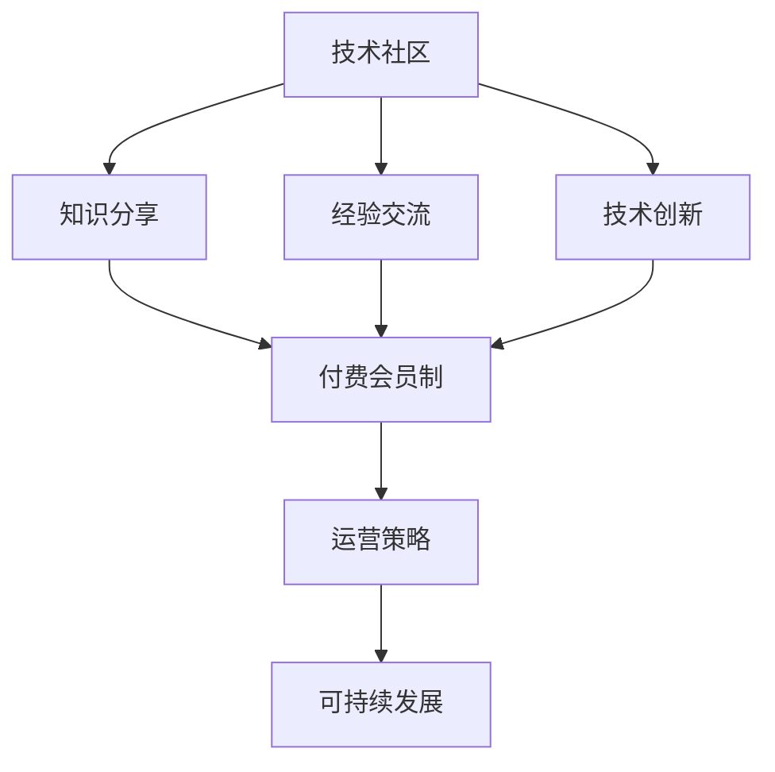

                 

关键词：技术社区、付费会员制、社群运营、程序员、运营策略

摘要：本文将探讨技术社区转型至付费会员制的可能性与挑战，分析程序员的社群需求，探讨如何通过运营策略实现可持续发展，同时为技术社区的未来发展提供一些前瞻性的思考。

## 1. 背景介绍

近年来，随着互联网技术的飞速发展，技术社区在全球范围内蓬勃发展。这些社区不仅为程序员提供了知识分享、经验交流的平台，也成为了技术创新的重要孵化器。然而，随着用户数量的增长和运营成本的上升，技术社区面临着盈利模式的挑战。付费会员制作为一种新的盈利模式，逐渐引起业界关注。

## 2. 核心概念与联系

### 2.1 技术社区

技术社区是指由程序员、开发者和其他对技术感兴趣的人组成的在线平台，旨在分享知识、经验和技术资源。

### 2.2 付费会员制

付费会员制是指用户需要支付一定的费用才能获得社区提供的服务和资源。这种模式通常包括会员专享内容、优先支持等。

### 2.3 社群运营

社群运营是指通过一系列策略和手段，管理、维护和发展技术社区，提升用户体验和用户黏性。

### 2.4 Mermaid 流程图



## 3. 核心算法原理 & 具体操作步骤

### 3.1 算法原理概述

付费会员制的核心在于通过提供有价值的专享内容和服务，吸引用户付费，从而实现盈利。其算法原理可以概括为：

1. **价值定位**：明确会员制提供的内容和服务的价值。
2. **用户细分**：根据用户需求和行为，将用户划分为不同的细分市场。
3. **价格策略**：制定合理的价格策略，以最大化收益。
4. **用户体验**：确保会员享受到优质的服务体验，提升用户满意度。

### 3.2 算法步骤详解

1. **需求调研**：通过问卷调查、用户访谈等方式，了解用户对付费会员制的需求和期望。
2. **内容规划**：根据用户需求，规划出有吸引力的会员专享内容。
3. **价格模型**：结合成本、市场竞争等因素，制定合理的价格模型。
4. **推广营销**：通过线上线下活动、广告投放等方式，宣传会员制，吸引潜在用户。
5. **用户反馈**：收集用户反馈，持续优化会员服务和体验。
6. **数据监控**：定期分析会员数据，调整运营策略。

### 3.3 算法优缺点

**优点**：

- 可持续盈利：通过会员费用，实现社区的长期发展。
- 提升用户黏性：提供有价值的专享内容，增加用户对社区的依赖。
- 提高服务品质：专注服务于付费用户，提升用户体验。

**缺点**：

- 增加运营成本：需要投入更多资源进行内容制作、用户管理等。
- 可能影响免费用户：付费会员制可能引发免费用户的不满，导致流失。

### 3.4 算法应用领域

付费会员制适用于各种技术社区，如编程语言社区、开源项目社区、技术论坛等。通过合理运用算法原理和操作步骤，技术社区可以实现从免费模式向付费会员制的成功转型。

## 4. 数学模型和公式 & 详细讲解 & 举例说明

### 4.1 数学模型构建

假设技术社区有N个用户，其中M个用户选择付费会员，每个用户的付费意愿为Wi，社区的总成本为C，会员费用为P。

会员收入 R = ΣWi * P

利润 L = R - C

### 4.2 公式推导过程

会员收入 R 的计算公式为：R = M * P，其中M为付费会员数，P为会员费用。

利润 L 的计算公式为：L = R - C，其中C为社区总成本。

### 4.3 案例分析与讲解

以一个拥有1000个用户的编程社区为例，假设每个用户的付费意愿平均为10元，社区的总成本为5000元。

- 会员收入 R = 1000 * 10 = 10000元
- 利润 L = R - C = 10000 - 5000 = 5000元

如果社区提高会员费用至15元，其他条件不变，则：

- 会员收入 R = 1000 * 15 = 15000元
- 利润 L = R - C = 15000 - 5000 = 10000元

可见，提高会员费用可以显著增加社区利润。

## 5. 项目实践：代码实例和详细解释说明

### 5.1 开发环境搭建

搭建一个简单的技术社区平台，可以选择使用如Django等流行的Web框架。

### 5.2 源代码详细实现

以下是一个简单的会员制实现的伪代码示例：

```python
class User(models.Model):
    username = models.CharField(max_length=255)
    is_member = models.BooleanField(default=False)
    membership_start = models.DateField(null=True, blank=True)

class Membership(models.Model):
    user = models.OneToOneField(User, on_delete=models.CASCADE)
    start_date = models.DateField()
    end_date = models.DateField()

def become_member(user, duration_months):
    membership = Membership(user=user, start_date=timezone.now(), end_date=timezone.now() + relativedelta(months=duration_months))
    membership.save()
    user.is_member = True
    user.save()

def check_membership(user):
    if user.is_member:
        membership = Membership.objects.get(user=user)
        if timezone.now() < membership.end_date:
            return True
        else:
            user.is_member = False
            user.save()
            return False
    return False
```

### 5.3 代码解读与分析

这个示例中，我们定义了两个模型：User和Membership。User模型表示用户，包含用户名和会员状态。Membership模型表示会员资格，包含用户、开始日期和结束日期。

become_member函数用于将用户转换为会员，并设置会员资格的开始和结束日期。check_membership函数用于检查用户是否仍然拥有会员资格。

### 5.4 运行结果展示

通过这些代码，用户可以成为会员并享受专享内容，同时社区可以管理会员资格，确保用户体验和运营的顺利进行。

## 6. 实际应用场景

付费会员制在技术社区中具有广泛的应用场景。例如：

- 提供独家技术教程和文档
- 举办线上研讨会和讲座
- 提供代码审查和项目支持
- 发布最新技术趋势和分析报告

## 7. 工具和资源推荐

### 7.1 学习资源推荐

- 《社交网络分析：方法、模型与算法》
- 《运营之光：从成长到盈利》
- 《社群营销实战：方法、技巧与案例分析》

### 7.2 开发工具推荐

- Django
- Flask
- Ruby on Rails

### 7.3 相关论文推荐

- “Social Network Analysis in the Age of Big Data”
- “Community Management: Strategies for the Digital Age”
- “Monetizing Online Communities: Strategies for Sustaining and Growing Your Community”

## 8. 总结：未来发展趋势与挑战

### 8.1 研究成果总结

技术社区通过付费会员制实现了可持续盈利，提升了用户体验和社区品质。然而，付费会员制也面临运营成本增加和用户流失的风险。

### 8.2 未来发展趋势

- 个性化服务：通过数据分析，提供更加个性化的会员服务。
- 社群化运营：加强社区互动，提高用户黏性。
- 多元化盈利模式：结合广告、咨询服务等多种方式，实现多元化收入。

### 8.3 面临的挑战

- 盈利模式创新：探索新的盈利模式，降低运营成本。
- 用户满意度：提高会员服务质量，确保用户满意度。
- 竞争压力：应对其他社区和平台的竞争，保持市场竞争力。

### 8.4 研究展望

未来的研究可以关注以下几个方面：

- 会员行为分析：通过数据挖掘，分析会员行为，优化运营策略。
- 社群生态建设：构建健康的社群生态，促进知识共享和创新发展。
- 新型付费模式：探索新的付费模式，提高社区盈利能力。

## 9. 附录：常见问题与解答

### 9.1 会员制是否会影响免费用户？

付费会员制可能会影响免费用户，但通过合理的价格策略和内容规划，可以减少免费用户的不满，提升整体用户满意度。

### 9.2 如何保证会员内容的质量？

通过严格的内容审核和专家评审机制，确保会员内容的质量和权威性。

### 9.3 如何处理会员流失？

通过持续的用户反馈和数据分析，及时调整运营策略，提高会员服务的质量和吸引力。

## 作者署名

作者：禅与计算机程序设计艺术 / Zen and the Art of Computer Programming
```

