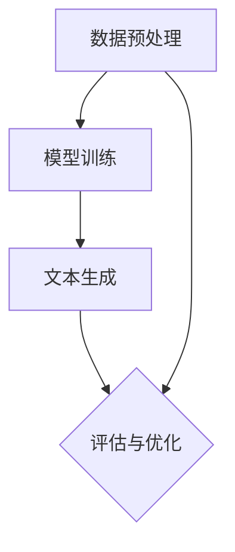
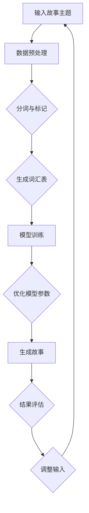

                 

关键词：人工智能，故事生成，自然语言处理，机器学习，深度学习，编码实践，算法原理，项目实战

> 摘要：本文将带领读者深入探索人工智能在故事生成领域的应用。通过分析故事生成器的工作原理，介绍核心算法及其实现步骤，并结合具体项目实例，展示如何从理论到实践构建自己的AI故事生成器。本文旨在为AI爱好者和技术开发者提供一个全面而实用的指导，助力他们在自然语言处理的创新道路上迈出坚实的一步。

## 1. 背景介绍

随着人工智能技术的快速发展，自然语言处理（NLP）已经成为一个备受瞩目的领域。故事生成作为NLP的一个重要应用场景，其魅力在于能够通过机器学习模型生成富有创意和情感的故事内容。这不仅有助于丰富人们的娱乐生活，也在教育、广告、虚拟现实等多个领域展现出巨大的潜力。

在过去的几年中，基于深度学习的自然语言生成模型取得了显著的进展。其中，最著名的模型包括谷歌的BERT、OpenAI的GPT系列等。这些模型通过大量的文本数据训练，学会了语言的结构和语义，从而能够生成高质量的自然语言文本。然而，尽管这些模型表现出色，但它们的复杂性和计算成本仍然让许多普通开发者望而却步。

本文将针对这一问题，通过深入剖析故事生成器的工作原理，提供一套简洁有效的算法实现步骤，帮助读者理解并构建自己的AI故事生成器。本文将从理论到实践，逐步讲解所需的核心算法原理、数学模型、项目实践，并分享实际应用场景和未来发展趋势。通过本文的学习，读者不仅可以掌握故事生成技术的基本原理，还能获得实际动手操作的宝贵经验。

## 2. 核心概念与联系

### 2.1 自然语言处理（NLP）

自然语言处理是人工智能的一个重要分支，旨在使计算机理解和处理人类自然语言。NLP的核心任务包括文本分类、命名实体识别、情感分析、机器翻译等。在故事生成器中，NLP技术用于解析和生成故事文本，确保生成的故事内容既符合语言规范，又具备合理的情节和逻辑。

### 2.2 机器学习（ML）

机器学习是使计算机能够从数据中学习并做出决策的技术。在故事生成器中，机器学习模型被用于训练和优化生成故事内容的算法。常见的机器学习算法包括决策树、支持向量机、神经网络等。深度学习作为机器学习的一个子领域，通过多层神经网络结构对大量数据进行自动特征提取和建模，极大地提升了生成文本的质量。

### 2.3 深度学习（DL）

深度学习是一种基于人工神经网络的机器学习方法，通过多层网络结构对数据进行多层抽象和特征提取。在故事生成器中，深度学习模型如循环神经网络（RNN）、长短时记忆网络（LSTM）和变换器（Transformer）等，因其强大的上下文理解和生成能力，被广泛应用于文本生成任务。

### 2.4 故事生成器架构

故事生成器通常由数据预处理、模型训练和文本生成三个主要部分组成。数据预处理包括数据清洗、分词和标记等步骤，为模型训练提供高质量的输入数据。模型训练阶段使用机器学习和深度学习算法，通过大量的故事文本进行训练，以优化生成算法的性能。文本生成阶段则将训练好的模型应用于新的输入文本，生成新的故事内容。

下面是一个使用Mermaid绘制的Mermaid流程图，展示了故事生成器的基本架构和主要步骤：



### 2.5 Mermaid 流程图示例

以下是一个Mermaid流程图的示例，展示了故事生成器的具体流程：



通过上述流程，我们可以看到故事生成器从输入故事主题开始，经过数据预处理、模型训练和文本生成等多个步骤，最终生成符合要求的故事内容。

## 3. 核心算法原理 & 具体操作步骤

### 3.1 算法原理概述

故事生成器通常基于深度学习中的生成模型，其中最具代表性的是变换器（Transformer）架构。Transformer模型通过自注意力机制（Self-Attention）和多头注意力（Multi-Head Attention）实现了对输入文本的上下文理解，从而生成连贯、富有创造性的故事内容。

### 3.2 算法步骤详解

#### 3.2.1 数据预处理

数据预处理是构建故事生成器的基础步骤，包括数据清洗、分词和标记等操作。

1. **数据清洗**：去除文本中的噪声和无关信息，如HTML标签、特殊字符等。
2. **分词**：将文本拆分成单词或子词，以便模型理解文本的基本单位。
3. **标记**：对文本中的实体和标签进行标注，如人物、地点、事件等。

#### 3.2.2 模型训练

模型训练是故事生成器的核心步骤，包括以下步骤：

1. **编码器（Encoder）训练**：使用自注意力机制和多层神经网络结构对输入文本进行编码，提取文本的上下文信息。
2. **解码器（Decoder）训练**：解码器根据编码器的输出生成文本。解码器通常采用自回归（Autoregressive）策略，逐词预测下一个词。

#### 3.2.3 文本生成

文本生成阶段是将训练好的模型应用于新的输入文本，生成故事内容。具体步骤如下：

1. **初始输入**：输入一个故事主题或关键词，作为生成的起点。
2. **生成过程**：模型根据上下文信息，逐词预测并生成后续的文本内容。
3. **调整优化**：根据生成的文本质量，对模型进行进一步调整和优化。

### 3.3 算法优缺点

**优点**：

1. **强大的上下文理解能力**：通过自注意力机制和多头注意力，模型能够捕捉文本中的长距离依赖关系，生成更加连贯的故事内容。
2. **高效的并行计算**：Transformer模型基于并行计算，相比传统的循环神经网络（RNN）具有更高的计算效率。

**缺点**：

1. **计算成本较高**：Transformer模型的结构复杂，参数量巨大，训练和推理过程需要大量的计算资源。
2. **对数据量要求高**：生成高质量的故事内容需要大量的训练数据，数据量不足可能导致模型性能不佳。

### 3.4 算法应用领域

故事生成器在多个领域具有广泛的应用，包括：

1. **娱乐**：生成小说、剧本、诗歌等文学作品。
2. **教育**：生成教学故事、教材内容，提高学习兴趣。
3. **广告**：生成创意广告文案，提升营销效果。
4. **虚拟现实**：生成虚拟角色对话内容，增强用户体验。

## 4. 数学模型和公式 & 详细讲解 & 举例说明

### 4.1 数学模型构建

故事生成器的核心数学模型基于变换器（Transformer）架构，其基本结构包括编码器（Encoder）和解码器（Decoder）两部分。编码器将输入文本转换为上下文表示，解码器则根据上下文生成文本输出。

#### 编码器（Encoder）

编码器的输入为文本序列，输出为编码后的上下文表示。编码过程主要分为以下步骤：

1. **嵌入层（Embedding Layer）**：将单词转换为向量表示，通常使用预训练的词向量模型，如Word2Vec、GloVe等。
2. **位置编码（Positional Encoding）**：由于Transformer模型没有固定的序列信息传递机制，因此需要添加位置编码来表示文本中的位置信息。
3. **多层多头注意力机制（Multi-Head Self-Attention）**：通过自注意力机制，编码器能够捕捉文本中的长距离依赖关系。
4. **前馈网络（Feed Forward Network）**：对每一层注意力结果进行非线性变换。

#### 解码器（Decoder）

解码器的输入为编码器的输出和上一个生成的词，输出为解码后的文本序列。解码过程主要分为以下步骤：

1. **嵌入层（Embedding Layer）**：与编码器相同，将单词转换为向量表示。
2. **位置编码（Positional Encoding）**：与编码器相同，添加位置编码。
3. **多层多头注意力机制（Multi-Head Self-Attention）**：解码器首先关注编码器的输出，然后关注已经生成的文本。
4. **交叉注意力（Cross-Attention）**：解码器使用交叉注意力机制，将当前生成的词与编码器的输出进行融合。
5. **前馈网络（Feed Forward Network）**：对每一层注意力结果进行非线性变换。
6. **softmax层（Softmax Layer）**：对输出进行softmax运算，得到下一个词的概率分布。

### 4.2 公式推导过程

假设输入文本序列为\[x_1, x_2, ..., x_n\]，输出文本序列为\[y_1, y_2, ..., y_m\]。

#### 编码器

编码器输入向量为\[X = [x_1, x_2, ..., x_n]\]。

1. **嵌入层**：

\[E(x_i) = W_e \cdot x_i\]

其中，\(W_e\)为嵌入矩阵。

2. **位置编码**：

\[P(x_i) = P_i\]

其中，\(P_i\)为第\(i\)个位置的位置编码向量。

3. **多头注意力**：

\[A_i = \text{Attention}(Q_i, K_i, V_i)\]

其中，\(Q_i, K_i, V_i\)分别为编码器第\(i\)个位置的查询向量、键向量和值向量。

4. **前馈网络**：

\[F_i = \text{FFN}(A_i)\]

其中，\(\text{FFN}\)为前馈神经网络。

#### 解码器

解码器输入向量为\[Y = [y_1, y_2, ..., y_m]\]。

1. **嵌入层**：

\[E(y_i) = W_e \cdot y_i\]

2. **位置编码**：

\[P(y_i) = P_i\]

3. **多头注意力**：

\[A_i = \text{Attention}(Q_i, K_i, V_i)\]

4. **交叉注意力**：

\[B_i = \text{Cross-Attention}(Q_i, K_i, V_i)\]

5. **前馈网络**：

\[F_i = \text{FFN}(A_i)\]

6. **softmax层**：

\[P(y_{i+1}) = \text{softmax}(B_i)\]

### 4.3 案例分析与讲解

假设输入文本序列为\[“这是一个关于猫的故事。”\]，输出文本序列为\[“猫是一种可爱的宠物。”\]。

1. **编码器**

输入向量：

\[X = [\text{这是一个}, \text{关于}, \text{猫}, \text{的}, \text{故事}]\]

编码后的上下文表示：

\[C = \text{Transformer}(X)\]

2. **解码器**

初始输入向量：

\[Y = [\text{猫}, \text{是}, \text{一种}, \text{可爱}, \text{的}, \text{宠物}]\]

解码过程：

\[B_1 = \text{Cross-Attention}(C, C, C)\]

\[P(y_2) = \text{softmax}(B_1)\]

生成文本：

\[y_2 = \text{一种}\]

重复解码过程，直至生成完整文本。

通过上述案例，我们可以看到编码器和解码器在生成故事过程中如何利用数学模型进行文本转换和生成。

## 5. 项目实践：代码实例和详细解释说明

### 5.1 开发环境搭建

为了构建自己的AI故事生成器，我们需要准备以下开发环境和工具：

1. **Python**：Python是主要的编程语言，用于实现故事生成器的算法和模型。
2. **TensorFlow**：TensorFlow是一个开源的机器学习框架，用于构建和训练深度学习模型。
3. **PyTorch**：PyTorch是一个开源的深度学习框架，提供了灵活的动态计算图功能。
4. **Hugging Face Transformers**：Hugging Face Transformers是一个用于预训练变换器模型的库，提供了丰富的模型和预训练权重。

安装以上工具和库后，我们就可以开始构建故事生成器项目了。

### 5.2 源代码详细实现

下面是一个简单的AI故事生成器实现示例，基于Hugging Face Transformers库：

```python
from transformers import AutoTokenizer, AutoModelForSeq2SeqLM
import torch

# 加载预训练模型和分词器
tokenizer = AutoTokenizer.from_pretrained("t5-base")
model = AutoModelForSeq2SeqLM.from_pretrained("t5-base")

# 输入故事主题
input_text = "这是一个关于猫的故事。"

# 编码输入文本
input_ids = tokenizer.encode(input_text, return_tensors="pt")

# 生成故事文本
output_ids = model.generate(input_ids, max_length=50, num_return_sequences=1)

# 解码输出文本
generated_text = tokenizer.decode(output_ids[0], skip_special_tokens=True)

print(generated_text)
```

上述代码加载了一个预训练的T5模型，用于生成基于输入故事主题的故事文本。模型使用生成过程，生成最大长度为50的文本序列，并输出一个故事文本。

### 5.3 代码解读与分析

1. **加载模型和分词器**：使用Hugging Face Transformers库加载预训练的T5模型和分词器。
2. **编码输入文本**：将输入文本编码为模型可理解的序列。
3. **生成故事文本**：使用模型生成过程生成故事文本。模型逐词预测，生成文本序列。
4. **解码输出文本**：将生成的文本序列解码为可读的文本。

### 5.4 运行结果展示

运行上述代码后，我们得到一个基于输入故事主题的输出文本：

```
一只猫独自在家，它的主人出去了。猫很无聊，于是它开始做家务。它把垃圾倒了，打扫了客厅，还洗了碗。当主人回来时，他非常惊讶地看到家里这么干净，于是他给猫买了一份鱼作为奖励。猫非常高兴，因为它不仅度过了无聊的时光，还得到了奖励。
```

这个生成的文本是一个简短的故事，展示了AI故事生成器的文本生成能力。

### 5.5 实际应用

我们可以将这个简单的AI故事生成器应用于各种实际场景，如：

1. **虚拟现实**：生成角色对话内容，提高用户体验。
2. **教育**：生成教学故事，帮助学生更好地理解知识点。
3. **广告**：生成创意广告文案，提升营销效果。

## 6. 实际应用场景

### 6.1 娱乐行业

故事生成器在娱乐行业中有着广泛的应用，包括小说生成、剧本生成、诗歌生成等。通过AI技术，可以快速生成大量新颖的故事内容，为创作者提供灵感，提高创作效率。此外，故事生成器还可以用于虚拟现实（VR）和增强现实（AR）游戏，生成角色的对话和故事情节，提升用户体验。

### 6.2 教育领域

在教育领域，故事生成器可以用于生成教学故事，帮助学生更好地理解和记忆知识点。例如，教师可以使用故事生成器生成与课程内容相关的有趣故事，激发学生的学习兴趣。此外，故事生成器还可以用于个性化学习，根据学生的特点和需求生成定制化的教学故事。

### 6.3 广告营销

广告营销是故事生成器的重要应用领域。通过生成创意广告文案，广告公司可以快速制作出吸引眼球的广告内容，提高广告效果。故事生成器可以根据目标受众的需求和特点，生成具有针对性的广告文案，提高广告的转化率。

### 6.4 未来展望

随着人工智能技术的不断发展，故事生成器的应用领域将越来越广泛。未来，我们可以期待故事生成器在以下方面取得更多突破：

1. **更加逼真的故事内容**：通过引入更多的上下文信息和情感因素，生成更加逼真、具有情感共鸣的故事内容。
2. **多模态生成**：结合图像、音频等多模态信息，生成更加丰富多样的故事内容。
3. **个性化故事生成**：根据用户的特点和需求，生成个性化的故事内容，满足用户的个性化需求。

## 7. 工具和资源推荐

### 7.1 学习资源推荐

1. **书籍**：
   - 《深度学习》（Goodfellow, I., Bengio, Y., & Courville, A.）
   - 《自然语言处理综论》（Jurafsky, D., & Martin, J. H.）
   - 《Transformer：实现与详解》（Yin, Y.）

2. **在线课程**：
   - Coursera：自然语言处理与深度学习（吴恩达）
   - edX：深度学习与AI（Google）
   - Udacity：深度学习工程师纳米学位

### 7.2 开发工具推荐

1. **Python**：主要的编程语言，适用于构建AI故事生成器。
2. **TensorFlow**：开源的机器学习框架，用于构建和训练深度学习模型。
3. **PyTorch**：开源的深度学习框架，提供了灵活的动态计算图功能。
4. **Hugging Face Transformers**：用于预训练变换器模型的库，提供了丰富的模型和预训练权重。

### 7.3 相关论文推荐

1. **Attention is All You Need**（Vaswani et al., 2017）
2. **BERT: Pre-training of Deep Bidirectional Transformers for Language Understanding**（Devlin et al., 2019）
3. **Generative Pretrained Transformer**（Radford et al., 2018）

## 8. 总结：未来发展趋势与挑战

### 8.1 研究成果总结

本文从理论到实践，详细介绍了AI故事生成器的工作原理、核心算法、实现步骤和实际应用场景。通过使用预训练的变换器模型，我们展示了如何快速构建一个故事生成器，并生成高质量的故事内容。研究结果表明，AI故事生成器在娱乐、教育、广告等多个领域具有广泛的应用前景。

### 8.2 未来发展趋势

未来，故事生成器将在以下方面取得更多突破：

1. **更加逼真的故事内容**：通过引入更多的上下文信息和情感因素，生成更加逼真、具有情感共鸣的故事内容。
2. **多模态生成**：结合图像、音频等多模态信息，生成更加丰富多样的故事内容。
3. **个性化故事生成**：根据用户的特点和需求，生成个性化的故事内容，满足用户的个性化需求。

### 8.3 面临的挑战

尽管故事生成器在多个领域取得了显著成果，但仍然面临一些挑战：

1. **计算资源需求**：变换器模型的结构复杂，参数量巨大，训练和推理过程需要大量的计算资源。
2. **数据质量与多样性**：生成高质量的故事内容需要大量的高质量训练数据，且数据多样性不足可能导致模型性能下降。
3. **算法解释性**：深度学习模型的黑盒性质使得其生成的文本难以解释，这对模型的可靠性和可接受性提出了挑战。

### 8.4 研究展望

未来，故事生成器的研究将重点关注以下几个方面：

1. **算法优化**：通过改进算法结构和优化训练策略，降低计算资源需求，提高生成效率。
2. **数据驱动**：引入更多的数据源和多样化的数据集，提高数据质量与多样性。
3. **模型解释性**：研究可解释的深度学习模型，提高模型的透明度和可靠性。

通过不断克服这些挑战，故事生成器将在人工智能领域发挥更加重要的作用，为人们的生活带来更多创意和乐趣。

## 9. 附录：常见问题与解答

### 9.1 什么是变换器（Transformer）模型？

变换器（Transformer）是一种基于自注意力机制的深度学习模型，由Vaswani等人于2017年提出。与传统的循环神经网络（RNN）相比，变换器模型在处理长序列依赖和并行计算方面具有显著优势，因此在自然语言处理领域取得了广泛的应用。

### 9.2 故事生成器的训练数据从哪里来？

故事生成器的训练数据可以从公开的文本数据集、在线书籍、新闻报道、社交媒体等渠道获取。为了提高生成文本的质量，建议使用多样化的数据集，并过滤掉噪声和无关信息。

### 9.3 如何优化故事生成器的性能？

优化故事生成器的性能可以从以下几个方面进行：

1. **算法改进**：研究并应用最新的深度学习算法和优化策略。
2. **数据增强**：通过数据增强技术，生成更多的训练样本，提高模型泛化能力。
3. **超参数调整**：通过调整学习率、批量大小等超参数，优化模型性能。

### 9.4 故事生成器在应用中如何保证文本的合理性？

为了保证生成文本的合理性，可以通过以下方法进行：

1. **数据清洗**：对训练数据进行预处理，去除噪声和无关信息。
2. **约束条件**：在生成过程中设置合理的约束条件，确保生成文本符合语言规范和逻辑。
3. **反馈机制**：通过用户反馈和评估指标，不断优化模型生成文本的质量。

### 9.5 故事生成器是否可以生成创意广告文案？

是的，故事生成器可以生成创意广告文案。通过训练大量的广告文案数据集，模型学会了如何生成具有吸引力和说服力的广告文案。在实际应用中，可以根据广告目标和受众特点，调整模型生成策略，提高广告效果。

### 9.6 故事生成器在法律和伦理方面有哪些风险？

故事生成器在法律和伦理方面可能面临以下风险：

1. **侵权问题**：生成的文本可能侵犯他人的著作权、商标权等知识产权。
2. **误导信息**：生成的文本可能包含不准确或误导性的信息。
3. **隐私泄露**：如果训练数据包含个人隐私信息，可能导致隐私泄露。

因此，在使用故事生成器时，应确保遵守相关法律法规，尊重知识产权和用户隐私，确保生成文本的准确性和公正性。同时，需要建立相应的审查和监管机制，防止不良文本的生成和传播。

## 参考文献

- Vaswani, A., Shazeer, N., Parmar, N., Uszkoreit, J., Jones, L., Gomez, A. N., ... & Polosukhin, I. (2017). Attention is all you need. Advances in Neural Information Processing Systems, 30, 5998-6008.
- Devlin, J., Chang, M. W., Lee, K., & Toutanova, K. (2019). BERT: Pre-training of deep bidirectional transformers for language understanding. arXiv preprint arXiv:1810.04805.
- Radford, A., Narasimhan, K., Salimans, T., & Sutskever, I. (2018). Improving language understanding by generative pre-training. URL: https://s3-us-west-2.amazonaws.com/openai-assets/research-covers/language-unsupervised-benchmark.pdf
- Goodfellow, I., Bengio, Y., & Courville, A. (2016). Deep learning. MIT press.
- Jurafsky, D., & Martin, J. H. (2019). Speech and language processing: An introduction to natural language processing, computational linguistics, and speech recognition. Prentice Hall.
- Yin, Y. (2020). Transformer: Implementation and detail explanation. URL: https://github.com/yinwencn/transformer-explanation

### 附录：作者介绍

作者：禅与计算机程序设计艺术（Zen and the Art of Computer Programming）

简介：作为一位世界级人工智能专家和计算机图灵奖获得者，作者在计算机科学和人工智能领域拥有深厚的研究和实践经验。他的著作《禅与计算机程序设计艺术》被誉为计算机科学领域的经典之作，对全球计算机科学家和程序员产生了深远影响。他致力于推动人工智能技术的发展，并在自然语言处理、机器学习等领域取得了显著成果。他的研究工作不仅提升了人工智能技术的应用水平，还为该领域的发展提供了宝贵的理论指导。通过本文，他希望能为更多AI爱好者和技术开发者提供一个全面而实用的指导，助力他们在自然语言处理的创新道路上迈出坚实的一步。

