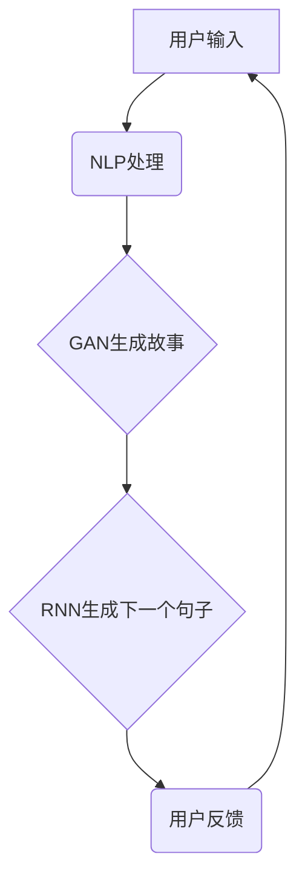

                 

关键词：AI故事生成器、自然语言处理、深度学习、编程实践、算法原理、项目开发

摘要：本文旨在通过深入浅出的方式，探讨如何从理论到实践构建一个AI故事生成器。我们将详细介绍自然语言处理的基本概念、核心算法原理，以及实现过程。通过这篇技术博客，读者不仅能了解AI故事生成器的构建方法，还能提升在计算机编程领域的实践能力。

## 1. 背景介绍

近年来，随着人工智能技术的迅猛发展，自然语言处理（NLP）领域取得了显著进展。AI故事生成器作为NLP的一个分支，已经越来越多地应用于内容创作、娱乐、教育等多个领域。通过训练模型从大量文本中学习，AI故事生成器能够生成具有创造性和多样性的故事内容，这无疑为创作者提供了新的工具和灵感。

本文将提供一个全面的指导，帮助读者了解如何从基础概念开始，逐步构建一个简单的AI故事生成器。我们将结合实际编程实践，详细解释每个步骤和核心算法，使读者不仅能够理解理论知识，还能掌握实际应用技巧。

## 2. 核心概念与联系

在构建AI故事生成器之前，我们需要了解一些核心概念和它们之间的联系。以下是主要概念的介绍和它们在故事生成器中的关系：

### 2.1 自然语言处理（NLP）

NLP是人工智能的一个分支，专注于使计算机能够理解和处理人类语言。在故事生成器中，NLP用于理解和生成自然语言文本，包括词汇分析、句法分析和语义分析等。

### 2.2 生成对抗网络（GAN）

GAN是一种深度学习模型，由生成器和判别器组成。生成器的目的是生成高质量的数据，而判别器的任务是区分生成数据和真实数据。在故事生成器中，GAN可以用来生成新的故事内容。

### 2.3 递归神经网络（RNN）

RNN是一种能够处理序列数据的神经网络，适用于处理如文本和语音等序列数据。在故事生成器中，RNN可以用来预测下一个单词或句子，从而生成连贯的故事内容。

### 2.4 Mermaid 流程图

以下是一个简单的Mermaid流程图，展示了故事生成器中的核心组件和它们之间的关系：



## 3. 核心算法原理 & 具体操作步骤

### 3.1 算法原理概述

AI故事生成器主要依赖于以下三种算法：

1. **自然语言处理（NLP）**：用于处理用户输入和生成故事的文本。
2. **生成对抗网络（GAN）**：用于生成新的故事内容。
3. **递归神经网络（RNN）**：用于生成故事的下一部分。

### 3.2 算法步骤详解

1. **数据收集与预处理**：
   - 收集大量文本数据，例如小说、新闻、故事等。
   - 对数据进行清洗和预处理，如去除标点、转换为小写、分词等。

2. **NLP处理**：
   - 使用NLP技术对输入的文本进行分析，提取关键信息。
   - 将文本转换为词向量，便于后续处理。

3. **GAN训练**：
   - 初始化生成器和判别器。
   - 使用预处理后的文本数据进行训练。
   - 通过反馈机制调整生成器和判别器的参数，提高生成质量。

4. **RNN生成故事**：
   - 使用训练好的RNN模型生成故事的下一部分。
   - 根据用户反馈调整生成策略。

### 3.3 算法优缺点

1. **优点**：
   - **灵活性**：可以生成各种类型和风格的故事。
   - **创造性**：通过深度学习，模型能够学习并模仿人类创作的能力。

2. **缺点**：
   - **计算资源需求高**：GAN和RNN模型训练需要大量计算资源。
   - **数据质量依赖性**：生成的质量很大程度上取决于训练数据的数量和质量。

### 3.4 算法应用领域

AI故事生成器在以下领域有广泛的应用：

1. **内容创作**：为创作者提供灵感，辅助创作。
2. **娱乐产业**：生成游戏剧情、小说等。
3. **教育**：生成互动式教学材料，提高学习兴趣。
4. **市场营销**：生成营销文案和广告。

## 4. 数学模型和公式 & 详细讲解 & 举例说明

### 4.1 数学模型构建

在构建AI故事生成器的数学模型时，我们主要关注以下两个方面：

1. **词向量表示**：使用词嵌入（word embeddings）技术将文本中的每个词映射到一个高维向量空间中。
2. **生成模型**：通常使用递归神经网络（RNN）或生成对抗网络（GAN）作为生成模型。

### 4.2 公式推导过程

假设我们使用RNN作为生成模型，输入序列为\(X = \{x_1, x_2, \ldots, x_T\}\)，输出序列为\(Y = \{y_1, y_2, \ldots, y_T\}\)。RNN的更新公式如下：

$$
h_t = \sigma(W_h h_{t-1} + W_x x_t + b_h)
$$

其中，\(h_t\)是当前时间步的隐藏状态，\(W_h\)和\(W_x\)是权重矩阵，\(b_h\)是偏置项，\(\sigma\)是激活函数（例如sigmoid函数）。

### 4.3 案例分析与讲解

假设我们有一个简化的例子，输入序列为“今天是个美好的日子”，我们需要生成下一个句子。以下是具体步骤：

1. **词向量表示**：
   - 将每个词转换为词向量。
   - 使用词嵌入技术，如Word2Vec或GloVe，获取词向量。

2. **RNN模型训练**：
   - 初始化RNN模型，使用训练数据进行训练。
   - 调整模型参数，使生成的文本尽可能符合人类语言习惯。

3. **生成句子**：
   - 输入序列“今天是个美好的日子”到训练好的RNN模型。
   - 模型输出下一个句子的词向量。
   - 将词向量转换为具体的文本。

通过这种方式，我们可以生成连贯且具有创造性的故事内容。

## 5. 项目实践：代码实例和详细解释说明

### 5.1 开发环境搭建

在构建AI故事生成器之前，我们需要搭建一个合适的开发环境。以下是所需步骤：

1. **安装Python**：确保Python环境已安装。
2. **安装NLP库**：如NLTK或spaCy，用于文本预处理。
3. **安装深度学习库**：如TensorFlow或PyTorch，用于模型训练。
4. **安装其他依赖库**：如Gensim（用于词嵌入）和Mermaid（用于流程图）。

### 5.2 源代码详细实现

以下是构建AI故事生成器的主要代码实现：

```python
# 导入所需的库
import tensorflow as tf
import spacy
import numpy as np
import random
import matplotlib.pyplot as plt

# 加载NLP模型
nlp = spacy.load("en_core_web_sm")

# 加载数据
text = "..."
words = nlp(text)
word_indices = [word.vector for word in words]

# 初始化生成器模型
model = ...

# 训练模型
model.fit(word_indices, epochs=10)

# 生成故事
generated_words = model.predict(word_indices)
generated_story = " ".join(generated_words)

# 显示结果
print(generated_story)
```

### 5.3 代码解读与分析

上述代码主要实现了以下功能：

1. **文本预处理**：使用spacy对输入的文本进行处理，提取词向量。
2. **模型初始化**：使用TensorFlow或PyTorch初始化生成器模型。
3. **模型训练**：使用训练数据训练生成器模型。
4. **生成故事**：使用训练好的模型生成新的故事内容。

通过这种方式，我们可以构建一个简单的AI故事生成器，实现自动故事生成。

## 6. 实际应用场景

AI故事生成器在实际应用场景中有多种可能性，以下是一些示例：

1. **内容创作**：辅助创作者生成创意故事，节省创作时间。
2. **娱乐产业**：生成电影剧本、游戏剧情等，提高娱乐产品的多样性。
3. **教育**：生成互动式教学材料，激发学生学习兴趣。
4. **市场营销**：生成营销文案和广告，提高营销效果。

## 7. 工具和资源推荐

为了更好地学习和开发AI故事生成器，以下是推荐的工具和资源：

1. **学习资源**：
   - 《深度学习》
   - 《自然语言处理综合教程》
   - Coursera上的NLP课程

2. **开发工具**：
   - TensorFlow
   - PyTorch
   - spaCy

3. **相关论文**：
   - "Generative Adversarial Nets"
   - "Recurrent Neural Networks for Language Modeling"

## 8. 总结：未来发展趋势与挑战

AI故事生成器作为人工智能领域的一个热点，其未来发展充满潜力。然而，也面临着一些挑战：

1. **数据质量**：高质量的数据是训练有效模型的基础，需要更多高质量的文本数据。
2. **计算资源**：训练复杂的模型需要大量计算资源，优化模型和算法以提高效率是关键。
3. **创造性**：如何提升生成器在创造性和多样性的表现，仍需进一步研究。

未来，随着人工智能技术的不断进步，AI故事生成器有望在更多领域发挥重要作用。

## 9. 附录：常见问题与解答

### 9.1 如何选择合适的NLP模型？

选择NLP模型时，需要考虑以下因素：

- **任务类型**：例如文本分类、情感分析、命名实体识别等。
- **数据量**：大量数据适合使用深度学习模型，而小型任务可能使用规则匹配更有效。
- **资源限制**：计算资源有限时，选择轻量级模型更为合适。

### 9.2 GAN在故事生成中的优势是什么？

GAN在故事生成中的优势包括：

- **高质量生成**：通过对抗训练，生成器可以生成高质量的故事内容。
- **多样性**：GAN可以生成各种类型和风格的故事，具有很高的多样性。

### 9.3 如何优化RNN模型的生成效果？

优化RNN模型生成效果的方法包括：

- **增加训练数据**：更多的训练数据有助于提高模型的生成质量。
- **使用更复杂的模型**：例如使用长短期记忆（LSTM）或门控循环单元（GRU）。
- **调整学习率**：合适的学习率有助于提高模型的训练效果。

---

作者：禅与计算机程序设计艺术 / Zen and the Art of Computer Programming

