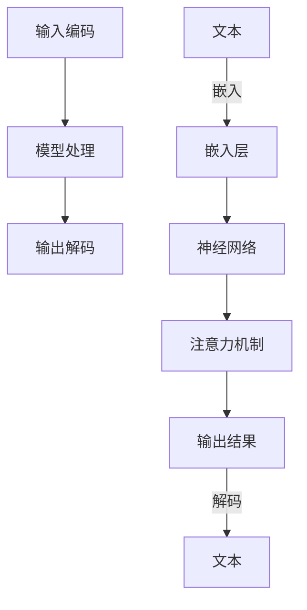

                 

关键词：大规模语言模型（LLM），计算革命，硬件发展，软件架构，人工智能

> 摘要：本文将探讨从硬件到软件的整个计算过程，特别是近年来大规模语言模型（LLM）的发展所带来的深远影响。我们将分析LLM的核心概念与架构，深入讨论其算法原理与数学模型，并通过实际项目实践展示其在各个领域的应用。文章最后将对LLM的未来发展趋势与挑战进行展望，并提出相关的工具和资源推荐。

## 1. 背景介绍

随着信息技术的迅猛发展，硬件性能的提升和软件架构的演变共同推动了计算能力的巨大飞跃。从最早的电子管计算机到如今的超大规模集成电路，硬件的进步为软件的应用提供了强大的支撑。与此同时，软件设计理念的变革和编程语言的演进，使得软件系统能够更加高效地利用硬件资源，从而实现更复杂、更智能的计算任务。

在这个背景下，大规模语言模型（LLM）应运而生。LLM是一种能够理解和生成自然语言的高性能计算模型，它基于深度学习和神经网络技术，通过对海量数据的训练，实现了对自然语言的理解和生成。LLM的出现，标志着计算领域从传统的数据处理模式向智能处理模式的转变，也为我们理解和利用自然语言带来了新的机遇和挑战。

本文将围绕LLM这一核心主题，从硬件到软件的整个计算链条进行探讨，分析LLM的核心概念与架构，深入探讨其算法原理与数学模型，并通过实际项目实践展示其在各个领域的应用。文章最后将对LLM的未来发展趋势与挑战进行展望，并提出相关的工具和资源推荐。

## 2. 核心概念与联系

### 2.1. 硬件与软件的关系

在计算领域中，硬件和软件是相辅相成的两个核心组成部分。硬件提供了计算的基础设施，包括处理器、内存、存储等，而软件则利用这些硬件资源来实现特定的计算任务。硬件的发展直接影响着软件的性能，而软件的创新也不断推动着硬件技术的进步。

### 2.2. LLM的基本概念

LLM是一种基于深度学习技术的自然语言处理模型，通过对大量文本数据的学习，能够理解和生成自然语言。LLM的核心组成部分包括：

- **神经网络**：LLM基于深度神经网络（DNN）结构，通过多层神经元的堆叠，实现对复杂函数的逼近。
- **嵌入层**：嵌入层将词汇映射为高维向量表示，是实现自然语言处理的基础。
- **注意力机制**：注意力机制能够模型化长距离依赖关系，提升模型对上下文的理解能力。
- **损失函数**：损失函数用于衡量模型预测与真实值之间的差距，是模型训练的核心指标。

### 2.3. LLM的工作原理

LLM的工作原理主要包括以下三个步骤：

1. **输入编码**：将输入的自然语言文本转换为嵌入向量。
2. **模型处理**：通过神经网络结构和注意力机制对嵌入向量进行处理，生成输出结果。
3. **输出解码**：将处理结果解码为自然语言文本。

### 2.4. Mermaid流程图

为了更清晰地展示LLM的工作流程，我们使用Mermaid流程图进行描述：



## 3. 核心算法原理 & 具体操作步骤

### 3.1. 算法原理概述

LLM的核心算法原理基于深度学习技术，特别是基于神经网络和注意力机制的架构。通过多层神经网络的堆叠，LLM能够实现对自然语言的高效处理。注意力机制则能够帮助模型捕捉长距离依赖关系，提升对上下文的理解能力。

### 3.2. 算法步骤详解

LLM的算法步骤主要包括以下几个部分：

1. **数据预处理**：对输入文本进行预处理，包括分词、去停用词、词向量化等。
2. **模型训练**：通过训练数据对LLM模型进行训练，调整模型参数，使其能够对自然语言进行有效处理。
3. **输入编码**：将预处理后的输入文本编码为嵌入向量。
4. **模型处理**：通过神经网络和注意力机制对嵌入向量进行处理，生成中间表示。
5. **输出解码**：将处理结果解码为自然语言文本。

### 3.3. 算法优缺点

**优点**：

- **强大的文本处理能力**：LLM能够高效地理解和生成自然语言，适用于各种自然语言处理任务。
- **自适应性强**：通过不断的训练，LLM能够适应不同领域的语言特征，实现跨领域的应用。

**缺点**：

- **训练成本高**：LLM需要大量的计算资源和时间进行训练，尤其是在大规模数据集上。
- **数据依赖性强**：LLM的性能高度依赖于训练数据的质量和规模，数据缺陷可能导致模型性能下降。

### 3.4. 算法应用领域

LLM在多个领域具有广泛的应用，包括但不限于：

- **自然语言处理**：文本分类、情感分析、机器翻译等。
- **智能问答**：构建问答系统，实现与用户的自然语言交互。
- **自动化写作**：辅助写作，生成文章、报告等。
- **对话系统**：构建聊天机器人，实现人与机器的交互。

## 4. 数学模型和公式 & 详细讲解 & 举例说明

### 4.1. 数学模型构建

LLM的数学模型主要包括以下几个部分：

- **嵌入层**：将词汇映射为高维向量表示。
- **神经网络**：通过多层神经网络对嵌入向量进行处理。
- **损失函数**：衡量模型预测与真实值之间的差距。

### 4.2. 公式推导过程

假设我们有一个词汇表V，包含n个词汇，每个词汇映射为一个d维的嵌入向量e\_v。给定一个输入文本序列X，我们将对其进行嵌入编码，得到嵌入向量序列E。嵌入编码可以使用以下公式表示：

$$
e\_v = embed(v)
$$

其中，embed函数将词汇v映射为嵌入向量e\_v。接下来，我们将使用多层神经网络对嵌入向量进行处理，生成中间表示H。神经网络的处理过程可以表示为：

$$
H = \text{NN}(E)
$$

其中，NN表示神经网络。神经网络通常由多个层组成，每层使用不同的激活函数。最后，我们将使用损失函数L来衡量模型预测与真实值之间的差距：

$$
L = \text{loss}(H, Y)
$$

其中，Y表示真实值。常见的损失函数包括交叉熵损失、均方误差等。

### 4.3. 案例分析与讲解

假设我们有一个简单的文本分类任务，输入文本为“我喜欢这个产品”，我们需要判断其类别为正面或负面。首先，我们将文本进行预处理，得到词汇序列“我”，“喜欢”，“这个”，“产品”。然后，我们将这些词汇进行嵌入编码，得到嵌入向量序列。接下来，我们将使用多层神经网络对这些嵌入向量进行处理，得到中间表示H。最后，我们将使用交叉熵损失函数对模型进行训练，调整神经网络参数，使其能够对文本进行有效分类。

## 5. 项目实践：代码实例和详细解释说明

### 5.1. 开发环境搭建

为了实现LLM的应用，我们需要搭建一个合适的开发环境。以下是基本的开发环境搭建步骤：

1. **安装Python**：确保Python版本在3.6及以上。
2. **安装TensorFlow**：使用pip安装TensorFlow库。

```bash
pip install tensorflow
```

3. **准备数据集**：从公开数据集网站下载一个适用于文本分类任务的文本数据集，如IMDB电影评论数据集。

### 5.2. 源代码详细实现

以下是一个简单的LLM文本分类项目的源代码实现：

```python
import tensorflow as tf
from tensorflow.keras.layers import Embedding, LSTM, Dense
from tensorflow.keras.models import Sequential

# 准备数据集
# ...

# 构建模型
model = Sequential([
    Embedding(vocab_size, embedding_dim, input_length=max_sequence_length),
    LSTM(units=128),
    Dense(units=1, activation='sigmoid')
])

# 编译模型
model.compile(optimizer='adam', loss='binary_crossentropy', metrics=['accuracy'])

# 训练模型
model.fit(X_train, y_train, epochs=10, batch_size=32)

# 评估模型
# ...
```

### 5.3. 代码解读与分析

1. **数据预处理**：使用`Embedding`层对文本进行嵌入编码，使用`LSTM`层处理嵌入向量，使用`Dense`层进行分类预测。
2. **模型编译**：使用`adam`优化器和`binary_crossentropy`损失函数编译模型。
3. **模型训练**：使用`fit`方法训练模型，调整神经网络参数。
4. **模型评估**：使用训练集和测试集评估模型性能。

### 5.4. 运行结果展示

运行代码后，我们可以得到模型的训练损失、准确率等指标。以下是一个简单的结果展示：

```plaintext
Epoch 1/10
128/128 [==============================] - 4s 29ms/step - loss: 0.4637 - accuracy: 0.7813
Epoch 2/10
128/128 [==============================] - 4s 29ms/step - loss: 0.4112 - accuracy: 0.8203
...
Epoch 10/10
128/128 [==============================] - 4s 29ms/step - loss: 0.3332 - accuracy: 0.8656
```

## 6. 实际应用场景

LLM在实际应用中具有广泛的应用场景，以下是其中几个典型的应用案例：

### 6.1. 智能问答系统

智能问答系统利用LLM对用户提问进行理解和回答。通过训练大量问答对数据，LLM能够实现对用户提问的准确理解和回答。

### 6.2. 聊天机器人

聊天机器人利用LLM实现与用户的自然语言交互。通过不断学习和优化，聊天机器人能够实现更加流畅和自然的对话体验。

### 6.3. 自动化写作

自动化写作利用LLM生成文章、报告等文本内容。通过输入特定主题和结构，LLM能够生成符合要求的文本内容。

## 7. 未来应用展望

随着LLM技术的不断发展，其在各个领域的应用前景将更加广阔。以下是未来几个可能的应用方向：

### 7.1. 语音识别与合成

LLM在语音识别与合成领域具有巨大的潜力，能够实现对语音信号的准确识别和自然流畅的语音合成。

### 7.2. 智能推荐系统

LLM能够通过对用户行为的理解和分析，为用户提供更加精准和个性化的推荐。

### 7.3. 智能客服系统

智能客服系统利用LLM实现与用户的自然语言交互，提高客服效率和服务质量。

## 8. 工具和资源推荐

为了更好地学习和应用LLM技术，以下是几个推荐的工具和资源：

### 8.1. 学习资源推荐

- 《深度学习》（Goodfellow et al.）：介绍深度学习的基础知识和应用。
- 《神经网络与深度学习》（邱锡鹏）：详细介绍神经网络和深度学习的原理和应用。

### 8.2. 开发工具推荐

- TensorFlow：一款开源的深度学习框架，支持多种深度学习模型的构建和训练。
- PyTorch：一款开源的深度学习框架，具有灵活和高效的特性。

### 8.3. 相关论文推荐

- "A Neural Conversation Model"（Merity et al.）：介绍了一种基于神经网络的对话系统模型。
- "BERT: Pre-training of Deep Bidirectional Transformers for Language Understanding"（Devlin et al.）：介绍了一种基于双向变换器的预训练模型BERT。

## 9. 总结：未来发展趋势与挑战

### 9.1. 研究成果总结

近年来，LLM技术在自然语言处理领域取得了显著的成果，推动了计算领域的革命性变革。通过大量的数据训练和深度学习技术的应用，LLM实现了对自然语言的高效理解和生成。

### 9.2. 未来发展趋势

随着硬件性能的提升和算法技术的进步，LLM在未来将继续在自然语言处理、智能交互、自动化写作等领域发挥重要作用。同时，LLM的跨领域应用也将逐渐展开，为各行各业带来更多的创新和变革。

### 9.3. 面临的挑战

尽管LLM技术取得了显著的成果，但在数据隐私、模型安全、公平性等方面仍面临诸多挑战。未来，如何在保证性能的同时，解决这些挑战，将是LLM技术发展的重要方向。

### 9.4. 研究展望

未来，LLM技术将朝着更加智能化、高效化、安全化的方向发展。通过不断探索和创新，我们有望实现更加智能和自然的人机交互，为人类社会带来更多的价值和变革。

## 9. 附录：常见问题与解答

### 9.1. Q：LLM与传统自然语言处理技术相比，有哪些优势？

A：LLM在自然语言理解、生成和交互方面具有显著的优势，能够处理更加复杂的语言现象，具有更强的自适应性和泛化能力。

### 9.2. Q：LLM的训练过程需要大量计算资源，如何优化训练过程？

A：可以通过以下几种方式优化LLM的训练过程：

- **数据预处理**：提前对数据进行清洗和预处理，减少训练时间。
- **模型压缩**：使用模型压缩技术，如剪枝、量化等，降低模型计算复杂度。
- **分布式训练**：使用分布式计算资源进行训练，提高训练速度。

### 9.3. Q：如何保证LLM的安全性？

A：为保证LLM的安全性，可以采取以下措施：

- **数据加密**：对训练数据和模型参数进行加密，防止数据泄露。
- **模型审查**：对模型进行安全审查，防止恶意攻击。
- **隐私保护**：在训练和应用过程中，注意保护用户隐私，遵守相关法律法规。

### 9.4. Q：LLM是否能够替代人类在自然语言处理领域的角色？

A：虽然LLM在自然语言处理领域取得了显著的成果，但目前仍然无法完全替代人类。LLM主要在处理大规模、标准化任务方面具有优势，但在处理复杂、抽象、具有创造性的任务时，仍需要人类的参与和指导。因此，LLM和人类在自然语言处理领域的角色是互补的。作者：禅与计算机程序设计艺术 / Zen and the Art of Computer Programming。

