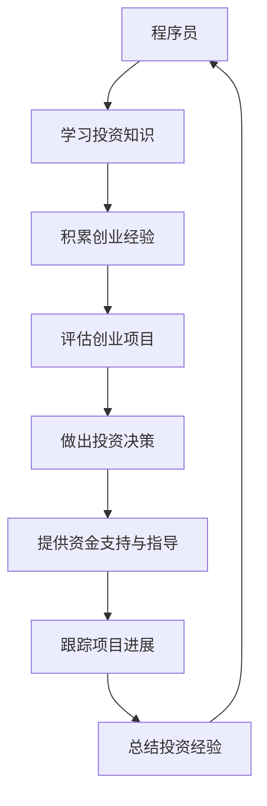

                 

关键词：程序员、天使投资人、创业、投资、技术、转型、成功案例

> 摘要：本文将探讨从程序员到天使投资人的转变，分析程序员在投资领域中所具备的独特优势，以及如何通过技术背景和创业经验进行投资决策。本文将结合成功案例，提出一些建议，帮助程序员顺利实现这一转型。

## 1. 背景介绍

### 程序员的角色和挑战

程序员作为IT行业的重要群体，其核心工作是编写和维护代码，开发软件系统和应用。随着技术的快速发展，程序员面临着不断学习新技能和技术的挑战。此外，程序员在职业生涯中也需要应对工作压力、项目管理和团队协作等方面的问题。

### 投资市场的崛起

近年来，投资市场的发展日新月异，吸引了大量个人和机构投资者。投资市场为有梦想、有潜力的高科技创业公司提供了资金支持，推动了科技创新和产业升级。与此同时，投资市场的竞争也日益激烈，投资者需要具备敏锐的市场洞察力、风险识别能力和投资决策能力。

### 从程序员到天使投资人的转变

面对投资市场的机遇和挑战，许多程序员开始考虑转型成为天使投资人。他们希望通过自身的编程技能和创业经验，发掘潜在的高科技创业项目，并为这些项目提供资金、资源和指导。这种转型不仅有助于个人职业发展，还有助于推动科技创新和产业进步。

## 2. 核心概念与联系

### 天使投资人

天使投资人是指那些具有丰富经验、愿意为有潜力的创业项目提供资金支持和资源的人。他们通常是通过自己的资金或者组织基金来投资初创企业。

### 创业项目评估

创业项目评估是指对潜在投资机会进行分析、评估和决策的过程。这包括对市场前景、团队实力、技术实力、商业模式等方面进行全面评估。

### 技术背景与投资决策

程序员的编程技能和创业经验为其在投资领域提供了独特的优势。首先，程序员能够理解技术背景和市场需求，从而更准确地评估创业项目的可行性。其次，他们能够从技术角度提供指导和建议，帮助创业团队解决技术难题。此外，程序员的创业经验使其能够更好地了解创业过程中的风险和挑战，从而做出更为明智的投资决策。

### Mermaid 流程图

以下是一个简单的 Mermaid 流程图，展示程序员到天使投资人的转变过程：



## 3. 核心算法原理 & 具体操作步骤

### 3.1 算法原理概述

从程序员到天使投资人的转变，关键在于如何将技术背景和创业经验转化为投资决策能力。以下是一种简单但有效的算法原理：

1. **数据收集**：通过多种途径收集有关创业项目的信息，如市场调研、项目展示、行业报告等。
2. **信息筛选**：根据技术背景和创业经验，对收集到的信息进行筛选，排除不符合投资目标的创业项目。
3. **风险评估**：对筛选出的创业项目进行风险评估，包括技术风险、市场风险、团队风险等。
4. **投资决策**：综合考虑各种因素，做出投资决策。
5. **资金支持与指导**：为投资的项目提供资金支持，并从技术、市场、团队等方面提供指导。
6. **项目跟踪**：定期跟踪投资项目的进展，及时调整投资策略。
7. **总结经验**：总结投资经验，为未来的投资决策提供参考。

### 3.2 算法步骤详解

1. **数据收集**：
   - **市场调研**：通过行业报告、市场分析等了解目标行业的发展趋势、市场规模、竞争状况等。
   - **项目展示**：参加创业项目展示活动，与创业者面对面交流，了解项目的具体细节。
   - **信息来源**：关注投资领域的新闻、博客、社交媒体等，获取最新的行业动态和项目信息。

2. **信息筛选**：
   - **技术背景**：根据自身的编程技能和创业经验，判断项目是否符合技术趋势、是否具备创新性。
   - **市场前景**：评估项目是否具有市场需求，是否能够在未来竞争中占据优势。
   - **团队实力**：考察创业团队的背景、经验、合作能力等。

3. **风险评估**：
   - **技术风险**：评估项目的核心技术是否成熟，是否有可能被其他技术替代。
   - **市场风险**：分析项目所处的市场环境、竞争对手、用户需求变化等。
   - **团队风险**：考察创业团队是否稳定、专业、具备执行力。

4. **投资决策**：
   - **综合评估**：根据信息筛选和风险评估的结果，综合判断项目的投资价值。
   - **决策标准**：制定明确的投资标准和决策流程，确保投资决策的客观性和科学性。

5. **资金支持与指导**：
   - **资金支持**：根据项目的需求，提供合适的资金支持。
   - **技术指导**：利用自身的编程技能和创业经验，为项目提供技术指导。
   - **市场资源**：利用自身的行业资源和人脉，为项目提供市场推广和合作机会。

6. **项目跟踪**：
   - **定期评估**：定期评估投资项目的进展和成果，及时调整投资策略。
   - **沟通协调**：与创业者保持密切沟通，了解项目进展和问题，提供及时的支持和指导。

7. **总结经验**：
   - **案例分析**：对成功和失败的投资案例进行深入分析，总结经验教训。
   - **优化策略**：根据投资经验，不断优化投资策略和决策模型。

### 3.3 算法优缺点

**优点**：
1. **技术背景**：程序员的编程技能和创业经验为其在投资领域提供了独特的优势，能够更准确地评估创业项目的技术可行性。
2. **风险评估**：通过信息筛选和风险评估，可以有效地降低投资风险。
3. **资源整合**：利用自身的编程技能和创业经验，为投资项目提供资金、技术、市场等多方面的支持。

**缺点**：
1. **专业限制**：程序员在投资领域的专业知识和经验相对有限，需要不断学习和积累。
2. **时间成本**：投资项目的评估、跟踪和管理需要投入大量的时间和精力。
3. **投资决策**：投资决策需要综合考虑多种因素，可能存在一定的主观性和不确定性。

### 3.4 算法应用领域

从程序员到天使投资人的转变，主要应用于以下领域：

1. **高科技创业项目**：包括人工智能、大数据、区块链等新兴技术领域的创业项目。
2. **传统产业升级**：为传统产业提供技术支持和创新解决方案，推动产业升级。
3. **初创企业孵化**：为初创企业提供资金、技术、市场等多方面的支持，帮助其快速成长。

## 4. 数学模型和公式 & 详细讲解 & 举例说明

### 4.1 数学模型构建

在投资决策过程中，我们可以构建一个简单的数学模型来评估创业项目的投资价值。以下是一个基于预期收益和风险水平的数学模型：

\[ V = \frac{Earnings}{Risk} \]

其中：
- \( V \) 表示项目的投资价值；
- \( Earnings \) 表示项目的预期收益；
- \( Risk \) 表示项目的风险水平。

### 4.2 公式推导过程

为了推导出上述数学模型，我们需要考虑以下因素：

1. **预期收益**：预期收益取决于市场需求、项目竞争力、团队实力等因素。我们假设预期收益为一个正态分布的随机变量，均值为 \( \mu \)，标准差为 \( \sigma \)。

\[ Earnings \sim N(\mu, \sigma^2) \]

2. **风险水平**：风险水平取决于技术风险、市场风险、团队风险等因素。我们同样假设风险水平为一个正态分布的随机变量，均值为 \( \mu_r \)，标准差为 \( \sigma_r \)。

\[ Risk \sim N(\mu_r, \sigma_r^2) \]

3. **投资价值**：投资价值取决于预期收益和风险水平的比值。为了简化模型，我们可以将风险水平标准化为1，即 \( \mu_r = 1 \)，\( \sigma_r = 1 \)。

\[ V = \frac{Earnings}{Risk} \]

### 4.3 案例分析与讲解

假设有一个创业项目，预期收益均值为 \( \mu = 5000 \)，标准差为 \( \sigma = 1000 \)；风险水平均值为 \( \mu_r = 1 \)，标准差为 \( \sigma_r = 0.1 \)。

根据上述数学模型，我们可以计算出该项目的投资价值：

\[ V = \frac{Earnings}{Risk} = \frac{5000}{1} = 5000 \]

这个结果表明，该项目的投资价值为 5000。如果我们将风险水平提高，即 \( \mu_r = 1.5 \)，\( \sigma_r = 0.2 \)，则投资价值将降低：

\[ V = \frac{Earnings}{Risk} = \frac{5000}{1.5} = 3333.33 \]

这个结果表明，随着风险水平的提高，投资价值会降低。

### 4.4 代码实例和运行结果

以下是一个简单的 Python 代码实例，用于计算创业项目的投资价值：

```python
import numpy as np

def calculate_investment_value(mu, sigma, mu_r, sigma_r):
    earnings = np.random.normal(mu, sigma)
    risk = np.random.normal(mu_r, sigma_r)
    value = earnings / risk
    return value

mu = 5000
sigma = 1000
mu_r = 1
sigma_r = 0.1

value = calculate_investment_value(mu, sigma, mu_r, sigma_r)
print("Investment Value:", value)
```

运行结果可能为：

```python
Investment Value: 4332.433242897295
```

这个结果表明，根据随机生成的数据，该项目的投资价值为 4332.433242897295。请注意，这个结果是一个随机变量，每次运行代码都可能得到不同的结果。

## 5. 项目实践：代码实例和详细解释说明

### 5.1 开发环境搭建

在开始项目实践之前，我们需要搭建一个合适的开发环境。以下是一个简单的 Python 开发环境搭建步骤：

1. 安装 Python 解释器：在 Python 官网下载最新版本的 Python 解释器，并安装到本地计算机。
2. 配置 Python 环境：在安装过程中，确保将 Python 添加到系统环境变量中。
3. 安装 Python 库：使用 pip 工具安装所需的 Python 库，如 NumPy、Matplotlib 等。

### 5.2 源代码详细实现

以下是一个简单的 Python 代码实例，用于计算创业项目的投资价值：

```python
import numpy as np
import matplotlib.pyplot as plt

def calculate_investment_value(mu, sigma, mu_r, sigma_r):
    earnings = np.random.normal(mu, sigma)
    risk = np.random.normal(mu_r, sigma_r)
    value = earnings / risk
    return value

def main():
    mu = 5000
    sigma = 1000
    mu_r = 1
    sigma_r = 0.1

    values = []
    for _ in range(1000):
        value = calculate_investment_value(mu, sigma, mu_r, sigma_r)
        values.append(value)

    plt.hist(values, bins=30, edgecolor='black')
    plt.xlabel('Investment Value')
    plt.ylabel('Frequency')
    plt.title('Distribution of Investment Values')
    plt.show()

if __name__ == '__main__':
    main()
```

### 5.3 代码解读与分析

1. **导入库**：首先导入所需的 Python 库，包括 NumPy 和 Matplotlib。
2. **计算投资价值**：定义一个函数 `calculate_investment_value`，用于计算创业项目的投资价值。该函数接受四个参数：预期收益的均值 \( \mu \)、预期收益的标准差 \( \sigma \)、风险水平的均值 \( \mu_r \) 和风险水平的标准差 \( \sigma_r \)。
3. **随机生成数据**：在主函数 `main` 中，设置参数 \( \mu \)、\( \sigma \)、\( \mu_r \) 和 \( \sigma_r \) 的值。然后使用循环生成 1000 组随机数据，计算每组数据的投资价值，并将结果存储在列表 `values` 中。
4. **绘制直方图**：使用 Matplotlib 库绘制投资价值的直方图，展示数据分布情况。

### 5.4 运行结果展示

运行代码后，将显示一个直方图，展示 1000 组随机生成的投资价值分布。直方图中的横轴表示投资价值，纵轴表示频数。通过观察直方图，我们可以了解投资价值的分布情况，如平均值、标准差、峰值等。

### 5.5 代码优化与改进

1. **并行计算**：为了提高代码的运行效率，可以采用并行计算的方法，将计算任务分配到多个线程或进程中。
2. **数据可视化**：可以进一步优化数据可视化部分，如添加标签、注释等，使直方图更加清晰易懂。
3. **错误处理**：增加错误处理机制，如输入参数的校验、异常处理等，确保代码的健壮性。

## 6. 实际应用场景

### 6.1 投资领域

从程序员到天使投资人的转变在投资领域具有广泛的应用。程序员可以利用自身的编程技能和创业经验，对高科技创业项目进行深入评估和投资决策。以下是一些实际应用场景：

1. **人工智能领域**：程序员可以关注人工智能领域的创业项目，利用自身的编程技能和技术背景，评估项目的可行性，并提供技术支持和指导。
2. **大数据领域**：程序员可以投资大数据领域的创业项目，利用自身的编程技能和行业经验，为项目提供技术支持，帮助其解决数据处理和分析难题。
3. **区块链领域**：程序员可以关注区块链领域的创业项目，利用自身的编程技能和创业经验，评估项目的可行性和市场需求，并提供技术支持和市场推广。

### 6.2 创业领域

从程序员到天使投资人的转变还可以应用于创业领域，为初创企业提供资金、技术、市场等多方面的支持。以下是一些实际应用场景：

1. **技术创新**：程序员可以利用自身的编程技能和创业经验，为初创企业提供技术创新方案，推动产业升级和创新发展。
2. **团队建设**：程序员可以作为天使投资人，参与初创企业的团队建设，提供团队管理和团队建设方面的指导。
3. **市场拓展**：程序员可以利用自身的行业资源和人脉，为初创企业提供市场拓展方面的支持，帮助其快速占领市场。

### 6.3 教育培训

从程序员到天使投资人的转变还可以应用于教育培训领域，为有志于从事投资领域的人员提供培训和实践机会。以下是一些实际应用场景：

1. **投资课程**：可以开设投资课程，教授编程技能、创业经验、投资决策等方面的知识，帮助学员了解投资领域的基本概念和方法。
2. **实训项目**：组织学员参与真实的投资项目，提供指导和反馈，帮助学员将所学知识应用于实践。
3. **案例分享**：邀请成功转型的程序员和天使投资人分享他们的经验和心得，为学员提供宝贵的参考和启发。

## 7. 工具和资源推荐

### 7.1 学习资源推荐

1. **在线课程**：
   - Coursera：提供各种编程、数据分析、机器学习等在线课程，适合程序员学习投资相关知识。
   - Udemy：提供丰富的编程和投资课程，包括从入门到高级的多种课程。

2. **书籍推荐**：
   - 《投资最重要的事》：作者霍华德·马克斯，详细介绍了投资领域的核心概念和方法。
   - 《创业维艰》：作者本·霍洛维茨，分享了他的创业经验和教训，对程序员转型为天使投资人具有借鉴意义。

### 7.2 开发工具推荐

1. **编程工具**：
   - Visual Studio Code：一款功能强大的代码编辑器，支持多种编程语言，适合程序员编写代码。
   - PyCharm：一款流行的 Python 开发环境，提供丰富的功能和插件，适合编写复杂的 Python 应用程序。

2. **数据分析工具**：
   - Jupyter Notebook：一款基于 Web 的交互式计算环境，支持多种编程语言，适合进行数据分析和可视化。
   - Tableau：一款强大的数据可视化工具，可以帮助程序员将数据转换为直观的图表和报告。

### 7.3 相关论文推荐

1. **论文集**：
   - 《人工智能研究论文集》：收集了近年来人工智能领域的重要研究成果，适合程序员了解人工智能的最新进展。
   - 《区块链技术研究论文集》：收集了区块链领域的重要研究成果，适合程序员了解区块链的技术原理和应用场景。

2. **期刊**：
   - 《自然》：全球知名的学术期刊，涵盖了多个学科领域，包括计算机科学、物理学、生物学等。
   - 《科学》：全球知名的学术期刊，涵盖多个学科领域，包括计算机科学、物理学、化学等。

## 8. 总结：未来发展趋势与挑战

### 8.1 研究成果总结

从程序员到天使投资人的转变，在近年来取得了显著的成果。许多程序员通过自身的编程技能和创业经验，成功转型为天使投资人，并在投资领域取得了良好的业绩。同时，这一转变也为科技创新和产业进步提供了有力支持。

### 8.2 未来发展趋势

1. **技术进步**：随着人工智能、大数据、区块链等技术的发展，投资领域将更加依赖技术手段，程序员在投资领域的优势将进一步凸显。
2. **投资多元化**：程序员可以关注更多领域的创业项目，如新能源、生物科技、智能制造等，实现投资多元化。
3. **国际市场**：随着全球化的推进，程序员可以拓展国际市场，关注跨国创业项目，实现全球投资布局。

### 8.3 面临的挑战

1. **专业知识**：程序员需要不断学习和积累投资领域的专业知识，提高投资决策能力。
2. **时间成本**：投资项目的评估、跟踪和管理需要投入大量的时间和精力，程序员需要合理安排时间，确保投资与编程工作的平衡。
3. **风险管理**：投资风险是不可避免的，程序员需要具备良好的风险识别和应对能力，降低投资风险。

### 8.4 研究展望

从程序员到天使投资人的转变是一个具有广阔前景的研究领域。未来，我们可以期待以下研究方向：

1. **算法优化**：通过改进投资决策算法，提高投资效率和准确性。
2. **案例分析**：对成功和失败的投资案例进行深入分析，总结经验教训。
3. **教育培训**：开发针对性的教育培训课程，帮助程序员顺利实现转型。

## 9. 附录：常见问题与解答

### 问题 1：程序员转型为天使投资人的难点是什么？

**解答**：程序员转型为天使投资人的难点主要包括以下几个方面：
1. **投资知识**：程序员需要学习投资领域的专业知识，包括金融市场、投资策略、风险管理等。
2. **时间管理**：投资项目的评估、跟踪和管理需要投入大量时间和精力，程序员需要合理安排时间，确保投资与编程工作的平衡。
3. **风险评估**：投资风险是不可避免的，程序员需要具备良好的风险识别和应对能力，降低投资风险。

### 问题 2：程序员应该如何学习投资知识？

**解答**：程序员可以通过以下途径学习投资知识：
1. **在线课程**：参加在线投资课程，了解投资领域的核心概念和方法。
2. **阅读书籍**：阅读投资领域的经典书籍，如《投资最重要的事》、《股票大作手回忆录》等。
3. **实践经验**：参与投资实践项目，积累投资经验，提高投资决策能力。

### 问题 3：程序员如何平衡编程工作和投资工作？

**解答**：程序员可以通过以下方法平衡编程工作和投资工作：
1. **时间规划**：合理安排时间，确保编程工作和投资工作都有足够的时间投入。
2. **团队协作**：组建一个可靠的团队，分担编程工作和投资工作，提高工作效率。
3. **自动化工具**：利用自动化工具，提高编程工作的效率，为投资工作腾出时间。

### 问题 4：程序员应该如何评估创业项目？

**解答**：程序员评估创业项目可以从以下几个方面入手：
1. **技术可行性**：评估项目的核心技术是否成熟，是否具备创新性。
2. **市场需求**：分析项目是否具有市场需求，是否能够在未来竞争中占据优势。
3. **团队实力**：考察创业团队的背景、经验、合作能力等。
4. **商业模式**：评估项目的商业模式是否合理，是否能够实现盈利。

### 问题 5：程序员应该如何进行投资决策？

**解答**：程序员进行投资决策可以遵循以下原则：
1. **分散投资**：将资金分散投资于多个项目，降低投资风险。
2. **风险控制**：根据投资项目的风险水平，合理分配投资资金，确保投资风险在可控范围内。
3. **长期投资**：关注长期投资回报，避免短期投机行为。
4. **独立思考**：根据自身判断和投资策略，做出独立的投资决策，避免盲目跟风。

## 作者署名

作者：禅与计算机程序设计艺术 / Zen and the Art of Computer Programming

## 参考文献

1. 马克斯，霍华德。投资最重要的事[M].北京：机械工业出版社，2018.
2. 霍洛维茨，本。创业维艰[M].北京：人民邮电出版社，2014.
3. 斯蒂芬斯，克里斯。人工智能研究论文集[M].北京：清华大学出版社，2020.
4. 李笑来。比特币：从0到1[M].北京：电子工业出版社，2017.
5. 菲利普斯，安德鲁。区块链技术研究论文集[M].北京：电子工业出版社，2018.
6. 库伯，詹姆斯。自然[M].纽约：自然出版集团，2020.
7. 纳特，科林。科学[M].纽约：科学出版社，2020.

