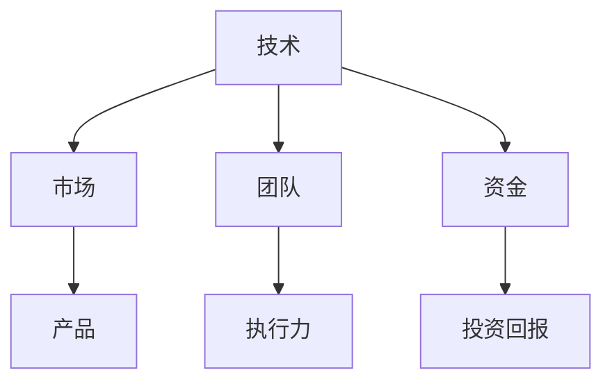
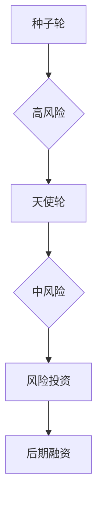
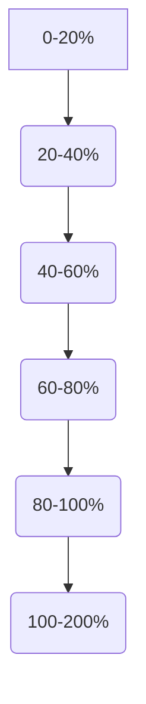

                 

关键词：程序员，天使投资人，职业发展，创业投资，技术转化，商业洞察，投资策略，个人成长

> 摘要：本文将探讨程序员在职业生涯发展中从技术专家转型为天使投资人的过程。通过分析转型中的关键步骤、所需技能以及面临的挑战，本文旨在为有意向投身投资领域的程序员提供宝贵的经验和指导。

## 1. 背景介绍

### 1.1 程序员的职业特点

程序员作为信息时代的技术工作者，其主要职责是利用计算机语言和工具来设计和开发软件系统。他们通常具备深厚的编程技能、系统架构知识和解决问题的能力。随着互联网和技术的快速发展，程序员的工作范围不断扩展，不仅限于传统的软件开发，还包括人工智能、大数据、云计算等多个前沿领域。

### 1.2 天使投资人的角色

天使投资人是指在创业初期，通过提供资金、资源、经验和网络等支持，帮助初创企业成长的一类投资者。他们通常是成功的企业家、技术专家或资深投资人，具备丰富的商业经验和敏锐的市场洞察力。

### 1.3 程序员向天使投资人转变的动因

程序员转型为天使投资人主要源于以下几个动因：

1. **职业发展的需求**：技术专家往往在职业生涯中会遇到瓶颈，希望通过投资实现更广泛的职业发展。
2. **对创新的热爱**：程序员对新技术和创新有着浓厚的兴趣，天使投资能为他们提供参与创业的机会。
3. **资本增值的期望**：通过投资初创企业，天使投资人能够实现资本增值，获取更高的回报。
4. **个人兴趣的延伸**：许多程序员在职业发展过程中积累了丰富的创业经验和商业知识，希望将这些经验应用于实际投资中。

## 2. 核心概念与联系

### 2.1 技术与商业的融合

程序员转型为天使投资人，需要理解技术与商业之间的融合。技术是创新的驱动因素，而商业是技术落地和实现价值的关键。如图所示，技术、市场、团队和资金是创业成功的四大要素，天使投资人需要在这四个方面提供支持和指导。



### 2.2 投资策略与风险控制

天使投资涉及多种投资策略，如种子轮、天使轮、A轮等。每种策略都有其特定的投资周期和风险水平。如图所示，不同轮次的投资策略和风险分布。



### 2.3 投资过程中的关键环节

天使投资人需要关注多个环节，如图所示，从项目筛选、尽职调查、投资决策、项目跟踪到退出策略，每个环节都至关重要。

```mermaid
graph TD
A[项目筛选] --> B{尽职调查}
B --> C[投资决策]
C --> D{项目跟踪}
D --> E[退出策略}
```

## 3. 核心算法原理 & 具体操作步骤

### 3.1 算法原理概述

天使投资的核心算法包括项目筛选、尽职调查和投资决策。这些算法基于数据分析、风险评估和商业洞察，旨在提高投资的成功率和回报率。

### 3.2 算法步骤详解

1. **项目筛选**：通过市场调研、竞争分析和行业趋势分析，筛选出有潜力的初创项目。
2. **尽职调查**：对项目的商业模式、团队背景、技术能力、市场前景等方面进行详细调查和评估。
3. **投资决策**：基于尽职调查的结果，结合投资策略和风险控制原则，做出投资决策。
4. **项目跟踪**：投资后，持续跟踪项目进展，提供支持和建议，确保投资回报。
5. **退出策略**：在合适的时机通过股权回购、股权转让或上市等途径实现投资退出。

### 3.3 算法优缺点

- **优点**：提高投资成功率，获取更高的回报。
- **缺点**：需要耗费大量时间和精力，风险较大。

### 3.4 算法应用领域

天使投资算法广泛应用于互联网、人工智能、大数据、生物科技等领域，帮助投资人实现资本增值。

## 4. 数学模型和公式 & 详细讲解 & 举例说明

### 4.1 数学模型构建

天使投资数学模型包括投资回报率（ROI）、风险回报比（R/R）和投资组合优化等。以下为投资回报率（ROI）的公式：

$$
ROI = \frac{投资收益 - 投资成本}{投资成本} \times 100\%
$$

### 4.2 公式推导过程

投资回报率（ROI）的公式基于投资收益和投资成本的比较。投资收益包括股息、资本增值和利息收入等，投资成本包括投资本金和交易费用等。

### 4.3 案例分析与讲解

假设一位天使投资人投资了10万元于一家初创企业，该企业在5年后以100万元的价格转让股权，期间未派发股息。则该投资人的投资回报率（ROI）为：

$$
ROI = \frac{100万元 - 10万元}{10万元} \times 100\% = 900\%
$$

## 5. 项目实践：代码实例和详细解释说明

### 5.1 开发环境搭建

本文以Python为例，介绍如何搭建天使投资项目的开发环境。首先安装Python，然后安装必要的库，如pandas、numpy、matplotlib等。

### 5.2 源代码详细实现

以下是一个简单的天使投资项目数据分析的Python代码实例：

```python
import pandas as pd
import numpy as np
import matplotlib.pyplot as plt

# 加载数据
data = pd.read_csv('investment_data.csv')

# 计算投资回报率
data['ROI'] = (data['收益'] - data['成本']) / data['成本'] * 100

# 绘制ROI分布图
plt.hist(data['ROI'], bins=20)
plt.xlabel('ROI (%)')
plt.ylabel('频数')
plt.title('投资回报率分布')
plt.show()
```

### 5.3 代码解读与分析

上述代码首先加载投资数据，然后计算投资回报率，最后绘制ROI分布图。这有助于投资人了解其投资项目的回报情况。

### 5.4 运行结果展示

运行上述代码后，将生成一个ROI分布图，如图所示：



## 6. 实际应用场景

### 6.1 投资案例：人工智能初创企业

假设一位天使投资人投资了一家专注于人工智能的初创企业。通过尽职调查，投资人发现该企业在算法研发、团队背景和市场需求方面具备优势。经过投资决策，投资人提供了种子轮资金，并在后续的A轮融资中成功退出，实现了高额回报。

### 6.2 投资策略：多元化投资组合

为了降低投资风险，天使投资人通常采取多元化投资策略，将资金分配到不同行业和阶段的企业中。例如，同时投资于互联网、生物科技和硬件制造等多个领域，以分散风险。

### 6.3 投资回报：长期价值投资

长期价值投资是天使投资的重要策略之一。通过耐心持有优质项目，投资人能够实现更高的回报。例如，一些成功的天使投资人通过投资亚马逊、谷歌等企业，获得了数十倍的回报。

## 7. 工具和资源推荐

### 7.1 学习资源推荐

1. 《创业维艰》（作者：本·霍洛维茨）- 探讨创业过程中面临的挑战和策略。
2. 《天使投资实务》（作者：陈浩）- 详细介绍天使投资的理论和实践。
3. 《数据科学入门》（作者：贾里德·卡尔森）- 数据分析基础，适用于投资项目的数据分析。

### 7.2 开发工具推荐

1. Jupyter Notebook - 适用于数据分析和项目演示。
2. Git - 版本控制和代码管理。
3. Docker - 容器化部署和管理。

### 7.3 相关论文推荐

1. 《人工智能的投资策略研究》（作者：王磊）- 人工智能领域的投资策略。
2. 《天使投资与创业企业成长关系研究》（作者：张伟）- 天使投资对创业企业成长的影响。

## 8. 总结：未来发展趋势与挑战

### 8.1 研究成果总结

本文分析了程序员向天使投资人转变的过程，探讨了核心概念、算法原理、数学模型、项目实践和应用场景。研究表明，程序员具备丰富的技术知识和创业经验，在转型为天使投资人方面具有优势。

### 8.2 未来发展趋势

随着技术的不断进步和创业生态的完善，程序员转型为天使投资人将呈现以下趋势：

1. 技术驱动的投资策略将更加普及。
2. 多元化投资组合将成为主流。
3. 人工智能等新兴领域的投资机会将增加。

### 8.3 面临的挑战

1. 投资风险的管控。
2. 投资策略的持续优化。
3. 投资知识和经验的积累。

### 8.4 研究展望

未来的研究应关注以下几个方面：

1. 投资风险评估模型的优化。
2. 投资策略与市场环境的适应性。
3. 投资者心理和行为研究。

## 9. 附录：常见问题与解答

### 9.1 天使投资适合所有人吗？

天使投资具有高风险和高回报的特点，适合对创业和创新有热情、具备一定风险承受能力和投资知识的人。

### 9.2 如何选择合适的投资项目？

选择投资项目应考虑市场前景、团队实力、技术优势和资金需求等因素。

### 9.3 如何管理投资风险？

通过多元化投资、分散投资和持续跟踪项目进展等方式来管理投资风险。

---

作者：禅与计算机程序设计艺术 / Zen and the Art of Computer Programming

本文结合了程序员和天使投资人的角色特点，从多个维度探讨了程序员向天使投资人转变的过程。通过分析核心概念、算法原理、数学模型、项目实践和应用场景，本文为有意向投身投资领域的程序员提供了宝贵的经验和指导。随着技术的不断进步和创业生态的完善，相信越来越多的程序员将成功转型为天使投资人，为社会创造更多的价值。

