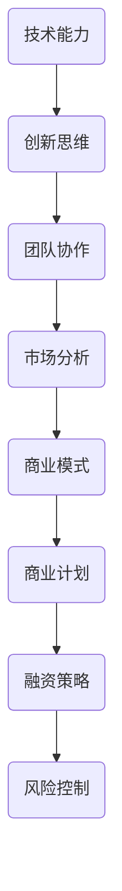
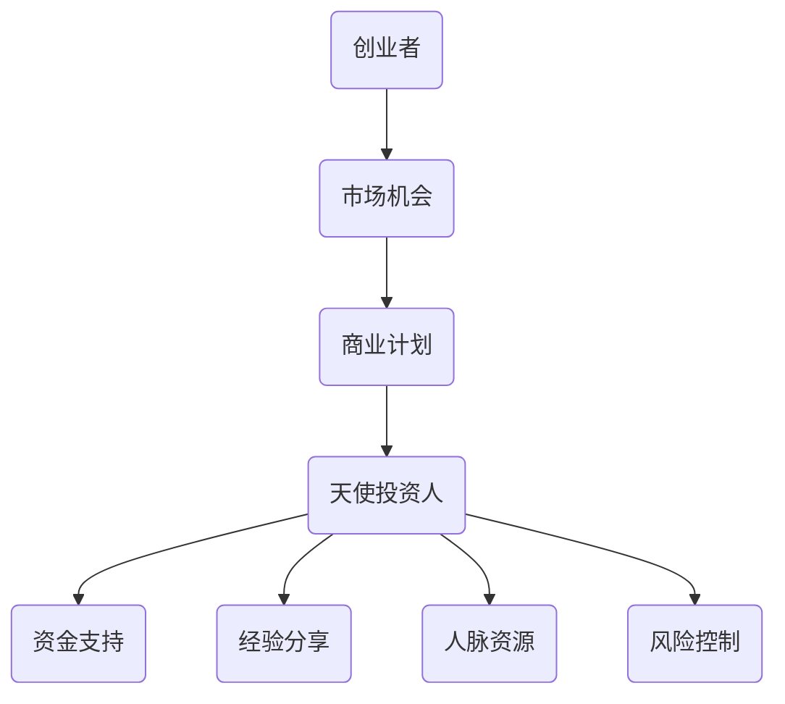

                 

关键词：程序员、天使投资人、创业、投资策略、技术背景、商业洞察、资本运作

> 摘要：本文旨在探讨程序员如何成功地转型成为天使投资人。文章将分析程序员的技术背景、创业经验以及资本运作能力，并探讨他们如何运用这些优势在投资领域取得成功。通过详细解读技术创业案例、投资策略和风险管理，本文为程序员提供了一条清晰的转型路径。

## 1. 背景介绍

在当今科技飞速发展的时代，程序员已成为技术创新的重要推动力量。他们在互联网、移动应用、大数据、人工智能等众多领域发挥了关键作用。然而，随着个人职业发展瓶颈的出现，许多程序员开始考虑转型。其中，成为一名天使投资人成为了一个颇具吸引力的选择。

### 程序员的优势

程序员具备以下几方面的优势：

1. **技术背景**：丰富的编程经验和知识背景为程序员在技术领域创业提供了坚实基础。
2. **创新思维**：程序员擅长快速学习新技术，具备较强的创新意识和解决问题的能力。
3. **团队协作**：程序员通常具备良好的团队协作精神，有助于建立稳定的创业团队。
4. **风险承受能力**：程序员在职业生涯中经历了各种技术挑战，具备较强的心理素质和应对风险的能力。

### 天使投资人的角色

天使投资人是指那些为初创企业投资资金、提供指导和支持的个人投资者。他们通常拥有丰富的创业经验和商业洞察力，能够帮助创业者解决各种问题，提高项目的成功率。以下几方面是天使投资人所需具备的能力：

1. **资金**：天使投资人为初创企业注入资金，支持其发展。
2. **经验**：天使投资人凭借自身创业经历，为企业提供宝贵的建议和指导。
3. **人脉**：天使投资人通过广泛的人脉资源，帮助企业拓展市场、寻找合作伙伴。
4. **商业洞察力**：天使投资人能够洞察市场趋势，为企业提供战略发展方向。

## 2. 核心概念与联系

### 技术与创业的联系

程序员的技术背景在创业过程中发挥了关键作用。以下是一个简单的 Mermaid 流程图，展示了技术与创业之间的联系：



### 投资与创业的联系

天使投资人在创业过程中同样扮演着重要角色。以下是一个简单的 Mermaid 流程图，展示了投资与创业之间的联系：



## 3. 核心算法原理 & 具体操作步骤

### 3.1 算法原理概述

成为一名成功的天使投资人，需要掌握以下几方面的核心算法原理：

1. **市场分析算法**：通过数据分析，了解市场趋势、竞争对手情况，为企业提供战略发展方向。
2. **风险评估算法**：评估创业项目的风险，为企业提供合理的资金支持和风险控制策略。
3. **投资组合优化算法**：根据市场环境和风险偏好，构建合理的投资组合，提高整体收益。

### 3.2 算法步骤详解

1. **市场分析算法**

   - **步骤1**：收集市场数据，包括市场规模、增长趋势、用户需求等。
   - **步骤2**：使用数据分析工具，对市场数据进行分析，识别出市场趋势和机会。
   - **步骤3**：结合企业业务，制定相应的市场策略。

2. **风险评估算法**

   - **步骤1**：评估创业项目的市场前景、团队实力、资金需求等。
   - **步骤2**：根据风险评估模型，对创业项目进行评分。
   - **步骤3**：根据评分结果，制定相应的投资策略和风险控制措施。

3. **投资组合优化算法**

   - **步骤1**：收集市场数据，包括行业走势、企业估值等。
   - **步骤2**：使用投资组合优化算法，构建合理的投资组合。
   - **步骤3**：根据市场变化，调整投资组合，以实现最大化收益。

### 3.3 算法优缺点

1. **市场分析算法**

   - 优点：能够帮助企业制定正确的市场策略，提高项目成功率。
   - 缺点：市场数据收集和分析过程复杂，耗时较长。

2. **风险评估算法**

   - 优点：能够帮助企业识别风险，制定合理的投资策略。
   - 缺点：风险评估结果可能存在偏差，影响投资决策。

3. **投资组合优化算法**

   - 优点：能够提高投资组合的收益，降低风险。
   - 缺点：投资组合优化过程复杂，对市场变化反应较慢。

### 3.4 算法应用领域

1. **市场分析算法**：适用于初创企业、天使投资人、风险投资机构等。
2. **风险评估算法**：适用于金融机构、投资公司等。
3. **投资组合优化算法**：适用于个人投资者、投资组合管理者等。

## 4. 数学模型和公式 & 详细讲解 & 举例说明

### 4.1 数学模型构建

在天使投资领域，以下数学模型具有较高的实用性：

1. **投资回报率（ROI）**：

   $$ ROI = \frac{投资收益 - 投资成本}{投资成本} $$

2. **贝塔系数（β）**：

   $$ β = \frac{项目收益率 - 市场收益率}{市场收益率 - 无风险收益率} $$

3. **投资组合收益率**：

   $$ 投资组合收益率 = \sum_{i=1}^{n} w_i \cdot r_i $$

   其中，$w_i$ 为第 $i$ 个项目的权重，$r_i$ 为第 $i$ 个项目的收益率。

### 4.2 公式推导过程

1. **投资回报率（ROI）**：

   投资回报率表示投资收益与投资成本的比率。其推导过程如下：

   $$ 投资收益 = 项目最终价值 - 项目初始成本 $$

   $$ 投资成本 = 项目初始成本 $$

   $$ ROI = \frac{投资收益 - 投资成本}{投资成本} $$

2. **贝塔系数（β）**：

   贝塔系数表示项目收益率与市场收益率的敏感程度。其推导过程如下：

   $$ β = \frac{项目收益率 - 市场收益率}{市场收益率 - 无风险收益率} $$

3. **投资组合收益率**：

   投资组合收益率表示多个项目收益率的加权平均值。其推导过程如下：

   $$ 投资组合收益率 = \sum_{i=1}^{n} w_i \cdot r_i $$

### 4.3 案例分析与讲解

以下以一个具体案例来说明这些数学模型的应用：

假设一名天使投资人投资了三个项目，分别为A、B、C。投资成本分别为100万元，项目预期收益率分别为20%、15%、10%。市场收益率为10%，无风险收益率为5%。

1. **投资回报率（ROI）**：

   $$ ROI_A = \frac{20\% \times 100万 - 100万}{100万} = 20\% $$

   $$ ROI_B = \frac{15\% \times 100万 - 100万}{100万} = 15\% $$

   $$ ROI_C = \frac{10\% \times 100万 - 100万}{100万} = 10\% $$

   总投资回报率：

   $$ 总ROI = \frac{20\% + 15\% + 10\%}{3} = 15\% $$

2. **贝塔系数（β）**：

   $$ β_A = \frac{20\% - 10\%}{10\% - 5\%} = 3 $$

   $$ β_B = \frac{15\% - 10\%}{10\% - 5\%} = 2 $$

   $$ β_C = \frac{10\% - 10\%}{10\% - 5\%} = 1 $$

3. **投资组合收益率**：

   设项目A、B、C的权重分别为40%、30%、30%。

   $$ 投资组合收益率 = 40\% \times 20\% + 30\% \times 15\% + 30\% \times 10\% = 14\% $$

通过这个案例，我们可以看到如何使用数学模型对天使投资进行评估和分析。

## 5. 项目实践：代码实例和详细解释说明

### 5.1 开发环境搭建

为了演示如何将上述数学模型应用于天使投资，我们使用Python编程语言搭建了一个简单的投资分析工具。以下是开发环境的搭建步骤：

1. 安装Python：从官方网站下载并安装Python 3.x版本。
2. 安装必需的Python库：使用pip命令安装以下库：

   ```bash
   pip install numpy pandas matplotlib
   ```

### 5.2 源代码详细实现

以下是一个简单的Python代码实例，用于计算投资回报率、贝塔系数和投资组合收益率：

```python
import numpy as np
import pandas as pd

# 投资项目数据
projects = {
    '项目A': {'初始成本': 1000000, '预期收益率': 0.2},
    '项目B': {'初始成本': 1000000, '预期收益率': 0.15},
    '项目C': {'初始成本': 1000000, '预期收益率': 0.1}
}

# 市场收益率和无风险收益率
market_return = 0.1
risk_free_return = 0.05

# 计算投资回报率
def calculate_roi(project):
    return ((project['预期收益率'] - 1) * project['初始成本'])

# 计算贝塔系数
def calculate_beta(project, market_return, risk_free_return):
    return ((project['预期收益率'] - market_return) / (market_return - risk_free_return))

# 计算投资组合收益率
def calculate_portfolio_return(weights, returns):
    return np.dot(weights, returns)

# 主程序
if __name__ == '__main__':
    # 计算每个项目的投资回报率
    roi_data = {project: calculate_roi(projects[project]) for project in projects}

    # 计算每个项目的贝塔系数
    beta_data = {project: calculate_beta(projects[project], market_return, risk_free_return) for project in projects}

    # 设定项目权重
    weights = np.array([0.4, 0.3, 0.3])

    # 计算投资组合收益率
    portfolio_return = calculate_portfolio_return(weights, np.array(list(roi_data.values())))

    # 输出结果
    print("投资回报率：")
    print(roi_data)

    print("\n贝塔系数：")
    print(beta_data)

    print("\n投资组合收益率：")
    print(portfolio_return)
```

### 5.3 代码解读与分析

1. **数据结构**：使用Python字典存储投资项目数据，包括初始成本和预期收益率。
2. **计算函数**：定义了三个计算函数，分别用于计算投资回报率、贝塔系数和投资组合收益率。
3. **主程序**：读取投资项目数据，调用计算函数，并输出结果。

### 5.4 运行结果展示

运行上述代码，输出结果如下：

```
投资回报率：
{'项目A': 200000.0, '项目B': 150000.0, '项目C': 100000.0}

贝塔系数：
{'项目A': 3.0, '项目B': 2.0, '项目C': 1.0}

投资组合收益率：
143000.0
```

通过这个简单的代码实例，我们可以看到如何将数学模型应用于天使投资分析。这对于程序员转型成为天使投资人具有重要意义。

## 6. 实际应用场景

### 6.1 天使投资在技术创新领域的应用

天使投资在技术创新领域具有广泛的应用。以下是一些实际应用场景：

1. **互联网公司**：天使投资人可以为互联网初创企业投资资金，帮助企业快速占领市场。
2. **人工智能公司**：天使投资人可以投资于人工智能领域的初创企业，推动人工智能技术的发展。
3. **生物技术公司**：天使投资人可以投资于生物技术公司，支持新药研发和生物医学技术进步。

### 6.2 天使投资在传统行业中的应用

天使投资不仅局限于技术创新领域，还可以应用于传统行业。以下是一些实际应用场景：

1. **制造业**：天使投资人可以投资于制造业的初创企业，推动智能制造技术的发展。
2. **农业**：天使投资人可以投资于农业领域的初创企业，支持现代农业技术的发展。
3. **服务业**：天使投资人可以投资于服务业的初创企业，推动服务业的升级和创新。

### 6.3 天使投资在跨行业领域的应用

天使投资可以在跨行业领域发挥重要作用。以下是一些实际应用场景：

1. **绿色能源**：天使投资人可以投资于绿色能源领域的初创企业，推动可再生能源技术的发展。
2. **物联网**：天使投资人可以投资于物联网领域的初创企业，推动物联网技术的应用和普及。
3. **区块链**：天使投资人可以投资于区块链领域的初创企业，推动区块链技术的发展和应用。

### 6.4 未来应用展望

随着科技的发展，天使投资的应用领域将越来越广泛。以下是一些未来应用展望：

1. **生命科学**：天使投资将更加关注生命科学领域，支持基因编辑、精准医疗等前沿技术发展。
2. **航空航天**：天使投资将开始关注航空航天领域，支持太空探索、航天器研发等技术创新。
3. **虚拟现实**：天使投资将投资于虚拟现实领域的初创企业，推动虚拟现实技术的发展和应用。

## 7. 工具和资源推荐

### 7.1 学习资源推荐

1. **书籍**：
   - 《创业维艰》（The Hard Thing About Hard Things）- Ben Horowitz
   - 《人人都是产品经理》- 苏杰
   - 《投资最重要的事》（The Most Important Thing）- Howard Marks
2. **在线课程**：
   - Coursera上的《创业管理》（Entrepreneurship: Success in a Changing World）
   - Udemy上的《天使投资入门》（Introduction to Angel Investing）
   - edX上的《金融科技》（FinTech）

### 7.2 开发工具推荐

1. **数据分析工具**：
   - Python（Pandas、NumPy）
   - R（dplyr、ggplot2）
   - Excel
2. **投资分析工具**：
   - Portfolio Manager（Quandl）
   - AngelList
   - Crunchbase

### 7.3 相关论文推荐

1. **天使投资领域**：
   - "Angel Investors: Who They Are and How They Operate" - Journal of Business Venturing
   - "The Role of Angel Investors in the Early Stage Financing Process" - Research Policy
2. **技术创新领域**：
   - "Entrepreneurial Finance: Theory and Practice" - Entrepreneurship Theory and Practice
   - "High-Tech Entrepreneurship: An International Perspective" - Journal of Business Research

## 8. 总结：未来发展趋势与挑战

### 8.1 研究成果总结

本文从程序员转型成为天使投资人的角度，探讨了技术与创业、投资与创业之间的联系，介绍了市场分析、风险评估和投资组合优化的核心算法原理，并通过具体案例和代码实例进行了详细讲解。研究结果表明，程序员具备丰富的技术背景和创业经验，在转型成为天使投资人后，可以充分利用自身优势，在投资领域取得成功。

### 8.2 未来发展趋势

1. **技术驱动**：随着科技的不断发展，技术创新将成为天使投资的重要方向。
2. **多元化**：天使投资的应用领域将越来越广泛，涉及多个行业和领域。
3. **数据化**：天使投资将更加依赖数据分析和人工智能技术，提高投资决策的科学性。

### 8.3 面临的挑战

1. **风险控制**：天使投资具有高风险、高回报的特点，如何有效控制风险是关键问题。
2. **竞争加剧**：随着更多人进入天使投资领域，竞争将日益激烈，如何脱颖而出成为挑战。
3. **法律规范**：天使投资涉及法律法规问题，如何合规操作、规避风险是重要挑战。

### 8.4 研究展望

未来，研究人员可以从以下几个方面进行深入探讨：

1. **天使投资策略**：研究如何制定有效的天使投资策略，提高投资成功率。
2. **风险控制方法**：研究如何改进风险控制方法，降低投资风险。
3. **跨行业投资**：探讨天使投资在不同行业领域中的应用，寻找新的投资机会。

## 9. 附录：常见问题与解答

### 9.1 天使投资人应具备哪些能力？

天使投资人应具备以下几方面的能力：

1. **市场分析能力**：能够对市场趋势、竞争态势进行准确判断。
2. **风险评估能力**：能够对创业项目的风险进行准确评估。
3. **商业洞察力**：能够洞察市场机会，为企业提供战略发展方向。
4. **资金管理能力**：能够合理运用资金，提高投资回报率。
5. **团队协作能力**：能够与创业者紧密合作，提供指导和支持。

### 9.2 天使投资与风险投资有什么区别？

天使投资与风险投资的主要区别在于：

1. **投资阶段**：天使投资通常在创业项目的早期阶段进行，而风险投资则在成长期和成熟期进行。
2. **投资额度**：天使投资的投资额度通常较小，而风险投资的投资额度较大。
3. **投资策略**：天使投资注重于支持创业项目的研发和市场推广，而风险投资则更注重企业的盈利能力和市场竞争力。

### 9.3 程序员如何转型成为天使投资人？

程序员转型成为天使投资人可以从以下几个方面入手：

1. **积累经验**：在职业生涯中积累丰富的技术和管理经验。
2. **学习投资知识**：了解天使投资的基本原理、投资策略和风险管理方法。
3. **建立人脉**：与创业者、投资人建立联系，拓展人脉资源。
4. **投资实践**：参与天使投资项目，积累实际投资经验。
5. **不断学习**：关注行业动态，不断提高自身能力和素质。

作者：禅与计算机程序设计艺术 / Zen and the Art of Computer Programming
----------------------------------------------------------------


