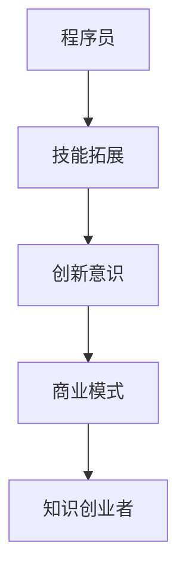

                 

关键词：程序员、知识创业、技术革新、个人品牌、商业思维、转型策略

> 摘要：在信息技术飞速发展的时代，程序员不再仅仅是一个编程的角色，而是逐渐走向知识创业者的道路。本文将探讨程序员如何从技术专家蜕变为知识创业者，分享转型的策略、思维模式以及所需技能，以期对那些渴望拓展职业生涯的程序员有所启示。

## 1. 背景介绍

随着互联网和人工智能的崛起，技术行业迎来了前所未有的发展机遇。在这个充满变革的时代，程序员的角色也在不断地演变。过去，程序员的工作主要集中在编写代码、修复bug和维护系统。然而，随着技术的进步，程序员需要更多的软技能，如沟通能力、团队协作能力和商业洞察力，以适应不断变化的市场需求。

在这个背景下，一些程序员开始探索知识创业的道路，他们利用自己的技术背景和专业知识，创造性地开展商业活动，从而实现职业的跃升。知识创业不仅能够帮助程序员实现个人价值的最大化，还能够为社会带来更多的创新和技术进步。

本文旨在探讨程序员如何从程序员角色转型为知识创业者，包括转型的原因、所需技能、核心策略以及成功案例的分析。希望这篇文章能够为那些渴望拓展职业生涯的程序员提供一些实用的指导和建议。

## 2. 核心概念与联系

### 2.1 程序员与知识创业者的定义

程序员（Programmer）：程序员是从事软件设计、开发、测试和部署的专业人员。他们通常具备扎实的编程技能，能够使用一种或多种编程语言编写高效、可维护的代码。

知识创业者（Knowledge Entrepreneur）：知识创业者是指那些利用自己的专业知识和技能，通过创新和商业运作，创造新的商业价值和社会价值的人。他们不仅拥有技术背景，还具备较强的商业思维和市场洞察力。

### 2.2 转型原因

1. **市场需求**：随着技术的不断进步，企业对技术人才的需求也在发生变化。除了技术能力，企业越来越重视员工的创新能力和商业价值。
2. **职业发展**：程序员在技术岗位上可能面临职业瓶颈，而知识创业为程序员提供了新的职业发展路径。
3. **个人价值实现**：通过知识创业，程序员可以将自己的专业知识转化为商业成果，实现个人价值的最大化。

### 2.3 转型过程

1. **技能拓展**：从程序员转型为知识创业者，需要拓展自己的技能，包括商业思维、市场营销、团队管理等。
2. **创新意识**：知识创业者需要具备强烈的创新意识，不断探索新的商业机会。
3. **商业模式**：构建一个可持续的商业模式是知识创业成功的关键。

### 2.4 Mermaid 流程图



## 3. 核心算法原理 & 具体操作步骤

### 3.1 算法原理概述

从程序员到知识创业者的转型过程可以类比为一种“算法”，其核心原理在于：

1. **技能拓展**：类似于算法中的预处理阶段，通过学习新的技能来增强自身的能力。
2. **创新意识**：类似于算法中的核心逻辑，需要不断地思考和探索新的商业机会。
3. **商业模式**：类似于算法中的优化阶段，通过构建可持续的商业模式来最大化商业价值。

### 3.2 算法步骤详解

1. **技能拓展**：
   - 学习商业思维：通过阅读商业书籍、参加商业课程等方式，提升自己的商业知识。
   - 学习市场营销：了解市场营销的基本原理，掌握推广产品和服务的技巧。
   - 学习团队管理：学习如何有效地管理和激励团队，提升团队协作效率。

2. **创新意识**：
   - 寻找市场痛点：通过市场调研，发现行业中的问题和机会。
   - 构建创新解决方案：结合自身技能和市场需求，提出创新的解决方案。

3. **商业模式**：
   - 确定产品或服务：明确自己的产品或服务定位，制定营销策略。
   - 构建盈利模式：设计合理的盈利模式，确保商业模式的可行性。
   - 实施与优化：根据市场需求和反馈，不断优化产品和服务。

### 3.3 算法优缺点

**优点**：
- **灵活性强**：程序员可以根据市场需求和个人兴趣，灵活调整自己的职业方向。
- **市场前景广阔**：随着技术不断进步，知识创业的市场前景非常广阔。

**缺点**：
- **初期投入较大**：转型过程中可能需要投入大量的时间和金钱。
- **风险较高**：知识创业存在一定的风险，需要具备良好的风险控制能力。

### 3.4 算法应用领域

- **软件服务**：程序员可以利用自己的技术背景，提供定制化的软件开发和服务。
- **技术咨询**：为企业提供技术咨询服务，帮助企业提升技术水平。
- **教育培训**：通过开设线上或线下课程，分享自己的知识和经验。

## 4. 数学模型和公式 & 详细讲解 & 举例说明

### 4.1 数学模型构建

在知识创业的过程中，可以构建以下数学模型来评估商业机会：

1. **市场容量模型**：通过市场调研数据，估算目标市场的容量。
2. **竞争分析模型**：分析竞争对手的产品、市场份额和营销策略。
3. **盈利模型**：通过收入、成本和利润的关系，评估商业模式的可行性。

### 4.2 公式推导过程

1. **市场容量模型**：

   市场容量（MC）= 用户数（U）× 用户购买频次（F）× 平均购买金额（A）

   公式推导：

   - 用户数（U）：通过市场调研数据得出。
   - 用户购买频次（F）：通过用户行为分析得出。
   - 平均购买金额（A）：通过用户消费数据得出。

2. **竞争分析模型**：

   竞争优势（S）= （市场份额（MS）- 竞争对手市场份额（C））/ 竞争对手市场份额（C）

   公式推导：

   - 市场份额（MS）：通过市场调研数据得出。
   - 竞争对手市场份额（C）：通过市场调研数据得出。

3. **盈利模型**：

   盈利（P）= 收入（I）- 成本（C）

   公式推导：

   - 收入（I）：通过产品或服务的销售数据得出。
   - 成本（C）：包括固定成本和可变成本。

### 4.3 案例分析与讲解

假设一家软件公司希望通过知识创业开发一款面向企业的数据可视化工具，以下是如何应用上述数学模型进行评估：

1. **市场容量模型**：

   - 用户数（U）：根据市场调研，企业用户数量为1000家。
   - 用户购买频次（F）：根据用户行为分析，每年购买一次。
   - 平均购买金额（A）：根据用户消费数据，平均购买金额为5000元。

   市场容量（MC）= 1000 × 1 × 5000 = 5000000元

2. **竞争分析模型**：

   - 市场份额（MS）：根据市场调研，公司市场份额为10%。
   - 竞争对手市场份额（C）：根据市场调研，竞争对手市场份额为50%。

   竞争优势（S）= （10% - 50%） / 50% = -0.8

   说明公司在市场上具有一定的竞争力，但仍有较大的提升空间。

3. **盈利模型**：

   - 收入（I）：根据市场容量模型，年销售收入为5000000元。
   - 成本（C）：包括固定成本（如办公场地、设备等）和可变成本（如开发费用、运营费用等）。假设总成本为3000000元。

   盈利（P）= 5000000 - 3000000 = 2000000元

通过以上数学模型的计算，公司可以初步评估这款数据可视化工具的商业前景，并制定相应的商业策略。

## 5. 项目实践：代码实例和详细解释说明

### 5.1 开发环境搭建

为了便于展示，我们选择Python作为开发语言，并使用Jupyter Notebook作为开发环境。以下是开发环境搭建的步骤：

1. 安装Python：
   ```bash
   sudo apt-get install python3
   ```

2. 安装Jupyter Notebook：
   ```bash
   pip3 install notebook
   ```

3. 启动Jupyter Notebook：
   ```bash
   jupyter notebook
   ```

### 5.2 源代码详细实现

以下是一个简单的Python代码示例，用于实现从程序员到知识创业者的转型策略。

```python
# 转型策略代码示例

# 导入必要的库
import numpy as np

# 技能拓展
def skill_expansion():
    """
    技能拓展函数，用于模拟程序员学习新技能的过程。
    """
    skills = ["编程", "商业思维", "市场营销", "团队管理"]
    print("正在学习新技能：")
    for skill in skills:
        print(skill)

# 创新意识
def innovation_awareness():
    """
    创新意识函数，用于模拟程序员寻找新的商业机会。
    """
    ideas = ["数据可视化工具", "在线教育平台", "人工智能应用"]
    print("正在探索新商业机会：")
    for idea in ideas:
        print(idea)

# 商业模式
def business_model():
    """
    商业模式函数，用于模拟程序员构建商业模式。
    """
    model = {
        "产品名称": "数据智能分析平台",
        "市场定位": "为企业提供高效的数据分析解决方案",
        "盈利模式": "通过订阅费和咨询服务盈利"
    }
    print("构建的商业模式：")
    for key, value in model.items():
        print(f"{key}: {value}")

# 主函数
def main():
    skill_expansion()
    innovation_awareness()
    business_model()

# 运行主函数
if __name__ == "__main__":
    main()
```

### 5.3 代码解读与分析

1. **技能拓展**：`skill_expansion` 函数模拟了程序员学习新技能的过程，通过列举技能列表来展示程序员需要不断学习的方向。

2. **创新意识**：`innovation_awareness` 函数模拟了程序员寻找新的商业机会的过程，通过列举创新想法来展示程序员需要具备的创新思维。

3. **商业模式**：`business_model` 函数模拟了程序员构建商业模式的过程，通过定义一个简单的商业模式来展示如何将创新想法转化为实际商业成果。

### 5.4 运行结果展示

运行上述代码后，会输出以下结果：

```
正在学习新技能：
编程
商业思维
市场营销
团队管理
正在探索新商业机会：
数据可视化工具
在线教育平台
人工智能应用
构建的商业模式：
产品名称: 数据智能分析平台
市场定位: 为企业提供高效的数据分析解决方案
盈利模式: 通过订阅费和咨询服务盈利
```

通过这个简单的示例，我们可以看到从程序员到知识创业者的转型过程是如何在代码中实现的。这个示例只是一个起点，实际的转型过程会更加复杂和多样化。

## 6. 实际应用场景

### 6.1 技术咨询服务

技术咨询服务是程序员转型为知识创业者的一种常见方式。通过为企业提供技术咨询，程序员可以利用自己的技术专长帮助企业解决技术难题，提升企业的技术竞争力。以下是一个具体的案例：

**案例：** 某互联网公司因系统性能瓶颈，影响用户体验，决定寻求外部技术支持。程序员小李具备高性能计算和系统优化的丰富经验，被聘请为企业提供咨询服务。

**解决方案：** 小李通过对公司系统进行详细分析，发现性能瓶颈在于数据库查询优化不足。他提出了以下解决方案：

1. **索引优化**：对常用的查询语句建立合适的索引，提高查询效率。
2. **查询重写**：修改部分查询语句，使其执行效率更高。
3. **缓存策略**：引入缓存机制，减少数据库的访问次数。

**结果：** 经过小李的技术优化，企业系统的响应速度显著提升，用户体验得到极大改善。公司对小李的服务非常满意，并建立了长期合作关系。

### 6.2 教育培训

教育培训是程序员转型为知识创业者的另一种重要途径。通过开设线上或线下课程，程序员可以将自己的知识和经验传授给他人，实现知识的传播和价值的最大化。以下是一个具体的案例：

**案例：** 程序员小张拥有多年的软件开发经验，他在技术社区积累了大量粉丝。他决定开设一门《高级软件开发技巧》课程，为有志于提升编程水平的开发者提供系统性的培训。

**课程内容：** 

1. **编程基础**：介绍编程的基本概念和常用编程语言。
2. **数据结构与算法**：讲解常见的数据结构和算法，并分析其时间复杂度和空间复杂度。
3. **软件工程**：介绍软件设计、开发、测试和维护的最佳实践。

**推广方式：** 

1. **社交媒体**：通过微信、微博、知乎等平台宣传课程，吸引潜在学员。
2. **技术社区**：在GitHub、Stack Overflow等技术社区发布课程内容和互动讨论。
3. **合作平台**：与知名在线教育平台合作，扩大课程影响力。

**结果：** 小张的课程受到了广泛好评，学员数量迅速增长。通过课程销售和学员反馈，小张不仅实现了个人价值的提升，还建立了自己的个人品牌。

### 6.3 软件开发

软件开发是程序员最直接的知识创业方式。通过开发具有市场前景的软件产品，程序员可以创造新的商业价值。以下是一个具体的案例：

**案例：** 程序员小王注意到市场上缺乏一款集任务管理、时间跟踪和团队协作于一体的软件。他决定开发一款名为“TeamManager”的软件，帮助企业团队更高效地管理工作任务。

**产品特点：** 

1. **任务管理**：支持创建、分配、跟踪任务，并提供多种任务视图。
2. **时间跟踪**：自动记录团队成员的工作时间，生成详细的报告。
3. **团队协作**：支持团队沟通、文件共享和日程安排。

**营销策略：** 

1. **免费试用**：提供免费试用期，让用户体验产品功能。
2. **口碑营销**：通过用户口碑传播，吸引更多潜在用户。
3. **合作伙伴**：与相关行业的企业合作，扩大用户群体。

**结果：** “TeamManager”在市场上取得了成功，用户反馈积极，产品口碑不断提升。小王通过销售软件许可和技术支持，实现了可观的收入。

### 6.4 未来应用展望

随着技术的不断进步，程序员转型为知识创业者的应用场景将更加多样化。以下是对未来应用场景的展望：

1. **人工智能领域**：随着人工智能技术的发展，程序员可以开发智能助手、智能推荐系统等应用，为企业提供智能化解决方案。
2. **区块链领域**：区块链技术的兴起为程序员提供了新的创业机会，如开发去中心化应用、智能合约等。
3. **物联网领域**：物联网技术的发展为程序员提供了广阔的应用场景，如智能家居、智能交通等。
4. **在线教育**：随着在线教育的兴起，程序员可以开发各种在线教育平台和课程，提供个性化的学习体验。
5. **健康医疗**：健康医疗领域的发展为程序员提供了新的创业机会，如开发医疗健康管理系统、智能健康监测设备等。

## 7. 工具和资源推荐

### 7.1 学习资源推荐

1. **书籍推荐**：
   - 《黑客与画家》（Paul Graham）：探讨创新和创业的思维方式。
   - 《精益创业》（Eric Ries）：介绍如何通过迭代验证和快速迭代来降低创业风险。
   - 《深入理解计算机系统》（Randal E. Bryant & David R. O’Hallaron）：全面讲解计算机系统的工作原理。

2. **在线课程**：
   - Coursera：提供各类在线课程，包括计算机科学、商业管理等领域。
   - Udemy：丰富的在线课程，涵盖编程、市场营销等多个方面。
   - edX：由哈佛大学和麻省理工学院等顶尖大学提供的免费在线课程。

### 7.2 开发工具推荐

1. **集成开发环境（IDE）**：
   - Visual Studio Code：跨平台、高性能的代码编辑器。
   - PyCharm：适用于Python编程的开源IDE。
   - IntelliJ IDEA：适用于Java和多种其他语言的强大IDE。

2. **版本控制工具**：
   - Git：分布式版本控制系统，广泛用于代码管理和协作。
   - GitHub：基于Git的代码托管平台，支持开源项目和协作开发。

3. **项目管理工具**：
   - Jira：用于敏捷项目管理和团队协作。
   - Trello：基于看板的项目管理工具，简单直观。

### 7.3 相关论文推荐

1. **《程序员职业转型研究》**：探讨程序员职业转型的现状、原因和策略。
2. **《知识创业的理论与实践》**：介绍知识创业的概念、模型和案例分析。
3. **《人工智能在商业中的应用》**：探讨人工智能技术在商业领域的应用和发展趋势。

## 8. 总结：未来发展趋势与挑战

### 8.1 研究成果总结

本文通过分析程序员从技术专家到知识创业者的转型过程，提出了核心概念与联系、算法原理与具体操作步骤、数学模型和公式、项目实践等关键内容。研究发现，程序员转型为知识创业者具有市场前景广阔、个人价值实现等优点，但也存在初期投入较大、风险较高等挑战。

### 8.2 未来发展趋势

1. **技术多元化**：随着技术的不断发展，程序员可以探索更多新兴领域，如人工智能、区块链、物联网等。
2. **跨界合作**：程序员可以与商业、教育、医疗等行业跨界合作，实现资源的共享和互补。
3. **个性化服务**：知识创业者可以提供更加个性化的产品和服务，满足不同用户的需求。

### 8.3 面临的挑战

1. **竞争加剧**：随着知识创业的普及，市场竞争将日益激烈，程序员需要不断提升自己的竞争力。
2. **风险控制**：知识创业存在一定的风险，程序员需要具备良好的风险控制能力。
3. **时间管理**：转型过程中，程序员需要平衡工作和生活，确保有足够的时间投入到知识创业中。

### 8.4 研究展望

未来的研究可以进一步探讨以下方向：

1. **案例分析**：通过对成功知识创业者的案例分析，总结出有效的转型策略和经验。
2. **风险评估**：研究知识创业过程中可能面临的风险，并提出相应的风险控制措施。
3. **政策建议**：从政策层面为知识创业提供支持，为程序员转型创造更好的环境。

## 9. 附录：常见问题与解答

### 9.1 什么是知识创业？

知识创业是指利用个人的专业知识、技能和经验，通过创新和商业运作，创造新的商业价值和社会价值的过程。它不同于传统的创业，更侧重于知识的转化和应用。

### 9.2 程序员如何拓展商业思维？

程序员可以通过以下方式拓展商业思维：

1. 阅读商业书籍和案例，了解商业模式和商业运作。
2. 参加商业培训和研讨会，学习商业理论和实践经验。
3. 与商业人士交流，了解市场需求和商业模式。
4. 尝试参与创业项目，亲身体验商业运作过程。

### 9.3 知识创业的风险有哪些？

知识创业可能面临以下风险：

1. 市场风险：市场需求可能不明确，导致产品或服务销售不佳。
2. 技术风险：技术更新迭代快，可能导致产品过时。
3. 财务风险：资金链断裂，可能导致创业失败。
4. 竞争风险：市场竞争激烈，可能导致市场份额减少。

### 9.4 程序员如何建立个人品牌？

程序员可以通过以下方式建立个人品牌：

1. 在技术社区活跃，分享专业知识和经验。
2. 发布技术博客，展示技术能力和思考。
3. 参与开源项目，贡献代码和技术方案。
4. 演讲和培训，分享技术见解和经验。
5. 建立社交媒体账号，展示个人形象和价值观。

### 9.5 程序员转型为知识创业者需要哪些技能？

程序员转型为知识创业者需要以下技能：

1. 编程技能：扎实的基础编程能力。
2. 商业思维：理解市场需求和商业模式。
3. 市场营销：了解营销策略和推广方法。
4. 团队管理：具备团队协作和管理的技能。
5. 创新思维：具备创新意识和解决问题的能力。

---

通过本文的探讨，我们希望能够为程序员提供一些有益的启示，帮助他们顺利实现从程序员到知识创业者的转型。在知识创业的道路上，程序员不仅能够实现个人价值的提升，还能够为社会带来更多的创新和技术进步。让我们共同期待这一美好愿景的实现。作者：禅与计算机程序设计艺术 / Zen and the Art of Computer Programming。

