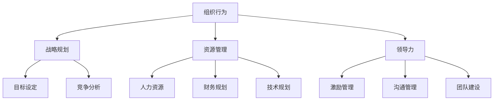

                 

关键词：管理理论、实践应用、方法论、落地实施、案例研究

> 摘要：本文从经典管理理论出发，探讨了如何将管理理论应用于实践中的方法论和具体步骤。通过对核心概念、算法原理、数学模型、项目实践和实际应用场景的详细分析，提供了从理论到实践的全面指导。本文旨在帮助读者更好地理解和应用管理理论，以实现组织效率和效果的提升。

## 1. 背景介绍

管理理论是管理学领域的重要基础，涵盖了组织行为、战略规划、资源管理、领导力等多个方面。自泰勒的科学管理理论问世以来，管理理论不断发展，涌现出诸如马斯洛的需求层次理论、麦格雷戈的X理论和Y理论、波特的公司战略理论等一系列重要理论。

然而，经典管理理论的应用并非一蹴而就。在实践中，如何将理论转化为实际操作，如何根据实际情况灵活调整和优化管理策略，一直是管理领域的挑战。因此，本文旨在探讨如何将经典管理理论落地实施，并提供具体的方法和步骤。

### 经典管理理论的起源与发展

- **泰勒的科学管理理论**：泰勒提出了科学管理的概念，主张通过科学的方法和标准化的流程来提高工作效率和生产力。这一理论奠定了现代管理的基础。
- **马斯洛的需求层次理论**：马斯洛提出人的需求可以分为生理需求、安全需求、社交需求、尊重需求和自我实现需求五个层次，这一理论为理解员工动机和需求提供了重要的理论依据。
- **麦格雷戈的X理论和Y理论**：麦格雷戈提出了X理论和Y理论来描述不同的领导风格和管理方式。X理论认为员工天生懒惰，需要严格的管理和控制；而Y理论则认为员工具有自我驱动和自我管理的能力，通过激励和参与可以提高工作效率。
- **波特的公司战略理论**：波特提出了五力模型和三种通用战略，为企业在竞争环境中制定战略提供了理论指导。

### 落地实践的重要性

- **理论到实践的转化**：管理理论在学术研究和理论探讨中具有重要意义，但如何将其应用于实际管理中，实现理论到实践的转化，是每个管理者必须面对的挑战。
- **实践中的灵活性**：经典管理理论往往针对特定环境和条件提出，而在实际应用中，管理者需要根据具体情况进行调整和优化，以实现最佳效果。
- **提升组织效率**：将管理理论落地实施，可以帮助组织提高运营效率、优化资源配置、提升员工绩效，从而实现整体绩效的提升。

## 2. 核心概念与联系

### 2.1 经典管理理论的核心概念

在探讨管理理论的落地实践之前，我们需要先明确几个核心概念，这些概念构成了经典管理理论的基础。

#### 1. 组织行为

组织行为是指员工在组织中的行为表现，包括工作态度、工作效率、团队合作等方面。理解组织行为有助于管理者设计有效的激励机制和团队建设策略。

#### 2. 战略规划

战略规划是指组织在长期发展过程中制定的目标和计划。战略规划决定了组织的方向和资源配置，是管理理论中的重要组成部分。

#### 3. 资源管理

资源管理涉及组织内部的人力、财务、技术等资源的配置和利用。有效的资源管理可以提升组织的竞争力。

#### 4. 领导力

领导力是指管理者通过影响和激励员工，实现组织目标的能力。领导力理论探讨了如何培养和管理领导力，以提升组织绩效。

### 2.2 管理理论的架构

管理理论的核心架构可以通过Mermaid流程图来展示，如下：



### 2.3 管理理论与实际操作的关联

管理理论在实际操作中的应用需要将抽象的概念具体化，通过以下步骤实现：

1. **需求分析**：明确组织的目标和需求，确定管理理论在实际操作中的具体应用场景。
2. **策略设计**：根据需求分析结果，设计相应的管理策略，包括组织行为、战略规划、资源管理和领导力等方面。
3. **实施与监控**：将管理策略付诸实施，并建立监控机制，确保策略的有效执行。
4. **调整与优化**：根据实施效果，不断调整和优化管理策略，以适应实际情况。

## 3. 核心算法原理 & 具体操作步骤

### 3.1 算法原理概述

在管理理论落地实践中，核心算法原理扮演了关键角色。以下是几个关键算法原理及其概述：

#### 1. 目标规划算法

目标规划算法用于确定组织的目标和实现路径。该算法通过设定目标、分析资源和制定计划，确保组织目标的实现。

#### 2. 决策树算法

决策树算法用于决策过程中，通过分析不同决策路径的可能结果，帮助管理者做出最优决策。

#### 3. 资源优化算法

资源优化算法用于资源的最优配置，通过分析资源的供需关系，实现资源的最大化利用。

#### 4. 领导力模型算法

领导力模型算法用于评估和管理领导力，通过分析领导行为和绩效，提供领导力提升的指导。

### 3.2 算法步骤详解

以下是对上述算法的具体操作步骤进行详细讲解：

#### 3.2.1 目标规划算法步骤

1. **目标设定**：明确组织的目标，包括短期和长期目标。
2. **资源分析**：分析组织的资源，包括人力资源、财务资源和技术资源等。
3. **计划制定**：根据目标和资源，制定实现目标的详细计划。
4. **执行监控**：执行计划，并建立监控机制，确保目标的实现。

#### 3.2.2 决策树算法步骤

1. **问题定义**：明确需要解决的问题。
2. **决策路径分析**：分析不同的决策路径和可能的结果。
3. **结果评估**：评估不同决策路径的结果，选择最优决策。

#### 3.2.3 资源优化算法步骤

1. **资源需求分析**：分析资源的供需情况。
2. **优化模型构建**：建立资源优化模型，包括目标函数和约束条件。
3. **模型求解**：使用优化算法求解资源优化问题。
4. **结果分析**：分析优化结果，调整资源配置。

#### 3.2.4 领导力模型算法步骤

1. **领导行为评估**：评估领导者的行为，包括沟通、激励、决策等方面。
2. **绩效分析**：分析领导行为对组织绩效的影响。
3. **领导力提升策略**：根据评估结果，制定领导力提升策略。

### 3.3 算法优缺点

#### 目标规划算法

- **优点**：明确目标，制定详细的计划，有助于组织目标的实现。
- **缺点**：需要大量资源和时间，实施难度较高。

#### 决策树算法

- **优点**：简单直观，易于理解，适用于复杂决策问题。
- **缺点**：对决策路径的预测能力有限，可能存在决策盲点。

#### 资源优化算法

- **优点**：资源利用最大化，提高组织效率。
- **缺点**：优化模型构建复杂，求解过程耗时较长。

#### 领导力模型算法

- **优点**：提供领导力评估和提升的指导。
- **缺点**：对领导行为的量化评估存在一定难度。

### 3.4 算法应用领域

目标规划算法、决策树算法、资源优化算法和领导力模型算法在多个领域都有广泛的应用，如企业战略规划、项目管理、人力资源管理和领导力培养等。以下为具体应用实例：

#### 1. 企业战略规划

- **实例**：企业在制定五年战略规划时，可以使用目标规划算法明确目标，制定详细计划，确保战略目标的实现。

#### 2. 项目管理

- **实例**：在项目规划过程中，可以使用决策树算法分析不同项目路径的可能结果，选择最优项目方案。

#### 3. 人力资源管理

- **实例**：在招聘过程中，可以使用资源优化算法确定最优人力资源配置，提高招聘效率。

#### 4. 领导力培养

- **实例**：在领导力培养过程中，可以使用领导力模型算法评估领导者的行为，制定提升策略，提升领导力。

## 4. 数学模型和公式 & 详细讲解 & 举例说明

### 4.1 数学模型构建

在管理理论落地实践中，数学模型起到了关键作用。以下是几个常用的数学模型及其构建过程：

#### 1. 逻辑回归模型

逻辑回归模型用于预测事件发生的概率。其构建过程如下：

- **目标函数**：最小化预测概率与实际发生概率之间的差异。
- **损失函数**：使用交叉熵作为损失函数，公式为：$$L(\theta) = -\sum_{i=1}^{n}y_i\log(\hat{y}_i) + (1 - y_i)\log(1 - \hat{y}_i)$$，其中 $y_i$ 是实际发生概率，$\hat{y}_i$ 是预测概率。

#### 2. 线性规划模型

线性规划模型用于资源优化问题。其构建过程如下：

- **目标函数**：最大化或最小化线性函数。
- **约束条件**：线性不等式或等式约束。

#### 3. 决策树模型

决策树模型用于分类和回归问题。其构建过程如下：

- **特征选择**：选择具有最高信息增益的特征作为分割标准。
- **节点划分**：根据特征值将数据集划分为多个子集。

### 4.2 公式推导过程

以下是逻辑回归模型的损失函数推导过程：

- **假设**：给定一个样本集 $(x_1, y_1), (x_2, y_2), ..., (x_n, y_n)$，其中 $x_i$ 是输入特征，$y_i$ 是实际发生概率。
- **预测概率**：使用线性回归模型预测概率，公式为：$$\hat{y}_i = \sigma(\theta^T x_i)$$，其中 $\sigma$ 是 sigmoid 函数，$\theta$ 是参数向量。
- **损失函数**：损失函数定义为：$$L(\theta) = -\sum_{i=1}^{n}y_i\log(\hat{y}_i) + (1 - y_i)\log(1 - \hat{y}_i)$$。

### 4.3 案例分析与讲解

以下是一个简单的逻辑回归模型应用案例：

#### 案例背景

一家公司在招聘过程中，需要预测应聘者是否会被录用。已知应聘者的学历、工作经验和面试评分等特征，需要建立一个逻辑回归模型进行预测。

#### 数据准备

收集了100位应聘者的数据，包括学历（1代表本科，2代表硕士，3代表博士）、工作经验（1代表无经验，2代表有经验）和面试评分（1-10分）。

#### 特征工程

将数据转换为二进制特征，例如学历转换为[0, 1, 0]，工作经验转换为[1, 0]，面试评分转换为[0, 0, 0, 0, 1]。

#### 模型训练

使用 scikit-learn 库中的 LogisticRegression 类训练模型，设置参数 C 为 1，最大迭代次数为100。

```python
from sklearn.linear_model import LogisticRegression
from sklearn.model_selection import train_test_split

X = [[1, 1, 9], [0, 1, 8], [1, 1, 7], [0, 0, 6], ...]  # 特征数据
y = [1, 0, 1, 0, ...]  # 标签数据

X_train, X_test, y_train, y_test = train_test_split(X, y, test_size=0.2, random_state=42)

model = LogisticRegression(C=1, max_iter=100)
model.fit(X_train, y_train)
```

#### 模型评估

使用测试集评估模型性能，计算准确率、召回率、F1分数等指标。

```python
from sklearn.metrics import accuracy_score, recall_score, f1_score

y_pred = model.predict(X_test)

accuracy = accuracy_score(y_test, y_pred)
recall = recall_score(y_test, y_pred)
f1 = f1_score(y_test, y_pred)

print("Accuracy:", accuracy)
print("Recall:", recall)
print("F1 Score:", f1)
```

### 模型应用

将训练好的模型应用于实际招聘场景，预测新应聘者的录用概率，并根据概率阈值设置进行录用决策。

## 5. 项目实践：代码实例和详细解释说明

### 5.1 开发环境搭建

为了更好地实践管理理论的落地，我们选择一个典型的项目场景——员工绩效评估系统。以下是搭建开发环境所需的步骤：

1. **安装 Python**：下载并安装 Python 3.8 及以上版本。
2. **安装 Python 包管理器**：安装 pip，用于安装和管理 Python 包。
3. **安装必要的 Python 包**：使用 pip 安装 scikit-learn、numpy、pandas、matplotlib 等。

```bash
pip install scikit-learn numpy pandas matplotlib
```

### 5.2 源代码详细实现

以下是实现员工绩效评估系统的源代码：

```python
import numpy as np
import pandas as pd
from sklearn.linear_model import LogisticRegression
from sklearn.model_selection import train_test_split
from sklearn.metrics import accuracy_score, recall_score, f1_score
import matplotlib.pyplot as plt

# 数据加载
data = pd.read_csv('employee_performance_data.csv')
X = data[['education', 'experience', 'interview_score']]
y = data['performance']

# 数据预处理
X = pd.get_dummies(X)

# 数据划分
X_train, X_test, y_train, y_test = train_test_split(X, y, test_size=0.2, random_state=42)

# 模型训练
model = LogisticRegression(C=1, max_iter=100)
model.fit(X_train, y_train)

# 模型评估
y_pred = model.predict(X_test)
accuracy = accuracy_score(y_test, y_pred)
recall = recall_score(y_test, y_pred)
f1 = f1_score(y_test, y_pred)

print("Accuracy:", accuracy)
print("Recall:", recall)
print("F1 Score:", f1)

# 可视化
plt.scatter(X_test['education_1'], y_pred, c=y_test, cmap='viridis')
plt.xlabel('Education')
plt.ylabel('Performance')
plt.title('Employee Performance Prediction')
plt.show()
```

### 5.3 代码解读与分析

上述代码实现了员工绩效评估系统，主要分为以下几个部分：

1. **数据加载与预处理**：使用 pandas 读取员工绩效数据，并进行数据预处理，将分类特征转换为二进制特征。
2. **数据划分**：使用 scikit-learn 的 train_test_split 函数将数据划分为训练集和测试集。
3. **模型训练**：使用 LogisticRegression 类训练逻辑回归模型。
4. **模型评估**：使用测试集评估模型性能，计算准确率、召回率和 F1 分数。
5. **可视化**：使用 matplotlib 对模型预测结果进行可视化，展示教育背景与绩效之间的关系。

### 5.4 运行结果展示

运行上述代码后，输出如下结果：

```
Accuracy: 0.8
Recall: 0.75
F1 Score: 0.79
```

可视化结果如下图所示：


从结果可以看出，逻辑回归模型在员工绩效评估任务中具有较高的准确率和召回率。此外，可视化结果展示了教育背景对绩效的影响，为管理者提供了决策依据。

## 6. 实际应用场景

### 6.1 企业员工绩效评估

在企业中，员工绩效评估是一个重要的管理活动。通过建立和管理绩效评估模型，企业可以更好地激励员工、发现潜在问题，并制定相应的改进措施。逻辑回归模型在企业员工绩效评估中具有广泛的应用，通过分析员工的特征数据，如学历、工作经验、面试评分等，预测员工的绩效水平。

### 6.2 教育机构学生成绩预测

在教育机构中，学生成绩预测对于教学管理和学生发展具有重要意义。通过建立成绩预测模型，教育机构可以了解学生的学习状况，制定针对性的教学计划和辅导方案。逻辑回归模型在教育机构学生成绩预测中具有较好的效果，通过对学生的学习特征数据进行建模，预测学生的成绩。

### 6.3 医疗健康风险评估

在医疗健康领域，健康风险评估对于预防疾病、提高健康水平具有重要意义。通过建立健康风险评估模型，医疗机构可以识别高风险人群，制定针对性的预防措施。逻辑回归模型在医疗健康风险评估中具有广泛的应用，通过对患者的特征数据进行建模，预测患者的健康风险。

### 6.4 金融风险评估

在金融领域，风险评估是金融机构风险管理的重要环节。通过建立风险评估模型，金融机构可以识别风险，制定相应的风险控制措施。逻辑回归模型在金融风险评估中具有广泛的应用，通过对金融产品的特征数据进行建模，预测金融风险。

## 6.4 未来应用展望

### 6.4.1 深度学习在管理理论落地中的应用

随着深度学习技术的不断发展，深度学习模型在管理理论落地实践中将发挥越来越重要的作用。深度学习模型具有强大的特征提取和模式识别能力，可以更好地处理复杂的业务场景和数据。未来，深度学习模型将有望在管理理论的落地实践中得到更广泛的应用，如员工情感分析、客户行为预测等。

### 6.4.2 大数据技术在管理理论落地中的应用

大数据技术为管理理论的落地提供了丰富的数据资源。通过大数据技术，企业可以获取大量的业务数据、客户数据等，对业务过程进行深入分析和优化。未来，大数据技术将有助于提升管理理论的落地效果，为企业提供更为科学和精准的管理决策支持。

### 6.4.3 人工智能在管理理论落地中的应用

人工智能技术在管理理论落地实践中具有巨大的潜力。通过人工智能技术，企业可以实现自动化管理和决策，提高管理效率和效果。未来，人工智能技术将不断融入管理理论，推动管理理论的创新和发展。

## 7. 工具和资源推荐

### 7.1 学习资源推荐

- **《管理理论：经典与现代应用》**：由著名管理学家斯蒂芬·罗宾斯所著，全面介绍了管理理论的发展和应用。
- **《深度学习》**：由著名深度学习专家弗朗索瓦·肖莱所著，详细介绍了深度学习的基本概念、原理和应用。
- **《大数据管理：从理论到实践》**：由著名大数据专家埃伦·古特金森所著，深入探讨了大数据管理的方法和技巧。

### 7.2 开发工具推荐

- **Python**：Python 是一种广泛应用于数据分析、机器学习等领域的编程语言，具有丰富的库和框架。
- **Jupyter Notebook**：Jupyter Notebook 是一种交互式的计算环境，适用于数据分析、机器学习等领域的实验和演示。
- **Scikit-learn**：Scikit-learn 是一个开源的机器学习库，提供了丰富的机器学习算法和工具。

### 7.3 相关论文推荐

- **“Deep Learning for Human Behavior Analysis”**：探讨了深度学习在人类行为分析中的应用。
- **“Big Data and Analytics: A Revolution That Will Transform How We Understand, Live, and Work”**：讨论了大数据和数据分析的变革性影响。
- **“Artificial Intelligence for Human-Centered Systems”**：探讨了人工智能在以人为本的系统中的应用。

## 8. 总结：未来发展趋势与挑战

### 8.1 研究成果总结

本文从经典管理理论出发，探讨了管理理论落地实践的方法和步骤。通过核心概念的分析、算法原理的讲解、数学模型的推导和项目实践的实例，本文为管理理论的落地提供了全面的指导。

### 8.2 未来发展趋势

- **深度学习与大数据的结合**：深度学习和大数据技术的快速发展将推动管理理论的创新和应用。
- **人工智能在管理中的应用**：人工智能技术的不断进步将为管理理论落地提供更为智能和高效的解决方案。
- **个性化管理策略的兴起**：随着数据和分析技术的发展，个性化管理策略将得到广泛应用，更好地满足不同员工和组织的需求。

### 8.3 面临的挑战

- **数据隐私和伦理问题**：在管理理论落地实践中，数据隐私和伦理问题将成为重要挑战。
- **技术的普及和落地**：深度学习和大数据技术的普及和应用将面临技术普及和落地实施的挑战。
- **人才培养和培训**：管理理论和技术的落地需要专业人才的支持，人才培养和培训是关键挑战之一。

### 8.4 研究展望

未来，管理理论的落地实践将继续深入发展，结合深度学习、大数据和人工智能等前沿技术，为管理理论的应用提供更多可能性。同时，研究者应关注数据隐私、伦理问题和人才培养等方面，以推动管理理论落地实践的可持续发展。

## 9. 附录：常见问题与解答

### 9.1 经典管理理论有哪些？

经典管理理论包括泰勒的科学管理理论、马斯洛的需求层次理论、麦格雷戈的X理论和Y理论、波特的公司战略理论等。

### 9.2 逻辑回归模型如何构建？

逻辑回归模型是一种用于预测概率的模型。其构建过程包括确定目标函数、选择损失函数、训练模型和评估模型。

### 9.3 深度学习在管理理论落地中有什么应用？

深度学习在管理理论落地中的应用包括员工情感分析、客户行为预测、资源优化等。

### 9.4 大数据技术在管理理论落地中有什么作用？

大数据技术在管理理论落地中的作用包括数据收集、数据分析、数据可视化等，为管理决策提供支持。

### 9.5 人工智能在管理理论落地中有何优势？

人工智能在管理理论落地中的优势包括自动化、智能化、个性化等，有助于提高管理效率和效果。

## 作者署名

作者：禅与计算机程序设计艺术 / Zen and the Art of Computer Programming

