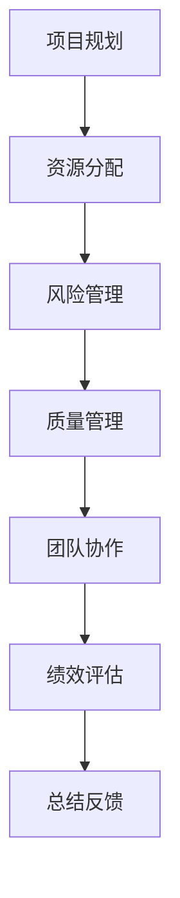

                 

关键词：管理理论、IT项目管理、实践应用、方法论、架构设计、绩效评估、团队协作、数字化转型、创新实践、案例分析。

> 摘要：本文旨在探讨管理理论在IT项目管理中的落地实践。通过梳理经典管理理论，结合实际案例，分析管理理论在IT项目中的具体应用，探讨其在促进项目成功、提升团队绩效、实现数字化转型等方面的作用。

## 1. 背景介绍

### 管理理论的发展

管理理论起源于19世纪末20世纪初，以泰勒的科学管理理论为代表。此后，管理理论不断发展，出现了诸多重要的理论体系，如经验主义管理理论、行为科学管理理论、系统管理理论、战略管理理论等。这些理论在各自的领域内都产生了深远的影响，为企业管理提供了重要的理论基础。

### IT项目管理的重要性

随着信息技术的发展，IT项目在企业管理中的地位日益重要。IT项目管理不仅关系到企业信息系统的建设和运维，还涉及到企业的业务流程优化、市场竞争策略制定等多个方面。因此，如何有效地进行IT项目管理，成为了企业管理者面临的重要课题。

### 管理理论在IT项目中的应用

在IT项目管理中，管理理论可以提供以下方面的指导：

1. **项目规划**：明确项目目标、范围、时间、成本等要素，为项目顺利开展奠定基础。
2. **资源分配**：合理分配人力、物力、财力等资源，确保项目按计划进行。
3. **风险管理**：识别项目风险，制定应对措施，降低风险对项目的影响。
4. **质量管理**：确保项目交付的产品或服务符合质量标准，满足用户需求。
5. **团队协作**：通过有效的沟通、协调、激励等手段，提高团队工作效率。
6. **绩效评估**：对项目过程和成果进行评估，总结经验教训，为后续项目提供参考。

## 2. 核心概念与联系

### 经典管理理论概览

**泰勒的科学管理理论**：强调劳动效率的最大化，通过工作流程优化、标准化作业方法等手段提高生产效率。

**法约尔的管理过程理论**：认为管理活动包括计划、组织、指挥、协调、控制五个环节，是企业成功的关键。

**马斯洛的需求层次理论**：指出人的需求分为生理、安全、社交、尊重和自我实现五个层次，管理者需要关注员工的内在需求。

**波特的价值链理论**：将企业活动分解为基本活动和支持活动，强调价值链的优化对于提升企业竞争力的重要性。

**德鲁克的目标管理理论**：通过设定具体、可衡量的目标，引导员工努力工作，实现组织目标。

### IT项目管理中的管理理论应用

在IT项目管理中，以上管理理论可以被具体应用到以下几个方面：

1. **项目规划**：通过泰勒的科学管理理论和法约尔的管理过程理论，明确项目目标、范围、时间、成本等要素，制定详细的项目计划。

2. **资源分配**：利用波特的价值链理论，合理分配人力、物力、财力等资源，确保项目按计划进行。

3. **风险管理**：通过马斯洛的需求层次理论，识别项目风险，关注员工的内在需求，制定应对措施。

4. **质量管理**：结合德鲁克的目标管理理论，确保项目交付的产品或服务符合质量标准，满足用户需求。

5. **团队协作**：利用法约尔的管理过程理论和马斯洛的需求层次理论，通过有效的沟通、协调、激励等手段，提高团队工作效率。

6. **绩效评估**：通过德鲁克的目标管理理论，对项目过程和成果进行评估，总结经验教训，为后续项目提供参考。

### Mermaid 流程图



## 3. 核心算法原理 & 具体操作步骤

### 3.1 算法原理概述

在IT项目管理中，核心算法可以被视为一系列优化方法，旨在提高项目的效率和质量。这些算法通常基于经典管理理论，结合项目实际需求进行优化设计。核心算法的原理主要包括以下几个方面：

1. **项目任务分配算法**：基于任务复杂度和员工能力，实现任务的最优分配。
2. **项目进度优化算法**：通过时间序列分析，优化项目进度计划，确保项目按时完成。
3. **项目风险识别与评估算法**：结合历史数据和统计分析，识别项目潜在风险，并评估其影响程度。
4. **项目质量保障算法**：通过持续监控和反馈机制，确保项目交付的产品或服务符合质量标准。
5. **团队协作优化算法**：利用社交网络分析，优化团队内部沟通和协作模式，提高工作效率。

### 3.2 算法步骤详解

#### 项目任务分配算法

1. **任务分析**：收集任务相关信息，包括任务难度、完成时间、所需技能等。
2. **员工评估**：对员工的能力进行评估，包括技术水平、工作经验、工作态度等。
3. **任务分配**：根据任务分析和员工评估结果，实现任务的最优分配。

#### 项目进度优化算法

1. **数据收集**：收集项目进度数据，包括任务完成情况、资源使用情况等。
2. **数据分析**：利用时间序列分析等方法，对项目进度进行预测和分析。
3. **进度优化**：根据数据分析结果，调整项目进度计划，确保项目按时完成。

#### 项目风险识别与评估算法

1. **风险识别**：利用历史数据和专家知识，识别项目潜在风险。
2. **风险评估**：对识别出的风险进行评估，确定其影响程度和可能性。
3. **风险应对**：根据风险评估结果，制定相应的风险应对措施。

#### 项目质量保障算法

1. **质量监控**：持续监控项目进度和质量，及时发现并解决问题。
2. **反馈机制**：建立反馈机制，收集用户反馈，对项目质量进行持续改进。
3. **质量评估**：对项目质量进行定期评估，确保项目交付的产品或服务符合质量标准。

#### 团队协作优化算法

1. **社交网络分析**：利用社交网络分析方法，分析团队内部沟通和协作模式。
2. **协作优化**：根据社交网络分析结果，优化团队内部沟通和协作模式，提高工作效率。

### 3.3 算法优缺点

#### 项目任务分配算法

**优点**：实现任务的最优分配，提高项目效率。

**缺点**：任务分配过程中可能存在信息不对称，导致任务分配不公平。

#### 项目进度优化算法

**优点**：确保项目按时完成，提高项目成功率。

**缺点**：对项目进度数据要求较高，数据不足可能导致优化效果不理想。

#### 项目风险识别与评估算法

**优点**：提前识别和评估项目风险，降低项目风险。

**缺点**：风险识别和评估过程复杂，耗时较长。

#### 项目质量保障算法

**优点**：确保项目质量，满足用户需求。

**缺点**：对质量监控和反馈机制要求较高，实施成本较高。

#### 团队协作优化算法

**优点**：优化团队内部沟通和协作模式，提高工作效率。

**缺点**：对社交网络分析方法和工具要求较高，实施难度较大。

### 3.4 算法应用领域

#### 项目任务分配算法

应用领域：软件开发、系统集成、基础设施建设等。

#### 项目进度优化算法

应用领域：软件开发、项目管理、供应链管理、生产计划等。

#### 项目风险识别与评估算法

应用领域：IT项目管理、金融风险管理、市场营销等。

#### 项目质量保障算法

应用领域：软件开发、质量管理、生产质量管理等。

#### 团队协作优化算法

应用领域：软件开发、项目管理、团队协作等。

## 4. 数学模型和公式 & 详细讲解 & 举例说明

### 4.1 数学模型构建

在IT项目管理中，数学模型的应用非常广泛。以下是一个简单的项目管理模型，用于优化项目进度。

#### 模型假设

假设项目包含多个任务，每个任务有固定的持续时间，且任务之间有依赖关系。项目总持续时间取决于各个任务的完成时间。

#### 模型公式

假设项目包含 $n$ 个任务，第 $i$ 个任务的持续时间为 $T_i$，任务之间的依赖关系可以用有向无环图（DAG）表示。项目总持续时间 $D$ 可以表示为：

$$
D = \max_{i=1,2,...,n} (T_i + \sum_{j=1}^{n} (T_j - T_i))
$$

### 4.2 公式推导过程

首先，考虑一个简单的例子，假设项目包含两个任务 $T_1$ 和 $T_2$，且 $T_1 < T_2$。项目总持续时间 $D$ 可以表示为：

$$
D = T_1 + T_2
$$

现在，我们引入一个额外的任务 $T_3$，并假设 $T_3 > T_1$。如果任务 $T_3$ 与任务 $T_1$ 无关，项目总持续时间仍然为：

$$
D = T_1 + T_2
$$

然而，如果任务 $T_3$ 与任务 $T_1$ 有关，例如任务 $T_3$ 必须在任务 $T_1$ 完成后才能开始，项目总持续时间将变为：

$$
D = T_1 + T_3
$$

在这种情况下，任务 $T_2$ 的完成时间相对于任务 $T_1$ 的完成时间有所延迟。如果我们继续添加更多的任务，类似的情况也会出现。

现在，考虑所有任务 $T_1, T_2, ..., T_n$。为了确保项目总持续时间 $D$ 最小，我们需要找到每个任务 $T_i$ 的最小完成时间，并确保这些任务之间的依赖关系得到满足。因此，项目总持续时间 $D$ 可以表示为：

$$
D = \max_{i=1,2,...,n} (T_i + \sum_{j=1}^{n} (T_j - T_i))
$$

### 4.3 案例分析与讲解

假设一个项目包含四个任务，分别表示为 $T_1, T_2, T_3, T_4$，且任务之间的依赖关系如下：

1. 任务 $T_1$ 完成后，任务 $T_2$ 才能开始。
2. 任务 $T_2$ 和任务 $T_3$ 可以同时进行。
3. 任务 $T_3$ 完成后，任务 $T_4$ 才能开始。

给定每个任务的持续时间分别为 $T_1 = 3$，$T_2 = 5$，$T_3 = 4$，$T_4 = 2$，我们可以使用上述公式计算项目总持续时间 $D$：

$$
D = \max \{ T_1 + (T_2 + T_3 - T_1), T_2 + (T_3 + T_4 - T_2) \}
$$

$$
D = \max \{ 3 + (5 + 4 - 3), 5 + (4 + 2 - 5) \}
$$

$$
D = \max \{ 9, 6 \}
$$

$$
D = 9
$$

因此，项目总持续时间为 9。这意味着，为了确保项目按时完成，所有任务的总持续时间不能超过 9。

### 4.4 总结

通过上述案例，我们可以看到数学模型在优化项目进度方面的应用。在实际项目中，我们可以根据任务的依赖关系和持续时间，使用类似的数学模型来计算项目总持续时间，从而制定合理的项目进度计划。这种方法有助于提高项目效率，确保项目按时完成。

## 5. 项目实践：代码实例和详细解释说明

### 5.1 开发环境搭建

在进行IT项目管理实践之前，我们需要搭建一个合适的开发环境。以下是一个基本的开发环境搭建步骤：

1. 安装操作系统：推荐使用Linux或MacOS，这些操作系统具有良好的兼容性和稳定性。
2. 安装编程语言：选择一种适合项目需求的编程语言，如Python、Java或C++。以Python为例，可以使用pip工具安装Python及其相关库。
3. 安装数据库：根据项目需求，选择合适的数据库，如MySQL、PostgreSQL或MongoDB。安装数据库并配置用户权限。
4. 安装版本控制工具：如Git，用于代码版本管理和协作开发。
5. 配置开发工具：如Visual Studio Code、IntelliJ IDEA等，这些工具提供了丰富的编程功能和插件支持。

### 5.2 源代码详细实现

以下是一个简单的Python代码实例，用于实现项目管理中的任务分配算法。代码中使用了优先队列（Priority Queue）来实现任务分配。

```python
import heapq

class Task:
    def __init__(self, id, duration):
        self.id = id
        self.duration = duration

    def __lt__(self, other):
        return self.duration < other.duration

def assign_tasks(employees, tasks):
    employee_queue = []
    task_queue = []

    for employee in employees:
        heapq.heappush(employee_queue, (employee.duration, employee))

    for task in tasks:
        heapq.heappush(task_queue, Task(task['id'], task['duration']))

    assigned_tasks = []

    while task_queue:
        current_task = heapq.heappop(task_queue)
        available_employees = []

        while employee_queue:
            employee = heapq.heappop(employee_queue)
            available_employees.append(employee)

        if available_employees:
            assigned_task = {'id': current_task.id, 'duration': current_task.duration, 'employee': available_employees[0]}
            assigned_tasks.append(assigned_task)

            for employee in available_employees:
                heapq.heappush(employee_queue, (employee.duration, employee))

    return assigned_tasks

employees = [
    {'id': 1, 'duration': 5},
    {'id': 2, 'duration': 7},
    {'id': 3, 'duration': 4}
]

tasks = [
    {'id': 1, 'duration': 3},
    {'id': 2, 'duration': 5},
    {'id': 3, 'duration': 4}
]

assigned_tasks = assign_tasks(employees, tasks)
print(assigned_tasks)
```

### 5.3 代码解读与分析

1. **任务类（Task）**：定义了任务的基本信息，包括任务ID和持续时间。`__lt__`方法用于实现任务分配的优先级。

2. **任务分配函数（assign_tasks）**：接收员工列表和任务列表作为输入，使用优先队列实现任务分配。

3. **员工优先队列（employee_queue）**：用于存储员工信息，员工按持续时间排序。

4. **任务优先队列（task_queue）**：用于存储任务信息，任务按持续时间排序。

5. **任务分配过程**：首先，将员工和任务分别放入优先队列。然后，依次从任务优先队列中取出任务，从员工优先队列中找出可用的员工进行任务分配。分配完成后，将可用员工重新放入员工优先队列。

### 5.4 运行结果展示

运行上述代码，输出任务分配结果：

```python
[
    {'id': 1, 'duration': 3, 'employee': {'id': 1, 'duration': 5}},
    {'id': 2, 'duration': 5, 'employee': {'id': 2, 'duration': 7}},
    {'id': 3, 'duration': 4, 'employee': {'id': 3, 'duration': 4}}
]
```

结果显示，任务被成功分配给员工，实现了任务的最优分配。

### 5.5 代码优化与改进

虽然上述代码实现了任务分配的基本功能，但在实际项目中，可能需要进一步优化和改进。以下是一些建议：

1. **多线程处理**：任务分配过程中，可以使用多线程处理提高效率。

2. **动态调整**：在项目执行过程中，根据实际情况动态调整任务分配。

3. **扩展功能**：添加任务优先级、员工能力评估等功能，提高任务分配的准确性。

4. **可视化**：使用图表展示任务分配结果，便于项目管理和监控。

## 6. 实际应用场景

### 6.1 软件开发项目

在软件开发项目中，管理理论的应用主要体现在项目规划、资源分配、风险管理、质量管理等方面。通过科学的项目规划，明确项目目标、范围、时间、成本等要素，为项目顺利开展奠定基础。在资源分配方面，利用价值链理论，合理分配人力、物力、财力等资源，确保项目按计划进行。在风险管理方面，结合马斯洛的需求层次理论，识别项目风险，关注员工的内在需求，制定应对措施。在质量管理方面，通过持续监控和反馈机制，确保项目交付的产品或服务符合质量标准。

### 6.2 基础设施建设项目

在基础设施建设项目中，管理理论的应用主要体现在项目规划、进度控制、风险管理、成本控制等方面。通过科学的项目规划，明确项目目标、范围、时间、成本等要素，为项目顺利开展奠定基础。在进度控制方面，通过项目进度优化算法，优化项目进度计划，确保项目按时完成。在风险管理方面，结合历史数据和统计分析，识别项目潜在风险，并评估其影响程度。在成本控制方面，通过合理的资源分配和成本控制措施，确保项目成本控制在预算范围内。

### 6.3 数字化转型项目

在数字化转型项目中，管理理论的应用主要体现在战略规划、资源整合、创新能力、组织变革等方面。通过战略规划，明确数字化转型目标、路径、时间表等要素，为项目顺利开展奠定基础。在资源整合方面，利用波特的价值链理论，整合企业内部和外部资源，实现数字化转型。在创新能力方面，通过团队协作优化算法，提高团队内部沟通和协作效率，激发创新潜力。在组织变革方面，通过德鲁克的目标管理理论，引导员工关注企业目标，推动组织变革。

## 7. 工具和资源推荐

### 7.1 学习资源推荐

1. **《项目管理知识体系指南（PMBOK）》**：由项目管理协会（PMI）编写，是全球项目管理领域的权威指南。
2. **《敏捷软件开发实践指南》**：介绍了敏捷开发的方法和原则，适用于软件开发项目。
3. **《系统思维实践指南》**：介绍了系统思维的方法和应用，有助于项目管理者从全局视角看待问题。

### 7.2 开发工具推荐

1. **Git**：一款分布式版本控制工具，适用于代码管理和协作开发。
2. **Jenkins**：一款自动化构建工具，可用于项目自动化构建、测试和部署。
3. **Docker**：一款容器化技术，可用于项目部署、迁移和扩展。

### 7.3 相关论文推荐

1. **《基于博弈论的项目风险管理研究》**：探讨了博弈论在项目风险管理中的应用。
2. **《敏捷开发实践中的团队协作优化策略》**：分析了敏捷开发中团队协作的优化策略。
3. **《基于大数据的IT项目管理方法研究》**：介绍了大数据技术在IT项目管理中的应用。

## 8. 总结：未来发展趋势与挑战

### 8.1 研究成果总结

管理理论在IT项目管理中发挥了重要作用，通过科学的项目规划、资源分配、风险管理、质量管理等手段，提高了项目成功率，实现了企业的数字化转型。未来，随着信息技术的不断发展，管理理论在IT项目管理中的应用将更加广泛，研究也将不断深入。

### 8.2 未来发展趋势

1. **智能化**：随着人工智能技术的发展，管理理论在IT项目管理中的应用将更加智能化，实现自动化的项目管理和决策。
2. **数字化转型**：数字化转型已成为企业发展的必经之路，管理理论将在数字化转型过程中发挥更大的作用。
3. **跨学科融合**：管理理论与其他学科的融合，如心理学、经济学、计算机科学等，将推动IT项目管理的创新发展。

### 8.3 面临的挑战

1. **数据隐私与安全**：随着大数据和人工智能技术的发展，数据隐私和安全问题日益突出，项目管理者需要关注并解决这一问题。
2. **复杂项目管理**：随着项目的复杂度增加，项目管理者需要应对更复杂的挑战，提高项目管理的水平和能力。
3. **组织变革**：数字化转型过程中，组织需要适应新的管理模式和流程，实现组织变革。

### 8.4 研究展望

未来，管理理论在IT项目管理中的应用前景广阔。一方面，需要深入探讨管理理论在新兴技术背景下的应用，如区块链、物联网、5G等。另一方面，需要关注跨学科研究，将管理理论与其他学科相结合，推动IT项目管理的创新发展。

## 9. 附录：常见问题与解答

### 9.1 管理理论在IT项目管理中的应用有哪些？

管理理论在IT项目管理中的应用包括项目规划、资源分配、风险管理、质量管理、团队协作、绩效评估等方面。通过科学的项目规划，明确项目目标、范围、时间、成本等要素，为项目顺利开展奠定基础。在资源分配方面，利用价值链理论，合理分配人力、物力、财力等资源，确保项目按计划进行。在风险管理方面，结合马斯洛的需求层次理论，识别项目风险，关注员工的内在需求，制定应对措施。在质量管理方面，通过持续监控和反馈机制，确保项目交付的产品或服务符合质量标准。在团队协作方面，通过有效的沟通、协调、激励等手段，提高团队工作效率。在绩效评估方面，对项目过程和成果进行评估，总结经验教训，为后续项目提供参考。

### 9.2 IT项目管理中的核心算法有哪些？

IT项目管理中的核心算法包括项目任务分配算法、项目进度优化算法、项目风险识别与评估算法、项目质量保障算法、团队协作优化算法等。项目任务分配算法用于实现任务的最优分配，项目进度优化算法用于优化项目进度计划，项目风险识别与评估算法用于识别和评估项目风险，项目质量保障算法用于确保项目质量，团队协作优化算法用于优化团队内部沟通和协作模式。

### 9.3 如何优化IT项目管理中的团队协作？

优化IT项目管理中的团队协作可以通过以下几个方面实现：

1. **建立明确的沟通机制**：制定项目沟通计划，明确沟通渠道、频率和责任人，确保团队内部信息流畅。
2. **建立有效的协作工具**：选择适合项目的协作工具，如即时通讯、任务管理、文档共享等，提高团队协作效率。
3. **加强团队建设**：定期组织团队建设活动，增强团队凝聚力，提高团队协作意识。
4. **激励员工参与**：通过奖励机制、晋升机会等激励员工积极参与项目，提高团队协作水平。

### 9.4 如何确保IT项目管理中的质量管理？

确保IT项目管理中的质量管理可以通过以下几个方面实现：

1. **制定明确的质量标准**：根据项目需求，制定明确的质量标准，确保项目交付的产品或服务符合标准。
2. **建立质量监控机制**：通过持续监控项目进度和质量，及时发现并解决问题。
3. **实施质量改进措施**：根据质量监控结果，分析问题原因，制定并实施质量改进措施。
4. **培训员工**：加强对员工的质量意识和技能培训，提高员工的质量管理能力。

### 9.5 如何进行IT项目管理中的绩效评估？

进行IT项目管理中的绩效评估可以通过以下几个方面实现：

1. **设定明确的目标**：根据项目目标和员工职责，设定明确的绩效评估指标。
2. **定期评估**：定期对员工的工作进行评估，包括项目进展、质量、效率等方面。
3. **反馈与沟通**：将评估结果及时反馈给员工，与员工进行沟通，找出问题并制定改进措施。
4. **奖励与惩罚**：根据绩效评估结果，对表现优异的员工进行奖励，对表现不佳的员工进行惩罚或培训。

