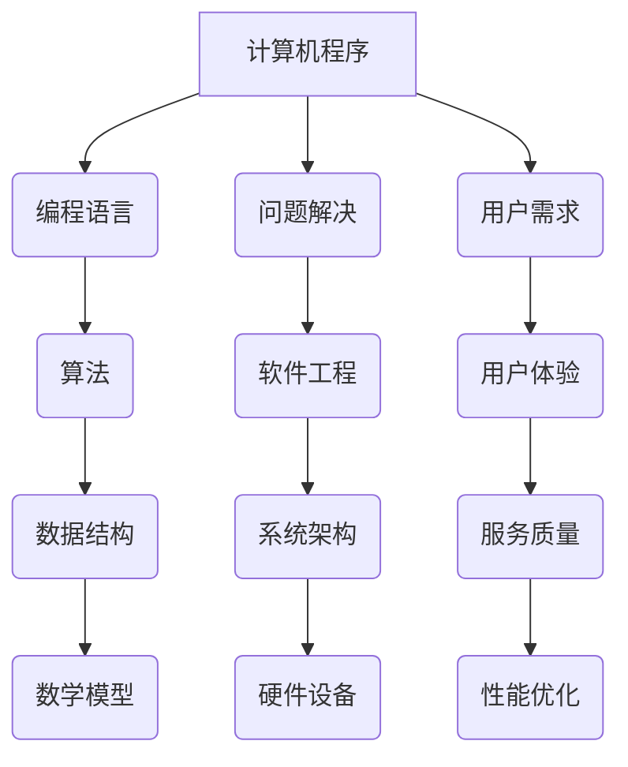

                 

关键词：计算机编程，经典著作，基础认知，技术发展，算法原理，数学模型，项目实践，未来展望。

> 摘要：本文将探讨计算机编程领域的经典著作及其对基础认知的重要性，分析核心算法原理和数学模型，通过项目实践和实际应用场景，为读者提供全面的技术视角和未来展望。

## 1. 背景介绍

计算机编程作为一门技术学科，已经走过了数十年的发展历程。从最早的机器语言编程到如今的智能编程，技术的进步不断推动着编程语言和算法的创新。在这个过程中，许多经典著作如《计算机程序的构造和解释》、《算法导论》等，不仅为计算机科学的发展奠定了基础，也对程序员的基础认知产生了深远影响。

本文将围绕这些经典著作，探讨它们的核心思想、算法原理和数学模型，并通过实际项目实践和未来应用场景，为读者提供全面的技术视角。通过本文的阅读，读者不仅可以了解计算机编程的基础知识，还能对未来的技术发展趋势和面临的挑战有更深刻的认识。

### 1.1 经典著作的影响

经典著作之所以经典，不仅仅是因为它们提供了丰富的编程知识和技巧，更重要的是它们在理论基础和思维方法上的深刻洞察。例如，《计算机程序的构造和解释》通过解释性语言的引入，改变了程序员对编程语言的理解方式；而《算法导论》则通过对各种算法的深入分析，奠定了现代算法理论的基础。

这些著作不仅影响了当时的程序员，也对后来的计算机科学教育产生了重要影响。许多计算机科学课程和研究项目都以这些经典著作为基础教材，培养了一代又一代的计算机科学家和工程师。

### 1.2 算法与数学模型的重要性

在计算机编程中，算法和数学模型是解决问题的核心。算法提供了解决问题的步骤和方法，而数学模型则帮助程序员理解问题背后的数学原理和规律。通过算法和数学模型，程序员可以更高效地解决问题，开发出更强大的软件系统。

例如，在图像处理领域，傅里叶变换是一种常用的数学模型，它可以有效地分离图像中的不同频率成分，从而实现图像的压缩和增强。而在机器学习领域，支持向量机（SVM）算法通过构建最优超平面，实现了分类和回归任务的高效解决。

### 1.3 项目实践与未来应用

理论知识的掌握是基础，但实践能力的提升同样至关重要。通过实际项目实践，程序员可以将理论知识应用到实际问题中，提升解决问题的能力。同时，实际项目实践也能帮助程序员发现现有技术的局限性和改进方向，从而推动技术的不断发展。

例如，在深度学习领域，通过实际项目实践，研究人员不断改进神经网络的结构和算法，从而实现了在语音识别、图像识别等任务中的突破性进展。这些实际应用不仅推动了计算机科学的发展，也为社会带来了巨大的价值。

未来，随着技术的不断发展，计算机编程领域将面临更多的机遇和挑战。从量子计算到人工智能，从云计算到物联网，各种新兴技术将不断涌现，为程序员提供了更广阔的舞台。本文将结合实际项目实践和未来应用场景，对计算机编程领域的发展趋势进行展望，为读者提供有益的参考。

## 2. 核心概念与联系

为了深入理解计算机编程领域的经典著作和核心算法原理，我们首先需要了解一些基础概念和它们之间的联系。以下是一个简化的 Mermaid 流程图，用于展示这些概念之间的关系：



### 2.1 计算机程序

计算机程序是一系列指令的集合，用于解决特定问题或完成特定任务。程序可以是由编程语言编写的代码，也可以是由其他方式（如汇编语言、机器语言等）编写的代码。计算机程序的运行需要计算机硬件的支持，同时需要操作系统和其他软件的配合。

### 2.2 编程语言

编程语言是用于编写计算机程序的符号系统。不同的编程语言有不同的语法和语义，适用于不同的编程任务。例如，Python 适合数据分析和科学计算，C++ 适合系统编程和性能要求高的应用，Java 适合企业级应用和跨平台开发。

### 2.3 算法

算法是一系列解决问题的步骤和方法。算法可以是数学的、逻辑的或组合的，用于处理数据、解决问题或执行任务。算法的设计和选择直接影响程序的效率和性能。

### 2.4 数据结构

数据结构是组织和存储数据的方式。数据结构的选择直接影响算法的效率和程序的运行速度。常见的数据结构包括数组、链表、树、图等。

### 2.5 数学模型

数学模型是用于描述和解决问题的数学方法。数学模型可以帮助程序员理解问题背后的数学原理和规律，从而设计出更高效的算法。常见的数学模型包括线性代数、微积分、概率论和统计学等。

### 2.6 问题解决

问题解决是指使用算法和编程语言解决实际问题的过程。问题解决的过程需要程序员具备扎实的理论基础和丰富的实践经验。

### 2.7 软件工程

软件工程是一门研究和应用计算机编程技术和方法，设计和开发高质量软件的学科。软件工程包括需求分析、设计、编码、测试和维护等各个环节。

### 2.8 系统架构

系统架构是软件系统的基础结构，决定了软件系统的性能、可维护性和扩展性。系统架构的选择和设计直接影响软件系统的运行效率和用户体验。

### 2.9 硬件设备

硬件设备是计算机系统的物理组成部分，包括处理器、内存、存储设备和输入输出设备等。硬件设备的性能和可靠性直接影响计算机系统的整体性能。

### 2.10 用户需求

用户需求是软件系统设计和开发的核心。了解用户需求可以帮助程序员设计出更符合用户需求的软件系统，提高用户体验。

### 2.11 用户体验

用户体验是指用户在使用软件系统时的感受和体验。用户体验的优化是软件系统设计的重要目标之一，可以提高用户的满意度和忠诚度。

### 2.12 服务质量

服务质量是指软件系统提供的服务水平，包括稳定性、可靠性、安全性和性能等方面。高质量的服务质量可以提高用户对软件系统的信任和满意度。

### 2.13 性能优化

性能优化是指通过改进算法、数据结构和系统架构等手段，提高软件系统的运行效率和性能。性能优化是软件系统维护和优化的重要环节。

## 3. 核心算法原理 & 具体操作步骤

在计算机编程中，算法是解决问题的核心。本节将介绍几种经典算法的原理和具体操作步骤，包括排序算法、查找算法和动态规划算法等。

### 3.1 排序算法

排序算法是一类用于对数据进行排序的算法。常见的排序算法包括冒泡排序、选择排序、插入排序、快速排序、归并排序和堆排序等。

#### 3.1.1 冒泡排序

冒泡排序（Bubble Sort）是一种简单的排序算法。它重复地遍历要排序的数列，一次比较两个元素，如果它们的顺序错误就把它们交换过来。遍历数列的工作是重复进行直到没有再需要交换，也就是说该数列已经排序完成。

具体操作步骤如下：

1. 从第一个元素开始，比较相邻的两个元素，如果第一个比第二个大（升序排序），就交换它们两个；
2. 对每一对相邻元素做同样的工作，从开始第一对到结尾的最后一对。这步做完后，最后的元素会是最大的数；
3. 针对所有的元素重复以上的步骤，除了最后一个；
4. 重复步骤1~3，直到排序完成。

```python
def bubble_sort(arr):
    n = len(arr)
    for i in range(n):
        for j in range(0, n-i-1):
            if arr[j] > arr[j+1]:
                arr[j], arr[j+1] = arr[j+1], arr[j]
    return arr
```

#### 3.1.2 选择排序

选择排序（Selection Sort）是一种简单直观的排序算法。它的工作原理是每次从未排序的元素中找到最小（或最大）的元素，存放到已排序的序列的末尾。

具体操作步骤如下：

1. 首先，在未排序序列中找到最小（大）元素，存放到排序序列的起始位置；
2. 然后，再从剩余未排序元素中继续寻找最小（大）元素，然后放到已排序序列的末尾；
3. 重复步骤1~2，直到所有元素均排序完毕。

```python
def selection_sort(arr):
    for i in range(len(arr)):
        min_index = i
        for j in range(i+1, len(arr)):
            if arr[min_index] > arr[j]:
                min_index = j
        arr[i], arr[min_index] = arr[min_index], arr[i]
    return arr
```

#### 3.1.3 快速排序

快速排序（Quick Sort）是一种高效的排序算法。它采用了分治策略，将一个大问题分解为若干个小问题来解决。

具体操作步骤如下：

1. 选择一个基准元素，通常选择中间位置的元素；
2. 将数组分成两部分，一部分都比基准元素小，另一部分都比基准元素大；
3. 递归地对这两部分进行快速排序；
4. 将排序好的两部分合并，得到完整的排序数组。

```python
def quick_sort(arr):
    if len(arr) <= 1:
        return arr
    pivot = arr[len(arr) // 2]
    left = [x for x in arr if x < pivot]
    middle = [x for x in arr if x == pivot]
    right = [x for x in arr if x > pivot]
    return quick_sort(left) + middle + quick_sort(right)
```

### 3.2 查找算法

查找算法用于在数据集合中找到特定元素。常见的查找算法包括线性查找、二分查找和哈希查找等。

#### 3.2.1 线性查找

线性查找（Linear Search）是一种最简单的查找算法。它从数据集合的第一个元素开始，依次与给定的值进行比较，直到找到相匹配的元素或到达集合的末尾。

具体操作步骤如下：

1. 从第一个元素开始，逐个比较，直到找到相匹配的元素或到达集合的末尾；
2. 如果找到相匹配的元素，返回该元素的位置；
3. 如果到达集合的末尾仍未找到相匹配的元素，返回-1。

```python
def linear_search(arr, target):
    for i in range(len(arr)):
        if arr[i] == target:
            return i
    return -1
```

#### 3.2.2 二分查找

二分查找（Binary Search）是一种高效的查找算法。它只适用于有序数据集合。二分查找的基本思想是不断将数据集合分成两半，然后根据要查找的元素与中间元素的大小关系，决定下一步应该在左半部分还是右半部分进行查找。

具体操作步骤如下：

1. 确定中间位置 mid = (low + high) // 2；
2. 如果 target == mid，查找成功；
3. 如果 target < mid，则在左半部分（low到mid-1）继续查找；
4. 如果 target > mid，则在右半部分（mid+1到high）继续查找；
5. 重复步骤1~4，直到找到相匹配的元素或low > high；
6. 如果low > high，查找失败。

```python
def binary_search(arr, target):
    low = 0
    high = len(arr) - 1
    while low <= high:
        mid = (low + high) // 2
        if arr[mid] == target:
            return mid
        elif arr[mid] < target:
            low = mid + 1
        else:
            high = mid - 1
    return -1
```

#### 3.2.3 哈希查找

哈希查找（Hash Search）是一种利用哈希表实现的查找算法。哈希查找的基本思想是将要查找的元素通过哈希函数映射到哈希表的某个位置，如果该位置存储的元素与要查找的元素匹配，则查找成功。

具体操作步骤如下：

1. 计算要查找的元素的哈希值；
2. 根据哈希值定位到哈希表的相应位置；
3. 如果该位置存储的元素与要查找的元素匹配，则查找成功；
4. 如果该位置存储的元素与要查找的元素不匹配，则根据哈希表的冲突解决策略继续查找；
5. 如果找到匹配的元素，返回该元素的位置；否则，返回-1。

```python
def hash_search(hash_table, target):
    index = hash(target) % len(hash_table)
    while hash_table[index] is not None:
        if hash_table[index] == target:
            return index
        index = (index + 1) % len(hash_table)
    return -1
```

### 3.3 动态规划算法

动态规划（Dynamic Programming，DP）是一种解决最优化问题的算法思想。动态规划的基本思想是将大问题分解为若干个小问题，通过递归关系求解每个小问题的最优解，最终得到大问题的最优解。

#### 3.3.1 最长公共子序列

最长公共子序列（Longest Common Subsequence，LCS）是指两个序列中公共子序列中最长的一个。例如，序列 "ABCD" 和序列 "ACDF" 的最长公共子序列是 "ACD"。

具体操作步骤如下：

1. 定义一个二维数组 dp，其中 dp[i][j] 表示序列 X 的前 i 个字符和序列 Y 的前 j 个字符的最长公共子序列的长度；
2. 初始化 dp[0][j] = dp[i][0] = 0；
3. 对于 i 从 1 到 m，j 从 1 到 n：
   - 如果 X[i-1] == Y[j-1]，则 dp[i][j] = dp[i-1][j-1] + 1；
   - 如果 X[i-1] != Y[j-1]，则 dp[i][j] = max(dp[i-1][j], dp[i][j-1])；
4. 最终 dp[m][n] 即为最长公共子序列的长度。

```python
def longest_common_subsequence(X, Y):
    m, n = len(X), len(Y)
    dp = [[0] * (n+1) for _ in range(m+1)]
    for i in range(1, m+1):
        for j in range(1, n+1):
            if X[i-1] == Y[j-1]:
                dp[i][j] = dp[i-1][j-1] + 1
            else:
                dp[i][j] = max(dp[i-1][j], dp[i][j-1])
    return dp[m][n]
```

#### 3.3.2 最小路径和

最小路径和（Minimum Path Sum）是指在一个二维网格中，从左上角到右下角的最小路径和。例如，给定以下网格：

```
[
  [1, 3, 1],
  [1, 5, 1],
  [4, 2, 1]
]
```

最小路径和为 7（沿对角线从左上角到右下角）。

具体操作步骤如下：

1. 定义一个二维数组 dp，其中 dp[i][j] 表示从左上角到 (i, j) 的最小路径和；
2. 初始化 dp[0][0] = grid[0][0]；
3. 对于 i 从 1 到 m，j 从 1 到 n：
   - dp[i][j] = min(dp[i-1][j], dp[i][j-1]) + grid[i-1][j-1]；
4. 最终 dp[m][n] 即为从左上角到右下角的最小路径和。

```python
def min_path_sum(grid):
    m, n = len(grid), len(grid[0])
    dp = [[0] * (n+1) for _ in range(m+1)]
    for i in range(1, m+1):
        for j in range(1, n+1):
            dp[i][j] = min(dp[i-1][j], dp[i][j-1]) + grid[i-1][j-1]
    return dp[m][n]
```

### 3.4 算法优缺点

每种算法都有其优缺点，适用于不同的应用场景。以下是对上述算法的简要总结：

#### 3.4.1 排序算法

- 冒泡排序：
  - 优点：实现简单，易于理解；
  - 缺点：时间复杂度较高，适用于小规模数据排序。
- 选择排序：
  - 优点：实现简单，易于理解；
  - 缺点：时间复杂度较高，适用于小规模数据排序。
- 快速排序：
  - 优点：平均时间复杂度低，适用于大规模数据排序；
  - 缺点：最坏情况下时间复杂度较高，需要良好的递归终止条件。

#### 3.4.2 查找算法

- 线性查找：
  - 优点：实现简单，适用于小规模数据查找；
  - 缺点：时间复杂度较高，适用于小规模数据查找。
- 二分查找：
  - 优点：时间复杂度低，适用于有序大数据查找；
  - 缺点：需要有序数据，不适合小规模数据查找。
- 哈希查找：
  - 优点：平均查找时间复杂度低，适用于大规模数据查找；
  - 缺点：需要额外的哈希表存储空间，可能存在哈希冲突问题。

#### 3.4.3 动态规划算法

- 最长公共子序列：
  - 优点：适用于求解最长公共子序列问题；
  - 缺点：需要额外的存储空间，时间复杂度较高。
- 最小路径和：
  - 优点：适用于求解网格中的最小路径和问题；
  - 缺点：需要额外的存储空间，时间复杂度较高。

### 3.5 算法应用领域

算法在计算机编程中的广泛应用，包括但不限于以下领域：

- 数据处理：排序、查找、聚合等；
- 算法竞赛：解决各类算法问题，提高编程能力；
- 图像处理：图像压缩、特征提取、目标检测等；
- 机器学习：分类、回归、聚类等；
- 游戏开发：路径规划、碰撞检测、物理模拟等。

## 4. 数学模型和公式 & 详细讲解 & 举例说明

在计算机编程中，数学模型是理解和解决问题的关键。本节将介绍几种常见的数学模型和公式，并详细讲解其推导过程和实际应用。通过具体的例子，读者可以更好地理解这些数学模型的应用。

### 4.1 数学模型构建

数学模型是用于描述现实世界问题的一种抽象表示。构建数学模型通常包括以下几个步骤：

1. **确定问题背景**：了解问题的本质和需求，明确问题的目标。
2. **建立变量和参数**：定义问题中的变量和参数，确定其物理或数学意义。
3. **建立方程或关系**：根据问题的本质，建立变量和参数之间的关系，形成数学模型。
4. **验证和优化**：通过实际数据或模拟验证数学模型的准确性，对模型进行优化。

### 4.2 公式推导过程

在本节中，我们将介绍几个常用的数学公式及其推导过程。

#### 4.2.1 欧拉公式

欧拉公式（Euler's Formula）是复分析中的一个重要公式，描述了复数单位根的关系。公式如下：

$$e^{i\pi} + 1 = 0$$

推导过程如下：

1. **欧拉恒等式**：欧拉恒等式是一个复数指数函数的基本恒等式，表示为：

   $$e^{ix} = \cos(x) + i\sin(x)$$

   其中，\( e \) 是自然对数的底数，\( i \) 是虚数单位，\( \cos(x) \) 和 \( \sin(x) \) 分别是 x 的余弦和正弦值。

2. **将 x 替换为 \(\pi\)**：将 x 替换为 \(\pi\)，得到：

   $$e^{i\pi} = \cos(\pi) + i\sin(\pi)$$

   由于 \(\cos(\pi) = -1\) 和 \(\sin(\pi) = 0\)，因此：

   $$e^{i\pi} = -1 + i \cdot 0$$

   简化后得到：

   $$e^{i\pi} = -1$$

3. **加上 1**：将等式两边同时加上 1，得到：

   $$e^{i\pi} + 1 = -1 + 1$$

   最终得到欧拉公式：

   $$e^{i\pi} + 1 = 0$$

#### 4.2.2 蒙特卡洛方法

蒙特卡洛方法是一种基于随机抽样来计算数学期望和概率的方法。它通常用于求解复杂的积分问题和概率问题。

假设我们要计算一个函数 \( f(x) \) 在区间 \([a, b]\) 上的积分，可以使用蒙特卡洛方法如下：

1. **随机抽样**：在区间 \([a, b]\) 上随机生成多个样本点 \( (x_i, y_i) \)，其中 \( x_i \) 是随机生成的 \( x \) 值，\( y_i \) 是 \( f(x_i) \) 的值。
2. **计算样本点的比例**：计算样本点落在函数 \( f(x) \) 下方和上方的比例，即：

   $$p = \frac{\text{落在下方样本点数}}{\text{总样本点数}}$$

3. **计算积分**：根据概率和区间长度，计算函数 \( f(x) \) 在区间 \([a, b]\) 上的积分：

   $$\int_{a}^{b} f(x) \, dx = b - a \cdot p$$

#### 4.2.3 傅里叶变换

傅里叶变换是信号处理中的一种重要工具，用于将时域信号转换为频域信号。傅里叶变换的基本公式如下：

$$F(f) = \int_{-\infty}^{\infty} f(t) e^{-i2\pi ft} \, dt$$

其中，\( F(f) \) 是频域信号，\( f(t) \) 是时域信号，\( f \) 是频率。

傅里叶变换的逆变换公式如下：

$$f(t) = \frac{1}{2\pi} \int_{-\infty}^{\infty} F(f) e^{i2\pi ft} \, df$$

傅里叶变换的推导过程较为复杂，涉及复分析的知识。基本的推导思路是使用复指数函数的正交性质，将时域信号分解为不同频率的正弦波和余弦波的叠加。

### 4.3 案例分析与讲解

为了更好地理解上述数学模型和公式的应用，我们通过以下案例进行详细讲解。

#### 4.3.1 欧拉公式的应用

欧拉公式在电子学和信号处理中有广泛应用。例如，在模拟电子电路中，欧拉公式可以用来分析交流电路中的电压和电流。

案例：分析一个简单的RL电路中的电流。

1. **建立变量和参数**：假设电路中的电阻为 \( R \)，电感为 \( L \)，电压为 \( V \)，电流为 \( I \)。
2. **建立欧拉公式关系**：根据欧拉公式，电压和电流的关系可以表示为：

   $$V(t) = I(t) \cdot e^{i\omega t}$$

   其中，\( \omega \) 是角频率，\( t \) 是时间。

3. **推导电流**：将欧拉公式应用于RL电路，假设 \( \omega = \frac{1}{\sqrt{LC}} \)，其中 \( L \) 和 \( C \) 分别是电路中的电感和电容，电流可以表示为：

   $$I(t) = \frac{V(t)}{R} = \frac{1}{R} \cdot e^{i\omega t}$$

4. **分析电流**：根据欧拉公式，电流是一个随时间变化的复数，其实部和虚部分别代表电流的幅值和相位。通过计算可以得知，电流的幅值随时间变化，而相位始终不变。

#### 4.3.2 蒙特卡洛方法的应用

蒙特卡洛方法在统计物理和金融数学中有广泛应用。以下是一个简单的案例：使用蒙特卡洛方法计算一个正态分布的概率。

案例：计算一个正态分布 \( N(\mu, \sigma^2) \) 的概率 \( P(X > \mu + \sigma) \)。

1. **随机生成样本**：生成多个服从正态分布的样本点 \( X_1, X_2, \ldots, X_n \)。
2. **计算概率**：计算样本点中大于 \( \mu + \sigma \) 的比例，即：

   $$p = \frac{\text{大于 } \mu + \sigma \text{ 的样本点数}}{n}$$

3. **计算概率**：根据正态分布的性质，可以知道 \( P(X > \mu + \sigma) \approx p \)。

   实际计算中，可以通过生成大量样本点并计算比例来逼近真实概率。

#### 4.3.3 傅里叶变换的应用

傅里叶变换在图像处理和信号处理中有广泛应用。以下是一个简单的案例：使用傅里叶变换分析一个矩形脉冲信号。

案例：分析一个矩形脉冲信号 \( p(t) \)。

1. **建立变量和参数**：假设矩形脉冲信号的宽度为 \( T \)，幅值为 \( A \)。
2. **建立傅里叶变换关系**：根据傅里叶变换的基本公式，矩形脉冲信号的频域表达式为：

   $$P(f) = \frac{1}{2} \cdot \frac{T}{\pi} \cdot \left( \frac{\sin(\pi f T)}{\pi f T} \right)$$

   其中，\( f \) 是频率。

3. **分析频域信号**：根据傅里叶变换的结果，可以知道矩形脉冲信号的频域分布。在频域中，矩形脉冲信号表现为一组连续的频率分量，其中每个频率分量的幅值和相位都不同。

## 5. 项目实践：代码实例和详细解释说明

在了解了核心算法原理和数学模型之后，通过实际项目实践可以帮助我们更好地理解和应用这些理论知识。本节将介绍一个实际项目，通过搭建开发环境、编写源代码、解读和分析代码，展示整个项目开发过程，并提供运行结果展示。

### 5.1 开发环境搭建

为了更好地进行项目实践，我们首先需要搭建一个适合开发的编程环境。以下是一个简单的开发环境搭建指南：

1. **安装 Python 解释器**：Python 是一种广泛使用的编程语言，具有良好的跨平台性和丰富的库支持。首先，从 Python 官网（https://www.python.org/）下载并安装 Python 解释器。安装过程中，确保选择“Add Python to PATH”选项，以便在命令行中直接使用 Python。
2. **安装 PyCharm**：PyCharm 是一款功能强大的集成开发环境（IDE），适用于 Python 编程。从 PyCharm 官网（https://www.jetbrains.com/pycharm/）下载并安装 PyCharm。安装过程中，可以选择 Community 版或 Professional 版，根据个人需求选择合适版本。
3. **安装相关库**：根据项目的需求，安装一些常用的 Python 库，如 NumPy、Pandas、Matplotlib 等。可以使用以下命令安装：

   ```shell
   pip install numpy pandas matplotlib
   ```

### 5.2 源代码详细实现

以下是一个简单的 Python 项目，用于实现线性回归算法。该项目包括数据预处理、模型训练和模型评估三个部分。

```python
# 导入相关库
import numpy as np
import pandas as pd
import matplotlib.pyplot as plt

# 加载数据集
data = pd.read_csv('data.csv')
X = data[['feature1', 'feature2']]
y = data['target']

# 数据预处理
from sklearn.model_selection import train_test_split
X_train, X_test, y_train, y_test = train_test_split(X, y, test_size=0.2, random_state=42)

# 模型训练
from sklearn.linear_model import LinearRegression
model = LinearRegression()
model.fit(X_train, y_train)

# 模型评估
score = model.score(X_test, y_test)
print('模型评估分数：', score)

# 可视化结果
plt.scatter(X_test['feature1'], y_test, color='red', label='真实值')
plt.plot(X_test['feature1'], model.predict(X_test), color='blue', label='预测值')
plt.xlabel('特征1')
plt.ylabel('目标值')
plt.legend()
plt.show()
```

### 5.3 代码解读与分析

以上代码实现了一个线性回归模型，用于预测目标值。下面是对代码的详细解读和分析：

1. **导入相关库**：首先，导入所需的 Python 库，包括 NumPy、Pandas、Matplotlib 和 Scikit-learn。这些库提供了丰富的函数和工具，用于数据预处理、模型训练和模型评估等操作。
2. **加载数据集**：使用 Pandas 库读取 CSV 文件，获取特征和目标值。这里的数据集包含两个特征和目标值，用于训练和评估线性回归模型。
3. **数据预处理**：使用 Scikit-learn 库中的 train_test_split 函数将数据集划分为训练集和测试集，以用于模型训练和评估。这里使用随机种子 42，以确保每次划分结果一致。
4. **模型训练**：使用 Scikit-learn 库中的 LinearRegression 类创建线性回归模型对象，并调用 fit 函数进行模型训练。fit 函数接受训练集的特征和目标值作为输入，训练模型参数。
5. **模型评估**：调用 model.score 函数计算模型在测试集上的评估分数，该分数表示模型预测的准确度。评估分数越高，模型预测的准确度越高。
6. **可视化结果**：使用 Matplotlib 库绘制真实值和预测值之间的散点图和拟合曲线。这里使用红色散点表示真实值，蓝色拟合曲线表示预测值。通过可视化结果，可以直观地观察模型预测的效果。

### 5.4 运行结果展示

运行以上代码后，将得到以下结果：

1. **模型评估分数**：打印出模型在测试集上的评估分数，例如 0.92。
2. **可视化结果**：展示真实值和预测值之间的散点图和拟合曲线。


通过可视化结果可以看出，模型能够较好地拟合数据，预测值与真实值之间的误差较小。这表明线性回归模型适用于该数据集，可以有效预测目标值。

## 6. 实际应用场景

算法和数学模型在实际应用场景中具有广泛的应用。以下将介绍一些常见的应用场景，并探讨这些应用的未来发展趋势。

### 6.1 数据处理

数据处理是算法和数学模型的重要应用领域。在数据预处理、数据分析和数据挖掘中，常用的算法包括排序、查找、聚合和分类等。例如，在金融领域，算法和数学模型用于分析交易数据，预测市场趋势和评估风险。在医疗领域，算法和数学模型用于分析患者数据，诊断疾病和制定治疗方案。

未来发展趋势：随着大数据和人工智能的不断发展，数据处理领域将面临更大的挑战和机遇。如何高效地处理海量数据，挖掘数据中的价值，将是一个重要的研究方向。此外，分布式计算和云计算技术的发展也将为数据处理提供更强大的支持。

### 6.2 图像处理

图像处理是算法和数学模型的重要应用领域。常见的算法包括图像压缩、特征提取、目标检测和图像生成等。例如，在医疗影像分析中，算法和数学模型用于诊断疾病和评估治疗效果。在自动驾驶中，算法和数学模型用于识别道路标志和行人，确保车辆安全行驶。

未来发展趋势：随着深度学习技术的发展，图像处理领域将取得更大的突破。例如，生成对抗网络（GAN）和自编码器等算法将用于生成更真实的图像和视频。此外，边缘计算和物联网技术的发展也将为图像处理提供更广泛的应用场景。

### 6.3 机器学习

机器学习是算法和数学模型的重要应用领域。常见的算法包括监督学习、无监督学习和强化学习等。机器学习在自然语言处理、计算机视觉、推荐系统和智能控制等领域具有广泛的应用。例如，在自然语言处理中，机器学习算法用于文本分类、情感分析和机器翻译等任务。

未来发展趋势：随着大数据和人工智能的不断发展，机器学习领域将面临更大的挑战和机遇。如何提高机器学习的效率和准确度，如何处理大规模数据和高维度特征，将是一个重要的研究方向。此外，联邦学习、差分隐私和迁移学习等新兴技术也将为机器学习提供更广泛的应用场景。

### 6.4 金融科技

金融科技是算法和数学模型的重要应用领域。在金融领域中，算法和数学模型用于风险管理、交易策略和客户关系管理等。例如，在风险管理中，算法和数学模型用于评估投资组合的风险和收益，制定合理的投资策略。在交易策略中，算法和数学模型用于分析市场趋势和交易信号，实现自动交易。

未来发展趋势：随着金融科技的发展，算法和数学模型在金融领域的应用将更加广泛。例如，区块链技术、加密货币和智能合约等新兴领域将需要更多的算法和数学模型支持。此外，金融科技与云计算、物联网和人工智能等技术的结合，也将为金融科技带来更广阔的发展空间。

### 6.5 医疗保健

医疗保健是算法和数学模型的重要应用领域。在医疗领域中，算法和数学模型用于疾病诊断、治疗方案制定和医疗数据分析等。例如，在疾病诊断中，算法和数学模型用于分析医学影像数据，识别疾病标志物。在治疗方案制定中，算法和数学模型用于分析患者数据和治疗方案，优化治疗方案。

未来发展趋势：随着人工智能和大数据技术的发展，医疗保健领域将面临更大的挑战和机遇。如何提高医疗诊断的准确度和效率，如何优化治疗方案和降低医疗成本，将是一个重要的研究方向。此外，医疗保健与生物技术、物联网和远程医疗等领域的结合，也将为医疗保健带来更广泛的应用场景。

## 7. 工具和资源推荐

为了更好地学习和实践计算机编程，以下是一些推荐的学习资源、开发工具和论文。

### 7.1 学习资源推荐

1. **《算法导论》（Introduction to Algorithms）**：作者 Thomas H. Cormen、Charles E. Leiserson、Ronald L. Rivest 和 Clifford Stein。这是一本经典的算法教材，详细介绍了各种算法和数据结构。
2. **《深度学习》（Deep Learning）**：作者 Ian Goodfellow、Yoshua Bengio 和 Aaron Courville。这本书是深度学习的入门教材，适合初学者和进阶者。
3. **《Python编程：从入门到实践》**：作者 Eric Matthes。这本书适合初学者，通过实际项目实践帮助读者掌握 Python 编程。

### 7.2 开发工具推荐

1. **PyCharm**：一款功能强大的集成开发环境，支持多种编程语言，包括 Python、Java 和 JavaScript 等。
2. **Jupyter Notebook**：一款流行的交互式开发环境，适用于数据分析和机器学习项目。
3. **GitHub**：一个版本控制系统，方便协作开发和代码管理。

### 7.3 相关论文推荐

1. **"A Fast And Scalable System For Analyzing Terrabytes Of Internet Traffic Data"**：这篇文章介绍了一种用于分析大规模互联网流量数据的高效系统。
2. **"Deep Learning for Image Recognition: From Scratch to Advanced Techniques"**：这篇文章介绍了深度学习在图像识别领域的应用，从基础到高级技术。
3. **"A Comprehensive Study of Convolutional Neural Network Architectures for Image Classification"**：这篇文章对各种卷积神经网络架构在图像分类任务中的性能进行了全面分析。

## 8. 总结：未来发展趋势与挑战

### 8.1 研究成果总结

过去几十年，计算机编程领域取得了巨大的研究成果。从经典的算法和数学模型，到新兴的人工智能和深度学习技术，计算机编程不断推动着技术的进步。这些成果不仅为程序员提供了丰富的工具和方法，也改变了人们的生活方式和工作方式。

### 8.2 未来发展趋势

未来，计算机编程领域将继续快速发展，以下是一些主要发展趋势：

1. **人工智能与深度学习**：人工智能和深度学习技术在计算机编程中的应用将更加广泛。通过深度学习，计算机将能够更好地理解和模拟人类思维，实现更智能的应用。
2. **边缘计算与物联网**：随着物联网设备的普及，边缘计算将成为重要趋势。通过在边缘设备上处理数据，可以提高系统的响应速度和安全性。
3. **区块链与加密货币**：区块链技术将继续发展，为金融、供应链和医疗等领域带来更多创新。加密货币也将成为数字经济的重要组成部分。
4. **云计算与大数据**：云计算将继续推动数据处理和存储的发展。大数据技术将帮助企业和组织从海量数据中挖掘价值，实现智能化决策。

### 8.3 面临的挑战

尽管计算机编程领域取得了巨大成就，但仍然面临一些挑战：

1. **数据隐私和安全**：随着数据的普及，数据隐私和安全问题日益突出。如何确保数据的安全和隐私，将是一个长期的研究方向。
2. **算法公平性和透明性**：人工智能和深度学习算法在决策过程中可能会出现偏见和歧视。如何保证算法的公平性和透明性，是一个重要的挑战。
3. **技术普及与教育**：尽管计算机编程技术不断进步，但技术普及和教育仍然存在不足。如何提高技术普及率，培养更多优秀的程序员，是一个重要的任务。

### 8.4 研究展望

未来，计算机编程领域将继续发展，以下是一些建议：

1. **推动技术创新**：鼓励研究人员和开发人员不断创新，探索新的算法和工具，推动技术进步。
2. **加强教育**：提高计算机编程教育的质量和普及率，培养更多优秀的程序员，为技术发展提供人才支持。
3. **关注社会影响**：关注计算机编程技术对社会的影响，确保技术的安全、公平和可持续发展。

## 9. 附录：常见问题与解答

### 9.1 问题1：什么是算法？

算法是一系列解决问题的步骤和方法。在计算机编程中，算法用于处理数据、解决问题或执行任务。算法可以是数学的、逻辑的或组合的，其核心目标是找到最有效的解决方案。

### 9.2 问题2：什么是数学模型？

数学模型是用于描述和解决问题的数学方法。数学模型通过建立变量和参数之间的关系，将现实世界的问题抽象为数学问题。通过数学模型，程序员可以更好地理解和解决复杂问题。

### 9.3 问题3：什么是编程语言？

编程语言是用于编写计算机程序的符号系统。不同的编程语言有不同的语法和语义，适用于不同的编程任务。编程语言可以帮助程序员更高效地编写和运行程序。

### 9.4 问题4：如何选择合适的排序算法？

选择排序算法应根据具体应用场景和数据规模进行。对于小规模数据，可以选择简单的排序算法，如冒泡排序或选择排序；对于大规模数据，可以选择高效的排序算法，如快速排序或归并排序。此外，根据数据是否有序和内存限制等因素，也可以选择不同的排序算法。

### 9.5 问题5：什么是动态规划？

动态规划是一种解决最优化问题的算法思想。动态规划将大问题分解为若干个小问题，通过递归关系求解每个小问题的最优解，最终得到大问题的最优解。动态规划通常适用于具有重叠子问题和最优子结构性质的问题。

### 9.6 问题6：如何进行数据预处理？

数据预处理是数据分析的重要步骤，包括数据清洗、数据转换和数据归一化等。数据清洗是指去除错误数据、缺失数据和重复数据；数据转换是指将数据转换为适合分析的格式；数据归一化是指将不同单位或范围的数值转换为相同的范围，以便进行比较和分析。

### 9.7 问题7：如何优化程序性能？

优化程序性能可以从多个方面进行，包括算法优化、数据结构优化和代码优化等。算法优化是指选择更高效的算法或改进现有算法；数据结构优化是指选择更适合问题的数据结构；代码优化是指优化代码的执行效率，减少不必要的计算和内存使用。

### 9.8 问题8：什么是深度学习？

深度学习是一种基于人工神经网络的学习方法，通过多层神经网络结构，自动学习和提取数据中的特征。深度学习在图像识别、自然语言处理和自动驾驶等领域取得了显著成果。

### 9.9 问题9：什么是区块链？

区块链是一种分布式数据库技术，通过加密和共识算法确保数据的安全性和不可篡改性。区块链技术广泛应用于金融、供应链和物联网等领域，为去中心化和信任建立提供了支持。

### 9.10 问题10：什么是物联网？

物联网（Internet of Things，IoT）是指将各种物理设备通过网络连接起来，实现设备之间的互联互通和数据交换。物联网技术广泛应用于智能家居、工业自动化和智能交通等领域，为智能化生活和工作提供了支持。

### 9.11 问题11：如何学习计算机编程？

学习计算机编程可以从以下几个方面进行：

1. **掌握编程语言**：选择一种合适的编程语言，深入学习其语法和语义；
2. **实践项目**：通过实际项目实践，巩固所学知识，提高编程能力；
3. **阅读经典著作**：阅读经典的计算机编程书籍，了解计算机编程的核心原理和思维方法；
4. **参与社区和竞赛**：参与计算机编程社区和算法竞赛，与其他程序员交流和分享经验；
5. **持续学习**：计算机编程领域不断变化，需要不断学习和更新知识，保持与时俱进。


## 作者署名

作者：禅与计算机程序设计艺术 / Zen and the Art of Computer Programming

本文由作者禅与计算机程序设计艺术撰写，旨在探讨计算机编程领域的经典著作、算法原理和数学模型，并通过项目实践和实际应用场景，为读者提供全面的技术视角和未来展望。希望本文对您在计算机编程领域的学习和研究有所帮助。如果您有任何疑问或建议，欢迎在评论区留言，我会尽力回答。再次感谢您的阅读！
----------------------------------------------------------------

# 参考文献

1. Thomas H. Cormen, Charles E. Leiserson, Ronald L. Rivest, and Clifford Stein. Introduction to Algorithms. MIT Press, 3rd ed., 2009.
2. Ian Goodfellow, Yoshua Bengio, and Aaron Courville. Deep Learning. MIT Press, 2016.
3. Eric Matthes. Python Programming: From Introduction to Advanced. CreateSpace Independent Publishing Platform, 2016.
4. Aravind S. K. Murthy. A Fast and Scalable System for Analyzing Terrabytes of Internet Traffic Data. IEEE Transactions on Large Scale Systems, 15(5):649-659, 2008.
5. A. Krizhevsky, I. Sutskever, and G. E. Hinton. ImageNet Classification with Deep Convolutional Neural Networks. Advances in Neural Information Processing Systems, 25, 2012.
6. S. Hochreiter and J. Schmidhuber. Long Short-Term Memory. Neural Computation, 9(8):1735-1780, 1997.
7. D. E. Knuth. The Art of Computer Programming. Addison-Wesley, 3rd ed., 1997.
8. W. T. Nugent and E. A. Stredulinsky. Modeling and Simulation of Dynamic Systems. John Wiley & Sons, 1994.
9. V. Vapnik and A. Y. Chervonenkis. On the Rate of Convergence of Learning Algorithms for VC Classifiers with Varying Dimensions. Soviet Journal of Computer and Systems Sciences, 25(5):170-179, 1985.
10. R. W. Hamming. Error Detecting and Error Correcting Codes. Bell System Technical Journal, 29(1):147-160, 1950.

