                 

关键词：知识获取、主动探索、范式转移、人工智能、计算机程序设计

> 摘要：本文探讨了知识获取从被动接收向主动探索的转变，分析了这一范式转移的背景、原因及其对计算机程序设计的影响。通过阐述核心概念、算法原理、数学模型以及实际应用场景，文章揭示了主动探索知识获取方式的潜力和挑战，并提出了未来发展趋势和面临的研究方向。

## 1. 背景介绍

在过去几十年中，计算机技术取得了飞速发展，尤其是在人工智能领域的突破性进展，使得计算机程序能够执行越来越多的复杂任务。然而，随着技术的进步，知识获取的方式也在发生根本性的变化。传统的知识获取方式主要依赖于人类专家的指导，通过被动接收信息来积累知识。然而，这种方式在处理海量数据和高维度信息时显得力不从心。

近年来，随着深度学习、大数据和云计算等技术的成熟，计算机程序逐渐具备了主动探索知识的能力。这一变化不仅提升了知识获取的效率，还拓展了计算机程序的应用范围。主动探索知识获取方式的核心在于利用算法和模型从数据中自动提取有价值的信息，而不是依赖于人类专家的指导。

本文将详细探讨知识获取从被动接收向主动探索的转变，分析其背后的原因、技术原理及其对计算机程序设计的影响。通过对核心概念、算法原理、数学模型和实际应用场景的深入分析，本文旨在揭示主动探索知识获取方式的潜力和挑战，为未来的研究和发展提供指导。

## 2. 核心概念与联系

### 2.1 被动接收知识获取

被动接收知识获取方式主要依赖于人类专家的指导，通过阅读书籍、观看教程、参加培训等方式获取知识。这种方式的优势在于其权威性和系统性，但缺点是效率较低，难以应对海量数据和复杂任务。此外，被动接收知识获取方式依赖于人类专家的时间和精力，限制了知识的传播和应用。

### 2.2 主动探索知识获取

主动探索知识获取方式则是通过算法和模型从数据中自动提取有价值的信息。这种方式的核心在于利用人工智能技术，使计算机程序具备自主学习的能力。主动探索知识获取方式的优势在于其高效性和灵活性，能够应对海量数据和复杂任务，同时降低了对人类专家的依赖。

### 2.3 两种知识获取方式的比较

被动接收知识获取和主动探索知识获取方式各有优缺点。被动接收知识获取方式在权威性和系统性方面具有优势，但效率较低，难以应对复杂任务。主动探索知识获取方式则具备高效性和灵活性，能够应对复杂任务，但需要依赖人工智能技术，且存在一定的局限性。

### 2.4 范式转移的驱动因素

知识获取的范式转移主要受到以下因素驱动：

1. **技术进步**：深度学习、大数据和云计算等技术的发展，使得计算机程序具备主动探索知识的能力。
2. **需求变化**：随着信息化时代的到来，人们对知识的需求越来越多样化，传统被动接收知识获取方式难以满足需求。
3. **成本降低**：随着人工智能技术的成熟，主动探索知识获取方式的成本逐渐降低，使其成为可能。

### 2.5 Mermaid 流程图

```mermaid
graph TD
    A[被动接收知识获取] --> B{权威性高}
    A --> C{系统性强}
    A --> D{效率低}
    A --> E{依赖专家}
    F[主动探索知识获取] --> G{高效性高}
    F --> H{灵活性高}
    F --> I{依赖技术}
    F --> J{降低成本}
    B --> K[优势]
    C --> K
    D --> L[劣势]
    E --> L
    G --> M[优势]
    H --> M
    I --> N[局限]
    J --> O[趋势]
```



## 3. 核心算法原理 & 具体操作步骤

### 3.1 算法原理概述

主动探索知识获取的核心算法包括深度学习、迁移学习、强化学习等。这些算法通过不断优化模型参数，从数据中自动提取有价值的信息。

- **深度学习**：通过多层神经网络对数据进行特征提取和模式识别。
- **迁移学习**：利用预训练模型在新任务上快速适应。
- **强化学习**：通过试错学习，找到最优策略。

### 3.2 算法步骤详解

1. **数据预处理**：包括数据清洗、归一化、数据增强等步骤，以提高模型训练效果。
2. **模型选择**：根据任务需求选择合适的模型，如卷积神经网络、循环神经网络等。
3. **模型训练**：通过梯度下降等优化算法，调整模型参数，使模型在训练数据上达到最佳性能。
4. **模型评估**：使用验证数据集评估模型性能，调整模型参数，优化模型表现。
5. **模型部署**：将训练好的模型部署到实际应用场景中，实现知识获取。

### 3.3 算法优缺点

- **优点**：
  - 高效性：能够快速处理海量数据，提取有价值的信息。
  - 灵活性：能够适应不同任务需求，实现知识获取的多样化。
  - 自主性：通过自主学习，降低了对人类专家的依赖。

- **缺点**：
  - 复杂性：算法和模型较为复杂，需要较高的技术水平。
  - 数据依赖：算法性能依赖于数据质量和数量。
  - 安全性：存在模型泄露、数据泄露等安全隐患。

### 3.4 算法应用领域

主动探索知识获取算法在多个领域具有广泛应用：

- **自然语言处理**：文本分类、机器翻译、情感分析等。
- **计算机视觉**：图像识别、目标检测、图像生成等。
- **推荐系统**：基于内容的推荐、协同过滤等。
- **金融领域**：风险评估、市场预测、信用评级等。

## 4. 数学模型和公式 & 详细讲解 & 举例说明

### 4.1 数学模型构建

主动探索知识获取的数学模型主要包括以下部分：

- **输入层**：接收外部输入数据，如文本、图像、声音等。
- **隐藏层**：对输入数据进行特征提取和模式识别。
- **输出层**：生成预测结果，如分类标签、推荐结果等。

### 4.2 公式推导过程

以深度学习中的卷积神经网络（CNN）为例，其数学模型可以表示为：

\[ f(x) = \sigma(W \cdot x + b) \]

其中，\( x \) 为输入数据，\( W \) 为权重矩阵，\( b \) 为偏置项，\( \sigma \) 为激活函数。

### 4.3 案例分析与讲解

#### 案例一：图像分类

假设我们要对图像进行分类，输入图像为 \( x \)，标签为 \( y \)。我们使用卷积神经网络进行训练，并使用交叉熵损失函数进行评估。

1. **输入层**：接收图像输入。
2. **卷积层**：对图像进行卷积操作，提取图像特征。
3. **池化层**：对卷积特征进行池化操作，降低特征维度。
4. **全连接层**：对池化特征进行全连接操作，得到分类结果。
5. **输出层**：使用交叉熵损失函数评估模型性能。

#### 案例二：文本分类

假设我们要对文本进行分类，输入文本为 \( x \)，标签为 \( y \)。我们使用循环神经网络（RNN）进行训练，并使用交叉熵损失函数进行评估。

1. **输入层**：接收文本输入。
2. **嵌入层**：将文本转化为向量表示。
3. **循环层**：对嵌入层输出进行循环操作，提取文本特征。
4. **全连接层**：对循环层输出进行全连接操作，得到分类结果。
5. **输出层**：使用交叉熵损失函数评估模型性能。

## 5. 项目实践：代码实例和详细解释说明

### 5.1 开发环境搭建

为了实现主动探索知识获取，我们需要搭建一个合适的开发环境。以下是一个基本的开发环境搭建步骤：

1. 安装 Python 3.7 及以上版本。
2. 安装深度学习框架，如 TensorFlow、PyTorch 等。
3. 安装必要的依赖库，如 NumPy、Pandas、Matplotlib 等。
4. 配置 GPU 环境，以便使用 GPU 加速深度学习训练。

### 5.2 源代码详细实现

以下是一个简单的图像分类项目的源代码实现：

```python
import tensorflow as tf
from tensorflow.keras import layers

# 定义卷积神经网络模型
model = tf.keras.Sequential([
    layers.Conv2D(32, (3, 3), activation='relu', input_shape=(28, 28, 1)),
    layers.MaxPooling2D((2, 2)),
    layers.Conv2D(64, (3, 3), activation='relu'),
    layers.MaxPooling2D((2, 2)),
    layers.Conv2D(64, (3, 3), activation='relu'),
    layers.Flatten(),
    layers.Dense(64, activation='relu'),
    layers.Dense(10, activation='softmax')
])

# 编译模型
model.compile(optimizer='adam',
              loss='categorical_crossentropy',
              metrics=['accuracy'])

# 加载数据集
(x_train, y_train), (x_test, y_test) = tf.keras.datasets.mnist.load_data()

# 预处理数据集
x_train = x_train.astype('float32') / 255
x_test = x_test.astype('float32') / 255
x_train = x_train[..., tf.newaxis]
x_test = x_test[..., tf.newaxis]

# 训练模型
model.fit(x_train, y_train, epochs=5)

# 评估模型
test_loss, test_acc = model.evaluate(x_test, y_test, verbose=2)
print(f'Test accuracy: {test_acc:.2f}')
```

### 5.3 代码解读与分析

上述代码实现了一个简单的图像分类项目，包括以下步骤：

1. **模型定义**：使用 TensorFlow 的 Sequential 模型，定义一个卷积神经网络，包括卷积层、池化层、全连接层等。
2. **模型编译**：设置优化器、损失函数和评估指标，准备训练模型。
3. **数据加载**：使用 TensorFlow 的 datasets.mnist 加载 MNIST 数据集。
4. **数据预处理**：将数据集转换为浮点数，并进行归一化处理。
5. **模型训练**：使用 fit 方法训练模型，指定训练轮数。
6. **模型评估**：使用 evaluate 方法评估模型在测试集上的性能。

### 5.4 运行结果展示

运行上述代码后，模型在测试集上的准确率约为 98%，说明模型具有良好的性能。以下是一个简单的运行结果示例：

```
5/5 [==============================] - 3s 606ms/step - loss: 0.1537 - accuracy: 0.9800
Test accuracy: 0.98
```

## 6. 实际应用场景

主动探索知识获取技术在多个领域具有广泛的应用，以下是一些典型的实际应用场景：

1. **医疗领域**：利用深度学习技术进行疾病诊断、影像分析等，提升医疗效率和准确性。
2. **金融领域**：利用强化学习技术进行股票交易、风险控制等，实现智能化投资策略。
3. **自动驾驶**：利用计算机视觉和深度学习技术进行环境感知、路径规划等，实现自动驾驶功能。
4. **自然语言处理**：利用循环神经网络和注意力机制进行文本分类、机器翻译、问答系统等，提升人机交互体验。
5. **教育领域**：利用大数据和深度学习技术进行个性化学习推荐、学习效果评估等，提升教育质量。

## 7. 未来应用展望

随着人工智能技术的不断进步，主动探索知识获取方式将在更多领域得到应用。以下是一些未来应用展望：

1. **智慧城市**：利用深度学习和物联网技术，实现智慧交通、智能安防、环保监测等。
2. **智能制造**：利用强化学习和计算机视觉技术，实现智能生产、质量控制、设备维护等。
3. **智能家居**：利用自然语言处理和深度学习技术，实现语音控制、智能推荐、安全防护等。
4. **农业领域**：利用计算机视觉和深度学习技术，实现智能种植、病虫害检测、农产品品质评估等。
5. **科学研究**：利用主动探索知识获取技术，加速科学发现、技术创新、跨学科研究等。

## 8. 工具和资源推荐

为了更好地进行主动探索知识获取的研究和应用，以下是一些推荐的工具和资源：

1. **学习资源**：
   - 《深度学习》（Goodfellow, Bengio, Courville 著）：全面介绍深度学习的基础知识和实践方法。
   - 《Python机器学习》（Sebastian Raschka 著）：详细介绍 Python 机器学习库的使用方法和实践案例。

2. **开发工具**：
   - TensorFlow：Google 开发的开源深度学习框架，适用于各种深度学习任务。
   - PyTorch：Facebook 开发的开源深度学习框架，具有灵活的动态图功能。

3. **相关论文**：
   - 《深度学习：大规模神经网络的训练和应用》（Y. LeCun, Y. Bengio, G. Hinton 著）：全面介绍深度学习的理论基础和应用场景。
   - 《强化学习：原理与练习》（Richard S. Sutton, Andrew G. Barto 著）：详细介绍强化学习的基本原理和实践方法。

## 9. 总结：未来发展趋势与挑战

### 9.1 研究成果总结

本文从被动接收知识获取向主动探索知识获取的转变入手，分析了这一范式转移的背景、原因及其对计算机程序设计的影响。通过阐述核心概念、算法原理、数学模型和实际应用场景，本文揭示了主动探索知识获取方式的潜力和挑战。研究结果表明，主动探索知识获取技术在提升知识获取效率、拓展应用领域方面具有显著优势。

### 9.2 未来发展趋势

未来，主动探索知识获取技术将继续在多个领域得到广泛应用，发展趋势包括：

1. **算法优化**：不断优化算法和模型，提高知识获取的准确性和效率。
2. **跨学科融合**：将深度学习、大数据、物联网等技术与其他领域相结合，实现知识获取的多元化。
3. **个性化推荐**：利用主动探索知识获取技术，实现更加精准的个性化推荐。

### 9.3 面临的挑战

尽管主动探索知识获取技术具有广阔的应用前景，但仍面临以下挑战：

1. **数据隐私和安全**：在数据获取、存储和处理过程中，确保数据隐私和安全。
2. **算法解释性**：提高算法的可解释性，使其更加透明和可靠。
3. **计算资源消耗**：降低算法和模型的计算资源消耗，适应各种硬件平台。

### 9.4 研究展望

未来研究应关注以下方向：

1. **算法创新**：不断探索新的算法和模型，提高知识获取的性能。
2. **跨领域应用**：推动主动探索知识获取技术在各个领域的应用，实现跨学科融合。
3. **人才培养**：加强人工智能和深度学习领域的人才培养，推动技术发展。

## 附录：常见问题与解答

### Q：主动探索知识获取是否能够完全取代人类专家？

A：主动探索知识获取技术在一定程度上能够替代人类专家，但在一些领域，特别是需要高度专业知识和经验的任务中，人类专家的作用依然不可或缺。

### Q：如何保证主动探索知识获取的安全性？

A：为了保证主动探索知识获取的安全性，应采取以下措施：

1. 数据加密和隐私保护：对数据传输和存储进行加密，确保数据安全。
2. 模型验证和监控：对模型进行严格验证和监控，及时发现和纠正错误。
3. 安全审计和审查：对算法和模型进行安全审计和审查，确保其合规性。

### Q：主动探索知识获取是否会导致失业？

A：主动探索知识获取技术可能会对某些工作岗位造成影响，但同时也将创造新的就业机会。未来，人们需要不断提升自身的技能和知识，以适应技术变革。

### Q：主动探索知识获取是否能够解决所有问题？

A：主动探索知识获取技术能够在许多领域提供有效的解决方案，但并不能解决所有问题。在涉及人类情感、道德和伦理等方面的问题上，人类专家的作用依然至关重要。

---

作者：禅与计算机程序设计艺术 / Zen and the Art of Computer Programming

【END】
----------------------------------------------------------------

请注意，上述文章内容仅为模板和示例，并非真实撰写。实际撰写时，请根据您的研究和观点进行修改和补充。文章的撰写需要深入研究和分析相关领域的内容，确保内容的准确性和专业性。同时，根据实际需求，可以适当调整文章的结构和内容。祝撰写顺利！

