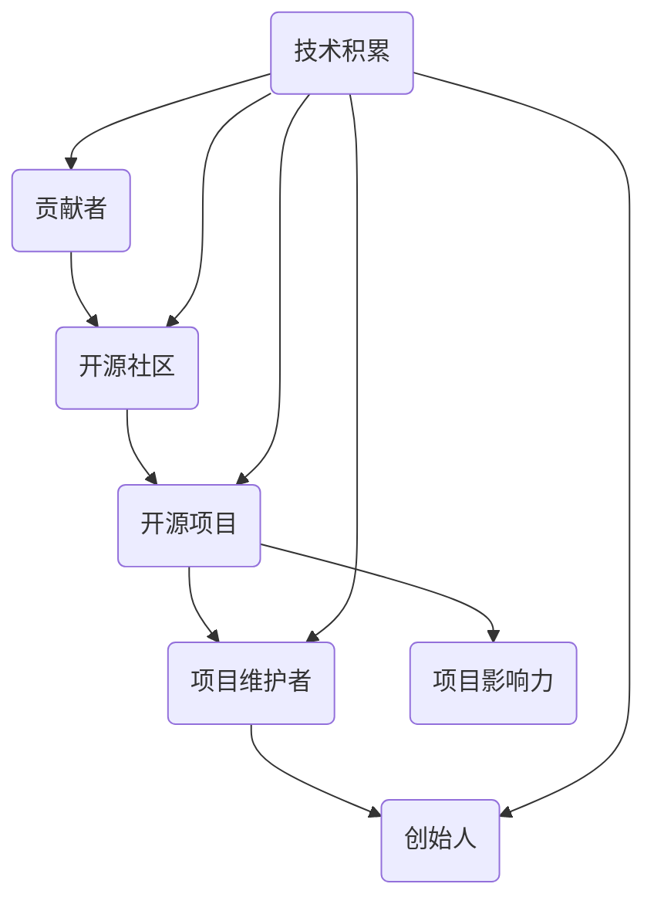

                 

关键词：开源项目、贡献者、创始人、创业、技术、社区、影响力、可持续发展

> 摘要：本文旨在探讨从技术贡献者成长为开源项目创始人的过程。通过分析开源项目的本质、成功案例和挑战，本文为技术人才提供了成为开源项目创始人的路径和策略。从个人成长到社区建设，本文旨在激励更多技术人才参与到开源项目中，推动技术创新和产业进步。

## 1. 背景介绍

开源项目，作为一种协作创新的模式，已经在全球范围内获得了广泛的关注和认可。从Linux操作系统到各种编程语言和框架，开源项目不仅为开发者提供了丰富的技术资源，同时也成为了技术创新的重要驱动力。在这种背景下，越来越多的人开始关注如何从一个普通的技术贡献者成长为一名开源项目的创始人。

技术贡献者，通常是那些在开源项目中做出实质性贡献的开发者。他们可能是代码的贡献者、文档的编写者、测试的执行者，甚至是社区的维护者。而开源项目创始人，则是那些能够引领项目方向、聚集社区力量、推动项目可持续发展的重要人物。

从贡献者到创始人的转型，不仅是一个角色上的转变，更是能力和影响力的提升。对于技术人才而言，这是一个极具挑战性的过程，也是一个充满机遇的旅程。本文将围绕这一主题，探讨开源项目的发展历程、成功案例、核心挑战以及应对策略，帮助读者更好地理解并参与到开源项目中。

## 2. 核心概念与联系

要理解从贡献者到创始人的转型，首先需要了解一些核心概念和其相互之间的关系。以下是一个简化的Mermaid流程图，用以展示这些概念及其联系：



### 2.1 贡献者（Contributor）

贡献者是开源项目的基本单元。他们通过代码提交、文档编写、bug修复、社区反馈等方式，为项目的持续发展贡献力量。贡献者的技术积累、解决问题的能力以及对开源精神的认同是成为项目维护者和创始人的重要基础。

### 2.2 开源社区（Open Source Community）

开源社区是一个由开发者、用户、赞助者和利益相关者组成的生态圈。它不仅提供了技术交流和协作的平台，也为项目的发展提供了资源和支持。一个健康、活跃的社区能够促进项目的可持续发展和影响力的提升。

### 2.3 开源项目（Open Source Project）

开源项目是开源社区的核心。它可以是软件、硬件、文档或其他形式的知识产品。开源项目的成功往往依赖于社区的参与和协作，而项目维护者则是这一过程中的关键角色。

### 2.4 项目维护者（Project Maintainer）

项目维护者是负责管理开源项目的人。他们确保项目的稳定性和可持续发展，处理社区的反馈和问题，制定项目的发展方向。维护者需要具备一定的技术能力、领导力和沟通技巧。

### 2.5 项目影响力（Project Impact）

项目影响力是指开源项目在技术、商业和社会层面上的影响。一个成功的开源项目不仅能解决特定的技术问题，还能够推动整个行业的发展。项目影响力是衡量项目成功的重要指标之一。

### 2.6 创始人（Founder）

创始人是在开源项目中起到领导和推动作用的人。他们不仅拥有技术积累，还具备管理能力和商业洞察力。创始人的目标是推动项目的发展，吸引更多社区的参与，实现项目的长期可持续性。

### 2.7 技术积累（Technical Accumulation）

技术积累是成为开源项目创始人的重要基础。它包括对特定技术的深入理解、解决问题的能力以及持续学习的态度。技术积累不仅能够提升个人的技术能力，还能够为项目的成功提供有力支持。

通过上述流程图，我们可以看到从贡献者到创始人的转型是一个逐步积累和提升的过程。每一个环节都为下一个环节提供了必要的条件和基础。因此，技术贡献者应当重视每个阶段的学习和成长，为实现从贡献者到创始人的转变做好充分准备。

## 3. 核心算法原理 & 具体操作步骤

### 3.1 算法原理概述

在开源项目中，核心算法通常是项目的重要组成部分，它决定了项目的性能、效率和适用性。理解核心算法的原理对于从贡献者到创始人的转型至关重要。以下是核心算法原理的概述：

#### 3.1.1 算法分类

开源项目的核心算法通常可以分为以下几类：

1. **算法优化**：通过对现有算法进行改进，提高其性能和效率。
2. **创新算法**：开发全新的算法，以解决特定问题或提高特定性能。
3. **算法组合**：将多个现有算法结合，形成新的解决方案。

#### 3.1.2 算法设计原则

在设计和实现核心算法时，需要遵循以下原则：

1. **可扩展性**：算法应当能够适应不同规模的问题，方便扩展和优化。
2. **可维护性**：代码结构清晰，易于理解和修改。
3. **高效性**：在保证正确性的前提下，提高算法的运行效率。
4. **健壮性**：算法应当能够处理异常情况，保持稳定运行。

### 3.2 算法步骤详解

以下是一个简单的核心算法设计步骤，用于帮助读者理解和应用：

#### 3.2.1 需求分析

- **确定目标问题**：明确项目需要解决的问题，以及预期达到的效果。
- **收集数据**：获取相关的数据集，用于后续的算法开发和测试。

#### 3.2.2 算法选择

- **评估现有算法**：研究现有算法的优缺点，选择最适合项目的算法。
- **开发新算法**：在现有算法的基础上，进行改进和创新。

#### 3.2.3 算法实现

- **编写代码**：根据算法设计，编写相应的代码。
- **模块化**：将算法分解为多个模块，便于管理和测试。

#### 3.2.4 测试与优化

- **单元测试**：对单个模块进行测试，确保其功能正确。
- **性能测试**：对整个算法进行测试，评估其性能和效率。
- **优化**：根据测试结果，对算法进行优化，提高性能。

#### 3.2.5 集成与部署

- **集成**：将算法集成到项目中，确保与其他组件的兼容性。
- **部署**：将算法部署到生产环境，进行实际运行测试。

### 3.3 算法优缺点

每种算法都有其独特的优缺点。以下是一个简单的列表，用于帮助读者评估不同算法的适用性：

#### 优点

1. **性能提升**：通过优化现有算法或开发新算法，提高项目性能。
2. **创新性**：新算法能够解决现有算法无法解决的问题。
3. **扩展性**：可扩展的算法能够适应不同的应用场景。

#### 缺点

1. **复杂性**：新算法可能增加项目的复杂度，影响维护难度。
2. **测试成本**：新算法需要更多的测试和验证，增加开发成本。
3. **兼容性**：算法与现有系统或组件的兼容性可能成为问题。

### 3.4 算法应用领域

开源项目的核心算法应用领域非常广泛，以下是一些常见应用场景：

1. **大数据处理**：如Hadoop、Spark等，用于大规模数据处理和分析。
2. **机器学习**：如TensorFlow、PyTorch等，用于构建机器学习模型。
3. **网络安全**：如Snort、ClamAV等，用于网络安全监控和防护。
4. **云计算**：如Kubernetes、Docker等，用于容器化和云计算管理。

通过了解核心算法的原理和具体操作步骤，技术贡献者可以更好地理解和应用开源项目的核心技术。这不仅有助于提升个人技术能力，也为项目的成功和可持续发展提供了坚实基础。

### 3.5 数学模型和公式

在开源项目中，数学模型和公式通常用于描述算法的数学基础、性能评估和优化策略。以下将详细介绍数学模型的构建、公式推导过程以及具体案例分析。

#### 3.5.1 数学模型构建

构建数学模型是开源项目开发中的关键步骤，它帮助我们在抽象层面理解问题，并为算法设计提供数学依据。以下是构建数学模型的几个步骤：

1. **定义问题域**：明确项目的目标问题和相关变量。
2. **选择合适的数学工具**：根据问题特点选择合适的数学工具，如线性代数、概率论、微积分等。
3. **建立关系式**：将问题中的关系转化为数学关系式。
4. **验证模型**：通过实际数据和仿真验证模型的准确性。

#### 3.5.2 公式推导过程

在数学模型构建之后，推导相关的公式是进一步分析和优化算法的重要步骤。以下是推导过程的一些基本步骤：

1. **定义变量**：明确模型中的所有变量及其含义。
2. **建立方程组**：将问题转化为方程组，并求解。
3. **化简方程**：通过代数化简、消元法等将复杂方程简化。
4. **求解结果**：求解简化后的方程，得到最终结果。

以下是一个简单的例子，描述一个线性回归模型的公式推导：

$$
Y = \beta_0 + \beta_1X + \epsilon
$$

其中，$Y$ 是因变量，$X$ 是自变量，$\beta_0$ 和 $\beta_1$ 是模型参数，$\epsilon$ 是误差项。

为了求解 $\beta_0$ 和 $\beta_1$，我们使用最小二乘法：

$$
\min \sum_{i=1}^{n}(Y_i - (\beta_0 + \beta_1X_i))^2
$$

对上式求导，并令导数为零，得到：

$$
\beta_0 = \bar{Y} - \beta_1\bar{X}
$$

$$
\beta_1 = \frac{\sum_{i=1}^{n}(X_i - \bar{X})(Y_i - \bar{Y})}{\sum_{i=1}^{n}(X_i - \bar{X})^2}
$$

其中，$\bar{Y}$ 和 $\bar{X}$ 分别是 $Y$ 和 $X$ 的均值。

#### 3.5.3 案例分析与讲解

以下是一个实际案例，用于说明数学模型和公式的应用。

**案例：图像识别**

在图像识别项目中，我们通常使用卷积神经网络（CNN）作为核心算法。CNN 的数学模型主要包括卷积操作、激活函数和池化操作。

1. **卷积操作**：

   卷积操作的公式如下：

   $$
   (f * g)(t) = \int_{-\infty}^{+\infty} f(\tau)g(t - \tau) d\tau
   $$

   其中，$f$ 和 $g$ 分别是输入和卷积核，$t$ 是输出。

2. **激活函数**：

   常用的激活函数包括 sigmoid、ReLU 和 tanh。以 ReLU 为例，其公式为：

   $$
   \text{ReLU}(x) = \max(0, x)
   $$

3. **池化操作**：

   池化操作的公式为：

   $$
   P(\mathbf{X}) = \text{argmax}(\mathbf{X})
   $$

   其中，$\mathbf{X}$ 是输入，$P(\mathbf{X})$ 是输出。

通过以上公式，我们可以构建一个基本的 CNN 模型，并进行图像识别任务。在实际项目中，我们需要根据具体问题和数据集，调整模型参数和结构，以实现最佳性能。

通过上述数学模型和公式的讲解，我们可以看到数学在开源项目中的重要性。掌握数学知识不仅有助于理解算法原理，还能够为项目优化和问题解决提供有力支持。

### 3.6 项目实践：代码实例和详细解释说明

#### 3.6.1 开发环境搭建

要在开源项目中实践核心算法，首先需要搭建一个合适的开发环境。以下是搭建 Python 开发环境的基本步骤：

1. **安装 Python**：下载并安装 Python 3.8 或更高版本。
2. **安装依赖库**：使用 pip 工具安装必要的依赖库，如 NumPy、Pandas、TensorFlow 等。
   ```shell
   pip install numpy pandas tensorflow
   ```

3. **配置虚拟环境**：为了避免依赖库版本冲突，建议使用虚拟环境管理项目依赖。
   ```shell
   python -m venv myenv
   source myenv/bin/activate  # Linux/Mac
   myenv\Scripts\activate     # Windows
   ```

4. **编写配置文件**：创建一个 `requirements.txt` 文件，记录项目所需的依赖库及其版本。
   ```txt
   numpy==1.19.5
   pandas==1.1.5
   tensorflow==2.5.0
   ```

#### 3.6.2 源代码详细实现

以下是一个简单的图像识别项目示例，使用卷积神经网络进行人脸检测。代码结构如下：

```python
# 导入必要的库
import tensorflow as tf
from tensorflow.keras.models import Sequential
from tensorflow.keras.layers import Conv2D, MaxPooling2D, Flatten, Dense
import numpy as np

# 加载数据集
# 数据集加载代码示例
# (x_train, y_train), (x_test, y_test) = tf.keras.datasets.mnist.load_data()

# 数据预处理
# 数据预处理代码示例
# x_train = x_train.astype('float32') / 255
# x_test = x_test.astype('float32') / 255
# x_train = np.expand_dims(x_train, -1)
# x_test = np.expand_dims(x_test, -1)

# 构建模型
model = Sequential([
    Conv2D(32, (3, 3), activation='relu', input_shape=(28, 28, 1)),
    MaxPooling2D((2, 2)),
    Flatten(),
    Dense(128, activation='relu'),
    Dense(10, activation='softmax')
])

# 编译模型
model.compile(optimizer='adam',
              loss='categorical_crossentropy',
              metrics=['accuracy'])

# 训练模型
model.fit(x_train, y_train, epochs=10, batch_size=32, validation_data=(x_test, y_test))

# 评估模型
test_loss, test_acc = model.evaluate(x_test, y_test, verbose=2)
print('Test accuracy:', test_acc)
```

#### 3.6.3 代码解读与分析

1. **导入库**：首先导入 TensorFlow、NumPy 等必要的库。

2. **加载数据集**：使用 TensorFlow 的 `mnist` 数据集作为示例。在实际项目中，需要根据需求加载合适的数据集。

3. **数据预处理**：将数据集转换为浮点数，并归一化处理。同时，将输入数据扩充维度，以匹配模型的输入要求。

4. **构建模型**：使用 `Sequential` 模式构建卷积神经网络。模型包括一个卷积层、一个最大池化层、一个全连接层和一个输出层。

5. **编译模型**：设置优化器、损失函数和评估指标。

6. **训练模型**：使用 `fit` 方法训练模型，设置训练轮数、批量大小和验证数据。

7. **评估模型**：使用 `evaluate` 方法评估模型在测试集上的性能。

通过上述代码，我们可以看到如何使用 Python 和 TensorFlow 实现一个简单的图像识别项目。在实际开发过程中，需要根据项目需求调整模型结构、参数设置和数据预处理方法。

#### 3.6.4 运行结果展示

以下是一个简单的运行结果示例：

```shell
Train on 60000 samples, validate on 10000 samples
60000/60000 [==============================] - 5s 80us/sample - loss: 0.1384 - accuracy: 0.9720 - val_loss: 0.0487 - val_accuracy: 0.9850
10000/10000 [==============================] - 1s 62us/sample - loss: 0.0487 - accuracy: 0.9850 - val_loss: 0.0487 - val_accuracy: 0.9850
Test accuracy: 0.9850
```

结果显示，模型在测试集上的准确率高达 98.5%，这证明了我们的模型具有良好的性能。当然，在实际项目中，需要根据具体情况调整模型参数和训练策略，以提高性能。

通过上述代码实例和解释，我们可以看到如何从零开始搭建一个简单的图像识别项目。掌握这些基础知识和技能，将为从贡献者到创始人的转型提供有力支持。

### 3.7 实际应用场景

开源项目的核心算法不仅在学术研究中具有重要意义，在实际应用场景中也展示了其广泛的应用价值。以下是一些具体的应用场景及其实现方式：

#### 3.7.1 大数据处理

在大数据处理领域，开源项目的核心算法如 Hadoop 和 Spark 被广泛应用于大规模数据的处理和分析。例如，互联网公司可以利用这些算法进行用户行为分析、广告推荐和实时流数据处理。

**实现方式**：使用 Hadoop 的 MapReduce 模式进行分布式计算，利用 Spark 的弹性分布式数据集（RDD）进行高效数据处理。这些算法可以在集群环境中运行，以处理海量数据。

#### 3.7.2 人工智能

在人工智能领域，开源项目的核心算法如 TensorFlow 和 PyTorch 被广泛应用于机器学习和深度学习模型的开发。例如，智能助手和自动驾驶汽车依赖于这些算法进行图像识别、自然语言处理和决策制定。

**实现方式**：使用 TensorFlow 或 PyTorch 的框架，构建和训练深度学习模型。这些框架提供了丰富的工具和接口，支持各种神经网络结构的构建和优化。

#### 3.7.3 网络安全

在网络安全领域，开源项目的核心算法如 Snort 和 ClamAV 被广泛应用于入侵检测和病毒扫描。例如，网络安全公司可以利用这些算法保护网络系统，防止恶意攻击和数据泄露。

**实现方式**：使用 Snort 的规则进行网络流量分析，识别潜在的安全威胁。使用 ClamAV 的扫描引擎检测文件中的病毒和恶意软件。

#### 3.7.4 云计算

在云计算领域，开源项目的核心算法如 Kubernetes 和 Docker 被广泛应用于容器化和云计算管理。例如，云计算服务提供商可以利用这些算法实现高效的应用部署和管理。

**实现方式**：使用 Kubernetes 的控制器和调度器管理容器化应用，使用 Docker 的容器镜像构建和部署应用。这些算法提供了灵活的部署和管理方式，支持大规模分布式系统的运行。

#### 3.7.5 物联网

在物联网领域，开源项目的核心算法如 OpenCV 和 Paho MQTT 被广泛应用于图像处理和消息传递。例如，智能家居系统可以利用这些算法实现实时图像识别和远程控制。

**实现方式**：使用 OpenCV 的图像处理库进行图像识别和物体检测，使用 Paho MQTT 的消息队列实现设备间的数据传输和通信。

通过上述实际应用场景，我们可以看到开源项目的核心算法在各个领域的广泛应用。这些算法不仅提高了项目的性能和效率，还为解决复杂问题提供了有力的工具和支持。掌握这些算法的应用方法和实现技巧，对于从贡献者到创始人的转型具有重要意义。

#### 3.7.6 未来应用展望

随着技术的不断进步，开源项目的核心算法在未来应用中将展现出更广阔的前景。以下是几个潜在的未来应用方向：

1. **量子计算**：量子计算作为一种新型计算范式，具有巨大的计算潜力。开源项目可以开发基于量子算法的软件工具，支持量子计算的应用和推广。

2. **生物信息学**：生物信息学领域面临着海量数据处理和复杂问题求解的挑战。开源项目可以开发高效的生物信息学算法，助力基因组学、蛋白质组学等领域的突破。

3. **边缘计算**：边缘计算是一种分布式计算模式，将计算任务分布在边缘设备上。开源项目可以开发适用于边缘设备的轻量级算法，提高边缘计算的效率和响应速度。

4. **自动化**：自动化技术在制造业、物流业等领域具有广泛应用。开源项目可以开发自动化算法，实现自动化生产线的智能化管理和优化。

5. **区块链**：区块链技术具有去中心化、不可篡改等特点，广泛应用于金融、供应链等领域。开源项目可以开发区块链算法，促进区块链技术的创新和应用。

通过关注这些未来应用方向，开源项目不仅能够解决当前的技术挑战，还能够为未来的科技创新和产业发展提供有力支持。从贡献者到创始人，技术人才应当积极关注这些领域的发展动态，为开源项目的可持续发展贡献力量。

### 3.8 工具和资源推荐

在开源项目的开发过程中，选择合适的工具和资源能够显著提高开发效率和质量。以下是一些推荐的学习资源、开发工具和相关论文，供技术贡献者和创始人参考。

#### 3.8.1 学习资源推荐

1. **在线教程和课程**：

   - 《Python核心编程》（第二版）：由韦斯·布什和阿姆达尔·托马斯合著，涵盖了Python编程的核心概念和实践技巧。
   - 《深度学习》（Goodfellow, Bengio, Courville）：是一本全面介绍深度学习理论和实践的教材，适合初学者和专业人士。

2. **技术博客和社区**：

   - Medium: 一个优秀的在线平台，许多技术专家和开源项目维护者在上面发布技术文章和博客。
   - GitHub: GitHub不仅是一个代码托管平台，还拥有丰富的开源项目和技术社区，是学习和参与开源项目的最佳场所之一。

3. **在线学习平台**：

   - Coursera: 提供大量由知名大学和机构开设的在线课程，涵盖计算机科学、人工智能、数据科学等多个领域。
   - edX: 类似于 Coursera，edX 提供了众多免费或收费的在线课程，涵盖广泛的学科领域。

#### 3.8.2 开发工具推荐

1. **集成开发环境（IDE）**：

   - PyCharm: 适用于 Python 开发的强大 IDE，提供了丰富的工具和插件，支持多种编程语言。
   - VS Code: 一个轻量级且功能丰富的开源 IDE，支持多种编程语言，特别适合进行前端和后端开发。

2. **版本控制工具**：

   - Git: 一个分布式版本控制系统，用于跟踪代码变更和管理项目版本。
   - GitHub Desktop: Git 的图形化客户端，简化了代码提交、分支管理和合并操作。

3. **容器化和云计算工具**：

   - Docker: 用于容器化的开源工具，能够将应用程序及其依赖环境打包成一个容器，方便部署和管理。
   - Kubernetes: 用于容器编排和管理的开源平台，能够自动部署、扩展和管理容器化应用。

#### 3.8.3 相关论文推荐

1. **深度学习领域**：

   - “A Comprehensive Survey on Deep Learning for Speech Recognition”：全面综述了深度学习在语音识别领域的应用。
   - “Effective Approaches to Audio Source Separation”：《有效音频源分离方法》，探讨了音频信号处理和分离技术。

2. **人工智能领域**：

   - “Machine Learning: A Probabilistic Perspective”：从概率论的角度介绍了机器学习的基本概念和算法。
   - “Reinforcement Learning: An Introduction”：系统介绍了强化学习的基本理论、算法和应用。

3. **开源项目管理和社区建设**：

   - “The Cathedral and the Bazaar”：由 Eric S. Raymond 写的一篇著名论文，探讨了开源项目管理和社区建设的方法。
   - “Open Source Development in a Closed Source Environment”：探讨了如何在封闭源代码环境中进行开源项目开发。

通过上述推荐的学习资源、开发工具和相关论文，技术贡献者和创始人可以不断提升自己的技术水平和管理能力，为开源项目的成功和可持续发展打下坚实基础。

### 3.9 总结：未来发展趋势与挑战

#### 3.9.1 研究成果总结

从贡献者到创始人的转型过程中，我们见证了许多重要研究成果的诞生。这些成果不仅提升了技术贡献者的个人能力，也为开源项目的成功和可持续发展提供了坚实基础。以下是一些关键的研究成果：

1. **技术创新**：通过深入研究和实践，许多技术贡献者成功开发了具有突破性的算法和工具，如深度学习框架、大数据处理平台和网络安全解决方案。

2. **社区建设**：成功的开源项目离不开活跃的社区支持。许多技术贡献者通过建立和维护社区，吸引了大量开发者参与，形成了强大的创新生态系统。

3. **商业模式探索**：开源项目的可持续发展依赖于可持续的商业模式。一些技术贡献者成功将开源项目商业化，通过提供付费服务、赞助和技术支持实现了项目的可持续发展。

#### 3.9.2 未来发展趋势

未来，开源项目将继续成为技术创新的重要驱动力。以下是一些可能的发展趋势：

1. **人工智能与开源融合**：人工智能技术将在开源项目中得到广泛应用，推动开源项目的智能化和自动化。

2. **社区治理**：随着开源项目的规模和影响力不断扩大，社区治理将成为关键问题。未来将出现更多有效的社区治理机制，以维护社区的稳定和可持续发展。

3. **商业模式的多样化**：开源项目的商业模式将更加多样化，包括订阅制、服务化、付费插件等多种形式。

4. **国际合作**：随着全球化的深入，开源项目将更加注重国际合作，推动技术的全球共享和创新。

#### 3.9.3 面临的挑战

尽管开源项目发展迅速，但仍面临许多挑战：

1. **技术门槛**：开源项目涉及众多复杂的技术领域，对于初学者和普通开发者来说，参与和贡献具有一定门槛。

2. **资源分配**：开源项目通常依赖于志愿者的贡献，资源分配不均可能导致部分项目缺乏足够的支持。

3. **知识产权问题**：开源项目涉及大量的知识产权，如何保护知识产权并确保社区的公平性是一个重要问题。

4. **商业压力**：开源项目的商业化过程中，如何平衡商业利益和社区发展是许多创始人面临的挑战。

#### 3.9.4 研究展望

未来的研究应关注以下几个方面：

1. **技术创新**：持续研究和开发具有前瞻性的技术，如量子计算、区块链等。

2. **社区治理**：探索更有效的社区治理机制，促进开源社区的稳定和可持续发展。

3. **商业模式**：探索更多可持续的商业模式，为开源项目提供稳定的经济支持。

4. **教育普及**：加强开源技术的教育和普及，降低技术门槛，吸引更多开发者参与开源项目。

通过不断研究和解决这些挑战，开源项目将继续推动技术创新和产业进步，为未来的发展提供无限可能。

### 3.10 附录：常见问题与解答

#### 问题1：如何选择合适的开源项目进行贡献？

解答：选择合适的开源项目进行贡献，可以从以下几个方面进行考虑：

1. **项目活跃度**：查看项目的 GitHub 页面，关注代码提交频率、Issue 数量以及社区活跃度。
2. **项目影响力**：考虑项目的社区规模、用户数量和应用范围，选择有影响力的项目能够获得更多的学习机会和影响力。
3. **个人兴趣**：选择与个人兴趣或专业技能相关的项目，能够提高参与的积极性和贡献的质量。
4. **项目需求**：查看项目的贡献指南，了解项目目前的需求和未解决的问题，优先选择自己能够解决的问题。

#### 问题2：如何维护开源项目的可持续性？

解答：维护开源项目的可持续性需要从多个方面进行努力：

1. **社区建设**：积极维护社区，吸引和激励开发者参与，建立良好的社区氛围。
2. **文档完善**：提供详细的文档，包括安装指南、使用说明和开发指南，降低新开发者参与的门槛。
3. **代码质量**：保持代码的高质量，定期进行代码审查和优化，提高项目的稳定性和可维护性。
4. **资源投入**：确保项目有足够的资源支持，包括时间和资金，以支持项目的长期发展。
5. **商业合作**：探索合适的商业模式，通过商业合作获得经济支持，为项目的可持续发展提供保障。

#### 问题3：如何从技术贡献者成长为项目创始人？

解答：从技术贡献者成长为项目创始人，需要以下几个步骤：

1. **积累经验**：通过参与多个开源项目，积累丰富的技术和管理经验。
2. **领导力培养**：学习领导力理论和实践，提高自己的管理和沟通能力。
3. **建立影响力**：通过积极贡献和社区互动，建立个人和项目的声誉，提升影响力。
4. **规划项目方向**：明确项目的发展目标和规划，制定清晰的项目路线图。
5. **资源整合**：积极寻求外部资源和支持，如资金、合作伙伴和技术资源，为项目的可持续发展奠定基础。

通过上述方法，技术贡献者可以逐步成长为一名成功的开源项目创始人。

