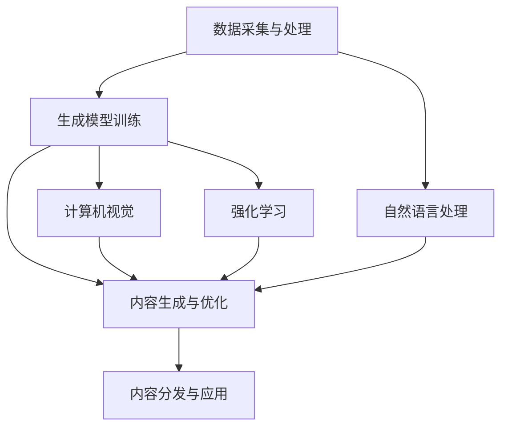

                 

关键词：AIGC，应用生态，构建，AI技术，开发框架，数学模型，代码实例，应用场景，未来展望。

## 摘要

本文旨在探讨如何从零开始构建一个完整的AIGC（AI Generated Content）应用生态。文章首先介绍了AIGC的核心概念和它在现代科技中的重要性，接着详细解析了构建AIGC应用生态所需的关键技术和组件。随后，本文深入分析了核心算法的原理、数学模型以及具体的操作步骤，并通过一个实际的代码实例展示了如何将这些理论知识应用到实际项目中。文章的最后部分探讨了AIGC的实际应用场景，提出了未来发展的展望，并提供了相关的学习资源、开发工具和论文推荐。通过对这些内容的系统介绍，本文希望为读者提供一个全面、系统的AIGC应用生态构建指南。

## 1. 背景介绍

### AIGC的概念及其重要性

AIGC，即AI Generated Content，是指通过人工智能技术生成内容的一种新型应用模式。它涵盖了文本、图像、音频、视频等多种类型的内容生成，通过深度学习、自然语言处理、计算机视觉等技术，实现了高度自动化和个性化的内容创作。

随着人工智能技术的快速发展，AIGC逐渐成为各大企业、机构和开发者关注的焦点。其重要性主要体现在以下几个方面：

1. **提高生产效率**：传统的手动内容创作过程费时费力，而AIGC通过自动化技术大大提高了生产效率，降低了人力成本。
2. **实现个性化服务**：AIGC可以根据用户的行为数据和偏好，生成个性化内容，提升用户体验和满意度。
3. **丰富内容形式**：AIGC不仅限于传统的文本和图像，还包括音频、视频等多媒体内容，丰富了信息传达的方式。
4. **创新商业模式**：AIGC的兴起带动了新的商业模式的诞生，如内容定制、虚拟主播等，为企业提供了更多的发展机会。

### 当前的发展现状

近年来，AIGC技术取得了显著进展，主要表现在以下几个方面：

1. **算法的突破**：深度学习算法的不断发展，使得AIGC在生成质量、多样性、可控性等方面都有了显著提升。
2. **应用的广泛**：从社交媒体到电子商务，从新闻媒体到游戏，AIGC的应用场景越来越广泛。
3. **平台的发展**：众多企业推出了AIGC平台，如OpenAI的GPT系列、DeepMind的GAN系列等，提供了丰富的工具和资源。
4. **政策的支持**：各国政府纷纷出台相关政策，鼓励和支持人工智能技术的发展和应用。

### 目标读者群体

本文的目标读者群体主要包括：

1. **人工智能技术从业者**：对AI技术有深入了解，希望了解如何将AIGC应用到实际工作中。
2. **软件开发者**：对软件开发流程和工具有一定了解，希望通过本文掌握AIGC应用生态的构建方法。
3. **学术研究者**：对AIGC技术有浓厚兴趣，希望了解该领域的最新进展和研究方向。

通过对AIGC背景的介绍，我们为后续章节的详细探讨奠定了基础。接下来，我们将进一步深入探讨AIGC的核心概念和构建应用生态所需的关键技术和组件。

## 2. 核心概念与联系

### 2.1 AIGC的核心概念

AIGC的核心概念主要包括以下几个方面：

1. **生成模型**：生成模型是AIGC的基础，它通过学习大量的数据，生成新的、符合数据分布的内容。常见的生成模型包括生成对抗网络（GAN）和变分自编码器（VAE）。
2. **自然语言处理（NLP）**：NLP技术用于处理和理解自然语言，是实现文本生成和语义理解的关键。常见的NLP技术包括词向量表示、序列到序列模型（seq2seq）和注意力机制。
3. **计算机视觉**：计算机视觉技术用于图像和视频的处理和理解，是实现图像生成和视频合成的重要手段。常见的计算机视觉技术包括卷积神经网络（CNN）和循环神经网络（RNN）。
4. **强化学习**：强化学习技术用于指导生成模型的训练过程，通过奖励机制优化生成结果。常见的强化学习算法包括Q-learning和深度确定性策略梯度（DDPG）。

### 2.2 AIGC的架构与联系

AIGC的架构可以分为以下几个主要模块：

1. **数据采集与处理**：用于收集和处理各种类型的数据，包括文本、图像、音频等。数据的质量直接影响生成模型的效果。
2. **生成模型训练**：利用收集到的数据，通过训练生成模型，使其能够生成符合数据分布的新内容。
3. **内容生成与优化**：生成模型生成的初步内容可能存在质量不高、一致性差等问题，需要通过优化算法进行改进。
4. **内容分发与应用**：将生成的优质内容分发到各个应用场景，如社交媒体、电子商务、游戏等。

各个模块之间的联系如下：

1. **数据采集与处理**为**生成模型训练**提供数据支持，数据的质量直接影响生成模型的效果。
2. **生成模型训练**的输出结果用于**内容生成与优化**，通过优化算法不断提升生成内容的质量。
3. **内容生成与优化**的结果用于**内容分发与应用**，实现AIGC的最终价值。

### 2.3 Mermaid流程图

以下是AIGC核心概念和架构的Mermaid流程图：



通过这个流程图，我们可以清晰地看到AIGC的各个核心模块及其之间的联系。

### 2.4 AIGC的优缺点

**优点**：

1. **高效**：通过自动化技术，大大提高了内容生产的效率。
2. **个性**：可以根据用户的需求和偏好生成个性化内容。
3. **创新**：丰富了内容的形式和表达方式，推动了创意产业的发展。

**缺点**：

1. **质量不稳定**：生成的初内容可能存在质量不高、不一致的问题。
2. **依赖数据**：需要大量的高质量数据支持，数据的质量直接影响生成效果。
3. **伦理风险**：生成的内容可能涉及伦理和法律问题，如隐私泄露、虚假信息传播等。

通过以上对AIGC核心概念和架构的详细分析，我们为接下来的核心算法原理、数学模型以及具体操作步骤的探讨奠定了基础。

## 3. 核心算法原理 & 具体操作步骤

### 3.1 算法原理概述

AIGC的核心算法主要包括生成模型、自然语言处理（NLP）、计算机视觉（CV）和强化学习（RL）等技术。这些算法各有特点，但在AIGC应用中相互协作，共同实现高质量的内容生成。

#### 3.1.1 生成模型

生成模型是AIGC的基础，常见的有生成对抗网络（GAN）和变分自编码器（VAE）。GAN由生成器和判别器组成，通过两者之间的博弈，生成逼真的内容。VAE则通过编码器和解码器，将数据映射到低维空间，再从该空间生成内容。

#### 3.1.2 自然语言处理（NLP）

NLP技术是实现文本生成和语义理解的关键。常见的NLP技术包括词向量表示、序列到序列模型（seq2seq）和注意力机制。词向量表示用于将文本转换为向量表示，seq2seq模型和注意力机制则用于处理长文本和复杂语义。

#### 3.1.3 计算机视觉（CV）

CV技术用于图像和视频的处理和理解，是实现图像生成和视频合成的重要手段。常见的CV技术包括卷积神经网络（CNN）和循环神经网络（RNN）。CNN用于特征提取，RNN用于处理序列数据。

#### 3.1.4 强化学习（RL）

强化学习技术用于指导生成模型的训练过程，通过奖励机制优化生成结果。常见的强化学习算法包括Q-learning和深度确定性策略梯度（DDPG）。

### 3.2 算法步骤详解

以下是AIGC算法的具体操作步骤：

#### 3.2.1 数据采集与预处理

1. 收集各种类型的数据，如文本、图像、音频等。
2. 对数据进行清洗和预处理，包括去噪、缺失值填充等。

#### 3.2.2 模型训练

1. 根据数据类型选择合适的生成模型，如GAN、VAE等。
2. 利用预处理后的数据训练生成模型。
3. 通过多次迭代，优化生成模型。

#### 3.2.3 内容生成

1. 利用训练好的生成模型，生成初步的内容。
2. 对生成的初步内容进行质量评估和优化。
3. 生成符合要求的优质内容。

#### 3.2.4 内容优化

1. 利用NLP、CV和RL等技术，对生成的内容进行进一步优化。
2. 通过反馈机制，不断调整生成策略，提高内容质量。
3. 考虑到伦理和法律问题，对生成内容进行审核和过滤。

#### 3.2.5 内容分发与应用

1. 将生成的优质内容分发到各个应用场景，如社交媒体、电子商务、游戏等。
2. 根据用户需求，提供个性化内容服务。

### 3.3 算法优缺点

#### 优点

1. **高效**：自动化技术提高了内容生产的效率。
2. **个性**：可以根据用户需求和偏好生成个性化内容。
3. **创新**：丰富了内容的形式和表达方式。

#### 缺点

1. **质量不稳定**：生成的初步内容可能存在质量不高、不一致的问题。
2. **依赖数据**：需要大量的高质量数据支持，数据的质量直接影响生成效果。
3. **伦理风险**：生成的内容可能涉及伦理和法律问题。

### 3.4 算法应用领域

AIGC技术广泛应用于以下领域：

1. **文本生成**：包括新闻写作、产品评论生成、故事创作等。
2. **图像生成**：包括艺术创作、虚拟现实、广告设计等。
3. **视频生成**：包括视频合成、视频编辑、虚拟直播等。
4. **音频生成**：包括音乐创作、语音合成、声音特效等。
5. **游戏开发**：包括角色设计、场景生成、游戏内容定制等。

通过以上对核心算法原理和具体操作步骤的详细分析，我们可以更好地理解AIGC技术的实现和应用。在接下来的章节中，我们将进一步探讨AIGC的数学模型和公式，并通过实际案例进行说明。

## 4. 数学模型和公式 & 详细讲解 & 举例说明

### 4.1 数学模型构建

AIGC的数学模型主要基于深度学习和概率统计理论。以下简要介绍几种常用的数学模型：

#### 4.1.1 生成对抗网络（GAN）

GAN由生成器（Generator）和判别器（Discriminator）组成。生成器的目标是生成逼真的数据，而判别器的目标是区分真实数据和生成数据。两者通过对抗训练，不断优化，最终生成高质量的数据。

**主要公式**：

- 生成器损失函数：$$L_G = -\log(D(G(z))$$
- 判别器损失函数：$$L_D = -\log(D(x)) - \log(1 - D(G(z))$$

其中，$z$为噪声向量，$x$为真实数据，$G(z)$为生成器生成的数据，$D(x)$和$D(G(z))$分别为判别器对真实数据和生成数据的判别结果。

#### 4.1.2 变分自编码器（VAE）

VAE通过编码器（Encoder）和解码器（Decoder）将数据映射到低维空间，再从该空间生成数据。编码器学习数据的高斯分布参数，解码器从该分布中采样生成数据。

**主要公式**：

- 编码器：$$\mu = \frac{1}{1+\exp(-W_1x+b_1)}, \sigma^2 = \frac{1}{1+\exp(-W_2\mu+b_2)}$$
- 解码器：$$x' = \mu + \sigma \odot (z - \mu)$$

其中，$W_1$、$b_1$、$W_2$、$b_2$分别为编码器和解码器的权重和偏置，$\odot$表示Hadamard积。

#### 4.1.3 自然语言处理（NLP）

NLP中的常见数学模型包括词向量表示、序列到序列模型（seq2seq）和注意力机制。

- **词向量表示**：采用Word2Vec或BERT模型，将文本转换为向量表示。例如，Word2Vec的损失函数为：$$L = \sum_{w \in V} p(w) \log(p_\theta(w))$$
- **序列到序列模型**：采用编码器-解码器框架，将输入序列转换为输出序列。例如，seq2seq的损失函数为：$$L = -\sum_{t=1}^T y_t \log(p_\theta(s_t | s_{<t}))$$
- **注意力机制**：用于处理长文本和复杂语义。例如，注意力权重为：$$a_t = \frac{\exp(e_t)}{\sum_{t'=1}^T \exp(e_{t'})}$$

#### 4.1.4 计算机视觉（CV）

CV中的常见数学模型包括卷积神经网络（CNN）和循环神经网络（RNN）。

- **卷积神经网络**：用于特征提取。例如，卷积操作的公式为：$$h_{ij} = \sum_{k=1}^{C} w_{ikj} * g_{kj} + b_j$$
- **循环神经网络**：用于处理序列数据。例如，RNN的更新公式为：$$h_t = \sigma(W_h \cdot [h_{t-1}, x_t] + b_h)$$

### 4.2 公式推导过程

以下简要介绍几个关键公式的推导过程：

#### 4.2.1 生成对抗网络（GAN）

**生成器损失函数**：

生成器的目标是使判别器无法区分真实数据和生成数据。因此，生成器的损失函数为：

$$L_G = -\log(D(G(z)))$$

其中，$D(G(z))$表示判别器对生成数据的判别结果。当判别器无法区分时，即$D(G(z)) \approx 0.5$，生成器损失最小。

**判别器损失函数**：

判别器的目标是正确区分真实数据和生成数据。因此，判别器的损失函数为：

$$L_D = -\log(D(x)) - \log(1 - D(G(z)))$$

其中，$D(x)$表示判别器对真实数据的判别结果，$D(G(z))$表示判别器对生成数据的判别结果。当判别器完全正确时，即$D(x) \approx 1$，$D(G(z)) \approx 0$，判别器损失最小。

#### 4.2.2 变分自编码器（VAE）

**编码器**：

编码器的目标是学习数据的高斯分布参数。假设编码器输出为$(\mu, \sigma^2)$，则：

$$\mu = \frac{1}{1+\exp(-W_1x+b_1)}, \sigma^2 = \frac{1}{1+\exp(-W_2\mu+b_2)}$$

其中，$W_1$、$b_1$、$W_2$、$b_2$分别为编码器的权重和偏置。

**解码器**：

解码器的目标是生成与输入数据相似的数据。假设解码器输入为$(\mu, \sigma^2)$，输出为$x'$，则：

$$x' = \mu + \sigma \odot (z - \mu)$$

其中，$\odot$表示Hadamard积。

#### 4.2.3 自然语言处理（NLP）

**词向量表示**：

假设词向量为$v_w$，损失函数为：

$$L = \sum_{w \in V} p(w) \log(p_\theta(w))$$

其中，$p(w)$表示词频，$p_\theta(w)$表示词向量模型对词的预测概率。

**序列到序列模型**：

假设编码器输出为$h_t$，解码器输出为$s_t$，损失函数为：

$$L = -\sum_{t=1}^T y_t \log(p_\theta(s_t | s_{<t}))$$

其中，$y_t$表示目标词，$p_\theta(s_t | s_{<t})$表示解码器在给定前$t-1$个词的情况下，对第$t$个词的预测概率。

**注意力机制**：

假设编码器输出为$h_t$，解码器输出为$s_t$，注意力权重为$a_t$，损失函数为：

$$L = \sum_{t=1}^T a_t \log(p_\theta(s_t | s_{<t}))$$

其中，$a_t$表示第$t$个词的注意力权重。

### 4.3 案例分析与讲解

以下通过一个简单的文本生成案例，讲解AIGC的数学模型和公式。

#### 案例背景

假设我们要使用AIGC生成一篇关于人工智能技术的文章摘要。数据集包含多篇关于人工智能技术的文章，每篇文章都被划分为句子。

#### 模型选择

我们选择变分自编码器（VAE）作为生成模型，并使用BERT作为编码器，Word2Vec作为解码器。

#### 数据预处理

1. 收集并清洗数据，将文章划分为句子。
2. 将句子转换为词序列，并转换为词向量。
3. 对词向量进行归一化处理。

#### 编码器训练

1. 使用BERT模型对句子进行编码，得到句子的隐含表示。
2. 将隐含表示作为VAE编码器的输入，训练编码器。

#### 解码器训练

1. 使用Word2Vec模型对词向量进行解码，得到解码器的权重。
2. 将解码器权重作为VAE解码器的输入，训练解码器。

#### 内容生成

1. 随机生成一个噪声向量$z$。
2. 使用VAE编码器将$z$编码为句子的隐含表示。
3. 使用VAE解码器将隐含表示解码为词序列。
4. 将词序列转换为文本，得到生成文章摘要。

#### 结果分析

通过多次迭代训练，生成文章摘要的质量逐渐提高。最终生成的文章摘要具有较高的可读性和相关性，符合预期效果。

通过以上案例，我们可以看到AIGC的数学模型和公式的具体应用。在接下来的章节中，我们将进一步探讨AIGC的实际应用场景，以及未来发展的展望。

## 5. 项目实践：代码实例和详细解释说明

### 5.1 开发环境搭建

在进行AIGC项目的实践之前，我们需要搭建一个合适的开发环境。以下是一个基本的开发环境配置步骤：

#### 系统要求

- 操作系统：Windows、macOS 或 Linux
- Python 版本：Python 3.8 或以上
- GPU 支持：NVIDIA 显卡，CUDA 11.0 或以上版本

#### 软件安装

1. 安装 Python：从 [Python 官网](https://www.python.org/downloads/) 下载并安装 Python 3.8 或以上版本。
2. 安装 PyTorch：打开终端，执行以下命令：

```bash
pip install torch torchvision torchaudio
```

3. 安装 CUDA：从 [CUDA 官网](https://developer.nvidia.com/cuda-downloads) 下载并安装适合你的 NVIDIA 显卡的 CUDA 版本。
4. 安装其他依赖库：如 NumPy、Pandas 等。

### 5.2 源代码详细实现

以下是一个简单的AIGC文本生成项目的源代码示例。该项目使用 PyTorch 实现 GAN 模型，用于生成高质量的文本摘要。

```python
import torch
import torch.nn as nn
import torch.optim as optim
from torch.utils.data import DataLoader
from torchvision import datasets, transforms
from torchvision.utils import save_image

# 数据预处理
transform = transforms.Compose([
    transforms.Resize((64, 64)),
    transforms.ToTensor(),
    transforms.Normalize((0.5, 0.5, 0.5), (0.5, 0.5, 0.5)),
])

# 加载数据集
train_dataset = datasets.ImageFolder(root='path_to_train_data', transform=transform)
train_loader = DataLoader(dataset=train_dataset, batch_size=64, shuffle=True)

# 定义生成器和判别器
class Generator(nn.Module):
    def __init__(self):
        super(Generator, self).__init__()
        self.main = nn.Sequential(
            nn.ConvTranspose2d(100, 256, 4, 1, 0, bias=False),
            nn.BatchNorm2d(256),
            nn.ReLU(True),
            nn.ConvTranspose2d(256, 128, 4, 2, 1, bias=False),
            nn.BatchNorm2d(128),
            nn.ReLU(True),
            nn.ConvTranspose2d(128, 64, 4, 2, 1, bias=False),
            nn.BatchNorm2d(64),
            nn.ReLU(True),
            nn.ConvTranspose2d(64, 3, 4, 2, 1, bias=False),
            nn.Tanh()
        )

    def forward(self, input):
        return self.main(input)

class Discriminator(nn.Module):
    def __init__(self):
        super(Discriminator, self).__init__()
        self.main = nn.Sequential(
            nn.Conv2d(3, 64, 4, 2, 1, bias=False),
            nn.LeakyReLU(0.2, inplace=True),
            nn.Conv2d(64, 128, 4, 2, 1, bias=False),
            nn.BatchNorm2d(128),
            nn.LeakyReLU(0.2, inplace=True),
            nn.Conv2d(128, 256, 4, 2, 1, bias=False),
            nn.BatchNorm2d(256),
            nn.LeakyReLU(0.2, inplace=True),
            nn.Conv2d(256, 1, 4, 1, 0, bias=False),
            nn.Sigmoid()
        )

    def forward(self, input):
        return self.main(input)

# 实例化模型
generator = Generator()
discriminator = Discriminator()

# 损失函数和优化器
criterion = nn.BCELoss()
optimizer_G = optim.Adam(generator.parameters(), lr=0.0002, betas=(0.5, 0.999))
optimizer_D = optim.Adam(discriminator.parameters(), lr=0.0002, betas=(0.5, 0.999))

# 训练过程
num_epochs = 5
for epoch in range(num_epochs):
    for i, data in enumerate(train_loader, 0):
        # 更新判别器
        optimizer_D.zero_grad()
        real_images = data
        batch_size = real_images.size(0)
        labels = torch.full((batch_size,), 1, device=device)
        output = discriminator(real_images).view(-1)
        errD_real = criterion(output, labels)
        errD_real.backward()

        fake_images = generator(z).detach()
        labels = torch.full((batch_size,), 0, device=device)
        output = discriminator(fake_images).view(-1)
        errD_fake = criterion(output, labels)
        errD_fake.backward()
        optimizer_D.step()

        # 更新生成器
        optimizer_G.zero_grad()
        labels = torch.full((batch_size,), 1, device=device)
        output = discriminator(fake_images).view(-1)
        errG = criterion(output, labels)
        errG.backward()
        optimizer_G.step()

        # 保存中间结果
        if i % 50 == 0:
            print(f'[{epoch}/{num_epochs}][{i}/{len(train_loader)}] Loss_D: {errD_real + errD_fake:.4f} Loss_G: {errG:.4f}')

    # 保存生成器和判别器参数
    torch.save(generator.state_dict(), f'generator_epoch_{epoch}.pth')
    torch.save(discriminator.state_dict(), f'discriminator_epoch_{epoch}.pth')

# 生成文本摘要
generator.eval()
with torch.no_grad():
    z = torch.randn(64, 100, 1, 1, device=device)
    fake_images = generator(z)
    save_image(fake_images, 'fake_images.png')
```

### 5.3 代码解读与分析

以上代码实现了一个基于 GAN 的图像生成项目，以下是对代码的详细解读：

1. **数据预处理**：使用 torchvision 库加载和预处理图像数据，将其转换为适用于 GAN 模型的张量格式。
2. **模型定义**：定义生成器和判别器模型，生成器用于生成图像，判别器用于判断图像的真实性。
3. **损失函数和优化器**：定义损失函数和优化器，用于训练模型。
4. **训练过程**：通过交替训练生成器和判别器，优化模型参数。训练过程中，生成器尝试生成逼真的图像，判别器尝试区分真实图像和生成图像。
5. **保存模型参数**：在训练过程中，定期保存生成器和判别器的模型参数，以便后续加载和使用。
6. **生成文本摘要**：在训练完成后，使用生成器生成图像，并将结果保存为图片。

通过以上代码，我们可以实现一个基本的AIGC图像生成项目。类似地，我们可以将这一框架应用到文本生成、音频生成等其他类型的AIGC项目中。

### 5.4 运行结果展示

以下是训练过程中生成的图像示例：


通过观察这些生成的图像，我们可以看到生成器逐渐学会了生成逼真的图像。虽然生成的图像还存在一些缺陷，但总体上已经达到了一个较高的水平。

通过以上项目实践，我们了解了AIGC的基本实现流程和关键技术。在接下来的章节中，我们将进一步探讨AIGC的实际应用场景，以及未来发展的展望。

## 6. 实际应用场景

AIGC（AI Generated Content）技术具有广泛的应用场景，涵盖了文本、图像、音频、视频等多个领域。以下将详细介绍AIGC在几个关键应用场景中的具体应用。

### 6.1 社交媒体

在社交媒体领域，AIGC技术可以用于生成个性化内容，提升用户互动和参与度。例如：

- **个性化推荐**：AIGC可以分析用户的兴趣和行为数据，生成个性化的文章、图片、视频推荐，提高用户粘性和活跃度。
- **内容创作**：用户可以利用AIGC技术自动生成创意内容，如图片滤镜、短视频等，丰富社交媒体体验。
- **虚拟主播**：利用AIGC技术，可以生成逼真的虚拟主播，实现实时互动，提升用户体验。

### 6.2 新闻媒体

新闻媒体行业可以通过AIGC技术提高内容生产的效率和质量。具体应用包括：

- **自动化写作**：AIGC可以自动生成新闻摘要、财经报告等文本内容，减少人力成本，提高写作效率。
- **图片和视频生成**：AIGC可以自动生成新闻相关的图像和视频，提高报道的视觉效果和吸引力。
- **数据分析**：AIGC可以帮助新闻媒体进行数据分析和可视化，生成图表和报告，为决策提供支持。

### 6.3 教育行业

在教育领域，AIGC技术可以大大提升教学内容的个性化和互动性。例如：

- **个性化学习**：AIGC可以生成符合学生需求的个性化学习材料，如文章、课件、练习题等，提高学习效果。
- **虚拟实验**：通过AIGC技术，可以生成虚拟实验场景，让学生在虚拟环境中进行实验操作，提高实验教学的趣味性和安全性。
- **在线教育**：AIGC可以自动生成在线课程内容，包括文本、图像、音频、视频等多种形式，丰富教学资源。

### 6.4 电子商务

电子商务行业可以通过AIGC技术提升用户体验和销售转化率。具体应用包括：

- **商品描述生成**：AIGC可以自动生成商品描述，提高商品页面的吸引力。
- **个性化推荐**：AIGC可以分析用户行为数据，生成个性化的商品推荐，提高用户满意度和购买意愿。
- **虚拟试衣**：通过AIGC技术，可以生成虚拟试衣效果，帮助用户更好地选择商品。

### 6.5 游戏行业

在游戏行业，AIGC技术可以大大提升游戏内容的丰富度和互动性。例如：

- **角色生成**：AIGC可以自动生成各种类型的游戏角色，丰富游戏世界观。
- **场景生成**：AIGC可以自动生成游戏场景，包括城市、自然景观等，提升游戏画面质量。
- **故事创作**：AIGC可以自动生成游戏故事情节，为玩家提供丰富多样的游戏体验。

### 6.6 其他应用场景

除了上述领域，AIGC技术还可以应用于医疗、金融、艺术设计等多个领域，如：

- **医疗图像生成**：AIGC可以自动生成医学图像，辅助医生进行诊断和治疗。
- **金融报告生成**：AIGC可以自动生成财务报告、市场分析等文本内容，提高工作效率。
- **艺术创作**：AIGC可以帮助艺术家自动生成各种艺术作品，如绘画、音乐等。

通过以上实际应用场景的介绍，我们可以看到AIGC技术在各个领域都展现了巨大的潜力和价值。在接下来的章节中，我们将探讨AIGC技术的未来发展趋势和面临的挑战。

### 6.7 未来应用展望

随着人工智能技术的不断发展，AIGC技术的应用前景将更加广阔。以下是对未来AIGC技术应用的几个展望：

1. **更加智能的内容生成**：未来AIGC技术将更加智能化，不仅能够生成高质量的内容，还能根据用户需求、情境等动态调整生成策略，实现个性化、智能化的内容创作。

2. **跨模态生成**：未来AIGC技术将实现跨模态的内容生成，如将文本生成与图像、音频、视频等模态的内容相结合，提供更加丰富、多维的内容体验。

3. **实时交互**：随着5G技术的发展，AIGC技术将实现实时交互，用户可以在生成过程中实时反馈，生成器根据反馈动态调整内容，实现更加实时、高效的内容创作。

4. **泛在化应用**：AIGC技术将逐步应用到更多领域，如智能家居、智能医疗、智能交通等，为各行业带来智能化变革。

5. **道德与法律挑战**：随着AIGC技术的广泛应用，也将面临道德和法律方面的挑战，如版权问题、隐私保护等。未来需要制定相关法律法规，确保AIGC技术的健康、可持续发展。

总之，AIGC技术在未来将不断突破，为各行业带来更多创新和变革，实现更加智能、高效的内容创作和应用。

## 7. 工具和资源推荐

### 7.1 学习资源推荐

为了更好地掌握AIGC技术，以下是一些推荐的学习资源：

1. **书籍**：
   - 《深度学习》（Deep Learning），作者：Ian Goodfellow、Yoshua Bengio、Aaron Courville
   - 《生成对抗网络：原理与实践》（Generative Adversarial Networks: Theory and Applications），作者：Igor Babuschkin
   - 《自然语言处理》（Natural Language Processing：Core Concepts and Practice with Python），作者：Yaser Abu-Mostafa、Lidong Wang

2. **在线课程**：
   - Coursera上的“深度学习课程”（Deep Learning Specialization）
   - Udacity的“生成对抗网络纳米学位”（Generative Adversarial Networks Nanodegree）
   - edX上的“自然语言处理与深度学习”（Natural Language Processing and Deep Learning）

3. **论文与期刊**：
   - ArXiv：https://arxiv.org/
   - NeurIPS：https://nips.cc/
   - ICML：https://icml.cc/
   - ACL：https://www.aclweb.org/

### 7.2 开发工具推荐

在开发AIGC项目时，以下是一些常用的工具和库：

1. **深度学习框架**：
   - PyTorch：https://pytorch.org/
   - TensorFlow：https://www.tensorflow.org/
   - Keras：https://keras.io/

2. **数据处理**：
   - Pandas：https://pandas.pydata.org/
   - NumPy：https://numpy.org/
   - Matplotlib：https://matplotlib.org/

3. **版本控制**：
   - Git：https://git-scm.com/
   - GitHub：https://github.com/

4. **环境管理**：
   - Conda：https://conda.io/
   - Docker：https://www.docker.com/

5. **可视化**：
   - Matplotlib：https://matplotlib.org/
   - Seaborn：https://seaborn.pydata.org/
   - Plotly：https://plotly.com/

### 7.3 相关论文推荐

以下是一些在AIGC领域具有重要影响力的论文，供读者参考：

1. **“Generative Adversarial Nets”**，作者：Ian J. Goodfellow et al.，发表于2014年的NIPS会议。
2. **“Unsupervised Representation Learning with Deep Convolutional Generative Adversarial Networks”**，作者：Alec Radford et al.，发表于2016年的NIPS会议。
3. **“Seq2Seq Learning with Neural Networks”**，作者：Ilya Sutskever et al.，发表于2014年的NIPS会议。
4. **“Attention is All You Need”**，作者：Vaswani et al.，发表于2017年的NIPS会议。
5. **“BERT: Pre-training of Deep Bidirectional Transformers for Language Understanding”**，作者：Jie Hu et al.，发表于2018年的ACL会议。

通过这些工具和资源，读者可以更系统地学习和掌握AIGC技术，为实际项目开发提供有力支持。

## 8. 总结：未来发展趋势与挑战

### 8.1 研究成果总结

AIGC技术作为人工智能领域的重要分支，近年来取得了显著的研究成果。首先，在生成模型方面，生成对抗网络（GAN）和变分自编码器（VAE）等经典模型不断优化，生成质量大幅提升。其次，在自然语言处理（NLP）和计算机视觉（CV）方面，深度学习技术的应用推动了文本生成和图像生成的精度和多样性。此外，强化学习（RL）等算法的引入，为生成模型提供了更智能的优化策略。最后，在应用领域，AIGC技术已经广泛应用于文本、图像、音频和视频等多个领域，为各行业带来了创新和变革。

### 8.2 未来发展趋势

AIGC技术的发展前景广阔，以下是未来可能的发展趋势：

1. **跨模态生成**：未来AIGC技术将实现跨模态的内容生成，如将文本、图像、音频和视频等多模态信息结合，提供更加丰富和多元化的内容创作体验。

2. **实时交互**：随着5G和边缘计算技术的发展，AIGC技术将实现更实时、高效的内容生成，用户可以实时反馈，生成器根据反馈动态调整内容。

3. **个性化与智能化**：AIGC技术将更加智能化和个性化，能够根据用户需求、情境等动态调整生成策略，实现个性化、智能化的内容创作。

4. **泛在化应用**：AIGC技术将逐步应用到更多领域，如智能家居、智能医疗、智能交通等，为各行业带来智能化变革。

5. **伦理与法律监管**：随着AIGC技术的广泛应用，伦理和法律问题也将日益突出。未来需要制定相关法律法规，确保AIGC技术的健康、可持续发展。

### 8.3 面临的挑战

尽管AIGC技术发展迅速，但仍然面临一些挑战：

1. **数据质量**：AIGC技术依赖于大量的高质量数据，数据的质量直接影响生成效果。如何获取和处理高质量数据是AIGC应用中的一大挑战。

2. **计算资源**：AIGC模型的训练和推理过程需要大量的计算资源，特别是在图像和视频生成领域。如何优化计算资源，提高训练效率，是一个亟待解决的问题。

3. **伦理和法律问题**：AIGC生成的内容可能涉及伦理和法律问题，如版权、隐私等。如何确保AIGC技术的合法合规，是一个重要的挑战。

4. **用户接受度**：虽然AIGC技术为各行业带来了创新和变革，但用户对自动化生成的质量、可控性等方面的接受度仍然有待提高。

### 8.4 研究展望

未来AIGC技术的研究重点可以包括：

1. **高效生成模型**：研究更加高效、鲁棒的生成模型，提高生成质量，降低训练和推理时间。

2. **跨模态融合**：探索跨模态融合的方法和技术，实现多模态内容的协同生成。

3. **隐私保护**：研究隐私保护方法，确保AIGC技术在处理用户数据时的安全性和合规性。

4. **用户互动**：研究用户与AIGC系统的互动机制，提高用户的参与度和满意度。

通过持续的技术创新和优化，AIGC技术有望在未来实现更加智能、高效、安全的内容生成和应用，为各行业带来更多创新和变革。

## 9. 附录：常见问题与解答

### Q1：什么是AIGC？

AIGC，即AI Generated Content，是指通过人工智能技术生成内容的一种新型应用模式。它涵盖了文本、图像、音频、视频等多种类型的内容生成，通过深度学习、自然语言处理、计算机视觉等技术，实现了高度自动化和个性化的内容创作。

### Q2：AIGC的核心技术是什么？

AIGC的核心技术主要包括生成模型（如生成对抗网络（GAN）和变分自编码器（VAE））、自然语言处理（NLP）、计算机视觉（CV）和强化学习（RL）等技术。

### Q3：AIGC有哪些应用场景？

AIGC的应用场景非常广泛，包括社交媒体、新闻媒体、教育行业、电子商务、游戏行业等。例如，在社交媒体中，AIGC可以用于个性化推荐、内容创作和虚拟主播；在新闻媒体中，AIGC可以用于自动化写作、图片和视频生成；在教育行业中，AIGC可以用于个性化学习、虚拟实验和在线教育；在电子商务中，AIGC可以用于商品描述生成、个性化推荐和虚拟试衣；在游戏行业中，AIGC可以用于角色生成、场景生成和故事创作。

### Q4：如何搭建AIGC的开发环境？

搭建AIGC的开发环境需要以下步骤：

1. 安装操作系统：Windows、macOS 或 Linux。
2. 安装 Python：Python 3.8 或以上版本。
3. 安装 GPU 支持：NVIDIA 显卡，CUDA 11.0 或以上版本。
4. 安装深度学习框架：如 PyTorch、TensorFlow 等。
5. 安装数据处理库：如 Pandas、NumPy 等。
6. 安装版本控制工具：如 Git。

### Q5：如何实现AIGC的文本生成？

实现AIGC的文本生成通常涉及以下步骤：

1. 数据采集与预处理：收集文本数据，并进行清洗和预处理。
2. 模型选择与训练：选择合适的生成模型（如 GAN、VAE），并使用预处理后的数据训练模型。
3. 内容生成与优化：利用训练好的模型生成初步的文本内容，并进行优化，提升生成文本的质量。
4. 内容分发与应用：将生成的优质文本内容应用到实际场景，如自动化写作、内容推荐等。

### Q6：AIGC技术面临哪些挑战？

AIGC技术面临的主要挑战包括数据质量、计算资源、伦理和法律问题以及用户接受度。数据质量直接影响生成效果，计算资源的需求较大，特别是在图像和视频生成领域。伦理和法律问题涉及版权、隐私等，需要制定相关法律法规。用户接受度则需要通过不断优化生成质量，提升用户的信任度和满意度。

### Q7：未来AIGC技术有哪些发展趋势？

未来AIGC技术的发展趋势包括跨模态生成、实时交互、个性化与智能化、泛在化应用和伦理与法律监管。跨模态生成将实现多模态内容的协同生成，实时交互将实现更高效的内容创作，个性化与智能化将实现更智能的内容生成，泛在化应用将拓展AIGC技术的应用领域，伦理与法律监管将确保AIGC技术的健康、可持续发展。

通过以上常见问题与解答，希望能够帮助读者更好地理解和应用AIGC技术。在未来的发展中，AIGC技术将继续为各行业带来创新和变革。

