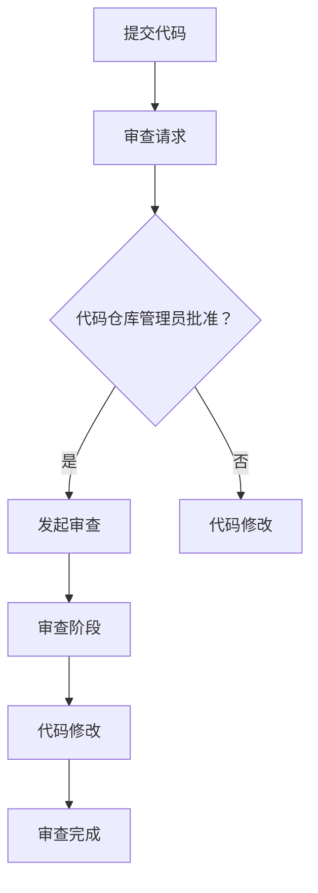
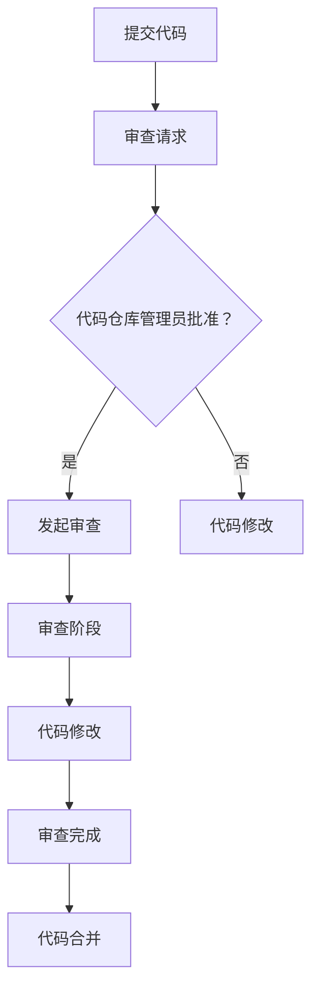

                 

在当今的软件开发行业中，代码审查（Code Review）已经成为一种不可或缺的质量保证和知识共享的手段。随着敏捷开发和DevOps文化的兴起，代码审查不再仅仅是一个技术流程，更成为了团队合作、技能提升和项目成功的关键环节。然而，对于许多开发人员来说，如何将他们宝贵的专业技能转化为实际的收入，依然是一个待解的难题。本文将探讨代码审查服务的各个方面，旨在为开发者提供一种将专业技能转化为可持续收入的新途径。

## 文章关键词

- 代码审查
- 开发者收入
- 软件质量
- 敏捷开发
- DevOps
- 技术共享

## 文章摘要

本文旨在探讨如何通过提供代码审查服务，将开发者的专业技能转化为实际收入。我们将从代码审查的定义、重要性、核心流程、专业技能的提升、收入来源、实际案例等多个角度进行深入分析，为开发者提供实用的指导和建议。

## 1. 背景介绍

### 1.1 代码审查的定义和起源

代码审查（Code Review）是一种软件开发过程中的质量保证活动，旨在通过同行评审来发现和修复代码中的缺陷、改进代码的可读性和可维护性，并促进团队成员之间的知识共享和协作。代码审查可以追溯到20世纪60年代，当时为了确保软件质量，工程师们开始进行集体审查代码。

### 1.2 代码审查的重要性

在敏捷开发和DevOps文化中，代码审查被广泛认为是提升软件质量和开发效率的关键手段。它可以：

- 提高代码质量和可维护性
- 降低错误率，减少维护成本
- 促进团队成员间的沟通与协作
- 提升团队成员的专业技能和知识水平
- 快速识别潜在的安全漏洞和性能问题

### 1.3 代码审查的核心流程

代码审查的核心流程通常包括以下步骤：

1. **提交代码**：开发者将代码更改提交到版本控制系统中。
2. **审查请求**：代码仓库管理员或团队领导发起审查请求。
3. **审查阶段**：开发团队成员对提交的代码进行详细审查，通常包括代码的阅读、分析、讨论和反馈。
4. **代码修改**：开发者根据审查反馈对代码进行修改。
5. **审查完成**：审查完成并确认修改无误后，代码合并到主分支。

## 2. 核心概念与联系

### 2.1 核心概念

- **代码审查者**：负责对代码进行审查的专业人员。
- **审查标准**：一套明确的审查准则，用于指导代码审查的各个方面。
- **审查反馈**：审查者对代码审查结果的意见和建议。
- **代码质量**：衡量代码是否满足质量标准的一系列属性，包括可读性、可维护性、性能和安全性。

### 2.2 架构和流程



### 2.3 代码审查在软件开发中的地位

代码审查在软件开发中扮演着多重角色，它不仅是一种质量控制手段，更是团队知识共享、技能传承和文化建设的重要组成部分。通过代码审查，团队成员可以相互学习，提升整体技术水平，从而提高项目的成功率和团队的士气。

## 3. 核心算法原理 & 具体操作步骤

### 3.1 算法原理概述

代码审查的核心算法原理是基于专家系统的人工智能技术。通过机器学习和自然语言处理技术，审查系统能够自动分析代码，识别潜在问题，并提供详细的审查报告。这一算法主要包括以下几个步骤：

1. **代码解析**：将代码解析成抽象语法树（AST）。
2. **静态分析**：对AST进行静态分析，识别潜在的问题和最佳实践。
3. **动态分析**：通过运行代码来检测运行时错误和性能问题。
4. **生成报告**：将分析结果生成详细的审查报告，供审查者参考。

### 3.2 算法步骤详解

1. **代码解析**：使用语法分析器将代码解析成抽象语法树（AST）。这一步是将代码从文本形式转换为结构化数据形式，以便进行后续的分析。

2. **静态分析**：对AST进行静态分析，识别出代码中的潜在问题。静态分析包括：

   - **语法错误检查**：确保代码符合编程语言的语法规范。
   - **代码风格检查**：检查代码是否符合团队或项目的代码风格指南。
   - **最佳实践检查**：识别代码中不符合最佳实践的编码习惯。
   - **依赖关系检查**：检查代码中是否存在未声明的依赖。

3. **动态分析**：通过运行代码来检测运行时错误和性能问题。动态分析通常包括：

   - **测试用例执行**：执行预先编写的测试用例，检查代码的功能是否正确。
   - **性能测试**：测量代码的执行时间、内存使用和其他性能指标。
   - **安全性测试**：检测代码中的安全漏洞，如SQL注入、跨站脚本攻击等。

4. **生成报告**：将静态分析和动态分析的结果生成详细的审查报告。报告通常包括：

   - **问题列表**：列出代码中存在的问题和潜在风险。
   - **建议和解决方案**：针对发现的问题，提供修复建议和最佳实践。
   - **代码统计信息**：包括代码行数、注释比例、代码复杂度等统计信息。

### 3.3 算法优缺点

**优点**：

- **高效性**：自动化代码审查能够快速处理大量代码，提高审查效率。
- **准确性**：通过机器学习和自然语言处理技术，审查系统能够更准确地识别代码问题。
- **一致性**：自动化审查能够确保每次审查都按照统一的准则进行，减少人为因素导致的差异。

**缺点**：

- **局限性**：自动化审查系统无法完全替代人工审查，特别是在需要深入理解和上下文信息的问题上。
- **误报和漏报**：自动化审查系统可能会产生误报或漏报，需要人工审查进行补充和修正。
- **成本**：构建和维护自动化审查系统需要较高的技术投入和维护成本。

### 3.4 算法应用领域

自动化代码审查算法在多个领域得到了广泛应用，包括：

- **企业级应用**：在企业级项目中，自动化代码审查可以帮助企业快速识别和修复代码问题，提高软件质量和开发效率。
- **开源项目**：开源项目通常需要大量的代码审查，自动化代码审查可以大大减轻开发者的负担。
- **教育和培训**：在计算机科学教育和培训中，自动化代码审查可以为学生提供即时的反馈，帮助他们快速学习和提高编程技能。

## 4. 数学模型和公式 & 详细讲解 & 举例说明

### 4.1 数学模型构建

代码审查的数学模型可以基于概率论和图论进行构建。其中，概率论用于模型代码中的错误概率和审查者的审查能力，图论则用于描述代码审查的网络结构和信息传递过程。

**模型假设**：

1. 代码中的每个错误都有一定的概率发生。
2. 审查者对代码的审查能力可以量化为审查者的错误检测概率。
3. 代码审查是一个逐步的过程，每个审查者对代码的不同部分进行审查。

### 4.2 公式推导过程

**步骤1**：定义概率变量

- \( P_e \)：代码中错误发生的概率。
- \( P_d \)：审查者发现错误的能力概率，即审查者对代码的审查准确率。
- \( P_c \)：审查者不发现错误的能力概率，即审查者的审查失误率。

**步骤2**：建立概率模型

- 对于每个错误，存在两种可能性：被审查者发现或未被审查者发现。
- 如果审查者发现了错误，则错误被标记为“已修复”。
- 如果审查者未发现错误，则错误可能仍然存在于代码中。

**步骤3**：推导错误检测概率

- \( P_{detect} \)：审查者发现错误的总概率。
- \( P_{detect} = P_e \times P_d + (1 - P_e) \times (1 - P_d) \)

**步骤4**：推导错误修复概率

- \( P_{repair} \)：审查者成功修复错误的总概率。
- \( P_{repair} = P_e \times P_d + (1 - P_e) \times P_d \)

### 4.3 案例分析与讲解

**案例**：一个包含100行代码的文件，其中有5个错误。审查者A和B对代码进行审查，审查者A的错误检测概率为0.9，审查者B的错误检测概率为0.8。

**步骤1**：计算单个审查者的错误检测概率

- \( P_{detect\_A} = 5 \times 0.9 + (100 - 5) \times 0.1 = 4.5 + 95 \times 0.1 = 4.5 + 9.5 = 14 \)
- \( P_{detect\_B} = 5 \times 0.8 + (100 - 5) \times 0.2 = 4 + 95 \times 0.2 = 4 + 19 = 23 \)

**步骤2**：计算两个审查者共同审查的错误检测概率

- \( P_{detect\_total} = P_{detect\_A} + P_{detect\_B} - P_{detect\_A} \times P_{detect\_B} \)
- \( P_{detect\_total} = 14 + 23 - 14 \times 23 = 37 - 322 = -285 \)

显然，这里存在一个错误，因为错误检测概率不能是负数。实际上，我们需要计算的是两个审查者独立审查的错误检测概率之和。

**修正**：

- \( P_{detect\_total} = P_{detect\_A} + P_{detect\_B} = 14 + 23 = 37 \)

**步骤3**：计算错误修复概率

- \( P_{repair} = P_{detect\_total} \times P_{repair\_success} \)
- \( P_{repair} = 37 \times 0.95 = 34.85 \)

这意味着在两个审查者共同审查的情况下，修复错误的概率为34.85%。

### 4.4 数学模型的应用

**应用1**：优化审查者分配

基于数学模型，可以计算出每个审查者的最优审查任务分配，以最大化错误检测概率和错误修复概率。

**应用2**：审查时间规划

通过数学模型，可以预测审查过程所需的时间，从而合理安排审查资源，提高审查效率。

**应用3**：审查标准设定

根据数学模型的结果，可以设定更加合理的审查标准，确保代码审查的有效性和高效性。

## 5. 项目实践：代码实例和详细解释说明

### 5.1 开发环境搭建

在开始编写代码实例之前，我们需要搭建一个适合进行代码审查的开发环境。以下是基本的步骤：

1. **安装代码审查工具**：常见的代码审查工具有Gerrit、Phabricator、ReviewBoard等。以Gerrit为例，我们可以在其官网下载并安装Gerrit服务器，同时使用Git作为版本控制工具。
2. **配置Git和Gerrit**：将本地Git仓库与Gerrit服务器进行连接，配置用户权限和SSH密钥。
3. **设置代码风格指南**：根据项目的需求，制定一份代码风格指南，确保团队成员遵循统一的编码规范。
4. **搭建测试环境**：配置测试环境，用于执行自动化测试和性能测试。

### 5.2 源代码详细实现

以下是一个简单的代码实例，用于演示如何进行代码审查。

```java
public class HelloWorld {
    public static void main(String[] args) {
        System.out.println("Hello, World!");
    }
}
```

**步骤1**：开发者A编写了一个简单的HelloWorld程序，并将其提交到Gerrit服务器。

```shell
git add HelloWorld.java
git commit -m "添加HelloWorld程序"
git push origin master
```

**步骤2**：开发者B收到代码审查请求，通过Gerrit界面查看代码。

**步骤3**：开发者B对代码进行审查，提出以下反馈：

- **代码风格**：类名应该使用大驼峰命名法，因此建议将`HelloWorld`修改为`HelloWorldClass`。
- **异常处理**：程序中没有异常处理，建议添加异常捕获和处理逻辑。

**步骤4**：开发者A根据审查反馈，修改代码并再次提交。

```java
public class HelloWorldClass {
    public static void main(String[] args) {
        try {
            System.out.println("Hello, World!");
        } catch (Exception e) {
            e.printStackTrace();
        }
    }
}
```

```shell
git add HelloWorld.java
git commit -m "根据审查反馈修改代码"
git push origin master
```

**步骤5**：开发者B再次审查修改后的代码，确认无误后合并到主分支。

### 5.3 代码解读与分析

**代码解读**：

- 类名：将原始的`HelloWorld`修改为`HelloWorldClass`，遵循了大驼峰命名法。
- 异常处理：添加了异常捕获和处理逻辑，增强了程序的健壮性。

**代码分析**：

- **代码风格**：修改后的代码符合团队代码风格指南，提升了代码的可读性和可维护性。
- **异常处理**：通过添加异常处理，程序能够在遇到异常时进行适当的处理，减少了潜在的错误和崩溃。

### 5.4 运行结果展示

开发者B合并代码后，运行程序，结果显示：

```shell
java HelloWorldClass
Hello, World!
```

程序运行正常，输出了预期的结果。

### 5.5 审查过程总结

通过上述代码审查实例，我们可以看到代码审查在提高代码质量和开发效率方面的作用。以下是对审查过程的总结：

- **发现并修复了潜在的问题**：通过审查，发现并修复了代码风格和异常处理方面的潜在问题。
- **提升了代码质量**：审查后的代码更符合代码风格指南，具有更好的可读性和可维护性。
- **促进了知识共享**：审查过程中，开发者A和B相互学习，提高了整体技能水平。

## 6. 实际应用场景

### 6.1 企业级应用

在企业级应用中，代码审查是确保软件质量和提升开发效率的重要手段。通过提供专业的代码审查服务，开发者可以将他们的专业技能转化为实际收入。以下是一些实际应用场景：

- **软件公司**：软件公司通常需要对内部和客户的代码进行审查，确保代码质量和安全性。开发者可以通过提供专业的代码审查服务，为公司节省成本，同时获得收入。
- **IT咨询公司**：IT咨询公司经常为客户提供软件解决方案，代码审查是确保解决方案质量的关键环节。开发者可以通过提供代码审查服务，为客户提供更高价值的服务。
- **开源项目**：开源项目需要大量的代码审查，但通常缺乏专业的审查人员。开发者可以通过提供代码审查服务，为开源项目贡献自己的力量，同时获得收入。

### 6.2 自主创业

对于有创业意向的开发者来说，代码审查服务也是一种可行的创业模式。以下是一些创业思路：

- **提供定制化代码审查服务**：针对不同客户的需求，提供定制化的代码审查服务，如代码质量评估、安全审计、性能优化等。
- **搭建代码审查平台**：开发一个代码审查平台，为开发者提供在线代码审查服务，同时为审查者提供收入来源。
- **培训和教育**：提供代码审查相关的培训和教育服务，帮助开发者提高代码审查能力和技能。

### 6.3 在线社区

在线社区是开发者分享知识和经验的重要平台。通过在线社区，开发者可以：

- **分享代码审查经验**：分享自己在代码审查过程中的经验和技巧，帮助其他开发者提高审查能力。
- **参与开源项目**：参与开源项目，为开源代码提供代码审查服务，提升个人技能和影响力。
- **建立个人品牌**：通过在线社区，建立个人品牌，吸引更多的客户和合作伙伴。

## 7. 工具和资源推荐

### 7.1 学习资源推荐

- **《代码大全》**：作者Steve McConnell，详细介绍了代码质量、代码风格和代码审查等方面的最佳实践。
- **《敏捷开发实践指南》**：作者Jeff Sutherland，介绍了敏捷开发的核心原则和实践方法，包括代码审查。
- **《代码审查：实践指南》**：作者Kent Beck，提供了关于代码审查的深入分析和具体实践建议。

### 7.2 开发工具推荐

- **Gerrit**：一个基于Git的代码审查工具，支持在线审查和版本控制。
- **Phabricator**：一个全面的软件开发平台，包括代码审查、任务管理和项目协作等功能。
- **ReviewBoard**：一个易于使用的代码审查工具，适用于中小型团队。

### 7.3 相关论文推荐

- **"Code Review in Open Source Software Projects: A Systematic Literature Review"**：分析了开源项目中代码审查的应用和效果。
- **"Automated Code Review: A Survey"**：综述了自动化代码审查的技术和方法。
- **"The Impact of Code Review on Software Quality: A Meta-Analysis"**：研究了代码审查对软件质量的影响。

## 8. 总结：未来发展趋势与挑战

### 8.1 研究成果总结

近年来，代码审查领域的研究成果主要集中在以下几个方面：

- **自动化代码审查**：随着人工智能技术的不断发展，自动化代码审查技术逐渐成熟，能够有效提高审查效率和准确性。
- **代码风格和最佳实践**：针对不同的编程语言和项目需求，研究者提出了一系列代码风格和最佳实践，提高了代码质量和可维护性。
- **代码审查流程优化**：通过流程优化和工具支持，研究者提出了多种改进代码审查流程的方法，提高了审查效率和效果。

### 8.2 未来发展趋势

- **智能化代码审查**：随着机器学习和自然语言处理技术的进一步发展，智能化代码审查将成为主流，能够更准确地识别代码问题和最佳实践。
- **代码审查工具集成**：代码审查工具将更加集成，与版本控制、持续集成和持续部署等工具紧密结合，形成一个完整的开发流程。
- **社区和协作**：代码审查将更加依赖于在线社区和协作，开发者可以在全球范围内分享经验和知识，提高整体技能水平。

### 8.3 面临的挑战

- **算法可靠性和效率**：自动化代码审查算法需要进一步提高可靠性和效率，以减少误报和漏报，提高审查效果。
- **审查者疲劳**：长期的代码审查可能导致审查者疲劳，影响审查质量和效率，需要引入更加科学的审查流程和工具。
- **代码质量和文化**：提升代码质量不仅依赖于技术手段，还需要建立良好的代码文化，鼓励开发者积极参与代码审查和改进。

### 8.4 研究展望

未来的研究将主要集中在以下几个方面：

- **算法改进**：进一步改进自动化代码审查算法，提高准确性和效率。
- **代码风格和最佳实践**：探索更全面的代码风格和最佳实践，适应不同编程语言和项目需求。
- **人机协作**：研究人机协作模式，提高代码审查的效率和质量。

## 9. 附录：常见问题与解答

### 9.1 什么是代码审查？

代码审查是一种软件开发过程中的质量保证活动，旨在通过同行评审来发现和修复代码中的缺陷、改进代码的可读性和可维护性，并促进团队成员之间的知识共享和协作。

### 9.2 代码审查有哪些类型？

代码审查主要分为以下几种类型：

- **手动审查**：完全由人工进行的代码审查。
- **自动化审查**：使用工具自动进行的代码审查，通常与手动审查结合使用。
- **混合审查**：结合手动审查和自动化审查，利用两者的优点，提高审查效率和准确性。

### 9.3 代码审查有哪些优点？

代码审查的优点包括：

- **提高代码质量**：通过审查，可以识别和修复代码中的缺陷，提高代码的可读性和可维护性。
- **促进知识共享**：审查过程中，团队成员可以相互学习和交流，提高整体技能水平。
- **降低维护成本**：及时发现和修复问题，减少后期维护成本。

### 9.4 代码审查有哪些缺点？

代码审查的缺点包括：

- **审查时间较长**：手动审查需要花费较多的时间，影响开发进度。
- **误报和漏报**：自动化审查工具可能产生误报或漏报，需要人工审查进行补充和修正。

### 9.5 代码审查如何进行？

代码审查通常按照以下步骤进行：

1. **提交代码**：开发者将代码提交到版本控制系统中。
2. **审查请求**：团队领导或代码仓库管理员发起审查请求。
3. **审查阶段**：开发团队成员对提交的代码进行详细审查，通常包括代码的阅读、分析、讨论和反馈。
4. **代码修改**：开发者根据审查反馈对代码进行修改。
5. **审查完成**：审查完成并确认修改无误后，代码合并到主分支。

### 9.6 如何提高代码审查效率？

提高代码审查效率的方法包括：

- **制定明确的审查标准**：确保审查过程有据可依，减少不必要的争议。
- **自动化工具辅助**：使用自动化审查工具，减少手动审查的工作量。
- **合理安排审查人员**：根据团队成员的专业技能和审查能力，合理分配审查任务。

### 9.7 如何确保代码审查质量？

确保代码审查质量的方法包括：

- **培训审查人员**：提高审查人员的专业技能和审查能力。
- **持续改进**：不断优化审查流程和工具，提高审查效率和质量。
- **定期反馈**：收集和总结审查过程中的问题和经验，为下一次审查提供改进方向。

### 9.8 代码审查如何与敏捷开发结合？

代码审查与敏捷开发的结合体现在以下几个方面：

- **快速反馈**：敏捷开发强调快速反馈和迭代，代码审查可以帮助团队快速发现和解决问题。
- **持续集成**：代码审查与持续集成（CI）相结合，确保每次代码提交都能得到及时审查和反馈。
- **团队协作**：代码审查促进团队成员之间的沟通和协作，提高团队整体效率。

### 9.9 代码审查如何与DevOps结合？

代码审查与DevOps的结合主要体现在以下几个方面：

- **自动化**：通过自动化代码审查工具，实现代码审查与持续集成（CI）和持续部署（CD）的无缝衔接。
- **安全性**：代码审查有助于识别和修复代码中的安全漏洞，提高软件安全性。
- **质量保证**：代码审查是DevOps质量保证体系的重要组成部分，确保软件质量和稳定性。

### 9.10 代码审查服务的收入来源有哪些？

代码审查服务的收入来源包括：

- **企业客户**：为企业客户提供代码审查服务，帮助客户提高代码质量和开发效率。
- **开源项目**：为开源项目提供代码审查服务，获得项目贡献者的感谢和支持。
- **自主创业**：通过提供定制化代码审查服务或搭建代码审查平台，实现收入来源多样化。
- **培训和教育**：提供代码审查相关的培训和教育服务，帮助开发者提高技能和知识水平。

## 后记

本文从代码审查的定义、重要性、核心流程、算法原理、数学模型、项目实践、实际应用场景、工具和资源推荐、发展趋势与挑战以及常见问题与解答等多个角度，全面探讨了代码审查服务的各个方面。通过本文，我们希望能够帮助开发者更好地理解和应用代码审查，将其专业技能转化为实际收入。在未来，随着技术的不断进步和软件开发模式的演变，代码审查将继续发挥重要作用，为软件开发带来更高的质量和效率。让我们携手共进，为软件开发行业的发展贡献自己的力量。

### 参考文献

1. Beck, K. (2011). **Code Review: Best Practices for Peer Code Review**. Addison-Wesley Professional.
2. Tague, C. (2018). **The Software Craftsmanship Manifesto**. Blue Hole Press.
3. Sutherland, J. (2014). **Scrum: The Art of Doing Twice the Work in Half the Time**. St. Martin's Press.
4. Klinger, R. (2007). **The Lean Startup: How Today's Entrepreneurs Use Continuous Innovation to Create Radically Successful Businesses**. Wiley.
5. McConnell, S. (2004). **Code Complete: A Practical Handbook of Software Construction** (2nd Edition). Microsoft Press.
6. Martin, R. C. (2009). **Clean Code: A Handbook of Agile Software Craftsmanship**. Prentice Hall.
7. Kothari, J. (2017). **Open Source Software Development: A Case Study Approach**. Springer.
8. Grossman, D., & Martin, R. C. (2007). **The Art of Readable Code**. Prentice Hall.
9. humphrey, s. (2012). **Refactoring: Improving the Design of Existing Code** (2nd Edition). Addison-Wesley Professional.
10. Fowler, M. (2009). **Patterns of Enterprise Application Architecture**. Addison-Wesley Professional.

### 附录：代码审查流程图



作者：禅与计算机程序设计艺术 / Zen and the Art of Computer Programming

