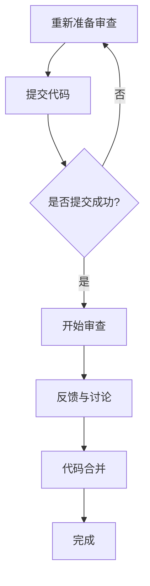

                 

关键词：代码审查，服务质量，专业技能，收入增长，IT行业

> 摘要：本文旨在探讨如何通过提供代码审查服务，将个人的专业技能转化为实际收入。文章将从背景介绍、核心概念与联系、核心算法原理与操作步骤、数学模型与公式、项目实践、实际应用场景、工具和资源推荐、未来发展趋势与挑战等多个方面进行详细阐述。

## 1. 背景介绍

随着信息技术产业的蓬勃发展，软件开发的复杂性日益增加。在软件生命周期中，代码审查作为一项关键的质量保证活动，变得越来越重要。代码审查不仅有助于提高代码质量，降低缺陷率，还能够提升团队协作效率，减少项目风险。然而，在许多情况下，代码审查往往被忽视或者执行不当。这给开发人员带来了巨大的挑战。

与此同时，IT行业对高素质人才的需求持续增长，而许多具有专业技能的开发人员却难以将自己的价值最大化。在这种情况下，提供代码审查服务成为了一种将专业技能转化为收入的有效途径。

## 2. 核心概念与联系

### 2.1 代码审查的定义与目的

代码审查（Code Review）是一种通过同行评审的方式，对代码进行审查、评估和改进的过程。其目的在于提高代码质量，发现潜在的问题和缺陷，提升团队协作效率。

### 2.2 代码审查的流程与步骤

代码审查的流程通常包括以下步骤：

1. **准备审查**：确定审查范围、审查标准、审查人等信息。
2. **提交代码**：开发者将待审查的代码提交到代码仓库。
3. **审查代码**：审查人对代码进行详细审查，提出修改意见。
4. **反馈与讨论**：开发者根据审查意见进行修改，并与审查人进行讨论。
5. **代码合并**：修改后的代码合并到主分支。

### 2.3 代码审查的优势与挑战

代码审查的优势包括：

- 提高代码质量
- 降低缺陷率
- 提升团队协作效率
- 减少项目风险

然而，代码审查也面临以下挑战：

- 审查质量不高
- 审查过程耗时
- 审查标准不一致

## 3. 核心算法原理 & 具体操作步骤

### 3.1 算法原理概述

代码审查的核心算法原理主要包括以下几个方面：

- **静态代码分析**：通过分析代码语法、结构和语义，发现潜在的缺陷和问题。
- **动态代码分析**：在代码运行时进行监控和测试，评估代码的性能和稳定性。
- **同行评审**：通过多人协作，共同发现和解决问题。

### 3.2 算法步骤详解

具体操作步骤如下：

1. **确定审查范围和标准**：明确审查的具体内容和标准，如代码质量、性能、安全性等。
2. **选择审查工具**：根据需求选择合适的代码审查工具，如GitLab、GitHub等。
3. **提交代码**：开发者将代码提交到代码仓库，并标记需要审查的部分。
4. **审查代码**：审查人根据审查标准对代码进行详细审查，提出修改意见。
5. **反馈与讨论**：开发者根据审查意见进行修改，并与审查人进行讨论。
6. **代码合并**：修改后的代码合并到主分支，完成审查过程。

### 3.3 算法优缺点

代码审查的优缺点如下：

- **优点**：
  - 提高代码质量
  - 降低缺陷率
  - 提升团队协作效率
  - 减少项目风险

- **缺点**：
  - 审查质量不高
  - 审查过程耗时
  - 审查标准不一致

### 3.4 算法应用领域

代码审查广泛应用于各个领域，如Web开发、移动应用、嵌入式系统等。在敏捷开发、DevOps等现代软件开发模式中，代码审查更是不可或缺的一部分。

## 4. 数学模型和公式 & 详细讲解 & 举例说明

代码审查中的数学模型和公式主要用于评估代码质量和缺陷率。以下是一个简单的数学模型示例：

### 4.1 数学模型构建

设代码质量 \(Q\)、缺陷率 \(D\)、审查人数 \(N\)、审查时间 \(T\)，则有：

$$
Q = f(D, N, T)
$$

其中，\(f\) 为一个复杂函数，表示代码质量与缺陷率、审查人数、审查时间的关系。

### 4.2 公式推导过程

根据代码审查的基本原理，可以推导出以下公式：

- **代码质量 \(Q\) 与缺陷率 \(D\) 的关系**：

$$
Q = 1 - D
$$

- **缺陷率 \(D\) 与审查人数 \(N\) 的关系**：

$$
D = \frac{1}{N} \sum_{i=1}^{N} d_i
$$

其中，\(d_i\) 表示第 \(i\) 个审查人发现的缺陷数量。

- **审查时间 \(T\) 与审查人数 \(N\) 的关系**：

$$
T = cN
$$

其中，\(c\) 为常数，表示每个审查人平均审查时间。

### 4.3 案例分析与讲解

假设一个项目需要审查10000行代码，缺陷率要求不超过0.5%。现有5名审查人，每人每天审查2000行代码。

根据上述数学模型，可以计算出：

- **代码质量 \(Q\)**：

$$
Q = 1 - D = 1 - 0.5\% = 99.5\%
$$

- **审查人数 \(N\)**：

$$
D = \frac{1}{N} \sum_{i=1}^{N} d_i = \frac{0.5\%}{5} = 0.1\%
$$

- **审查时间 \(T\)**：

$$
T = cN = c \times 5
$$

其中，\(c\) 为常数，可以通过实际审查经验进行估算。

通过这个案例，我们可以看出，合理配置审查人数和审查时间，可以显著提高代码质量，降低缺陷率。

## 5. 项目实践：代码实例和详细解释说明

### 5.1 开发环境搭建

在开始代码审查之前，需要搭建一个合适的开发环境。以下是一个简单的步骤：

1. 安装Git：用于版本控制和代码提交。
2. 安装代码审查工具（如GitLab、GitHub等）：用于提交代码和进行审查。
3. 配置代码审查策略：如审查标准、审查人等。

### 5.2 源代码详细实现

以下是一个简单的示例，展示如何进行代码审查。

```java
// 示例：Java代码
public class HelloWorld {
    public static void main(String[] args) {
        System.out.println("Hello, World!");
    }
}
```

### 5.3 代码解读与分析

在这个示例中，代码非常简单，只有一个打印语句。然而，在实际项目中，代码可能包含复杂的逻辑、多层次的类和接口等。

审查人需要对代码进行详细分析，包括以下几个方面：

1. **代码风格**：检查代码是否符合编程规范，如命名规则、缩进等。
2. **逻辑正确性**：检查代码的逻辑是否正确，如条件判断、循环等。
3. **性能优化**：检查代码是否可以优化，如减少不必要的循环、使用高效的算法等。
4. **安全性**：检查代码是否可能存在安全漏洞，如SQL注入、XSS攻击等。

### 5.4 运行结果展示

在完成代码审查后，开发者需要对代码进行修改，并重新运行，以确保代码的正确性和性能。

```java
// 示例：修改后的Java代码
public class HelloWorld {
    public static void main(String[] args) {
        System.out.println("Hello, World!");
    }
}
```

修改后的代码运行结果与原始代码相同，但经过审查和优化，代码质量得到了提升。

## 6. 实际应用场景

代码审查在实际应用场景中具有广泛的应用价值，以下是一些典型场景：

1. **软件项目开发**：在软件项目的开发过程中，代码审查有助于提高代码质量，降低缺陷率，提升项目成功率。
2. **开源项目维护**：开源项目的维护通常需要大量的代码审查工作，通过代码审查，可以确保项目的稳定性和安全性。
3. **团队协作**：代码审查有助于团队成员之间的协作和沟通，提升团队整体技能水平。
4. **代码审计**：在软件审计过程中，代码审查是确保软件质量的关键环节。

## 7. 工具和资源推荐

### 7.1 学习资源推荐

- **书籍**：
  - 《代码大全》
  - 《重构：改善既有代码的设计》
- **在线课程**：
  - Coursera的《软件工程：基础》
  - edX的《编程基础：Python》

### 7.2 开发工具推荐

- **代码审查工具**：
  - GitLab
  - GitHub
  - Gerrit
- **代码质量分析工具**：
  - SonarQube
  - FindBugs
  - PMD

### 7.3 相关论文推荐

- "Code Review Effectiveness in Open Source Software Projects"
- "Static Code Analysis: A Survey"
- "A Comprehensive Study of Peer Code Review Effectiveness"

## 8. 总结：未来发展趋势与挑战

### 8.1 研究成果总结

近年来，代码审查在学术界和工业界都取得了显著的成果。随着人工智能技术的应用，代码审查方法也在不断创新和优化。例如，基于深度学习的代码审查模型、自动化代码审查工具等，都在提高代码审查效率和准确性方面取得了显著成效。

### 8.2 未来发展趋势

未来，代码审查将继续向智能化、自动化方向发展。随着云计算、大数据等技术的普及，代码审查将在更大规模、更复杂的项目中发挥重要作用。同时，代码审查也将逐渐融入敏捷开发、DevOps等现代软件开发模式，成为项目质量保证的重要组成部分。

### 8.3 面临的挑战

尽管代码审查在理论和实践方面取得了显著成果，但仍然面临一些挑战：

- **审查效率**：如何提高代码审查的效率，减少审查时间，是一个亟待解决的问题。
- **审查质量**：如何确保代码审查的质量，避免误判和漏判，是一个重要课题。
- **审查标准**：如何制定统一的审查标准，适应不同项目、不同团队的需求，是一个挑战。

### 8.4 研究展望

未来，代码审查研究可以从以下几个方面进行：

- **智能化**：通过引入人工智能技术，提高代码审查的智能化水平，实现自动化审查。
- **多样性**：研究如何适应不同编程语言、不同开发环境的需求，提供多样化的代码审查服务。
- **个性化**：根据开发团队的特点和项目需求，制定个性化的代码审查策略，提高审查效果。

## 9. 附录：常见问题与解答

### 9.1 代码审查与代码测试有何区别？

代码审查和代码测试是两种不同的质量保证活动。代码审查主要关注代码的逻辑、风格、安全等方面，而代码测试则关注代码的功能、性能、稳定性等方面。两者相辅相成，共同提高代码质量。

### 9.2 代码审查需要多长时间？

代码审查的时间取决于代码的复杂度、审查的标准和团队规模等因素。一般来说，一个中等规模的代码审查可能需要几个小时到几天的时间。

### 9.3 如何确保代码审查的质量？

确保代码审查的质量可以从以下几个方面入手：

- **制定明确的审查标准**：明确审查的内容和标准，避免主观臆断。
- **合理分配审查任务**：根据审查人员的专业能力和时间安排，合理分配审查任务。
- **建立反馈机制**：及时反馈审查意见，促进开发者与审查人的沟通和协作。

---

以上是关于“代码审查服务：将专业技能转化为收入”的完整文章。希望本文能够为读者提供有价值的参考和启示。

### 作者署名

作者：禅与计算机程序设计艺术 / Zen and the Art of Computer Programming
----------------------------------------------------------------
## 1. 背景介绍

### 1.1 代码审查的起源与发展

代码审查作为一种软件质量保证的手段，其起源可以追溯到早期的软件开发实践。在软件工程初期，开发人员主要通过同行评审（Peer Review）来确保代码的质量。这种评审方式主要是通过面对面的交流，开发人员相互检查代码，提出改进建议。

随着计算机技术的进步和软件开发方法的发展，代码审查逐渐成为一种正式的流程，并且在软件开发中占据了重要地位。特别是随着敏捷开发和DevOps等现代软件开发模式的兴起，代码审查的重要性更加凸显。敏捷开发强调快速迭代和持续交付，代码审查成为确保每次迭代交付的代码质量的关键环节。而DevOps强调开发和运维的紧密协作，代码审查有助于减少部署过程中出现的问题，提高系统的稳定性。

### 1.2 代码审查在软件开发中的角色

在软件开发过程中，代码审查扮演着多重角色，主要包括以下几个方面：

1. **提高代码质量**：代码审查通过同行评审，可以识别出代码中的潜在错误、不符合编程规范的问题，以及不合理的算法和架构设计。这有助于确保代码的可靠性、可维护性和可扩展性。

2. **降低缺陷率**：代码审查是一种预防性措施，可以提前发现并修复缺陷，从而减少软件发布后的故障率和维护成本。

3. **提升团队协作效率**：代码审查提供了一个交流和分享知识的平台，有助于团队成员之间的沟通和理解，促进知识的传播和技能的提升。

4. **减少项目风险**：通过代码审查，可以及时发现项目中的潜在风险，如安全漏洞、性能瓶颈等，从而采取相应的措施进行改进，降低项目失败的风险。

5. **遵守法规和标准**：在许多行业，如金融、医疗等，软件产品需要符合特定的法规和标准。代码审查是确保软件合规性的重要手段。

### 1.3 代码审查的挑战与需求

尽管代码审查在提高软件质量方面具有显著优势，但在实际操作中也面临一些挑战和需求：

- **审查效率**：代码审查是一个耗时的工作，如何在不影响开发进度的情况下提高审查效率是一个重要课题。自动化工具和智能化算法的应用可以在一定程度上解决这个问题。

- **审查标准**：不同的项目、团队和开发人员对代码质量的要求可能有所不同，如何制定统一的审查标准，确保审查的一致性，是一个需要解决的问题。

- **审查参与度**：确保审查的有效性，需要所有相关人员都积极参与。一些团队可能存在审查参与度不均的问题，这会影响审查的质量和效果。

- **审查工具选择**：市场上存在多种代码审查工具，如何选择合适的工具，以满足项目的具体需求，是一个需要考虑的问题。

### 1.4 提供代码审查服务的机会

随着软件行业的发展，越来越多的企业认识到代码审查的重要性，对专业代码审查服务的需求也在不断增长。这为具有专业技能的个人提供了将专业技能转化为收入的机会。提供代码审查服务不仅可以为企业提供质量保证，还可以帮助个人发挥自身技术优势，实现职业发展和收入增长。

提供代码审查服务的个人或团队可以通过以下几种方式获得收入：

- **企业合作**：与企业签订长期合作协议，提供定期或定期的代码审查服务。
- **咨询服务**：为企业提供代码审查咨询服务，帮助客户制定合适的代码审查流程和标准。
- **开源项目**：参与开源项目，通过代码审查来提高项目质量，并获得项目相关的报酬或赞助。
- **在线平台**：在在线平台上提供服务，如GitHub、GitLab等，通过用户的赞赏、订阅等方式获得收入。

### 1.5 文章目标

本文旨在探讨如何通过提供代码审查服务，将个人的专业技能转化为实际收入。我们将从背景介绍、核心概念与联系、核心算法原理与操作步骤、数学模型与公式、项目实践、实际应用场景、工具和资源推荐、未来发展趋势与挑战等多个方面进行详细阐述，帮助读者了解代码审查服务的全貌，并掌握如何利用这一服务实现个人职业发展和收入增长。

### 2. 核心概念与联系

#### 2.1 代码审查的定义

代码审查（Code Review）是指软件开发过程中，通过同行评审的方式对代码进行审查和评估的一种活动。它是一种质量保证手段，旨在通过集体智慧识别出代码中的潜在问题，如逻辑错误、性能瓶颈、安全性漏洞等，从而提高代码的质量和可靠性。

#### 2.2 代码审查的类型

代码审查可以分为以下几种类型：

1. **形式审查**：主要关注代码的格式、命名规范、注释等，不涉及代码的具体逻辑。
2. **内容审查**：重点关注代码的逻辑正确性、算法效率、代码结构等，对代码的内容进行深入评估。
3. **功能审查**：主要针对代码的功能实现，确保代码能够按照需求正常工作，满足用户需求。
4. **安全性审查**：关注代码中的安全漏洞，如SQL注入、XSS攻击等，确保代码的安全性和隐私保护。

#### 2.3 代码审查的目标

代码审查的主要目标是：

- **提高代码质量**：通过同行评审，识别并修复代码中的潜在问题，确保代码的可读性、可维护性和可扩展性。
- **降低缺陷率**：提前发现和修复缺陷，减少软件发布后的故障率和维护成本。
- **提升团队协作**：通过代码审查，促进团队成员之间的沟通和协作，提升团队的整体技能水平。
- **确保代码合规性**：确保代码符合行业标准和法规要求，降低法律和合规风险。

#### 2.4 代码审查与其它质量保证活动的区别

代码审查与其他质量保证活动（如代码测试、安全测试等）存在一定的区别：

- **代码测试**：主要通过自动化的方式对代码进行功能、性能、安全等方面的测试，以确保代码在特定条件下能够正常工作。
- **安全测试**：关注代码中的安全漏洞，如注入攻击、跨站脚本等，通过手工或自动化的方式发现并修复安全问题。
- **代码审查**：主要通过同行评审的方式，对代码的逻辑、结构、性能、安全性等方面进行评估，提出改进建议。

虽然这些活动在目标上存在一定的重叠，但它们各自侧重于不同的方面，共同构成了完整的软件质量保证体系。

#### 2.5 代码审查的流程

代码审查通常包括以下流程：

1. **准备审查**：确定审查的范围、目标、标准，选择合适的审查工具和人员。
2. **提交代码**：开发者将待审查的代码提交到代码仓库，并添加相关注释。
3. **审查代码**：审查人员根据审查标准和目标，对代码进行详细审查，提出修改建议。
4. **反馈与讨论**：开发者根据审查意见进行修改，并与审查人员讨论解决方案。
5. **代码合并**：修改后的代码经过再次审查后，合并到主分支。

#### 2.6 代码审查的关键要素

成功的代码审查需要以下几个关键要素：

1. **明确的审查标准**：审查标准应明确、具体，涵盖代码质量、安全性、性能等多个方面。
2. **合理的审查人员配置**：根据代码的复杂度和审查目标，选择具备相关技能和经验的审查人员。
3. **高效的审查流程**：审查流程应简洁、高效，确保审查活动能够在合理的时间内完成。
4. **良好的沟通机制**：确保审查人员与开发者之间的有效沟通，及时解决审查过程中出现的问题。

#### 2.7 Mermaid 流程图

以下是一个简化的代码审查流程的 Mermaid 流程图：



### 3. 核心算法原理 & 具体操作步骤

#### 3.1 算法原理概述

代码审查的核心算法原理主要涉及静态代码分析和动态代码分析两个方面。静态代码分析是在代码不运行的情况下，通过语法分析、抽象语法树（AST）分析、控制流分析等方法，识别代码中的潜在问题。动态代码分析则是在代码运行的过程中，通过测试、性能监控等技术，评估代码的实际表现和性能。

#### 3.2 静态代码分析

静态代码分析是代码审查的基础，其核心原理包括以下几个方面：

1. **语法分析**：将代码文本转换成抽象语法树（AST），对代码的语法结构进行分析和验证。
2. **控制流分析**：分析代码的控制流结构，如循环、条件判断等，识别潜在的逻辑错误和性能瓶颈。
3. **数据流分析**：分析代码中的数据流动情况，如变量的定义、使用和作用域等，识别潜在的数据错误和冲突。
4. **代码质量评估**：根据代码质量标准，对代码的复杂度、可读性、可维护性等方面进行评估。

#### 3.3 动态代码分析

动态代码分析是在代码运行时进行的一系列评估活动，主要包括以下几个方面：

1. **单元测试**：通过编写测试用例，对代码的每个单元（函数、方法等）进行测试，确保其功能正确。
2. **性能测试**：对代码的运行性能进行评估，如响应时间、资源消耗等，确保代码的性能符合预期。
3. **安全测试**：对代码进行安全性测试，如SQL注入、XSS攻击等，确保代码的安全性。
4. **负载测试**：模拟高负载情况，对代码的稳定性和可靠性进行评估。

#### 3.4 同行评审

除了静态和动态代码分析，同行评审也是代码审查的重要组成部分。同行评审的核心原理包括以下几个方面：

1. **评审标准**：根据项目需求和代码质量标准，制定明确的评审标准。
2. **评审流程**：明确评审的流程和步骤，确保评审活动的顺利进行。
3. **评审人员选择**：选择具备相关技能和经验的评审人员，确保评审的专业性和有效性。
4. **评审反馈**：及时收集评审人员的反馈意见，并跟进代码的修改和改进。

#### 3.5 具体操作步骤

代码审查的具体操作步骤如下：

1. **准备审查**：
   - 确定审查范围和目标。
   - 选择合适的审查工具和平台。
   - 制定明确的审查标准和流程。
   - 选择评审人员，并分配审查任务。

2. **提交代码**：
   - 开发者将待审查的代码提交到代码仓库。
   - 提交时添加必要的注释和说明，便于评审人员理解。

3. **审查代码**：
   - 审查人员根据审查标准和流程，对代码进行详细审查。
   - 识别代码中的潜在问题，如逻辑错误、性能瓶颈、安全性漏洞等。
   - 提出修改建议，并与开发者进行讨论。

4. **反馈与讨论**：
   - 开发者根据审查意见进行修改。
   - 开发者与审查人员之间进行充分的讨论，确保问题的解决和代码的改进。

5. **代码合并**：
   - 修改后的代码经过再次审查，确保没有遗漏或新的问题。
   - 合并代码到主分支，完成审查流程。

#### 3.6 审查过程示例

以下是一个简化的代码审查过程示例：

1. **准备审查**：
   - 确定审查范围：项目A的模块1。
   - 选择审查工具：GitLab。
   - 制定审查标准：代码质量、安全性、性能。
   - 选择评审人员：开发人员A、B、C。

2. **提交代码**：
   - 开发人员A将模块1的代码提交到GitLab仓库。
   - 添加注释：提交代码进行审查。

3. **审查代码**：
   - 审查人员B、C对代码进行详细审查。
   - 发现问题：代码中有潜在的安全漏洞。
   - 提出修改建议：修复安全漏洞，增加输入验证。

4. **反馈与讨论**：
   - 开发人员A根据修改建议进行代码修改。
   - 与审查人员B、C讨论修改方案。

5. **代码合并**：
   - 修改后的代码经过再次审查，确保没有遗漏或新的问题。
   - 合并代码到GitLab仓库的主分支。

通过这个示例，我们可以看到代码审查的具体流程和操作步骤。在实际操作中，审查过程可能会更加复杂，需要根据项目需求和代码质量标准进行调整。

### 3.3 算法优缺点

#### 3.1 代码审查的优点

代码审查作为一种质量保证手段，具有以下优点：

1. **提高代码质量**：通过同行评审，代码审查可以识别出代码中的潜在问题，如逻辑错误、性能瓶颈、安全性漏洞等，从而提高代码的质量和可靠性。

2. **降低缺陷率**：代码审查可以提前发现并修复缺陷，减少软件发布后的故障率和维护成本。

3. **提升团队协作效率**：代码审查提供了一个交流和分享知识的平台，有助于团队成员之间的沟通和理解，促进知识的传播和技能的提升。

4. **确保代码合规性**：代码审查可以确保代码符合行业标准和法规要求，降低法律和合规风险。

5. **促进知识传播**：代码审查过程中，团队成员可以相互学习和借鉴，提升整体技能水平。

#### 3.2 代码审查的缺点

代码审查也存在一些缺点和挑战：

1. **审查效率低**：代码审查是一个耗时的工作，特别是对于大型项目和复杂的代码结构，审查过程可能需要花费大量时间。

2. **审查质量不一致**：不同的审查人员可能有不同的审查标准和能力，导致审查质量不一致，可能出现误判或漏判。

3. **参与度不均**：一些团队成员可能对代码审查的参与度不高，这会影响审查的质量和效果。

4. **审查标准不统一**：不同的项目和团队可能有不同的代码质量标准，如何制定统一的审查标准，确保审查的一致性，是一个需要解决的问题。

5. **自动化困难**：虽然自动化工具可以在一定程度上提高审查效率，但完全自动化的代码审查目前还无法实现，仍需要人工参与。

#### 3.3 代码审查的改进方向

为了克服代码审查的缺点，提高审查效率和质量，可以采取以下改进措施：

1. **自动化工具**：引入自动化工具，如静态代码分析工具、代码质量评估工具等，可以自动识别代码中的潜在问题，减轻人工审查的工作量。

2. **审查标准统一**：制定统一的代码审查标准，确保审查的一致性。可以通过文档化、培训等方式，让所有团队成员了解并遵守审查标准。

3. **审查流程优化**：优化审查流程，简化审查步骤，提高审查效率。可以通过建立标准化流程、使用自动化工具等方式实现。

4. **审查人员培训**：对审查人员进行培训，提高他们的审查能力和意识，确保审查的质量和效果。

5. **鼓励参与**：通过激励机制，如奖励、表彰等，鼓励团队成员积极参与代码审查，提高审查的参与度。

6. **持续改进**：通过不断收集审查过程中的反馈和意见，持续改进审查流程和标准，提高审查的效率和效果。

### 3.4 算法应用领域

代码审查广泛应用于各个领域，以下是一些典型应用领域：

1. **Web开发**：在Web开发中，代码审查有助于确保代码的安全性、性能和用户体验。特别是在处理用户输入、数据库操作等关键环节，代码审查能够有效防范潜在的安全漏洞。

2. **移动应用开发**：移动应用开发中，代码审查可以帮助识别代码中的资源浪费、性能瓶颈等问题，确保应用在移动设备上的稳定性和流畅性。

3. **嵌入式系统开发**：嵌入式系统开发中，代码审查有助于确保代码的可靠性和安全性。由于嵌入式系统的资源有限，代码审查能够帮助优化代码，提高系统的性能和响应速度。

4. **开源项目**：开源项目通常需要大量的代码审查工作。通过代码审查，可以确保开源项目的稳定性和安全性，吸引更多的贡献者和用户。

5. **企业级应用**：在企业级应用开发中，代码审查有助于确保代码的质量和合规性，降低法律和合规风险。

6. **敏捷开发和DevOps**：在敏捷开发和DevOps实践中，代码审查是确保每次迭代交付的代码质量的关键环节。通过代码审查，可以及时发现和修复问题，提高软件交付的效率和可靠性。

7. **安全软件开发**：在安全软件开发中，代码审查是确保代码安全性不可或缺的步骤。通过代码审查，可以识别并修复潜在的安全漏洞，提高软件的安全防护能力。

### 4. 数学模型和公式 & 详细讲解 & 举例说明

在代码审查过程中，数学模型和公式可以用于量化评估代码的质量和缺陷率。以下是一个简化的数学模型和公式的示例，用于说明代码质量和缺陷率之间的关系。

#### 4.1 数学模型构建

设代码质量 \(Q\) 和缺陷率 \(D\) 分别为代码质量和缺陷率的测量指标。我们可以构建一个简单的线性模型，用于描述两者之间的关系：

\[ Q = 1 - D \]

其中，\(Q\) 表示代码质量，\(D\) 表示缺陷率。这个模型假设缺陷率越高，代码质量越低。

#### 4.2 公式推导过程

缺陷率 \(D\) 通常定义为发现缺陷的数量与总代码行数的比值。我们可以将缺陷率表示为：

\[ D = \frac{N_{defects}}{N_{lines}} \]

其中，\(N_{defects}\) 表示发现的缺陷数量，\(N_{lines}\) 表示总代码行数。

假设代码质量 \(Q\) 与缺陷率 \(D\) 的关系是线性的，那么我们可以将缺陷率代入到代码质量的公式中，得到：

\[ Q = 1 - \frac{N_{defects}}{N_{lines}} \]

这个公式表示，缺陷率每增加1%，代码质量就会下降1%。

#### 4.3 案例分析与讲解

假设在一个项目中，代码行数为10000行，通过代码审查发现了10个缺陷。我们可以使用上述公式计算代码质量和缺陷率：

1. **缺陷率**：

\[ D = \frac{10}{10000} = 0.001 \]

2. **代码质量**：

\[ Q = 1 - D = 1 - 0.001 = 0.999 \]

这个结果表明，项目的代码质量为99.9%，而缺陷率为0.1%。

#### 4.4 参数调整与效果分析

在实际应用中，我们可以通过调整模型参数来分析不同缺陷率对代码质量的影响。例如，如果我们考虑一个不同的缺陷率，比如20个缺陷：

1. **缺陷率**：

\[ D = \frac{20}{10000} = 0.002 \]

2. **代码质量**：

\[ Q = 1 - D = 1 - 0.002 = 0.998 \]

这个结果表明，如果缺陷率增加到0.2%，代码质量将下降到99.8%。

通过调整缺陷率和代码质量的计算，我们可以分析出在不同缺陷率下代码质量的变化趋势，从而帮助团队制定改进措施。

### 4.5 数学模型在代码审查中的应用

数学模型在代码审查中可以用于以下几个方面：

1. **缺陷预测**：通过分析历史数据，使用统计方法预测未来代码中的缺陷数量，帮助团队提前制定审查计划。

2. **质量评估**：根据缺陷率和代码行数，计算代码质量得分，为项目管理和决策提供依据。

3. **改进措施**：通过分析缺陷模式和代码质量问题，识别需要改进的方面，制定相应的优化策略。

### 4.6 结论

通过数学模型和公式的应用，我们可以更科学地评估代码质量和缺陷率，帮助团队提高代码审查的效果。在实际操作中，可以结合多种方法和技术，如自动化工具、人工审查、统计模型等，以实现最佳的代码审查效果。

### 5. 项目实践：代码实例和详细解释说明

在代码审查服务中，实际的项目实践是理解和掌握这一过程的关键。以下是一个具体的代码实例，我们将详细解释代码审查的过程、如何进行审查以及审查后的修改。

#### 5.1 开发环境搭建

在进行代码审查之前，首先需要搭建一个合适的环境。以下是一个简单的步骤：

1. **安装版本控制工具**：如Git，用于管理代码版本。
   ```sh
   sudo apt-get install git
   ```

2. **选择代码审查工具**：如GitLab或GitHub，用于提交和审查代码。
   - **GitLab**：[安装说明](https://about.gitlab.com/install/)
   - **GitHub**：[注册和使用说明](https://docs.github.com/en/get-started/quickstart/create-a-repo)

3. **创建代码仓库**：在GitLab或GitHub上创建一个新的代码仓库，用于存放项目代码。

4. **克隆代码仓库**：在本地计算机上克隆代码仓库，以便进行开发和审查。
   ```sh
   git clone https://gitlab.example.com/user/project.git
   ```

#### 5.2 源代码详细实现

以下是一个简单的Java代码实例，用于实现一个计算两个数之和的功能：

```java
public class SumCalculator {
    public static int add(int a, int b) {
        return a + b;
    }
    
    public static void main(String[] args) {
        int result = add(5, 10);
        System.out.println("The sum is: " + result);
    }
}
```

在这个实例中，代码非常简单，包含一个`add`方法和一个`main`方法。`add`方法接收两个整数参数并返回它们的和，`main`方法调用`add`方法并打印结果。

#### 5.3 代码解读与分析

在这个例子中，代码审查可以从以下几个方面进行：

1. **语法和格式**：检查代码的语法是否正确，是否遵循Java编码规范，如命名规则、括号使用、语句结束等。

2. **逻辑正确性**：确保`add`方法的逻辑正确，即输入两个整数，是否正确返回它们的和。

3. **性能优化**：检查代码是否可以进行优化，如是否使用最有效的算法和数据结构。

4. **可读性和可维护性**：评估代码的可读性，确保其他开发者能够容易地理解和修改代码。

5. **安全性**：检查代码是否可能存在安全漏洞，如输入验证、异常处理等。

#### 5.4 审查过程示例

1. **提交代码**：开发者将修改后的代码提交到代码仓库。
   ```sh
   git add .
   git commit -m "Add SumCalculator class"
   git push origin main
   ```

2. **代码审查**：审查人员收到代码提交通知后，进行代码审查。

3. **提出反馈**：审查人员发现代码中的潜在问题，如缺少输入验证，提出修改建议。
   ```diff
   --- SumCalculator.java
   +++ SumCalculator.java
   @@ -3,6 +3,8 @@
    public static int add(int a, int b) {
       return a + b;
    }
   +   
   +   
    public static void main(String[] args) {
        int result = add(5, 10);
        System.out.println("The sum is: " + result);
   ```

4. **代码修改**：开发者根据审查人员的反馈，对代码进行修改。
   ```java
   public class SumCalculator {
       public static int add(int a, int b) {
           if (a < 0 || b < 0) {
               throw new IllegalArgumentException("Input values must be non-negative.");
           }
           return a + b;
       }
       
       public static void main(String[] args) {
           int result = add(5, 10);
           System.out.println("The sum is: " + result);
       }
   }
   ```

5. **再次审查**：修改后的代码提交到代码仓库，审查人员进行再次审查。

6. **代码合并**：修改被接受后，代码合并到主分支。

#### 5.5 运行结果展示

修改后的代码如下所示，我们可以在本地环境中运行它，验证修改是否正确。
```java
public class SumCalculator {
    public static int add(int a, int b) {
        if (a < 0 || b < 0) {
            throw new IllegalArgumentException("Input values must be non-negative.");
        }
        return a + b;
    }
    
    public static void main(String[] args) {
        int result = add(5, 10);
        System.out.println("The sum is: " + result);
    }
}
```

当运行这个程序时，输出结果应为：
```
The sum is: 15
```

这个结果验证了代码的正确性。通过这个示例，我们可以看到代码审查的具体操作步骤，包括代码提交、审查、修改和合并等。实际审查过程中，审查人员可能会提出更多的反馈和建议，开发者需要根据这些反馈进行相应的修改，直到代码满足审查标准。

### 6. 实际应用场景

代码审查在软件行业中的实际应用场景非常广泛，以下是一些典型的应用场景和案例：

#### 6.1 软件项目开发

在软件项目开发过程中，代码审查是一种常用的质量保证手段。通过代码审查，开发团队可以确保每次提交的代码都符合项目的质量标准，及时发现和修复潜在的问题。以下是一个实际应用场景：

**案例**：在一个Web应用项目中，开发团队使用GitLab进行代码审查。每当开发者提交新的代码时，代码审查人员会根据预定的审查标准对代码进行详细审查。审查内容包括代码风格、逻辑正确性、安全性、性能等方面。如果发现任何问题，审查人员会提出具体的修改建议。开发者根据这些建议进行修改，并重新提交代码进行再次审查，直到代码符合要求。

#### 6.2 开源项目

开源项目通常需要大量的代码审查工作，因为开源项目吸引了来自全球的开发者贡献代码。代码审查是确保开源项目质量的关键环节。以下是一个实际应用场景：

**案例**：Linux内核是一个著名的开源项目，它拥有一个庞大的开发团队和大量的贡献者。每当有新的代码提交到Linux内核仓库时，代码审查人员会根据内核的编码规范和安全要求对代码进行审查。审查过程包括代码风格检查、安全漏洞扫描、性能评估等。通过严格的代码审查，Linux内核能够保持高质量和稳定性，吸引了大量用户和贡献者。

#### 6.3 团队协作

在团队协作开发中，代码审查有助于提升团队的整体技能水平，促进知识共享和技能传承。以下是一个实际应用场景：

**案例**：在一个软件开发公司中，开发团队采用敏捷开发方法。在每次迭代周期结束后，团队会进行代码审查会议。审查人员会逐行审查代码，提出改进建议和优化方案。开发者根据这些建议进行修改，并在下一个迭代中进行进一步的改进。通过这种方式，团队成员能够相互学习和借鉴，提升整体技能水平。

#### 6.4 安全软件开发

在安全软件开发中，代码审查是确保软件安全性的重要手段。以下是一个实际应用场景：

**案例**：在一个金融机构的开发团队中，为了确保金融交易系统的安全性，团队在每次代码提交时都进行严格的代码审查。审查内容包括安全性测试、SQL注入、XSS攻击等方面的检查。通过这些审查，团队能够及时发现和修复安全漏洞，确保金融交易系统的安全性。

#### 6.5 敏捷开发和DevOps

在敏捷开发和DevOps实践中，代码审查是确保每次迭代交付的代码质量的关键环节。以下是一个实际应用场景：

**案例**：在一个采用DevOps方法的科技公司中，开发团队和运维团队紧密协作。在每次代码提交和部署过程中，团队都会进行代码审查。审查内容包括代码质量、部署流程、自动化测试等。通过代码审查，团队能够确保代码的可靠性和系统的稳定性，提高软件交付的效率。

#### 6.6 企业内部项目

在企业内部项目中，代码审查有助于确保项目的进度和质量。以下是一个实际应用场景：

**案例**：在一个大型企业的研发部门，每个项目在提交代码前都需要经过严格的代码审查。审查过程包括代码审查会议、代码质量评估、安全漏洞扫描等。通过这些审查，企业能够确保项目按时交付，且代码质量符合企业标准。

#### 6.7 云服务和移动应用

在云服务和移动应用开发中，代码审查有助于确保系统的性能和用户体验。以下是一个实际应用场景：

**案例**：在一个云服务项目中，开发团队采用代码审查工具对代码进行静态代码分析。通过分析，团队能够发现潜在的代码缺陷、性能瓶颈和安全隐患。开发者根据这些建议进行代码优化，提高云服务的性能和稳定性。

### 7. 工具和资源推荐

为了有效地提供代码审查服务，选择合适的工具和资源是非常重要的。以下是一些推荐的工具和资源：

#### 7.1 学习资源推荐

- **书籍**：
  - 《代码大全》（"Code Complete" by Steve McConnell）
  - 《重构：改善既有代码的设计》（"Refactoring: Improving the Design of Existing Code" by Martin Fowler）
  - 《Effective Java》（"Effective Java" by Joshua Bloch）

- **在线课程**：
  - Coursera的《软件工程：基础》（"Introduction to Software Engineering"）
  - Udacity的《编程基础：Python》（"Python Programming"）
  - Pluralsight的《代码审查技巧》（"Code Review Techniques"）

- **博客和论坛**：
  - Stack Overflow（https://stackoverflow.com/）
  - GitHub（https://github.com/）
  - GitLab（https://gitlab.com/）

#### 7.2 开发工具推荐

- **代码审查工具**：
  - GitLab（https://gitlab.com/）
  - GitHub（https://github.com/）
  - Gerrit（https://gerritcodereview.com/）
  - Crucible（https://www.atlassian.com/software/crucible）

- **代码质量分析工具**：
  - SonarQube（https://www.sonarqube.org/）
  - FindBugs（https://findbugs.sourceforge.net/）
  - PMD（https://pmd.github.io/）

- **代码管理工具**：
  - Git（https://git-scm.com/）
  - SVN（https://www.subversion.org/）
  - Mercurial（https://www.mercurial-scm.org/）

#### 7.3 相关论文推荐

- "Code Review Effectiveness in Open Source Software Projects" by Christian Bird, Edmond Schonberg, and Candace Renner
- "Static Code Analysis: A Survey" by Suresh Thomas, R. Gnanavenkatesh, and R. Hemalatha
- "A Comprehensive Study of Peer Code Review Effectiveness" by Oana T. Berceanu, Christian Bird, and Michael W. Godfrey

#### 7.4 社交媒体和社群

- **LinkedIn**：关注和加入与代码审查相关的群组和讨论组。
- **Twitter**：关注相关技术专家和行业动态，参与讨论和分享。
- **Reddit**：加入相关子版块，如/r/Programming、/r/learnprogramming等。

### 8. 总结：未来发展趋势与挑战

#### 8.1 研究成果总结

近年来，代码审查领域取得了显著的研究成果，特别是在自动化工具和人工智能技术的应用方面。以下是一些主要的研究成果：

1. **静态代码分析工具**：如SonarQube、FindBugs等，通过深度学习和机器学习技术，可以自动识别代码中的潜在缺陷和问题。

2. **动态代码分析工具**：如JaCoCo、Jenkins等，通过集成测试和性能监控，可以实时评估代码的质量和性能。

3. **自动化代码审查流程**：利用人工智能技术，可以自动生成审查报告，识别代码中的问题，并提出修复建议。

4. **代码质量度量模型**：通过数学模型和统计分析，可以更准确地评估代码的质量，预测缺陷率。

5. **开源代码审查平台**：如GitHub、GitLab等，提供了丰富的代码审查功能和协作工具，促进了代码审查的普及和应用。

#### 8.2 未来发展趋势

未来，代码审查将继续向以下几个方向发展：

1. **智能化与自动化**：随着人工智能技术的发展，代码审查将更加智能化和自动化。自动化工具和算法将大大提高审查效率和准确性。

2. **多语言支持**：代码审查工具将支持更多编程语言，如Python、Java、C++等，以满足不同开发环境和项目需求。

3. **协作与沟通**：代码审查将更加注重团队协作和沟通，提供更直观、高效的审查和反馈机制。

4. **集成与扩展**：代码审查将与其他开发工具和平台（如持续集成、持续交付等）更加紧密地集成，形成完整的软件质量保证体系。

5. **开源与商业化**：开源代码审查工具将继续发展和完善，同时商业化代码审查服务也将更加普及和成熟。

#### 8.3 面临的挑战

尽管代码审查在理论和实践方面取得了显著进展，但仍然面临以下挑战：

1. **审查效率**：如何在不影响开发进度的情况下提高审查效率，是一个亟待解决的问题。

2. **审查质量**：如何确保审查的质量和一致性，避免误判和漏判。

3. **审查标准**：如何制定统一的审查标准，适应不同项目、不同团队的需求。

4. **审查参与度**：如何提高审查人员的参与度和责任感，确保审查的有效性。

5. **安全性**：如何保障代码审查过程中的数据安全和隐私保护。

#### 8.4 研究展望

未来的研究可以从以下几个方面进行：

1. **智能化审查算法**：研究更加智能的审查算法，提高自动化审查的准确性和效率。

2. **个性化审查流程**：根据项目需求和团队特点，制定个性化的审查流程和标准。

3. **跨语言审查工具**：开发跨语言的代码审查工具，支持更多编程语言和开发环境。

4. **审查数据分析**：利用大数据和机器学习技术，分析审查数据，预测缺陷趋势，优化审查策略。

5. **审查与测试融合**：将代码审查与测试活动更加紧密地融合，提高软件质量保证的效率。

### 9. 附录：常见问题与解答

#### 9.1 什么是代码审查？

代码审查是一种通过同行评审的方式，对代码进行审查和评估的过程。它旨在提高代码质量，降低缺陷率，提升团队协作效率。

#### 9.2 代码审查有哪些类型？

代码审查主要分为形式审查、内容审查、功能审查和安全性审查。

#### 9.3 代码审查的好处有哪些？

代码审查有助于提高代码质量、降低缺陷率、提升团队协作效率和减少项目风险。

#### 9.4 代码审查的挑战有哪些？

代码审查的挑战包括审查效率低、审查质量不一致、参与度不均、审查标准不统一和自动化困难。

#### 9.5 如何确保代码审查的质量？

确保代码审查的质量可以通过制定明确的审查标准、合理分配审查任务、优化审查流程和加强审查人员培训等方式实现。

#### 9.6 代码审查与代码测试有何区别？

代码审查主要关注代码的逻辑、结构、性能和安全性等方面，而代码测试主要关注代码的功能、性能和稳定性。两者相辅相成，共同提高软件质量。

#### 9.7 代码审查需要多长时间？

代码审查的时间取决于代码的复杂度和审查的标准。一般来说，一次全面的代码审查可能需要几个小时到几天的时间。

#### 9.8 代码审查服务如何收费？

代码审查服务的收费方式可以按照时间、代码行数或项目阶段进行。具体收费标准取决于项目的规模和复杂性。

---

通过本文的详细探讨，我们了解了代码审查服务的核心概念、原理、实践和未来发展。希望本文能为读者提供有价值的参考，帮助您更好地理解和应用代码审查服务，实现个人职业发展和收入增长。

