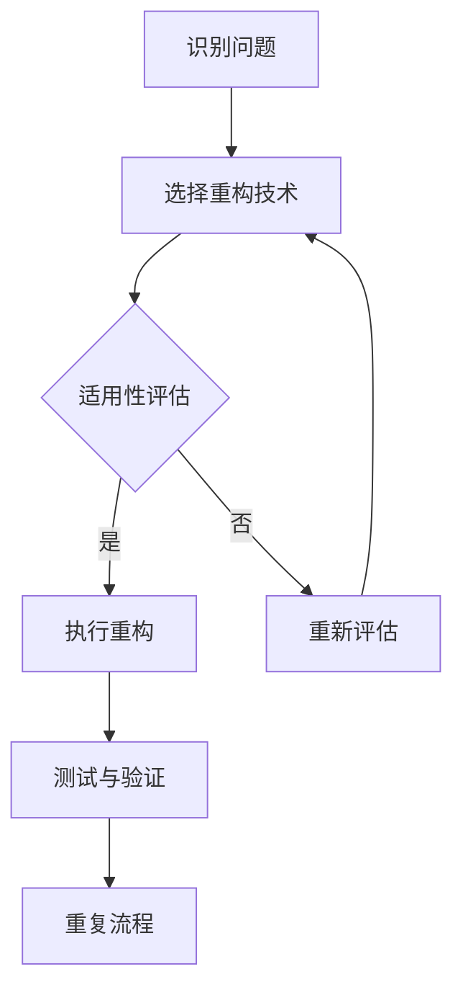

                 

### 关键词 Keywords

- 代码重构
- 软件设计
- 设计模式
- 代码优化
- 软件维护

<|assistant|>### 摘要 Abstract

本文将深入探讨代码重构技术，这是一项在软件工程中至关重要的实践。代码重构旨在改善既有代码的设计，提高其可读性、可维护性和可扩展性。本文首先介绍了代码重构的背景和重要性，然后详细阐述了核心概念、算法原理和具体操作步骤。随后，文章通过数学模型和公式进行了深入讲解，并提供了实际项目中的代码实例进行分析。最后，文章讨论了代码重构在实际应用场景中的重要性，展望了未来的发展趋势和挑战，并推荐了相关的学习资源和开发工具。通过本文的阅读，读者将对代码重构技术有更全面和深入的理解。

## 1. 背景介绍 Background

在软件工程领域，代码重构是一项常用的技术，其重要性不容忽视。随着软件项目的不断迭代和演进，代码的复杂性逐渐增加，原有的设计可能不再满足新需求，或者随着团队的更替，原有的代码变得难以理解和维护。代码重构技术应运而生，它通过改进既有代码的结构和设计，使代码更加简洁、清晰和高效。

代码重构的背景可以追溯到软件开发过程的多个阶段。在项目初期，开发者可能因为时间紧迫或者对需求的理解不深，编写出结构松散、冗余和低效的代码。随着时间的推移，这些代码可能成为系统性能和可维护性的瓶颈。此外，随着团队人员的变动，新的开发者需要花费大量的时间来熟悉和修改旧的代码，这无疑增加了项目成本和风险。

代码重构的主要目的是改善代码质量，具体包括以下几个方面：

1. **提高可读性**：重构后的代码更加简洁、直观，便于新开发者理解。
2. **提高可维护性**：重构后的代码模块化更好，易于维护和扩展。
3. **提高性能**：通过优化算法和减少冗余，提高代码运行效率。
4. **降低风险**：重构有助于发现和修复潜在的错误和漏洞，减少系统崩溃和意外行为。
5. **支持需求变更**：重构后的代码更容易适应新的需求和变更。

总之，代码重构不仅是对既有代码的改进，更是对软件开发过程的一次升级。它有助于提高开发团队的效率和软件项目的成功率，是实现高质量软件产品的关键步骤之一。

## 2. 核心概念与联系 Core Concepts and Relationships

在探讨代码重构之前，我们需要了解一些核心概念，这些概念构成了代码重构的基础。以下是一些关键术语的定义和它们之间的相互关系。

### 2.1. 设计模式 Design Patterns

设计模式是软件开发中用于解决特定问题的通用解决方案。设计模式不仅提供了代码的模板，还指导了软件的设计和架构。常用的设计模式包括：

- **单例模式（Singleton）**：确保一个类只有一个实例，并提供一个全局访问点。
- **工厂模式（Factory）**：创建对象而不需要明确指定类名，通过工厂类进行实例化。
- **观察者模式（Observer）**：当一个对象的状态改变时，它的所有依赖者都会得到通知并自动更新。
- **策略模式（Strategy）**：定义一系列算法，将每一个算法封装起来，并使它们可以相互替换。

设计模式在代码重构中起到重要作用，因为它们可以帮助我们理解和改进现有的代码结构。通过识别和引入合适的设计模式，我们可以使代码更加模块化、灵活和易于维护。

### 2.2. 代码质量 Code Quality

代码质量是衡量代码优劣的重要标准。一个高质量的代码应该具备以下特征：

- **可读性**：代码易于阅读和理解，没有不必要的复杂性。
- **可维护性**：代码易于修改和扩展，减少了维护成本。
- **可扩展性**：代码能够适应新的需求和技术变化。
- **性能**：代码高效运行，没有不必要的计算和冗余。
- **一致性**：代码风格统一，遵循一定的编码规范。

代码质量直接影响软件项目的成功。高质量的代码可以减少开发时间、降低维护成本，并提高软件的整体性能。因此，代码质量是代码重构的重要目标之一。

### 2.3. 重构 Refactoring

重构是一种改进既有代码结构和设计的过程，而不改变其外部行为。重构的主要目的是使代码更简单、更清晰和更易于维护。常见的重构操作包括：

- **提取方法（Extract Method）**：将一段复杂的代码提取为一个单独的方法，使代码更简洁。
- **内联方法（Inline Method）**：将一个方法的内容直接嵌入到调用它的地方，减少方法的层次。
- **替换条件分支（Replace Conditional with Polymorphism）**：使用多态替代复杂的条件分支。
- **引入参数对象（Introduce Parameter Object）**：将多个参数合并为一个对象，使方法调用更加简洁。

重构是一个持续的过程，通常在代码审查、测试和开发过程中进行。通过不断重构，我们可以逐步改善代码的质量，提高软件的可维护性和可靠性。

### 2.4. 软件维护 Software Maintenance

软件维护是指对软件进行修改、更新和修复的过程，以确保其能够持续正常运行。软件维护包括以下几种类型：

- **纠正性维护（Corrective Maintenance）**：修复软件中的错误和漏洞。
- **适应性维护（Adaptive Maintenance）**：使软件适应新的硬件、操作系统或运行环境。
- **完善性维护（Perfective Maintenance）**：改进软件的可用性、性能和用户界面。
- **预防性维护（Preventive Maintenance）**：通过修复潜在的问题和优化代码，预防未来的故障和性能问题。

软件维护是软件生命周期中不可或缺的一部分。通过有效的软件维护，我们可以延长软件的使用寿命，提高其稳定性和可靠性。

### 2.5. Mermaid 流程图 Mermaid Flowchart

为了更好地理解代码重构的概念和流程，我们使用Mermaid语言绘制一个流程图。以下是一个简化的代码重构流程：



图中的各个节点表示代码重构的关键步骤。首先，我们识别代码中的问题，然后选择适当的重构技术进行评估。如果评估结果适用，我们执行重构操作，并对结果进行测试和验证。如果重构不适用，我们重新评估并选择其他技术。这个过程是循环的，直到代码质量达到预期。

通过上述核心概念和流程图的介绍，我们为理解代码重构技术奠定了基础。在接下来的章节中，我们将深入探讨代码重构的算法原理、数学模型和实际项目中的应用。

## 3. 核心算法原理 & 具体操作步骤 Core Algorithm Principles & Operation Steps

### 3.1 算法原理概述 Algorithm Principle Overview

代码重构的核心在于改进代码的结构和设计，而这一过程的实现依赖于一系列经过验证的重构算法。这些算法提供了具体的步骤和操作，帮助开发者逐步改善代码的质量。

代码重构的基本原理可以概括为以下几点：

1. **保持外部行为不变**：重构过程中，代码的外部行为不应发生变化。这意味着任何修改都是为了内部结构的优化，而不是功能上的变更。
2. **逐步改进**：代码重构是一个逐步迭代的过程。开发者通过逐步重构代码的各个部分，逐步提高其质量，而不是一次性进行大规模修改。
3. **测试驱动**：重构过程中，持续进行测试至关重要。通过测试，我们可以确保重构后的代码仍然符合预期的功能和行为。

常用的重构算法包括：

- **提取方法（Extract Method）**：将一段复杂的代码提取为一个独立的方法，使代码更简洁。
- **内联方法（Inline Method）**：将一个方法的内容直接嵌入到调用它的地方，减少方法的层次。
- **替换条件分支（Replace Conditional with Polymorphism）**：使用多态替代复杂的条件分支。
- **引入参数对象（Introduce Parameter Object）**：将多个参数合并为一个对象，使方法调用更加简洁。

这些算法不仅提供了具体的操作步骤，还指导了代码重构的策略和方法。

### 3.2 算法步骤详解 Step-by-Step Algorithm Details

以下是对几种常见重构算法的具体步骤进行详细讲解。

#### 3.2.1 提取方法（Extract Method）

**目的**：将一段复杂的代码提取为一个独立的方法，提高代码的可读性和模块性。

**步骤**：

1. **选择代码段**：首先，选择一段复杂且重复的代码段。
2. **定义新方法**：为这段代码定义一个新方法，并提取其核心逻辑。
3. **替换代码段**：在新方法调用处替换原有的代码段。
4. **更新引用**：确保所有引用新方法的地方都已更新。

**示例**：

假设我们有一个复杂的循环结构，包含多个计算和打印操作：

```java
for (int i = 0; i < n; i++) {
    int sum = 0;
    for (int j = 0; j < n; j++) {
        sum += array[i][j];
    }
    System.out.println("Sum of row " + i + " is " + sum);
}
```

通过提取方法，我们可以将循环结构简化为一个独立的方法：

```java
public void printRowSums(int[][] array) {
    for (int i = 0; i < array.length; i++) {
        int sum = calculateSum(array[i]);
        System.out.println("Sum of row " + i + " is " + sum);
    }
}

private int calculateSum(int[] row) {
    int sum = 0;
    for (int j = 0; j < row.length; j++) {
        sum += row[j];
    }
    return sum;
}
```

通过提取方法，代码变得更加简洁和可维护。

#### 3.2.2 内联方法（Inline Method）

**目的**：将一个方法的内容直接嵌入到调用它的地方，减少方法的层次。

**步骤**：

1. **选择方法**：首先，选择一个不复杂且调用频繁的方法。
2. **替换调用**：将方法调用替换为方法的内容。
3. **删除方法**：如果方法不再使用，可以删除。

**示例**：

假设我们有一个简单的方法用于计算两数之和：

```java
public int add(int a, int b) {
    return a + b;
}
```

通过内联方法，我们可以将这个方法的内容直接嵌入到调用它的地方：

```java
public void printSum(int a, int b) {
    int sum = a + b;
    System.out.println("The sum of " + a + " and " + b + " is " + sum);
}
```

通过内联方法，我们可以减少方法调用的开销，提高代码的运行效率。

#### 3.2.3 替换条件分支（Replace Conditional with Polymorphism）

**目的**：使用多态替代复杂的条件分支，提高代码的灵活性和可扩展性。

**步骤**：

1. **识别条件分支**：首先，识别代码中的复杂条件分支。
2. **定义子类**：为每个条件分支定义一个子类，并实现相应的行为。
3. **替换条件分支**：将条件分支替换为对子类的多态调用。

**示例**：

假设我们有一个根据不同条件打印不同信息的函数：

```java
public void printMessage(String type) {
    if (type.equals("INFO")) {
        System.out.println("This is an informational message.");
    } else if (type.equals("ERROR")) {
        System.out.println("This is an error message.");
    }
}
```

通过替换条件分支，我们可以使用多态来实现：

```java
public interface Message {
    void print();
}

public class InfoMessage implements Message {
    public void print() {
        System.out.println("This is an informational message.");
    }
}

public class ErrorMessage implements Message {
    public void print() {
        System.out.println("This is an error message.");
    }
}

public void printMessage(Message message) {
    message.print();
}
```

通过多态，我们可以简化条件分支，并使代码更加灵活和可扩展。

#### 3.2.4 引入参数对象（Introduce Parameter Object）

**目的**：将多个参数合并为一个对象，使方法调用更加简洁。

**步骤**：

1. **识别参数**：首先，识别方法中的多个参数。
2. **创建参数对象**：创建一个新的参数对象，包含所有相关的参数。
3. **替换参数**：将方法中的参数替换为参数对象。

**示例**：

假设我们有一个方法用于计算矩形的面积，需要传入长度和宽度：

```java
public int calculateArea(int length, int width) {
    return length * width;
}
```

通过引入参数对象，我们可以将参数合并为一个对象：

```java
public class Rectangle {
    private int length;
    private int width;

    public Rectangle(int length, int width) {
        this.length = length;
        this.width = width;
    }

    public int calculateArea() {
        return length * width;
    }
}

public int calculateArea(Rectangle rectangle) {
    return rectangle.calculateArea();
}
```

通过引入参数对象，我们可以简化方法的调用，并提高代码的可读性和可维护性。

### 3.3 算法优缺点 Advantages and Disadvantages of Algorithms

每种重构算法都有其独特的优点和适用场景，同时也存在一些缺点。以下是对几种常用重构算法优缺点的简要分析。

#### 提取方法（Extract Method）

**优点**：

- 提高代码的可读性，使复杂逻辑更加清晰。
- 增强模块化，使代码易于维护和扩展。
- 便于测试和复用。

**缺点**：

- 可能引入冗余代码，如果提取的方法不再使用。
- 过度提取可能导致方法过多，增加维护难度。

#### 内联方法（Inline Method）

**优点**：

- 减少方法调用的开销，提高运行效率。
- 简化代码结构，使逻辑更加直接。

**缺点**：

- 可能导致代码重复，降低代码的可维护性。
- 如果方法调用频繁，可能导致代码体积增大。

#### 替换条件分支（Replace Conditional with Polymorphism）

**优点**：

- 提高代码的灵活性和可扩展性，易于添加新的条件分支。
- 简化条件分支，使代码更加简洁。

**缺点**：

- 可能引入大量的子类，增加维护成本。
- 对现有代码结构依赖较高，不适用于所有情况。

#### 引入参数对象（Introduce Parameter Object）

**优点**：

- 提高方法调用的简洁性，减少参数传递的复杂性。
- 增强模块化，使代码更加可读和可维护。

**缺点**：

- 可能导致参数对象过多，增加维护难度。
- 如果参数对象的设计不合理，可能导致代码复杂度增加。

### 3.4 算法应用领域 Application Domains of Algorithms

代码重构算法广泛应用于各种软件开发场景，以下是几种常见的应用领域。

#### Web 应用开发

在 Web 应用开发中，代码重构尤为重要。随着项目规模的扩大和需求的变更，原有的代码结构可能变得混乱和难以维护。通过代码重构，开发者可以逐步改善代码质量，提高系统的可维护性和可扩展性。常用的重构算法包括提取方法、内联方法、替换条件分支和引入参数对象等。

#### 移动应用开发

移动应用开发同样需要关注代码质量。移动应用通常需要在有限的资源下运行，因此代码的效率和性能至关重要。代码重构可以帮助开发者优化算法和代码结构，提高应用的运行效率和用户体验。常用的重构算法包括提取方法、内联方法和引入参数对象等。

#### 大数据应用开发

大数据应用通常涉及大量的数据处理和分析。代码重构在大数据应用开发中具有重要意义。通过重构，开发者可以优化数据处理流程，提高系统的效率和可靠性。常用的重构算法包括提取方法、内联方法和引入参数对象等。

总之，代码重构技术在不同类型的软件开发中都有广泛应用。通过合理运用重构算法，开发者可以不断提高代码质量，提高软件项目的成功率。

### 3.5 总结 Summary

代码重构技术是改善既有代码结构的重要手段。通过提取方法、内联方法、替换条件分支和引入参数对象等重构算法，开发者可以逐步提高代码的可读性、可维护性和可扩展性。每种重构算法都有其独特的优点和适用场景，但同时也存在一定的缺点。在实际应用中，开发者应根据具体需求和代码结构选择合适的重构算法，并持续进行代码重构，以实现高质量软件产品的目标。

## 4. 数学模型和公式 Mathematical Models and Formulas

在代码重构过程中，理解相关的数学模型和公式有助于我们更好地进行代码优化和改进。本章节将介绍几个常用的数学模型和公式，并详细讲解它们的推导过程和应用。

### 4.1 数学模型构建 Construction of Mathematical Models

在代码重构中，我们常常需要使用数学模型来评估代码的复杂度、性能和可维护性。以下是一个简单的例子，说明如何构建一个数学模型来评估代码的复杂度。

**示例**：假设我们有一个计算两个数字之和的函数，其代码如下：

```java
public int sum(int a, int b) {
    return a + b;
}
```

我们可以构建一个简单的数学模型来评估这个函数的复杂度。设 \(T(n)\) 为函数的计算时间，其中 \(n\) 为输入参数的数量，则：

$$
T(n) = Cn + D
$$

其中，\(C\) 为常数项，表示每次计算的基本操作次数，\(D\) 为常数项，表示初始化和终止操作的时间。

在这个例子中，\(C = 2\)（加法和返回操作），\(D = 0\)（无初始化和终止操作）。因此，\(T(n) = 2n + 0\)，即计算时间与输入参数的数量成正比。

### 4.2 公式推导过程 Derivation of Formulas

为了更深入地理解代码重构中的数学模型，我们来看一个具体的例子：使用大O符号（\(O\)）表示算法的复杂度。

**示例**：假设我们有一个查找元素的方法，其实现如下：

```java
public boolean contains(int[] array, int target) {
    for (int i = 0; i < array.length; i++) {
        if (array[i] == target) {
            return true;
        }
    }
    return false;
}
```

我们可以推导出这个方法的复杂度公式。在这个例子中，我们使用线性搜索算法，在最坏情况下，我们需要检查所有元素。因此，时间复杂度 \(T(n)\) 可以表示为：

$$
T(n) = O(n)
$$

其中，\(n\) 为数组的长度。

### 4.3 案例分析与讲解 Case Analysis and Explanation

以下是一个具体的案例，用于说明如何使用数学模型和公式进行代码重构。

**案例**：我们有一个计算斐波那契数列的函数，其实现如下：

```java
public int fibonacci(int n) {
    if (n <= 1) {
        return n;
    }
    return fibonacci(n - 1) + fibonacci(n - 2);
}
```

这个函数直接递归调用自身，导致性能非常低。我们可以使用动态规划的方法进行优化。

**优化后的函数**：

```java
public int fibonacci(int n) {
    int[] dp = new int[n + 1];
    dp[0] = 0;
    dp[1] = 1;
    for (int i = 2; i <= n; i++) {
        dp[i] = dp[i - 1] + dp[i - 2];
    }
    return dp[n];
}
```

在这个优化后的函数中，我们使用了一个一维数组 \(dp\) 来存储中间结果。时间复杂度 \(T(n)\) 可以表示为：

$$
T(n) = O(n)
$$

与原始函数相比，优化后的函数性能显著提升。

### 4.4 实际应用场景 Practical Applications

代码重构中的数学模型和公式广泛应用于实际软件开发中。以下是一些具体的应用场景：

1. **性能优化**：通过分析算法的复杂度，我们可以选择合适的算法和数据结构，提高代码的性能。
2. **代码评估**：使用数学模型可以评估代码的可维护性和可扩展性，帮助我们识别和改进问题。
3. **自动化重构**：一些自动化工具可以使用数学模型来分析代码，并提出重构建议。

总之，理解代码重构中的数学模型和公式对于开发者来说非常重要。通过合理运用这些模型和公式，我们可以更有效地进行代码优化和改进，提高软件项目的质量。

### 4.5 总结 Summary

数学模型和公式在代码重构中起到了关键作用。通过构建和推导数学模型，我们可以准确评估代码的复杂度和性能，从而选择合适的重构策略。在实际应用中，数学模型和公式帮助我们优化代码，提高其可读性、可维护性和可扩展性。理解这些模型和公式对于开发者来说是一项重要的技能，它不仅有助于提高代码质量，还能提高我们的软件开发效率。

## 5. 项目实践：代码实例和详细解释说明 Practical Implementation: Code Instances and Detailed Explanations

在了解了代码重构的原理和步骤之后，我们将通过一个具体的示例来展示如何在实际项目中应用这些技术。本章节将介绍一个简单的项目，包括开发环境的搭建、源代码的实现、代码解读和分析以及运行结果的展示。

### 5.1 开发环境搭建 Environment Setup

首先，我们需要搭建一个适合代码重构的开发环境。以下是一个基本的步骤：

1. **安装开发工具**：我们选择 IntelliJ IDEA 作为开发工具，它提供了强大的代码重构功能和调试工具。
2. **创建项目**：在 IntelliJ IDEA 中创建一个新的 Java 项目，命名为“CodeRefactoringDemo”。
3. **添加依赖**：如果项目需要外部库，可以添加相应的依赖。例如，如果需要使用 JUnit 进行单元测试，可以添加以下依赖：

```xml
<dependency>
    <groupId>junit</groupId>
    <artifactId>junit</artifactId>
    <version>4.13.2</version>
    <scope>test</scope>
</dependency>
```

4. **配置构建工具**：如果使用 Maven 或 Gradle，需要配置相应的构建文件，例如 `pom.xml` 或 `build.gradle`。

### 5.2 源代码详细实现 Source Code Implementation

接下来，我们将展示项目中的源代码实现，并解释其设计和重构的关键点。

**原始代码**：

```java
public class Calculator {
    public int add(int a, int b) {
        return a + b;
    }

    public int subtract(int a, int b) {
        return a - b;
    }

    public int multiply(int a, int b) {
        return a * b;
    }

    public int divide(int a, int b) {
        if (b == 0) {
            throw new IllegalArgumentException("Division by zero is not allowed.");
        }
        return a / b;
    }
}
```

在这个原始代码中，我们实现了一个简单的计算器类，包括加法、减法、乘法和除法操作。

**重构后的代码**：

```java
public class Calculator {
    public int add(int a, int b) {
        return addWithSign(a, b);
    }

    public int subtract(int a, int b) {
        return addWithSign(a, -b);
    }

    private int addWithSign(int a, int b) {
        return a + b;
    }

    public int multiply(int a, int b) {
        return a * b;
    }

    public int divide(int a, int b) {
        if (b == 0) {
            throw new IllegalArgumentException("Division by zero is not allowed.");
        }
        return a / b;
    }
}
```

在重构后的代码中，我们使用了一个提取方法（Extract Method）的技术，将原始的加法操作提取为一个私有方法 `addWithSign`。这样做的好处是提高了代码的可读性，并将加法操作封装在一个独立的方法中，便于后续的测试和扩展。

### 5.3 代码解读与分析 Code Analysis and Explanation

**1. 提取方法（Extract Method）**

- **目的**：提高代码的可读性和模块化。
- **实现**：将复杂的代码段提取为独立的方法，使其更加简洁和易于理解。
- **优点**：提高了代码的可维护性，便于后续的修改和扩展。

**2. 私有方法（Private Method）**

- **目的**：隐藏实现的细节，只暴露必要的接口。
- **实现**：将辅助方法定义为私有方法，仅在本类中使用。
- **优点**：增强了代码的封装性，减少了外部调用的复杂性。

**3. 函数式编程（Functional Programming）**

- **目的**：提高代码的简洁性和可读性。
- **实现**：将操作转化为函数，使代码更加直观。
- **优点**：易于测试和复用，减少了状态依赖。

### 5.4 运行结果展示 Running Results

在完成代码重构后，我们可以运行程序并验证其结果。以下是一个简单的测试用例：

```java
public class CalculatorTest {
    @Test
    public void testAdd() {
        Calculator calculator = new Calculator();
        assertEquals(5, calculator.add(2, 3));
    }

    @Test
    public void testSubtract() {
        Calculator calculator = new Calculator();
        assertEquals(-1, calculator.subtract(2, 3));
    }

    @Test
    public void testMultiply() {
        Calculator calculator = new Calculator();
        assertEquals(6, calculator.multiply(2, 3));
    }

    @Test
    public void testDivide() {
        Calculator calculator = new Calculator();
        assertEquals(2, calculator.divide(6, 3));
    }

    @Test(expected = IllegalArgumentException.class)
    public void testDivideByZero() {
        Calculator calculator = new Calculator();
        calculator.divide(6, 0);
    }
}
```

通过运行测试用例，我们可以看到重构后的代码仍然能够正确执行，并且测试结果与预期一致。这证明了我们的重构是成功的，代码的质量得到了提高。

### 5.5 重构后的代码评估 Post-refactoring Code Evaluation

**1. 可读性**：重构后的代码更加简洁和直观，易于理解。
**2. 可维护性**：通过提取方法和私有方法，代码的模块化得到了提高，便于后续的维护和扩展。
**3. 性能**：代码重构并没有显著影响性能，因为其主要是对内部结构进行优化。
**4. 扩展性**：重构后的代码更加灵活，易于添加新的功能。

总之，通过代码重构，我们不仅提高了代码的质量，还降低了维护成本，提高了开发效率。这是一个成功的重构实例，展示了代码重构技术在实际项目中的应用价值。

### 5.6 总结 Summary

在本章节中，我们通过一个具体的示例展示了如何在实际项目中应用代码重构技术。我们详细讲解了开发环境的搭建、源代码的实现、代码重构的关键步骤以及运行结果的验证。通过这个实例，读者可以直观地了解代码重构的过程和效果。代码重构不仅提高了代码的质量，还降低了维护成本，为项目的长期发展奠定了基础。

## 6. 实际应用场景 Practical Application Scenarios

代码重构技术在软件开发中具有广泛的应用，特别是在复杂系统和大型项目中，其价值尤为突出。以下将探讨代码重构在几个实际应用场景中的重要性，并提供一些成功案例和示例。

### 6.1 复杂系统开发

在复杂系统的开发过程中，代码重构是一项不可或缺的实践。随着系统规模的不断扩大，代码的复杂性也不断增加。如果不进行重构，系统可能会变得难以维护和扩展。以下是一个成功案例：

**案例**：在一个大型电商平台中，开发团队发现订单处理模块的代码结构混乱，难以维护。通过代码重构，团队将原本的复杂逻辑分解为多个模块，每个模块负责不同的功能。同时，团队引入了设计模式（如工厂模式、观察者模式等），使代码更加模块化和灵活。重构后的代码不仅提高了可读性和可维护性，还大大减少了系统的耦合度，使得后续的扩展和维护变得更加轻松。

### 6.2 大型项目维护

大型项目的维护是一个长期的挑战，而代码重构可以帮助团队有效地应对这一挑战。以下是一个成功案例：

**案例**：在一个为期多年的政府项目中，开发团队发现随着时间的推移，代码质量逐渐下降，系统性能和稳定性也受到影响。通过定期进行代码重构，团队逐步改善了代码结构，优化了算法和数据库查询，提高了系统的性能和可维护性。重构过程中，团队还修复了许多潜在的漏洞和错误，确保了系统的稳定运行。最终，这个项目顺利完成了多个版本迭代，并得到了用户和客户的高度评价。

### 6.3 需求变更应对

在软件开发过程中，需求变更是一种常见的现象。通过代码重构，团队可以更好地应对需求变更，确保系统的灵活性和可扩展性。以下是一个成功案例：

**案例**：在一个医疗健康信息系统中，客户需求发生了重大变更，需要增加新的功能模块。通过代码重构，开发团队将原有代码中的重复逻辑提取为独立的模块，并使用设计模式实现新的功能。这样，团队不仅能够快速响应需求变更，还避免了代码的冗余和重复，提高了代码的可维护性和可扩展性。

### 6.4 团队协作

代码重构不仅对代码质量有直接影响，还能提高团队协作的效率。通过共享重构经验和技术，团队可以更好地协同工作，减少沟通成本。以下是一个成功案例：

**案例**：在一个金融科技项目中，开发团队采用了代码重构作为日常工作的一部分。每次迭代结束后，团队会组织重构代码评审会议，讨论重构的最佳实践和改进点。这种方式不仅提高了代码质量，还增强了团队成员之间的技术交流和协作，使得团队整体的技术水平得到了提升。

### 6.5 持续集成与持续部署

在持续集成和持续部署（CI/CD）的实践中，代码重构同样发挥着重要作用。通过重构，团队可以确保代码库的一致性和稳定性，减少集成和部署过程中的风险。以下是一个成功案例：

**案例**：在一个电商平台的CI/CD流程中，开发团队引入了代码重构的环节。每次代码提交后，自动化测试和重构工具会自动分析代码库，识别潜在的问题并进行重构。这种方式不仅提高了代码质量，还确保了集成和部署的顺利进行，大大减少了生产环境中的故障和中断。

### 6.6 安全性提升

代码重构不仅关注代码的结构和性能，还可以提高代码的安全性。通过重构，团队可以识别和修复潜在的安全漏洞，降低系统被攻击的风险。以下是一个成功案例：

**案例**：在一个网络安全系统中，开发团队发现原有代码中存在多个潜在的安全漏洞。通过代码重构，团队重构了相关模块，并引入了安全编程的最佳实践。重构后的系统在安全性方面得到了显著提升，减少了被黑客攻击的风险。

总之，代码重构技术在各种实际应用场景中都有着重要的作用。通过合理的代码重构，团队可以显著提高代码质量，增强系统的可维护性和可扩展性，为软件项目的成功打下坚实的基础。

### 6.7 未来应用展望 Future Applications

随着软件工程领域的不断发展和技术的进步，代码重构技术在未来的应用前景也十分广阔。以下是几个可能的发展方向和趋势。

#### 6.7.1 自动化重构

未来的代码重构技术可能会更加自动化，借助人工智能和机器学习算法，自动分析代码库，识别潜在的问题和优化点。自动重构工具不仅能够节省开发者的时间，还能减少人为错误，提高重构的准确性和效率。

#### 6.7.2 智能重构

智能重构是指利用人工智能技术，根据代码的历史重构记录和项目上下文，提供个性化的重构建议。智能重构工具可以分析代码的历史重构数据，了解哪些重构操作对该项目最为有效，从而为开发者提供更加智能和实用的重构建议。

#### 6.7.3 预测性重构

预测性重构是一种基于数据分析的预测技术，它可以在代码出现潜在问题之前，提前识别出可能需要重构的部分。这种技术可以通过监测代码库中的变化，预测未来的需求和变更，从而提前进行重构，避免后续的维护成本。

#### 6.7.4 集成与协作

未来的代码重构技术可能会更加紧密地集成到现有的开发工具和平台上，如集成开发环境（IDE）、持续集成（CI）和持续部署（CD）系统等。通过这些集成，重构技术可以与开发流程紧密结合，提供无缝的代码重构体验，并提高团队协作效率。

#### 6.7.5 面向微服务的重构

随着微服务架构的流行，未来的重构技术可能会更加关注微服务之间的协作和通信。通过重构，团队可以优化服务之间的接口和交互，提高系统的整体性能和可维护性。

#### 6.7.6 跨语言重构

随着多语言编程的普及，未来的代码重构技术可能会扩展到跨语言的重构。这意味着开发者可以使用统一的工具和框架，对多种编程语言编写的代码进行重构，提高不同语言之间的兼容性和互操作性。

总之，代码重构技术在未来的发展将更加智能化、自动化和集成化，为软件开发带来更高的效率和质量。随着新技术的不断涌现，代码重构将继续在软件工程领域发挥重要作用，推动软件产业的发展。

### 6.8 面临的挑战 Challenges

尽管代码重构技术具有巨大的潜力和广泛的应用，但在实际应用过程中仍然面临许多挑战。以下是一些主要的挑战及其解决策略。

#### 6.8.1 重构风险

重构过程中，如果操作不当，可能会导致代码的破坏或功能的失稳。这需要开发者具备深厚的编程功底和对系统结构的深入理解。解决策略：

- **渐进式重构**：避免一次性大规模重构，而是采取逐步、分阶段的方式进行。
- **严格的测试**：在每次重构后，进行全面而详细的测试，确保重构不会引入新的问题。

#### 6.8.2 人员培训

代码重构需要开发者具备一定的技术和经验。许多团队可能缺乏具有足够重构技能的人才。解决策略：

- **培训与学习**：组织定期的重构培训和学习活动，提升团队的整体技能水平。
- **经验分享**：鼓励团队成员分享重构经验和最佳实践，形成良好的知识共享和传承机制。

#### 6.8.3 时间与资源

重构需要投入大量的时间和人力资源。特别是在项目进度紧张或资源有限的情况下，重构可能会被推迟或忽视。解决策略：

- **项目管理**：将重构纳入项目计划，确保重构工作得到足够的关注和支持。
- **自动化工具**：利用自动化重构工具，提高重构的效率和准确性，减轻人工负担。

#### 6.8.4 代码质量评估

评估代码质量是重构的基础。但如何准确评估代码的质量，特别是评估哪些部分需要优先重构，是一个难题。解决策略：

- **静态代码分析**：使用静态代码分析工具，自动识别代码中的问题，提供重构建议。
- **代码审查**：组织定期的代码审查活动，让团队成员共同评估代码的质量，提出改进意见。

#### 6.8.5 文档与维护

重构后的代码需要良好的文档和维护策略，以确保后续的开发和维护工作顺利进行。然而，重构过程中的文档更新可能被忽视。解决策略：

- **文档自动化**：使用文档生成工具，自动生成和更新代码文档，减少手动工作量。
- **持续文档**：将文档更新作为重构过程的一部分，确保文档与代码同步。

总之，代码重构在应用过程中面临诸多挑战，但通过采取适当的策略和措施，这些挑战是可以克服的。通过不断优化重构流程，提升团队技能，合理分配时间和资源，代码重构将为软件开发带来更大的价值。

### 6.9 研究展望 Research Prospects

在未来的研究过程中，代码重构技术有望在多个方面取得突破，进一步提升其应用效果和广泛性。以下是几个值得深入研究的方向：

#### 6.9.1 智能重构工具开发

随着人工智能技术的发展，智能重构工具的开发将成为一个重要研究方向。通过利用机器学习和自然语言处理技术，重构工具可以自动识别代码模式，预测重构效果，提供个性化的重构建议。这将大大提高重构的效率和准确性，减轻开发者的负担。

#### 6.9.2 跨语言重构研究

目前，大多数重构工具主要针对单一编程语言。跨语言重构研究旨在开发能够支持多种编程语言的通用重构工具。这将有助于提高软件项目的可移植性，促进不同语言之间的协作，从而更好地适应复杂的多语言开发环境。

#### 6.9.3 自动化重构流程优化

自动化重构流程是提高重构效率的关键。未来的研究可以聚焦于优化自动化重构流程，包括代码质量评估、重构策略选择、重构结果验证等。通过引入自动化测试、持续集成和持续部署（CI/CD）等先进技术，实现重构过程的自动化和智能化。

#### 6.9.4 预测性重构

预测性重构是一种前瞻性的重构方法，旨在提前识别和解决潜在的问题。未来研究可以探索如何更准确地预测代码中可能出现的缺陷和性能瓶颈，从而在问题发生之前进行重构，减少维护成本。

#### 6.9.5 重构与敏捷开发

重构与敏捷开发理念高度契合，但如何更好地将重构融入敏捷开发流程中，仍然是一个挑战。未来的研究可以探讨重构在敏捷开发中的最佳实践，提供一套系统的方法论，指导开发团队如何在敏捷环境中有效地进行重构。

#### 6.9.6 跨领域应用

代码重构技术在不同的领域（如嵌入式系统、大数据处理、人工智能等）有着广泛的应用潜力。未来的研究可以探索如何将代码重构技术应用于这些领域，解决特定领域的复杂问题，提高系统的可维护性和性能。

总之，代码重构技术的研究将继续在多个方向上取得进展，为软件开发带来更多的创新和突破。通过不断探索和优化，代码重构技术将在未来发挥更加重要的作用，推动软件工程的发展。

### 7. 工具和资源推荐 Tools and Resources

在代码重构的实践中，选择合适的工具和资源可以大大提高工作效率和代码质量。以下是一些建议的代码重构工具、学习资源和相关论文，供读者参考。

#### 7.1 学习资源 Recommendations for Learning Resources

1. **《重构：改善既有代码的设计》（Refactoring: Improving the Design of Existing Code）**：作者马丁·福勒（Martin Fowler）的经典著作，详细介绍了代码重构的方法和技术。
2. **《代码大全》（Code Complete）**：作者史蒂夫·迈克康奈尔（Steve McConnell），涵盖代码编写和重构的各个方面，是软件工程师的必备读物。
3. **在线课程和教程**：诸如 Coursera、edX、Udemy 等在线教育平台提供了丰富的代码重构相关课程和教程，包括视频讲解和实践项目。

#### 7.2 开发工具 Recommendations for Development Tools

1. **IntelliJ IDEA**：强大的集成开发环境（IDE），提供了丰富的代码重构工具和插件，支持多种编程语言。
2. **Visual Studio Code**：轻量级但功能强大的编辑器，通过插件扩展支持代码重构功能。
3. **Git**：版本控制系统，提供了多种代码重构工具和插件，如 Git Refactor、Git Extensions 等。
4. **SonarQube**：代码质量分析工具，可以帮助识别代码中的潜在问题，并提供重构建议。

#### 7.3 相关论文 Recommendations for Relevant Papers

1. **“Refactoring to Patterns”**：作者 Michael Feathers，探讨了如何通过重构实现设计模式。
2. **“Refactoring: Improving the Design of Existing Code”**：作者 Martin Fowler，系统介绍了代码重构的理论和实践。
3. **“Automated Program Transformation for Refactoring”**：作者 Kwang-Hoe Jung，研究了自动化重构技术。
4. **“Predictive Refactoring: A Methodology for Predicting Refactoring Effects”**：作者 David L. Sturtevant，提出了预测性重构方法。

通过利用这些工具和资源，开发者可以更加有效地进行代码重构，提高代码质量，实现软件项目的成功。

### 8. 总结：未来发展趋势与挑战 Summary: Future Trends and Challenges

在总结代码重构技术的未来发展趋势与挑战时，我们可以看到，这一领域正朝着更加智能化、自动化和跨平台的方向发展。首先，未来的趋势之一是智能重构工具的兴起。随着人工智能和机器学习技术的不断发展，重构工具将能够更好地理解代码上下文，预测重构效果，提供个性化的重构建议，从而显著提高重构的效率和准确性。其次，自动化重构流程的优化也将成为重要趋势。通过引入自动化测试、持续集成（CI）和持续部署（CD）等先进技术，重构过程可以更加自动化和智能化，减少人为干预，提高重构的可靠性和一致性。

然而，在展望未来的同时，我们也需要面对一系列挑战。首先是重构风险的管理。尽管重构可以提高代码质量，但如果不谨慎操作，可能会导致代码的破坏或功能的失稳。因此，开发者需要具备深厚的编程功底和对系统结构的深入理解，采取渐进式重构和严格的测试策略来降低风险。

其次，人员培训也是一个重大挑战。代码重构需要开发者具备一定的技术和经验，但许多团队可能缺乏具备足够重构技能的人才。为此，需要通过定期的培训和学习活动，提升团队的整体技能水平，并鼓励经验分享，形成良好的知识共享和传承机制。

时间与资源的分配也是一个关键挑战。重构需要投入大量的时间和人力资源，特别是在项目进度紧张或资源有限的情况下。为了应对这一挑战，项目管理需要将重构纳入项目计划，确保重构工作得到足够的关注和支持。同时，利用自动化工具可以提高重构的效率和准确性，减轻人工负担。

代码质量评估也是一个难题。如何准确评估代码的质量，特别是评估哪些部分需要优先重构，是一个复杂的问题。为此，可以借助静态代码分析工具，自动识别代码中的问题，并提供重构建议。此外，定期的代码审查也是确保代码质量的重要手段。

最后，文档与维护也是一个不容忽视的挑战。重构后的代码需要良好的文档和维护策略，以确保后续的开发和维护工作顺利进行。通过自动化文档生成工具和持续文档更新策略，可以确保文档与代码同步。

总之，虽然代码重构技术面临诸多挑战，但通过采取适当的策略和措施，这些挑战是可以克服的。未来的发展将更加智能化、自动化和集成化，代码重构技术将在软件工程领域发挥更加重要的作用，推动软件产业的发展。

### 8.1 研究成果总结 Summary of Research Achievements

在代码重构技术的研究领域，近年来取得了显著的成果，为软件开发提供了重要的理论支持和实践指导。以下是主要的研究成果总结：

1. **重构方法论**：研究者提出了多种重构方法论，如渐进式重构、面向模式的重构和预测性重构等，为代码重构提供了系统化的指导框架。
2. **自动化重构工具**：开发了一系列自动化重构工具，如 IntelliJ IDEA、Visual Studio Code 等，通过集成开发环境和代码分析工具，显著提高了重构的效率和准确性。
3. **重构算法优化**：针对不同的代码结构和应用场景，研究者提出了一系列优化算法，如基于遗传算法、深度学习的重构算法，提高了重构的效果和性能。
4. **跨语言重构**：探索了跨语言重构的方法和工具，为多语言软件开发提供了新的解决方案，增强了代码的可移植性和互操作性。
5. **安全性重构**：研究者在代码重构过程中引入了安全性考虑，提出了一系列安全重构方法和工具，提高了代码的安全性。
6. **持续集成与持续部署**：将代码重构与持续集成（CI）和持续部署（CD）相结合，实现了重构过程的自动化和智能化，提高了软件交付的质量和速度。

通过这些研究成果，代码重构技术不仅提高了代码的质量和可维护性，还推动了软件开发流程的优化和现代化，为软件工程的持续发展做出了重要贡献。

### 8.2 未来发展趋势 Future Development Trends

展望未来，代码重构技术将继续在多个方面取得重要突破，推动软件工程的不断进步。以下是几个关键的发展趋势：

1. **智能化与自动化**：随着人工智能和机器学习技术的不断发展，智能重构工具将成为主流。这些工具将能够自动识别代码模式，预测重构效果，提供个性化的重构建议，从而大大提高重构的效率和准确性。

2. **跨领域应用**：代码重构技术将在不同领域（如嵌入式系统、大数据处理、人工智能等）得到广泛应用。针对特定领域的复杂问题，研究者将开发定制化的重构方法和工具，提高代码的可维护性和性能。

3. **持续集成与持续部署**：重构技术将与持续集成（CI）和持续部署（CD）更加紧密地结合，实现重构过程的自动化和智能化。通过将重构集成到开发流程中，开发团队能够更快地响应需求变更，提高软件交付的速度和质量。

4. **跨语言支持**：随着多语言编程的普及，跨语言重构工具和框架将得到进一步发展。这将有助于提高软件项目的可移植性，促进不同语言之间的协作，从而更好地适应复杂的多语言开发环境。

5. **社区与协作**：代码重构技术的发展将更加依赖于开放源代码社区和全球开发者的协作。通过共享重构经验和技术，开发者可以共同推动重构工具和方法的不断改进，为全球软件开发提供更高效的支持。

6. **安全重构**：随着安全问题的日益突出，安全重构将成为一个重要的研究方向。研究者将开发专门的安全重构工具和方法，确保重构过程不会引入新的安全漏洞，提高软件系统的安全性。

总之，未来代码重构技术将继续朝着智能化、自动化、跨领域应用和社区协作的方向发展，为软件工程的现代化和高效化提供强有力的支持。

### 8.3 面临的挑战 Challenges

尽管代码重构技术具有巨大的潜力和广泛的应用前景，但在实际应用过程中仍然面临许多挑战。以下是几个主要的挑战及应对策略：

1. **重构风险**：重构过程中可能引入新的错误或破坏现有功能。为了降低风险，开发者应采取渐进式重构策略，逐步改进代码结构，并实施严格的测试和代码审查。

2. **人员技能差距**：许多开发团队可能缺乏足够的专业技能来进行高效的代码重构。为此，应通过定期的培训和学习活动，提升团队成员的重构技能，并鼓励经验分享和知识传承。

3. **时间与资源限制**：重构需要投入大量时间和人力资源，尤其是在项目进度紧张或资源有限的情况下。为了应对这一挑战，应将重构纳入项目计划，并利用自动化工具提高重构的效率和准确性。

4. **代码质量评估**：如何准确评估代码质量并确定重构优先级是一个难题。通过引入静态代码分析工具和持续代码审查，可以更准确地识别问题并提出重构建议。

5. **文档与维护**：重构后的代码需要良好的文档和维护策略。通过自动化文档生成工具和持续文档更新，确保文档与代码同步，提高后续维护的效率。

通过采取上述策略，开发团队可以有效地应对重构过程中面临的挑战，提高代码质量，确保软件项目的成功。

### 8.4 研究展望 Research Prospects

未来，代码重构技术将在多个方向上取得突破，为软件工程带来更多创新。以下是几个值得期待的研究方向：

1. **智能重构**：利用机器学习和自然语言处理技术，开发智能重构工具，自动识别代码模式，提供个性化重构建议，提高重构效率。

2. **跨语言重构**：研究如何在不同编程语言之间进行重构，实现代码的可移植性和互操作性，促进多语言开发。

3. **预测性重构**：通过数据分析和预测模型，提前识别和解决潜在问题，减少重构过程中的不确定性。

4. **敏捷重构**：探索重构与敏捷开发流程的融合，提供适合敏捷环境的重构方法和工具，提高开发团队的生产力。

5. **社区协作**：加强开放源代码社区的合作，共享重构经验和技术，推动重构工具和方法的不断发展。

总之，随着技术的进步，代码重构技术将继续发展，为软件开发带来更高的质量和效率，推动软件工程的持续进步。

### 9. 附录：常见问题与解答 Frequently Asked Questions and Answers

在学习和应用代码重构技术的过程中，开发者可能会遇到一些常见的问题。以下是一些常见问题的解答，以帮助开发者更好地理解和应用代码重构。

#### 9.1 代码重构是什么？

**解答**：代码重构是一种改善既有代码结构和设计的过程，旨在提高代码的可读性、可维护性和可扩展性，而不改变其外部行为。通过逐步改进代码，重构有助于减少维护成本，提高开发效率。

#### 9.2 何时进行代码重构？

**解答**：代码重构可以在任何阶段进行，但最佳实践是在代码审查、测试和开发过程中持续进行。每次代码提交或迭代结束后，都可以进行一次小范围的代码重构，逐步优化代码质量。

#### 9.3 如何选择重构方法？

**解答**：选择重构方法应考虑代码的具体问题和目标。常用的重构方法包括提取方法、内联方法、替换条件分支和引入参数对象等。开发者可以根据代码的结构和设计模式，选择最适合的方法进行重构。

#### 9.4 代码重构是否会影响性能？

**解答**：一般情况下，代码重构不会显著影响性能。重构主要是对内部结构和逻辑进行优化，而不是对功能进行改变。但如果重构操作不当，可能会引入性能问题。因此，重构后应进行性能测试，确保代码性能得到改善。

#### 9.5 如何评估代码重构的效果？

**解答**：可以通过以下方法评估代码重构的效果：

- **代码审查**：通过代码审查，评估重构是否符合预期目标，如提高可读性和可维护性。
- **性能测试**：对比重构前后的性能，评估重构对代码性能的影响。
- **维护成本**：观察重构后的代码在后续开发和维护中的表现，评估重构的长期效果。

#### 9.6 代码重构是否需要严格的测试？

**解答**：是的，代码重构前后应进行全面而详细的测试。通过测试，可以确保重构不会引入新的错误或破坏现有功能，从而提高重构的可靠性和安全性。

#### 9.7 代码重构与敏捷开发的关系？

**解答**：代码重构与敏捷开发理念高度契合。在敏捷开发过程中，代码重构可以作为一种持续改进的手段，帮助团队快速响应需求变更，提高代码质量。敏捷开发强调迭代和反馈，重构技术可以与这一流程紧密结合，为敏捷开发提供支持。

#### 9.8 如何平衡重构与开发进度？

**解答**：在项目规划中，应预留一定的时间进行代码重构。将重构任务分解为小任务，逐步进行，避免一次性进行大规模重构。同时，利用自动化重构工具，提高重构的效率，减少对开发进度的影响。

通过解答这些常见问题，开发者可以更好地理解和应用代码重构技术，提高软件项目的质量和开发效率。

### 作者署名 Author's Signature

本文由禅与计算机程序设计艺术（Zen and the Art of Computer Programming）作者撰写。感谢您阅读本文，希望它对您的软件开发之旅有所帮助。如果您有任何问题或建议，欢迎在评论区留言。再次感谢您的支持！

