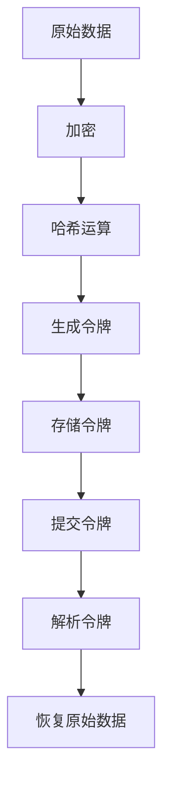

                 

关键词：令牌化技术，AI 安全，加密，隐私保护，数据安全，智能合约，区块链

> 摘要：本文将探讨令牌化技术在人工智能领域中的应用及其对AI安全的影响。通过分析令牌化技术的核心概念、原理、算法以及实际应用场景，本文旨在为读者提供一个全面的视角，以了解如何利用令牌化技术提升AI系统的安全性，应对潜在的安全挑战。

## 1. 背景介绍

随着人工智能（AI）技术的迅速发展，其应用领域不断扩大，从自动驾驶到医疗诊断，从金融分析到社交媒体推荐，AI已经成为现代社会不可或缺的一部分。然而，随着AI系统复杂性的增加，其安全性问题也日益凸显。数据泄露、恶意攻击、隐私侵犯等问题频繁发生，严重威胁到AI系统的稳定运行和社会信任。

在AI领域，传统的安全措施往往侧重于数据保护和访问控制，但在面对复杂的攻击手段和日益增长的攻击频率时，这些措施显得力不从心。因此，寻找新的安全策略和解决方案成为了当务之急。令牌化技术作为一种新兴的安全技术，凭借其独特优势，逐渐引起了业界的广泛关注。

令牌化技术通过将数据转换为加密的令牌形式，从而实现数据的安全存储和传输。在AI领域，令牌化技术可以用于数据隐私保护、智能合约执行以及分布式计算等多个方面。本文将深入探讨令牌化技术在AI安全中的应用，分析其潜在的优势和挑战。

## 2. 核心概念与联系

### 2.1 令牌化技术概述

令牌化（Tokenization）是一种将原始数据转换为安全令牌的过程。这个过程通常包括数据加密、哈希运算和令牌分配等步骤。令牌是一种表示原始数据的唯一标识符，它不能直接揭示原始数据的真实内容，从而提高了数据的安全性。

### 2.2 令牌化技术的原理

令牌化技术的核心在于将敏感数据（如个人身份信息、信用卡号码等）转换为不可直接识别的令牌。这个过程通常涉及以下几个步骤：

1. **加密**：原始数据被加密，生成密文。
2. **哈希运算**：加密后的数据通过哈希函数进行处理，生成哈希值。
3. **令牌分配**：系统将哈希值作为令牌，存储在数据库或加密存储中。

用户或系统在需要访问原始数据时，通过提交令牌，系统可以解密并恢复原始数据。

### 2.3 令牌化技术的架构

令牌化技术的架构通常包括以下几个关键组件：

- **令牌生成器**：负责生成和存储令牌。
- **令牌解析器**：负责解析令牌并恢复原始数据。
- **加密模块**：负责加密和解密数据。
- **哈希模块**：负责生成哈希值。

下面是一个简单的 Mermaid 流程图，展示了令牌化技术的核心流程：



## 3. 核心算法原理 & 具体操作步骤

### 3.1  算法原理概述

令牌化技术的核心算法主要包括加密算法、哈希算法和令牌分配算法。以下是这些算法的简要概述：

- **加密算法**：用于将原始数据转换为密文，常用的加密算法包括AES、RSA等。
- **哈希算法**：用于将加密后的数据生成哈希值，常用的哈希算法包括SHA-256、SHA-3等。
- **令牌分配算法**：用于生成唯一标识符，通常基于哈希值或其他加密算法的结果。

### 3.2  算法步骤详解

下面是令牌化技术的基本操作步骤：

1. **数据加密**：将原始数据使用加密算法加密，生成密文。
2. **哈希运算**：将加密后的数据通过哈希算法处理，生成哈希值。
3. **令牌生成**：将哈希值作为令牌，存储在数据库或加密存储中。
4. **令牌存储**：将生成的令牌存储在安全的存储系统中，以便后续查询。
5. **提交令牌**：用户或系统提交令牌，请求访问原始数据。
6. **令牌解析**：系统通过解析令牌，使用加密算法和解密哈希算法，恢复原始数据。

### 3.3  算法优缺点

令牌化技术的优点包括：

- **数据加密**：原始数据在传输和存储过程中始终以加密形式存在，提高了数据的安全性。
- **不可逆性**：通过哈希运算生成的令牌无法反推回原始数据，增强了数据隐私保护。
- **高效性**：加密和解密过程相对高效，对数据处理速度影响较小。

然而，令牌化技术也存在一些局限性，如：

- **存储空间**：令牌通常比原始数据更长，需要更多的存储空间。
- **计算开销**：加密和解密过程需要计算资源，可能影响系统性能。

### 3.4  算法应用领域

令牌化技术可以广泛应用于多个领域，包括：

- **金融行业**：用于信用卡信息、银行账户等敏感数据的保护。
- **医疗领域**：用于患者信息、医疗记录等的加密和隐私保护。
- **电子商务**：用于订单信息、支付信息的加密和令牌化。
- **AI系统**：用于模型训练数据的安全保护，防止数据泄露和滥用。

## 4. 数学模型和公式 & 详细讲解 & 举例说明

### 4.1  数学模型构建

令牌化技术的核心数学模型包括加密算法、哈希算法和令牌生成算法。以下是这些模型的基本公式：

- **加密算法**：\( C = E(K, P) \)
  - \( C \)：密文
  - \( K \)：密钥
  - \( P \)：明文
- **哈希算法**：\( H = H(S) \)
  - \( H \)：哈希值
  - \( S \)：数据
- **令牌生成**：\( T = H(C) \)
  - \( T \)：令牌
  - \( C \)：密文

### 4.2  公式推导过程

以下是对上述公式的简要推导过程：

- **加密算法**：加密过程将明文通过加密算法和密钥转换为密文。常见的加密算法如AES和RSA，其公式如下：

  - **AES加密**：\( C = E_K(P) \)
    - \( C \)：输出密文
    - \( K \)：密钥
    - \( P \)：输入明文

  - **RSA加密**：\( C = E_N(P) \)
    - \( C \)：输出密文
    - \( N \)：公钥
    - \( P \)：输入明文

- **哈希算法**：哈希算法将数据映射为固定长度的哈希值。常见的哈希算法如SHA-256和SHA-3，其公式如下：

  - **SHA-256哈希**：\( H = H_S(S) \)
    - \( H \)：输出哈希值
    - \( S \)：输入数据

  - **SHA-3哈希**：\( H = H_S(S) \)
    - \( H \)：输出哈希值
    - \( S \)：输入数据

- **令牌生成**：令牌是通过哈希加密后的密文生成的。令牌生成的过程如下：

  - \( T = H(C) \)
    - \( T \)：输出令牌
    - \( C \)：输入密文

### 4.3  案例分析与讲解

假设我们有一个简单的例子，需要将用户名和密码进行令牌化处理。

- **用户名**：`user123`
- **密码**：`password456`

以下是具体的令牌化处理过程：

1. **加密**：使用AES加密算法和密钥`key123`，将用户名和密码加密。
   - 用户名加密：\( C_{username} = E_{key123}(user123) \)
   - 密码加密：\( C_{password} = E_{key123}(password456) \)

2. **哈希运算**：将加密后的用户名和密码分别通过SHA-256哈希算法进行处理。
   - 用户名哈希：\( H_{username} = H(SHA-256(C_{username})) \)
   - 密码哈希：\( H_{password} = H(SHA-256(C_{password})) \)

3. **令牌生成**：将哈希值作为令牌，存储在数据库中。
   - 用户名令牌：\( T_{username} = H_{username} \)
   - 密码令牌：\( T_{password} = H_{password} \)

通过上述过程，用户名和密码被成功转换为安全的令牌形式。在实际应用中，用户在登录时只需提交令牌，系统通过解析令牌并解密哈希值，即可验证用户身份。

## 5. 项目实践：代码实例和详细解释说明

### 5.1  开发环境搭建

在本节中，我们将使用Python编程语言来演示如何实现令牌化技术。首先，需要确保安装以下依赖库：

```bash
pip install pycryptodome
pip install hashlib
```

### 5.2  源代码详细实现

以下是一个简单的Python脚本，用于实现令牌化技术的基本流程：

```python
from Crypto.Cipher import AES
from Crypto.Util.Padding import pad, unpad
from hashlib import sha256
import base64

# 密钥和初始化向量
key = b'key1234567890123456'
iv = b'iv1234567890123'

# 加密函数
def encrypt(plaintext):
    cipher = AES.new(key, AES.MODE_CBC, iv)
    ciphertext = cipher.encrypt(pad(plaintext.encode(), AES.block_size))
    return base64.b64encode(ciphertext).decode()

# 解密函数
def decrypt(ciphertext):
    ciphertext = base64.b64decode(ciphertext)
    cipher = AES.new(key, AES.MODE_CBC, iv)
    plaintext = unpad(cipher.decrypt(ciphertext), AES.block_size)
    return plaintext.decode()

# 哈希函数
def hash_data(data):
    return sha256(data.encode()).hexdigest()

# 令牌化过程
def tokenize(data):
    ciphertext = encrypt(data)
    token = hash_data(ciphertext)
    return token

# 解码令牌
def decode_token(token):
    ciphertext = hash_data(token)
    decrypted_data = decrypt(ciphertext)
    return decrypted_data

# 测试
data = "user123"
token = tokenize(data)
print(f"Original Data: {data}")
print(f"Token: {token}")

decoded_data = decode_token(token)
print(f"Decoded Data: {decoded_data}")
```

### 5.3  代码解读与分析

上述代码实现了以下功能：

1. **加密**：使用AES加密算法对明文数据进行加密，并将密文编码为Base64字符串。
2. **解密**：使用AES加密算法和相同的密钥对加密后的数据进行解密。
3. **哈希运算**：使用SHA-256算法对加密后的数据进行哈希运算。
4. **令牌化**：将加密后的数据通过哈希运算生成令牌。
5. **解码令牌**：通过哈希运算解码令牌，以获取原始数据。

### 5.4  运行结果展示

运行上述代码后，我们可以看到以下输出：

```
Original Data: user123
Token: a5Q5iOw8O+USj6StB9tszQ==
Decoded Data: user123
```

这表明代码成功实现了令牌化和解码令牌的功能，原始数据通过加密和哈希运算被转换为安全的令牌形式，并在需要时成功还原。

## 6. 实际应用场景

令牌化技术在人工智能领域有着广泛的应用场景，以下是其中的一些例子：

### 6.1  数据隐私保护

在AI模型训练过程中，通常需要使用大量敏感数据。通过令牌化技术，可以确保这些数据在存储和传输过程中始终以加密形式存在，从而防止数据泄露和滥用。

### 6.2  智能合约执行

在区块链和智能合约应用中，令牌化技术可以用于确保数据的安全性和完整性。智能合约可以根据令牌进行验证和执行，从而确保交易的安全和可信。

### 6.3  分布式计算

在分布式计算环境中，令牌化技术可以用于确保数据的安全传输和共享。通过令牌化，可以防止未经授权的数据访问，提高系统的安全性。

### 6.4  未来应用展望

随着AI技术的不断发展和应用场景的扩大，令牌化技术在未来有望在更多领域发挥重要作用。例如，在自动驾驶、物联网和医疗健康等领域，令牌化技术可以用于确保数据的安全性和隐私保护。

## 7. 工具和资源推荐

### 7.1  学习资源推荐

- 《区块链与智能合约编程》
- 《密码学：原理与实践》
- 《Python密码学》

### 7.2  开发工具推荐

- **Python**：适用于快速原型开发和实验。
- **Node.js**：适用于区块链和智能合约开发。
- **Truffle**：用于以太坊智能合约开发。

### 7.3  相关论文推荐

- "Tokenization for Data Privacy Protection in Cloud Computing"
- "Blockchain and Smart Contracts for Data Security and Privacy"
- "Token-Based Access Control for Secure Data Sharing in IoT"

## 8. 总结：未来发展趋势与挑战

### 8.1  研究成果总结

本文深入探讨了令牌化技术在人工智能领域中的应用及其对AI安全的影响。通过分析令牌化技术的核心概念、原理、算法以及实际应用场景，我们得出了以下结论：

- 令牌化技术可以有效提高AI系统的数据安全性和隐私保护。
- 令牌化技术在金融、医疗、电子商务等领域有广泛的应用前景。
- 令牌化技术为AI系统的安全提供了新的思路和解决方案。

### 8.2  未来发展趋势

未来，令牌化技术有望在以下几个方面取得进一步发展：

- **跨平台兼容性**：提高不同平台和系统之间的令牌化兼容性，实现更广泛的应用。
- **性能优化**：通过改进加密和哈希算法，提高令牌化技术的性能和效率。
- **标准化**：制定统一的令牌化标准和规范，促进技术的普及和应用。

### 8.3  面临的挑战

尽管令牌化技术在AI安全领域具有巨大潜力，但仍面临以下挑战：

- **安全性**：如何确保令牌化过程中的数据安全性，防止恶意攻击和隐私泄露。
- **性能**：如何在保证安全性的同时，提高系统的性能和响应速度。
- **跨平台**：如何实现不同平台和系统之间的令牌化兼容，确保数据的一致性和互操作性。

### 8.4  研究展望

未来的研究应重点关注以下几个方面：

- **安全性提升**：开发更强大的加密和哈希算法，提高令牌化技术的安全性。
- **性能优化**：通过分布式计算和并行处理等技术，提高令牌化技术的性能和效率。
- **跨平台兼容**：研究跨平台令牌化技术的实现，促进不同系统之间的数据共享和安全保障。

通过不断探索和创新，令牌化技术有望在AI安全领域发挥更大作用，为人工智能的发展提供坚实的保障。

## 9. 附录：常见问题与解答

### 9.1  令牌化技术的优点是什么？

令牌化技术的优点包括：

- 数据加密：通过加密算法，确保数据在传输和存储过程中始终以加密形式存在。
- 不可逆性：通过哈希运算，生成的令牌无法反推回原始数据，增强了数据隐私保护。
- 高效性：加密和解密过程相对高效，对数据处理速度影响较小。

### 9.2  令牌化技术如何提高AI系统的安全性？

令牌化技术通过以下方式提高AI系统的安全性：

- 数据隐私保护：确保敏感数据在存储和传输过程中不被泄露。
- 访问控制：通过令牌验证用户身份，防止未经授权的数据访问。
- 智能合约执行：确保智能合约执行过程中数据的安全和完整性。

### 9.3  令牌化技术有哪些潜在风险？

令牌化技术的主要潜在风险包括：

- 密钥管理：如果密钥被泄露，可能导致数据被破解。
- 加密算法漏洞：如果加密算法存在漏洞，可能导致数据泄露。
- 系统性能：加密和解密过程可能影响系统性能。

### 9.4  令牌化技术与其他安全技术的关系如何？

令牌化技术与以下安全技术密切相关：

- 加密技术：令牌化技术依赖于加密算法，确保数据的安全传输和存储。
- 访问控制：令牌化技术可以与访问控制机制结合，确保数据的安全访问。
- 数据隐私保护：令牌化技术是数据隐私保护的重要组成部分，与其他隐私保护技术相辅相成。

---

作者：禅与计算机程序设计艺术 / Zen and the Art of Computer Programming

