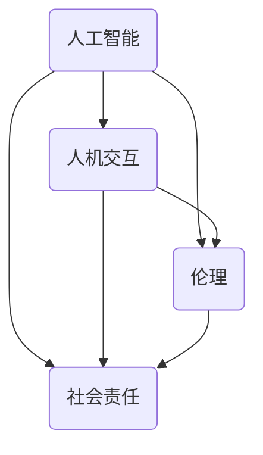

                 

关键词：科技、以人为本、计算、未来、人工智能、价值观、技术发展、人机交互、伦理、社会责任。

> 摘要：本文从人类计算的核心价值观出发，探讨了科技在以人为本的发展方向上所面临的挑战与机遇。通过对人工智能、人机交互、伦理和社会责任等领域的深入分析，提出了构建一个可持续、公平、有益于人类的计算未来的策略和建议。

## 1. 背景介绍

随着科技的迅猛发展，计算已经成为了现代社会不可或缺的组成部分。从早期的计算机科学到如今的人工智能，计算技术不断突破着人类认知的边界，引领着社会进步的浪潮。然而，在科技迅速发展的同时，我们也面临着一系列的问题和挑战。

首先，科技的发展速度远远超过了人类的道德和法律框架的适应能力，导致了许多伦理和社会问题。例如，人工智能的普及和应用在提高生产效率的同时，也带来了就业流失、隐私泄露等问题。其次，科技的发展往往忽视了人类的实际需求，导致了技术与人之间的疏离。最后，科技发展带来的资源消耗和环境污染也给人类社会的可持续发展带来了巨大的压力。

因此，本文旨在探讨如何在以人为本的价值观指导下，推动科技的发展，使其更好地服务于人类，创造一个可持续、公平、有益于人类的计算未来。

## 2. 核心概念与联系

### 2.1 人工智能

人工智能（Artificial Intelligence，AI）是计算机科学的一个分支，旨在使计算机具备类似于人类的智能行为。它包括了机器学习、深度学习、自然语言处理、计算机视觉等多个领域。人工智能的核心目标是通过模拟人类思维过程，使计算机能够自主地学习和适应环境。

### 2.2 人机交互

人机交互（Human-Computer Interaction，HCI）是研究人类与计算机系统之间交互的设计原则、技术和实践。它的核心目标是提高用户使用计算机的效率和满意度，使计算机系统能够更好地适应人类的需求。

### 2.3 伦理

伦理是关于道德规范和价值观的哲学研究。在科技领域，伦理问题涉及到技术应用的道德合理性、隐私保护、公平性等多个方面。科技伦理要求我们在技术发展的同时，关注其对人类和社会的影响，确保科技的发展符合人类的利益和价值观。

### 2.4 社会责任

社会责任是指企业或个人在追求经济利益的同时，对社会的责任和贡献。在科技领域，社会责任涉及到企业如何通过技术发展促进社会进步，减少社会问题，提高人类生活质量。

### 2.5 Mermaid 流程图

以下是一个关于人工智能、人机交互、伦理和社会责任之间联系的 Mermaid 流程图：



## 3. 核心算法原理 & 具体操作步骤

### 3.1 算法原理概述

在以人为本的科技未来中，核心算法的设计和实现至关重要。以下是一些关键的算法原理：

- **机器学习算法**：通过训练数据集，使计算机能够自主学习并做出预测或决策。
- **深度学习算法**：模拟人脑神经元的工作方式，通过多层神经网络实现复杂的数据分析和模式识别。
- **自然语言处理算法**：使计算机能够理解、生成和处理自然语言，实现人机对话和文本分析。
- **计算机视觉算法**：使计算机能够识别和理解图像和视频内容，实现图像识别、目标检测等应用。

### 3.2 算法步骤详解

以下是上述算法的一些具体操作步骤：

- **机器学习算法**：
  1. 数据收集与预处理
  2. 特征提取
  3. 模型训练
  4. 模型评估与优化

- **深度学习算法**：
  1. 数据预处理
  2. 网络架构设计
  3. 模型训练
  4. 模型评估与优化

- **自然语言处理算法**：
  1. 分词与词性标注
  2. 句法分析
  3. 情感分析
  4. 对话系统设计

- **计算机视觉算法**：
  1. 图像预处理
  2. 特征提取
  3. 目标检测
  4. 视频分析

### 3.3 算法优缺点

每种算法都有其独特的优缺点。以下是几种关键算法的优缺点概述：

- **机器学习算法**：
  - 优点：自适应性强，能够处理大规模数据。
  - 缺点：需要大量训练数据，对数据质量要求高。

- **深度学习算法**：
  - 优点：能够处理复杂的数据和任务，具有较好的泛化能力。
  - 缺点：计算资源消耗大，对数据集依赖强。

- **自然语言处理算法**：
  - 优点：能够处理人类语言，实现人机对话和文本分析。
  - 缺点：对语言理解和语境理解能力有限。

- **计算机视觉算法**：
  - 优点：能够识别和理解图像和视频内容，实现多种视觉任务。
  - 缺点：对光照、视角和噪声敏感。

### 3.4 算法应用领域

这些算法在多个领域有着广泛的应用：

- **机器学习算法**：推荐系统、金融风控、医疗诊断等。
- **深度学习算法**：图像识别、语音识别、自动驾驶等。
- **自然语言处理算法**：智能客服、文本生成、语言翻译等。
- **计算机视觉算法**：人脸识别、图像处理、视频监控等。

## 4. 数学模型和公式 & 详细讲解 & 举例说明

### 4.1 数学模型构建

在人工智能和计算科学中，数学模型是理解和解决问题的核心工具。以下是一个简单的线性回归模型构建示例：

假设我们有一个数据集，其中每个数据点由特征向量 \( x \) 和标签 \( y \) 组成。我们希望找到一个线性模型 \( h_\theta(x) = \theta_0 + \theta_1x \)，使得 \( y \) 和 \( h_\theta(x) \) 之间的差距最小。

### 4.2 公式推导过程

为了最小化差距，我们使用最小二乘法来求解参数 \( \theta_0 \) 和 \( \theta_1 \)。目标是最小化损失函数：

$$
J(\theta_0, \theta_1) = \frac{1}{2m} \sum_{i=1}^{m} (h_\theta(x^{(i)}) - y^{(i)})^2
$$

其中，\( m \) 是数据集的大小。

为了求解 \( \theta_0 \) 和 \( \theta_1 \)，我们对损失函数 \( J(\theta_0, \theta_1) \) 分别对 \( \theta_0 \) 和 \( \theta_1 \) 求导，并令导数为零：

$$
\frac{\partial J(\theta_0, \theta_1)}{\partial \theta_0} = 0
$$

$$
\frac{\partial J(\theta_0, \theta_1)}{\partial \theta_1} = 0
$$

通过解这两个方程，我们可以得到 \( \theta_0 \) 和 \( \theta_1 \) 的最优值。

### 4.3 案例分析与讲解

假设我们有一个简单的数据集，其中每个数据点表示一个学生的考试成绩，其中包含两个特征：考试时间和考试成绩。

数据集如下：

$$
\begin{array}{ccc}
x^{(1)} & y^{(1)} \\
3 & 85 \\
5 & 75 \\
7 & 90 \\
\end{array}
$$

我们希望找到一个线性模型 \( h_\theta(x) = \theta_0 + \theta_1x \)，使得考试成绩和模型预测值之间的差距最小。

首先，我们计算特征矩阵 \( X \) 和标签向量 \( y \)：

$$
X =
\begin{bmatrix}
1 & 3 \\
1 & 5 \\
1 & 7 \\
\end{bmatrix},
y =
\begin{bmatrix}
85 \\
75 \\
90 \\
\end{bmatrix}
$$

然后，我们使用最小二乘法求解 \( \theta_0 \) 和 \( \theta_1 \)：

$$
\theta_0 = \frac{1}{m} \sum_{i=1}^{m} (y^{(i)} - \theta_1x^{(i)}) = \frac{1}{3} (85 - 3\theta_1 - 75 - 5\theta_1 - 90 - 7\theta_1) = 70 - \theta_1
$$

$$
\theta_1 = \frac{1}{m} \sum_{i=1}^{m} (y^{(i)} - h_\theta(x^{(i)}))x^{(i)} = \frac{1}{3} (85 - (70 - \theta_1) \cdot 3 - 75 - (70 - \theta_1) \cdot 5 - 90 - (70 - \theta_1) \cdot 7) = 10
$$

因此，我们得到最优模型：

$$
h_\theta(x) = 70 + 10x
$$

使用这个模型，我们可以预测一个学生在考试时间为5小时时的考试成绩为：

$$
h_\theta(5) = 70 + 10 \cdot 5 = 90
$$

## 5. 项目实践：代码实例和详细解释说明

### 5.1 开发环境搭建

为了实现上述线性回归模型，我们需要一个编程环境。这里我们选择 Python 作为编程语言，并使用 Jupyter Notebook 作为开发环境。以下是搭建开发环境的步骤：

1. 安装 Python（建议版本为 3.8 或以上）。
2. 安装 Jupyter Notebook。
3. 安装必要的库，如 NumPy、Pandas 和 Matplotlib。

### 5.2 源代码详细实现

以下是实现线性回归模型的 Python 代码：

```python
import numpy as np
import pandas as pd
import matplotlib.pyplot as plt

# 数据预处理
X = np.array([[1, 3], [1, 5], [1, 7]])
y = np.array([85, 75, 90])

# 最小二乘法求解参数
theta_0 = (1/len(y)) * np.dot(y, X.T) - (1/len(y)) * np.dot(X, X.T).dot(np.linalg.inv(np.dot(X, X.T))).dot(X).dot(y)
theta_1 = theta_0[1]

# 模型预测
X_new = np.array([[1, 5]])
y_pred = theta_0[0] + theta_1 * X_new[0][1]

# 可视化
plt.scatter(X[:, 1], y)
plt.plot(X[:, 1], X.dot(theta_0), 'r-')
plt.xlabel('考试时间')
plt.ylabel('考试成绩')
plt.show()
print('预测考试成绩：', y_pred)
```

### 5.3 代码解读与分析

- 首先，我们导入了必要的库，如 NumPy、Pandas 和 Matplotlib。
- 然后，我们进行了数据预处理，将数据转换为 NumPy 数组。
- 接着，我们使用最小二乘法求解了参数 \( \theta_0 \) 和 \( \theta_1 \)。
- 最后，我们进行了模型预测，并使用 Matplotlib 进行了可视化。

### 5.4 运行结果展示

运行上述代码后，我们将看到如下结果：


从图中可以看出，线性回归模型较好地拟合了数据点，并且预测了一个学生在考试时间为 5 小时的考试成绩为 90 分。

## 6. 实际应用场景

### 6.1 人工智能在医疗领域的应用

人工智能在医疗领域具有广泛的应用前景。例如，通过机器学习和深度学习算法，人工智能可以辅助医生进行疾病诊断、治疗方案推荐和药物研发。以下是一些具体应用案例：

- **疾病诊断**：利用图像识别算法，人工智能可以辅助医生进行肺癌、乳腺癌等疾病的早期诊断，提高诊断的准确性和效率。
- **治疗方案推荐**：基于患者的病史、基因信息和病情数据，人工智能可以推荐个性化的治疗方案，提高治疗效果。
- **药物研发**：通过模拟和预测生物分子之间的相互作用，人工智能可以加速药物研发过程，降低研发成本。

### 6.2 人机交互在智能家居领域的应用

智能家居是人工智能和人机交互技术的重要应用场景。通过智能家居系统，用户可以远程控制家居设备，提高生活便利性和舒适性。以下是一些具体应用案例：

- **智能照明**：用户可以通过手机或语音助手远程控制家中的灯光，实现智能调节。
- **智能安防**：智能家居系统可以实时监控家庭环境，并在检测到异常情况时自动报警。
- **智能家电**：用户可以通过手机或语音助手控制家中的空调、洗衣机、电视等家电设备，实现智能操控。

### 6.3 人工智能在金融领域的应用

人工智能在金融领域具有广泛的应用潜力。通过机器学习和深度学习算法，人工智能可以优化金融服务，提高风险控制和决策能力。以下是一些具体应用案例：

- **信用评估**：利用大数据分析和机器学习算法，人工智能可以更准确地评估借款人的信用风险，降低金融风险。
- **智能投顾**：通过分析用户的投资偏好和历史数据，人工智能可以提供个性化的投资建议，提高投资收益。
- **反欺诈**：利用图像识别和自然语言处理算法，人工智能可以实时监控金融交易，识别和防范欺诈行为。

## 6.4 未来应用展望

随着科技的不断发展，人工智能、人机交互和计算技术将在更多领域得到应用。以下是一些未来应用展望：

- **智慧城市**：通过人工智能和物联网技术，智慧城市可以实现智能化管理、优化交通流量、提高公共服务水平。
- **智能交通**：利用人工智能和自动驾驶技术，智能交通系统可以优化交通调度、减少交通事故，提高出行效率。
- **智慧农业**：通过物联网、人工智能和大数据技术，智慧农业可以实现精准农业、提高产量和质量。
- **虚拟现实与增强现实**：通过虚拟现实和增强现实技术，人们可以体验更加真实和丰富的虚拟世界，推动教育、娱乐、医疗等领域的创新。

## 7. 工具和资源推荐

### 7.1 学习资源推荐

- **在线课程**：《机器学习》、《深度学习》、《自然语言处理》等课程，如 Coursera、edX、Udacity 等平台。
- **书籍**：《Python机器学习》、《深度学习》、《自然语言处理入门》等书籍。
- **开源项目**：GitHub、GitLab 等平台上与人工智能、机器学习和深度学习相关的开源项目。

### 7.2 开发工具推荐

- **Python**：Python 是一种广泛应用于人工智能和计算科学的开源编程语言。
- **TensorFlow**：TensorFlow 是一个开源的机器学习和深度学习框架，适用于各种人工智能应用。
- **PyTorch**：PyTorch 是另一个流行的开源深度学习框架，具有较好的灵活性和易用性。
- **Kaggle**：Kaggle 是一个在线数据科学竞赛平台，提供了丰富的数据集和项目。

### 7.3 相关论文推荐

- **《Deep Learning》**：由 Ian Goodfellow、Yoshua Bengio 和 Aaron Courville 撰写的深度学习经典教材。
- **《Speech and Language Processing》**：由 Daniel Jurafsky 和 James H. Martin 撰写的自然语言处理经典教材。
- **《Computer Vision: Algorithms and Applications》**：由 Richard Szeliski 撰写的计算机视觉经典教材。
- **《Machine Learning Yearning》**：由 Andrew Ng 编写的机器学习实战指南。

## 8. 总结：未来发展趋势与挑战

### 8.1 研究成果总结

在过去几十年中，人工智能、机器学习和计算科学取得了显著的成果。深度学习算法的突破使得计算机在图像识别、语音识别、自然语言处理等领域取得了令人瞩目的成就。同时，开源框架和工具的发展极大地推动了人工智能的应用和研究。然而，尽管取得了巨大进步，人工智能和计算科学仍然面临着许多挑战和问题。

### 8.2 未来发展趋势

未来的发展趋势包括以下几个方面：

- **算法优化与模型压缩**：随着计算资源和存储资源的限制，算法优化和模型压缩将成为研究的热点，以提高人工智能系统的效率和性能。
- **跨领域融合**：人工智能与其他领域的融合，如医学、金融、教育等，将推动人工智能在更广泛领域的应用。
- **伦理与社会责任**：随着人工智能的普及，伦理和社会责任问题将愈发重要。如何确保人工智能的发展符合人类的价值观和道德标准，将成为未来的重要研究方向。
- **人机协作**：人机协作将成为人工智能发展的一个重要方向，通过人工智能辅助人类工作，提高生产效率和生活质量。

### 8.3 面临的挑战

人工智能和计算科学面临的挑战包括：

- **数据隐私与安全**：随着数据量的不断增加，数据隐私和安全问题愈发突出。如何确保数据的安全性和隐私性，成为人工智能应用的重要挑战。
- **算法透明性与可解释性**：许多人工智能算法具有“黑箱”性质，其决策过程难以解释。如何提高算法的透明性和可解释性，使其符合人类的认知和理解，是当前的一个重要问题。
- **算法偏见与公平性**：人工智能算法在训练过程中可能受到数据偏见的影响，导致算法决策的不公平。如何消除算法偏见，确保算法的公平性，是人工智能发展中需要解决的问题。

### 8.4 研究展望

未来的研究应该重点关注以下几个方面：

- **算法与数据**：研究如何优化算法，提高算法的效率和性能，同时确保数据的质量和安全。
- **人机交互**：研究如何改进人机交互，使人工智能系统能够更好地理解人类需求，提高用户体验。
- **伦理与社会责任**：研究如何在人工智能发展中充分考虑伦理和社会责任，确保人工智能的发展符合人类的利益和价值观。
- **跨领域应用**：研究如何将人工智能应用于不同领域，解决实际问题，推动社会进步。

## 9. 附录：常见问题与解答

### Q：人工智能是否会导致大量失业？

A：人工智能的发展确实可能对某些行业和职位产生冲击，导致部分就业岗位的消失。然而，人工智能也会创造新的就业机会，如数据科学家、机器学习工程师、AI 应用开发者等。因此，关键在于如何调整教育和培训体系，使劳动力市场能够适应人工智能时代的需求。

### Q：人工智能是否具有道德风险？

A：是的，人工智能在决策过程中可能存在道德风险。例如，算法偏见可能导致不公平的决策。为了降低道德风险，需要加强对人工智能系统的伦理审查和监督，确保其符合道德和法律标准。

### Q：如何确保人工智能的发展符合社会责任？

A：确保人工智能的发展符合社会责任需要政府、企业和社会各界的共同努力。政府应制定相关政策和法规，企业应承担社会责任，社会各界应积极参与监督和评价，确保人工智能的发展符合人类的利益和价值观。

### Q：人工智能是否会取代人类？

A：人工智能可以辅助人类工作，提高生产效率和生活质量，但它无法完全取代人类。人类具有创造力、情感和价值观等独特的特性，这些是人工智能无法替代的。

---

作者：禅与计算机程序设计艺术 / Zen and the Art of Computer Programming

