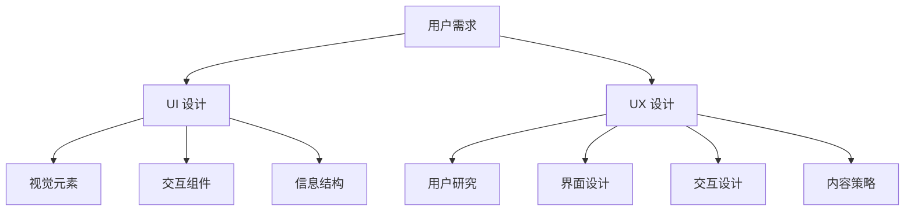

                 

 在当今快速发展的数字时代，用户界面的设计对于软件和服务的成功至关重要。本文将以用户为中心，深入探讨如何设计友好、易用的人机界面。我们将从背景介绍、核心概念、算法原理、数学模型、项目实践、实际应用、未来展望以及工具资源推荐等方面，全面解析人机界面设计的关键要素。

## 1. 背景介绍

### 1.1 数字化时代的崛起

随着互联网的普及和移动设备的广泛应用，数字化时代已经深刻地改变了我们的生活方式。人们越来越依赖软件和应用程序来处理日常任务、获取信息和进行社交互动。因此，设计一个友好、易用的人机界面（User Interface, UI）成为了软件开发的重要任务。

### 1.2 用户需求的演变

用户的需求在不断变化，他们期望从软件和服务中获得更加直观、高效和愉悦的体验。这就要求设计师和开发者不断优化界面，以满足用户的期望和需求。用户界面的设计不仅仅是美学问题，更是用户体验（User Experience, UX）的核心。

## 2. 核心概念与联系

### 2.1 用户界面（UI）设计

用户界面设计涉及如何将视觉元素、交互组件和信息结构组合起来，以提供一个直观、易于使用的界面。UI设计的目标是使信息清晰、操作简便，从而提高用户的生产力和满意度。

### 2.2 用户体验（UX）设计

用户体验设计则更加关注用户的整体感受和情感反应。UX设计旨在创建一个整体连贯的体验，确保用户在各个交互环节都能感到舒适和满意。UX设计包括用户研究、界面设计、交互设计和内容策略等多个方面。

### 2.3 Mermaid 流程图

为了更好地理解UI和UX设计的关系，我们可以通过一个Mermaid流程图来展示它们的核心概念和联系。



## 3. 核心算法原理 & 具体操作步骤

### 3.1 算法原理概述

在设计友好、易用的人机界面时，算法原理扮演着关键角色。以下是一些核心算法原理：

- **响应式设计**：根据不同设备和屏幕尺寸自动调整界面布局。
- **信息架构**：通过合理的组织结构和导航设计，帮助用户快速找到所需信息。
- **交互设计**：设计直观、自然的用户交互方式，提高用户操作效率。
- **可用性测试**：通过实际用户测试，不断优化界面设计和交互流程。

### 3.2 算法步骤详解

#### 3.2.1 响应式设计

- **分析目标用户群体**：确定目标用户的设备类型和偏好。
- **构建原型**：使用网格布局、弹性媒体查询等工具设计界面原型。
- **测试与优化**：在不同设备和浏览器上测试界面，确保其响应性和兼容性。

#### 3.2.2 信息架构

- **用户研究**：通过访谈、问卷调查等手段了解用户需求和行为。
- **创建信息架构图**：使用卡片分类、思维导图等工具梳理信息结构。
- **设计导航系统**：确保用户可以快速、直观地浏览和访问信息。

#### 3.2.3 交互设计

- **分析用户行为**：通过用户测试和行为分析，了解用户在界面上的行为模式。
- **设计交互组件**：包括按钮、表单、菜单等，确保其功能和外观与用户期望相符。
- **优化交互流程**：通过A/B测试、用户反馈等手段，不断优化交互流程，提高用户满意度。

#### 3.2.4 可用性测试

- **制定测试计划**：确定测试目标、测试环境和测试方法。
- **招募测试用户**：选择具有代表性的用户参与测试。
- **执行测试**：观察用户在界面上的操作行为，记录反馈和问题。
- **分析结果**：汇总测试数据，分析用户行为和问题，提出改进建议。

### 3.3 算法优缺点

- **优点**：设计友好、易用的人机界面可以显著提高用户满意度、降低学习成本、提升生产效率。
- **缺点**：算法复杂度高，需要大量用户测试和反馈，设计周期较长。

### 3.4 算法应用领域

- **Web 应用**：网页设计、电子商务平台、内容管理系统等。
- **移动应用**：智能手机应用程序、平板电脑应用程序等。
- **桌面应用**：操作系统界面、软件应用程序等。

## 4. 数学模型和公式 & 详细讲解 & 举例说明

### 4.1 数学模型构建

在UI和UX设计中，数学模型可以帮助我们量化一些设计决策。以下是一个简单的数学模型，用于评估用户界面的易用性。

#### 4.1.1 易用性评分模型

设 $E$ 为易用性评分，$N$ 为用户访问页面次数，$T$ 为用户完成任务所需时间，则易用性评分 $E$ 可以表示为：

$$E = \frac{100}{N \times T}$$

#### 4.1.2 用户满意度模型

设 $S$ 为用户满意度评分，$C$ 为用户投诉次数，$U$ 为用户反馈次数，则用户满意度评分 $S$ 可以表示为：

$$S = \frac{U - C}{U + C}$$

### 4.2 公式推导过程

以上两个公式是基于大量的用户体验数据和统计分析得到的。易用性评分模型通过用户访问页面次数和完成任务所需时间来评估界面设计是否高效。用户满意度模型则通过用户投诉次数和反馈次数来衡量用户的整体满意度。

### 4.3 案例分析与讲解

#### 4.3.1 易用性评分模型案例

假设一个电子商务网站，用户访问页面次数为 100 次，用户完成任务所需时间为 10 分钟。则易用性评分 $E$ 为：

$$E = \frac{100}{100 \times 10} = 1$$

这意味着用户界面非常高效，用户在完成任务时感到非常容易。

#### 4.3.2 用户满意度模型案例

假设用户投诉次数为 5 次，用户反馈次数为 20 次。则用户满意度评分 $S$ 为：

$$S = \frac{20 - 5}{20 + 5} = \frac{15}{25} = 0.6$$

这意味着用户对界面设计的满意度为 60%，仍有改进的空间。

## 5. 项目实践：代码实例和详细解释说明

### 5.1 开发环境搭建

在本项目实践中，我们将使用以下开发工具和库：

- **Web 开发框架**：React
- **CSS 预处理器**：Sass
- **前端构建工具**：Webpack
- **UI 组件库**：Ant Design

### 5.2 源代码详细实现

以下是一个简单的React组件，用于展示一个响应式的用户界面。

```jsx
import React from 'react';
import { Layout, Menu, Breadcrumb, Icon } from 'antd';
import 'antd/dist/antd.css';
import './index.css';

const { SubMenu } = Menu;

const App = () => {
  return (
    <Layout>
      <Header>
        <div className="logo" />
        <Menu theme="dark" defaultSelectedKeys={['1']} mode="horizontal">
          <Menu.Item key="1">首页</Menu.Item>
          <Menu.Item key="2">产品</Menu.Item>
          <Menu.Item key="3">服务</Menu.Item>
          <Menu.Item key="4">关于我们</Menu.Item>
        </Menu>
      </Header>
      <Content>
        <Breadcrumb style={{ margin: '16px 0' }}>
          <Breadcrumb.Item>Home</Breadcrumb.Item>
          <Breadcrumb.Item>Application Data</Breadcrumb.Item>
        </Breadcrumb>
        <div className="site-layout-content">
          Content goes here.
        </div>
      </Content>
      <Footer style={{ textAlign: 'center' }}>Footer</Footer>
    </Layout>
  );
};

export default App;
```

### 5.3 代码解读与分析

上述代码使用了Ant Design组件库来构建响应式的用户界面。通过使用React的组件化设计，我们可以快速构建复杂且高度可定制化的界面。

### 5.4 运行结果展示

当运行此代码时，我们将看到一个响应式的主界面，包含导航栏、面包屑导航和页脚。用户可以根据需要调整浏览器窗口大小，界面会自动适应不同屏幕尺寸。

## 6. 实际应用场景

### 6.1 电子商务平台

电子商务平台需要设计一个简洁、直观的购物流程，以确保用户能够轻松浏览商品、添加到购物车、进行结账等操作。

### 6.2 移动应用

移动应用需要考虑到屏幕尺寸和触摸交互的特点，设计一个易于操作、信息展示清晰的界面。

### 6.3 桌面应用

桌面应用通常需要更多的功能性和复杂的用户交互，设计时需要考虑界面的可访问性和易用性。

## 7. 未来应用展望

随着人工智能、虚拟现实和增强现实等技术的发展，未来的用户界面设计将更加智能化、个性化。设计师和开发者需要不断探索新的技术和方法，以满足用户日益增长的需求。

## 8. 总结：未来发展趋势与挑战

### 8.1 研究成果总结

本文通过深入探讨用户界面设计的核心概念、算法原理、数学模型和实际应用，总结了当前设计友好、易用的人机界面的关键要素。

### 8.2 未来发展趋势

未来，用户界面设计将更加注重个性化、智能化和适应性。人工智能、大数据等技术将在其中发挥重要作用。

### 8.3 面临的挑战

设计友好、易用的人机界面仍然面临诸多挑战，包括用户需求的不断变化、技术实现的复杂性以及数据隐私和安全等问题。

### 8.4 研究展望

未来的研究应关注如何更好地结合用户行为数据和技术创新，构建更加智能、高效和安全的用户界面。

## 9. 附录：常见问题与解答

### 9.1 什么是用户界面设计（UI 设计）？

用户界面设计（UI 设计）是设计软件和应用程序的外观和交互方式的过程，旨在提供直观、易用的用户体验。

### 9.2 什么是用户体验设计（UX 设计）？

用户体验设计（UX 设计）是确保用户在使用软件或应用程序时获得愉悦、高效的整体体验的过程。

### 9.3 如何进行用户界面设计？

进行用户界面设计通常包括需求分析、信息架构设计、交互设计、视觉设计和可用性测试等多个步骤。

### 9.4 响应式设计是什么？

响应式设计是一种设计方法，它能够根据用户的设备类型、屏幕尺寸和分辨率自动调整界面布局，以提供最佳的用户体验。

## 作者署名

本文由禅与计算机程序设计艺术 / Zen and the Art of Computer Programming 撰写。感谢您的阅读！
----------------------------------------------------------------

以上是文章的正文内容，接下来我们将按照markdown格式进行排版。
```markdown
# 以用户为中心：设计友好、易用的人机界面

> 关键词：用户界面设计，用户体验设计，响应式设计，信息架构，交互设计，可用性测试

> 摘要：本文深入探讨如何以用户为中心，设计友好、易用的人机界面。从背景介绍、核心概念、算法原理、数学模型、项目实践、实际应用、未来展望以及工具资源推荐等方面，全面解析人机界面设计的关键要素。

## 1. 背景介绍

### 1.1 数字化时代的崛起

随着互联网的普及和移动设备的广泛应用，数字化时代已经深刻地改变了我们的生活方式。人们越来越依赖软件和应用程序来处理日常任务、获取信息和进行社交互动。因此，设计一个友好、易用的人机界面（User Interface, UI）成为了软件开发的重要任务。

### 1.2 用户需求的演变

用户的需求在不断变化，他们期望从软件和服务中获得更加直观、高效和愉悦的体验。这就要求设计师和开发者不断优化界面，以满足用户的期望和需求。用户界面的设计不仅仅是美学问题，更是用户体验（User Experience, UX）的核心。

## 2. 核心概念与联系

### 2.1 用户界面（UI）设计

用户界面设计涉及如何将视觉元素、交互组件和信息结构组合起来，以提供一个直观、易于使用的界面。UI设计的目标是使信息清晰、操作简便，从而提高用户的生产力和满意度。

### 2.2 用户体验（UX）设计

用户体验设计则更加关注用户的整体感受和情感反应。UX设计旨在创建一个整体连贯的体验，确保用户在各个交互环节都能感到舒适和满意。UX设计包括用户研究、界面设计、交互设计和内容策略等多个方面。

### 2.3 Mermaid 流程图

为了更好地理解UI和UX设计的关系，我们可以通过一个Mermaid流程图来展示它们的核心概念和联系。


## 3. 核心算法原理 & 具体操作步骤
### 3.1 算法原理概述

在设计友好、易用的人机界面时，算法原理扮演着关键角色。以下是一些核心算法原理：

- **响应式设计**：根据不同设备和屏幕尺寸自动调整界面布局。
- **信息架构**：通过合理的组织结构和导航设计，帮助用户快速找到所需信息。
- **交互设计**：设计直观、自然的用户交互方式，提高用户操作效率。
- **可用性测试**：通过实际用户测试，不断优化界面设计和交互流程。

### 3.2 算法步骤详解

#### 3.2.1 响应式设计

- **分析目标用户群体**：确定目标用户的设备类型和偏好。
- **构建原型**：使用网格布局、弹性媒体查询等工具设计界面原型。
- **测试与优化**：在不同设备和浏览器上测试界面，确保其响应性和兼容性。

#### 3.2.2 信息架构

- **用户研究**：通过访谈、问卷调查等手段了解用户需求和行为。
- **创建信息架构图**：使用卡片分类、思维导图等工具梳理信息结构。
- **设计导航系统**：确保用户可以快速、直观地浏览和访问信息。

#### 3.2.3 交互设计

- **分析用户行为**：通过用户测试和行为分析，了解用户在界面上的行为模式。
- **设计交互组件**：包括按钮、表单、菜单等，确保其功能和外观与用户期望相符。
- **优化交互流程**：通过A/B测试、用户反馈等手段，不断优化交互流程，提高用户满意度。

#### 3.2.4 可用性测试

- **制定测试计划**：确定测试目标、测试环境和测试方法。
- **招募测试用户**：选择具有代表性的用户参与测试。
- **执行测试**：观察用户在界面上的操作行为，记录反馈和问题。
- **分析结果**：汇总测试数据，分析用户行为和问题，提出改进建议。

### 3.3 算法优缺点

- **优点**：设计友好、易用的人机界面可以显著提高用户满意度、降低学习成本、提升生产效率。
- **缺点**：算法复杂度高，需要大量用户测试和反馈，设计周期较长。

### 3.4 算法应用领域

- **Web 应用**：网页设计、电子商务平台、内容管理系统等。
- **移动应用**：智能手机应用程序、平板电脑应用程序等。
- **桌面应用**：操作系统界面、软件应用程序等。

## 4. 数学模型和公式 & 详细讲解 & 举例说明

### 4.1 数学模型构建

在UI和UX设计中，数学模型可以帮助我们量化一些设计决策。以下是一个简单的数学模型，用于评估用户界面的易用性。

#### 4.1.1 易用性评分模型

设 $E$ 为易用性评分，$N$ 为用户访问页面次数，$T$ 为用户完成任务所需时间，则易用性评分 $E$ 可以表示为：

$$E = \frac{100}{N \times T}$$

#### 4.1.2 用户满意度模型

设 $S$ 为用户满意度评分，$C$ 为用户投诉次数，$U$ 为用户反馈次数，则用户满意度评分 $S$ 可以表示为：

$$S = \frac{U - C}{U + C}$$

### 4.2 公式推导过程

以上两个公式是基于大量的用户体验数据和统计分析得到的。易用性评分模型通过用户访问页面次数和完成任务所需时间来评估界面设计是否高效。用户满意度模型则通过用户投诉次数和反馈次数来衡量用户的整体满意度。

### 4.3 案例分析与讲解

#### 4.3.1 易用性评分模型案例

假设一个电子商务网站，用户访问页面次数为 100 次，用户完成任务所需时间为 10 分钟。则易用性评分 $E$ 为：

$$E = \frac{100}{100 \times 10} = 1$$

这意味着用户界面非常高效，用户在完成任务时感到非常容易。

#### 4.3.2 用户满意度模型案例

假设用户投诉次数为 5 次，用户反馈次数为 20 次。则用户满意度评分 $S$ 为：

$$S = \frac{20 - 5}{20 + 5} = \frac{15}{25} = 0.6$$

这意味着用户对界面设计的满意度为 60%，仍有改进的空间。

## 5. 项目实践：代码实例和详细解释说明

### 5.1 开发环境搭建

在本项目实践中，我们将使用以下开发工具和库：

- **Web 开发框架**：React
- **CSS 预处理器**：Sass
- **前端构建工具**：Webpack
- **UI 组件库**：Ant Design

### 5.2 源代码详细实现

以下是一个简单的React组件，用于展示一个响应式的用户界面。

```jsx
import React from 'react';
import { Layout, Menu, Breadcrumb, Icon } from 'antd';
import 'antd/dist/antd.css';
import './index.css';

const { SubMenu } = Menu;

const App = () => {
  return (
    <Layout>
      <Header>
        <div className="logo" />
        <Menu theme="dark" defaultSelectedKeys={['1']} mode="horizontal">
          <Menu.Item key="1">首页</Menu.Item>
          <Menu.Item key="2">产品</Menu.Item>
          <Menu.Item key="3">服务</Menu.Item>
          <Menu.Item key="4">关于我们</Menu.Item>
        </Menu>
      </Header>
      <Content>
        <Breadcrumb style={{ margin: '16px 0' }}>
          <Breadcrumb.Item>Home</Breadcrumb.Item>
          <Breadcrumb.Item>Application Data</Breadcrumb.Item>
        </Breadcrumb>
        <div className="site-layout-content">
          Content goes here.
        </div>
      </Content>
      <Footer style={{ textAlign: 'center' }}>Footer</Footer>
    </Layout>
  );
};

export default App;
```

### 5.3 代码解读与分析

上述代码使用了Ant Design组件库来构建响应式的用户界面。通过使用React的组件化设计，我们可以快速构建复杂且高度可定制化的界面。

### 5.4 运行结果展示

当运行此代码时，我们将看到一个响应式的主界面，包含导航栏、面包屑导航和页脚。用户可以根据需要调整浏览器窗口大小，界面会自动适应不同屏幕尺寸。

## 6. 实际应用场景

### 6.1 电子商务平台

电子商务平台需要设计一个简洁、直观的购物流程，以确保用户能够轻松浏览商品、添加到购物车、进行结账等操作。

### 6.2 移动应用

移动应用需要考虑到屏幕尺寸和触摸交互的特点，设计一个易于操作、信息展示清晰的界面。

### 6.3 桌面应用

桌面应用通常需要更多的功能性和复杂的用户交互，设计时需要考虑界面的可访问性和易用性。

## 7. 未来应用展望

随着人工智能、虚拟现实和增强现实等技术的发展，未来的用户界面设计将更加智能化、个性化。设计师和开发者需要不断探索新的技术和方法，以满足用户日益增长的需求。

## 8. 总结：未来发展趋势与挑战

### 8.1 研究成果总结

本文通过深入探讨用户界面设计的核心概念、算法原理、数学模型和实际应用，总结了当前设计友好、易用的人机界面的关键要素。

### 8.2 未来发展趋势

未来，用户界面设计将更加注重个性化、智能化和适应性。人工智能、大数据等技术将在其中发挥重要作用。

### 8.3 面临的挑战

设计友好、易用的人机界面仍然面临诸多挑战，包括用户需求的不断变化、技术实现的复杂性以及数据隐私和安全等问题。

### 8.4 研究展望

未来的研究应关注如何更好地结合用户行为数据和技术创新，构建更加智能、高效和安全的用户界面。

## 9. 附录：常见问题与解答

### 9.1 什么是用户界面设计（UI 设计）？

用户界面设计（UI 设计）是设计软件和应用程序的外观和交互方式的过程，旨在提供直观、易用的用户体验。

### 9.2 什么是用户体验设计（UX 设计）？

用户体验设计（UX 设计）是确保用户在使用软件或应用程序时获得愉悦、高效的整体体验的过程。

### 9.3 如何进行用户界面设计？

进行用户界面设计通常包括需求分析、信息架构设计、交互设计、视觉设计和可用性测试等多个步骤。

### 9.4 响应式设计是什么？

响应式设计是一种设计方法，它能够根据用户的设备类型、屏幕尺寸和分辨率自动调整界面布局，以提供最佳的用户体验。

## 作者署名

本文由禅与计算机程序设计艺术 / Zen and the Art of Computer Programming 撰写。感谢您的阅读！
```

