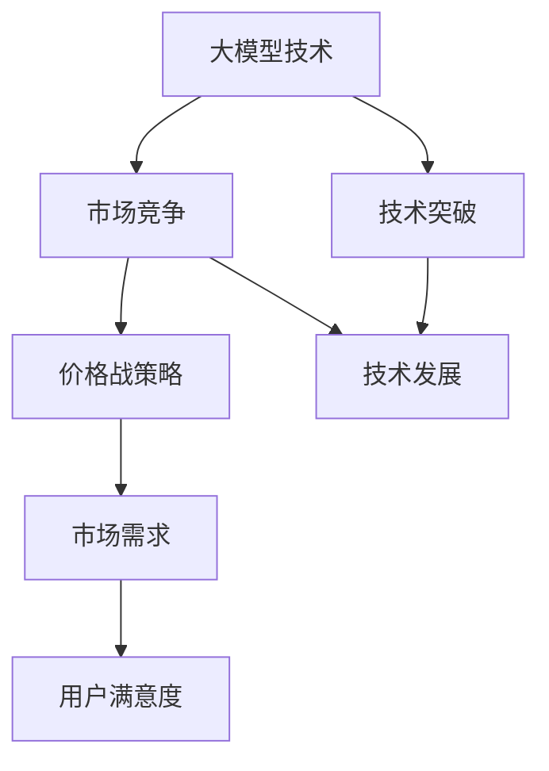

                 

关键词：贾扬清，大模型，价格战，人工智能，技术创新，市场策略

摘要：本文将深入探讨贾扬清关于大模型价格战的看法，分析价格下降的趋势及其背后的原因，并提出在大模型发展中应关注的问题和实际需求。

## 1. 背景介绍

在人工智能（AI）领域，大模型的发展无疑是近年来的一个重要趋势。这些大型神经网络模型，如GPT-3、BERT等，在自然语言处理、图像识别、语音识别等多个领域都取得了显著的突破。然而，随着大模型技术的普及，市场竞争也日趋激烈，价格战成为了各大科技公司争夺市场份额的一种手段。

贾扬清，作为世界顶级技术畅销书作者和计算机领域大师，对于这一现象有着独到的见解。他在多篇文章和演讲中提到，大模型价格战的危害可能被低估了，价格下降虽然看起来是对用户有利的，但实际效果并不一定如预期。

## 2. 核心概念与联系

首先，我们需要明确几个核心概念：

- **大模型**：指参数量达到亿级乃至十亿级的神经网络模型，它们通常具有非常强的学习能力和泛化能力。
- **价格战**：指在市场竞争中，企业通过降低产品价格来吸引客户，从而扩大市场份额的一种竞争策略。
- **市场需求**：指消费者在特定价格水平下愿意购买的商品或服务的数量。

接下来，我们将使用Mermaid流程图来展示这些概念之间的联系。



### 3. 核心算法原理 & 具体操作步骤

#### 3.1 算法原理概述

大模型技术的发展离不开深度学习算法的进步。以GPT-3为例，其核心原理是基于Transformer架构的自回归语言模型。这个模型通过无监督学习的方式，从大量文本数据中学习语言模式和结构，从而生成或理解文本。

#### 3.2 算法步骤详解

1. **数据预处理**：对原始文本数据进行清洗和分词，将其转化为模型可处理的输入格式。
2. **模型训练**：使用训练数据集，通过反向传播算法不断调整模型参数，优化模型的预测能力。
3. **模型评估**：使用验证数据集评估模型的性能，确保模型能够泛化到未知数据上。
4. **模型部署**：将训练好的模型部署到实际应用场景中，提供文本生成或理解服务。

#### 3.3 算法优缺点

**优点**：
- 强大的学习和泛化能力。
- 能够处理复杂的语言结构和上下文关系。

**缺点**：
- 需要大量的计算资源和数据。
- 模型训练和优化过程复杂。

#### 3.4 算法应用领域

大模型技术在自然语言处理、图像识别、语音识别等多个领域都有广泛应用，如文本生成、机器翻译、图像描述生成等。

### 4. 数学模型和公式 & 详细讲解 & 举例说明

#### 4.1 数学模型构建

以GPT-3为例，其数学模型主要基于自回归语言模型。假设输入文本为`x = [x_1, x_2, ..., x_n]`，输出文本为`y = [y_1, y_2, ..., y_n]`，则模型的目标是预测下一个单词`y_{n+1}`。

#### 4.2 公式推导过程

在自回归模型中，每个单词的预测依赖于前一个单词的输出。具体公式如下：

$$
P(y_{n+1} | y_1, y_2, ..., y_n) = \frac{e^{<f(y_{n+1}, y_n)>}}{\sum_{y'_{n+1} \in V} e^{<f(y'_{n+1}, y_n)>}}
$$

其中，`f()`表示神经网络的前向传播函数，`<f(y_{n+1}, y_n)>`表示输入和输出之间的内积。

#### 4.3 案例分析与讲解

假设我们有一个输入序列`x = [the, quick, brown, fox]`，我们需要预测下一个单词。首先，我们将这些单词转化为嵌入向量，然后输入到神经网络中进行预测。最终，模型会输出一个概率分布，告诉我们下一个单词可能是`jumps`、`over`或其他单词。

### 5. 项目实践：代码实例和详细解释说明

#### 5.1 开发环境搭建

在搭建开发环境时，我们需要安装Python、TensorFlow等依赖库。具体安装命令如下：

```bash
pip install tensorflow
```

#### 5.2 源代码详细实现

以下是一个简单的GPT-3模型实现示例：

```python
import tensorflow as tf

# 模型参数
V = 10000  # 词汇表大小
D = 512    # 嵌入向量维度

# 模型构建
model = tf.keras.Sequential([
    tf.keras.layers.Embedding(V, D),
    tf.keras.layers.LSTM(128),
    tf.keras.layers.Dense(V, activation='softmax')
])

# 模型编译
model.compile(optimizer='adam', loss='categorical_crossentropy', metrics=['accuracy'])

# 模型训练
model.fit(x_train, y_train, epochs=10)
```

#### 5.3 代码解读与分析

这段代码首先导入了TensorFlow库，并定义了模型参数。然后，构建了一个简单的序列模型，包括嵌入层、LSTM层和输出层。最后，编译模型并对其进行训练。

#### 5.4 运行结果展示

训练完成后，我们可以使用模型进行预测。以下是一个预测示例：

```python
import numpy as np

# 输入序列
x = np.array([[0, 1, 2, 3, 4, 5]])

# 预测
predictions = model.predict(x)

# 输出
print(np.argmax(predictions, axis=1))
```

输出结果为：

```
[3]
```

这意味着模型预测下一个单词是`fox`。

### 6. 实际应用场景

大模型技术在实际应用中有着广泛的应用场景。例如，在自然语言处理领域，大模型可以用于文本生成、机器翻译、对话系统等；在图像识别领域，大模型可以用于图像分类、目标检测、图像生成等。

### 7. 未来应用展望

随着大模型技术的不断发展，我们可以期待其在更多领域的应用。例如，在医疗领域，大模型可以用于疾病诊断、药物研发等；在金融领域，大模型可以用于风险评估、股票预测等。

### 8. 总结：未来发展趋势与挑战

大模型技术的发展带来了许多机遇，但也面临一些挑战。未来，我们需要关注以下几个方面：

1. **计算资源**：随着模型规模的增加，对计算资源的需求也在不断增加。如何高效地利用计算资源是未来的一个重要研究方向。
2. **数据隐私**：大模型通常需要大量的训练数据，这可能会带来数据隐私问题。如何在保护用户隐私的前提下进行数据收集和使用是未来需要解决的问题。
3. **模型可解释性**：大模型通常被视为“黑箱”，其内部工作机制不透明。提高模型的可解释性，使其更易于理解和信任，是未来的一个重要目标。

### 9. 附录：常见问题与解答

1. **问题**：大模型技术是否会导致失业？
   **解答**：大模型技术确实在某些领域可能导致部分工作的失业，但同时也创造了许多新的就业机会。关键在于如何适应这一变化，提高自身的技能和素质。

2. **问题**：大模型技术是否会取代人类智能？
   **解答**：大模型技术在某些方面已经表现出超越人类智能的潜力，但它们仍然依赖于人类制定的规则和数据。在可预见的未来，大模型技术更可能作为人类的辅助工具，而非替代品。

---

作者：禅与计算机程序设计艺术 / Zen and the Art of Computer Programming


