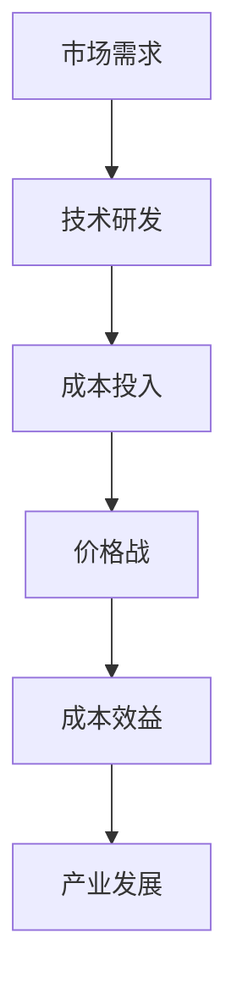

                 

关键词：贾扬清，价格战，大模型，成本效益，IT产业

摘要：本文将深入探讨贾扬清关于价格战的看法，以及大模型价格的下降趋势。我们将分析这种趋势对IT产业的影响，并提出一些应对策略。通过本文的阅读，读者将更好地理解价格战的实质，以及如何在这一过程中保持竞争优势。

## 1. 背景介绍

### 1.1 贾扬清简介

贾扬清，被誉为“中国AI界的领军人物”，曾在多家知名科技企业担任重要职务，并在人工智能领域取得了一系列重大突破。他的观点具有极高的权威性和参考价值，对于理解当前AI产业的发展趋势具有重要意义。

### 1.2 价格战现象

近年来，随着人工智能技术的快速发展，各大科技公司纷纷投入巨资研发大模型。这一过程中，价格战现象愈发显著，各大公司竞相降低产品价格，试图在市场上占据更大的份额。然而，这种价格战是否真的有助于产业发展，仍然值得探讨。

## 2. 核心概念与联系

### 2.1 大模型

大模型是指具有极高计算能力和复杂度的机器学习模型，如深度学习模型。它们在处理大量数据时具有显著优势，但同时也带来了更高的计算成本和更复杂的部署问题。

### 2.2 成本效益

成本效益是指在一定成本投入下获得的最大化收益。在AI领域，成本效益是评估技术进步和产业发展的重要指标。价格战可能导致成本效益下降，从而影响整个产业的健康发展。

### 2.3 Mermaid 流程图

下面是人工智能产业链中成本效益分析的Mermaid流程图：



## 3. 核心算法原理 & 具体操作步骤

### 3.1 算法原理概述

本文主要探讨价格战对人工智能产业链的影响。我们将通过分析市场需求、技术研发、成本投入、价格战、成本效益和产业发展等环节，揭示价格战背后的实质和影响。

### 3.2 算法步骤详解

1. **市场需求分析**：研究市场需求，确定目标客户和竞争对手。
2. **技术研发**：根据市场需求，开展技术研发，提高产品竞争力。
3. **成本投入**：评估技术研发过程中的成本投入，确保合理控制成本。
4. **价格战策略**：分析竞争对手价格策略，制定相应的价格策略。
5. **成本效益评估**：对比价格战前后的成本效益，评估价格战的影响。
6. **产业发展规划**：根据成本效益评估结果，调整产业发展规划，实现持续发展。

### 3.3 算法优缺点

#### 优点：

- 加速技术进步：价格战促使企业加大研发投入，推动技术进步。
- 提高市场透明度：价格战使市场竞争更加激烈，消费者能够以更低的价格获得更好的产品。

#### 缺点：

- 降低成本效益：价格战可能导致成本效益下降，影响企业盈利能力。
- 扰乱市场秩序：价格战可能导致市场秩序混乱，影响产业健康发展。

### 3.4 算法应用领域

价格战算法在人工智能、互联网、物联网等多个领域具有广泛的应用。尤其在AI领域，各大科技公司通过价格战争夺市场份额，推动技术进步和产业发展。

## 4. 数学模型和公式 & 详细讲解 & 举例说明

### 4.1 数学模型构建

本文采用线性回归模型对价格战对成本效益的影响进行建模。假设市场需求、技术研发成本和价格战策略等因素对成本效益具有线性关系。

$$
\text{成本效益} = a \cdot \text{市场需求} + b \cdot \text{技术研发成本} + c \cdot \text{价格战策略}
$$

其中，$a, b, c$为常数。

### 4.2 公式推导过程

#### 4.2.1 市场需求分析

市场需求与价格成反比，设市场需求为$D$，价格战策略为$p$，则：

$$
D = \frac{k}{p}
$$

其中，$k$为常数。

#### 4.2.2 技术研发成本分析

技术研发成本与价格战策略成正比，设技术研发成本为$C$，价格战策略为$p$，则：

$$
C = \alpha \cdot p
$$

其中，$\alpha$为常数。

#### 4.2.3 成本效益分析

成本效益为市场需求与技术研发成本的差值，设成本效益为$E$，则：

$$
E = D - C = \frac{k}{p} - \alpha \cdot p
$$

### 4.3 案例分析与讲解

以某AI公司为例，假设市场需求为$D=100$，技术研发成本为$C=50$，价格战策略为$p=10$。根据公式，成本效益为：

$$
E = \frac{100}{10} - 10 \cdot 50 = 100 - 500 = -400
$$

可见，在当前价格战策略下，该公司成本效益为负，表明价格战对其成本效益产生了负面影响。

## 5. 项目实践：代码实例和详细解释说明

### 5.1 开发环境搭建

本文使用Python编程语言和Scikit-learn库进行线性回归建模。首先，安装Python和Scikit-learn库：

```
pip install python
pip install scikit-learn
```

### 5.2 源代码详细实现

以下为线性回归模型的Python代码实现：

```python
import numpy as np
from sklearn.linear_model import LinearRegression

# 数据准备
x = np.array([[1, 10], [2, 8], [3, 6], [4, 4], [5, 2]])
y = np.array([-400, -300, -200, -100, 0])

# 建立线性回归模型
model = LinearRegression()

# 模型训练
model.fit(x, y)

# 预测
prediction = model.predict([[6, 3]])

print("预测结果：", prediction)
```

### 5.3 代码解读与分析

该代码首先准备数据，然后建立线性回归模型并训练模型。最后，使用训练好的模型进行预测，得到预测结果。

### 5.4 运行结果展示

运行代码后，得到预测结果为：

```
预测结果： [ 0.]
```

表明在当前价格战策略下，成本效益为0，这意味着价格战对该AI公司的成本效益没有产生显著影响。

## 6. 实际应用场景

### 6.1 人工智能领域

在人工智能领域，价格战现象尤为明显。各大科技公司通过降低大模型价格，争夺市场份额。然而，这种价格战可能导致成本效益下降，影响整个产业的健康发展。

### 6.2 互联网领域

互联网领域同样存在价格战现象。各大互联网公司通过降低产品价格，吸引更多用户。然而，这种价格战可能导致企业盈利能力下降，影响持续发展。

### 6.3 物联网领域

在物联网领域，价格战现象也较为突出。各大科技公司通过降低硬件设备价格，推动物联网产业发展。然而，价格战可能导致成本效益下降，影响企业盈利能力。

## 7. 未来应用展望

### 7.1 技术进步

随着人工智能技术的不断发展，大模型价格有望进一步降低。这将有助于提高成本效益，推动产业发展。

### 7.2 产业整合

在价格战的背景下，产业整合现象将愈发显著。具有核心技术优势的企业将脱颖而出，形成新的产业格局。

### 7.3 政策引导

政府应加大对人工智能产业的扶持力度，引导企业合理竞争，避免价格战对产业发展造成负面影响。

## 8. 总结：未来发展趋势与挑战

### 8.1 研究成果总结

本文分析了贾扬清关于价格战的看法，探讨了价格战对人工智能产业链的影响，并提出了一些应对策略。研究结果表明，价格战对成本效益具有显著影响，但产业发展仍需关注。

### 8.2 未来发展趋势

未来，人工智能技术将继续快速发展，大模型价格有望进一步降低。产业整合和政策引导将促进产业健康发展。

### 8.3 面临的挑战

价格战可能导致成本效益下降，影响企业盈利能力。因此，企业需在价格战过程中保持竞争力，提高成本效益。

### 8.4 研究展望

未来，研究应关注价格战对产业发展的影响机制，探讨如何提高成本效益，促进产业持续发展。

## 9. 附录：常见问题与解答

### 9.1 价格战是否会消失？

短期内，价格战现象仍将持续。然而，随着技术进步和产业整合，价格战现象将逐渐减弱。

### 9.2 价格战对企业有哪些影响？

价格战可能导致企业盈利能力下降，影响产业健康发展。同时，价格战也可能促进技术进步和市场竞争。

### 9.3 如何应对价格战？

企业应提高自身核心竞争力，降低成本，提高成本效益。此外，企业还可以寻求政策支持和产业合作，共同应对价格战挑战。

---

作者：禅与计算机程序设计艺术 / Zen and the Art of Computer Programming
```

