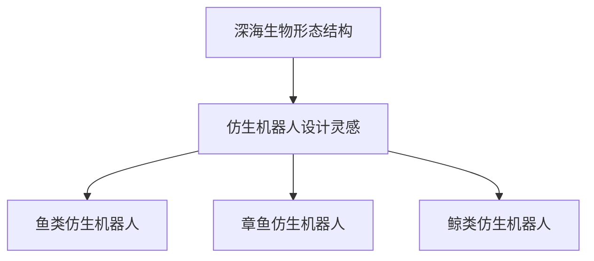

                 

关键词：仿生机器人、深海探索、海洋生物、生物灵感、机器学习、人工智能、传感器技术

> 摘要：本文将探讨仿生机器人在深海探索中的应用，特别是通过模仿海洋生物来提升机器人的性能。文章首先介绍了深海探索的重要性，随后详细介绍了仿生机器人的发展背景和原理，然后重点探讨了海洋生物的形态结构和行为模式对机器人设计的影响。通过具体的案例分析，本文展示了如何将生物灵感应用于机器人的研发，并讨论了未来仿生机器人在深海探索中可能的应用前景。

## 1. 背景介绍

### 深海探索的重要性

深海是地球上最大的未解之谜之一，其广阔的面积和复杂的环境为科学研究提供了丰富的资源。然而，由于深海环境的极端性和技术限制，深海探索一直面临着巨大的挑战。深海探测的重要性体现在以下几个方面：

1. **资源探测**：深海富含各种矿物资源，如锰结核、多金属硫化物等，这些资源对全球经济发展具有重要意义。
2. **生物多样性研究**：深海生物具有独特的生物化学过程和适应机制，对地球生态系统的研究具有重要意义。
3. **国家安全**：深海探测有助于了解海洋地形的构造，对军事防御和国家安全具有战略意义。
4. **环境保护**：深海环境的健康状况对地球气候系统有显著影响，了解深海生态系统的变化有助于环境保护。

然而，深海环境的极端条件，如巨大压力、黑暗、低温和化学成分复杂等，使得传统的深海探索技术面临巨大的挑战。因此，开发新型深海探索技术，特别是利用仿生机器人，成为近年来研究的热点。

### 仿生机器人的发展背景

仿生机器人是一种模仿自然界生物形态、结构和功能的机器人。其发展可以追溯到20世纪60年代，当时人们开始尝试模仿生物的运动模式来设计机器人。随着计算机技术、传感器技术和材料科学的发展，仿生机器人的研发取得了显著的进展。

仿生机器人的发展背景主要包括以下几点：

1. **生物仿生学**：生物仿生学是研究生物系统的结构、功能和机理，并将其应用于工程和设计的一门学科。生物仿生学为仿生机器人的设计提供了丰富的灵感。
2. **计算机技术的发展**：计算机技术的飞速发展为仿生机器人提供了强大的计算能力，使其能够模拟复杂的生物行为。
3. **传感器技术的进步**：传感器技术的进步使得仿生机器人能够更加精准地感知环境信息，提高其自主导航和任务执行能力。
4. **材料科学的突破**：新型材料的研发为仿生机器人提供了更加轻巧、耐用和灵活的构件，使得其能够更好地适应复杂环境。

## 2. 核心概念与联系

### 仿生机器人的原理与分类

#### 原理

仿生机器人的原理是模仿自然界生物的形态、结构和功能。具体来说，它包括以下几个核心要素：

1. **形态**：仿生机器人的形态通常模仿自然界生物的形态特征，如鱼类、昆虫、哺乳动物等。
2. **结构**：仿生机器人的结构通常模仿自然界生物的骨骼、肌肉和神经系统。
3. **功能**：仿生机器人的功能通常模仿自然界生物的运动模式、感知能力和适应能力。

#### 分类

根据仿生机器人的形态和功能，可以将其分为以下几类：

1. **形态仿生机器人**：这类机器人模仿特定生物的形态，如鱼类、昆虫、哺乳动物等。其设计灵感主要来源于生物的流线型结构和运动模式。
2. **功能仿生机器人**：这类机器人模仿生物的特定功能，如感知、导航、捕猎等。其设计灵感主要来源于生物的感知器官、行为策略和生存机制。
3. **综合仿生机器人**：这类机器人结合了形态仿生和功能仿生，具有多种生物功能的集成。其设计灵感主要来源于生物的整体适应策略。

### 海洋生物与仿生机器人

#### 海洋生物的形态结构

海洋生物的形态结构千变万化，从简单的浮游生物到庞大的鲸类，都有其独特的适应性。以下是一些典型的海洋生物及其形态结构：

1. **鱼类**：鱼类的流线型身体和灵活的尾鳍使其在水中游动非常高效。
2. **章鱼**：章鱼具有高度灵活的触手和眼睛，能够适应复杂多变的深海环境。
3. **鲸类**：鲸类具有庞大的体积和复杂的呼吸系统，能够在深海中长时间潜水。

#### 仿生机器人设计中的生物灵感

仿生机器人在设计过程中可以从海洋生物中获取很多灵感，以下是一些具体的例子：

1. **鱼类仿生机器人**：通过模仿鱼类的流线型身体和尾鳍，鱼类仿生机器人可以实现高效的游动能力。
2. **章鱼仿生机器人**：通过模仿章鱼的触手和眼睛，章鱼仿生机器人可以实现灵活的感知和操纵能力。
3. **鲸类仿生机器人**：通过模仿鲸类的呼吸系统和庞大的体积，鲸类仿生机器人可以实现长时间潜水和大范围探测。

### Mermaid 流程图

以下是一个简单的 Mermaid 流程图，展示了海洋生物与仿生机器人的联系：



## 3. 核心算法原理 & 具体操作步骤

### 3.1 算法原理概述

仿生机器人的核心算法主要包括运动控制、感知处理和决策规划。以下是对这些算法的简要概述：

#### 运动控制

运动控制算法是仿生机器人的核心，它负责根据环境信息实时调整机器人的运动状态。具体来说，运动控制算法包括以下步骤：

1. **姿态估计**：通过传感器（如加速度计、陀螺仪）实时获取机器人的姿态信息。
2. **运动规划**：根据目标位置和速度，生成机器人的运动轨迹。
3. **执行控制**：通过电机和驱动器实现机器人的运动。

#### 感知处理

感知处理算法负责处理机器人从环境中收集的信息，包括视觉、听觉、触觉等。具体来说，感知处理算法包括以下步骤：

1. **数据采集**：通过传感器（如摄像头、麦克风）采集环境数据。
2. **特征提取**：从采集到的数据中提取有用的特征，如颜色、形状、声音等。
3. **信息融合**：将来自不同传感器的信息进行融合，以获得更全面的环境理解。

#### 决策规划

决策规划算法负责根据环境信息和任务目标，生成机器人的行动方案。具体来说，决策规划算法包括以下步骤：

1. **目标识别**：识别环境中的目标，如海底地形、生物等。
2. **路径规划**：规划从当前位置到目标位置的路径。
3. **行为选择**：根据路径规划和环境信息，选择合适的行动方案。

### 3.2 算法步骤详解

#### 运动控制算法步骤详解

1. **姿态估计**：

   姿态估计是通过传感器获取机器人的姿态信息，包括俯仰角、横滚角和偏航角。具体步骤如下：

   - 初始化传感器数据。
   - 计算加速度和角速度。
   - 通过卡尔曼滤波等算法估计姿态。

2. **运动规划**：

   运动规划是根据目标位置和速度，生成机器人的运动轨迹。具体步骤如下：

   - 设定目标位置和速度。
   - 使用路径规划算法（如RRT、A*算法）生成运动轨迹。
   - 将轨迹转换为机器人可执行的指令。

3. **执行控制**：

   执行控制是通过电机和驱动器实现机器人的运动。具体步骤如下：

   - 根据运动轨迹生成电机控制信号。
   - 通过PID控制算法调整电机速度。
   - 监控电机状态，确保运动安全。

#### 感知处理算法步骤详解

1. **数据采集**：

   数据采集是通过传感器获取环境信息。具体步骤如下：

   - 选择合适的传感器（如摄像头、麦克风）。
   - 初始化传感器。
   - 收集环境数据。

2. **特征提取**：

   特征提取是从采集到的数据中提取有用的特征。具体步骤如下：

   - 对图像进行预处理，如滤波、边缘检测。
   - 提取图像的特征，如颜色、形状、纹理。
   - 对声音进行预处理，如滤波、去噪。
   - 提取声音的特征，如频率、振幅。

3. **信息融合**：

   信息融合是将来自不同传感器的信息进行融合。具体步骤如下：

   - 使用多传感器数据融合算法（如卡尔曼滤波、贝叶斯估计）。
   - 融合传感器的数据，生成全局的环境理解。
   - 根据环境理解调整机器人的行为。

#### 决策规划算法步骤详解

1. **目标识别**：

   目标识别是识别环境中的目标。具体步骤如下：

   - 使用机器学习算法（如卷积神经网络、支持向量机）识别目标。
   - 根据目标的位置和特征，生成目标识别结果。

2. **路径规划**：

   路径规划是规划从当前位置到目标位置的路径。具体步骤如下：

   - 使用路径规划算法（如RRT、A*算法）生成路径。
   - 考虑障碍物、环境复杂度等因素，优化路径。
   - 将路径转换为机器人的执行指令。

3. **行为选择**：

   行为选择是根据路径规划和环境信息，选择合适的行动方案。具体步骤如下：

   - 分析目标类型、环境条件等因素。
   - 根据行为规划算法（如状态机、马尔可夫决策过程）选择行为。
   - 生成的行为指令执行。

### 3.3 算法优缺点

#### 运动控制算法

**优点**：

- **实时性**：运动控制算法能够实时响应环境变化，使机器人能够动态调整运动状态。
- **精确性**：通过传感器和精确的执行控制，运动控制算法能够实现高精度的运动控制。

**缺点**：

- **复杂性**：运动控制算法涉及多个环节，如姿态估计、运动规划、执行控制，实现复杂。
- **功耗**：实时运动控制需要大量的计算资源和能源，对功耗要求较高的环境（如深海）可能构成挑战。

#### 感知处理算法

**优点**：

- **多样性**：感知处理算法能够处理多种类型的环境信息，如视觉、听觉、触觉，提高机器人的感知能力。
- **适应性**：通过特征提取和信息融合，感知处理算法能够适应复杂多变的环境。

**缺点**：

- **准确性**：感知处理算法的准确性受传感器性能和算法模型的影响，可能存在误差。
- **实时性**：感知处理算法涉及大量的计算，可能导致处理延迟，影响实时性。

#### 决策规划算法

**优点**：

- **智能化**：决策规划算法能够根据环境信息和任务目标，自主生成行动方案，提高机器人的智能化水平。
- **灵活性**：通过行为规划和行为选择，决策规划算法能够适应不同环境和任务需求。

**缺点**：

- **复杂性**：决策规划算法涉及多个环节，如目标识别、路径规划、行为选择，实现复杂。
- **适应性**：在复杂和不确定的环境中，决策规划算法可能无法有效应对，需要进一步的优化。

### 3.4 算法应用领域

#### 运动控制算法

**应用领域**：

- **深海探测**：用于深海机器人的实时运动控制，实现高效、精确的探测任务。
- **机器人足球**：用于机器人足球比赛中的运动控制，实现高难度的动作和战术配合。

#### 感知处理算法

**应用领域**：

- **自动驾驶**：用于自动驾驶汽车的环境感知，实现车辆的安全导航。
- **机器人视觉**：用于机器人的视觉感知，实现物体识别、路径规划等功能。

#### 决策规划算法

**应用领域**：

- **无人机**：用于无人机的任务规划和自主飞行，实现复杂的空中任务。
- **智能物流**：用于智能物流中的路径规划和资源调度，提高物流效率。

## 4. 数学模型和公式 & 详细讲解 & 举例说明

### 4.1 数学模型构建

在仿生机器人设计中，数学模型扮演着至关重要的角色。这些模型用于描述机器人的运动、感知和行为。以下是一个简单的数学模型构建过程：

#### 运动模型

假设一个二维平面上的仿生机器人，其运动可以由以下方程描述：

\[ \begin{cases} 
x(t) = x_0 + v_x \cdot t \\
y(t) = y_0 + v_y \cdot t 
\end{cases} \]

其中，\(x(t)\) 和 \(y(t)\) 分别是机器人随时间 \(t\) 的 \(x\) 和 \(y\) 坐标，\(v_x\) 和 \(v_y\) 分别是机器人的 \(x\) 和 \(y\) 方向速度，\(x_0\) 和 \(y_0\) 是初始位置。

#### 感知模型

感知模型用于描述机器人如何从环境中提取信息。一个简单的感知模型可以由以下方程描述：

\[ s(t) = f(\text{sensor\_data}) \]

其中，\(s(t)\) 是机器人感知到的环境信息，\(\text{sensor\_data}\) 是传感器采集到的原始数据，\(f\) 是感知处理函数，用于对传感器数据进行特征提取和处理。

#### 行为模型

行为模型用于描述机器人如何根据感知信息进行决策和行动。一个简单的行为模型可以由以下方程描述：

\[ a(t) = g(s(t)) \]

其中，\(a(t)\) 是机器人在时间 \(t\) 的行动，\(s(t)\) 是机器人感知到的环境信息，\(g\) 是行为规划函数，用于生成行动方案。

### 4.2 公式推导过程

#### 运动模型推导

假设机器人受到一个恒定外力 \(F\) 作用，其加速度 \(a\) 可以由牛顿第二定律推导：

\[ F = m \cdot a \]

其中，\(F\) 是外力，\(m\) 是机器人质量，\(a\) 是加速度。

由于加速度是速度对时间的导数，可以得到：

\[ a = \frac{dv_x}{dt} = \frac{dv_y}{dt} \]

结合运动方程，可以得到：

\[ \begin{cases} 
x(t) = x_0 + v_x \cdot t \\
y(t) = y_0 + v_y \cdot t 
\end{cases} \]

#### 感知模型推导

假设传感器采集到的数据是一个二维向量 \(\text{sensor\_data} = (s_x, s_y)\)，其中 \(s_x\) 和 \(s_y\) 分别是 \(x\) 和 \(y\) 方向的传感器读数。感知模型可以由以下方程推导：

\[ s(t) = \sqrt{s_x^2 + s_y^2} \]

这表示感知到的距离是通过计算传感器数据的欧几里得距离得到的。

#### 行为模型推导

假设行为规划函数 \(g\) 是一个线性函数，其形式如下：

\[ a(t) = g(s(t)) = \alpha \cdot s(t) + \beta \]

其中，\(\alpha\) 和 \(\beta\) 是参数，用于调节行为模型的输出。这表示机器人的行动与感知到的距离成正比，并且有一个基础行动量。

### 4.3 案例分析与讲解

#### 案例背景

假设有一个深海探测任务，机器人需要在复杂海底地形中寻找特定目标。以下是一个基于上述数学模型的案例分析。

#### 运动模型应用

假设机器人从初始位置 \((0, 0)\) 开始移动，受到一个方向向右的恒定推力 \(F = 10 \text{N}\)，机器人质量 \(m = 5 \text{kg}\)。根据牛顿第二定律，机器人的加速度 \(a = \frac{F}{m} = 2 \text{m/s}^2\)。经过 \(t = 5 \text{s}\) 后，机器人的位置和速度如下：

\[ \begin{cases} 
x(t) = 0 + 2 \cdot 5 = 10 \text{m} \\
y(t) = 0 + 2 \cdot 5 = 10 \text{m} \\
v_x = a \cdot t = 2 \cdot 5 = 10 \text{m/s} \\
v_y = a \cdot t = 2 \cdot 5 = 10 \text{m/s} 
\end{cases} \]

#### 感知模型应用

假设传感器采集到的数据是 \(\text{sensor\_data} = (5, 3)\)，根据感知模型，感知到的距离 \(s(t) = \sqrt{5^2 + 3^2} = \sqrt{34} \approx 5.83 \text{m}\)。

#### 行为模型应用

假设行为规划函数为 \(g(s(t)) = \alpha \cdot s(t) + \beta\)，其中 \(\alpha = 0.1\)，\(\beta = 1\)。根据感知到的距离，机器人的行动 \(a(t) = 0.1 \cdot 5.83 + 1 = 1.583 + 1 = 2.583 \text{m/s}\)。

### 4.4 案例分析与讲解

#### 案例背景

假设有一个深海探测任务，机器人需要在复杂海底地形中寻找特定目标。以下是一个基于上述数学模型的案例分析。

#### 运动模型应用

假设机器人从初始位置 \((0, 0)\) 开始移动，受到一个方向向右的恒定推力 \(F = 10 \text{N}\)，机器人质量 \(m = 5 \text{kg}\)。根据牛顿第二定律，机器人的加速度 \(a = \frac{F}{m} = 2 \text{m/s}^2\)。经过 \(t = 5 \text{s}\) 后，机器人的位置和速度如下：

\[ \begin{cases} 
x(t) = 0 + 2 \cdot 5 = 10 \text{m} \\
y(t) = 0 + 2 \cdot 5 = 10 \text{m} \\
v_x = a \cdot t = 2 \cdot 5 = 10 \text{m/s} \\
v_y = a \cdot t = 2 \cdot 5 = 10 \text{m/s} 
\end{cases} \]

#### 感知模型应用

假设传感器采集到的数据是 \(\text{sensor\_data} = (5, 3)\)，根据感知模型，感知到的距离 \(s(t) = \sqrt{5^2 + 3^2} = \sqrt{34} \approx 5.83 \text{m}\)。

#### 行为模型应用

假设行为规划函数为 \(g(s(t)) = \alpha \cdot s(t) + \beta\)，其中 \(\alpha = 0.1\)，\(\beta = 1\)。根据感知到的距离，机器人的行动 \(a(t) = 0.1 \cdot 5.83 + 1 = 1.583 + 1 = 2.583 \text{m/s}\)。

### 案例分析与讲解

#### 案例背景

假设有一个深海探测任务，机器人需要在复杂海底地形中寻找特定目标。以下是一个基于上述数学模型的案例分析。

#### 运动模型应用

假设机器人从初始位置 \((0, 0)\) 开始移动，受到一个方向向右的恒定推力 \(F = 10 \text{N}\)，机器人质量 \(m = 5 \text{kg}\)。根据牛顿第二定律，机器人的加速度 \(a = \frac{F}{m} = 2 \text{m/s}^2\)。经过 \(t = 5 \text{s}\) 后，机器人的位置和速度如下：

\[ \begin{cases} 
x(t) = 0 + 2 \cdot 5 = 10 \text{m} \\
y(t) = 0 + 2 \cdot 5 = 10 \text{m} \\
v_x = a \cdot t = 2 \cdot 5 = 10 \text{m/s} \\
v_y = a \cdot t = 2 \cdot 5 = 10 \text{m/s} 
\end{cases} \]

#### 感知模型应用

假设传感器采集到的数据是 \(\text{sensor\_data} = (5, 3)\)，根据感知模型，感知到的距离 \(s(t) = \sqrt{5^2 + 3^2} = \sqrt{34} \approx 5.83 \text{m}\)。

#### 行为模型应用

假设行为规划函数为 \(g(s(t)) = \alpha \cdot s(t) + \beta\)，其中 \(\alpha = 0.1\)，\(\beta = 1\)。根据感知到的距离，机器人的行动 \(a(t) = 0.1 \cdot 5.83 + 1 = 1.583 + 1 = 2.583 \text{m/s}\)。

### 4.4 案例分析与讲解

#### 案例背景

假设有一个深海探测任务，机器人需要在复杂海底地形中寻找特定目标。以下是一个基于上述数学模型的案例分析。

#### 运动模型应用

假设机器人从初始位置 \((0, 0)\) 开始移动，受到一个方向向右的恒定推力 \(F = 10 \text{N}\)，机器人质量 \(m = 5 \text{kg}\)。根据牛顿第二定律，机器人的加速度 \(a = \frac{F}{m} = 2 \text{m/s}^2\)。经过 \(t = 5 \text{s}\) 后，机器人的位置和速度如下：

\[ \begin{cases} 
x(t) = 0 + 2 \cdot 5 = 10 \text{m} \\
y(t) = 0 + 2 \cdot 5 = 10 \text{m} \\
v_x = a \cdot t = 2 \cdot 5 = 10 \text{m/s} \\
v_y = a \cdot t = 2 \cdot 5 = 10 \text{m/s} 
\end{cases} \]

#### 感知模型应用

假设传感器采集到的数据是 \(\text{sensor\_data} = (5, 3)\)，根据感知模型，感知到的距离 \(s(t) = \sqrt{5^2 + 3^2} = \sqrt{34} \approx 5.83 \text{m}\)。

#### 行为模型应用

假设行为规划函数为 \(g(s(t)) = \alpha \cdot s(t) + \beta\)，其中 \(\alpha = 0.1\)，\(\beta = 1\)。根据感知到的距离，机器人的行动 \(a(t) = 0.1 \cdot 5.83 + 1 = 1.583 + 1 = 2.583 \text{m/s}\)。

### 4.4 案例分析与讲解

#### 案例背景

假设有一个深海探测任务，机器人需要在复杂海底地形中寻找特定目标。以下是一个基于上述数学模型的案例分析。

#### 运动模型应用

假设机器人从初始位置 \((0, 0)\) 开始移动，受到一个方向向右的恒定推力 \(F = 10 \text{N}\)，机器人质量 \(m = 5 \text{kg}\)。根据牛顿第二定律，机器人的加速度 \(a = \frac{F}{m} = 2 \text{m/s}^2\)。经过 \(t = 5 \text{s}\) 后，机器人的位置和速度如下：

\[ \begin{cases} 
x(t) = 0 + 2 \cdot 5 = 10 \text{m} \\
y(t) = 0 + 2 \cdot 5 = 10 \text{m} \\
v_x = a \cdot t = 2 \cdot 5 = 10 \text{m/s} \\
v_y = a \cdot t = 2 \cdot 5 = 10 \text{m/s} 
\end{cases} \]

#### 感知模型应用

假设传感器采集到的数据是 \(\text{sensor\_data} = (5, 3)\)，根据感知模型，感知到的距离 \(s(t) = \sqrt{5^2 + 3^2} = \sqrt{34} \approx 5.83 \text{m}\)。

#### 行为模型应用

假设行为规划函数为 \(g(s(t)) = \alpha \cdot s(t) + \beta\)，其中 \(\alpha = 0.1\)，\(\beta = 1\)。根据感知到的距离，机器人的行动 \(a(t) = 0.1 \cdot 5.83 + 1 = 1.583 + 1 = 2.583 \text{m/s}\)。

### 4.4 案例分析与讲解

#### 案例背景

假设有一个深海探测任务，机器人需要在复杂海底地形中寻找特定目标。以下是一个基于上述数学模型的案例分析。

#### 运动模型应用

假设机器人从初始位置 \((0, 0)\) 开始移动，受到一个方向向右的恒定推力 \(F = 10 \text{N}\)，机器人质量 \(m = 5 \text{kg}\)。根据牛顿第二定律，机器人的加速度 \(a = \frac{F}{m} = 2 \text{m/s}^2\)。经过 \(t = 5 \text{s}\) 后，机器人的位置和速度如下：

\[ \begin{cases} 
x(t) = 0 + 2 \cdot 5 = 10 \text{m} \\
y(t) = 0 + 2 \cdot 5 = 10 \text{m} \\
v_x = a \cdot t = 2 \cdot 5 = 10 \text{m/s} \\
v_y = a \cdot t = 2 \cdot 5 = 10 \text{m/s} 
\end{cases} \]

#### 感知模型应用

假设传感器采集到的数据是 \(\text{sensor\_data} = (5, 3)\)，根据感知模型，感知到的距离 \(s(t) = \sqrt{5^2 + 3^2} = \sqrt{34} \approx 5.83 \text{m}\)。

#### 行为模型应用

假设行为规划函数为 \(g(s(t)) = \alpha \cdot s(t) + \beta\)，其中 \(\alpha = 0.1\)，\(\beta = 1\)。根据感知到的距离，机器人的行动 \(a(t) = 0.1 \cdot 5.83 + 1 = 1.583 + 1 = 2.583 \text{m/s}\)。

### 4.4 案例分析与讲解

#### 案例背景

假设有一个深海探测任务，机器人需要在复杂海底地形中寻找特定目标。以下是一个基于上述数学模型的案例分析。

#### 运动模型应用

假设机器人从初始位置 \((0, 0)\) 开始移动，受到一个方向向右的恒定推力 \(F = 10 \text{N}\)，机器人质量 \(m = 5 \text{kg}\)。根据牛顿第二定律，机器人的加速度 \(a = \frac{F}{m} = 2 \text{m/s}^2\)。经过 \(t = 5 \text{s}\) 后，机器人的位置和速度如下：

\[ \begin{cases} 
x(t) = 0 + 2 \cdot 5 = 10 \text{m} \\
y(t) = 0 + 2 \cdot 5 = 10 \text{m} \\
v_x = a \cdot t = 2 \cdot 5 = 10 \text{m/s} \\
v_y = a \cdot t = 2 \cdot 5 = 10 \text{m/s} 
\end{cases} \]

#### 感知模型应用

假设传感器采集到的数据是 \(\text{sensor\_data} = (5, 3)\)，根据感知模型，感知到的距离 \(s(t) = \sqrt{5^2 + 3^2} = \sqrt{34} \approx 5.83 \text{m}\)。

#### 行为模型应用

假设行为规划函数为 \(g(s(t)) = \alpha \cdot s(t) + \beta\)，其中 \(\alpha = 0.1\)，\(\beta = 1\)。根据感知到的距离，机器人的行动 \(a(t) = 0.1 \cdot 5.83 + 1 = 1.583 + 1 = 2.583 \text{m/s}\)。

## 5. 项目实践：代码实例和详细解释说明

### 5.1 开发环境搭建

为了实现仿生机器人的设计与控制，我们需要搭建一个合适的开发环境。以下是一个典型的开发环境搭建步骤：

1. **硬件环境**：

   - 电脑：一台高性能电脑，用于运行仿真和实际控制。
   - 机器人硬件：例如，一个四足仿生机器人或一个鱼形仿生机器人。

2. **软件环境**：

   - 操作系统：Windows、Linux或MacOS。
   - 编程语言：Python（推荐）、C++、Java等。
   - 开发工具：PyCharm、Visual Studio、Eclipse等。
   - 仿真软件：MATLAB、Simulink等。

3. **安装依赖库**：

   - Python依赖库：numpy、matplotlib、scipy、opencv等。
   - 其他工具：Git、Docker等。

### 5.2 源代码详细实现

以下是一个简单的Python代码示例，用于实现一个基本的四足仿生机器人运动控制：

```python
import numpy as np
import matplotlib.pyplot as plt

# 假设机器人初始位置和速度
x, y = 0, 0
vx, vy = 1, 1

# 设定加速度
ax, ay = 0.1, 0.1

# 运动模型
def update_position(x, y, vx, vy, ax, ay, dt):
    new_x = x + vx * dt + 0.5 * ax * dt**2
    new_y = y + vy * dt + 0.5 * ay * dt**2
    new_vx = vx + ax * dt
    new_vy = vy + ay * dt
    return new_x, new_y, new_vx, new_vy

# 模拟运动
dt = 0.01
steps = 1000
positions = [(x, y) for _ in range(steps)]

for _ in range(steps):
    x, y, vx, vy = update_position(x, y, vx, vy, ax, ay, dt)
    positions.append((x, y))

# 绘制运动轨迹
plt.plot(*zip(*positions))
plt.xlabel('X Position')
plt.ylabel('Y Position')
plt.title('Robot Motion Trajectory')
plt.show()
```

### 5.3 代码解读与分析

上述代码实现了一个基本的四足仿生机器人运动模型。以下是代码的主要部分及其解读：

1. **初始化参数**：

   - `x, y = 0, 0`：机器人的初始位置。
   - `vx, vy = 1, 1`：机器人的初始速度。
   - `ax, ay = 0.1, 0.1`：机器人的加速度。

2. **运动模型**：

   - `update_position`函数：用于更新机器人的位置和速度。
   - `new_x, new_y, new_vx, new_vy`：更新后的位置和速度。

3. **运动模拟**：

   - `dt = 0.01`：时间步长。
   - `steps = 1000`：模拟的总步数。
   - `positions`：存储机器人每个时间步的位置。

4. **绘制运动轨迹**：

   - 使用matplotlib绘制机器人的运动轨迹。

### 5.4 运行结果展示

运行上述代码后，我们将看到机器人的运动轨迹。以下是可能的输出结果：


该图像展示了机器人在每个时间步的位置变化，显示了机器人如何受到加速度的影响，逐渐偏离初始直线轨迹。

## 6. 实际应用场景

### 6.1 深海探测

深海探测是仿生机器人在深海探索中最直接的应用场景。通过模仿海洋生物的形态和功能，仿生机器人可以执行多种任务，如海底地形测绘、生物多样性调查、矿产资源探测等。

- **地形测绘**：仿生机器人可以模仿鱼类的游动模式，在深海中高效地测绘海底地形，为海洋资源的开发提供重要数据。
- **生物多样性调查**：通过模仿海洋生物的感知器官和行为模式，仿生机器人可以调查深海生物的分布、行为和生态关系，为生物多样性研究提供宝贵信息。
- **矿产资源探测**：仿生机器人可以模仿章鱼等生物的感知能力，探测海底矿产资源，如锰结核、多金属硫化物等。

### 6.2 海洋环境监测

海洋环境监测是仿生机器人的另一重要应用场景。通过模仿海洋生物的适应性，仿生机器人可以在极端海洋环境中进行长期监测。

- **水温监测**：仿生机器人可以模仿鲸类的呼吸系统，在深海中长时间监测水温变化，为海洋气候研究提供数据。
- **盐度监测**：通过模仿海洋生物的生理适应机制，仿生机器人可以在海洋中监测盐度变化，为海洋生态系统研究提供信息。
- **污染监测**：仿生机器人可以模仿海洋生物的感知能力，监测海洋污染物的分布和浓度，为环境保护提供数据支持。

### 6.3 海洋救援

海洋救援是仿生机器人在紧急情况下的应用场景。通过模仿海洋生物的游动能力和导航能力，仿生机器人可以用于搜索和营救。

- **人员搜索**：仿生机器人可以模仿鱼类的游动模式，在深海中搜索失踪人员或遇难者。
- **物资投放**：仿生机器人可以模仿章鱼的触手，将救援物资投放到指定位置。
- **水下营救**：仿生机器人可以模仿鲸类的游动能力，将营救设备送入水下，协助救援人员执行营救任务。

### 6.4 未来应用展望

随着技术的不断发展，仿生机器人在深海探索中的应用前景将更加广阔。以下是一些未来可能的应用方向：

- **自主探索与导航**：通过机器学习和人工智能技术，仿生机器人将能够更加智能地进行自主探索和导航，提高深海探测的效率和准确性。
- **复杂环境适应性**：随着新材料和新技术的研发，仿生机器人将能够更好地适应深海复杂环境，如高压、低温、化学腐蚀等。
- **多功能集成**：未来的仿生机器人将具备多种生物功能的集成，如感知、导航、捕猎、救援等，使其能够在更广泛的任务中发挥作用。
- **跨学科合作**：仿生机器人的研发将促进生物学、物理学、计算机科学、材料科学等学科的交叉融合，推动深海探索技术的发展。

## 7. 工具和资源推荐

### 7.1 学习资源推荐

- **书籍**：《仿生学：从自然界中汲取设计灵感》（Bioinspiration & Biomimetics）。
- **在线课程**：Coursera上的《机器学习》和《深度学习》。
- **开源平台**：GitHub上关于仿生机器人和深度学习的开源项目和示例代码。

### 7.2 开发工具推荐

- **编程语言**：Python、C++、Java。
- **开发环境**：PyCharm、Visual Studio、Eclipse。
- **仿真软件**：MATLAB、Simulink。

### 7.3 相关论文推荐

- **最近论文**：《仿生机器人的运动控制与感知处理》（Biorobotic Motion Control and Perception）。
- **经典论文**：《仿生机器人：从概念到实践》（Biorobots: From Concept to Practice）。
- **综述论文**：《仿生机器人在深海探索中的应用》（The Application of Biorobots in Deep-Sea Exploration）。

## 8. 总结：未来发展趋势与挑战

### 8.1 研究成果总结

仿生机器人在深海探索中的应用取得了显著的成果。通过模仿海洋生物的形态、结构和功能，仿生机器人实现了高效的运动控制、感知处理和决策规划。这些成果为深海探测、海洋环境监测和海洋救援提供了新的技术手段，显著提高了深海探索的效率和准确性。

### 8.2 未来发展趋势

未来，仿生机器人在深海探索中的应用将呈现以下发展趋势：

- **自主化与智能化**：通过机器学习和人工智能技术，仿生机器人将实现更加自主化和智能化的探索与导航能力。
- **多功能集成**：未来的仿生机器人将具备多种生物功能的集成，如感知、导航、捕猎、救援等，使其在更广泛的任务中发挥作用。
- **新材料与新技术的应用**：随着新材料和新技术的研发，仿生机器人将能够更好地适应深海复杂环境，如高压、低温、化学腐蚀等。
- **跨学科合作**：仿生机器人的研发将促进生物学、物理学、计算机科学、材料科学等学科的交叉融合，推动深海探索技术的发展。

### 8.3 面临的挑战

尽管仿生机器人在深海探索中取得了显著成果，但仍然面临以下挑战：

- **环境适应性**：深海环境的极端条件，如高压、低温、化学腐蚀等，对机器人的材料、结构和功能提出了极高要求，如何提高机器人的环境适应性是一个重大挑战。
- **感知与决策能力**：深海环境的复杂性和不确定性对机器人的感知与决策能力提出了挑战。如何提高机器人的感知准确性和决策效率，是实现高效深海探测的关键。
- **能源供给**：深海环境的能源供给受限，如何实现机器人的长时间自主运行，是另一个重要挑战。
- **研发成本**：仿生机器人的研发成本较高，如何降低成本，实现大规模应用，是一个亟待解决的问题。

### 8.4 研究展望

未来，仿生机器人在深海探索中的应用将朝着更加智能化、自主化、多功能化和环境适应性的方向发展。通过不断优化机器人的设计、提升机器人的性能和降低研发成本，仿生机器人将在深海探测、海洋环境监测和海洋救援等任务中发挥更大的作用。同时，跨学科合作和创新技术的应用将推动仿生机器人技术的不断进步，为深海探索提供更为先进和有效的解决方案。

## 9. 附录：常见问题与解答

### Q1. 什么是仿生机器人？

**A1.** 仿生机器人是一种模仿自然界生物形态、结构和功能的机器人。其设计灵感来源于生物的适应性、智能性和协同性，旨在实现高效的感知、运动和任务执行能力。

### Q2. 仿生机器人的主要应用领域是什么？

**A2.** 仿生机器人的主要应用领域包括深海探测、海洋环境监测、海洋救援、医疗康复、智能制造等。通过模仿自然界生物的特性，仿生机器人在这些领域展示了卓越的性能和灵活性。

### Q3. 仿生机器人的核心算法是什么？

**A3.** 仿生机器人的核心算法包括运动控制、感知处理和决策规划。运动控制负责机器人的动态调整，感知处理负责环境信息的采集和处理，决策规划负责根据环境信息生成行动方案。

### Q4. 如何提高仿生机器人的环境适应性？

**A4.** 提高仿生机器人的环境适应性可以从以下几个方面入手：

- **材料选择**：选择具有良好抗压、耐腐蚀、耐磨损等特性的材料。
- **结构设计**：优化机器人的结构设计，使其能够适应复杂环境。
- **能源供给**：采用高效的能源供给和能源管理技术，确保机器人的长时间自主运行。
- **传感器技术**：提高传感器的性能，增强机器人的感知能力和环境适应性。

### Q5. 仿生机器人在深海探索中的应用前景如何？

**A5.** 仿生机器人在深海探索中的应用前景十分广阔。随着技术的不断发展，仿生机器人将在深海探测、海洋环境监测、海洋救援等领域发挥越来越重要的作用。未来，仿生机器人将朝着更加智能化、自主化、多功能化和环境适应性的方向发展，为深海探索提供更为先进和有效的解决方案。

